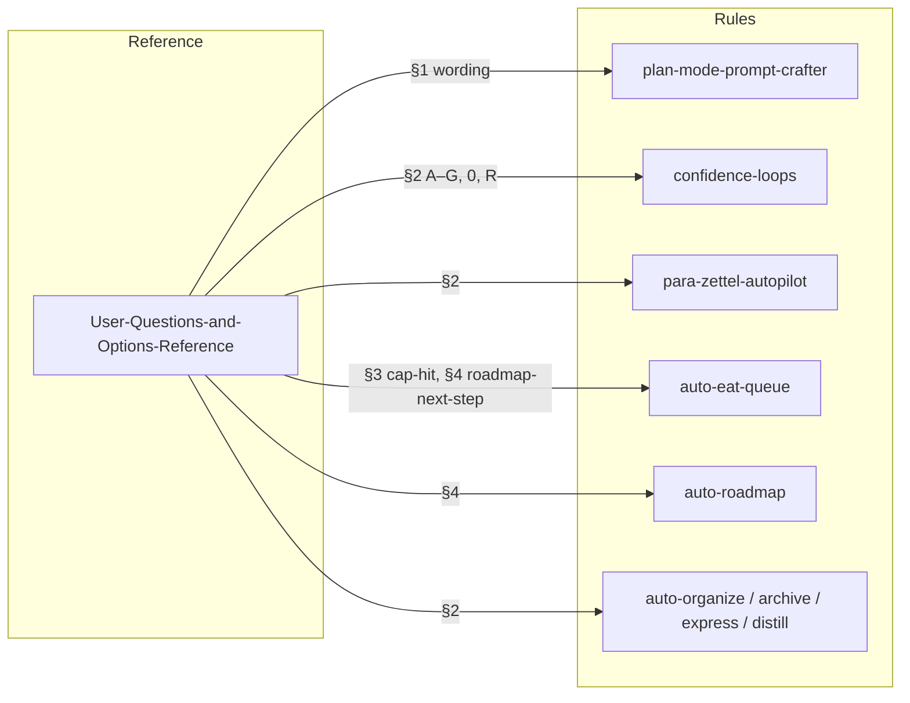

# Agent Questions Reference Integration Plan

## Goal

Prompt the agent to ask the **proper questions** by making [User-Questions-and-Options-Reference.md](3-Resources/Second-Brain/User-Questions-and-Options-Reference.md) the single source of truth for question wording and option labels. The reference is already the canonical list; it is not currently in the rule chain the agent follows.

## Current gap

- **Plan-mode**: Rule references Prompt-Crafter-Structure-Detailed and Prompt-Crafter-Param-Table (order and structure) but not User-Questions-and-Options-Reference (exact wording). The agent infers question text from param names, so wording and mode-narrowing questions drift.
- **Decision Wrappers / roadmap-next-step / cap-hit**: Rules say "fill options A–G" and mention 0/R/cap-hit options in prose, but do not point to the reference for exact labels and semantics (e.g. roadmap-next-step A=deepen, B=recal, …).

## Implementation

### 1. Plan-mode rule: add reference and wording instruction

**File:** [.cursor/rules/context/plan-mode-prompt-crafter.mdc](.cursor/rules/context/plan-mode-prompt-crafter.mdc)

- **Reference line:** In the bullet that lists Reference docs (around line 11), add:  
`[User-Questions-and-Options-Reference](3-Resources/Second-Brain/User-Questions-and-Options-Reference.md) (§1 Plan-mode) for exact question text and option wording.`
- **Invariant:** Add a short bullet under "Order invariant" or "Invariants":  
*Question text and option labels must match User-Questions-and-Options-Reference §1 (kickoff Q0, mode-narrowing, per-param A/B/C, manual text phase, final "Append to queue?"). Ask one question per message; use reference for exact wording.*
- **Step 3 (Narrow mode):** Make the mode-narrowing step explicitly a **single question** per branch:
  - **CODE:** Ask one question: "Which pipeline or task mode?" with options from [Queue-Alias-Table](3-Resources/Second-Brain/Queue-Alias-Table.md) (INGEST MODE, ORGANIZE MODE, DISTILL MODE, EXPRESS MODE, ARCHIVE MODE, or task modes) — wording per User-Questions-and-Options-Reference §1 "Then by branch → CODE".
  - **ROADMAP:** Ask one question: "ROADMAP MODE vs RESUME-ROADMAP"; if RESUME-ROADMAP, optionally one question "Which action?" (deepen, recal, …) per reference §1.

No change to step 7 (queue append) or routing logic.

### 2. Prompt-Crafter-Structure-Detailed: point to reference

**File:** [3-Resources/Second-Brain/Second-Brain-User-Flows/Prompt-Crafter-Structure-Detailed.md](3-Resources/Second-Brain/Second-Brain-User-Flows/Prompt-Crafter-Structure-Detailed.md)

- In **Plan-mode crafting entrypoints** (around line 24) or **Plan-mode Q&A pattern** (around line 74): add one sentence:  
*For exact question text and option wording in presentation order, use [[3-Resources/Second-Brain/User-Questions-and-Options-Reference|User-Questions-and-Options-Reference]] §1.*
- Add User-Questions-and-Options-Reference to the **Cross-references** list at the end of the Plan-mode section if present, or in the doc’s links frontmatter.

This keeps the doc chain consistent so anyone (or any tool) following Structure-Detailed is directed to the reference.

### 3. Decision Wrapper creation: use reference for option semantics

**Files to touch:**

- [.cursor/rules/always/confidence-loops.mdc](.cursor/rules/always/confidence-loops.mdc) — low-confidence and mid-band wrapper bullets (e.g. "fill options A–G with …").
- [.cursor/rules/context/para-zettel-autopilot.mdc](.cursor/rules/context/para-zettel-autopilot.mdc) — ingest Decision Wrapper creation.
- [.cursor/rules/context/auto-eat-queue.mdc](.cursor/rules/context/auto-eat-queue.mdc) — cap-hit wrapper creation; roadmap-next-step approved_option → action mapping.
- [.cursor/rules/context/auto-roadmap.mdc](.cursor/rules/context/auto-roadmap.mdc) — roadmap-next-step creation and approved_option → action.
- [.cursor/rules/context/auto-organize.mdc](.cursor/rules/context/auto-organize.mdc), [.cursor/rules/context/auto-archive.mdc](.cursor/rules/context/auto-archive.mdc), [.cursor/rules/context/auto-express.mdc](.cursor/rules/context/auto-express.mdc), [.cursor/rules/context/auto-distill.mdc](.cursor/rules/context/auto-distill.mdc) — "fill options A–G" for Refinements and Low-Confidence.

**Change (same idea in each):**

- Add a single instruction where wrappers are created or options are filled:  
*Use the option labels and meanings from [User-Questions-and-Options-Reference](3-Resources/Second-Brain/User-Questions-and-Options-Reference.md) §2 (Decision Wrappers: A–G, 0, R, re-wrap).*
- **Cap-hit:** In auto-eat-queue where the cap-hit wrapper is created, add:  
*Options per reference §3: A = Force approve, B = Prune branch, 0 = Re-wrap full phase.*
- **Roadmap-next-step:** Where roadmap-next-step wrappers are created or where `approved_option` is mapped to `params.action`, add:  
*Letter→action mapping per reference §4: A=deepen, B=recal, C=advance-phase, D=raise cap and continue, E=revert-phase, F=sync-outputs then deepen, 0=re-wrap.*

Prefer adding one clear sentence that points to the reference section rather than duplicating the full option tables in the rule.

### 4. Param table: reference as wording source

**File:** [3-Resources/Second-Brain/Prompt-Crafter-Param-Table.md](3-Resources/Second-Brain/Prompt-Crafter-Param-Table.md)

- In the intro (after "Single source for which params…"), add one line:  
*Canonical question text and option wording for Plan-mode are in [[3-Resources/Second-Brain/User-Questions-and-Options-Reference|User-Questions-and-Options-Reference]] §1; the agent should use that doc for exact phrasing and order.*  
No new columns or duplicated text; the reference remains the single source for wording.

### 5. Rules.md and backbone docs

**File:** [3-Resources/Second-Brain/Rules.md](3-Resources/Second-Brain/Rules.md)

- In the **Context (triggered)** table, plan-mode row ("plan-mode-prompt-crafter.mdc"): add to the Responsibilities cell that Plan-mode uses User-Questions-and-Options-Reference §1 for question text and options.
- Optionally add a short **Questions and options** subsection under the table:  
*User-facing questions and option labels (Plan-mode, Decision Wrappers, cap-hit, roadmap-next-step, Commander Craft Prompt) are defined in [[3-Resources/Second-Brain/User-Questions-and-Options-Reference|User-Questions-and-Options-Reference]]; rules and skills that present questions or create wrappers should follow that doc.*

Per [.cursor/rules/always/backbone-docs-sync.mdc](.cursor/rules/always/backbone-docs-sync.mdc), any rule change should be reflected in Rules.md; the above satisfies that and makes the reference discoverable.

### 6. Commander "Craft Prompt" (optional)

**User-Questions-and-Options-Reference §5** defines the Commander "Craft Prompt" macro: Pipeline (ingest | organize), Profile (default | project-priority), Then (Preview Assembly | Craft and Queue). There is no dedicated context rule that triggers on "Craft Prompt" today; Plan-mode is the main crafting flow. If a rule or skill is later added for Commander Craft Prompt, it should be instructed to use User-Questions-and-Options-Reference §5 for those questions in order. No code change in this plan; only document this in the plan so future work ties §5 into the agent when that flow is implemented.

---

## Flow after changes

The agent will have an explicit instruction in each relevant rule to use the reference for question text and option semantics, so the questions it asks align with what you expect in User-Questions-and-Options-Reference.

---

## Sync and validation

- **Sync:** After editing `.cursor/rules/*.mdc`, update corresponding files under `.cursor/sync/` per backbone-docs-sync (e.g. `.cursor/sync/rules/context/plan-mode-prompt-crafter.md`, etc.) and add a brief changelog entry to `.cursor/sync/changelog.md`.
- **Validation:** Run a short Plan-mode session ("We are making a prompt") and confirm the agent asks Q0 "Which kind?" with A. CODE / B. ROADMAP, then mode-narrowing and optionals in reference order with matching wording. Optionally create a mid-band or low-confidence wrapper and confirm options include 0 and R and match reference §2.

---

## Files to modify (summary)

| File                                                                                                  | Change                                                                                                                                                            |
| ----------------------------------------------------------------------------------------------------- | ----------------------------------------------------------------------------------------------------------------------------------------------------------------- |
| `.cursor/rules/context/plan-mode-prompt-crafter.mdc`                                                  | Add User-Questions-and-Options-Reference to references; add invariant for question wording; make step 3 explicit single-question mode-narrowing per reference §1. |
| `3-Resources/Second-Brain/Second-Brain-User-Flows/Prompt-Crafter-Structure-Detailed.md`               | Add pointer to User-Questions-and-Options-Reference §1 for exact wording.                                                                                         |
| `.cursor/rules/always/confidence-loops.mdc`                                                           | Add "use reference §2 for option labels (A–G, 0, R, re-wrap)" where Decision Wrappers are created.                                                                |
| `.cursor/rules/context/para-zettel-autopilot.mdc`                                                     | Add same reference §2 for wrapper options.                                                                                                                        |
| `.cursor/rules/context/auto-eat-queue.mdc`                                                            | Reference §3 for cap-hit options; §4 for roadmap-next-step letter→action.                                                                                         |
| `.cursor/rules/context/auto-roadmap.mdc`                                                              | Reference §4 for roadmap-next-step options when creating or applying wrapper.                                                                                     |
| `.cursor/rules/context/auto-organize.mdc`, `auto-archive.mdc`, `auto-express.mdc`, `auto-distill.mdc` | Add "option labels per reference §2" where they create Refinements or Low-Confidence wrappers.                                                                    |
| `3-Resources/Second-Brain/Prompt-Crafter-Param-Table.md`                                              | One intro sentence: canonical wording in User-Questions-and-Options-Reference §1.                                                                                 |
| `3-Resources/Second-Brain/Rules.md`                                                                   | Plan-mode row + optional "Questions and options" subsection pointing to reference.                                                                                |
| `.cursor/sync/`* and `changelog.md`                                                                   | Sync updated rules; changelog entry for reference integration.                                                                                                    |

