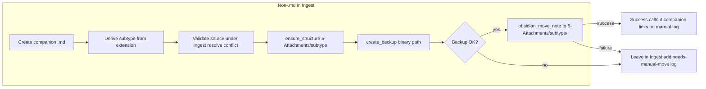

# Auto-move non-markdown ingest files to 5-Attachments (v1.0)

## Current state

- **Markdown** in Ingest: full pipeline runs; notes are moved to 1-Projects/, 2-Areas/, or 3-Resources/ via `obsidian_move_note`.
- **Non-markdown**: [non-markdown-handling.mdc](.cursor/rules/context/non-markdown-handling.mdc) creates a companion .md (which is then ingested and moved), but the **original file stays in Ingest/** with `#needs-manual-move`; the user must manually move it to `5-Attachments/PDFs|Images|Audio|Documents|Other/`.
- Rules explicitly forbid using `obsidian_move_note` on binaries and forbid shell `mv/cp/rm` ([mcp-obsidian-integration.mdc](.cursor/rules/always/mcp-obsidian-integration.mdc), [ingest-processing.mdc](.cursor/rules/context/ingest-processing.mdc)).

## Goal

Non-markdown files should be **moved automatically** to `5-Attachments/[subtype]/` (PDFs/, Images/, Audio/, Documents/, Other/) after the companion .md is created, so the user does not have to move them manually.

## Approach

**Primary:** Use the existing MCP tool `obsidian_move_note` for non-.md files when the destination is strictly under `5-Attachments/[subtype]/`. The tool schema does not restrict to .md; the “only .md” rule is a conservative convention. Many Obsidian/MCP implementations move any vault file. So we:

1. After creating the companion .md and determining subtype: validate source exists under Ingest/ and resolve destination conflicts (rename with timestamp if target exists). Call `obsidian_ensure_structure` for `5-Attachments/<subtype>/`, then `obsidian_create_backup` on the binary path. **Only if backup succeeds** call `obsidian_move_note` to the final path (optional dry_run first for binaries).
2. If the move succeeds: set companion source to final path; add success callout `> [!success] File auto-moved to [[5-Attachments/subtype/filename]].`; do not add `#needs-manual-move`; set the companion’s source to the final path and omit the “manual move” callout (or replace with “File moved to 5-Attachments/…”).
3. If the move fails (e.g. server returns “only markdown supported” or path error): keep current behavior — leave file in Ingest/, add `#needs-manual-move` and the manual-move callout, and log with categorized reason (see Refinements §4). If backup failed, do not attempt move.

**Fallback (if MCP never moves binaries):** Optional **move-attachment-to-99** skill — **explicit user invocation only** (e.g. "Invoke move-attachment for [file]?"; no auto-trigger), with **built-in backup** before `mv`. Document the single exception in the MCP rule. The skill performs a single, strictly validated filesystem move (source: `Ingest/`, destination: `5-Attachments/<subtype>/` only): “Exception: the move-attachment skill may run `mv` only for this scoped operation.” User must confirm they accept this exception.

## Subtype mapping (already in rules)

Use the same mapping as [non-markdown-handling.mdc](.cursor/rules/context/non-markdown-handling.mdc) “File-type specifics”:

| Type        | Extensions / notes                         | 5-Attachments subfolder |
| ----------- | ------------------------------------------ | ------------------------ |
| Images      | .png, .jpg, .jpeg, .gif, .webp, .svg, .bmp | Images/                  |
| PDFs        | .pdf                                       | PDFs/                    |
| Documents   | .docx, .xlsx, .pptx                        | Documents/               |
| Audio/Video | (audio/video extensions)                   | Audio/                   |
| Other       | .zip, .txt, .csv, .json, .py, etc.         | Other/                   |

Prefer a configurable source (e.g. `3-Resources/Attachment-Subtype-Mapping.md`) when present; unknown extensions default to `Other/`. Edge cases: `.md.txt` as text (Other/); very large files (e.g. >100MB) optional warning only.

Destination path: `5-Attachments/<subtype>/<original-filename>` (preserve filename; rename on conflict per below).

---

## Refinements (safety, robustness, usability)

### 1. Validation and conflict resolution before moves

- **Pre-move checks:** Before calling `obsidian_move_note`, validate: (a) source file exists and path is under `Ingest/` (e.g. via list or read; log if unavailable); (b) destination path does not already exist (query via MCP if possible).
- **Conflict handling:** If destination already exists, auto-rename: append timestamp (e.g. `filename_YYYYMMDD_HHMMSS.ext`) or unique suffix; use that as final path. Update the companion note's `source` link to the actual moved path (e.g. `![[5-Attachments/subtype/filename_20260301_1751.ext]]`). Document in non-markdown-handling: "Prior to move, check for destination conflicts; if present, rename with timestamp and adjust companion source link."

### 2. Backup as prerequisite (already in Approach)

- Only proceed to `obsidian_move_note` if `obsidian_create_backup` succeeds. If backup fails: immediate fallback to manual move mode, add `#needs-manual-move`, log specific error (e.g. "Server does not support binary backups") and suggest external vault backups.
- For the optional move-attachment skill: enforce a built-in backup step (e.g. copy to temporary or `Ingest/Backups/` before `mv`) so the exception stays narrow and safe.

### 3. Subtype mapping: configurable and extensible

- **Configurable reference:** Add a single source of truth for extension → subtype, e.g. `3-Resources/Attachment-Subtype-Mapping.md` (or JSON under `.cursor/config/`). Rules reference it; default table remains in non-markdown-handling for when the file is missing.
- **Fallback:** If an extension does not match any row, default to `Other/` and log a suggestion to update the mapping (e.g. for future `.heic` or new types).
- **Edge cases:** Document handling for: `.md.txt` (treat as text → Other/); very large files (e.g. >100MB) — optional warning in companion or log, no change to move logic unless a separate rule is added.

### 4. Error handling and logging

- **Categorize failures** in Ingest-Log / Errors.md:
  - "Server rejection: Binary moves not supported" → suggest invoking move-attachment skill if available (user-initiated only).
  - "Path error or conflict" → attempt rename and retry move (per refinement 1).
  - "Backup failed" → do not move; fallback to manual.
  - "Network/timeout" → suggest retry on next ingest run.
- **Companion callout on failure:** Add a callout with the exact error, e.g. `> [!warning] Move failed due to [reason]. Manual move required to [[5-Attachments/subtype/filename]].`
- **Dry-run:** Where supported, attempt `obsidian_move_note(..., dry_run: true)` first for non-.md; if the tool errors or does not support it for binaries, skip dry-run and log, then proceed to actual move after backup success.

### 5. Usability and user feedback

- **Opt-out:** If the companion note (or a tag on the original) has `#skip-auto-move`, skip the automatic move; leave in Ingest/ with manual-move callout.
- **Success callout:** On successful move, always add to the companion: `> [!success] File auto-moved to [[5-Attachments/subtype/filename]].`
- **Move-attachment skill:** Invoked only by explicit user request (e.g. "Invoke move-attachment for [file]?"); never auto-trigger, to preserve consent for the shell exception.
- **Testing:** Optional "simulation mode" — log intended moves (source → destination) without executing; user confirms before going live.

### 6. Documentation and sync

- **Changelog template:** In backbone-docs-sync or Logs.md, require entries like: "Updated non-md handling: Added auto-move to 5-Attachments via obsidian_move_note (with fallback). Risks: [list]. Tested: [yes/no]."
- **Cross-references:** Cursor-Skill-Pipelines-Reference.md should link to the subtype mapping doc and to the Error Handling Protocol for non-md moves.
- **Plan version:** This is Auto-Move Plan v1.0; note in docs that it is iterable (e.g. if moves always fail in practice, prioritize the move-attachment skill).

---

## Implementation steps

### 1. Update non-markdown-handling rule

**File:** [.cursor/rules/context/non-markdown-handling.mdc](.cursor/rules/context/non-markdown-handling.mdc)

- Change the main flow from “do not move original” to: **after** creating the companion .md and determining `subtype` (from file-type specifics):
  - Call `obsidian_ensure_structure` with `folder_path: "5-Attachments/<subtype>"`.
  - **Validate** source exists under Ingest/; if destination exists, rename with timestamp (e.g. `filename_YYYYMMDD_HHMMSS.ext`) and use as final path. Call `obsidian_ensure_structure` with `folder_path: "5-Attachments/<subtype>"`. Call `obsidian_create_backup` with `paths: [Ingest/<filename>]`. **Only if backup succeeds** call `obsidian_move_note`; if backup fails, do not move, add #needs-manual-move, log and suggest external backups.
  - Call `obsidian_move_note(Ingest/<filename>, 5-Attachments/<subtype>/<final-filename>)` (optional dry_run first for binaries).
  - If move succeeds: in the companion note, set `source` to `![[5-Attachments/<subtype>/<filename>]]` and do **not** add `#needs-manual-move` or the “Manual action required” callout; optionally add a one-line callout “File moved to 5-Attachments//.”
  - If move fails: leave original in Ingest/, add `#needs-manual-move` and the existing “Manual action required” callout; log to Ingest-Log and, if appropriate, Errors.md per Error Handling Protocol.
- Add a short **Extension → subtype** table (or reference the file-type specifics) so the agent always derives the same destination folder.
- In **MCP SAFETY**, replace “do not use obsidian_move_note on binaries” with: “For non-.md in Ingest, after companion creation, attempt move to 5-Attachments/ via obsidian_move_note; if the server rejects or fails (e.g. only .md supported), leave in Ingest/ with #needs-manual-move and log. Do not use shell mv/cp/rm except when the move-attachment skill is explicitly invoked (see skill exception).”

### 1b. Add configurable subtype mapping (optional)

- Create `3-Resources/Attachment-Subtype-Mapping.md` (or JSON under `.cursor/config/`) as the single source of truth for extension to subtype (PDFs, Images, Audio, Documents, Other). Rules and non-markdown-handling reference it; if missing, use the table in non-markdown-handling. Unknown extensions default to `Other/` and log a suggestion to update the mapping.

### 2. Update ingest-processing rule

**File:** [.cursor/rules/context/ingest-processing.mdc](.cursor/rules/context/ingest-processing.mdc)

- In step 2 (Non-.md): state that non-markdown-handling now **attempts automatic move** of the original to `5-Attachments/[subtype]/` via `obsidian_move_note` after creating the companion; if the move fails, behavior falls back to leaving the file in Ingest/ with manual-move callout.
- In **MCP SAFETY**: align with the updated non-markdown-handling (allow attempt of move_note for non-.md to 5-Attachments/; no shell except move-attachment skill if present).

### 3. Update MCP integration rule

**File:** [.cursor/rules/always/mcp-obsidian-integration.mdc](.cursor/rules/always/mcp-obsidian-integration.mdc)

- In the ingest bullet: change “do not use obsidian_move_note on binaries — leave original in Ingest/ with #needs-manual-move” to: “For non-.md in Ingest, create companion .md then attempt move of original to 5-Attachments/[subtype]/ via obsidian_ensure_structure + obsidian_create_backup + obsidian_move_note; on success omit #needs-manual-move; on failure leave in Ingest/ with #needs-manual-move and log.”
- Optionally add a one-line note that the only exception to “never propose cp/mv/rm” is the optional move-attachment skill (narrow exception for Ingest → 5-Attachments only).

### 4. Update pipeline reference

**File:** [3-Resources/Cursor-Skill-Pipelines-Reference.md](3-Resources/Cursor-Skill-Pipelines-Reference.md)

- In “Pre-step (when Ingest contains non-.md)”: replace “Original stays in Ingest/ with #needs-manual-move” with “Attempt move of original to 5-Attachments/[subtype]/ (ensure_structure, create_backup, move_note); on success companion links to final path; on failure leave in Ingest/ with #needs-manual-move and log.”

### 5. Optional: move-attachment skill (fallback)

Only if the MCP server is known **not** to support moving non-.md files (e.g. after testing, moves always fail):

- Add a skill **move-attachment-to-99** (e.g. [.cursor/skills/move-attachment-to-99/SKILL.md](.cursor/skills/move-attachment-to-99/SKILL.md)) that:
  - **Invocation:** Explicit user request only (e.g. "Invoke move-attachment for [file]?"); never auto-trigger.
  - Inputs: vault-relative source path (must start with `Ingest/`), destination subtype (PDFs|Images|Audio|Documents|Other).
  - **Backup:** Enforce a built-in backup step (e.g. copy to backup location or `Ingest/Backups/`) before `mv`.
  - Validates: source exists, is under Ingest/, destination is exactly `5-Attachments/<subtype>/<basename>` (or timestamped if conflict).
  - Runs a single `mv` for that path only. Documents the no-shell exception in the skill and MCP rule.
- Rules: suggest invoking the skill only when user is present; do not auto-invoke. On MCP move failure (e.g. binary not supported), suggest "Invoke move-attachment for [file]?" and leave #needs-manual-move until user confirms.

Implement this only after confirming that `obsidian_move_note` cannot move binaries in your setup.

### 6. Backbone docs and sync

- Update [3-Resources/Second-Brain/](3-Resources/Second-Brain/) (e.g. Pipelines.md, MCP-Tools.md or Logs.md) to state that non-.md ingest files are automatically moved to 5-Attachments/[subtype] when backup and MCP move succeed, with validation, conflict resolution, and fallback to manual move; optional move-attachment skill (user-invoked only). Cross-reference Attachment-Subtype-Mapping and Error Handling Protocol for non-md moves.
- Per [backbone-docs-sync.mdc](.cursor/rules/always/backbone-docs-sync.mdc), sync any changed rules to `.cursor/sync/` and add a **changelog entry** in the required format: "Updated non-md handling: Added auto-move to 5-Attachments via obsidian_move_note (validation, backup gate, conflict rename, success/failure callouts, optional move-attachment skill). Risks: backup may fail for binaries; move may fail if server is .md-only. Tested: [yes/no]."

## Flow summary

## Testing

- Run INGEST MODE with a non-.md file in Ingest/ (e.g. .txt or .pdf).
- If the MCP server supports moving binaries: file should end up in `5-Attachments/Documents/` or `5-Attachments/PDFs/`, companion note with success callout and without `#needs-manual-move`.
- If the server fails: file remains in Ingest/, companion has failure callout with exact error and #needs-manual-move; check Ingest-Log and Errors.md for categorized failure.
- **Simulation mode (optional):** Log intended moves (source to destination) without executing; user confirms before enabling live moves.

## Risk / caveats

- **Server behavior unknown**: If `obsidian_move_note` only touches .md in your MCP server, the first run will fall back to current behavior; then you can add the move-attachment skill (user-invoked only) and the exception.
- **Backup as gate**: If `obsidian_create_backup` does not support non-.md paths, backup will fail and the plan **does not** attempt the move (no data loss); leave in Ingest/ with #needs-manual-move and log; suggest external vault backups.
- **Dry-run**: For non-.md, try dry_run if supported; if the tool errors for binaries, skip and log, then proceed to move after backup success.
- **Plan version**: This is v1.0; iterable based on test results (e.g. if moves always fail, prioritize the move-attachment skill).

