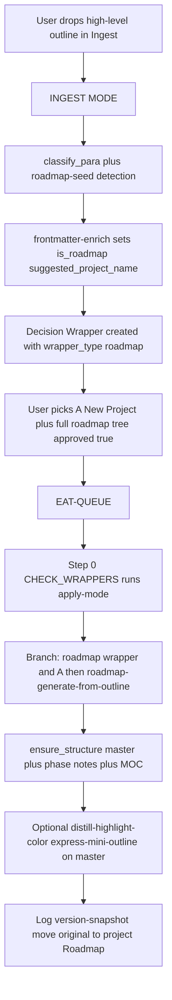

# Complete Roadmap Goal Plan

## Goal

Turn the **existing** ingest → Decision Wrapper → EAT-QUEUE → guidance-aware apply loop into the **roadmap creation engine**. A high-level outline dropped in Ingest becomes the seed that Cursor decomposes into a full, self-documenting roadmap tree (MOC → master roadmap → phases/subphases → tasks), using the same safety rails, confidence bands, and "set down / pick up" mechanics already in place.

**Quality bar:** Roadmaps produced by this flow are documentation-grade (TL;DR, structure, project highlight_key, version-snapshot trail).

---

## Intent vs structure (philosophy)

- **User owns the vision / player outcome:** What does this system feel like to play? What is its purpose? What is the success outcome and usage flow?
- **Cursor owns the translation to roadmap:** Given clarified intent, Cursor decides phase tree, task list, order, dependencies, folder layout, and documentation structure autonomously.
- **Wrapper trigger = semantic intent ambiguity** in the source outline only — not structural questions. If the source is vague or conflicting on purpose, usage, or goals, create an intent-clarification wrapper; otherwise no wrapper in the skill.
- **When a wrapper is needed (in the skill):** Quote the exact vague/conflicting excerpt; ask a direct usage/intent question; offer 2–3 options focused on player experience/goal plus an open "other" with guidance field. After the user answers, Cursor proceeds autonomously with all structure decisions.
- **Safety invariant:** All structural writes (folders, notes, frontmatter) follow existing safety invariants: backup first, per-change/version snapshot before write, dry_run pattern where applicable (even though most ops here are create/update, not move). See mcp-obsidian-integration and Pipelines.md.

Wrappers should never ask purely structural questions (e.g. "flat or hierarchical?", "how many phases?"). If the intent is clear, Cursor picks a reasonable default structure and documents its choice in the provenance callout.

**Why no structure-only wrappers?** Asking the user "flat or nested?" shifts work that Cursor is designed to handle (logical decomposition) back onto the human. Instead, clarify intent → let Cursor translate.

---

## Canonical flow




---

## What changes (no new MCP)

### 1. Roadmap-seed detection (ingest pipeline)

**Where:** [.cursor/rules/context/para-zettel-autopilot.mdc](.cursor/rules/context/para-zettel-autopilot.mdc) and optionally a small inline heuristic or a dedicated detection step after `classify_para`.

**Behavior:**

- After `classify_para` and before Decision Wrapper creation, determine if the note is a **roadmap seed**: content suggests a high-level plan (e.g. headings like "Phase", "System", "Milestone"; or ≥3 top-level sections describing systems/phases; or keywords "roadmap", "outline", "systems" in title or first paragraph).
- If yes: set on the **original note** frontmatter (via `obsidian_manage_frontmatter` or during frontmatter-enrich): `is_roadmap: true`, and optionally `suggested_project_name` derived from note title or first heading (slugified).
- Keep `para_type` from classify_para (e.g. Project); the wrapper-creation step will branch on `is_roadmap`.

**Deliverable:** Rule text and/or a one-paragraph "Roadmap detection" section: when to set `is_roadmap` and `suggested_project_name`; document in [3-Resources/Second-Brain/Pipelines.md](3-Resources/Second-Brain/Pipelines.md) or Cursor-Skill-Pipelines-Reference.

---

### 2. Roadmap-specific Decision Wrapper (option A = create project + roadmap tree)

**Where:** [.cursor/rules/context/para-zettel-autopilot.mdc](.cursor/rules/context/para-zettel-autopilot.mdc) — "Decision Wrapper creation" block.

**Behavior:**

- When creating the wrapper, **if** the original note has `is_roadmap: true`:
  - **Do not** use only `propose_para_paths` for all seven options.
  - **Option A (synthetic):** Label and path for "New project + full roadmap tree". Path convention: e.g. `1-Projects/<suggested_project_name>/Roadmap/` or a sentinel like `CREATE_PROJECT_AND_ROADMAP` so apply-mode can detect it. Display text: "**A.** New project + full roadmap tree — decompose outline into phases based on intended player usage and system goals."
  - **Options B–G:** Call `obsidian_propose_para_paths` (path, para_type, max_candidates: "6", context_mode: "wrapper") and map results to B–G (attach to existing project, 3-Resources, 4-Archives, etc.). Pad to 7 if fewer than 6 using existing padding fallbacks.
  - Prefer intent-focused options (player experience, purpose) over pure structure options.
  - Set on the **wrapper** frontmatter: `wrapper_type: roadmap` and optionally `suggested_project_name: "<value>"` (from original note). **Naming:** Use `wrapper_type: roadmap` for the initial "create project + roadmap tree" choice only. Any subsequent intent-clarification wrappers created inside the skill use `wrapper_type: roadmap-intent-clarification` (see skill §4).
- Use the same template [Templates/Decision-Wrapper.md](Templates/Decision-Wrapper.md); ensure placeholders support the roadmap case (A reason can be "Create new project and decompose into master + phase notes + MOC").

**Deliverable:** Rule update in para-zettel-autopilot: branch on `is_roadmap`; A = synthetic create-project-and-roadmap option; B–G from propose_para_paths; set `wrapper_type` and `suggested_project_name` on wrapper. No second template required if the body text for A is filled from this branch.

---

### 3. Apply-mode branch: run roadmap generation when user chose A for a roadmap wrapper

**Where:** [.cursor/rules/context/auto-eat-queue.mdc](.cursor/rules/context/auto-eat-queue.mdc) Step 0 "Branch A — approved and not processed"; and [.cursor/rules/context/para-zettel-autopilot.mdc](.cursor/rules/context/para-zettel-autopilot.mdc) "Apply-mode ingest".

**Behavior:**

- When processing an approved wrapper, **before** running the default apply-mode (move to `hard_target_path`):
  - Read wrapper frontmatter. If `wrapper_type: roadmap` (or equivalent: e.g. original note has `is_roadmap: true` and `approved_option: A`) and the chosen option is **A** (i.e. the path for A is the create-project-and-roadmap sentinel or matches the convention):
    - **Do not** run `obsidian_move_note` to that path.
    - Resolve `suggested_project_name` from wrapper or original note.
    - Run the **roadmap-generate-from-outline** skill (see below) with inputs: `original_note` path, `suggested_project_name`, and `guidance_text` from the wrapper Thoughts block.
    - After the skill succeeds: mark wrapper used, move wrapper to `4-Archives/Ingest-Decisions/`, log to Ingest-Log (e.g. "CHECK_WRAPPERS: roadmap created at 1-Projects//Roadmap/...").
  - If `wrapper_type: roadmap-intent-clarification` and `approved: true`: do not run move; resolve `original_note`, `suggested_project_name`, and the user's choice (approved_option + Thoughts) as `guidance_text`; **re-invoke roadmap-generate-from-outline** with those inputs; then mark wrapper used and archive it.
  - **Else:** Keep current apply-mode: `feedback-incorporate` → `hard_target_path` → ensure_structure → move_note (dry_run then commit) → rename if needed → archive wrapper.

**feedback-incorporate:** When the wrapper has `wrapper_type: roadmap` and `approved_option: A`, the pipeline must treat this as "run roadmap-generate-from-outline" rather than "move to candidate_a_path". Either: (1) feedback-incorporate emits a flag like `pending_action: create_roadmap_from_ingest` plus `original_note` and `suggested_project_name` when it sees roadmap + A, and Step 0 branches on that; or (2) Step 0 reads the wrapper directly and branches when `wrapper_type === 'roadmap'` and chosen option is A. Option (2) keeps feedback-incorporate unchanged; recommend (2) for minimal change.

**Deliverable:** auto-eat-queue Step 0 updated: if wrapper has `wrapper_type: roadmap` and approved_option A, call roadmap-generate-from-outline then archive wrapper; if `wrapper_type: roadmap-intent-clarification` and approved, re-invoke roadmap-generate-from-outline with guidance then archive; else existing apply-mode. Para-zettel-autopilot apply-mode section updated accordingly.

---

### 4. New skill: roadmap-generate-from-outline

**Where:** New file [.cursor/skills/roadmap-generate-from-outline/SKILL.md](.cursor/skills/roadmap-generate-from-outline/SKILL.md).

**When to use:** Invoked by apply-mode when user approved option A on a roadmap Decision Wrapper (see above).

**Inputs:** `original_note` (Ingest path), `suggested_project_name` (from wrapper or content), and optional `guidance_text` (Thoughts from wrapper) for phase names / structure.

**Instructions (summary):**

1. **Backup:** Ensure `obsidian_create_backup` has been called for the original note (per mcp-obsidian-integration).
2. **Read:** `obsidian_read_note`(original_note). Parse outline: identify systems/phases (e.g. 4 systems → 4 phases); use `guidance_text` to disambiguate naming and order.
3. **Intent ambiguity check:** After reading the outline and any `guidance_text`: Scan for vague or conflicting statements about system purpose, player usage, core goal, or success criteria (e.g. one part calls X "core loop", another "supporting feature"). If detected and intent-parsing confidence **< threshold** (default 75%, configurable via `Second-Brain-Config.roadmap.intent_confidence_threshold`), create an **intent-clarification wrapper** (`wrapper_type: roadmap-intent-clarification`): quote 1–2 relevant source excerpts; present 2–3 options focused on player experience/outcome (not "how to organize"); include open option (e.g. C) with user_guidance field. Then exit the skill early. If no significant intent ambiguity (or after the user clarifies via an approved intent wrapper), proceed with the default autonomous structure rules below. **Naming:** Use `wrapper_type: roadmap-intent-clarification` for any intent-clarification wrappers created inside the skill (distinct from the initial `wrapper_type: roadmap` from ingest).
4. **Default autonomous structure rules (after intent is clear):** One phase per top-level system (flat by default); sub-phases only if outline explicitly nests or `guidance_text` indicates hierarchy; phase order from logical dependency implied by usage flow; task granularity: 4–8 placeholder tasks per phase (configurable via `Second-Brain-Config.roadmap.max_placeholder_tasks_per_phase`). Apply project `highlight_key` per Color-Coded-Highlighting. **Structure override guard:** If `user_guidance` or the approved wrapper explicitly overrides structure (e.g. "use exactly 5 phases", "make hierarchical with 2 levels"), respect it exactly; otherwise treat structure instructions in guidance as hints only (avoids accidental structure micromanagement while honoring deliberate overrides). **Intent-clarification wrapper format (enforcement):** The intent wrapper must not present structure-only options; options must be framed in player experience, purpose, or success criteria. Template: callout "Intent clarification needed for roadmap generation"; source excerpt (quoted); one direct usage/intent question; options A, B (2–3 player-experience options); option C or "Other" with guidance field. Frontmatter: `wrapper_type: roadmap-intent-clarification`, `original_note`, `suggested_project_name`.
5. **Ensure structure:** `obsidian_ensure_structure` for `1-Projects/<ProjectName>/Roadmap/` and for each phase folder `1-Projects/<ProjectName>/Roadmap/Phase-N-<Name>/` per [3-Resources/Roadmap-Standard-Format.md](3-Resources/Roadmap-Standard-Format.md).
6. **Create master roadmap note:** Path `1-Projects/<ProjectName>/Roadmap/<ProjectName>-Roadmap-YYYY-MM-DD-HHMM.md`. Content: no checkboxes; frontmatter per Roadmap-Standard-Format (`roadmap-level: master`, `phase-number`, `project-id`, `status`, `priority`, `progress`, `highlight_perspective`, `links` to MOC). Body: **top provenance callout** with: "Intent confidence: {high | clarified via wrapper | medium-low but proceeded with default}" and "(Threshold used: {value from config, e.g. 75%})" so it is visible for auditing whether Cursor went full auto or needed help. Then one heading per phase (e.g. `## Phase 1 — <Name>`) and one Dataview block per phase that lists phase notes from `FROM "1-Projects/<ProjectName>/Roadmap/Phase-N-<Name>"`. Use `obsidian_update_note` (create). Per-change snapshot before write.
7. **Create phase notes:** For each phase, create `1-Projects/<ProjectName>/Roadmap/Phase-N-<Name>/Phase-N-<Name>-Roadmap-YYYY-MM-DD-HHMM.md` with frontmatter (`roadmap-level: phase`, `phase-number`, `project-id`, etc.) and body: short phase description (from outline), optional placeholder tasks (`- [ ]`). Use `obsidian_update_note`. Snapshot before each write.
8. **Create or update project MOC:** e.g. `1-Projects/<ProjectName>/<ProjectName>-Roadmap-MOC.md` that links to the master roadmap and contains a Dataview table aggregating all phase/subphase roadmaps under the project's `Roadmap/` folder (see Roadmap-Standard-Format "MOC behavior"). Ensure_structure for project root if needed; then update_note.
9. **Original note disposition:** Either (a) move original from Ingest to e.g. `1-Projects/<ProjectName>/Roadmap/Source-<slug>-YYYY-MM-DD-HHMM.md` and add a "Source" link in the master roadmap, or (b) leave original in Ingest and add a link from master to `[[original_path]]` as "Source". Document the chosen convention in the skill (recommend (a) for a single canonical place).
10. **Polish (documentation quality):** Run on the **master roadmap note** only: distill-highlight-color (with project `highlight_key` if set in Second-Brain-Config or Highlightr-Color-Key), then express-mini-outline so the master has a TL;DR and mini-outline at top. Optional: callout-tldr-wrap. This makes the roadmap read as documentation.
11. **Version-snapshot:** Create a version snapshot of the master roadmap note after generation (per version-snapshot skill) so there is a history trail.
12. **Log:** Append to Ingest-Log and Watcher-Result; update Mobile-Pending-Actions with success and paths created.

**MCP tools used:** `obsidian_read_note`, `obsidian_ensure_structure`, `obsidian_update_note`, `obsidian_create_backup`, `obsidian_move_note` (for original if moving), plus obsidian-snapshot skill and optionally distill-highlight-color, express-mini-outline, callout-tldr-wrap, version-snapshot skills. No new MCP tools.

**Confidence gate:** If intent ambiguity is detected and intent-parsing confidence < threshold (default 75%, configurable via Second-Brain-Config), create the intent-clarification wrapper and exit; otherwise proceed with steps 5–12. The intent wrapper must not present structure-only options; options must be framed in player experience, purpose, or success criteria.

**Deliverable:** Full SKILL.md with the above sections; sync to [.cursor/sync/skills/roadmap-generate-from-outline.md](.cursor/sync/skills/roadmap-generate-from-outline.md) per backbone-docs-sync.

---

### 5. Wrapper template and frontmatter

**Where:** [Templates/Decision-Wrapper.md](Templates/Decision-Wrapper.md).

**Change:** Support roadmap wrappers without a second file. When the pipeline fills the template for a roadmap wrapper, it already supplies A–G from the roadmap-specific logic. Add to the template's frontmatter **optional** placeholders or docs: `wrapper_type: roadmap` and `suggested_project_name` are set by the pipeline when the wrapper is created for a roadmap seed; apply-mode (CHECK_WRAPPERS) reads these to decide whether to run roadmap-generate-from-outline. **Naming:** Use `wrapper_type: roadmap` for the initial "create project + roadmap tree" choice; use `wrapper_type: roadmap-intent-clarification` for any subsequent intent-clarification wrappers created inside the skill (logs and apply-mode branches key off these exact strings). No change to the body structure (A–G list) required; the filler just supplies different text for A.

**Deliverable:** Template frontmatter comment or optional fields documented (e.g. in a short "For roadmap wrappers" line); pipeline sets `wrapper_type` and `suggested_project_name` when creating the wrapper from a roadmap seed.

---

### 6. Set-down / pick-up contract (documentation)

**Where:** [3-Resources/Second-Brain/Pipelines.md](3-Resources/Second-Brain/Pipelines.md) or [3-Resources/Second-Brain/Backbone.md](3-Resources/Second-Brain/Backbone.md).

**Content:** One short subsection "Set down / pick up": Decision Wrapper is the handoff whenever the pipeline needs a user choice. EAT-QUEUE (Step 0 CHECK_WRAPPERS) is the single "pick up" trigger. When a wrapper has `approved: true`, the processor runs the action that matches the wrapper type and chosen option. Today: (1) default ingest wrapper → move to `hard_target_path`; (2) roadmap wrapper + option A → roadmap-generate-from-outline; (3) roadmap-intent-clarification wrapper → re-invoke roadmap-generate-from-outline with guidance. **Intent vs structure:** Roadmap generation prefers Cursor autonomy on structure ("how"). Decision Wrappers are reserved for clarifying user intent ("what" — player experience, core purpose, success criteria). Wrappers appear only when the source has ambiguous or conflicting intent that Cursor cannot reasonably infer. This keeps user focus on vision while the autopilot handles decomposition, naming, hierarchy, and documentation polish. Optional table: `wrapper_type` (or detection) + `approved_option` → action.

**Deliverable:** Doc subsection and optional table so future extensions stay consistent.

---

### 7. Backbone and reference docs

**Where:** [3-Resources/Cursor-Skill-Pipelines-Reference.md](3-Resources/Cursor-Skill-Pipelines-Reference.md), [3-Resources/Second-Brain/Skills.md](3-Resources/Second-Brain/Skills.md), [3-Resources/Second-Brain/Rules.md](3-Resources/Second-Brain/Rules.md), [3-Resources/Second-Brain/Parameters.md](3-Resources/Second-Brain/Parameters.md), [3-Resources/Second-Brain/Queue-Sources.md](3-Resources/Second-Brain/Queue-Sources.md).

**Updates:**

- **Cursor-Skill-Pipelines-Reference:** In §1 (full-autonomous-ingest), add a bullet: when `is_roadmap: true`, create roadmap-specific Decision Wrapper (A = new project + full roadmap tree; B–G from propose_para_paths). In apply-mode, when wrapper is roadmap and option A, run roadmap-generate-from-outline instead of move. The skill's escape hatch is an **intent-clarification** wrapper (`wrapper_type: roadmap-intent-clarification`); when that wrapper is approved, apply-mode re-invokes roadmap-generate-from-outline with the user's choice and guidance. Add flowchart or one sentence for the roadmap branch.
- **Skills.md:** Add row for `roadmap-generate-from-outline`: when to use (apply-mode for roadmap wrapper + A), inputs, main steps, MCP used.
- **Rules.md:** Note para-zettel-autopilot branch for roadmap detection and wrapper; auto-eat-queue Step 0 branch for roadmap wrapper + A and for `roadmap-intent-clarification` (re-invoke skill with guidance).
- **Parameters.md:** Document `is_roadmap`, `suggested_project_name`, `wrapper_type` (wrapper frontmatter: `roadmap` for initial choice, `roadmap-intent-clarification` for skill-created intent wrappers), and optional `Second-Brain-Config.roadmap.intent_confidence_threshold` in the Decision Wrapper / roadmap section if present.
- **Queue-Sources.md:** No new queue mode required; CHECK_WRAPPERS already drives apply-mode. Optionally mention that roadmap creation is triggered by approving a roadmap wrapper (no separate FEEDS-ROADMAP needed for this flow).

**Deliverable:** Edits to the above docs so the roadmap goal is discoverable and consistent with existing pipeline docs.

---

### 8. Optional: Second-Brain-Config roadmap section

**Where:** [3-Resources/Second-Brain-Config.md](3-Resources/Second-Brain-Config.md) or [3-Resources/Second-Brain/Second-Brain-Config.md](3-Resources/Second-Brain/Second-Brain-Config.md).

**Content:** Optional `roadmap:` section: default phase naming, whether to run polish (distill-highlight-color, express-mini-outline) on master after generation, project `highlight_key` default for new project roadmaps. Reference [3-Resources/Second-Brain/Color-Coded-Highlighting.md](3-Resources/Second-Brain/Color-Coded-Highlighting.md) and Highlightr-Color-Key for project-level keys.

**Suggested YAML (optional):**

```yaml
roadmap:
  intent_confidence_threshold: 75    # % below which ambiguous intent triggers clarification wrapper
  max_placeholder_tasks_per_phase: 8 # default granularity
```

**Deliverable:** Optional; can be added in a follow-up. Plan does not block on it.

---

## Naming consistency (wrapper_type)

- **Initial ingest wrapper** → `wrapper_type: roadmap`. Apply-mode: run roadmap-generate-from-outline when user picks option A.
- **Skill-created clarification wrapper** → `wrapper_type: roadmap-intent-clarification`. Apply-mode: re-invoke roadmap-generate-from-outline with guidance, then archive.

Use these exact values in rules, skills, and logs so future code and audits can distinguish the two flows.

---

## Optional: Example of intent-focused wrapper

When the skill creates an intent-clarification wrapper, it should look like this (player-experience options, not structure):

> [!proposal] Intent clarification needed for roadmap generation
>
> Source excerpt from your outline:
>
> "Economy system contains progression elements including leveling and resource loops"
>
> This is ambiguous on intent. How do you intend players to experience "progression" in the economy?
>
> **A.** Progression is the core loop — economy exists to support steady character growth and rewards (make progression its own primary phase).
>
> **B.** Economy is the foundation — progression is a secondary feature inside it (treat progression as sub-elements within the economy phase).
>
> **C.** Something else — add your guidance below (e.g. "progression should feel rare and meaningful, gated behind economy milestones").

User picks A or B (or writes guidance) → Cursor then decides the exact phase/subphase layout, task breakdown, naming, Dataview blocks, etc., without further questions.

---

## Implementation order

1. **Skill:** Add [.cursor/skills/roadmap-generate-from-outline/SKILL.md](.cursor/skills/roadmap-generate-from-outline/SKILL.md) (and sync copy). Implement steps 1–12; include escape hatch (intent-clarification wrapper when intent ambiguous; use `wrapper_type: roadmap-intent-clarification`).
2. **Detection:** In para-zettel-autopilot, add roadmap-seed detection after classify_para; set `is_roadmap` and `suggested_project_name` on original note.
3. **Wrapper branch:** In para-zettel-autopilot Decision Wrapper creation, branch on `is_roadmap`: A = synthetic "New project + full roadmap tree", B–G from propose_para_paths; set `wrapper_type: roadmap` and `suggested_project_name` on wrapper.
4. **Apply-mode branch:** In auto-eat-queue Step 0, when wrapper has `wrapper_type: roadmap` and approved_option A, call roadmap-generate-from-outline then archive wrapper; when `wrapper_type: roadmap-intent-clarification` and approved, re-invoke roadmap-generate-from-outline with guidance then archive; else keep current move/rename apply-mode.
5. **Template:** Document optional `wrapper_type` / `suggested_project_name` in Decision-Wrapper template or in rules.
6. **Docs:** Set-down/pick-up contract in Pipelines or Backbone; updates to Cursor-Skill-Pipelines-Reference, Skills.md, Rules.md, Parameters.md, Queue-Sources.md.
7. **Test:** Drop a 4-system outline in Ingest → INGEST MODE → wrapper → pick A, approved → EAT-QUEUE → verify tree + MOC + polish and original note disposition.

---

## Out of scope (no change in this plan)

- New MCP tools.
- Changes to `propose_para_paths` or classify_para MCP (detection is rule/skill-side).
- Task-Queue.md or TASK-ROADMAP mode (this flow uses Ingest + CHECK_WRAPPERS only).
- roadmap-ingest skill used from Task-Queue; it remains for TASK-ROADMAP mode; roadmap-generate-from-outline is the new skill for the Ingest → wrapper → apply path.
- Commander macro "Create Roadmap from Current Note" or DERIVE-ROADMAP-FROM-MOC (optional polish; not required for the canonical flow).

---

## Summary


| Item                         | Action                                                                                                                                                                                                                                |
| ---------------------------- | ------------------------------------------------------------------------------------------------------------------------------------------------------------------------------------------------------------------------------------- |
| Roadmap detection            | Set `is_roadmap` + `suggested_project_name` after classify_para when content looks like a roadmap seed (para-zettel-autopilot).                                                                                                       |
| Decision Wrapper for roadmap | Branch in wrapper creation: A = "New project + full roadmap tree", B–G from propose_para_paths; set `wrapper_type: roadmap` on wrapper.                                                                                               |
| Apply-mode branch            | In auto-eat-queue Step 0: if roadmap wrapper + A → run roadmap-generate-from-outline; else current move/rename.                                                                                                                       |
| New skill                    | roadmap-generate-from-outline: read outline → intent-clarification wrapper if intent ambiguous (quote excerpt, 2–3 player-experience options, open guidance); structure-override guard; provenance callout on master (intent confidence + threshold used); configurable intent_confidence_threshold; ensure_structure → master + phase notes + MOC → move original → polish → version-snapshot → log. |
| Template                     | Document optional wrapper_type / suggested_project_name.                                                                                                                                                                              |
| Contract                     | Document set down / pick up, wrapper_type → action, and **intent-only principle** (Cursor owns structure; wrappers for intent clarification only) in Pipelines or Backbone.                                                                                                                           |
| Backbone docs                | Update Pipelines reference, Skills, Rules, Parameters, Queue-Sources.                                                                                                                                                                 |


All steps use existing MCP and existing safety (backup, snapshot, dry_run where applicable). The roadmap tree conforms to [3-Resources/Roadmap-Standard-Format.md](3-Resources/Roadmap-Standard-Format.md) and is suitable as documentation after the polish step.