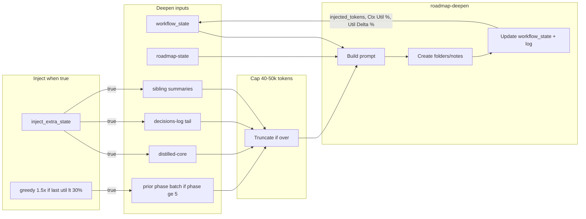

# Context utilization 80% integration plan (aggressive revision)

Drive roadmap deepen runs toward **80% context util** by aggressive injection caps, phase-adaptive and greedy injection, deeper branching with branch-expand follow-up, batch + highlight integration with semantic guidance, monitoring with RECAL at both low and high util, prompt-crafter stabilization, error handling for overflow, and testing/regression.

---

## 1. Inject persistent state/docs per deepen (aggressive caps, phase-adaptive, greedy)

**Goal:** When `params.inject_extra_state === true`, pull and embed extra context so each deepen run uses more of the window. **Target 40–50% util** (not 25–35%); cap and sources scale with phase and last-run util.

**Where:** [.cursor/skills/roadmap-deepen/SKILL.md](.cursor/skills/roadmap-deepen/SKILL.md) (and optionally [.cursor/skills/roadmap-resume/SKILL.md](.cursor/skills/roadmap-resume/SKILL.md) when resume runs before deepen).

**Token cap (aggressive):** Default **40–50k tokens** (still <40% util buffer for 128k window). Overridable via **params.token_cap** (e.g. `50000`). Document in Parameters; cap applies to total injected block (chars → tokens via context_token_per_char). If over cap, truncate in order: decisions-log tail first, then sibling summaries, then prior-phase content; keep distilled-core full when possible.

**What to embed:**

- **Full** `distilled-core.md` (project Roadmap) — core decisions and hierarchy rule.
- **Recent decisions-log.md** — last 5–10 bullet entries (tail); path: `1-Projects/<project_id>/Roadmap/decisions-log.md`.
- **Related subphase siblings** — for current target (e.g. Phase-3-1-4), inject short summaries or key bullets from Phase-3-1-3 and Phase-3-1-5 (same secondary parent). Use `obsidian_list_notes` on the parent folder, then `obsidian_read_note` for sibling paths; include first ~500 chars or a "Summary" section per sibling.
- **Phase-adaptive (tech_level 5–6):** Per [Roadmap-Quality-Guide § 4 Phase-specific technicality](3-Resources/Second-Brain/Roadmap-Quality-Guide.md) (phases 5–6 = full technical), when **current_phase ≥ 5**, inject **full prior phase folder(s)** via `obsidian_list_notes` on `Roadmap/Phase-N-*/` for N = current_phase − 1 (and optionally −2), then `obsidian_read_note` batch on listed notes (or summaries of each), so late-phase deepen has full prior-phase context. Respect token_cap; truncate prior-phase content if needed.
- **Greedy mode:** If **last run Ctx Util % < 30%** (read last Log row from workflow_state), **auto-inject 1.5×** next run: e.g. increase token_cap by 1.5× for this run only, or add one more prior phase / more siblings. Log in workflow_state (e.g. **Status / Next**: `greedy_inject_1.5x` or frontmatter **last_util_pct** and a note that greedy was applied). Ensures we push toward 40–50% when we detect under-use.

**How:**

- In **roadmap-deepen**: step 0 when `params.inject_extra_state === true`: resolve **token_cap** from params (default 50_000); if greedy condition (last util < 30%), set effective cap = min(1.5 * token_cap, 0.4 * context_window_tokens). Read distilled-core, decisions-log tail, siblings; if phase ≥ 5, add prior-phase folder batch. Concatenate into **Injected context**; enforce cap by truncation order above.
- **Token audit:** Estimate `injected_tokens` and write to workflow_state (frontmatter `last_injected_tokens` and/or in Status/Next). Document in [Vault-Layout](3-Resources/Second-Brain/Vault-Layout.md) § workflow_state.
- **Queue contract:** Support `inject_extra_state: true` and **token_cap: 50000**. Document in [Queue-Sources](3-Resources/Second-Brain/Queue-Sources.md) and [Parameters](3-Resources/Second-Brain/Parameters.md).

**Test / limit-pushing:** Queue deepen with `{"params":{"inject_extra_state":true,"token_cap":50000}}`. **Fail postcondition** if **drift > 0.08** after run (per [Roadmap-Upgrade-Plan § 2](3-Resources/Second-Brain/Roadmap-Upgrade-Plan.md) iteration and state); log to Errors.md with #review-needed and queue RECAL-ROAD.

---

## 2. Aggressive deepening (depth + branching factor, branch-expand follow-up)

**Goal:** Single run expands to **depth 4–5** with **branching factor** (e.g. 3–5 secondaries per node) so late-phase runs (e.g. Phase-3-2 at depth 2) reach **40–50% util**; if util <50% post-deepen, auto-queue branch-expand follow-up.

**Ref:** [Roadmap-Quality-Guide § 4 Phase-specific technicality](3-Resources/Second-Brain/Roadmap-Quality-Guide.md) and [Roadmap Structure](Roadmap Structure.md).

**Params:**

- **params.max_depth** (int, optional): Max depth to create in one deepen run (e.g. 4 or 5). When absent, derive from **current_phase**: phase 1–2 → 2, phase 3–4 → 3, phase 5–6 → 4 (document in Parameters).
- **params.branch_factor** (int, optional): Target number of secondaries (or tertiaries per secondary) to create per node in this run. **Default 4 for phases ≥ 3** (so we expand to 3–5 secondaries per node instead of 2). Queue param **branch_factor: 4** to force it. Document in Queue-Sources and Parameters.

**roadmap-deepen changes:**

- Multi-step loop as before (create up to max_depth per run); when **branch_factor** is set, create up to that many children at the current level before moving deeper (e.g. 4 secondaries under current phase, then first tertiary under each if depth allows). Snapshot before multi-step deepen; one Log row at end.
- **Safety:** If **context_util_pct > 80%**: postcondition failure → queue RECAL-ROAD, no further deepen; set Status/Next and optionally `status: blocked`. Document in mcp-obsidian-integration § Roadmap state invariants.
- **Branch-expand follow-up:** If **context_util_pct < 50%** post-deepen, **auto-queue** a **branch-expand** follow-up: append RESUME-ROADMAP with **params.action: "expand"** (EXPAND-ROAD) targeting the **new tertiaries** created this run (e.g. sectionOrTaskLocator or source_file to the new tertiary notes), so the next run packs more into the window without blocking. Leverages [Queue-Sources](3-Resources/Second-Brain/Queue-Sources.md) canonical order; non-blocking.
- **Branch-expand cap (prevent runaway chaining):** Track **chained_branch_count** per phase in workflow_state (increment when a branch-expand is queued; reset when phase advances or RECAL runs). **Max 2 chained branch-expands per phase.** If **chained_branch_count ≥ 2**, do **not** queue another branch-expand; fall back to **RECAL-ROAD** instead. Prevents infinite deepen loops on shallow phases. Document in Vault-Layout § workflow_state and roadmap-deepen.

**Limit-pushing repro:** Run on Phase-3-2 with **depth=5, branch_factor=4**; expect 40–50% util; if drift spikes (e.g. >0.08), RECAL-ROAD triggers.

**Config:** Add `prompt_defaults.roadmap.max_depth` and **branch_factor: 4** (default for phases ≥3) in [Second-Brain-Config](3-Resources/Second-Brain-Config.md); queue/params override.

---

## 3. Batch subphases + multi-angle highlights (bigger batches, semantic guidance, prune at 70%)

**Goal:** **Queue bigger batches** (e.g. Phase-3-2 + 3-3 + 3-4) to pack shared state; layer **highlight_angles** with **15–20k extra** (core/support/fade markers) and tie to **distill_lens** / **express_view** for semantic guidance; at 70% util, layer-promote prunes fade-level content.

**Batch subphases:**

- **params.batch_subphases** (optional): Array of subphase indices or phase folder names, e.g. `["3.2","3.3","3.4"]`. Support **3+ items** to pack more into one run. Roadmap-deepen runs serially over each; one workflow_state update at end (one Log row, Target = "Phase-3-2, Phase-3-3, Phase-3-4"). Snapshot before batch; state reflects all created targets.

**Highlight angles (aggressive):**

- **params.highlight_angles** (optional): Array of strings, e.g. `["narrative","tech","edge-cases"]`. When present, **after** deepen, for each created/updated roadmap note run **distill-highlight-color** and **highlight-perspective-layer** with those angles. **Inject 15–20k extra** (core 🔵 / support 🟢 / fade ⚪ markers) so the AI gets semantic guidance; per [Skills § Highlighter flow (depth)](3-Resources/Second-Brain/Skills.md), **embed analogous colors/depths into the deepen prompt** (or into the highlight pass context) so **distill_lens** and **express_view** propagate — express-mini-outline can then use section colors. Document tie-in in Skills.md and Cursor-Skill-Pipelines-Reference.
- **Limit at 70% util:** If **context_util_pct ≥ 70%** after highlight pass, **layer-promote** skill (post-deepen) **prunes fade-level (⚪) content** automatically to avoid overflow; log in workflow_state.

**Queue example:**  
`{"mode":"RESUME-ROADMAP","params":{"action":"deepen","batch_subphases":["3.2","3.3","3.4"],"highlight_angles":["narrative","tech","edge-cases"]}}`

**Docs:** Queue-Sources.md, Parameters.md, Skills.md (Highlighter flow), Pipelines (distill_lens/express_view propagation).

---

## 4. Tune thresholds and monitor (70% RECAL gate, Util Delta, alerting)

**max_iterations_per_phase:**  
Current **33** in workflow_state and Config. **Dial to 20 max** (not 12); document: "If drift or low handoff_readiness recurs, reduce to 15–20 to force more frequent recal." Auto-escalate RECAL at **util <20%** (already in plan) and at **util >80%** (already); add **util >70%** as **tunable auto-RECAL gate** (see below).

**RECAL gates (both ends):**

- **Low util:** If **context_util_pct < 20%** for last 3 consecutive deepen runs → append RESUME-ROADMAP with **action: "recal"**, `reason: "low-util-recal"`. Config: `recal_if_util_below_pct: 20`, `recal_if_util_low_consecutive_runs: 3`.
- **High util (tunable):** **Lower the gate to 70%** for auto-RECAL (not only 80%). When **context_util_pct ≥ recal_util_high_threshold** (default **70%**, tunable in [Parameters](3-Resources/Second-Brain/Parameters.md)), queue RECAL-ROAD and do not queue another deepen. Config: `recal_util_high_threshold: 70` (overridable).

**Workflow_state: Util Delta % column:**

- Add a **Util Delta %** column to the Log table (or compute and store in Status/Next): **current Ctx Util % − previous row Ctx Util %** so we spot creeps (e.g. +10% in one run). Document in [Vault-Layout](3-Resources/Second-Brain/Vault-Layout.md) § workflow_state.

**Util-delta alerting — make spikes loud:**

- **Log step (roadmap-deepen):** If **util_delta > 15%**:
  - Append to [Errors](3-Resources/Second-Brain/Errors.md): `util-spike-detected | delta: {delta}% | util: {util}% | phase: {target}` (with actual values; include timestamp if desired).
  - Add **#review-needed** callout to the **phase note** (e.g. roadmap-state.md or current phase note).
- **Bonus — Dataview in Vault-Change-Monitor:**

```dataview
TABLE "Util Delta %", "Ctx Util %", Target, Timestamp
WHERE "Util Delta %" > 15
SORT Timestamp DESC
LIMIT 5
```

**Vault-Change-Monitor util trends and alerting:**

- Ensure **Vault-Change-Monitor** at [3-Resources/Vault-Change-Monitor.md](3-Resources/Vault-Change-Monitor.md) (create if missing; copy from 4-Archives if needed).
- Section **"Context utilization (roadmap)"**: link to each in-progress project's workflow_state (Dataview LIST); transclude Log section for at least one project.
- **Avg Util this Phase:** Add a query or note: for current phase, average Ctx Util % over last N rows (e.g. 10) to **flag shallow runs early** (e.g. "Avg Util this Phase: 18%" → consider greedy inject or branch-expand).
- **Alerting:** If **Util Delta %** (or trend) **> +10% per phase** (or per run), add **#review-needed** callout in the MOC or in workflow_state note so user sees util creep. Document in Logs.md § Vault-Change-Monitor blocks.

---

## 5. Prompt-crafter stabilization (deepen-aggressive profile)

**Why:** Params like `inject_extra_state`, `token_cap`, `branch_factor` must be **stabilized across runs** so queues don't flip-flop. Per [Prompt-Crafter-Structure-Detailed](3-Resources/Second-Brain/Second-Brain-User-Flows/Prompt-Crafter-Structure-Detailed.md), add a **named profile** that merges with queue params and user_guidance (guidance-aware rule) for consistent high-util queues.

**Profile: deepen-aggressive**

- In [Second-Brain-Config](3-Resources/Second-Brain-Config.md) **prompt_defaults.profiles**, add:
  - **deepen-aggressive**: `{ token_cap: 50000, branch_factor: 4, inject_extra_state: true, max_depth: 4 }` (or equivalent). Merged when user selects this profile or when queue entry references it (e.g. `params.profile: "deepen-aggressive"`).
- Document in Prompt-Crafter-Structure-Detailed and Queue-Sources: profile selection via Commander macro **"Craft Deepen Aggressive"** (builds queue entry with params from profile). Ensures one-command high-util deepen queues.

---

## 6. Error handling for high util (overflow / hallucinations)

**Gap:** Plan had postconditions but no **deepen-specific** overflow/hallucination handling. Per [mcp-obsidian-integration § Error Handling Protocol](.cursor/rules/always/mcp-obsidian-integration.mdc):

- **Overflow check:** If **est_tokens > context_window_tokens × 0.9** (90% of window), **fail** the deepen run with **#review-needed**: log to [Errors](3-Resources/Errors.md) with `error_type: context-overflow`, append Watcher-Result failure, **queue distill** (RESUME-ROADMAP action recal or a dedicated distill step on the roadmap notes) so we compress before retry. Do not proceed with another deepen until recal/distill has run.
- **Confidence bump for dense runs (optional sweetener):** In [confidence-loops](.cursor/rules/always/confidence-loops.mdc) (always rule) or deepen postcondition: If **util ≥ 50%** → apply **high_util_conf_boost** (+5–8%, tunable in Parameters) to the **next post_loop_conf floor**. Log the bump in loop_* fields. Document in Parameters and confidence-loops.

Document in roadmap-deepen skill and in mcp-obsidian-integration (deepen-specific subsection under Error Handling Protocol).

---

## 7. Testing and regression (high-util fixtures, Regression-Stability-Log)

**Tie to [Testing](3-Resources/Second-Brain/Testing.md):**

- **Fixtures for high-util runs:** Add `tests/unit/roadmap-deepen/` (or under `tests/unit/`) with **mock 60k injection** (e.g. fixture that simulates injected context of ~60k tokens); assert roadmap-deepen cap logic, truncation order, and that workflow_state receives `injected_tokens` and Ctx Util % in expected range. No live MCP; use contract helpers and MockVault.
- **Regression-Stability-Log:** In [Regression-Stability-Log](3-Resources/Second-Brain/Regression-Stability-Log.md), add a **new column: avg_util_flip_rate** (or a new table/section for **roadmap util stability**): when running PARA regression (or a dedicated roadmap-util regression), record **average Ctx Util %** and **flip rate** (e.g. runs where util swung >15% run-over-run) so we track stability as we push limits.
- **Limit-pushing repro:** Run **PARA regression at 70% util sim** (e.g. mock context at 70% full) and **baseline drift** (drift_score); ensure drift remains below 0.08 or document acceptable delta. Document in Testing.md and Regression-Stability-Log.

---

## 8. Implementation order and files


| Order | Item                                                                                                                                                                                                                 | Primary files                                                                     |
| ----- | -------------------------------------------------------------------------------------------------------------------------------------------------------------------------------------------------------------------- | --------------------------------------------------------------------------------- |
| 1     | Inject extra state: 40–50k cap, token_cap param, phase-adaptive (phase ≥5), greedy mode; log injected_tokens; drift >0.08 fail postcondition                                                                         | roadmap-deepen SKILL.md, Vault-Layout.md, Queue-Sources.md, Parameters.md         |
| 2     | Pass inject_extra_state, token_cap through auto-roadmap                                                                                                                                                              | auto-roadmap.mdc, roadmap-deepen                                                  |
| 3     | max_depth + branch_factor (default 4 for phases ≥3); multi-step deepen; util >80% → RECAL; util <50% → auto-queue branch-expand (EXPAND-ROAD)                                                                        | roadmap-deepen, Config, Parameters, Queue-Sources                                 |
| 4     | batch_subphases (3+ items); highlight_angles 15–20k, distill_lens/express_view tie-in; layer-promote prune fade at 70% util                                                                                          | roadmap-deepen, Skills.md, distill-highlight-color / highlight-perspective-layer  |
| 5     | Util Delta % column; util_delta >15% → append Errors.md "util-spike-detected                                                                                                                                         | delta: {delta}%                                                                   |
| 6     | Vault-Change-Monitor: Context utilization section, transclude Log, Avg Util this Phase, Dataview TABLE Util Delta %, Ctx Util %, Target, Timestamp WHERE >15 SORT DESC LIMIT 5                                       | 3-Resources/Vault-Change-Monitor.md, Logs.md                                      |
| 7     | Prompt-crafter profile deepen-aggressive; Commander "Craft Deepen Aggressive"                                                                                                                                        | Second-Brain-Config.md, Prompt-Crafter-Structure-Detailed.md, Queue-Sources.md    |
| 8     | Error handling: est_tokens >0.9× window → fail, #review-needed, queue distill; confidence bump for dense runs (high_util_conf_boost +5–8%, cap +10%) when util ≥50%; log in loop_*                                   | roadmap-deepen, mcp-obsidian-integration.mdc, confidence-loops.mdc, Parameters.md |
| 9     | Testing: fixtures 60k injection; Regression-Stability-Log avg_util_flip_rate; PARA regression at 70% util sim                                                                                                        | tests/unit/, Regression-Stability-Log.md, Testing.md                              |
| 10    | Branch-expand cap: workflow_state frontmatter chained_branch_count: 0; increment on queue, reset on RECAL-ROAD or phase advance; if ≥2 → RECAL-ROAD instead of more expands                                          | roadmap-deepen, Vault-Layout.md                                                   |
| 11    | Smoke test alias DEEPEN-AGGRESSIVE in Queue-Alias-Table or README: RESUME-ROADMAP deepen with inject_extra_state, token_cap 50000, branch_factor 4, highlight_angles ["narrative","tech","edge"]; expect util 45–65% | Queue-Alias-Table.md, README.md, roadmap-deepen                                   |


---

## 9. Success criteria and testing

- **Test inject_extra_state + token_cap:** Queue `{"params":{"action":"deepen","inject_extra_state":true,"token_cap":50000}}`; workflow_state shows injected token count and Ctx Util % in 40–50% range; if drift >0.08, postcondition fails and RECAL-ROAD queued.
- **Test greedy mode:** After a run with util <30%, next run with inject_extra_state gets 1.5× cap; log shows greedy_inject_1.5x or equivalent in workflow_state.
- **Test max_depth + branch_factor:** Phase-3-2 with depth=5, branch_factor=4; expect 40–50% util; RECAL if drift spikes.
- **Test batch_subphases (3+):** Entry with `batch_subphases: ["3.2","3.3","3.4"]`; one Log row; highlight_angles applied when set.
- **Test RECAL gates:** Util <20% for 3 runs → RECAL queued; util ≥70% (or 80%) → RECAL queued, no further deepen.
- **Test overflow:** est_tokens >0.9× window → fail, #review-needed, queue distill.
- **Monitor:** Vault-Change-Monitor shows Util Delta %, Avg Util this Phase, Util Spikes This Week (Dataview), and #review-needed when trend >+10% or util_delta >15%.

**Smoke test alias (convenience):** Add to [Queue-Alias-Table](3-Resources/Second-Brain/Queue-Alias-Table.md) or README:

- **DEEPEN-AGGRESSIVE:** Queues RESUME-ROADMAP deepen with `inject_extra_state: true`, `token_cap: 50000`, `branch_factor: 4`, `highlight_angles: ["narrative","tech","edge"]`.
- Run EAT-QUEUE → expect **util 45–65%** on next log row; if not, trace param drop in roadmap-deepen.

---

## 10. Diagram (context flow with injection)




---

## 11. Backbone docs and sync

Per [.cursor/rules/always/backbone-docs-sync.mdc](.cursor/rules/always/backbone-docs-sync.mdc): after changing roadmap-deepen, auto-roadmap, or config, update [Skills.md](3-Resources/Second-Brain/Skills.md), [Parameters.md](3-Resources/Second-Brain/Parameters.md), [Queue-Sources.md](3-Resources/Second-Brain/Queue-Sources.md), [Pipelines.md](3-Resources/Second-Brain/Pipelines.md) (if dispatch changes), [Prompt-Crafter-Structure-Detailed.md](3-Resources/Second-Brain/Second-Brain-User-Flows/Prompt-Crafter-Structure-Detailed.md), [Testing.md](3-Resources/Second-Brain/Testing.md), [Regression-Stability-Log.md](3-Resources/Second-Brain/Regression-Stability-Log.md), and [.cursor/sync/skills/roadmap-deepen.md](.cursor/sync/skills/roadmap-deepen.md); append to [.cursor/sync/changelog.md](.cursor/sync/changelog.md).