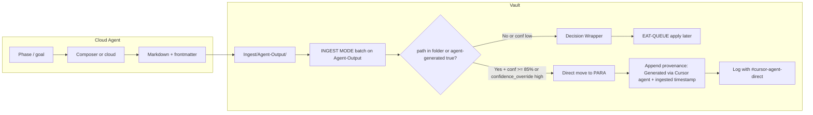

# Cursor Agent Ingest + Technical Progression

## Scope

- **Vault:** Ingest drop zone (Agent-Output/), skip-wrapper exception for agent-generated notes, workflow doc, and tech-progression config + rule/ingest branches. Cloud agent setup (Composer/cloud prompt, where it writes) stays on your side.
- **Integrated:** Technical progression levels (config + queue payload + ingest branch) so late roadmap phases get pseudo-code depth without changing vault role — ramp is by phase (early = user impact, mid = architecture, late = pseudo-code). No new queue modes or MCP skills.
- **Out of scope:** Watcher/Commander automation, custom vault templates.

---

## 1. Landing folder and documentation

- **Create** [Ingest/Agent-Output/](Ingest/Agent-Output/) and add a short **README** so the folder exists and is clearly the drop zone for Cursor agent output. No code change required for the pipeline — `Ingest/**/*.md` is already in scope in [.cursor/rules/context/para-zettel-autopilot.mdc](.cursor/rules/context/para-zettel-autopilot.mdc) (globs).
  - **In the README**, add the explicit ingest trigger: *"After dropping files here, run: **INGEST MODE: batch on Ingest/Agent-Output/**"* (uses documented batch ingest trigger from Pipelines.md / Queue-Alias-Table — no new alias needed).
- **Document** in [3-Resources/Second-Brain/Vault-Layout.md](3-Resources/Second-Brain/Vault-Layout.md): add a row or bullet under Ingest stating that `Ingest/Agent-Output/` is the drop zone for Cursor (Composer/cloud) agent output; notes here or with frontmatter `agent-generated: true` (and optionally `confidence_override: high`) may skip the Decision Wrapper and be moved in Phase 1 when conditions in para-zettel-autopilot are met (see below).
- **Exclusions:** Per docs, `Ingest/`** is processed by the ingest pipeline. Add `Ingest/Agent-Output/` (or leave as-is) to .cursorignore or Watcher exclusions only if needed (e.g. to avoid double-processing or noise); otherwise no exclusion required for pipeline scope.

---

## 2. Skip-wrapper exception in para-zettel-autopilot

**File:** [.cursor/rules/context/para-zettel-autopilot.mdc](.cursor/rules/context/para-zettel-autopilot.mdc)

**Insert a new subsection immediately before** `### Decision Wrapper creation (Phase 1 — every Ingest note)` (around line 32):

- **Title:** e.g. `### Cursor-agent direct move (Phase 1 — skip wrapper)`
- **Condition (all required):**
  - Note path is under `Ingest/Agent-Output/` **or** note has frontmatter `agent-generated: true`.
  - Run is **not** FORCE-WRAPPER (no `force_wrapper: true`).
  - **Confidence:** `ingest_conf ≥ 85%` **or** frontmatter `confidence_override: high` (so agent-trusted output can skip wrapper even if raw MCP conf would dip mid-band). Subfolder-organize has produced a single clear target path.
- **Behavior when condition holds:**
  - Do **not** create a Decision Wrapper.
  - Run the same move sequence as apply-mode: call **obsidian-snapshot** (per-change) for the note → **obsidian_ensure_structure**(folder_path: parent of target path) → **obsidian_move_note**(path, new_path, dry_run: true) → review effects → **obsidian_move_note**(path, new_path, dry_run: false) → **post-move frontmatter sync** on the note at the new path (para-type, project-id if under 1-Projects/, status: archived if under 4-Archives/) per [mcp-obsidian-integration](.cursor/rules/always/mcp-obsidian-integration.mdc).
  - **Provenance:** Append to the note (e.g. callout or inline): *"Generated via Cursor agent + ingested {{timestamp}}"* — keeps traceability; pattern already used in roadmap skills.
  - **Log:** Append to Ingest-Log.md with flag `**#cursor-agent-direct`** and note path + target path (enables Dataview/MOC filtering, e.g. "agent-direct moves this week").
- **When condition does not hold:** Fall through to the existing “Decision Wrapper creation” block (create wrapper as today).

**Update the summary bullets** in the same file so the exception is visible at a glance:

- Around lines 12 and 28: state that Phase 1 never move/rename **except** for notes in `Ingest/Agent-Output/` or with `agent-generated: true` when `ingest_conf ≥ 85%` or `confidence_override: high` (then direct move + provenance + log with #cursor-agent-direct).
- Optionally in the “Pipeline (Phase 1)” bullet (line 16): add “unless Cursor-agent direct move applies.”

---

## 3. Optional workflow note and link

- **Add** a short workflow note (e.g. [3-Resources/Second-Brain/Cursor-Agent-Ingest-Workflow.md](3-Resources/Second-Brain/Cursor-Agent-Ingest-Workflow.md)): Cursor agent produces Markdown (with frontmatter `agent-generated: true`, `confidence_override: high`) → drop into `Ingest/Agent-Output/` (or set same frontmatter if dropped elsewhere) → run **INGEST MODE: batch on Ingest/Agent-Output/** → if conditions hold (conf ≥ 85% or confidence_override high), note is moved directly to PARA with provenance; else a Decision Wrapper is created and EAT-QUEUE apply works as today.
- **Optional:** In the Genesis Mythos master goal or roadmap note, add one line linking to this workflow (e.g. “To ingest Cursor agent output: drop into Ingest/Agent-Output/, run INGEST MODE: batch on Ingest/Agent-Output/. See [[Cursor-Agent-Ingest-Workflow]].”).

---

## 4. Backbone docs and sync

Per [backbone-docs-sync](.cursor/rules/always/backbone-docs-sync.mdc):

- **Vault-Layout:** Updated in step 1.
- **Pipelines / Logs:** Document the log flag `**#cursor-agent-direct`** in [3-Resources/Second-Brain/Logs.md](3-Resources/Second-Brain/Logs.md) or the pipeline reference so Ingest-Log semantics and Dataview/MOC filtering stay clear.
- **Sync:** After editing [.cursor/rules/context/para-zettel-autopilot.mdc](.cursor/rules/context/para-zettel-autopilot.mdc), update [.cursor/sync/rules/context/para-zettel-autopilot.md](.cursor/sync/rules/context/para-zettel-autopilot.md) and optionally append an entry to [.cursor/sync/changelog.md](.cursor/sync/changelog.md).

---

## 5. Frontmatter flag in agent output

Instruct Composer/cloud agent to include the following in the YAML frontmatter of every output note. Gives the ingest pipeline an explicit hook without relying on folder path alone.

**Prompt snippet to add:**

```
Every output Markdown file must start with this YAML frontmatter:

---
agent-generated: true
confidence_override: high   # or medium if uncertain parts
project-id: genesis-mythos-master
roadmap-level: subphase     # or phase / task as appropriate
created: {{current-date}}
---
```

---

## 6. Composer starter prompt (phase-aware, ramps by phase)

Use this in Composer or as the seed for your cloud agent prompt; save it wherever you keep agent instructions (e.g. in the genesis-mythos-master repo). Include the frontmatter block from section 5. Tech depth ramps by phase so early phases stay conceptual and late phases get pseudo-code.

**Copy-paste block:**

```
From master goal [[genesis-mythos-master-goal-2026-03-07-0033]] (or @-reference) and this phase note, generate exhaustive dev-ready sub-tasks. Ramp tech depth by phase:

- Early phases (1–2): User impacts only (e.g. "smoother UX for DMs"). No jargon.
- Mid (3–4): Architecture + tradeoffs, no code (e.g. "use event bus for modularity", "decouple simulation from render loop").
- Late (5+): Pseudo-code per task (2–5 lines), edge cases, data shapes, invariants.

Per task: [ ] Task title (action verb first) | pseudo-code/logic (late only) | edge cases | data shapes. Output per sub-phase as separate Markdown files with frontmatter: agent-generated: true, confidence_override: high, roadmap-level: subphase, project-id: genesis-mythos-master, created. Filename: kebab-slug-YYYY-MM-DD-HHMM.md. Drop to Ingest/Agent-Output/; ingest skips wrapper when conf high.
```

---

## 7. Technical progression (config + rule + ingest branch)

So late roadmap phases get pseudo-code depth without changing the vault role (roadmap-generate-from-outline stays shallow by design; Cursor agent does the deep work). One config, one rule branch, one ingest branch.

- **Config** — [3-Resources/Second-Brain-Config.md](3-Resources/Second-Brain-Config.md) (or Parameters § Roadmap): add `roadmap_tech_progression: true` and tunable `tech_levels`:

```yaml
  roadmap_tech_progression: true   # Core philosophy: late phases must reach pseudo-code hand-off granularity
  tech_levels:
    level_1: high-concept   # Phases 1–2: user impacts only, no jargon
    level_2: mid-tech       # Phases 3–4: architecture patterns, tradeoffs
    level_3: pseudo-code    # Phases 5+: pseudo-code, edges, data shapes
  

```

- **Rule / queue** — In [Rules](3-Resources/Second-Brain/Rules.md) § auto-task-roadmap (or [auto-eat-queue](.cursor/rules/context/auto-eat-queue.mdc) dispatch): when `roadmap_tech_progression` is true, inject **tech_level** (value from phase number: 1–2 → high-concept, 3–4 → mid-tech, 5+ → pseudo-code) into the queue payload. Document in [Queue-Sources](3-Resources/Second-Brain/Queue-Sources.md) § prompt-queue contract.
- **Ingest branch** — In the Cursor-agent direct-move exception in [para-zettel-autopilot.mdc](.cursor/rules/context/para-zettel-autopilot.mdc): when the note has **tech_level > 1** (mid-tech or pseudo-code) and confidence is **mid-band** (68–84%), do **not** take the direct-move path; fall through so the **refinement loop** runs ([Parameters](3-Resources/Second-Brain/Parameters.md) § Confidence bands). High-conf or tech_level 1 unchanged.
- **Logs** — Add **tech_level** to Ingest-Log entries for agent-output ingest ([Logs](3-Resources/Second-Brain/Logs.md) § Ingest-Log).
- **MOC / validation query (optional)** — Add to roadmap master/phase notes or MOC template a one-line Dataview table to flag late-phase notes missing required depth after ingest:
  ```dataview
  TABLE tech_level, file.link AS "Incomplete?"
  WHERE tech_level >= 5 AND !contains(file.content, "pseudo-code")
  SORT file.name
  ```

---

## Flow summary




---

## Validation (after implementation)

- Composer test on one phase produces Markdown with the task format and required frontmatter (agent-generated, confidence_override, project-id, roadmap-level, created). Late phase (e.g. Phase 6) with progression prompt → deeper output (pseudo-code, edges, data shapes).
- Dropping that file into `Ingest/Agent-Output/` and running **INGEST MODE: batch on Ingest/Agent-Output/**: with conf ≥ 85% or `confidence_override: high`, note moves to the correct PARA location without a wrapper; provenance callout is appended; Ingest-Log shows **#cursor-agent-direct** (and **tech_level** when applicable).
- With `agent-generated: true` and `confidence_override: high`, no wrapper is created even if raw MCP conf would dip mid-band.
- When **tech_level** > 1 and conf mid-band: refinement loop runs (no direct move); when conf high, direct move still applies.
- Same file without those flags (or conf low and no override): Decision Wrapper is created; EAT-QUEUE apply works as today.
- Dataview / MOCs pick up the new content. If early phases are too tech-heavy, tune `tech_levels` in Config.

