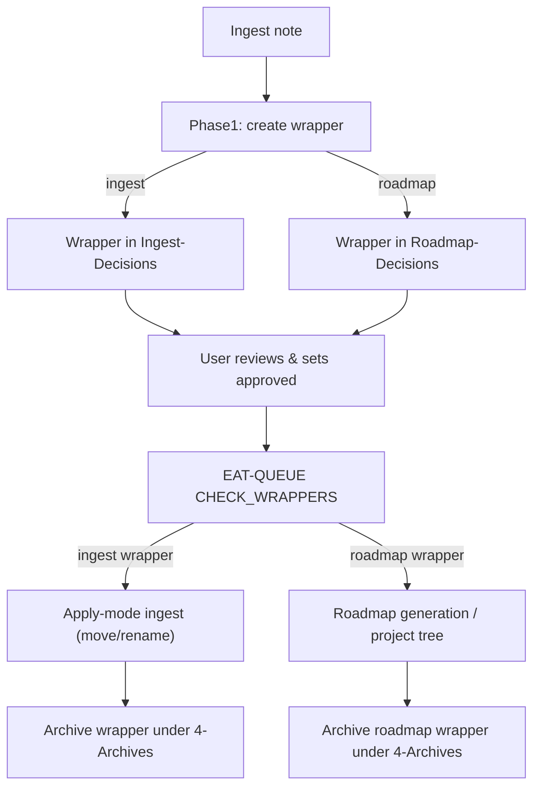

# Decision wrappers with Ingest-/Roadmap-Decisions subdirs

### Goals

- **Respect new directory layout**: Use `Ingest/Decisions/Ingest-Decisions/` for standard ingest wrappers and `Ingest/Decisions/Roadmap-Decisions/` for roadmap-related wrappers, with future-proof siblings like `Task-Decisions/` and `Organize-Decisions/`.
- **Preserve & strengthen the decision loop**: Keep wrappers as the single gate for destructive ingest actions (move/rename, roadmap generation) while making it obvious to the user where to review decisions.
- **Stay compatible with existing queues and logs**: Keep `INGEST MODE`, `CHECK_WRAPPERS`, and Dataview dashboards working with minimal breakage.

### High-impact / low-effort changes to do first

- **Standardize subfolder naming**: Commit to plural + purpose naming under `Ingest/Decisions/`:
  - `Ingest-Decisions/` for standard ingest path/rename decisions.
  - `Roadmap-Decisions/` (instead of `Road-Decisions/`) for roadmap-shaped decisions.
  - Reserve slots like `Task-Decisions/`, `Organize-Decisions/` for future decision types.
- **Fix stale `proposal_path` immediately**:
  - In `para-zettel-autopilot` wrapper creation, after choosing the destination subfolder, set `proposal_path` on the wrapper and on the original note to the **real full path**, e.g.  
  `Ingest/Decisions/Ingest-Decisions/Decision-for-{{slug}}--{{ts}}.md` or the `Roadmap-Decisions` equivalent.
  - As a one-off migration, sweep existing wrappers and correct any legacy `proposal_path: Ingest/Decisions/Decision-for-…` values.
- **Update Dataview queries for decisions**:
  - Replace any simplistic `FROM "Ingest/Decisions"` / `FROM "4-Archives/Ingest-Decisions"` uses with folder-aware logic, for example:  
  `FROM "Ingest/Decisions/Ingest-Decisions"` or `FROM "Ingest/Decisions/Roadmap-Decisions"` when you want a specific type, or  
  a `WHERE file.folder = "Ingest/Decisions/Ingest-Decisions"` / `.../Roadmap-Decisions"` filter when scanning the whole `Ingest/Decisions` tree.
  - Apply the same patterns in Vault-Change-Monitor and Pending Decisions dashboards so wrappers never “disappear” after refactors.

### Current state summary

- **Wrapper files** like `[Ingest/Decisions/Ingest-Decisions/Decision-for-AI-Integration--2026-03-05-0215.md](/home/darth/Documents/Second-Brain/Ingest/Decisions/Ingest-Decisions/Decision-for-AI-Integration--2026-03-05-0215.md)`:
  - Live under `Ingest/Decisions/Ingest-Decisions/`.
  - Frontmatter still has `proposal_path: Ingest/Decisions/Decision-for-...` (stale vs actual path).
  - Body Dataview queries use `FROM "Ingest/Decisions"` and `FROM "4-Archives/Ingest-Decisions"` which currently assume no subfolder split.
- **Rules** in `[.cursor/rules/context/para-zettel-autopilot.mdc](/home/darth/Documents/Second-Brain/.cursor/rules/context/para-zettel-autopilot.mdc)`:
  - Create wrappers at `Ingest/Decisions/Decision-for-{{original_slug}}--{{timestamp}}.md`.
  - Set `proposal_path` on the original note to match that legacy location.
  - Ensure there is a `CHECK_WRAPPERS` queue entry with `source_file: "Ingest/Decisions/"`.
- **Queue processor** in `[.cursor/rules/context/auto-eat-queue.mdc](/home/darth/Documents/Second-Brain/.cursor/rules/context/auto-eat-queue.mdc)`:
  - Step 0 scans **Decision Wrappers under `Ingest/Decisions/`** with `decision_candidate: true` and `approved: true`.
  - `CHECK_WRAPPERS` entries use `source_file: "Ingest/Decisions/"`.
  - After applying a wrapper, it moves the wrapper to `4-Archives/Ingest-Decisions/`.

### High-level flow (target)




### Planned changes

#### 1. Standardize wrapper frontmatter schema

- **Add/normalize fields** in the Decision Wrapper template (`Templates/Decision-Wrapper.md`):
  - `wrapper_type: ingest-decision` for standard ingest wrappers.
  - (Optionally) `source_pipeline: ingest` to future-proof for organize/archive wrappers.
  - Keep existing fields: `approved`, `approved_option`, `approved_path`, `original_path`, `decision_candidate`, `decision_priority`, `proposal_path`.
- **Ensure roadmap wrappers** (created in the roadmap branch of `para-zettel-autopilot`) set:
  - `wrapper_type: roadmap-decision` (or similar).
  - `suggested_project_name` and any roadmap-specific fields already described in the rule.
- **Migration note**: For existing wrappers under `Ingest/Decisions/Ingest-Decisions/`, add `wrapper_type: ingest-decision` and correct `proposal_path` to match the new actual path.

#### 2. Update wrapper file paths in `para-zettel-autopilot`

- In `### Decision Wrapper creation` section of `para-zettel-autopilot.mdc`:
  - Change the wrapper write path from `Ingest/Decisions/Decision-for-{{original_slug}}--{{YYYY-MM-DD-HHMM}}.md` to:
    - **Ingest wrappers**: `Ingest/Decisions/Ingest-Decisions/Decision-for-{{original_slug}}--{{YYYY-MM-DD-HHMM}}.md`.
    - **Roadmap wrappers**: `Ingest/Decisions/Roadmap-Decisions/Decision-for-{{original_slug}}--{{YYYY-MM-DD-HHMM}}.md`.
  - Update the `obsidian_ensure_structure` call to ensure the **subdirectory** exists (`Ingest/Decisions/Ingest-Decisions` or `Ingest/Decisions/Roadmap-Decisions`).
  - When setting `proposal_path` on the original Ingest note and in the wrapper frontmatter, use the **new full path** of the created wrapper so the link remains accurate.
- Keep the wrapper content-generation logic (options A–G, roadmap-specific A option) unchanged; only the file location, `wrapper_type`, and path fields differ.

#### 3. Adjust `CHECK_WRAPPERS` queue entries

- In `para-zettel-autopilot.mdc`, after wrapper creation:
  - Continue ensuring there is a `CHECK_WRAPPERS` entry in `.technical/prompt-queue.jsonl`, but optionally make the prompt more specific to future-proof:
    - For now, keep a simple version compatible with existing parsing, e.g.:  
    `{"mode":"INGEST MODE","prompt":"CHECK_WRAPPERS","source_file":"Ingest/Decisions/","id":"check-wrappers-<timestamp>"}`.
  - Document (in comments) that `source_file` now represents the **parent folder** of both `Ingest-Decisions` and `Road-Decisions` and that the actual scan will be refined in `auto-eat-queue.mdc`.
- Optionally, extend the protocol later to allow prompts like `"CHECK_WRAPPERS: ingest"` and `"CHECK_WRAPPERS: roadmap"` if you want separate passes; design the `auto-eat-queue` changes in a way that can accommodate that evolution.

#### 4. Update wrapper scanning & archiving in `auto-eat-queue.mdc`

- In the **wrapper-check requeue semantics** and Step 0 logic:
  - Replace references to "Decision Wrappers under `Ingest/Decisions/`" with logic that:
    - Scans **all markdown files** under `Ingest/Decisions/Ingest-Decisions/` and `Ingest/Decisions/Roadmap-Decisions/` (or, more generally, under `Ingest/Decisions/`**).
    - Filters to files where `decision_candidate: true` and `approved: true`.
    - Uses `wrapper_type` to branch behavior (ingest vs roadmap – see next section).
- For **archiving processed wrappers**:
  - Change the archive destination from `4-Archives/Ingest-Decisions/` to a structure mirroring the new subfolders, for example:
    - Ingest: `4-Archives/Ingest-Decisions/Ingest-Decisions/`.
    - Roadmap: `4-Archives/Ingest-Decisions/Roadmap-Decisions/`.
  - Ensure the rule uses `obsidian_ensure_structure` before moving wrappers into these archive paths.
- Keep ordering semantics the same: any `CHECK_WRAPPERS` entry is still processed **before** other queue entries.

#### 5. Make apply-mode behavior depend on `wrapper_type`

- In the **Decision Wrappers → apply-mode ingest** section of `auto-eat-queue.mdc` and in the `feedback-incorporate` skill logic:
  - For wrappers with `wrapper_type: ingest-decision`:
    - Keep existing behavior: resolve `hard_target_path` from `approved_option`/`approved_path`, treat the next `INGEST MODE` run as apply-mode for the original Ingest note, and perform move/rename after snapshots and confidence checks.
  - For wrappers with `wrapper_type: roadmap-decision`:
    - Route to the **roadmap pipeline**, e.g.:
      - Use `feedback-incorporate` to extract project name / structural hints from the wrapper.
      - Inject a queue entry (or direct call) to `roadmap-generate-from-outline` or `roadmap-ingest` with the original note as `source_file` and the wrapper guidance.
      - After successful roadmap generation, mark the wrapper as used (set `used_at`) and archive it to `4-Archives/Ingest-Decisions/Road-Decisions/`.
- Ensure both branches:
  - Preserve the invariants from `confidence-loops.mdc` and `mcp-obsidian-integration.mdc` (backups, snapshots, dry_run before move, etc.).
  - Log actions in `Ingest-Log.md` with enough information to correlate original note, wrapper, and final PARA path or project tree.

#### 5a. Decision lineage tracking for Task-Decisions (future extension)

- When you introduce `Task-Decisions` (e.g. wrappers that decide concrete parameters or choices for a roadmap phase/task), extend the apply-mode logic so that **resolving a Task-Decision also appends a provenance block to the relevant phase/task note**, for example:

  ```markdown
  > [!done] Resolved via [[Task-Decision-for-Phase-1-Grid-Size-…]] on 2026-03-05
  > Choice: A (20×20 fixed)
  > Guidance applied: …
  ```

- Implementation sketch:
  - Define `wrapper_type: task-decision` for these wrappers, plus frontmatter fields that capture:
    - `target_note`: the phase/task note to annotate.
    - `resolved_choice`: label/summary of the chosen option.
    - `guidance_applied`: short text derived from the wrapper’s Thoughts block.
  - In the apply-mode branch for `task-decision`:
    - After any structural change, call an MCP/skill step that `obsidian_update_note`-appends the provenance block to `target_note` (after a per-change snapshot).
    - Include a timestamp and link back to the Task-Decision wrapper so lineage is bidirectional.
  - Ensure this provenance append is logged (Ingest-Log or a dedicated Decisions-Log) so you can audit which constants/choices were locked in by which decision wrappers.

#### 6. Refresh the Decision Wrapper template body and Dataview queries

- In `Templates/Decision-Wrapper.md` (and any cloned copies in `3-Resources`):
  - Update the Dataview `FROM` clauses so they continue to show all wrappers after the subfolder split, for example:
    - Keep `FROM "Ingest/Decisions"` if Dataview recurses into subfolders (likely simplest), or
    - Narrow to `FROM "Ingest/Decisions/Ingest-Decisions"` for ingest-only dashboards and add a second block for road decisions (e.g. `FROM "Ingest/Decisions/Road-Decisions"`).
  - Update the archive query to point at the new archive structure, e.g. `FROM "4-Archives/Ingest-Decisions"` (still recursive) or more specific subfolders if desired.
  - Add a small column for `wrapper_type` so dashboards clearly distinguish ingest vs roadmap decision wrappers.
- Confirm that the quick instructions in the wrapper body still match the fields used by `feedback-incorporate` and `auto-eat-queue` (`approved_option`, `approved_path`, `approved`, `Thoughts` → `user_guidance`).

#### 7. Migrate existing wrappers to the new schema

- For all existing wrapper files under `Ingest/Decisions/Ingest-Decisions/` and any old ones still directly under `Ingest/Decisions/`:
  - **Move** legacy root-level wrappers into `Ingest-Decisions` if any remain, so all ingest wrappers live under the new subdir.
  - **Normalize frontmatter**:
    - Set `wrapper_type: ingest-decision` where missing.
    - Fix `proposal_path` to the actual file path.
  - Verify that any roadmap wrappers (if already created) are either located in `Road-Decisions` and marked `wrapper_type: roadmap-decision`, or treated as ingest-decision if they predate the roadmap branch.
- For archived wrappers under `4-Archives/Ingest-Decisions/`:
  - Optionally mirror the live-folder split (create `Ingest-Decisions` and `Road-Decisions` subfolders) and move historical wrappers accordingly for consistency, updating any Dataview dashboards that reference those locations.

#### 8. Update backbone documentation

- In `3-Resources/Second-Brain/Queue-Sources.md` and `3-Resources/Second-Brain/Pipelines-Reference.md` (or similarly named docs):
  - Document the new wrapper locations and `wrapper_type` semantics.
  - Update diagrams/text describing:
    - Phase 1 ingest → wrapper creation into `Ingest-Decisions` or `Road-Decisions`.
    - User review step as the gate for both apply-mode ingest and roadmap generation.
    - Archive paths under `4-Archives/Ingest-Decisions/`**.
- In any docs that previously mentioned `Ingest/Decisions/Decision-for-<slug>...`:
  - Clarify that this is now specifically `Ingest/Decisions/Ingest-Decisions/` for ingest decisions, with an analogous path for roadmap decisions.

### How this loops the user into task decision-making

- **Every ingest note** still produces a wrapper in Phase 1; the **only** way a note is moved/renamed or turned into a project roadmap is by:
  - The user checking an option (A–G or `approved_path`) and setting `approved: true` in the wrapper.
  - EAT-QUEUE processing that approved wrapper via `CHECK_WRAPPERS` into the appropriate pipeline.
- The new subdirectories make it easier to:
  - Maintain separate dashboards for “Where should this live?” (`Ingest-Decisions`) vs “How should this become a project roadmap?” (`Road-Decisions`).
  - Extend the same pattern later to other wrapper types (organize decisions, archive decisions) without breaking the ingest user loop.

