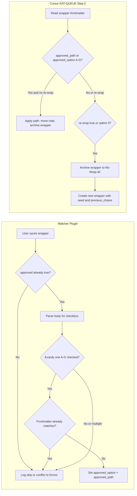

# Decision Wrapper: Checkbox sync, Re-Wrap flow, and safety

## 1. Remove default path frontmatter

- **Template**: [Templates/Decision-Wrapper.md](Templates/Decision-Wrapper.md)  
  - Ensure no `approved_option` or `approved_path` in the template (already absent; confirm no other defaults elsewhere).
- **Docs**: State explicitly that wrappers must not be created with default `approved_option`/`approved_path` so ingests only run on explicit user choice (checkbox → Watcher sets frontmatter, or explicit `re-wrap: true`).

## 2. Watcher plugin: read checkboxes and set frontmatter (Option A)

**Location**: [.obsidian/plugins/watcher/main.js](.obsidian/plugins/watcher/main.js)

**Safety (critical)**:

- **Watcher never sets `approved: true`** — that is manual only. Watcher **only syncs** `approved_option` and `approved_path` when the user has **already** set `approved: true` in frontmatter.
- **Watcher never sets `re-wrap: true`** — that is manual only. If the user is unhappy with wrapper options they set `approved: false` and `re-wrap: true` in frontmatter; Watcher does not touch re-wrap.
- **Trigger**: Register `vault.on("modify", (file) => ...)` so that when a **markdown file under `Ingest/Decisions/`** (including `Ingest-Decisions/`, `Roadmap-Decisions/`) is modified, the handler runs. **Only run sync when frontmatter already has `approved: true`** (otherwise skip; user has not approved yet).
- **Parse body** (after frontmatter) with **robust parsing** (see below).
- **If exactly one A–G is checked** and `approved: true`:
  - **Write-loop protection (implement before first line of code)**: Before writing, **read current frontmatter**. If `approved_option` and `approved_path` already match what you parsed → **skip write entirely**. This is idempotent and avoids any timing/debounce races.
  - If not already matching: set frontmatter `approved_option: "<letter>"` and `approved_path: "<extracted path>"`; preserve rest of note and frontmatter; write back.
- **If no A–G is checked** but `approved: true`:
  - Do **not** set `re-wrap: true` (manual only). Optionally treat as “user wants to force current path” if one exists in frontmatter, or do nothing and let user set `re-wrap: true` manually for re-wrap. Log to Errors.md: “No A–G checked but approved:true” in wrapper {path} (see Logging below).
- **Scope**: Apply to any wrapper type; same checkbox pattern for all.

**Checkbox parsing robustness (high value, low effort)**:

Real-world gotchas: `- [X]` (capital X), extra spaces `-  [ x ] ** A.` **, bold/italic variations, path in backticks or quotes, multiple checkboxes checked, option text changed (“A. (best one)”).

- **Case-insensitive checkbox**: Match `[x]` or `[X]`.
- **Flexible option marker**: Look for `A.`, `A)`, `A:`, `**A.`**, etc. → e.g. regex `\b([A-G])\b[\.\):]?\s`*.
- **Path extraction**: Take everything between the option marker and the first `—` or `%` or end-of-line. Trim aggressively (spaces, backticks, quotes).
- **Conflict rule**: If **more than one** A–G is checked → append to **Errors.md**: “Multiple options checked in wrapper {path}”. **Do not write any frontmatter** (force manual fix).
- **No checkbox but approved: true**: Log to Errors.md; do not write. User can set `re-wrap: true` manually to trigger re-wrap.

**Logging (Watcher)**:

- **All decisions** (sync, skip, conflict): append to **3-Resources/Wrapper-Sync-Log.md** (see §11.2 for format). Conflicts also append to **Errors.md**.

## 3. New frontmatter: Re-Wrap

- **Add to template and docs**: New optional frontmatter field `re-wrap: true`. **Manual only** — user sets it when unhappy with wrapper options: `approved: false` + `re-wrap: true`. Watcher does not modify re-wrap.
- **Semantics**: When `re-wrap: true` (and no path to apply), Cursor Step 0 runs the **re-wrap branch**: pull seed content (see §4), archive current wrapper to Re-Wrap dir, create a **new** wrapper with that seed and link to the archived original.
- **Option 0**: Cursor treats `approved_option: 0` the same as `re-wrap: true` for consistency (no path; run re-wrap branch if applicable).

## 4. Re-wrap semantics (Cursor pipeline)

- **Do not** overwrite the existing wrapper in place. **Archive** the current wrapper into the **Re-Wrap** directory, then **create a new wrapper** (same original note) with a link to the archived wrapper.
- **Re-Wrap archive path**: `4-Archives/Ingest-Decisions/Re-Wrap/<subfolder>/` mirroring structure (e.g. `Re-Wrap/Ingest-Decisions/`, `Re-Wrap/Roadmap-Decisions/`).
- **Safety**: Backup + per-change snapshot before moving the wrapper to Re-Wrap; then create the new wrapper with link to the archived note (e.g. `Archived previous: [[...]]`).

**Seed definition (what gets carried forward)**:

- **Must copy** into the new wrapper’s seed / context for re-run: `user_guidance` block (if present), **Thoughts** callout content, **original_path** link, **wrapper_type** (ingest-decision or roadmap).
- **Should copy** (optional but useful): `suggested_project_name`, confidence from previous run, **previous_choice** — store previous `approved_option` + path as `previous_choice` in frontmatter so the user sees history.
- **Do not copy**: `approved: true`, `re-wrap: true`, `processed: true`.

New wrapper re-uses **user_guidance + Thoughts + original_path** as the new seed content; **previous_choice** frontmatter is added for traceability. Run Phase-1-style classification/proposal for the original note with that guidance; fill a fresh Decision-Wrapper template (A–G). Set `approved: false`, no `approved_option`/`approved_path`, no `re-wrap` on the new wrapper.

- **Re-wrap loop**: Allow re-wrap as long as content is pushed in the correct direction; optional re-wrap count log per original_path.

## 5. Cursor Step 0 (auto-eat-queue) changes

**File**: [.cursor/rules/context/auto-eat-queue.mdc](.cursor/rules/context/auto-eat-queue.mdc)

- **Branch A (approved, not processed)**:
  - **Path apply**: If frontmatter has `approved_option` (A–G) or `approved_path` and **no** `re-wrap: true`, resolve `hard_target_path` (from `approved_path` or by parsing body for the letter’s path if Watcher didn’t set it — fallback). Run apply-mode ingest (or roadmap Option A) as today; then move wrapper to `4-Archives/Ingest-Decisions/` (existing behavior).
  - **Re-wrap branch**: If `re-wrap: true` (user set manually when unhappy with options) **or** `approved_option: 0`:
    - **Ingest-decision**: Pull Thoughts from wrapper body. Archive current wrapper to `4-Archives/Ingest-Decisions/Re-Wrap/<subfolder>/<basename>.md` (backup + snapshot, then `obsidian_ensure_structure` + `obsidian_move_note`). Create **new** wrapper under `Ingest/Decisions/Ingest-Decisions/` (or Roadmap-Decisions for roadmap type) via same template and creation logic as para-zettel-autopilot, using original note at `original_path` and `guidance_text` = Thoughts. Add link in new wrapper to archived wrapper. Log CHECK_WRAPPERS with message indicating re-wrap (original_path, archived path, new wrapper path).
    - **Roadmap**: Same flow (archive to Re-Wrap, create new wrapper, link to archive). Re-wrap for roadmap is **user-oriented** (“how do you intend for this system to be used by your players; what is its goal?”) — **do not** re-build the roadmap tree. **Stub**: Implement re-wrap for ingest-decision first; for roadmap, stub the re-wrap branch (e.g. archive + create new wrapper with Thoughts as seed, but no roadmap-specific regeneration) and polish after ingest-decision re-wrap is complete.
- **feedback-incorporate**: Prefer `approved_path` from frontmatter when present; else map `approved_option` A–G to path (from frontmatter if Watcher set it; else parse body). Treat `re-wrap: true` or `approved_option: 0` as “no path, run re-wrap branch” (no `hard_target_path`).

## 6. Path from checked option: parse body when needed

- **Primary**: Watcher (Option A) parses the checked line and sets `approved_option` and `approved_path` in frontmatter on save.
- **Fallback**: If Cursor runs and frontmatter has `approved_option` (A–G) but missing `approved_path`, parse the wrapper body for the line matching that letter (e.g. `**F.** path — N%`) and set `approved_path` from that line (or use it in-memory for `hard_target_path`). Document in [.cursor/skills/feedback-incorporate/SKILL.md](.cursor/skills/feedback-incorporate/SKILL.md) and auto-eat-queue.

## 7. Safety and logging

- **Archive before new wrapper**: Always backup + per-change snapshot before moving the current wrapper to `4-Archives/Ingest-Decisions/` or `4-Archives/Ingest-Decisions/Re-Wrap/...`. Then create the new wrapper (for re-wrap) with link to the archived original.

**Logging and observability (explicit log points)**:

- **Watcher** (see §2 and §11.2): Append **every** decision (sync, skip, conflict) to **3-Resources/Wrapper-Sync-Log.md** in the format given in §11.2. Conflicts also append to **Errors.md**.
- **Cursor (EAT-QUEUE Step 0)**: When re-wrap is triggered, log clearly: e.g. “Re-wrapping {original wrapper path} → new wrapper created at {new path}” in Ingest-Log (CHECK_WRAPPERS) and/or Backup-Log. Ingest-Log (CHECK_WRAPPERS): also log path-apply (path, wrapper, original) and re-wrap (original_path, archived path, new wrapper path, seed carried).
- Prevents “where did my frontmatter go?” debugging; all events are Dataview-queryable.

## 8. Wrapper types and docs

- **Same pattern** for both **ingest-decision** and **roadmap**: checkbox → frontmatter (Watcher sync when approved), path apply vs re-wrap (Cursor). Roadmap path-apply keeps current “Option A = create project + roadmap tree” semantics; roadmap re-wrap is stubbed (archive + new wrapper with Thoughts as seed; no roadmap tree rebuild).
- **Template**: Add `re-wrap` to the template frontmatter comments (optional, **manual only**). Remove or avoid any default `approved_option`/`approved_path`.
- **Vault-Layout / Second-Brain docs**: Document `4-Archives/Ingest-Decisions/Re-Wrap/` (and subfolders). Update [3-Resources/Second-Brain/Vault-Layout.md](3-Resources/Second-Brain/Vault-Layout.md) and any Backup-Log / Ingest-Log references.

## 9. Template UX polish

In [Templates/Decision-Wrapper.md](Templates/Decision-Wrapper.md), add **two callouts at the top** (after frontmatter, visible to user):

**1. Safety invariant (verbatim)** — see §11.1.

**2. How-to (enhanced, actionable for mobile/Commander)**:

```markdown
> [!tip] How to approve this wrapper
> 1. Check **exactly one** option A–G  
> 2. (optional) Add thoughts/guidance in the Thoughts callout  
> 3. Set `approved: true` in frontmatter (or use Commander "Approve Wrapper" macro if set up)  
> → Watcher will auto-sync your choice → run **EAT-QUEUE** (or wait for auto-nudge) to apply
```

Reduces "I approved but nothing happened" support tickets; one-line "what happens next" hint.

## 10. Order of implementation

1. **Watcher — write-loop protection first**: Implement “read current frontmatter → if approved_option and approved_path already match parsed → skip write” **before** any other Watcher sync code. Then add vault modify handler for `Ingest/Decisions/**/*.md`; only run when `approved: true`; robust checkbox parsing; set only `approved_option` + `approved_path` (never `approved` or `re-wrap`); log success to Wrapper-Sync-Log.md or Feedback-Log, conflicts to Errors.md.
2. **Cursor**: Add re-wrap branch to Step 0 (ingest-decision first): detect `re-wrap: true` or `approved_option: 0`; archive to Re-Wrap dir; create new wrapper with seed (user_guidance + Thoughts + original_path, previous_choice); link to archive; log “Re-wrapping {path} → new wrapper created”.
3. **Template + docs**: Add callout (§9), `re-wrap` in frontmatter comments (manual only), no default path; document Re-Wrap dir and flow.
4. **feedback-incorporate**: Prefer frontmatter path; fallback parse body; treat re-wrap/option 0 as no path.
5. **Roadmap re-wrap**: Stub after ingest-decision re-wrap is complete.
6. **Final polish (§11)**: Add "no auto-approve" invariant (verbatim) to template, Pipelines.md, para-zettel-autopilot.mdc; ensure Watcher logs every decision to Wrapper-Sync-Log.md; template callouts (safety + enhanced how-to) in Decision-Wrapper.md.

## 11. Final polish (low effort, high return)

### 11.1 Explicit "no auto-approve" invariant in docs + template

Prevents future footguns; makes it crystal-clear that Watcher never approves. Add the following (verbatim) in **three** places:

**Where:**

- [Templates/Decision-Wrapper.md](Templates/Decision-Wrapper.md) — top callout (e.g. immediately after frontmatter, before or with the How-to tip)
- [3-Resources/Second-Brain/Pipelines.md](3-Resources/Second-Brain/Pipelines.md) — Decision Wrapper section
- [.cursor/rules/context/para-zettel-autopilot.mdc](.cursor/rules/context/para-zettel-autopilot.mdc) — comment block near wrapper/apply-mode logic

**Text (verbatim):**

```markdown
> [!important] Safety invariant — Watcher never approves
> Watcher **only** syncs `approved_option` + `approved_path` when `approved: true` is **already set by the user**.  
> Watcher **never** sets `approved: true` itself — that remains a manual user action (frontmatter edit or Commander macro).  
> This prevents accidental auto-approval loops even if Watcher logic evolves later.
```

### 11.2 Watcher: log every decision (including skips) — dedicated section

**Log target:** New file **3-Resources/Wrapper-Sync-Log.md** (append-only, Dataview-friendly). Watcher appends **every** decision: sync (wrote option+path), skip (frontmatter already matched), conflict (multiple checkboxes, no A–G but approved, etc.). Conflicts also append to Errors.md.

**Format (append-only lines):**

```markdown
- 2026-03-05 14:32: Watcher sync  | wrapper: Ingest/Decisions/.../2026-03-05-minecraft-wrapper.md | action: set approved_option: F | approved_path: 1-Projects/OG-Minecraft-Clone/... | previous values matched: no
- 2026-03-05 14:33: Watcher skip   | wrapper: ... | reason: frontmatter already matches parsed values
- 2026-03-05 14:34: Watcher conflict | wrapper: ... | reason: multiple checkboxes detected — no frontmatter written
```

Enables quick "yes it worked" and Dataview queries (e.g. `TABLE reason FROM "Wrapper-Sync-Log" WHERE contains(reason, "conflict")`). Costs ~3 lines in the JS handler per outcome.

### 11.3 Template callout "what happens next"

The enhanced How-to callout in §9 already includes the one-line "what happens next" hint: "→ Watcher will auto-sync your choice → run **EAT-QUEUE** (or wait for auto-nudge) to apply". No further change; §9 is the single source for that text.

## Mermaid (high level)




