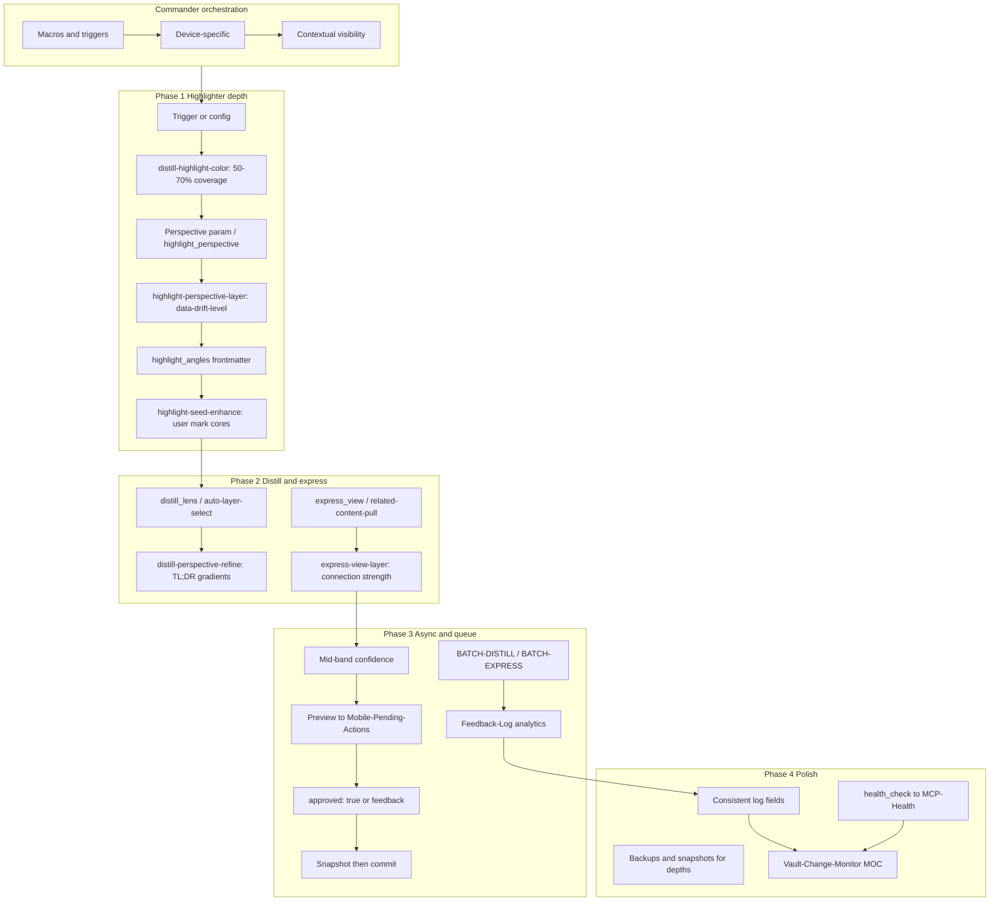
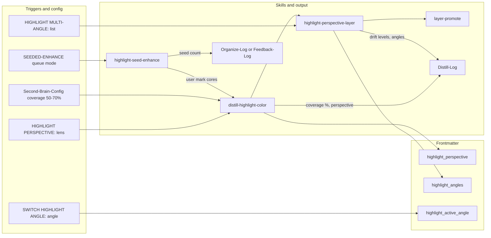
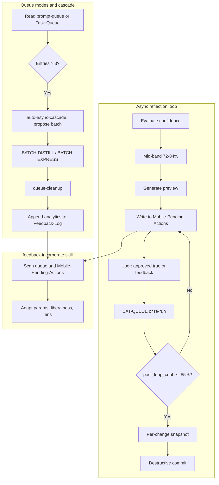
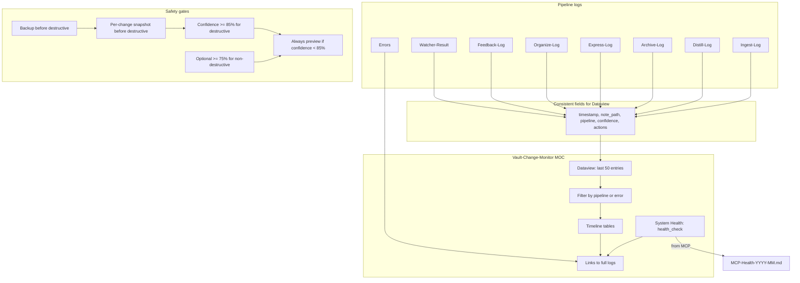
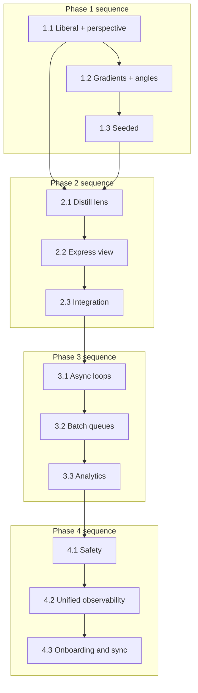
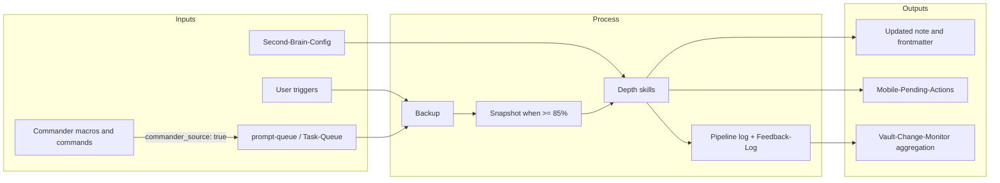

# Depth Enhancements — Implementation Plan

This plan maps your phased depth-enhancements spec to concrete artifacts in the Second Brain vault. It preserves existing invariants: backup-first, per-change snapshots before destructive steps, confidence bands (72–84% mid, ≥85% high), dry_run-then-commit for moves, and backbone-docs-sync. **Observability**: Log coverage/drift/lens/view stats in pipeline logs; ensure fields feed MOC aggregation (Phase 4 Vault-Change-Monitor). **Commander (Master Goal v5)**: Commander is an optional but deeply rooted **command orchestration layer**—surfacing manual triggers (e.g. EAT-QUEUE, pipeline modes, roadmap tools) in customizable, contextual ways (mobile toolbar for quick ingestion, macros for chained async flows). It bridges mobile inputs (quick queues during ingestion) with laptop processing (pipelines/skills); macros respect safety (e.g. backup-check before destructive chains), and device-specific visibility optimizes the mobile–laptop divide. Commander-triggered actions log with **commander_source: true** and **commander_macro: name** for MOC tracking. Manual triggers only—no auto-execution.

### Depth enhancements overview (with Commander orchestration)

---

## Current state (verified)

- **distill-highlight-color** (`[.cursor/skills/distill-highlight-color/SKILL.md](.cursor/skills/distill-highlight-color/SKILL.md)`): Uses [Highlightr-Color-Key](3-Resources/Highlightr-Color-Key.md) (Section 1 + 2), `data-highlight-source="agent"`, color theory (analogous/complementary). Confidence gate ≥80%. No coverage target, perspective, or gradient.
- **Color-Coded-Highlighting.md** (`[3-Resources/Second-Brain/Color-Coded-Highlighting.md](3-Resources/Second-Brain/Color-Coded-Highlighting.md)`): Documents semantic key, project overrides, color theory; no perspective/drift/angles.
- **Queue**: [Queue-Sources.md](3-Resources/Second-Brain/Queue-Sources.md) and [auto-eat-queue.mdc](.cursor/rules/context/auto-eat-queue.mdc) define modes for prompt-queue.jsonl and Task-Queue.md; no BATCH-DISTILL, BATCH-EXPRESS, SEEDED-ENHANCE, ASYNC-LOOP.
- **Confidence loops**: [confidence-loops.mdc](.cursor/rules/always/confidence-loops.mdc) and pipeline rules use synchronous mid-band loop (single pass, non-destructive); no async preview → mobile approval flow.
- **No existing**: highlight-seed-enhance, highlight-perspective-layer, distill-perspective-refine, express-view-layer skills; no auto-highlight-perspective, mobile-seed-detect, auto-distill-perspective, auto-express-view, auto-async-cascade rules; no Feedback-Log.md in Logs.md.
- **Commander**: Shallow integration done ([Commander-Plugin-Usage.md](3-Resources/Commander-Plugin-Usage.md), [Plugins.md](3-Resources/Second-Brain/Plugins.md)). Plan deepens it as command orchestration layer: UI placement, device-specific visibility, macros for Depth triggers, pipeline/async synergy, and commander_source/commander_macro in logs and MOC.

---

## General recommendations (refinements)

Low-to-medium effort refinements for efficiency, safety, and synergy without bloating the plan.

| Recommendation type        | Effort | Benefit                | Artifacts impacted                                |
| -------------------------- | ------ | ---------------------- | ------------------------------------------------- |
| Mobile-first testing       | Low    | Ensures divide synergy | README.md (Testing Remediations)                  |
| Configurability boost      | Low    | User-shaped depths     | Second-Brain-Config.md, Configs.md                |
| Observability enhancements | Medium | Evolving insights      | Feedback-Log.md, Logs.md, Vault-Change-Monitor.md |
| Safety refinements         | Low    | Trustworthy macros     | Commander-Plugin-Usage.md, Errors.md              |
| Onboarding integration     | Low    | Faster adoption        | README.md                                         |

- **Prioritize mobile-first testing**: Test all new triggers/macros on mobile first (e.g. via Commander toolbar). Simulate "ingestion breaks" (e.g. queue a lens during a mock lunch)—verify previews land in Mobile-Pending-Actions without sync lags. Add a **"Mobile Edges"** section to README Testing Remediations (e.g. "Queue BATCH-DISTILL on mobile; confirm laptop batch doesn't overwhelm with >10 items").
- **Configurability boost**: Expand [Second-Brain-Config](3-Resources/Second-Brain-Config.md) with a **depths** section (e.g. `depths.highlight_coverage_min: 50`, `depths.async_loop_max_hours: 24`, `depths.commander_macro_limits: 5` to cap chained commands). Document in [Configs.md](3-Resources/Second-Brain/Configs.md). Enables user tuning post-rollout.
- **Observability enhancements**: In Feedback-Log.md, add **Dataview-friendly fields** (e.g. `drift_avg`, `loop_refinements_count`) for quick queries. Rotate with log-rotate skill; auto-append **commander_macro stats** (e.g. "Most used: Queue Perspective (15x this week)") where applicable.
- **Safety refinements**: For new skills/macros, add a **pre-check macro** in Commander (e.g. "Safety Wrapper" = ensure_backup + health_check). Update Errors.md entry template with a **commander_macro** field for traceability.
- **Onboarding integration**: In README, add **"Depths with Commander Quickstart"** (e.g. "Tap 'Queue Highlight Perspective' on mobile toolbar; approve preview on laptop—observe gradients"). Roots Commander early in real-project immersion.
- **Plugin synergies**: If macros need delays/loops (e.g. for async previews), consider **Commando** as companion—add to [Plugins.md](3-Resources/Second-Brain/Plugins.md): "Enhances Commander macros; optional for timed chains." Keep optional; no high effort.

---

## Phase 1: Highlighter depth (liberal use, perspectives, gradients, angles, seeds)

Enhance distill-highlight-color; add initial observability ties (e.g., log highlighter coverage/drift stats).

### 1.1 Liberal highlighting and perspective triggers (Medium)

- **distill-highlight-color skill**
  - Add default **content coverage** target: 50–70% of meaningful spans (configurable via [Second-Brain-Config](3-Resources/Second-Brain-Config.md) or skill param). **Tweak (adaptive coverage)**: Use content length/complexity (e.g. via readability-flag integration) to auto-adjust within range; log as **coverage_adapted: X%** (e.g. 62%) for MOC.
  - Add **perspective** input: e.g. `perspective: "combat systems"` or `perspective: "performance"`. When set, map lens-focused spans to analogous colors (same theme = same hue family); document in skill that perspective narrows which spans get highlighted and how they are grouped by color.
  - Keep existing behavior when perspective is absent; keep confidence gate (align to ≥85% for structural highlight edits per pipeline reference, or retain ≥80% and document in pipeline table).
- **Context rule** (new): `**.cursor/rules/context/auto-highlight-perspective.mdc`**
  - Trigger: **HIGHLIGHT PERSPECTIVE: [lens]** (e.g. "HIGHLIGHT PERSPECTIVE: combat systems"). Invoke highlight pass on current note or batch (distill pipeline or dedicated highlight step with `perspective` set from the phrase). **Commander**: This trigger can be surfaced via Commander (e.g. "Queue Highlight: Combat" macro that prompts for lens and appends to queue); see Commander deepening §2.3.
  - Document that this rule defers to auto-distill / full-autonomous-ingest for actual steps; it sets context (e.g. frontmatter or queue payload) for perspective.
- **Frontmatter**: Document `**highlight_perspective: [lens]`** in [Highlightr-Color-Key](3-Resources/Highlightr-Color-Key.md) (or Color-Coded-Highlighting) for auto-shaping on distill/express runs.
- **Observability**: Log **coverage %** and **perspective** used in [Distill-Log.md](3-Resources/Distill-Log.md); ensure these fields are consistent so future MOC queries (e.g. Vault-Change-Monitor) can aggregate.
- **Docs**
  - [Color-Coded-Highlighting.md](3-Resources/Second-Brain/Color-Coded-Highlighting.md): Add **"Perspective guidelines"** section (when to use a lens, examples, relation to analogous colors).
  - [Highlightr-Color-Key](3-Resources/Highlightr-Color-Key.md): Add short examples for perspective-based highlighting in "For MCP / pipelines" or a new subsection.

**Backbone sync**: Update [Skills.md](3-Resources/Second-Brain/Skills.md) and [Pipelines.md](3-Resources/Second-Brain/Pipelines.md) for distill-highlight-color (coverage, perspective); add auto-highlight-perspective to [Rules.md](3-Resources/Second-Brain/Rules.md). Sync new/updated rule to `.cursor/sync/rules/context/`.

### 1.2 Drift gradients and multi-angle layering (Medium)

- **New skill**: **highlight-perspective-layer** (post-slot after distill-highlight-color in autonomous-distill and, if desired, after highlight in ingest).
  - Apply **drift level** via a data attribute (e.g. `data-drift-level="0"` … `data-drift-level="3"`) on `<mark>` or wrapper: 0 = core, higher = fading relevance. Use CSS (vault snippet or Highlightr-compatible) to render gradients (e.g. solid → fade) from `data-drift-level`; document in skill that the skill only sets the attribute, CSS does the visual.
  - **Angles**: Store in frontmatter `**highlight_angles: [list]`** (e.g. `["combat", "performance"]`); skill adds or updates this when applying a layer run so that "SWITCH HIGHLIGHT ANGLE" or multi-angle runs have a clear list.
  - **Confidence**: Apply gradients/layers only when confidence ≥85%; for mid-band, produce preview-only (e.g. append a small callout with proposed drift/angles) and do not write back. Per [mcp-obsidian-integration](.cursor/rules/always/mcp-obsidian-integration.mdc), snapshot before any destructive step.
- **Triggers**
  - **SWITCH HIGHLIGHT ANGLE: [angle]** — Implement via context rule or queue mode that sets current angle (e.g. frontmatter `highlight_active_angle`) and optionally re-runs highlight step for that angle only; or document that switching is CSS/Dataview-driven (e.g. CSS hides/shows by angle class).
  - **HIGHLIGHT MULTI-ANGLE: [list]** — Queue multiple runs (one per angle) or a single batch run that applies multiple angles and writes `highlight_angles`; document in Queue-Sources as a new mode or a variant of DISTILL MODE with payload.
- **Mobile sync**: When a run produces layered output (e.g. multiple angles), append a short bulleted summary by angle to [Mobile-Pending-Actions](3-Resources/Mobile-Pending-Actions.md) (e.g. "Angle X: 3 highlights; Angle Y: 5 highlights") so mobile users see what was shaped.
- **Safety**: Gradients only at ≥85%; mid-band preview only. Snapshot before first structural change in the pipeline that includes highlight-perspective-layer.
- **Docs**
  - [Skills.md](3-Resources/Second-Brain/Skills.md): Add Mermaid for highlighter flow (distill-highlight-color → highlight-perspective-layer → layer-promote).
  - [Plugins.md](3-Resources/Second-Brain/Plugins.md): Note Highlightr CSS extensibility (data-drift-level, angle-based classes).
- **Commander tie-in**: Add macro **"Seed and Layer"** = detect user `<mark>` + queue highlight-seed-enhance + preview gen. Document in Commander-Plugin-Usage.md.
- **Recommendation**: Test gradients on mobile—ensure CSS (data-drift-level) renders without lags; document **fallback to emojis** if needed in [Color-Coded-Highlighting.md](3-Resources/Second-Brain/Color-Coded-Highlighting.md).

**Pipeline reference**: Add highlight-perspective-layer to [Cursor-Skill-Pipelines-Reference](3-Resources/Cursor-Skill-Pipelines-Reference.md) in autonomous-distill (and optionally ingest) table and snapshot triggers if it performs destructive edits.

### 1.3 Seeded enhancement from manual inputs (Low)

- **New or updated skill**: **highlight-seed-enhance**
  - Detect user `<mark>` that have **no** `data-highlight-source` (i.e. user/Highlightr UI highlights). Treat these as "cores" (solid color); optionally add `data-highlight-source="user-seed"` when extending so agent-added spans are distinguishable.
  - Extend from seeds with AI: e.g. same paragraph or list, analogous color for related phrase; optionally add light gradient (drift) from seed to extended span.
  - Gate: only run when confidence ≥85%; else propose extensions in a callout.
- **Context rule** (new): `**.cursor/rules/context/mobile-seed-detect.mdc`** (or equivalent name)
  - When a note has user highlights (e.g. glob or frontmatter `#has-user-highlights`), allow queue or trigger to run highlight-seed-enhance (e.g. "SEEDED-ENHANCE" mode or "Enhance highlights from seeds"). Do not auto-run on every save; only on explicit trigger or queue.
- **Testing**: In [README](3-Resources/Second-Brain/README.md) or Testing Remediations, add a short check: add `<mark>...</mark>` on mobile (no data-highlight-source), run SEEDED-ENHANCE or equivalent on laptop, verify seed-weighted edges and optional gradient.

**Queue**: Add **SEEDED-ENHANCE** to [Queue-Sources](3-Resources/Second-Brain/Queue-Sources.md) and to [auto-eat-queue](.cursor/rules/context/auto-eat-queue.mdc) dispatch (e.g. map to a highlight-only pass that runs highlight-seed-enhance). Add to [Parameters](3-Resources/Second-Brain/Parameters.md) queue modes.

### Phase 1: Highlighter flow (detailed)

---

## Phase 2: Distill and express pipeline depths (lenses, iterations, views)

Deepen pipelines; add log fields for depths (e.g., lens used, iteration count) to support MOC aggregation.

### 2.1 Perspective lenses and gradient indicators in distill (Medium)

- **distill_note / auto-layer-select**
  - Support `**distill_lens: [angle]`** in frontmatter or as param (e.g. "beginner/simple" vs "expert/deep"). When set, shape layers toward that lens. Document in [auto-layer-select](.cursor/skills/auto-layer-select/SKILL.md) and pipeline reference.
- **New skill**: **distill-perspective-refine** (post layer-promote)
  - Add emojis or gradient indicators in TL;DR callout for depth/drift (e.g. core vs fading relevance). Use existing callout format; avoid breaking Reading mode.
  - Confidence: ≥85% to write; mid-band preview only.
- **Context rule** (new): `**.cursor/rules/context/auto-distill-perspective.mdc`**
  - Trigger: **DISTILL LENS: [angle]**. Set frontmatter `distill_lens` and/or pass to distill run; pipeline runs as usual with lens applied.
- **Async**: Queue **REFINE DISTILL: [feedback]** with previews (e.g. to Mobile-Pending-Actions or callout).
- **Observability**: Log **lens** and **gradient stats** (e.g. distill_lens used, drift levels in TL;DR) in [Distill-Log.md](3-Resources/Distill-Log.md).
- **Tweak (lens/view sharing)**: Propagate distill_lens/express_view to **linked notes** (e.g. via suggest_connections MCP tool where applicable). Log **lens_propagated: N notes** for MOC.
- **Commander tie-in**: Macro **"Express View Chain"** = prompt for view + trigger EXPRESS MODE + append to hub. Make **contextual** (visible only on express-eligible notes). Document in Commander-Plugin-Usage and Mobile-Toolbar-Task-Commands.
- **Docs**: [Pipelines.md](3-Resources/Second-Brain/Pipelines.md) — add distill-lens sub-pipeline flowchart (optional distill_lens → auto-layer-select → distill layers → distill-highlight-color → layer-promote → distill-perspective-refine → callout-tldr-wrap). Add **cross-phase testing** sub-subphase: Phase 1 angles feeding Phase 2 refinements—verify in flowchart.

**Snapshot**: Add distill-perspective-refine to snapshot triggers table in [Cursor-Skill-Pipelines-Reference](3-Resources/Cursor-Skill-Pipelines-Reference.md) if it rewrites note content.

### 2.2 View-based expression and relation gradients (Medium)

- **express-mini-outline / related-content-pull**
  - Support `**express_view: [angle]`** (e.g. "stakeholder high-level" vs "dev technical"). Shape outline and Related section by view; document in [express-mini-outline](.cursor/skills/express-mini-outline/SKILL.md) and [related-content-pull](.cursor/skills/related-content-pull/SKILL.md).
- **New skill**: **express-view-layer**
  - Apply gradient or strength indicators in Related section for connection strength (e.g. data-connection-strength or class); same storage format as existing (e.g. inline style or class from key). Use project colors where applicable.
- **Context rule** (new): `**.cursor/rules/context/auto-express-view.mdc`**
  - Trigger: **EXPRESS VIEW: [angle]**. Set `express_view` and run express pipeline.
  - Queue mode or phrase: **ITERATE EXPRESS: [feedback]** for feedback-driven re-runs with previews.
- **Mobile exports**: Document or add queue modes **EXPORT-HIGHLIGHTS** / **EXPORT-ROADMAP** for phone-friendly views (e.g. PDF with gradients); implementation can be "append to Mobile-Pending-Actions with instructions" or link to export plugin until a concrete export step exists.
- **Docs**: [Pipelines.md](3-Resources/Second-Brain/Pipelines.md) — add express-view and express-view-layer to express pipeline overview.

### 2.3 Integration and testing (Low)

- **Cross-pipeline**: Ensure `highlight_angles` / `highlight_perspective` (and distill_lens, express_view) propagate via frontmatter so that highlighter depths feed into distill/express (e.g. express-mini-outline reads highlight_angles for section colors). Document in Skills.md and Pipelines.md.
- **Templates**: [Templates.md](3-Resources/Second-Brain/Templates.md) — add callout formats for previews/proposals (e.g. `> [!preview] Pending highlight/distill/express — run EAT-QUEUE after review`).
- **Testing**: Simulate mobile → laptop: queue a lens or perspective on "mobile" (e.g. add to queue file), process on "laptop" via EAT-QUEUE, verify gradients and angles in note and logs.

---

## Phase 3: Async and queue synergies (reflection loops, batch shaping, analytics)

Enhance async; add queue analytics to Feedback-Log.md, feeding into MOC.

### 3.1 Async reflection loops (Medium)

- **confidence-loops.mdc**
  - Extend mid-band behavior: **async refinement** — generate preview and write to [Mobile-Pending-Actions](3-Resources/Mobile-Pending-Actions.md). Do **not** commit destructive action until user sets `**approved: true`** in frontmatter or adds feedback. On next EAT-QUEUE or re-run, if approved or feedback present, proceed to snapshot + destructive step if post_loop_conf ≥85%.
  - Document "Async-Loop Flow" in [Parameters.md](3-Resources/Second-Brain/Parameters.md) (Mermaid: preview → Mobile-Pending-Actions → user approval/feedback → re-run → commit).
- **New skill**: **feedback-incorporate** (always-applied or invoked at start of queue processor)
  - Scan queue or Mobile-Pending-Actions for user edits (e.g. approved: true, text feedback); adapt params (e.g. liberalness, lens) for the next run. Lightweight; no destructive writes. Document in Skills.md and pipeline reference.
- **Confidence tweak**: Optional config in [Second-Brain-Config](3-Resources/Second-Brain-Config.md) for **non-destructive lowers** (e.g. ≥75% for metadata-only or preview-only steps). Document **pros/cons** in [Parameters.md](3-Resources/Second-Brain/Parameters.md): faster depths vs more previews; safety unchanged for destructive (still ≥85% + snapshot).
- **Observability**: Log **loop outcomes** and **refinements** (e.g. pre/post_loop_conf, approved vs skipped) in [Feedback-Log.md](3-Resources/Feedback-Log.md).
- **Docs**: [Parameters.md](3-Resources/Second-Brain/Parameters.md) — add Async-Loop Flow Mermaid and async_preview_threshold (see 3.3).

### 3.2 Batch and cascade queues (Medium)

- **Queue processor** ([auto-eat-queue.mdc](.cursor/rules/context/auto-eat-queue.mdc) + [Queue-Sources](3-Resources/Second-Brain/Queue-Sources.md))
  - Add modes **BATCH-DISTILL**, **BATCH-EXPRESS** (and optionally BATCH-ARCHIVE): vault-wide or folder-scoped batch with shared lens/view. Dispatch: run autonomous-distill or autonomous-express on each note in scope; use batch snapshot when batch size > batch_size_for_snapshot.
- **New rule**: `**.cursor/rules/context/auto-async-cascade.mdc`**
  - When queue has >3 entries (or configurable threshold), optionally escalate to batch mode with previews: e.g. append to Mobile-Pending-Actions "Batch run proposed: N notes; run EAT-QUEUE with BATCH-DISTILL to apply." User confirms by running with that mode.
- **Queue-Sources**: Document new modes **SEEDED-ENHANCE**, **ASYNC-LOOP** (re-process after async preview), **BATCH-DISTILL**, **BATCH-EXPRESS**; add to canonical order in Queue-Sources and auto-eat-queue dispatch table. Add **"Commander-Sourced Modes"** table: format requirements for macro-appended entries (commander_source, commander_macro, payload shape).
- **Tweak (batch modes)**: In auto-eat-queue, add **overlap detection** (e.g. merge similar BATCH-* entries with >80% match; log merge in Feedback-Log). **Cap previews** at async_preview_threshold to avoid mobile overload.
- **Commander tie-in**: Macro **"Async Approve"** = scan Mobile-Pending-Actions + set approved: true + re-queue. **Device-specific**: mobile-only for quick reflections. Document in Commander-Plugin-Usage and confidence-loops.
- **Mobile toolbar / Commander**: Document "Queue Batch Shape" (e.g. multi-note selection → queue BATCH-DISTILL with scope); implementation: Watcher or Commander appending to prompt-queue with mode and scope. Commander-triggered entries use **commander_source: true**; see Commander deepening §2.3 and §4.1.

### 3.3 Queue analytics and evolution (Low)

- **Feedback-Log.md**: Create `**3-Resources/Feedback-Log.md`** if missing. Use for aggregated user-refinement stats (e.g. "40% of previews refined — consider increasing default depth"), loop outcomes, queue-cleanup analytics. One line or short block per run; no PII.
- **queue-cleanup skill** ([.cursor/skills/queue-cleanup/SKILL.md](.cursor/skills/queue-cleanup/SKILL.md))
  - Extend to append analytics to Feedback-Log.md (see 3.2); create file on first write if missing.
- **Second-Brain-Config**: Add **async_preview_threshold** (e.g. 72 or 85) — below this confidence, always emit async preview and do not commit; document in [Configs.md](3-Resources/Second-Brain/Configs.md) and [Second-Brain-Config](3-Resources/Second-Brain-Config.md).
- **Logs**: [Logs.md](3-Resources/Second-Brain/Logs.md) — add **Feedback-Log.md** to log destinations table and observability section; add **rotation spec** for Feedback-Log (e.g. monthly or with log-rotate skill).

### Phase 3: Async and queue flow (detailed)

---

## Phase 4: System-wide polish (safety, unified observability, onboarding)

Fill observability gap with Vault-Change-Monitor MOC; finalize confidence tweaks.

### 4.1 Safety and resilience (Low)

- **Depths and backups/snapshots**: Tie all new depth steps (highlight-perspective-layer, distill-perspective-refine, express-view-layer, highlight-seed-enhance) to backups and per-change snapshots; list each in the Snapshot triggers table in [Cursor-Skill-Pipelines-Reference](3-Resources/Cursor-Skill-Pipelines-Reference.md). Previews run before any non-destructive lower-threshold step.
- **mcp-obsidian-integration**: Update for **queue-aware tools** (e.g. batch dispatch, layer-render if added); document that gradients/layers are skill + CSS + frontmatter unless a new MCP tool is introduced.
- **Confidence**: Implement **lowered non-destructive threshold** (e.g. ≥75%) as a **config toggle** in [Second-Brain-Config](3-Resources/Second-Brain-Config.md) for metadata-only or preview-only steps. **Safety**: Always preview if confidence <85%; destructive actions remain ≥85% + snapshot; undo via snapshots when needed. Document in Parameters.md and Configs.md.

### 4.2 Unified observability (Medium)

- **New MOC**: `**3-Resources/Vault-Change-Monitor.md`**
  - **Dataview queries**: Last 50 (or N) entries across all pipeline logs (Ingest-Log, Distill-Log, Archive-Log, Express-Log, Organize-Log), filterable by pipeline and error.
  - **Timelines**: Dataview tables for recent changes (timestamp, note_path, pipeline, confidence, actions).
  - **Commander dashboard**: Add **"Commander Dashboard"** section—Dataview table for macros used, entries with commander_source: true (e.g. "Macros used this week").
  - **Health summaries**: Integrate **health_check** output; link or embed from MCP-Health-YYYY-MM.md (e.g. `3-Resources/MCP-Health-YYYY-MM.md`) into a "System Health" section.
  - **Links**: Links to full logs (Ingest-Log, Distill-Log, etc.), Errors.md, Feedback-Log.md, Watcher-Result.md.
- **Commander tie-in**: Macro **"MOC Refresh"** = run health_check + aggregate logs to MOC. Document in Commander-Plugin-Usage.
- **Recommendation**: **Post-rollout audit**—analyze Feedback-Log patterns (e.g. script or manual count of refinements); add to [Backbone.md](3-Resources/Second-Brain/Backbone.md) as **"Evolution Monitoring"** (e.g. how often users refine previews, drift_avg trends).
- **Logs.md**: Add MOC as **"Unified Dashboard"**; add **Mermaid** for log → MOC flow (all logs write consistent fields → Vault-Change-Monitor aggregates).
- **Integration**: Ensure **all logs** (including Feedback-Log.md, Watcher-Result.md) use **consistent fields** for Dataview aggregation (e.g. timestamp, note_path, confidence, actions, pipeline).
- **health_check**: Route MCP health_check results to **MCP-Health-YYYY-MM.md**; aggregate or link in Vault-Change-Monitor "System Health" section.
- **Docs**: [Backbone.md](3-Resources/Second-Brain/Backbone.md) — add **"Unified Observability"** narrative; [Vault-Layout.md](3-Resources/Second-Brain/Vault-Layout.md) — add Vault-Change-Monitor and log → MOC flow.

### Phase 4: Unified observability and safety (detailed)

### 4.3 Onboarding and testing (Medium)

- **README** ([3-Resources/Second-Brain/README.md](3-Resources/Second-Brain/README.md)): Include **MOC in onboarding** (e.g. "Monitor changes via [Vault-Change-Monitor](3-Resources/Vault-Change-Monitor.md)"); keep depth examples (queue perspective highlight on mobile, run EAT-QUEUE on laptop).
- **Full testing**: Async/observability edges (e.g. log scattering → MOC aggregation); confidence lowers (e.g. non-destructive at 75% with previews, destructive still gated at 85%).
- **Docs and sync**: Sync all new/updated rules and skills to `**.cursor/sync/`**; update [Cursor-Skill-Pipelines-Reference](3-Resources/Cursor-Skill-Pipelines-Reference.md) with new skills, snapshot triggers, and log fields.

---

## Implementation order and dependencies

- Phase 1.1 first (foundation for perspective and coverage).
- Phase 1.2 builds on 1.1 (angles in frontmatter); 1.3 can follow 1.2.
- Phase 2 uses frontmatter from Phase 1 (highlight_angles, highlight_perspective) and adds distill_lens, express_view.
- Phase 3 depends on Phase 2 for batch/distill/express; 3.1 (async loops) can start after 2.1 if you want early async preview.
- Phase 4 last: safety (including non-destructive ≥75% config), unified observability (Vault-Change-Monitor MOC), onboarding and full testing; sync to .cursor/sync and Cursor-Skill-Pipelines-Reference.
- **Commander deepening**: Start after Depth Phase 1 (2–4 weeks). Commander Phase 1 (UI placement, device visibility, icons) can overlap with Depth Phase 2; Commander Phases 2–4 build on Depth queue modes and logs (commander_source, commander_macro).

---

## Files to create (summary)

| Item         | Path                                                                                                          |
| ------------ | ------------------------------------------------------------------------------------------------------------- |
| Context rule | `.cursor/rules/context/auto-highlight-perspective.mdc`                                                        |
| Context rule | `.cursor/rules/context/mobile-seed-detect.mdc`                                                                |
| Context rule | `.cursor/rules/context/auto-distill-perspective.mdc`                                                          |
| Context rule | `.cursor/rules/context/auto-express-view.mdc`                                                                 |
| Context rule | `.cursor/rules/context/auto-async-cascade.mdc`                                                                |
| Skill        | `.cursor/skills/highlight-perspective-layer/SKILL.md`                                                         |
| Skill        | `.cursor/skills/highlight-seed-enhance/SKILL.md`                                                              |
| Skill        | `.cursor/skills/distill-perspective-refine/SKILL.md`                                                          |
| Skill        | `.cursor/skills/express-view-layer/SKILL.md`                                                                  |
| Skill        | `.cursor/skills/feedback-incorporate/SKILL.md`                                                                |
| Log          | `3-Resources/Feedback-Log.md` (create if missing; queue-cleanup can create on first write)                    |
| MOC          | `3-Resources/Vault-Change-Monitor.md` (unified observability dashboard)                                       |
| Context rule | `.cursor/rules/context/auto-commander-macro.mdc` (optional; when macro injects Depth params into frontmatter) |

**Commander (deepening)**: No new files required; update existing [Commander-Plugin-Usage.md](3-Resources/Commander-Plugin-Usage.md) (setup, device-specific, macros, safety), [Plugins.md](3-Resources/Second-Brain/Plugins.md), [Queue-Sources.md](3-Resources/Second-Brain/Queue-Sources.md), [Logs.md](3-Resources/Second-Brain/Logs.md), [Vault-Layout.md](3-Resources/Second-Brain/Vault-Layout.md), [Mobile-Toolbar-Task-Commands.md](3-Resources/Mobile-Toolbar-Task-Commands.md), [Backbone.md](3-Resources/Second-Brain/Backbone.md), [Vault-Change-Monitor](3-Resources/Vault-Change-Monitor.md), [README](3-Resources/Second-Brain/README.md), [Highlightr-Color-Key](3-Resources/Highlightr-Color-Key.md), [Pipelines.md](3-Resources/Second-Brain/Pipelines.md), [Skills.md](3-Resources/Second-Brain/Skills.md), [confidence-loops.mdc](.cursor/rules/always/confidence-loops.mdc).

---

## Files to update (summary)

- **Skills**: distill-highlight-color (coverage, perspective, observability), queue-cleanup (analytics → Feedback-Log), auto-layer-select (distill_lens), express-mini-outline, related-content-pull (express_view).
- **Rules**: confidence-loops (async mid-band), auto-eat-queue (new modes: BATCH-*, SEEDED-ENHANCE, ASYNC-LOOP), mcp-obsidian-integration (queue-aware tools, snapshot coverage).
- **Config**: Second-Brain-Config.md (async_preview_threshold, optional highlight coverage, non-destructive lower threshold ≥75%, **depths** section: highlight_coverage_min, async_loop_max_hours, commander_macro_limits), Configs.md.
- **Pipeline reference**: Cursor-Skill-Pipelines-Reference.md (new skills, snapshot triggers, canonical log fields for MOC, optional distill/express sub-flows).
- **Docs**: Color-Coded-Highlighting.md (gradient fallback to emojis), Highlightr-Color-Key.md, Pipelines.md (cross-phase testing), Skills.md, Rules.md, Queue-Sources.md (Commander-Sourced Modes table), Parameters.md (async loop, confidence pros/cons), Logs.md (Feedback-Log with Dataview fields drift_avg, loop_refinements_count; commander_macro stats; rotation; Unified Dashboard / Vault-Change-Monitor; commander_source/commander_macro), Backbone.md (Unified Observability, Evolution Monitoring), Vault-Layout.md (MOC, Commander contextual setup), Templates.md, README.md (MOC in onboarding, mobile-seed remediations, **Mobile Edges** in Testing Remediations, **Depths with Commander Quickstart**), Plugins.md (Commando optional for timed chains). Commander-Plugin-Usage.md (Seed and Layer, Express View Chain, Async Approve, MOC Refresh, Safety Wrapper, safety best practices). Errors.md (commander_macro field in entry template). Vault-Change-Monitor.md (Commander Dashboard).
- **Sync**: `.cursor/sync/` for every new/updated rule and skill per backbone-docs-sync.

---

## Safety checklist (every phase)

- Backup before destructive steps (existing).
- Per-change snapshot before first destructive step in each pipeline (existing); add new skills to snapshot triggers table where they write to notes.
- Confidence ≥85% for destructive actions; mid-band = preview or single loop; low = propose only (existing).
- dry_run then commit for moves (existing).
- No new shell cp/mv/rm on vault; all writes via MCP/skills (existing).
- Log to pipeline log + Backup-Log when snapshots/backups used; Errors.md on failure (existing).
- Feedback-Log and Mobile-Pending-Actions for async/preview only; no auto-restore (existing restore policy).
- **Commander**: Manual triggers only—macros require user tap; no auto-execution. Log **commander_source: true** and **commander_macro: name** when run is Commander-initiated. Use **Safety Wrapper** macro (ensure_backup + health_check) as pre-check for destructive/pipeline macros. Errors.md entry template includes **commander_macro** field for traceability.

