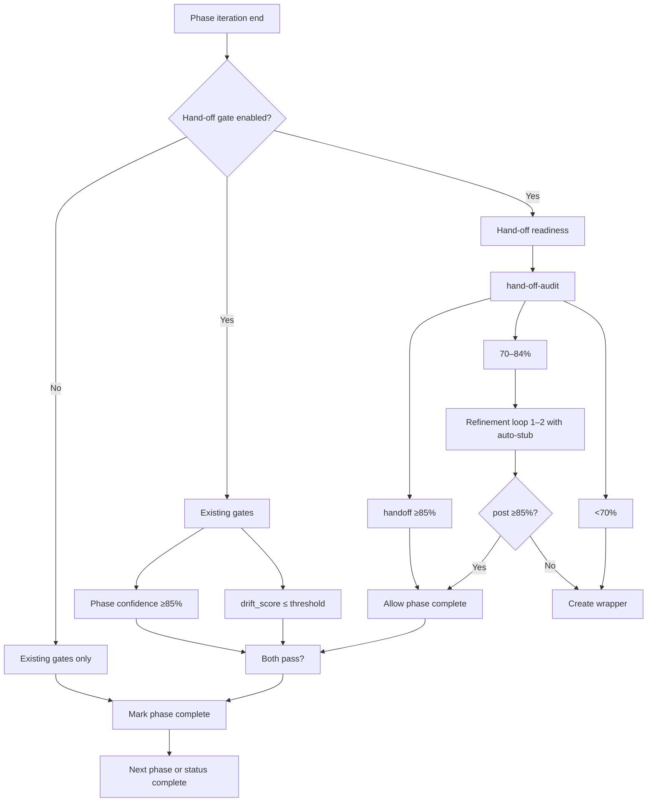

# Hand-off Readiness Integration Plan

## Design principle

**Parallel, not replacement.** Existing gates (confidence bands in [Parameters.md](3-Resources/Second-Brain/Parameters.md), `drift_score` in [roadmap-state.md](1-Projects/genesis-mythos-master/Roadmap/roadmap-state.md)) stay for **stability / factual consistency**. Hand-off readiness answers: *"Can a junior dev implement this phase from the trace?"* (traceability, pseudo-code, interfaces, acceptance criteria, no open forks). Phase is marked complete / ready-for-impl only when **both** conf ≥85% **and** (when gate enabled) handoff_readiness ≥85%.

---

## 1. Config and parameters

**Second-Brain-Config.md** — extend existing `roadmap` block (no new top-level block):

- `**handoff_gate_enabled`**: `false` (default). Explicit toggle; set `true` to enforce junior-dev readiness before phase completion. **Per-queue override:** param `handoff_gate: true` in RESUME-ROADMAP payload.
- **Band thresholds (aligned with core):** `handoff_readiness_high_threshold`: **85** (default). `handoff_readiness_mid_min` / `handoff_readiness_mid_max`: **70, 84**. Low <70%. Aligns with core confidence (85 / 68–84 / <68) so Dataview/MOC queries and mental model stay consistent; 85% with good traceability + stubs is "junior-viable."
- `**min_handoff_conf`**: 85 (alias when used as gate; default from config).
- `**handoff_thresholds_by_tech`** (optional): Per–tech_level overrides so Phase 1 conceptual notes don't need Phase 5 pseudo-code rigor. **Fallback:** If missing or no tech-specific match, use `default` entry (or global `{ high: 85, mid_min: 70 }`). Document in config so it's crystal-clear what happens when per-tech is omitted. Example:

```yaml
handoff_thresholds_by_tech:           # optional; falls back to default if no tech-specific match
  default: { high: 85, mid_min: 70 } # used when no tech-specific match
  1-2:    { high: 80, mid_min: 60 }  # early conceptual → lower bar
  3-4:    { high: 85, mid_min: 68 }  # mid → standard rigor
  5+:     { high: 88, mid_min: 72 }   # late phases demand more executability
```

- **Positive bonus heuristics** (increase score): e.g. `handoff_bonus_heuristics`: +12% if Mermaid sequence/flow diagram exists for the trace; +10% if every non-trivial task has at least one acceptance criterion; +8% if modularity seams have a 1–2 line "swap example" comment.
- **Refinement:** Mid-band refinement loops cap at **2** (or **3** when auto-stub generation is enabled) to allow iterative stub addition without infinite oscillation.
- `handoff_gaps_drift_penalty` (optional): e.g. 0.3 — add to drift_score when `handoff_gaps.length > 2` in roadmap-audit (capped 0.0–1.0).
- `**handoff_heuristics_weights`** (optional sub-block): e.g. `{ missing_pseudo_code: -20, unresolved_fork: -15, no_criteria: -10, trace_gap: -25 }`. Calibrate severity by phase tech_level.
- `**tech_level_reqs`** (optional): e.g. `1: 'trace only', 4: 'pseudo-code', 5: 'stubs + tests'` — progressive rigor by phase tech_level (see §2 Heuristics); explicit link between tech_level and hand-off requirements (Phase 1 ≠ Phase 5).

**Example config block (for sanity check):**

```yaml
# In roadmap: block
handoff_gate_enabled: false           # set true to enforce junior-dev readiness before phase completion
handoff_readiness_high_threshold: 85
handoff_readiness_mid_min: 70
handoff_readiness_mid_max: 84
min_handoff_conf: 85
handoff_thresholds_by_tech:           # optional; falls back to default if missing
  default: { high: 85, mid_min: 70 }  # used when no tech-specific match
  1-2:    { high: 80, mid_min: 60 }  # early conceptual → lower bar
  3-4:    { high: 85, mid_min: 68 }   # mid → standard rigor
  5+:     { high: 88, mid_min: 72 }   # late phases demand more executability
handoff_bonus_heuristics:  # optional
  mermaid_flow: 12
  criteria_per_task: 10
  swap_example: 8
handoff_heuristics_weights:  # optional
  missing_pseudo_code: -20
  unresolved_fork: -15
  no_criteria: -10
  trace_gap: -25
```

**Parameters.md** — new subsection **"Hand-off readiness (roadmap)"**:

- Document the three bands: **High ≥85%** → allow phase complete; **Mid 70–84%** → one (or two) refinement loop(s) with auto-stub attempts; **Low <70%** → create wrapper + `#handoff-needed` in log. **Bands aligned with core:** Same high (85%) and similar mid range (70–84%) as core confidence bands; avoids asymmetric rigor and cognitive load.
- State: hand-off is evaluated **in addition to** phase confidence and drift; phase complete only when conf ≥85% **and** (when gate enabled) handoff_readiness ≥85% (or per-tech override).
- Reference Second-Brain-Config roadmap block for tunables and `handoff_thresholds_by_tech`.
- Add `handoff-readiness` to the Decision Wrapper `wrapper_type` enum in the same file.

---

## 2. Heuristics and bands (aligned with core)

**Band structure (when gate enabled):**

- **High:** ≥85% → allow phase complete. Junior devs can work with 85–90% readiness if the trace is clear; 85% matches core confidence bar.
- **Mid:** 70–84% → one (or two) refinement loop(s) with **auto-stub attempts**. Refinement skill attempts to generate missing pseudo-code / criteria stubs (e.g. guidance "fill basic JS/Python stubs where missing"). If post-refinement ≥ high threshold → auto-apply and commit (with snapshot).
- **Low:** <70% → create wrapper + `#handoff-needed` in decisions-log; queue TASK-ROADMAP for gapped trace.

**Tech_level ↔ hand-off requirements:** Phase 1 conceptual note should not need the same pseudo-code rigor as Phase 5. Use `handoff_thresholds_by_tech` and `tech_level_reqs` so early phases (tech_level 1–2) have lower bar; late phases (5+) demand more executability.

**Positive bonus heuristics** (explicit percentages): +12% if Mermaid sequence/flow diagram exists for the trace; +10% if every non-trivial task has at least one acceptance criterion; +8% if modularity seams have a 1–2 line "swap example" comment. Balance penalties so well-documented phases are not over-penalized.

---

## 3. New skill: hand-off-audit

**Create:** [.cursor/skills/hand-off-audit/SKILL.md](.cursor/skills/hand-off-audit/SKILL.md). **Pipeline slot:** After roadmap-generate-from-outline in [Cursor-Skill-Pipelines-Reference](3-Resources/Second-Brain/Cursor-Skill-Pipelines-Reference.md) § Roadmap pipelines (e.g. step 4: audit → refine if mid/low).

**When to use:**

- After core phase generation in **roadmap-generate-from-outline** (mandatory post-processing), per phase (when `handoff_gate_enabled` or queue `handoff_gate: true`).
- From **roadmap-resume** when RESUME-ROADMAP is run with `focus: "handoff-readiness"` or `handoff_focus: true`.
- On-demand: queue mode **HANDOFF-AUDIT** or Commander "Audit hand-off".

**Inputs:** `project_id`, `phase_number` or phase note path; optional `roadmap_dir`.

**Behavior:**

1. Traverse trace via **obsidian_read_note** chain (root to leaf); resolve phase roadmap note (and optionally phase-X-output) and follow wiki-links/headings for subphase → tertiary → task → pseudo-code.
2. Evaluate heuristics (§2): full trace, pseudo-code/algos (tech_level-aware), interfaces/hooks/contracts, acceptance criteria, open forks; apply **handoff_heuristics_weights** and positive heuristics (Mermaid, example swaps).
3. Compute **handoff_readiness** (0–100) and **handoff_gaps** (array of short strings).
4. Write to **phase note frontmatter**: `handoff_readiness`, `handoff_gaps`; optionally **handoff_traces** (array of `{ path, readiness, gaps }`) for multi-trace phases.
5. Append to **decisions-log.md**: one line per phase with `#handoff-review`, link to phase note, handoff_readiness, first 1–2 gaps; **log full trace path** for auditability. **Completeness:** If gaps fixed in refinement, cross-post summary to **distilled-core.md**.
6. Log to pipeline log (Ingest-Log or Roadmap-Log) with phase path, handoff_readiness, handoff_gaps count.

**Mid-band refinement loop:** **Auto-stub generation:** Attempt to generate missing pseudo-code / criteria stubs (e.g. guidance "fill basic JS/Python stubs where missing"). Generate previews with filled gaps; use **guidance-aware** merge for `user_guidance`. If **post-refinement ≥ high threshold** (85% or per-tech) → auto-apply and commit (with snapshot). **Safety:** Always snapshot the phase note before preview append (per [mcp-obsidian-integration](.cursor/rules/always/mcp-obsidian-integration.mdc)). Refinement loop cap: 2 (or 3 when auto-stub gen enabled).

**MCP:** `obsidian_read_note`, `obsidian_update_note` / `obsidian_manage_frontmatter`. Snapshot phase note before frontmatter write when same run does other edits. No moves/deletes.

**Sync:** Add [.cursor/sync/skills/hand-off-audit.md](.cursor/sync/skills/hand-off-audit.md) and changelog entry.

---

## 4. Phase note frontmatter and state

**Phase roadmap notes:** optional frontmatter `handoff_readiness` (int 0–100), `handoff_gaps` (array of strings). **Per-trace frontmatter:** On phase/sub notes, add `**handoff_traces`**: array of `{ path: 'root→phase→task1', readiness: 82, gaps: ['no criteria'] }` for multi-trace phases. Enables Dataview in e.g. [genesis-mythos-master-Roadmap-MOC](1-Projects/genesis-mythos-master/genesis-mythos-master-Roadmap-MOC.md): `LIST WHERE handoff_readiness < 85` for dashboarding; queryable for Vault-Change-Monitor MOC.

**roadmap-state.md:** Add `**handoff_drift_last_recal`**: 0.0 (parallel to drift_score). RECAL-ROAD sums both factual drift and handoff drift; if handoff_drift > 0.2, force audit. Ensures hand-off evolves with factual drift.

**Vault-Layout.md** — in "Roadmap state artifacts": document phase notes `handoff_readiness`, `handoff_gaps`, `handoff_traces` (set by hand-off-audit); roadmap-state may cache last hand-off result; prefer reading from phase notes as source of truth.

---

## 5. Gate at iteration end (phase completion)

**Where:** [roadmap-generate-from-outline](.cursor/skills/roadmap-generate-from-outline/SKILL.md) §12 (mandatory post-processing) and [auto-roadmap.mdc](.cursor/rules/context/auto-roadmap.mdc) "After generation" block. **Only when** `handoff_gate_enabled` (config) or queue payload `handoff_gate: true`.

**Current:** Phase not marked complete if phase conf < 85%; Decision Wrapper blocks progress.

**Additive:**

- Before bumping `completed_phases` or marking phase complete / ready-for-impl:
  1. Run **hand-off-audit** for that phase (if not already run in this iteration).
  2. If `handoff_readiness < handoff_readiness_high_threshold` (default 95):
    - Do **not** add phase to `completed_phases`; do **not** set phase status to ready-for-impl.
    - Create Decision Wrapper: `wrapper_type: handoff-readiness`, under `Ingest/Decisions/Roadmap-Decisions/` (or Refinements per convention); use phase-direction template from [Templates](3-Resources/Second-Brain/Templates.md) § Roadmap, pre-populate A–G with gap-filling options; add **option R (re-try with auto-stub gen)** for autonomy; link phase note and decisions-log; add `#review-needed`; optionally append to Mobile-Pending-Actions.
  3. If handoff_readiness ≥ 95, proceed with existing logic (append decisions-log, update state, snapshot).

**Invariant:** Snapshot roadmap-state before and after every state update; never advance `current_phase` unless prior phases meet **both** conf ≥85% and (when gate enabled) handoff_readiness ≥95%.

---

## 6. RESUME-ROADMAP and queue extension (queue / param)

**Queue payload** (document in [Queue-Sources.md](3-Resources/Second-Brain/Queue-Sources.md)):

- `focus: "handoff-readiness"` or `**handoff_focus: true`** (optional). When set, processor (auto-eat-queue) injects the audit skill if not already slotted.
- `handoff_gate: true` (optional). Per-queue override to enable hand-off gate for this run.
- `min_handoff_conf: 85` (optional; default from config).

**Behavior when `focus === "handoff-readiness"` or `handoff_focus: true`:**

- After roadmap-resume loads state and builds hand-off, run **hand-off-audit** for current phase (or all phases up to current).
- If current phase has `handoff_readiness < min_handoff_conf`: do **not** treat phase as complete; force refinement loop (mid) or create handoff-readiness wrapper (low). Chain with depth-first iteration (phase → subphase → pseudo-code). **User flow:** If low, land in [Mobile-Pending-Actions](3-Resources/Mobile-Pending-Actions.md) for async approve (per User-Flow-Diagram-Mid-Level).
- If handoff_readiness ≥ min_handoff_conf, proceed as today (resume/generate).

**auto-eat-queue.mdc:** When mode is RESUME-ROADMAP or EXPAND-ROAD, pass through `focus`, `handoff_focus`, `handoff_gate`, and `min_handoff_conf` from payload to roadmap-resume / auto-roadmap.

**roadmap-resume skill:** Extend to accept optional `focus`, `handoff_focus`, `handoff_gate`, `min_handoff_conf`; when focus is handoff-readiness, run hand-off-audit and branch on handoff_readiness vs min_handoff_conf (refinement vs wrapper vs proceed).

---

## 7. Wrapper type and apply semantics

**New wrapper_type: `handoff-readiness`**

- **Creation:** By hand-off-audit gate when handoff_readiness < high threshold (85% or per-tech) and phase would otherwise be closed (when gate enabled).
- **Options A–G + R:** e.g. "Add pseudo-code for [task X]", "Resolve fork: [Y]", "Add acceptance criteria for [section]", "Re-queue EXPAND-ROAD with user_guidance", "Accept as-is (override)", "Skip phase", "Ignore".
- **Apply (EAT-QUEUE):** When user sets `approved: true` and chooses an option: per-change snapshot of target phase note → apply chosen action (append pseudo-code stub, append resolution, or re-queue with guidance); set `processed: true` on wrapper; move wrapper to `4-Archives/Ingest-Decisions/Roadmap-Decisions/`. If "Accept as-is", re-run hand-off-audit with override or set frontmatter flag so next run skips hand-off gate for that phase.

**Cursor-Skill-Pipelines-Reference.md:** Add row in apply-from-wrapper table for `handoff-readiness` (apply semantics as above). Ensure Step 0 in auto-eat-queue can branch on `wrapper_type: handoff-readiness` and invoke the apply logic (snapshot phase → apply option → archive wrapper).

---

## 8. roadmap-audit and drift_score (optional)

**roadmap-audit** [.cursor/skills/roadmap-audit/SKILL.md](.cursor/skills/roadmap-audit/SKILL.md):

- When computing **drift_score**, optionally add **handoff_gaps_drift_penalty** (from config) per phase where `handoff_gaps.length > 2` (or configurable threshold). Cap total drift in 0.0–1.0. **roadmap-state:** Maintain **handoff_drift_last_recal** (see §4); RECAL-ROAD sums both; if handoff_drift > 0.2, force audit.
- **Auto-fix minor (RECAL-ROAD):** When `auto_fix_minor: true` in queue/config, include hand-off minors (e.g. auto-add basic acceptance criteria if gap is just that). Cap confidence bump at +5% to avoid over-automation.
- Document in skill that drift_score can incorporate hand-off gaps when config is set; log in consistency report when handoff gaps contributed.

---

## 9. roadmap-generate-from-outline and roadmap-resume extensions

**roadmap-generate-from-outline:** In §12 (mandatory post-processing), when `handoff_gate_enabled` or payload `handoff_gate: true`, after distill per phase and confidence gate: for each phase run **hand-off-audit**; then gate phase completion on `handoff_readiness ≥ 85` (config or per-tech) as in §5 above; create handoff-readiness wrapper when below threshold.

**roadmap-resume:** Add optional params `focus`, `handoff_focus`, `handoff_gate`, `min_handoff_conf`. When focus is handoff-readiness, after building hand-off context run hand-off-audit for current phase; if handoff_readiness < min_handoff_conf, trigger refinement or wrapper instead of proceeding to generate.

---

## 10. Safety invariants and testing

**Invariants (loud, no breakage):**

- **Snapshot before audit/refine/commit** (per [Backbone](3-Resources/Second-Brain/Backbone.md)); no moves without dry_run; exclusions (Backups/, Logs) untouched. **Watcher never auto-approves wrappers.**
- Snapshot/backup before any commit or wrapper creation.
- Dry_run pattern still enforced on note appends/moves.
- No deletes; exclusions untouched.
- Never advance `current_phase` unless all prior phases have conf ≥ 85% **and** (when hand-off gate on) handoff_readiness ≥ 85% (or per-tech threshold).
- roadmap-state.md snapshot before and after every update (existing rule).

**Testing ([Testing.md](3-Resources/Second-Brain/Testing.md) § Fixtures):**

- Add **handoff-regression** subdir with sample phase traces (shallow vs deep). Test: run audit, assert bands match heuristics. **Completeness:** Baseline row in [Regression-Stability-Log](3-Resources/Second-Brain/Regression-Stability-Log.md) for **handoff_flip_rate** (e.g. % phases re-banded post-change). Test on a dummy phase first; paste Watcher-Result if it chokes.

---

## 11. Documentation, logging, and sync

**Logging and observability ([Logs.md](3-Resources/Second-Brain/Logs.md)):**

- **Dedicated log section:** Handoff-audit entries in decisions-log.md with fields: **timestamp**, **phase**, **readiness**, **gaps** (array), **actions** (e.g. "Refined with stubs"). Aggregate in Vault-Change-Monitor MOC via Dataview.
- Document `#handoff-review`, `#handoff-needed`, and handoff_readiness / handoff_gaps in decisions-log.

**MOC / Dataview helpers:** Suggest adding the following block to [genesis-mythos-master-Roadmap-MOC](1-Projects/genesis-mythos-master/genesis-mythos-master-Roadmap-MOC.md) or Vault-Change-Monitor for an instant "what's blocking delegation?" dashboard. Ready-to-paste:

```dataview
TABLE WITHOUT ID file.link AS "Phase", handoff_readiness AS "Readiness %", length(handoff_gaps) AS "Gaps", tech_level
FROM "Roadmap"
WHERE roadmap-level = "phase" AND handoff_readiness < 85
SORT handoff_readiness ASC
```

**Docs:**

- **[Skills.md](3-Resources/Second-Brain/Skills.md):** Add hand-off-audit row (when to use, inputs, output frontmatter, log).
- **[Pipelines.md](3-Resources/Second-Brain/Pipelines.md)** and **Cursor-Skill-Pipelines-Reference.md:** In autonomous-roadmap section, add hand-off-audit after distill per phase (step 4: audit → refine if mid/low); gate phase completion on handoff_readiness when gate enabled; document RESUME-ROADMAP / EXPAND-ROAD payload keys `focus`, `handoff_focus`, `handoff_gate`, `min_handoff_conf`.
- **[Backbone.md](3-Resources/Second-Brain/Backbone.md):** One sentence on hand-off readiness as parallel gate for delegatability.
- **[Queue-Sources.md](3-Resources/Second-Brain/Queue-Sources.md):** Document RESUME-ROADMAP and EXPAND-ROAD payload keys `handoff_focus`, `handoff_gate`, `focus`, `min_handoff_conf`; optional HANDOFF-AUDIT mode.
- **.cursor/sync/:** Add hand-off-audit skill sync and [.cursor/sync/changelog.md](.cursor/sync/changelog.md) entry.

---

## Implementation order (recommended)

1. **Config + Parameters** — Add roadmap handoff keys (`handoff_gate_enabled`, band thresholds 85/70–84/<70, `handoff_thresholds_by_tech` with default fallback, `handoff_heuristics_weights`, `tech_level_reqs`), Parameters subsection (bands aligned with core).
2. **Skill hand-off-audit** — New SKILL.md; traverse trace via read_note chain, heuristics (weights + tech_level + positive), write frontmatter + handoff_traces, log full trace path and to decisions-log; cross-post to distilled-core when gaps fixed; mid-band preview + snapshot; sync.
3. **Phase frontmatter + state + Vault-Layout** — Document handoff_readiness, handoff_gaps, handoff_traces; roadmap-state handoff_drift_last_recal; Vault-Layout.
4. **Gate in roadmap-generate-from-outline and auto-roadmap** — Only when handoff_gate_enabled or handoff_gate; after distill per phase call hand-off-audit; gate on handoff_readiness ≥85% (or per-tech); create wrapper (phase-direction template, option R) if low/mid.
5. **RESUME-ROADMAP / EXPAND-ROAD params** — Queue-Sources handoff_focus, handoff_gate; auto-eat-queue pass-through; roadmap-resume hand-off-audit and min_handoff_conf; low → Mobile-Pending-Actions.
6. **Wrapper type handoff-readiness** — Phase-direction template, A–G + R; apply-from-wrapper row; Step 0 branch; Parameters wrapper_type.
7. **roadmap-audit drift_score** — handoff_gaps_drift_penalty; handoff_drift_last_recal; auto_fix_minor (cap +5%); consistency report.
8. **Logging and testing** — Logs.md handoff-audit fields; decisions-log #handoff-needed; TASK-ROADMAP queue in low band; Testing handoff-regression fixture; Regression-Stability-Log handoff_flip_rate.
9. **Docs and sync** — Skills, Pipelines, Cursor-Skill-Pipelines-Reference, Logs, Backbone, Queue-Sources, sync folder.

---

## Diagram (hand-off vs existing gates)



Refinement loops attempt to fill gaps (e.g., propose pseudo-code stubs via guidance); future iterations may add explicit auto-stub generation.

**Invariant (loud):** Phase completion requires **both** core confidence/drift gates **and** (if enabled) hand-off readiness ≥ high threshold. No phase advances on partial passes. Snapshots taken before any refinement/commit/wrapper creation.

**Enable toggle:** Hand-off gate is optional (`handoff_gate_enabled: false` by default). When disabled, only existing gates apply. **AND gate:** Phase marked complete only if conf/drift **and** (when enabled) handoff pass. **Hand-off bands (aligned with core):** high ≥85%, mid 70–84%, low <70%. Optional per-tech overrides via `handoff_thresholds_by_tech` (e.g. early phases 80/60, late 88/72).