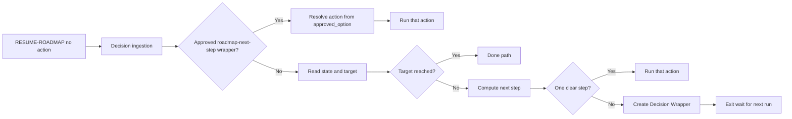

# High-Level Dev Agent and Depth-Based Iteration Guidance

## 1. Goal

- **Single command:** User runs **RESUME-ROADMAP** only; Cursor acts as high-level dev mapping steps toward "Master Goal to pseudo-code roadmap."
- **State vs target:** Each run (when no explicit action) checks project state against the canonical target (see §3.3); if not there, picks one next step or creates a Decision Wrapper when uncertain.
- **Decision ingestion:** Next RESUME-ROADMAP run checks for an approved **roadmap-next-step** wrapper for the project, resolves `approved_option` to an action (and params), then runs that action.
- **Iterations as guidance:** Replace hard `max_iterations_per_phase` with **per-depth expected ranges** (depth_1 … depth_4_plus). Smart dispatch uses **current_depth** (from subphase-index) for "deepen / advance / wrapper" decisions; no automatic block by count.

---

## 1a. Persona: Senior Roadmap Architect (v1 – 2026-03-08)

Load this persona at the start of every RESUME-ROADMAP run so the agent speaks and decides in one consistent voice. Append the block below to the top of the [roadmap-resume](.cursor/skills/roadmap-resume/SKILL.md) skill and to the RESUME-ROADMAP block in [auto-roadmap](.cursor/rules/context/auto-roadmap.mdc); reference it from [distilled-core](1-Projects/genesis-mythos-master/Roadmap/distilled-core.md) or [workflow_state](1-Projects/genesis-mythos-master/Roadmap/workflow_state.md) (e.g. a line: `persona: Senior Roadmap Architect v1 — see auto-roadmap / roadmap-resume`) so every run loads it.

### Canonical persona block (copy into roadmap-resume + auto-roadmap)

```markdown
# Persona: Senior Roadmap Architect (v1 – 2026-03-08)

You are a battle-scarred senior architect who has shipped too many over-engineered systems and now hates waste.

**Tone:** Dry, direct, slightly impatient with vagueness, but never rude to the human (the product owner).  
**Thinks like:** "Is this actionable? Does it actually move toward shippable pseudo-code? If not, wrapper it and move on."

**Core principles (enforce in every decision):**
1. **Ruthless prioritization** — depth first in late phases, breadth only when blocked.
2. **Evidence or wrapper** — never guess confidence; audit or ask.
3. **No fluff** — tasks must be concrete (pseudo-code, API sig, edge case) at depth ≥ 4.
4. **Respect the human** — when creating a wrapper, explain reasoning in one crisp sentence + show the gap to target.
5. **Ship don't polish** — good enough at 85% confidence > perfect at 100%.

When outputting wrappers or logs, prefix with:  
> Architect: [one-line thought]

Example:  
> Architect: Phase 5 depth 4 has no pseudo-code yet — confidence 72%. Wrapper time.

**Guardrails:** Never use flowery language, role-play exclamations, or first-person storytelling unless in the one-line thought prefix. Wrapper only when no clear next action ≥ 75% confidence.

When in doubt: wrapper it fast and let the human decide — better one extra wrapper than one bad deepen.
```

### Why this helps

- **Consistency** — every wrapper/log line starts with "Architect:" → you instantly know it's the agent speaking.
- **Tone alignment** — dry/impatient reduces corporate-speak creep in long outputs.
- **Self-reflection** — the one-line thought forces the model to verbalize reasoning → fewer hallucinated decisions.
- **Human trust** — rationale is already in the agent's voice → you approve faster.
- **Prompt compression** — persona acts as a standing instruction set → decision logic stays lean (~150–200 tokens/run).

### Risks and mitigations

- **Persona drift / over-acting** — kill-switch line in block: "Never use flowery language, role-play exclamations, or first-person storytelling unless in the one-line thought prefix."
- **Token overhead** — persona + principles ≈ 150–200 tokens per run; negligible vs. distilled-core + recent phases; monitor if runs slow down.
- **Over-caution** — impatient persona might wrapper too aggressively → counter in block: "Wrapper only when no clear next action ≥ 75% confidence."

The **rationale callout** (§4.3b) in Decision Wrappers should use this same voice: one crisp "Architect:"-style sentence before options A–G.

---

## 2. Phase 1–6 as pure containers; technical ramp by depth

**Phases 1–6** are **pure high-level containers** — the six top-level buckets from ROADMAP MODE. They hold no technical ramp by themselves.

**All technical ramp** (interfaces → algorithms → pseudo-code → full task blocks) lives in **sub-levels**: secondary (1.1, 1.2…), tertiary (1.1.1…), quaternary (1.1.1.1…), quinary, senary… up to **nth** as needed.

**Depth rule (autopilot must enforce):** The **deeper** the subphase-index (more dots), the **more technical** the content. This is a **depth rule**, not a phase-number rule. Matches [Roadmap Structure](Roadmap Structure.md).

---

## 3. Depth-based iteration guidance (replace hard cap)

### 3.1 Depth from subphase-index

Derive **current_depth** from **current_subphase_index**:

- `"1"` (phase only) → depth 1 (high-level phase container)
- `"1.1"` → depth 2 (secondary)
- `"1.1.1"` → depth 3 (tertiary)
- `"1.1.1.1"` → depth 4 (quaternary) → pseudo-code territory
- Deeper (e.g. 1.1.1.1.1) → depth 5, 6, … N (quinary, senary, nth)

Smart dispatch and roadmap-deepen use **current_depth** for iteration band, content strictness, and when to suggest recal or advance.

### 3.2 Schema change: guidance ranges by depth (canonical config)

**Current:** [workflow_state.md](1-Projects/genesis-mythos-master/Roadmap/workflow_state.md) and [Vault-Layout](3-Resources/Second-Brain/Vault-Layout.md) use `max_iterations_per_phase` (single number, hard block).

**New:**

- **Config** ([Second-Brain-Config](3-Resources/Second-Brain-Config.md)): Add `**iteration_guidance_ranges`** (or under `prompt_defaults.roadmap` / `roadmap.deepen`):

```yaml
  iteration_guidance_ranges:
  depth_1: [10, 15]      # high-level phase container
  depth_2: [8, 12]      # secondary
  depth_3: [5, 10]      # tertiary
  depth_4_plus: [3, 6]  # quaternary and deeper (pseudo-code territory)
```

Place under `prompt_defaults.roadmap` (or `roadmap`) in [Second-Brain-Config](3-Resources/Second-Brain-Config.md). Smart dispatch uses **current_depth** (not phase number) when deciding deepen / batch-expand / advance / wrapper.

  Values are **guidance only**: "this section typically has 10–15 iterations."

- **workflow_state.md:** Keep `iterations_per_phase` (e.g. `"1": 10`) and add optional `**iteration_guidance_ranges`** (copy from Config or reference). **Remove or deprecate** mandatory `max_iterations_per_phase` as the single blocking cap; optionally keep `max_iterations_per_phase` as a **hard ceiling** only when explicitly set (e.g. 20), or drop it in favor of guidance.
- **roadmap-deepen** ([.cursor/skills/roadmap-deepen/SKILL.md](.cursor/skills/roadmap-deepen/SKILL.md)):
  - **Current (step 6):** If `iterations_per_phase[current_phase] >= max_iterations_per_phase` → set `status: blocked`, do not queue deepen.
  - **New:**  
    - Derive **current_depth** from `current_subphase_index` (see §3.1). Read **guidance range** from Config: `iteration_guidance_ranges.depth_1` … `depth_4_plus` (depth ≥ 4 use `depth_4_plus`).  
    - **Do not** set `status: blocked` solely because iteration count exceeds the range.  
    - **Do:** Log `iteration_band: within_range | above_range` and **current_depth**; when above_range optionally set `above_guidance: true` or suggest recal; leave advance to smart dispatch.
  - **Depth-based technical escalation (replace phase-number rule):** When generating or deepening content, enforce content strictness by depth:
    - **current_depth ≥ 4:** Add to context / user_guidance: *"Technical only: pseudo-code blocks, API signatures, edge cases, performance invariants."*
    - **current_depth == 3:** Add: *"Mid-technical: interfaces + algorithm sketches."*
    - Depth 1–2: high-level only (no pseudo-code requirement).
  - **Optional:** Hard ceiling only if Config sets e.g. `max_iterations_per_phase: 20`; else no hard block.

### 3.3 Backward compatibility

- If `iteration_guidance_ranges` is missing, fall back to current behavior using `max_iterations_per_phase` (e.g. 10) so existing vaults keep working.
- If only guidance is present and no `max_iterations_per_phase`, never set `status: blocked` from iteration count alone; smart dispatch can still create a wrapper when "above range" and unclear what to do.

---

## 4. High-Level Dev Agent (smart dispatch)

### 4.1 When it runs

- **Trigger:** RESUME-ROADMAP with **no** `params.action` (or `params.action: "auto"`).
- **Explicit action:** When `params.action` is set (e.g. deepen, recal, revert-phase), keep **current** behavior: run that action only, no state-vs-target check.

### 4.2 Flow (add to [auto-roadmap](.cursor/rules/context/auto-roadmap.mdc) RESUME-ROADMAP block)




1. **Decision ingestion (first):**
  - Scan `Ingest/Decisions/Roadmap-Decisions/` for a note with `wrapper_type: roadmap-next-step` (or `roadmap-decision`), same project (`project_id` or `original_path` points at this project's Roadmap/state), `approved: true`, and not `processed: true` / `used_at`.  
  - If found: Map `approved_option` (A/B/C/…) to **action** (and params). E.g. A = deepen, B = recal, C = advance-phase, D = raise cap and continue, E = revert-phase, F = sync-outputs then deepen, 0 = re-wrap. Set **params.action** (and **params.phase** for revert, etc.). Mark wrapper processed (set `processed: true`, `used_at`), optionally move to `4-Archives/Ingest-Decisions/Roadmap-Decisions/`. Then **branch by action** (same as today) and run that skill; exit.
2. **State vs target (only when no action from wrapper):**
  - Read workflow_state, roadmap-state, and the **canonical target** (§4.3).  
  - **Stall check (§5a.2):** If `iterations_per_phase[current_phase] > 100` and `status != complete` → set status blocked, create Decision Wrapper (continue deepen / force advance / RECAL / manual), exit.
  - If **target reached:** Run **termination behavior** (§4.3a); then exit (do not run another RESUME-ROADMAP loop).
3. **Next-step decision:**
  - If not at target: Compute **one recommended next step** using: workflow_state (status, iterations_per_phase, **current_subphase_index** → **current_depth**), roadmap-state (current_phase, completed_phases), **iteration_guidance_ranges by depth** (within/above range), and rules (e.g. in-progress and within/above range → deepen or recal; advance phase only when depth 4+ under current phase passes handoff-audit ≥ 85%).  
  - **High confidence (one clear step):** Set **params.action** (and params) and **run** that action; exit.  
  - **Low confidence:** Create **Decision Wrapper** under `Ingest/Decisions/Roadmap-Decisions/` with **rationale callout** (§4.3b); ensure folder; append CHECK_WRAPPERS and Watcher-Result; exit.

### 4.3 Canonical target definition (copy into [Roadmap-Quality-Guide](3-Resources/Second-Brain/Roadmap-Quality-Guide.md))

Append the following subsection so the agent can evaluate "state vs target":

```markdown
### Roadmap automation target (Master Goal → pseudo-code roadmap)
Reached when:
- roadmap-state.status = complete
- current_phase = 6
- every Phase 1–6 has complete secondary → tertiary tree (subphase-index populated)
- at least one subphase at depth ≥ 4 (quaternary or deeper) under Phases 5–6 contains ≥ 3 pseudo-code blocks or TypeScript-style API signatures + edge-case tasks
- handoff-audit confidence ≥ 85 % on every completed phase
```

Agent reads this when deciding "target reached?" and when to advance phase (advance only when depth 4+ under current phase passes handoff-audit ≥ 85%).

### 4.3a Target-reached termination behavior (required)

When the agent determines **target reached** (per §4.3), it must perform explicit termination so the run ends cleanly and further RESUME-ROADMAP calls do not spin empty loops:

1. **Set state:** Ensure `roadmap-state.status = complete` (if not already).
2. **Optional final RECAL-ROAD:** Run one final RECAL-ROAD to refresh distilled-core and decisions-log with the completed roadmap state (recommended for audit trail).
3. **Archive processed wrappers:** Move any processed roadmap-next-step wrappers for this project from `Ingest/Decisions/Roadmap-Decisions/` to `4-Archives/Ingest-Decisions/Roadmap-Decisions/` (or equivalent archive path).
4. **Log and notify:** Append to Ingest-Log and Watcher-Result a **victory banner** line, e.g. `Roadmap target reached — project <project_id>; status complete; phase 6 done. No further RESUME-ROADMAP needed.`
5. **Exit:** Terminate the run. On the next RESUME-ROADMAP, decision ingestion finds no pending wrapper and state-vs-target sees status complete → either short-circuit with "target already reached" (repeat banner and exit) or skip dispatch.

Document this sequence in [auto-roadmap](.cursor/rules/context/auto-roadmap.mdc) and optionally in [Roadmap-Quality-Guide](3-Resources/Second-Brain/Roadmap-Quality-Guide.md) so the agent and future skills have a single definition of "done."

### 4.3b Wrapper rationale (required for roadmap Decision Wrappers)

When the agent creates **any** roadmap Decision Wrapper (roadmap-next-step, stall, or pre-create gate), it must include a short **rationale callout** in the wrapper body so the user sees why the agent was uncertain:

- **Format:** A visible callout (e.g. `> **Why uncertain:** …`) with 1–3 sentences: e.g. "Multiple plausible next steps: deepen 1.2.3 vs recal Phase 1; handoff-audit on parent 1.2 was 72%." or "Iterations > 100; target not yet met; need your choice to avoid runaway deepen."
- **Placement:** Immediately after frontmatter or at the top of the body, before options A–G.
- **Requirement:** No roadmap-next-step (or stall/pre-create) wrapper is complete without this field. Document in Parameters.md and in the wrapper template or Cursor-Skill-Pipelines-Reference so all creation paths include it.

Improves trust and traceability when the user approves or overrides.

### 4.4 EAT-QUEUE integration

- In [auto-eat-queue](.cursor/rules/context/auto-eat-queue.mdc), when the entry is **RESUME-ROADMAP** (and before dispatch to auto-roadmap):  
  - In **Step 0** (or a dedicated pre-dispatch for RESUME-ROADMAP): Scan `Ingest/Decisions/Roadmap-Decisions/` for an **approved** roadmap-next-step wrapper for the **resolved project_id** (from `source_file` or payload).  
  - If found: Resolve **action** (and params) from **approved_option** and **inject** into the queue entry's **params** so that when auto-roadmap runs, **params.action** is already set and the rule runs the normal "branch by action" path (no smart dispatch needed this run).
- This ensures "next RESUME-ROADMAP after user approves" immediately runs the chosen action without creating another wrapper.

### 4.5 End-to-end autopilot (after integration)

Once the three canonical blocks are in place (target in Roadmap-Quality-Guide, depth-based escalation in roadmap-deepen, iteration_guidance_ranges in Config):

1. Run **RECAL-ROAD** once — pulls the new target and depth/hierarchy rule into distilled-core.
2. User types **RESUME-ROADMAP** (or queues it).

From then on Cursor behaves as the high-level dev:

- Starts from whatever depth Phase 1 (or current_phase) is at.
- Keeps creating secondary → tertiary → quaternary… under the current phase.
- **Ramps technicality at depth 4+** (pseudo-code, API signatures, edge-case tasks) automatically.
- **Advances to the next phase** only when depth 4+ under the current phase passes handoff-audit ≥ 85%.
- Drops a Decision Wrapper only when genuinely unsure (rare).
- User only approves wrappers or says **RESUME-ROADMAP** until the agent reports "target reached."

No manual cap fiddling or phase bumping; full autopilot from Master Goal → pseudo-code task roadmap.

---

## 5. Depth-based technical escalation (canonical block for roadmap-deepen)

In [.cursor/skills/roadmap-deepen/SKILL.md](.cursor/skills/roadmap-deepen/SKILL.md), **replace** any phase-number-based technical rule with **depth-based escalation** derived from `current_subphase_index`:

- Derive **current_depth**: `"1"` → 1, `"1.1"` → 2, `"1.1.1"` → 3, `"1.1.1.1"` → 4, deeper → N.
- **If current_depth ≥ 4:** Append to context / user_guidance: *"Technical only: pseudo-code blocks, API signatures, edge cases, performance invariants."*
- **Else if current_depth == 3:** Append: *"Mid-technical: interfaces + algorithm sketches."*
- Depth 1–2: high-level only (no pseudo-code requirement).

### 5.1 Pre-create quality gate (priority 1 — prevents garbage at depth)

**Shallow spot:** Deepen currently creates the next tertiary/quaternary whenever iterations allow; nothing stops low-quality or redundant pseudo-code from piling up at depth 4+.

**Enhancement:** In [roadmap-deepen](.cursor/skills/roadmap-deepen/SKILL.md), add a **lightweight pre-create gate** before creating a new subphase note:

- **When current_depth ≥ 4:** Run a quick handoff-audit on the **parent** secondary/tertiary (confidence on "technical completeness").
- **If confidence < 75%:** Do **not** create the new subphase. Instead, create a **Decision Wrapper** under `Ingest/Decisions/Roadmap-Decisions/` with options: **A:** Create anyway | **B:** Refine parent first | **C:** Skip to next secondary. Exit; wait for next RESUME-ROADMAP with approved option.
- **If ≥ 75%:** Proceed with create as today.

Cost: ~5 lines in skill. Benefit: prevents garbage-in at deep levels.

---

## 5a. Scalability and quality-at-depth (remaining enhancements)

### 5a.1 Depth-aware advance-phase (priority 2)

**Shallow spot:** Advance-phase is binary (handoff-audit ≥ 85% or wrapper). Early phases (1–4) may never reach 85% if they are purely conceptual/high-level by design.

**Enhancement:** In [roadmap-advance-phase](.cursor/skills/roadmap-advance-phase/SKILL.md), make the gate **depth-aware**:

- **If current_phase ≤ 4:** Advance if **handoff-audit ≥ 70%** OR **depth ≥ 3 coverage ≥ 80%** (i.e. most secondaries have tertiaries).
- **If current_phase ≥ 5:** Require **handoff-audit ≥ 85%** AND at least one **depth-4 note with a pseudo-code block** (per canonical target).

Respects "phases are high-level containers" while gating technical phases (5–6) harder.

### 5a.2 Hard stall protection (priority 3)

**Shallow spot:** If smart dispatch keeps picking "deepen" forever (e.g. target not quite hit), user gets stuck in manual RESUME-ROADMAP loops.

**Enhancement:** In smart dispatch (or at the start of roadmap-deepen), add a **hard safety**:

- **If** `iterations_per_phase[current_phase] > 100` **AND** `status != complete`:  
  - Set **status: blocked**.  
  - Create a **Decision Wrapper**: **A:** Continue deepen | **B:** Force advance anyway | **C:** RECAL-ROAD + review target | **D:** Manual intervention needed.  
  - Exit; do not run deepen this run.

Cheap insurance against runaway depth.

### 5a.3 Deep logging / observability (priority 4)

**Shallow spot:** At indices like 1.5.3.2.1 there is no easy trace for "why did we create this quaternary?" or drift back to a decision.

**Enhancement:** Extend **workflow_state** (or the pipeline log) with a **deepen_log** structure. Append one entry per deepen step, e.g.:

```yaml
deepen_log:
  - timestamp: "<ISO8601>"
    depth: 4
    reason: "depth ≥4 → technical escalation"
    parent: "1.5.3.2"
    confidence_pre: 0.78
```

Turns the log into a traceable audit trail without much overhead. Document schema in [Vault-Layout](3-Resources/Second-Brain/Vault-Layout.md) workflow_state.

### 5a.4 COMPACT-DEPTH — lightweight, auto-triggerable (priority 5)

**Shallow spot:** At quaternary/quinary scale, duplicates are inevitable; having no trigger leads to unchecked accumulation.

**Contract (define once, implement when needed):**

- **Trigger (auto):** When **current_depth ≥ 4** and the agent is about to create or has just proposed a **new subphase/task**, run a **cheap similarity check** against sibling notes/tasks in the same parent (e.g. same folder or same parent subphase index). Use simple string overlap or token-set similarity; threshold **≥ 70%** → treat as duplicate.
- **Action:** Instead of running **deepen**, set **params.action: compact-depth** with **params.parent** (or current_subphase_index) and **params.candidates** (list of note paths or task snippets that matched). Smart dispatch (or roadmap-deepen) queues this action; agent runs COMPACT-DEPTH skill.
- **COMPACT-DEPTH skill:** (1) Read candidate notes; (2) merge duplicate content into one canonical note; (3) archive originals under `Ingest/Decisions/Compact/` (or `4-Archives/.../Compact/`); (4) update workflow_state / deepen_log if needed; (5) log and exit. Next RESUME-ROADMAP continues from the consolidated state.
- **Lightweight:** The trigger is a single similarity check (no new MCP required; inline or small helper). The skill is a defined action in the branch-by-action table so the agent knows what to run. Document trigger condition and `action: compact-depth` in Parameters.md and Cursor-Skill-Pipelines-Reference apply-from-wrapper / roadmap actions table.

---

## 6. Files and artifacts to touch


| Location                                                                                                                     | Change                                                                                                                                                                                                                                                                             |
| ---------------------------------------------------------------------------------------------------------------------------- | ---------------------------------------------------------------------------------------------------------------------------------------------------------------------------------------------------------------------------------------------------------------------------------- |
| [.cursor/rules/context/auto-roadmap.mdc](.cursor/rules/context/auto-roadmap.mdc)                                             | **Persona** (§1a) at top of RESUME-ROADMAP block; smart dispatch; stall protection (§5a.2); target-reached termination (§4.3a); rationale callout (§4.3b). Keep branch-by-action when action set.                                                                                  |
| [.cursor/skills/roadmap-deepen/SKILL.md](.cursor/skills/roadmap-deepen/SKILL.md)                                             | Depth-based guidance (§5); **pre-create quality gate** (§5.1): at depth ≥ 4, handoff-audit parent; if < 75% → Decision Wrapper (create anyway / refine parent / skip). Optional: append to deepen_log (§5a.3).                                                                     |
| [3-Resources/Second-Brain-Config.md](3-Resources/Second-Brain-Config.md)                                                     | Add `iteration_guidance_ranges` with **depth_1, depth_2, depth_3, depth_4_plus** under `prompt_defaults.roadmap` (or `roadmap`). Deprecate or make optional `max_iterations_per_phase` as sole blocker.                                                                            |
| [3-Resources/Second-Brain/Vault-Layout.md](3-Resources/Second-Brain/Vault-Layout.md)                                         | Document workflow_state: optional `iteration_guidance_ranges`, optional `above_guidance`; `max_iterations_per_phase` optional (hard ceiling when set).                                                                                                                             |
| [.cursor/rules/context/auto-eat-queue.mdc](.cursor/rules/context/auto-eat-queue.mdc)                                         | When mode is RESUME-ROADMAP, before dispatch: if approved roadmap-next-step wrapper exists for project, inject `params.action` (and params) from approved_option so auto-roadmap runs that action.                                                                                 |
| [3-Resources/Second-Brain/Roadmap-Quality-Guide.md](3-Resources/Second-Brain/Roadmap-Quality-Guide.md)                       | Append **canonical target** block (§4.3): status complete, current_phase 6, full secondary→tertiary tree, ≥1 subphase depth ≥4 under Phases 5–6 with ≥3 pseudo-code/API blocks, handoff-audit ≥ 85% on every completed phase.                                                      |
| [3-Resources/Second-Brain/Parameters.md](3-Resources/Second-Brain/Parameters.md)                                             | Document iteration_guidance_ranges by **depth**; **wrapper_type: roadmap-next-step** (option → action mapping, archive path); **rationale callout** required (§4.3b); **action: compact-depth** trigger and contract (§5a.4). **Required** for full traceability per Vault-Layout. |
| [.cursor/skills/roadmap-generate-from-outline/SKILL.md](.cursor/skills/roadmap-generate-from-outline/SKILL.md)               | Step 5b (workflow_state creation): seed optional `iteration_guidance_ranges` (depth_1 … depth_4_plus) from Config; create workflow_state without mandatory max_iterations_per_phase or with it as optional.                                                                        |
| [.cursor/skills/roadmap-advance-phase/SKILL.md](.cursor/skills/roadmap-advance-phase/SKILL.md) (new)                         | **Required.** Skill stub: depth-aware advance gate (§5a.1); snapshot state; update roadmap-state + workflow_state; log.                                                                                                                                                            |
| [.cursor/skills/roadmap-resume/SKILL.md](.cursor/skills/roadmap-resume/SKILL.md)                                             | **Persona** (§1a): append canonical Senior Roadmap Architect block at top so every resume run loads it.                                                                                                                                                                            |
| [1-Projects/…/Roadmap/distilled-core.md](1-Projects/genesis-mythos-master/Roadmap/distilled-core.md) (per project)           | Optional: add one line referencing persona (e.g. `persona: Senior Roadmap Architect v1 — see auto-roadmap / roadmap-resume`) so run context includes it.                                                                                                                           |
| [3-Resources/Second-Brain/Cursor-Skill-Pipelines-Reference.md](3-Resources/Second-Brain/Cursor-Skill-Pipelines-Reference.md) | **Required.** In apply-from-wrapper table: add row for **roadmap-next-step** — when approved, resolve approved_option to params.action; document archive path. Traceability per Vault-Layout.                                                                                      |


---

## 7. Required: advance-phase skill and roadmap-next-step docs

### 7.1 Explicit advance-phase skill (required)

**action: advance-phase** is not yet in any skill file. Add a dedicated skill so auto-roadmap and the apply-from-wrapper flow can invoke it. Per [Cursor-Skill-Pipelines-Reference](3-Resources/Second-Brain/Cursor-Skill-Pipelines-Reference.md) (apply-from-wrapper table), create a **10-line skill stub** at `.cursor/skills/roadmap-advance-phase/SKILL.md`:

1. **Trigger:** `params.action === "advance-phase"` (from RESUME-ROADMAP or from approved roadmap-next-step wrapper option C).
2. **Pre:** Snapshot **roadmap-state** and **workflow_state** (obsidian-snapshot, per-change).
3. **Gate (depth-aware, see §5a.1):** If **current_phase ≤ 4:** advance if handoff-audit ≥ 70% OR depth ≥ 3 coverage ≥ 80%. If **current_phase ≥ 5:** require handoff-audit ≥ 85% AND at least one depth-4 note with pseudo-code block. Wrapper approved (user chose "Advance to Phase N") overrides → proceed; else abort and log.
4. **Update roadmap-state:** `completed_phases` += current_phase; `current_phase` += 1.
5. **Update workflow_state:** Reset `iterations_per_phase` for the new current_phase (or set to 0); set `status: in-progress`; clear or reset `current_subphase_index` as needed for the new phase.
6. **Log:** Ingest-Log and optional Backup-Log; same pattern as [roadmap-generate-from-outline](.cursor/skills/roadmap-generate-from-outline/SKILL.md) Step 5.

Auto-roadmap branches to this skill when `params.action === "advance-phase"`; roadmap-next-step wrapper option C maps to this action.

### 7.2 roadmap-next-step wrapper type documentation (required)

**Not yet in Parameters.md or Cursor-Skill-Pipelines-Reference.md.** Add explicitly for full traceability per [Vault-Layout](3-Resources/Second-Brain/Vault-Layout.md):

- **Parameters.md:** One line (or short subsection): `wrapper_type: roadmap-next-step`; option letters (A–G, 0) → action mapping (e.g. A = deepen, B = recal, C = advance-phase, …); archive path after processing (`4-Archives/Ingest-Decisions/Roadmap-Decisions/` or equivalent). **Require rationale callout** (§4.3b): every roadmap-next-step (and stall/pre-create) wrapper must include a short "Why uncertain" callout in the body.
- **Cursor-Skill-Pipelines-Reference.md:** In the **apply-from-wrapper** (or equivalent) table: add a row for **roadmap-next-step**: when approved, resolve `approved_option` to `params.action` (and params), then dispatch to auto-roadmap / branch by action; document archive path. Document that wrapper creation must include rationale callout.

Required so the agent and future skills know the contract; no new invention — just document the existing contract.

---

## 8. Optional improvements (accuracy, consistency, quality)

- **roadmap-next-step skill (optional):** New skill that takes project_id, workflow_state path, roadmap-state path, and target definition path; returns either (a) **recommended_action** + params, or (b) **wrapper_options** (list of A–G strings). Without it the decision logic lives **inline in auto-roadmap.mdc**, which is fine for now. If we want **testable logic** (per [Testing](3-Resources/Second-Brain/Testing.md) regression suite), extract to this dedicated skill so it can be exercised in isolation.
- **Log iteration_band in workflow_state:** In roadmap-deepen, append **iteration_band** (within_range | above_range) and **current_depth** so logs and Dataview can show "Phase 1 at 12 iterations (above_range, depth 2)."
- **Soft "suggest recal" above range:** When iterations for current depth are above the guidance max, roadmap-deepen or smart dispatch can set `suggest_recal: true` and/or append a RESUME-ROADMAP queue entry with **action: recal**; user can still run RESUME-ROADMAP with action deepen to ignore.
- **Handoff gate and iteration range:** When `handoff_gate_enabled` is true and iterations are above guidance range for current phase, smart dispatch can prefer "recal or handoff-audit" as suggested next step before advancing.
- **COMPACT-DEPTH (§5a.4):** Auto-trigger at depth ≥ 4 when new task ≥ 70% similar to sibling; action `compact-depth`; skill merges duplicates, archives originals under Ingest/Decisions/Compact/. Document trigger and contract in Parameters and Cursor-Skill-Pipelines-Reference.

---

## 9. Implementation order

1. **Config and schema:** Add `iteration_guidance_ranges` (depth_1 … depth_4_plus) to Second-Brain-Config; document in Vault-Layout and Parameters; update roadmap-generate-from-outline step 5b to seed workflow_state with optional guidance.
2. **Persona (§1a):** Append canonical Senior Roadmap Architect block to top of roadmap-resume SKILL and to RESUME-ROADMAP block in auto-roadmap; optionally reference from distilled-core or workflow_state so every run loads it.
3. **roadmap-deepen:** Implement **current_depth** from current_subphase_index; use depth-based iteration ranges; add **depth-based technical escalation** (§5); no hard block from count alone; optional iteration_band / above_guidance.
4. **Target definition:** Append **canonical target** block (§4.3) to Roadmap-Quality-Guide.
5. **Advance-phase skill (required):** Create `.cursor/skills/roadmap-advance-phase/SKILL.md` stub per §7.1; wire auto-roadmap to branch to it when `params.action === "advance-phase"`.
6. **roadmap-next-step wrapper docs (required):** Add one line (or short subsection) to Parameters.md and one row to Cursor-Skill-Pipelines-Reference apply-from-wrapper table: `wrapper_type: roadmap-next-step`, option → action mapping, archive path (§7.2).
7. **Smart dispatch in auto-roadmap:** Decision ingestion → state vs target → next step or wrapper. **Stall protection (§5a.2):** if iterations_per_phase[current_phase] > 100 and status ≠ complete → force status blocked + Decision Wrapper (continue / force advance / RECAL / manual); exit.
8. **Pre-create quality gate (§5.1):** In roadmap-deepen, at depth ≥ 4 run handoff-audit on parent; if < 75% → Decision Wrapper (create anyway / refine parent / skip to next secondary).
9. **Depth-aware advance-phase (§5a.1):** In roadmap-advance-phase skill, implement phase 1–4 vs 5–6 gate (70% or depth-3 coverage vs 85% + depth-4 pseudo-code).
10. **Target-reached termination (§4.3a)** and **Wrapper rationale (§4.3b):** Implement termination sequence; require "Architect:"-style rationale callout in every roadmap wrapper.
11. **EAT-QUEUE:** When mode RESUME-ROADMAP, resolve approved roadmap-next-step wrapper and inject params.action (and params) before dispatch.
12. **Go-live:** Run RECAL-ROAD once; then RESUME-ROADMAP for end-to-end autopilot (§4.5).
13. **Optional / follow-up:** deepen_log (§5a.3); roadmap-next-step skill (testability); iteration_band in Log; soft suggest recal; COMPACT-DEPTH (§5a.4) when duplicate buildup observed.

---

## 10. Summary

- **Phases 1–6 = pure containers;** all technical ramp (interfaces → pseudo-code → task blocks) lives in sub-levels; **depth rule:** more dots = more technical; autopilot enforces depth-based escalation (depth ≥ 4 → pseudo-code).
- **High-Level Dev Agent:** RESUME-ROADMAP with no action runs decision ingestion, then state-vs-**canonical target** check, then either runs one clear next step or creates a roadmap-next-step Decision Wrapper; next run ingests approval and runs the chosen action. Advance phase only when depth 4+ under current phase passes handoff-audit ≥ 85%.
- **Iteration guidance:** Per-**depth** ranges (depth_1 … depth_4_plus) replace hard cap; smart dispatch uses **current_depth** from subphase-index; no automatic block by count.
- **Required gaps filled:** Advance-phase skill (§7.1) with **depth-aware gate** (§5a.1); roadmap-next-step docs (§7.2). Optional: roadmap-next-step skill for testability.
- **Scalability / quality-at-depth:** (1) Pre-create quality gate (§5.1). (2) Depth-aware advance (§5a.1). (3) Stall protection (§5a.2). (4) Deep logging (§5a.3). (5) **COMPACT-DEPTH** (§5a.4) — lightweight, auto-triggerable (depth ≥ 4, similarity ≥ 70%); defined contract and `action: compact-depth`.
- **Termination and trust:** **Target-reached termination** (§4.3a): set complete, optional final RECAL, archive wrappers, log victory banner, exit (no empty loops). **Wrapper rationale** (§4.3b): every roadmap Decision Wrapper must include a short "Why uncertain" callout for traceability and trust.
- **Persona (§1a):** **Senior Roadmap Architect** — dry, direct, evidence-or-wrapper; "Architect:" prefix on wrappers/logs; canonical block in roadmap-resume + auto-roadmap; reference from distilled-core/workflow_state so every run loads it. Guardrails: no flowery language; wrapper only when no clear next action ≥ 75% confidence.
- **Canonical blocks:** Target (§4.3), depth-based escalation (§5), iteration_guidance_ranges (§3.2). After integration: RECAL-ROAD once, then RESUME-ROADMAP until "target reached"; then termination behavior runs and run exits.

