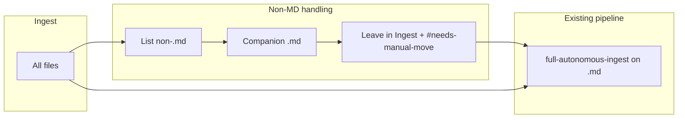

# Ingest folder rules and non-Markdown handling

## Current state (brief)

- **Rules**: [.cursor/rules/always/mcp-obsidian-integration.mdc](.cursor/rules/always/mcp-obsidian-integration.mdc) and [.cursor/rules/always/always-ingest-bootstrap.mdc](.cursor/rules/always/always-ingest-bootstrap.mdc) are always-on; [.cursor/rules/context/para-zettel-autopilot.mdc](.cursor/rules/context/para-zettel-autopilot.mdc) is scoped to `Ingest/*.md` and drives full-autonomous-ingest.
- **Ingest scope today**: Only `.md` in Ingest are processed; [3-Resources/Second-Brain-Automation-Recommendations.md](3-Resources/Second-Brain-Automation-Recommendations.md) recommends "skip non-.md" and "sidecar = user creates companion."
- **Vault structure**: [structure.md](structure.md) uses "Ingest", "1–4 PARA", "5-Attachments" (no `Attachments/` with PDFs/Images/Audio yet).
- **MCP**: `obsidian_list_notes`, `obsidian_move_note`, `obsidian_create_backup` are Markdown-note centric; they do not reliably support non-.md paths. **Final stance**: do not use `obsidian_move_note` on binaries; leave originals in Ingest/ with `#needs-manual-move` and a callout in the companion note.

## Target behavior

1. **Single drop**: All new files (MD and non-MD) land in **Ingest/**.
2. **Proactive processing**: When the user says "Process Ingest" / "INGEST MODE" or when working in/on Ingest:
  - **Non-.md**: Create companion `.md` (or stub) per non-markdown-handling rule → place note in PARA (default Resources if uncertain). **Do not** move original via MCP (unsupported for binaries). Leave original in Ingest/, tag `#needs-manual-move`, and add callout in companion note for user to move to **5-Attachments/[subtype]** (e.g. PDFs/, Images/, Audio/). Use `![[5-Attachments/PDFs/...]]` etc. in companion once moved.
  - **.md**: Continue to run **full-autonomous-ingest** (backup → classify_para → … → move_note → log_action) per existing pipeline; no change to sequence.
3. **Order**: Handle non-MD first (companion .md + move), then run the existing ingest pipeline on all `.md` in Ingest (including newly created companions).

## Recommended structure – rules layout

Cursor (2026) prefers **flat .mdc files** in `.cursor/rules/` (or subfolders like `always/`, `context/`). Folder-based rules with RULE.md are buggy/legacy in many installs — **stick to .mdc files only**. Use subfolders for organization; keep the set minimal:

```
.cursor/rules/
├── always/
│   ├── 00-always-core.mdc                  # persona + "always check Ingest"
│   ├── mcp-obsidian-integration.mdc        # existing – keep
│   ├── always-ingest-bootstrap.mdc         # existing – minor edit
│   └── second-brain-standards.mdc          # new: PARA, frontmatter, linking, atomicity
└── context/
    ├── ingest-processing.mdc               # new: Ingest/** trigger
    └── non-markdown-handling.mdc           # new: file-type details (referenced from above)
```

**Frontmatter style** (consistent with current Cursor):

- `description: "Short one-liner purpose for agent"`
- `globs: "Ingest/**"` — only for context rules; leave blank or omit for always.
- `alwaysApply: true` or `false` (false for context / glob-based).
- **Always rules** → `alwaysApply: true`, globs blank/omitted.
- **Context (Ingest)** → `globs: "Ingest/**"` or `"Ingest/*"`, `alwaysApply: false`.

Do **not** put rule bodies in the root-level `.cursorrules` file; keep everything under `.cursor/rules/`.

## 1. Folder structure

- **Ingest/** — already the canonical drop folder; no rename.
- **5-Attachments** — keep this name (do not rename to plain Attachments/). Preserves existing links and avoids breakage. All new rules use `![[5-Attachments/PDFs/...]]`, `![[5-Attachments/Images/...]]`, etc. Refer consistently as **5-Attachments/[subtype]/original.ext**.
- **Create these subfolders manually once** (if not present):
  - **5-Attachments/PDFs/**
  - **5-Attachments/Images/**
  - **5-Attachments/Audio/**
  - **5-Attachments/Documents/** (for .docx / .xlsx / .pptx after conversion or as-is)
  - **5-Attachments/Other/** (fallback for rar/zip/exe/etc.)

## 2. Rule files to add (content and placement)

### 2.1 `00-always-core.mdc` (Always)

- **Location**: [.cursor/rules/always/00-always-core.mdc](.cursor/rules/always/00-always-core.mdc)
- **Frontmatter**: `description: "Core persona and always-on Ingest awareness"`, globs blank or omitted, `alwaysApply: true`
- **Content**: Persona (e.g. Thoth-AI), vault = Markdown-first Obsidian + Cursor; **all new/unknown files arrive in Ingest/**; first job on any task involving new files = check Ingest/ and process unhandled items; never assume files are already processed; goal = move everything out of Ingest/ after companion .md in PARA (or leave in Ingest if blocked); Obsidian link syntax `[[path]]`, `![[5-Attachments/PDFs/...]]` etc. for attachments; frontmatter on every new .md (created, tags, source embed/link); verbose summaries, concise structure.
- **Interaction**: Complements (does not replace) `mcp-obsidian-integration.mdc` and `always-ingest-bootstrap.mdc`; both remain. Core states the "check Ingest first" principle; bootstrap still triggers the pipeline on "Process Ingest" / "INGEST MODE."

### 2.2 `ingest-processing.mdc` (Context, Ingest/**)

- **Location**: [.cursor/rules/context/ingest-processing.mdc](.cursor/rules/context/ingest-processing.mdc)
- **Frontmatter**: `description: "Ingest folder processing and non-MD handling"`, `globs: "Ingest/**"`, `alwaysApply: false`
- **Content**:
  - When any task references Ingest/ or new/unprocessed files:
    1. **List Ingest**: Use `obsidian_list_notes("Ingest")` for .md; **additionally** list non-.md in Ingest (e.g. workspace glob/list) — MCP may return only notes.
    2. **Non-.md**: For each non-.md file, follow `non-markdown-handling.mdc`: create companion .md (e.g. `YYYY-MM-DD_OriginalName-Summary.md`), place in 1-Projects/2-Areas/3-Resources/4-Archives (default 3-Resources if uncertain; ask user if needed). **Do not** call `obsidian_move_note` on the binary (see MCP SAFETY below). Add embeds/links in companion using `![[5-Attachments/PDFs/original.pdf]]` etc. (user moves file manually; then update source link and remove tag).
    3. **.md**: After non-MD are handled, run full-autonomous-ingest on all Ingest/*.md per always-ingest-bootstrap + para-zettel-autopilot (backup → classify_para → … → move_note → log_action).
    4. Report: "Processed X files. Ingest/ now empty/cleared" (or list remaining and why).
  - Unsupported types (e.g. video without transcript): create stub .md in Ingest with "Requires manual transcription → ![[5-Attachments/Audio/...]]" and tag `#needs-human`.
  - Always propose full .md content for new notes for review; respect MCP safety (backup before destructive steps, snapshot per mcp-obsidian-integration).
  - **Include this MCP SAFETY block verbatim in the rule file:**

```
    MCP SAFETY:
    - obsidian_move_note ONLY supports .md files reliably.
    - For non-.md files: create companion .md + embed/link, but DO NOT attempt obsidian_move_note on binaries.
    - Instead: leave original in Ingest/ and add frontmatter tag: #needs-manual-move
    - In the companion note add:
      > **Manual action required**: Move original file from Ingest/ to [[5-Attachments/PDFs/original.pdf]] (or appropriate subfolder). After move, update this note's source: ![[5-Attachments/...]] and remove #needs-manual-move tag.
    - Never use shell mv/cp/rm (not allowed in Cursor Agent/MCP mode).
    

```

### 2.3 `non-markdown-handling.mdc` (Context, referenced by ingest-processing)

- **Location**: [.cursor/rules/context/non-markdown-handling.mdc](.cursor/rules/context/non-markdown-handling.mdc)
- **Frontmatter**: `description: "Non-MD file-type handling and companion note creation"`, `globs: "Ingest/**"` or blank, `alwaysApply: false`
- **Content**: Standalone file-type matrix:
  - **Classify → Create companion .md → Embed source (target path 5-Attachments/[subtype]/) → Do not move original via MCP; leave in Ingest/ with #needs-manual-move and callout → Link back once user has moved.**
  - **Frontmatter template**: title, created (YYYY-MM-DD), aliases (original filename), tags (e.g. type/pdf, source/attachment, needs-review), source = `![[5-Attachments/PDFs/original.pdf]]` (or Images/, Audio/, Documents/, Other/ as appropriate). Use **5-Attachments/[subtype]/original.ext** consistently.
  - **By type**: Images → 5-Attachments/Images/; PDFs → 5-Attachments/PDFs/; text/code → embed or summarize; .docx/.xlsx/.pptx → 5-Attachments/Documents/, suggest pandoc or stub "Export to PDF/text first"; Audio/Video → 5-Attachments/Audio/, stub + "Transcribe externally then re-ingest", tag #type/audio #needs-transcript; Archives/other → 5-Attachments/Other/, "Extract first, then re-process."
  - **Rules**: Never modify/delete original; one atomic .md per file; after: "Companion [[path]] created. Original remains in Ingest/ — manual move to 5-Attachments/[subtype]/ required. Ready for PARA review?"; batch = sequential unless user says parallel.
  - **Include the same MCP SAFETY block verbatim as in ingest-processing.mdc** (obsidian_move_note only .md; leave non-.md in Ingest/ with #needs-manual-move; callout in companion; never shell mv/cp/rm).

### 2.4 `second-brain-standards.mdc` (Always)

- **Location**: [.cursor/rules/always/second-brain-standards.mdc](.cursor/rules/always/second-brain-standards.mdc)
- **Frontmatter**: `description: "PARA, linking, frontmatter, atomicity"`, globs blank or omitted, `alwaysApply: true`
- **Content**: PARA strictly (1-Projects, 2-Areas, 3-Resources, 4-Archives); every note has searchable title, frontmatter, tags; atomic notes preferred; `![[5-Attachments/PDFs/...]]` etc. for attachments, `[[ ]]` for note links; daily/ingest date in filename when created today.

## 3. Updates to existing rules and docs

- **always-ingest-bootstrap.mdc**: Add one line: when "Process Ingest" / "INGEST MODE", first ensure Ingest/ is processed per `ingest-processing.mdc` (non-MD then .md pipeline); then run full-autonomous-ingest on Ingest/*.md. No change to the pipeline sequence itself.
- **para-zettel-autopilot.mdc**: Keep glob `Ingest/*.md`. Optionally add a short note: "When ingest-processing has run, all Ingest/*.md are candidates for this pipeline (including companion notes created from non-MD)."
- **mcp-obsidian-integration.mdc**: Add under "Ingest processing" or file scope: "Non-markdown in Ingest: handle per ingest-processing and non-markdown-handling rules; create companion .md; do not use obsidian_move_note on binaries — leave original in Ingest/ with #needs-manual-move and callout for user to move to 5-Attachments/[subtype]/."
- **Cursor-Skill-Pipelines-Reference.md**: In §1 full-autonomous-ingest, add a short subsection "Pre-step (when Ingest contains non-.md)": list non-MD in Ingest, create companion .md per non-markdown-handling (original stays in Ingest/ with #needs-manual-move; target path 5-Attachments/[subtype]/), then run pipeline on all Ingest/*.md.
- **Second-Brain-Automation-Recommendations.md**: Update §3 to state that non-MD in Ingest are now **proactively** handled (companion .md + #needs-manual-move; user moves to 5-Attachments/) per ingest-processing and non-markdown-handling rules; link the new rules.

## 4. MCP limitations – critical safety rails

From community reports and MCP tool descriptors: **obsidian_list_notes, obsidian_move_note, obsidian_create_backup are Markdown-note centric; they do not reliably support non-.md paths.**

**Final stance (encode verbatim in both ingest-processing.mdc and non-markdown-handling.mdc):**

- **obsidian_move_note** ONLY supports .md files reliably.
- For non-.md files: create companion .md + embed/link, but **DO NOT** attempt obsidian_move_note on binaries.
- Instead: leave original in **Ingest/** and add frontmatter tag: **#needs-manual-move**.
- In the companion note add:
  - `> **Manual action required**: Move original file from Ingest/ to [[5-Attachments/PDFs/original.pdf]] (or appropriate subfolder). After move, update this note's source: ![[5-Attachments/...]] and remove #needs-manual-move tag.`
- **Never use shell mv/cp/rm** (not allowed in Cursor Agent/MCP mode).

This prevents failed destructive actions and keeps the process auditable.

- **Listing**: If `obsidian_list_notes("Ingest")` returns only .md, the agent must also discover non-.md files in Ingest (e.g. workspace glob or list of `Ingest/`) so they are not skipped.

## 5. Optional tweaks (your questions)

- **Attachments subfolder names**: Use **5-Attachments/PDFs/**, **5-Attachments/Images/**, **5-Attachments/Audio/**, **5-Attachments/Documents/**, **5-Attachments/Other/** consistently in all rules and in structure.md.
- **Auto-PARA guessing**: In ingest-processing, "default to Resources if uncertain; ask user if needed." You can add a short keyword-based heuristic (e.g. "meeting", "project X" → Projects) in the rule text or in a small table in Second-Brain-Config; keep it simple to avoid misclassification.
- **Git commit step**: Do **not** add an automatic git commit inside the rules (no non-readonly tools in plan mode). If you want it later: add one sentence in ingest-processing: "After processing a batch, if git is enabled and user prefers, propose a single commit message (e.g. 'Ingest: process N files, companions created') for the user to run."
- **Persona name/details**: Your draft uses "Thoth-AI"; keep it in 00-always-core.mdc. Expand persona in that file or in a separate 3-Resources note and link from the rule.

## 6. Test

- Add a dummy `Ingest/dummy.pdf` and `Ingest/dummy.png`.
- In Cursor chat/Composer/Agent, say "Process Ingest folder" (or "INGEST MODE").
- Expect: companion .md created and proposed; originals **left in Ingest/** with #needs-manual-move and callout (user moves to 5-Attachments/[subtype] manually); then full-autonomous-ingest runs on Ingest/*.md; Ingest-Log.md and any Backup-Log.md updated.

## Summary diagram




- New rules: **00-always-core**, **ingest-processing**, **non-markdown-handling**, **second-brain-standards** (flat .mdc only; no RULE.md).
- Existing rules: **mcp-obsidian-integration**, **always-ingest-bootstrap**, **para-zettel-autopilot** stay; small edits to bootstrap and MCP rule and to pipeline/recommendations docs.
- One-time: create **5-Attachments/PDFs/**, **5-Attachments/Images/**, **5-Attachments/Audio/**, **5-Attachments/Documents/**, **5-Attachments/Other/** manually if not present. All rules refer to **5-Attachments/[subtype]/original.ext**; never use obsidian_move_note on non-.md; leave originals in Ingest/ with #needs-manual-move and callout.

