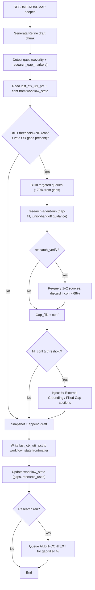

## Inward-gap-triggered researcher upgrade

### 1. Integration surface in roadmap deepen pipeline

- **Target pipeline**: Use the existing `RESUME-ROADMAP` → `auto-roadmap` deepen branch (per `[3-Resources/Second-Brain/Pipelines.md](3-Resources/Second-Brain/Pipelines.md)`), reusing the **mid-deepen refinement loop** defined in `Roadmap-Upgrade-Plan §2` rather than creating a new pipeline.
- **Hook point**: In the deepen action, after the mid-band refine loop has produced a draft phase/subphase chunk but **before** final append/snapshot, add a new **"gap analysis" sub-step** that inspects the in-memory draft for shallow or missing sections.
- **State wiring**: Extend the deepen context struct (in `roadmap-deepen` skill) to carry a `gaps` array (each gap: id, heading, type, severity, excerpt, suggested_query_seed) and a `research_used` flag so the workflow_state log and future deepen iterations can reference which gaps were filled by externals.

**Util trigger (adaptive, less brittle):**

- **Prefer frontmatter for util**: For the util-based research enable check, **prefer** reading `last_ctx_util_pct` from **workflow_state.md frontmatter** (updated by roadmap-deepen post-append). **Fallback** to parsing the last row of the `## Log` table only when that field is missing or invalid. Rationale: Completes the state schema (Roadmap-Upgrade-Plan §2) without new columns; avoids brittle table-parse failures on format changes or empty tables.
- **Quality veto (conf gate)**: Low util alone is insufficient—tie research enable to **draft quality**. Enable research only when: **util < research_util_threshold** AND **last row confidence < research_conf_veto_threshold** (default **85**). Thus research fills "cheap but shaky" drafts, not short-but-complete ones. Extensibility: Param **research_conf_veto_threshold** (default 85) in Parameters.md.
- **Gap-aware trigger**: When gap detection runs (see §2), **combine** with the above: enable outward research when (util < threshold AND conf < veto) **or** when **high-severity gaps are present** (so gap-driven fetches happen even if util/conf would not trigger alone). Prevents "complete but concise" drafts from triggering blind fetches while ensuring gap-specific needs still trigger research.

### 2. Inward gap detection design

- **Detection function**: Add a pure analysis helper in `roadmap-deepen` (or a small companion util referenced there) that:
  - Walks headings/sections in the draft note; flags a **gap** when section body word count is below a tunable `gap_min_words` (e.g. 30) or when a heading contains patterns like "TODO", "edges", "pseudo-code", "examples" with no matching markers or code fences in the body.
  - Classifies each gap into a `gap_type` enum such as `missing_examples`, `missing_pseudocode`, `thin_explanation`, `missing_edges`.
  - Computes a `severity` score (0–100) from word count, presence of TODO-like markers, and phase depth (later phases and technical subphases weight more).
  - Emits a compact summary string (used later as query seed and for logs).
- **Threshold & banding**: Compare `severity` against a new parameterized band:
  - `gap_severity_threshold` (default ~60) for **triggering outward research**.
  - `gap_soft_floor` (e.g. 40) for logging-only gaps that do not trigger research but are still tracked in workflow_state.
- **Gap markers (extensibility)**: Param **research_gap_markers** (array of strings, e.g. `["pseudo-code", "edges", "examples", "TODO"]`) used by the detector to flag headings/sections that promise content but lack it. Default from Parameters; overridable per project.
- **Heuristic-only limitation**: Detection is **heuristic-based** (word-count + marker regex)—fast but dumb. It **misses nuanced gaps** (e.g. a 60-word section that vaguely describes a state machine but lacks a wiring diagram; or missing perf trade-offs). **Gap**: Detection quality caps research precision; **risk**: some critical gaps stay unfilled and juniors still have to infer. Document this in Parameters/Roadmap-Upgrade-Plan. **Extensibility**: Add a param **gap_detection_mode** (default `heuristic`); reserve value `semantic` for a future optional pass (e.g. LLM or embedding-based "completeness given heading" check) so semantic detection can be wired in later without changing the contract.
- **Workflow_state logging**: When any gaps are detected, append a short JSON-ish `gaps:` field into the next workflow_state `## Log` row (e.g., `gaps: 2 (examples, pseudocode)`), keeping the full `gaps` array in deepen context only to avoid bloating workflow_state. **Also** ensure roadmap-deepen **writes** `last_ctx_util_pct` (and optionally last row confidence) into workflow_state **frontmatter** after each append so §1 util/conf checks are fast and robust.

### 3. Query generation for outward research

- **Location**: Extend `.cursor/skills/research-agent-run/SKILL.md` to accept structured gap hints (e.g. `gaps[]` with `heading`, `gap_type`, `excerpt`) in addition to the existing phase/outline text.
- **Query strategy**:
  - For each qualifying gap (severity ≥ threshold), derive 1–2 targeted queries using:
    - `gap_type`-specific templates, e.g. `"open-source pseudo-code for [topic] [gap_type phrase]"`, `"best-practice [topic] edge cases"`, `"[topic] reference implementation"`.
    - The local section heading and 1–2 key nouns from the excerpt (basic noun-phrase extraction or prompt-level selection) to keep queries specific.
  - Limit to a tunable `max_gap_queries_per_deepen` (default 3) to ensure 1–3 outward fetches per run.
- **Tool selection** (per `MCP-Tools.md`):
  - Use `**web_search`** for broad code/example discovery.
  - Optionally escalate to `**browse_page`** for the top 1–2 promising results to extract concrete snippets.
  - For papers/algorithms, allow a `x_keyword_search` profile (`site:arxiv.org` or similar) behind a `gap_type == "theory"` check.
- **Safety and conf bands**:
  - Keep query generation itself non-destructive and subject to the **confidence-loop**: if the synthesizer can’t propose >=1 high-quality query for a gap (self-rated below 68%), mark that gap as `research_skipped_low_conf` and do **not** call outward tools for it.

### 4. Fetch + synth + inline injection (inline / blocking default)

- **Fetch behavior (per gap)**:
  - For each high-severity gap passing the query gate, call `research-agent-run` with:
    - `mode: "gap-fill"` (new) or an equivalent flag.
    - `gaps` payload and `origin: "roadmap-deepen"` so the skill adjusts tone and structure (more pseudo-code, more references) for roadmap notes.
  - Respect existing `research_result_limit` and **reuse `research_synth_cap_tokens`** as a hard cap, with a stricter **per-gap sub-cap** (e.g. 2–3k tokens per gap) to avoid blowing up context.
- **Synthesis & structure**:
  - Have `research-agent-run` return a structured array of `gap_fills`, where each fill contains `gap_id`, `filled_markdown`, and an optional `sources` list.
  - `filled_markdown` should follow a consistent pattern, e.g.:
    - `"## Filled Gap: [local heading fragment] — [short label]\n\n[explanation/code]"`
    - Include an inline **source citation** block, e.g. `[Source: Unity CameraRig docs](url)` or `[Source: GitHub project Foo/Bar]`, matching your existing referencing style.
- **Inline injection in deepen**:
  - In `roadmap-deepen`, before final append/snapshot, loop over `gap_fills` and inject each fill **immediately after** its matching section or under a dedicated `### Filled Gaps` subsection, depending on phase style:
    - For technical subphases, prefer local injection (directly under the under-specified heading) so junior devs see code where they need it.
    - For more narrative phases, group under `### Filled Gaps (External References)` to keep main flow readable while still embedding details.
  - Tag filled sections with a subtle marker (e.g. HTML comment `<!-- research-gap-fill: id -->` or a short inline label) to support future recalibration or replacement.
- **Latency budget**:
  - Because you chose **inline/blocking** as default, constrain total outward work per deepen run:
    - New params: `max_gap_fills_per_run` (default 2–3), `max_gap_fetch_time_seconds` (soft guidance in prompts), and reuse `research_cooldown`/`research_util_threshold` as a coarse outer gate if desired.

### 5. Confidence bands and failure handling for gap fills

- **Gap-level confidence**:
  - Have `research-agent-run` return a `fill_conf` per `gap_fill`. If `fill_conf < 68`, treat it as failed: do not inject, and instead log a `gap_fallback` note in the deepen trace (e.g. `"Gap X: external research low-confidence; left as TODO"`).
  - For `68 ≤ fill_conf ≤ 84`, use a **micro refinement loop** entirely in-memory: brief self-critique of coverage and alignment to the heading; if post-loop confidence still < 85, keep it as a preview-only suggestion written into a comment or **Decision Wrapper**-style callout in the phase note rather than full integration.
- **Phase-level interaction with existing deepen loop**:
  - Keep the existing deepen mid-band loop (content/structure) as the primary decider; the new **gap-fill step runs after that** and must not downgrade a phase that already passed with high confidence.
  - Record gap-fill stats into workflow_state log/meta: number of gaps filled, tokens added, and whether any were left low-confidence.
- **Error / tool failure**:
  - If web/tool calls fail or exceed caps, skip outward research for that gap, leave the internal gap marker (e.g. a short `> [!todo]` callout) and log the failure in the roadmap log / Errors.md using the existing Error Handling Protocol (`pipeline: autonomous-roadmap`, stage: `gap-research`).

### 6. Commander / Context7 integration for manual gap research

- **Queue mode extension**:
  - In `[3-Resources/Second-Brain/Queue-Alias-Table.md](3-Resources/Second-Brain/Queue-Alias-Table.md)`, add a new alias row, e.g.:
    - **Alias**: `Queue Research: Gaps`, `RESEARCH-GAPS`.
    - **Canonical mode**: `RESEARCH-AGENT` (reused).
    - **Pipeline**: `research-agent-run` (gap-centric variant).
    - **Notes**: "Commander macro: scan current roadmap phase note for gaps, append RESEARCH-AGENT entry with gaps array (no deepen run)."
- **Commander macro design** (Context7):
  - Define a macro in `Plugins.md` / Commander docs (and [[Plugins#Component and data flow|Plugins § Component and data flow]]) that, when run from a roadmap phase note:
    - Calls `obsidian_read_note` to get the note content.
    - Runs the **same gap detection helper** (or a lightweight MCP variant) to produce the gaps array.
    - Appends a single queue entry to `.technical/prompt-queue.jsonl`:
      - `mode: "RESEARCH-AGENT"`.
      - `payload`: `{ project_id, linked_phase, gaps, origin: "commander-gaps" }`.
    - Optionally adds a note-level callout (`> [!info] Gap research queued`) for transparency.
- **Auto-flow alignment (async path)**:
  - When **gaps are found mid-deepen** and `async_research: true`, use a **Commander signal** (e.g. Watcher appends to prompt-queue) to queue **"Research: Gaps"**: append RESEARCH-AGENT entry with `gaps` array so outward fetches run asynchronously. Ties into Plugins § Component and data flow for mobile/laptop (e.g. [[Queue-Sources#Mobile-Pending-Actions|Mobile-Pending-Actions]]).
  - **Closing the async loop**: When RESEARCH-AGENT completes, the processor (or a small convention) must **enqueue a follow-up RESUME-ROADMAP** so the next run resumes the correct deepen. Specify: append to queue an entry with `mode: "RESUME-ROADMAP"`, `payload: { project_id, linked_phase, action: "deepen", injected_research_paths: [paths to Ingest/Agent-Research notes] }`. roadmap-resume / deepen reads `injected_research_paths` (from queue payload or a tiny state note keyed by project_id+phase) and loads those paths into context before continuing. This prevents orphan injections and stalled phases.
  - Default remains inline; async is opt-in via `async_research: true`.

### 7. Documentation and parameters

- **Roadmap-Upgrade-Plan.md**:
  - In §2 (Iteration and state), add a short subsection **"Inward gaps → targeted research"** describing:
    - Gap detection during deepen mid-loop.
    - Severity-based trigger for outward research.
    - Inline gap-fill injection pattern and confidence gates.
    - Util trigger: prefer frontmatter `last_ctx_util_pct`; quality veto (conf < 85); gap-aware enable.
- **Parameters.md** (§ Research / § Roadmap):
  - Add new parameters:
    - `gap_min_words` (default 30), `gap_soft_floor` / `gap_severity_threshold` (e.g. 40 / 60).
    - `max_gap_queries_per_deepen`, `max_gap_fills_per_run`, per-gap token cap.
    - **research_conf_veto_threshold** (default 85): only enable util-driven research when last row confidence < this.
    - **research_gap_markers** (array): default e.g. `["pseudo-code", "edges", "examples", "TODO"]`.
    - **research_verify** (bool, default false): when true, run post-synth verification mini-loop (see §8).
  - **gap_detection_mode** (default `heuristic`): reserve `semantic` for future optional pass (§2).
  - **handoff_auto_redeepen** (bool, default true), **handoff_auto_redeepen_threshold** (default 90): §8.
  - Clarify relationship to existing `research_util_threshold`, `research_cooldown`, and `async_research`.
- **Sync / changelog** (§7 and `.cursor/sync/changelog.md`):
  - Changelog entry to include: **Failure modes**: brittle table parse mitigated by frontmatter `last_ctx_util_pct` fallback; low-util false positives gated by confidence veto (`research_conf_veto_threshold`).
- **MCP-Tools / Pipelines docs**:
  - In `[3-Resources/Second-Brain/MCP-Tools.md](3-Resources/Second-Brain/MCP-Tools.md)`, extend the `research-agent-run` description to mention `gap-fill` mode, use of `web_search` / `browse_page`, optional MCP proxy for X Semantic Search, and the structured `gap_fills` return used by roadmap-deepen.
  - In `[3-Resources/Second-Brain/Pipelines.md](3-Resources/Second-Brain/Pipelines.md)`, update the `RESUME-ROADMAP` deepen description with a short note on **gap-triggered outward research and inline fills**, emphasizing it’s an internal refinement loop, not a new pipeline.

### 8. Verification and post-injection quality

- **Researcher verification mini-loop (outward accuracy)**:
  - Add **params.research_verify** (default false). When true, after synthesis **re-query 1–2 sources** to confirm key claims (e.g. "verify edge case X from source Y"). If mismatch or low confidence (<68%), log **#research-verify-failed** and **discard** that fill (do not inject). Quality: reduces hallucinations; cited sources are double-checked. Optional for speed; enable for high-stakes phases (e.g. phase ≥4) via param or phase gate.
- **High-stakes verification toggle (phase 4+)**:
  - Reuse **params.verify_external: true** (or `verify_external_claims`) for later phases (≥4). When set and when new code/claims were injected via gap-fills, run the verification mini-loop above and append a compact callout: `> [!check] Verified against [source]` or `> [!warning] Inconclusive external verification`.
- **Post-injection audit (completeness)**:
  - Extend **context-vs-pipeline-audit** (or a dedicated stub): add a **"gap-filled %"** metric—re-scan phase after injection and compute share of previously flagged gaps that now have content (e.g. word count or marker presence). **Queue AUDIT-CONTEXT** post-deepen when research ran, so the report flags "unfilled edges" for re-queue or re-deepen.
- **Handoff checklist audit (junior completeness)**:
  - Extend the audit stub to score **"junior completeness"**: e.g. % of quaternaries (or technical subphases) that have **code/edges/perf** markers or External Grounding blocks.
  - **Auto re-deepen on low score**: When score **< handoff_auto_redeepen_threshold** (default 90%), **automatically append** a RESUME-ROADMAP queue entry with `action: "deepen"`, `user_guidance` or `handoff_focus: true` (and project_id/linked_phase) so the next EAT-QUEUE run continues the loop. Param **handoff_auto_redeepen** (bool, default true) to enable/disable. **Gap addressed**: Handoff completeness is enforced in the loop; roadmaps don’t ship with known holes if the user runs the queue. Optional: also append a one-liner to Mobile-Pending-Actions ("Handoff score <90%; re-deepen queued") for visibility.

### 9. High-level flow diagram

### 10. Goal alignment and weaknesses addressed

- **Filling needs, not just space**: Util trigger is gated by **confidence veto** and **gap presence** (§1). Research runs only for "cheap but shaky" drafts or when specific gaps exist—not for short-but-complete content.
- **Gap-specific quality**: Inward scan (§2) and **params.gaps** with ~70% query targeting (§3) ensure outward fetches address *what* is missing (e.g. edges, pseudo-code), not blind bulk.
- **Iteration time**: Documented +30–50% risk and caps (§4); params and per-gap limits keep latency bounded; async path optional.
- **Async loop closure**: §6 persists `injected_research_paths` in workflow_state or state note so any RESUME-ROADMAP run can "resume from last injected" even if the queue batch fails or user interrupts—robust, not queue-only.
- **Verification**: §8 adds post-synth verification mini-loop and handoff-checklist audit (gap-filled %, junior completeness). Auto re-deepen when handoff score <90% enforces completeness in the loop; optional banner + Mobile-Pending-Actions when high-severity gaps are found keeps mobile/laptop users in the loop.
- **Gap detection**: Heuristic-only limitation and extensibility for semantic mode documented in §2; handoff auto re-deepen and Commander auto-signal close the remaining gaps.

