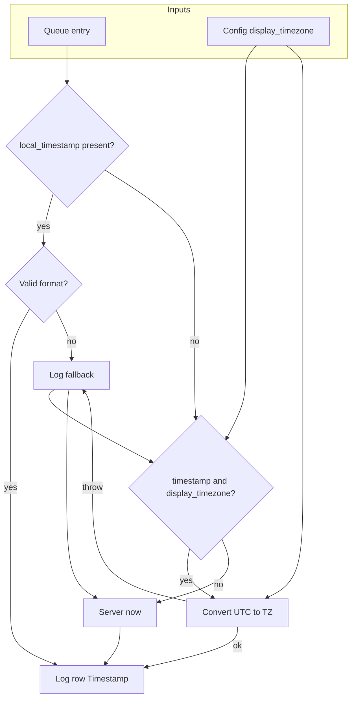

# Local time for workflow_state timestamps (v2 — hardening)

**Supersedes:** v1 plan (local_time_workflow_state_timestamps). This version adds shielding, validations, and explicit handling of agent-appended entries and failure modes.

---

## Problem (unchanged)

Timestamps in `workflow_state.md` ## Log are produced by the agent using the **execution environment's clock** (cloud server). A run at **22:14 local** can be recorded as **00:25**, breaking chronological order. The agent has no built-in way to obtain the user's local time when running in the cloud.

---

## Approach (unchanged)

Use **client-provided time** when available and **config timezone fallback** when not. Resolution order: (1) queue `local_timestamp` → (2) queue `timestamp` (UTC) + Config `display_timezone` → (3) server "now".

---

## 1. Timestamp resolution (with shielding)

### 1.1 Resolution order and validation

- **Step 1 — local_timestamp:** If the current queue entry has `**local_timestamp`** (string):
  - **Validate format:** Accept only `YYYY-MM-DD HH:MM` (e.g. `2026-03-12 22:14`). Optional: allow `YYYY-MM-DD HH:MM:SS` and trim to `YYYY-MM-DD HH:MM` for the Log cell.
  - If **invalid** (wrong length, non-numeric date/time parts, or clearly garbage): **do not use**; fall through to Step 2. Optionally log one line to `3-Resources/Errors.md`: `timestamp-resolution | local_timestamp invalid, using fallback | entry_id: <id>` (no #review-needed; fallback is correct).
- **Step 2 — timestamp + display_timezone:** If entry has `**timestamp`** (ISO 8601 UTC string) and Config has `**display_timezone`** (IANA name, e.g. `America/New_York`):
  - **Convert** UTC → display_timezone; format as `YYYY-MM-DD HH:MM`.
  - **Shielding:** If **conversion fails** (e.g. invalid IANA name, `zoneinfo`/backend throws): catch the error; **do not** fail the deepen or advance-phase run. Fall back to Step 3. **Log** to `3-Resources/Errors.md`: one entry with `error_type: display_timezone_invalid`, `display_timezone: <value>`, and **#review-needed** so the user can fix Config.
- **Step 3 — server time:** Use server "now" formatted as `YYYY-MM-DD HH:MM` (or existing code-snippet approach). Document in Parameters that this fallback may not match local order when the agent runs in the cloud.

### 1.2 Config display_timezone

- **Optional** in Second-Brain-Config (or Parameters). IANA timezone name only (e.g. `America/New_York`).
- **Validation:** If present, the agent may run a one-off check (e.g. `ZoneInfo(display_timezone)`) when first using it; on failure, log as above and treat as "not set" for that run.

---

## 2. Agent-appended queue entries (critical pothole)

When **roadmap-deepen** or **auto-roadmap** appends a **follow-up** RESUME-ROADMAP (or RECAL-ROAD, etc.) to `.technical/prompt-queue.jsonl`, that new line is **built by the agent** in the cloud. It must **not** copy `timestamp` or `local_timestamp` from the **triggering** entry (those refer to "when the current run was queued," not the next run).

### 2.1 Do not forward timestamp fields

- **roadmap-deepen** (and any rule that builds a follow-up queue line): When building the **params** and top-level fields for the **appended** RESUME-ROADMAP (or RECAL-ROAD) entry, **exclude** from the copied/forwarded fields:
  - `**timestamp`**
  - `**local_timestamp**`
- Treat these as **per-entry metadata**, not part of the "params to forward" list. Document in [Queue-Sources](3-Resources/Second-Brain/Queue-Sources.md) and in the skill: "When the agent appends a queue entry, it must not copy `timestamp` or `local_timestamp` from the triggering entry."

### 2.2 What to write on the new line

- **Option A (recommended):** Omit `timestamp` and `local_timestamp` on the new line. When that entry is later processed, resolution will hit Step 2 (no local_timestamp, no timestamp) and Step 3 (server time). So the next run’s Log row will show server time — acceptable and documented.
- **Option B:** Set `**timestamp**` on the new line to **server UTC at append time** (e.g. `new Date().toISOString()` in the agent’s environment). Then when that entry is processed, if Config has `display_timezone`, Step 2 will convert that UTC to local. That gives a consistent "append moment" in user TZ for the next run.
- Document the chosen option in the skill (e.g. "When appending a follow-up RESUME-ROADMAP, do not add timestamp or local_timestamp; the next run will use server-time fallback" or "add timestamp as server UTC so the next run can convert with display_timezone").

---

## 3. Downstream consumers (no parsing of Timestamp column)

- **auto-roadmap** (postcondition, util-based research): Reads **last data row** of the first ## Log for **Ctx Util %**, **Leftover %**, **Threshold**, **Est. Tokens / Window**, and **Confidence**. It does **not** use the Timestamp column for logic. **No change** required.
- **context-vs-pipeline-audit:** Reads last Log row for context metrics only. **No change** required.
- **Existing workflow_state rows:** May contain mixed formats (UTC or legacy local). Nothing in the codebase **sorts or compares** by the Timestamp cell. **No migration** of old rows; new rows use the new resolution.

---

## 4. Queue entry sources and coverage

| Source                          | timestamp (UTC)                 | local_timestamp          | Who writes |
| ------------------------------- | ------------------------------- | ------------------------ | ---------- |
| Watcher `appendToQueue`         | Yes (today)                     | Add in v2 (local format) | Client     |
| Prompt crafter (RESUME-ROADMAP) | No (unless we add)              | No                       | Agent      |
| roadmap-deepen (follow-up)      | Omit or server UTC (Option B)   | Omit                     | Agent      |
| EAT-CACHE pasted YAML           | May have `timestamp` in payload | May have                 | User/paste |
| Manual edit of queue file       | Unpredictable                   | Unpredictable            | User       |

- **Backward compatibility:** Entries without `timestamp` or `local_timestamp` (e.g. crafter-only, or old Watcher) always fall back to server time. No breaking change.
- **EAT-CACHE:** If pasted `queued_prompts` include `timestamp` (UTC), use it for Step 2 when `display_timezone` is set. Same resolution order.

---

## 5. Watcher plugin (local_timestamp)

- In `**appendToQueue**`, add `**local_timestamp**` in **local** time, format `**YYYY-MM-DD HH:MM**` (24-hour).
- **Example (JavaScript):**  
`const now = new Date();`  
`const y = now.getFullYear(); const m = String(now.getMonth() + 1).padStart(2, '0'); const d = String(now.getDate()).padStart(2, '0'); const h = String(now.getHours()).padStart(2, '0'); const min = String(now.getMinutes()).padStart(2, '0');`  
`local_timestamp: \`${y}-${m}-${d} ${h}:${min}`
- Keep existing `**timestamp`** (UTC) for conversion fallback and ordering.

---

## 6. Skills and rules (explicit contracts)

### 6.1 roadmap-deepen

- **Inputs:** Caller may pass `**queue_entry_timestamp`** (UTC ISO string), `**local_timestamp`** (string, `YYYY-MM-DD HH:MM`), and `**display_timezone**` (from Config).
- **Step 6 (Update workflow_state):** Resolve Timestamp cell per §1 (validate local_timestamp; catch conversion errors; fallback to server time). Write the resolved string to the new Log row.
- **When appending follow-up RESUME-ROADMAP:** Do **not** copy `timestamp` or `local_timestamp` from the current entry. Add timestamp only if Option B (§2.2) is adopted (server UTC).
- **Doc:** Replace "run a one-line code snippet that prints current local datetime" with: "Prefer queue_entry_timestamp/local_timestamp + display_timezone; fall back to server time only when missing or invalid."

### 6.2 roadmap-advance-phase

- Same inputs and resolution as roadmap-deepen for the advance-phase Log row.
- If it ever appends a queue entry, same rule: do not forward `timestamp` / `local_timestamp`.

### 6.3 auto-roadmap

- When invoking **roadmap-deepen** (and **roadmap-advance-phase**), pass the **current queue entry’s** `timestamp` and `local_timestamp` (if present). Read **display_timezone** from Config and pass it (or the skill reads Config itself). No change to postcondition (3b); it does not depend on timestamp.

### 6.4 auto-eat-queue

- When dispatching RESUME-ROADMAP, the **current queue entry** (with `id`, `timestamp`, `local_timestamp`, `params`, etc.) is in context. Ensure auto-roadmap (and thus roadmap-deepen) receives that entry. No new fields; document that timestamp fields are used for Log row resolution.

---

## 7. Error handling and logging

- **display_timezone invalid:** Log once to Errors.md with `error_type: display_timezone_invalid`, `display_timezone: <value>`, **#review-needed**. Use server time for that run and subsequent runs until Config is fixed.
- **local_timestamp invalid:** Optional one-line log (e.g. `timestamp-resolution | local_timestamp invalid, using fallback`); no #review-needed. Fall through to Step 2 or 3.
- **Conversion throw (e.g. zoneinfo):** Catch; log as display_timezone_invalid or generic `timestamp_conversion_failed`; fall back to server time. Do **not** fail the pipeline (no queue_failed, no context-tracking-missing style failure for timestamp alone).

---

## 8. Config and docs

- **Second-Brain-Config / Parameters:** Add `**display_timezone`** (optional, IANA). Document that invalid values cause a logged fallback to server time.
- **Queue-Sources:** Document `**local_timestamp`** (format `YYYY-MM-DD HH:MM`) and `**timestamp`** (UTC). State that when the **agent** appends an entry, it must **not** copy `timestamp` or `local_timestamp` from the triggering entry.
- **Vault-Layout / Parameters:** "workflow_state ## Log timestamps are in the user’s local time when possible (queue local_timestamp or timestamp + display_timezone); otherwise server time. Run order is best preserved when client provides local_timestamp or display_timezone is set."

---

## 9. Implementation order (with hardening)

1. **Config + Parameters:** Add `display_timezone`; document resolution order and fallbacks; document that invalid display_timezone is logged and causes server-time fallback.
2. **Queue-Sources:** Document `local_timestamp` and `timestamp`; **explicit rule:** agent-appended entries must not copy `timestamp` or `local_timestamp`.
3. **roadmap-deepen:** Inputs (queue_entry_timestamp, local_timestamp, display_timezone). Step 6: resolve with validation and try/catch; when building follow-up RESUME-ROADMAP line, exclude timestamp/local_timestamp from forwarded fields; optionally add server UTC (Option B).
4. **roadmap-advance-phase:** Same resolution and shielding; same no-forward rule if it appends queue entries.
5. **auto-roadmap:** Pass current entry’s `timestamp` and `local_timestamp` into roadmap-deepen/advance-phase.
6. **Watcher:** Add `local_timestamp` in `appendToQueue` (format `YYYY-MM-DD HH:MM`).
7. **Errors.md contract:** Document `timestamp-resolution`, `display_timezone_invalid`, and optional `timestamp_conversion_failed` so they are greppable and consistent.
8. **Sync + backbone:** Changelog; one-line note in Backbone/Logs.

---

## 10. Diagram (with fallbacks)

---

## 11. Out of scope (unchanged)

- Watcher-Result `completed` remains ISO 8601.
- Other pipelines (Ingest, Distill, etc.) log timestamps unchanged; pattern can be reused later.
- CHECK_WRAPPERS `id` format unchanged.

