# Multi-Run Default, One-Shot Deprecated (Quality Over Compatibility)

## Core design decisions

- **Multi-run is the only supported mode** going forward.
- **One-shot is deprecated** — still callable via explicit opt-out (phrase or `one_shot: true`), but discouraged and not maintained.
- **Every roadmap run must:**
  - Create / maintain persistent state (roadmap-state.md, decisions-log.md, distilled-core.md).
  - Distill core decisions after each phase (distill-highlight-color with lens `roadmap-accuracy`; append to distilled-core and decisions-log).
  - Run recalibration / consistency check before proceeding past phase 1.
  - Enforce per-phase confidence ≥ 85% before marking a phase complete.
- **Drift is treated as a fatal error** until fixed (auto-revert + wrapper with option to re-apply / re-apply with changes).
- **State.md is versioned and snapshotted** like phase notes (snapshot before and after every update).

## Quick audit: what's solid, what's still soft

**Rock-solid (keep as-is):**

- Multi-run default + one-shot deprecated/discouraged
- Mandatory Phase 0 bootstrap + state versioning/snapshots
- Per-phase distill → distilled-core.md + decisions-log append
- 85% conf gate before phase complete (fatal wrapper otherwise)
- RECAL-ROAD auto-trigger (every 3 phases + conf < 88% + drift above threshold)
- Drift treated as fatal → forces wrapper with revert prioritized
- Semantic diff in recal vs master goal + distilled-core

**Still soft / worth tightening (integrated below):**

- Drift threshold: tighten to **0.08** (tunable in Parameters); log exact drift score in recal report. (0.15 is too forgiving; local models drift faster.)
- Auto-revert safety net: when user ignores wrapper too long (e.g. **ignored_wrappers ≥ 3** for same roadmap) → auto-revert to last high-conf phase (archive bad phase to Branches/, reset current_phase, re-queue EXPAND-ROAD). Log "Auto-reverted due to repeated ignored drift warnings".
- Wrapper overload: add **bulk-approve** + **safe auto-apply** — Commander macro "Approve All Roadmap Wrappers"; config **auto_apply_safe_threshold: 82** so single-option wrappers ≥ 82% auto-apply with snapshot + log "auto-approved safe fix".
- **RESUME-FROM-LAST-SAFE**: add queue mode / phrase that reads state, finds highest phase with conf ≥ 85%, sets resume_from to that + 1, injects distilled-core up to there.
- **Documentation / onboarding:** Loud deprecation warning in README.md and Backbone.md; add **Roadmap Quality Guide** note in 3-Resources/Second-Brain/ (how to interpret conf bands, what to do when wrapper appears, why drift is fatal and how to fix it).

## Current mismatch

- [auto-roadmap.mdc](.cursor/rules/context/auto-roadmap.mdc) step 4: "Optionally" create Phase 0; "one-shot ROADMAP MODE may leave state files uncreated."
- [Parameters.md](3-Resources/Second-Brain/Parameters.md): "When absent or false, fallback to one-shot."
- No mandatory distill per phase, no mandatory recal before past phase 1, no per-phase confidence gate, no drift-as-fatal, no state versioning/snapshot contract.

## Implementation plan

### 1. auto-roadmap.mdc — replace step 4 block

**File:** [.cursor/rules/context/auto-roadmap.mdc](.cursor/rules/context/auto-roadmap.mdc)

Replace the entire step 4 block with:

```text
If phrase contains "ROADMAP-ONE-SHOT" OR frontmatter one_shot: true:
    Log deprecation warning to Ingest-Log: "Deprecated one-shot mode used — use multi-run for better quality"
    Run classic roadmap-generate-from-outline (full tree, no state, no distill)
    Exit early

Else (default: multi-run):
    - ensure_backup(project Roadmap folder)
    - If roadmap-state.md missing → create Phase 0 artifacts:
        - roadmap-state.md (frontmatter: current_phase: 0, status: generating, version: 1)
        - decisions-log.md
        - distilled-core.md
    - snapshot roadmap-state.md before any change
    - If ignored_wrappers >= ignored_wrappers_auto_revert (from config, default 3) for this roadmap:
        - Auto-revert to last high-conf phase: archive bad phase to Roadmap/Branches/, reset current_phase, re-queue EXPAND-ROAD from there
        - Log "Auto-reverted due to repeated ignored drift warnings"
    - If current_phase > 0:
        - Load roadmap-state.md
        - Inject previous phases + distilled-core.md into context
        - Pass resume_from: current_phase to roadmap-generate-from-outline
    - Else:
        - Run full roadmap-generate-from-outline (phase 1 to end)
    - After generation:
        - For each new/completed phase note:
            - distill-highlight-color (lens: "roadmap-accuracy")
            - Append 🔵 core decisions to distilled-core.md
            - Append link + one-sentence summary to decisions-log.md
        - Bump state.md current_phase to highest completed phase + 1
        - snapshot roadmap-state.md again
        - If any phase conf < 85% → spawn Decision Wrapper immediately (block further progress)
        - If recal needed (every 3 phases or drift > drift_score_threshold) → queue RECAL-ROAD automatically
```

- **Step 2 label:** When state does not exist, go to step 4; in step 4 branch on ROADMAP-ONE-SHOT / one_shot (deprecated) vs multi-run as above.
- **Replace "Multi-run opt-in"** with **"One-shot deprecated"**: Multi-run is the only supported mode. One-shot is deprecated; trigger **ROADMAP-ONE-SHOT** or `one_shot: true` logs deprecation warning and runs classic generate only (no state, no distill; not maintained). Encourage "use multi-run for better quality".
- **Description / intro:** Default is multi-run (create/maintain state, distill per phase, recal, conf gate, auto-revert when ignored wrappers exceed threshold); one-shot is deprecated opt-out.

### 2. roadmap-generate-from-outline skill — mandatory post-processing

**File:** [.cursor/skills/roadmap-generate-from-outline/SKILL.md](.cursor/skills/roadmap-generate-from-outline/SKILL.md)

Append mandatory post-processing steps (after generating phase notes):

```text
After generating phase notes:
- For each phase-output.md (or phase roadmap note):
  - Run distill-highlight-color with lens="roadmap-accuracy" (bias toward factual consistency, cross-references)
  - If phase conf < 85%:
      - Do NOT mark complete
      - Create Decision Wrapper in Ingest/Decisions/Roadmap-Decisions/ (or Roadmap-Decisions) with options:
        A: Accept anyway (risky)
        B: Refine with guidance "Increase factual consistency and cross-check prior phases"
        C: Revert this phase and regenerate from previous
        D: Abort roadmap
  - Else:
      - Append to decisions-log: "- Phase {{n}}: [summary] [[phase-n-output]] (conf {{conf}}%)"
      - Append 🔵 highlights to distilled-core.md
- If recal triggered and drift > drift_score_threshold (default 0.08):
  - Force Decision Wrapper with "A: Revert to last safe phase" as default/first option (revert prioritized)
- Update roadmap-state.md (current_phase, last_run: timestamp, version increment)
```

Ensure the skill receives or derives per-phase confidence (e.g. from distill or a lightweight scoring step) so the < 85% gate can be applied. Use **drift_score_threshold** from Parameters (default 0.08).

### 3. roadmap-state.md schema (enforce in rule/skill)

Frontmatter must include; enforce in auto-roadmap and roadmap-generate-from-outline (and any code that writes roadmap-state.md):

```yaml
current_phase: <int>
status: generating | complete | blocked | recal-needed
version: <int>          # increment on every write
last_run: YYYY-MM-DD-HHMM
completed_phases: [1,2,3,...]
drift_score_last_recal: <float>   # 0.0–1.0, higher = more drift
```

- **generating:** Tree or current phase is being generated.
- **complete:** All phases generated and conf ≥ 85%; no recal pending.
- **blocked:** Mid-band or low conf; wrapper spawned; waiting on user.
- **recal-needed:** RECAL-ROAD triggered (every 3 phases or drift); consistency check pending or failed.

Document this schema in [Vault-Layout.md](3-Resources/Second-Brain/Vault-Layout.md) and in the skill/rule so all writers use it.

### 4. RECAL-ROAD — strengthen trigger and behavior

- **Trigger automatically:** After every 3 phases OR if any phase conf < 88% OR `drift_score_last_recal` > **drift_score_threshold** (default **0.08**; tunable in Parameters — 0.15 was too forgiving). Or drift detected in current run.
- **Behavior:** Do semantic diff against master goal + distilled-core. If drift > threshold → force Decision Wrapper with **revert option prioritized** (e.g. "A: Revert to last safe phase", "Re-apply with changes"). **Log exact drift score** in the recal consistency report. Output a **"consistency report"** callout in roadmap-state.md body (or a linked note) so state carries the last recal result (include numeric drift score).
- **Auto-revert safety net:** In RECAL-ROAD skill (or auto-roadmap): if **ignored_wrappers ≥ ignored_wrappers_auto_revert** (config default 3) for the same roadmap → auto-revert to last high-conf phase (archive bad phase to Roadmap/Branches/, reset current_phase, re-queue EXPAND-ROAD from there). Log "Auto-reverted due to repeated ignored drift warnings".
- **Integration:** Called from auto-roadmap after generation when "recal needed" is true; also dispatchable via queue mode RECAL-ROAD. Update [Queue-Sources.md](3-Resources/Second-Brain/Queue-Sources.md) and RECAL-ROAD handler to use the new triggers, **drift_score_threshold** (0.08), and consistency report with exact drift score.

### 5. New safety invariants (mcp-obsidian-integration or always rule)

Add to [mcp-obsidian-integration.mdc](.cursor/rules/always/mcp-obsidian-integration.mdc) or an always-applied rule:

- **Never advance `current_phase`** unless ALL prior phases have conf ≥ 85%.
- **Snapshot roadmap-state.md before AND after every update** (obsidian-snapshot skill).
- **If roadmap-state.md parse fails** (invalid YAML, missing required frontmatter) → abort pipeline + log to Errors.md with `#state-corrupt` + create Decision Wrapper under `Ingest/Decisions/Errors/`: "Fix state.md or revert?" with options to repair state or reset.

Document in the same rule where roadmap-state is mentioned (e.g. snapshot triggers table or a dedicated "Roadmap state" subsection).

### 6. Parameters and config (roadmap block)

Add a **roadmap** block to [Parameters.md](3-Resources/Second-Brain/Parameters.md) and/or [Second-Brain-Config.md](3-Resources/Second-Brain-Config.md) (read by rule/skill):

```yaml
roadmap:
  default_mode: multi-run
  one_shot_deprecated: true
  conf_phase_complete_threshold: 85
  drift_score_threshold: 0.08          # was 0.15; tunable
  auto_apply_safe_threshold: 82       # single-option wrappers ≥82% auto-apply with snapshot + log
  ignored_wrappers_auto_revert: 3      # after this many ignored recal wrappers, auto-revert to last safe phase
```

Log exact drift score in recal consistency report. Rules and RECAL-ROAD handler read these values.

### 7. Parameters and docs

- **[Parameters.md](3-Resources/Second-Brain/Parameters.md):** Add roadmap block above. State that multi-run is the only supported mode; one-shot deprecated (trigger **ROADMAP-ONE-SHOT** or `one_shot: true`; discouraged; not maintained). Document roadmap-state schema and thresholds (85% phase complete, 88% recal trigger, **drift_score_threshold: 0.08**).
- **[Cursor-Skill-Pipelines-Reference.md](3-Resources/Second-Brain/Cursor-Skill-Pipelines-Reference.md):** ROADMAP row — default multi-run (Phase 0, state, distill per phase, recal every 3 or drift > 0.08, conf gate); one-shot deprecated (ROADMAP-ONE-SHOT); RECAL-ROAD auto-trigger; auto-revert when ignored_wrappers ≥ 3.
- **[Pipelines.md](3-Resources/Second-Brain/Pipelines.md), [Rules.md](3-Resources/Second-Brain/Rules.md), [README.md](3-Resources/Second-Brain/README.md):** Same wording; drift = fatal until fixed; state versioned/snapshotted.
- **[README.md](3-Resources/Second-Brain/README.md) and [Backbone.md](3-Resources/Second-Brain/Backbone.md):** Add **loud deprecation warning** (callout):
  - `> [!danger] ROADMAP MODE is now multi-run only. One-shot is deprecated and will not receive updates. Use ROADMAP-ONE-SHOT if you must.`
- **[3-Resources/Second-Brain/Roadmap-Quality-Guide.md](3-Resources/Second-Brain/Roadmap-Quality-Guide.md)** (new): Add "Roadmap Quality Guide" — how to interpret conf bands; what to do when a wrapper appears; why drift is fatal and how to fix it (revert, re-apply, refine).
- **[Backbone.md](3-Resources/Second-Brain/Backbone.md):** Multi-run only; one-shot deprecated; mandatory distill, recal, conf gate; drift fatal; state schema and snapshot; RESUME-FROM-LAST-SAFE; bulk-approve.
- **[Queue-Sources.md](3-Resources/Second-Brain/Queue-Sources.md):** RECAL-ROAD triggers (every 3 phases, conf < 88%, drift > 0.08); **RESUME-FROM-LAST-SAFE** (reads state, finds highest phase with conf ≥ 85%, sets resume_from to that + 1, injects distilled-core up to there); one_shot / ROADMAP-ONE-SHOT opt-out deprecated.
- **[Vault-Layout.md](3-Resources/Second-Brain/Vault-Layout.md):** roadmap-state.md schema (current_phase, status, version, last_run, completed_phases, drift_score_last_recal).
- **Commander macro:** "Approve All Roadmap Wrappers" — bulk-approve roadmap Decision Wrappers in project scope. Document in Commander-Plugin-Usage or Backbone. With **auto_apply_safe_threshold: 82**, single-option wrappers ≥ 82% may auto-apply with snapshot + log "auto-approved safe fix".

### 8. Sync and plan doc

- **[.cursor/sync/rules/context/auto-roadmap.md](.cursor/sync/rules/context/auto-roadmap.md):** Mirror full step 4 and one-shot-deprecated section.
- **[.cursor/plans/multi-run_roadmap_generation_56c945ac.plan.md](.cursor/plans/multi-run_roadmap_generation_56c945ac.plan.md):** Optional note that implementation follows "multi-run only, one-shot deprecated" and quality gates (distill, recal, conf, drift-as-fatal).

## Flow summary (after change)

```mermaid
flowchart LR
  ROADMAP[ROADMAP MODE] --> OneShot{ROADMAP-ONE-SHOT or one_shot true?}
  OneShot -->|Yes| Deprecated[Log deprecation run classic generate exit]
  OneShot -->|No| EnsureBackup[ensure_backup Roadmap]
  EnsureBackup --> NoState{roadmap-state.md exists?}
  NoState -->|No| CreatePhase0[Create Phase 0 artifacts]
  NoState -->|Yes| SnapshotState[snapshot roadmap-state.md]
  CreatePhase0 --> SnapshotState
  SnapshotState --> IgnoredCheck{ignored_wrappers ge threshold?}
  IgnoredCheck -->|Yes| AutoRevert[Auto-revert to last safe phase log]
  IgnoredCheck -->|No| ResumeCheck{current_phase greater 0?}
  AutoRevert --> ResumeCheck
  ResumeCheck -->|Yes| Resume[Load state inject phases distilled-core resume_from]
  ResumeCheck -->|No| FullGen[Full roadmap-generate-from-outline]
  Resume --> Generate[roadmap-generate-from-outline]
  FullGen --> Generate
  Generate --> PerPhase[distill per phase append decisions distilled-core]
  PerPhase --> BumpState[Bump state snapshot state]
  BumpState --> ConfGate{any phase conf less 85%?}
  ConfGate -->|Yes| Wrapper[Spawn Decision Wrapper block progress]
  ConfGate -->|No| RecalCheck{recal needed drift gt 0.08?}
  RecalCheck -->|Yes| QueueRecal[Queue RECAL-ROAD]
  RecalCheck -->|No| Done[Done]
  QueueRecal --> Done
```




## Expected outcome after these changes

- **First ROADMAP MODE run:** Creates state + full tree + distills cores per phase + bumps state to phase 7 (or N). Recal runs before proceeding past phase 1 when applicable.
- **Second run (resume/continue):** Only generates from current_phase onward; cross-checks against distilled-core; state loaded and snapshotted.
- **Mid/low conf phase:** Blocks progress until Decision Wrapper resolved (Accept anyway / Refine / Revert phase / Abort).
- **Drift detected:** Forces RECAL-ROAD + wrapper with revert option prioritized; drift treated as fatal until fixed.
- **One-shot users:** Must explicitly opt out (phrase or `one_shot: true`); get warning in Ingest-Log; output quality may degrade; path not maintained.

Result: noticeably more accurate and coherent roadmaps over multiple sessions, at the cost of more user intervention when conf or drift fails (errors caught instead of silently propagated).

**Bottom line:** With these tweaks, the roadmap system is robust and high-quality-first: outputs stay consistent across sessions; errors surface early and loudly (wrappers, auto-revert); drift is caught aggressively; one-shot users are nudged or warned toward multi-run. This is a material upgrade to roadmap fidelity, not a minor iterative improvement.

## Files to touch


| File                                                                            | Change                                                                                                                                                                                                             |
| ------------------------------------------------------------------------------- | ------------------------------------------------------------------------------------------------------------------------------------------------------------------------------------------------------------------ |
| `.cursor/rules/context/auto-roadmap.mdc`                                        | Replace step 4: ROADMAP-ONE-SHOT / one_shot deprecated (log "use multi-run for better quality"); multi-run with Phase 0, ignored_wrappers ≥ N → auto-revert, distill per phase, conf gate, recal when drift > 0.08 |
| `.cursor/sync/rules/context/auto-roadmap.md`                                    | Mirror rule                                                                                                                                                                                                        |
| `.cursor/skills/roadmap-generate-from-outline/SKILL.md`                         | Post-processing: distill per phase, conf < 85% wrapper, drift > 0.08 → force wrapper with "A: Revert to last safe phase", update state                                                                             |
| `.cursor/rules/always/mcp-obsidian-integration.mdc` (or always rule)            | Safety: never advance current_phase unless prior phases conf ≥ 85%; snapshot state before/after every update; state parse fail → abort + #state-corrupt + wrapper                                                  |
| RECAL-ROAD handler                                                              | Auto-trigger every 3 phases or conf < 88% or **drift > 0.08**; log **exact drift score** in consistency report; ignored_wrappers ≥ 3 → auto-revert to last safe phase                                              |
| `3-Resources/Second-Brain/Parameters.md` or **Second-Brain-Config.md**          | Add **roadmap** block: default_mode, one_shot_deprecated, conf_phase_complete_threshold: 85, **drift_score_threshold: 0.08**, **auto_apply_safe_threshold: 82**, **ignored_wrappers_auto_revert: 3**               |
| `3-Resources/Second-Brain/Vault-Layout.md`                                      | roadmap-state.md schema                                                                                                                                                                                            |
| `3-Resources/Second-Brain/Cursor-Skill-Pipelines-Reference.md`                  | ROADMAP row: multi-run default, drift 0.08, auto-revert, RESUME-FROM-LAST-SAFE                                                                                                                                     |
| `3-Resources/Second-Brain/Pipelines.md`, `Rules.md`, `README.md`, `Backbone.md` | Same; **README and Backbone: add [!danger] deprecation callout** (ROADMAP MODE multi-run only; use ROADMAP-ONE-SHOT if you must)                                                                                   |
| `3-Resources/Second-Brain/Roadmap-Quality-Guide.md`                             | **New:** How to interpret conf bands; what to do when wrapper appears; why drift is fatal and how to fix it                                                                                                        |
| `3-Resources/Second-Brain/Queue-Sources.md`                                     | RECAL-ROAD (drift > 0.08); **RESUME-FROM-LAST-SAFE**; ROADMAP-ONE-SHOT deprecated                                                                                                                                  |
| Commander macro                                                                 | **"Approve All Roadmap Wrappers"**; document in Commander-Plugin-Usage; with auto_apply_safe_threshold: 82 single-option wrappers can auto-apply                                                                   |
| `.cursor/plans/multi-run_roadmap_generation_56c945ac.plan.md`                   | Optional: multi-run only, one-shot deprecated note                                                                                                                                                                 |


