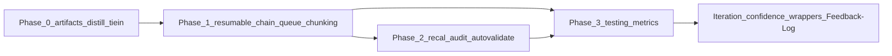

# Multi-Run Roadmap Generation Plan

## Master goal recap (distilled)

Build a resumable, multi-run roadmap generation system in the Second Brain that approximates cloud one-shot quality on local Cursor: persistent state artifacts for consistency, auto-distill for memory, queue chunking for depth, recalibration gates for accuracy, and safety hooks — enabling phased plans over multiple sessions without drift, targeting ~90% parity for any project master goal.

---

## Current state (brief)

- **roadmap-generate-from-outline** ([.cursor/skills/roadmap-generate-from-outline/SKILL.md](.cursor/skills/roadmap-generate-from-outline/SKILL.md)): Single run — backup → normalize PMG → parse phases → create full tree (master + phase notes + MOC + move source). No persistent "current phase" or hand-off.
- **Roadmap layout** ([4-Archives/Resources/Roadmap-Standard-Format.md](4-Archives/Resources/Roadmap-Standard-Format.md)): `1-Projects/<Project>/Roadmap/` with master note, `Phase-N-<Name>/` folders, phase roadmap notes, `Source-`* seed. No `roadmap-state.md` or `decisions-log.md` today.
- **Triggers**: ROADMAP MODE is agent-interpreted; EAT-QUEUE has TASK-ROADMAP, NORMALIZE-MASTER-GOAL, EXPAND-ROAD. No RECAL-ROAD or "Resume roadmap" mode.
- **Safety**: [mcp-obsidian-integration](.cursor/rules/always/mcp-obsidian-integration.mdc) (backup before writes, per-change snapshot before destructive, dry_run before move); [confidence-loops](.cursor/rules/always/confidence-loops.mdc) (68–84 refinement, <68 Decision Wrapper).

---

## Phase 0: Setup and artifacts (prep)

**Goal:** Bootstrap persistent state under each project’s `Roadmap/` so runs can resume, decisions are queryable, and a compressed “memory layer” (distilled-core) reduces token bloat and hallucination on resume.

**New artifacts (under `1-Projects/<project-id>/Roadmap/`):**


| Artifact                                | Purpose                                                                                                                                                                                                                                                                                                                                                                                                                           |
| --------------------------------------- | --------------------------------------------------------------------------------------------------------------------------------------------------------------------------------------------------------------------------------------------------------------------------------------------------------------------------------------------------------------------------------------------------------------------------------- |
| **roadmap-state.md**                    | Single source of truth for run progress. Frontmatter: `current_phase: N`, `status: in-progress                                                                                                                                                                                                                                                                                                                                    |
| **decisions-log.md**                    | Bullet list of key choices (e.g. "Phase 2: Chose Unity over Godot [rationale: …]"). Appended via a small append step (obsidian_read_note + obsidian_search_replace or dedicated skill).                                                                                                                                                                                                                                           |
| **distilled-core.md**                   | Compressed memory for resumption. Frontmatter: `core_decisions: array` of core-decision highlights (e.g. 🔵 or structured slugs). Body: Mermaid graph of dependencies (e.g. "Phase 1 engine choice → Phase 4 sim mods"). Built from phase outputs after distill; reduces token bloat and enforces "remember X" on resume.                                                                                                         |
| **phase-X-output.md**                   | **Chosen: Approach A.** Dedicated narrative dump per phase when content exceeds ~1k tokens; linked from roadmap-state. **Canonical source:** the phase roadmap note (e.g. `Phase-N-<Name>-Roadmap-….md`). `phase-X-output.md` is a **derived** extract for resumption/distill only. Kept in sync by the **phase-output sync** rule (see below). Single writer: only the pipeline creates/updates phase-X-output; no ad-hoc edits. |
| **Templates/Hand-Off-Roadmap.md** (new) | Prompt skeleton for resumption. Fields: `previous_outputs: [[links]]`, `current_directive: …`, `open_tbd: list`. **Mandate:** "@-ref distilled-core.md first" before previous_outputs — reduces token bloat while enforcing factual anchors. Add: "Emit outputs as linked atomic notes; max 300 tokens per task pseudocode block."                                                                                                |


**Distill tie-in (accuracy-focused):**

- **Auto-run after every phase:** In the autonomous-roadmap chain (to be documented in [Cursor-Skill-Pipelines-Reference](3-Resources/Second-Brain/Cursor-Skill-Pipelines-Reference.md) § autonomous-roadmap), slot **distill-highlight-color** after every phase-output write. Distill extracts "core decisions" (🔵) into `decisions-log.md` and updates **distilled-core.md** (frontmatter `core_decisions`, body Mermaid). Per [Color-Coded-Highlighting](3-Resources/Second-Brain/Color-Coded-Highlighting.md) and Highlightr semantics, use analogous colors for related decisions (e.g. blue–green for tech-stack chain) so drift is visible in the vault graph.
- **Config:** [Second-Brain-Config](3-Resources/Second-Brain-Config.md): Add `distill_roadmap_lens: "accuracy-focus"` (optional) to bias distill toward factual anchors over creative fluff; extensible for other lenses later.

**Integration:**

- **Rule tweak:** In [00-always-core.mdc](.cursor/rules/always/00-always-core.mdc) or new **auto-roadmap** context rule: on **"ROADMAP MODE"** (when targeting a project with a Roadmap), ensure backup then **check/create** the above artifacts on first resumable run. One-shot ROADMAP MODE remains unchanged until Phase 1 (no state files created by default).

**Milestone:** Empty skeleton files and template added; Hand-Off mandates distilled-core first and 300-token cap per task block; one manual “resume” prompt tested.

**Files to add/change:**

- `1-Projects/<project-id>/Roadmap/roadmap-state.md`, `decisions-log.md`, `distilled-core.md` (created on first resumable run).
- `Templates/Hand-Off-Roadmap.md` (new).
- [3-Resources/Second-Brain/Vault-Layout.md](3-Resources/Second-Brain/Vault-Layout.md): Document `Roadmap/roadmap-state.md`, `Roadmap/decisions-log.md`, `Roadmap/distilled-core.md`, `phase-X-output.md` (Approach A, sync rule). Document phase output sync rule.
- [3-Resources/Second-Brain/Templates.md](3-Resources/Second-Brain/Templates.md): Add Hand-Off-Roadmap and when it’s used.

**Phase output sync rule (Approach A):** Keep `phase-X-output.md` aligned with the canonical phase roadmap note (source of truth). **When:** After phase writes, during RECAL-ROAD or every N phases, or on-demand (queue mode **SYNC-PHASE-OUTPUTS** / Commander "Sync phase outputs"). **What:** Compare narrative in phase roadmap vs phase-X-output; if out of sync, report to Feedback-Log/Errors.md with #review-needed, or auto-refresh phase-X-output from phase roadmap (snapshot + backup before overwrite). Single writer: only pipeline updates phase-X-output. **Config:** `phase_output_sync: report_only | auto_refresh` in Second-Brain-Config or Parameters. **Skill:** roadmap-phase-output-sync (`.cursor/skills/roadmap-phase-output-sync/SKILL.md`); add SYNC-PHASE-OUTPUTS to Queue-Sources and pipeline reference.

---

## Phase 1: Resumable skill chain (core impl)

**Goal:** Make roadmap-generate-from-outline (and expand-road) restartable across Cursor sessions via state + hand-off, with queue-based chunking so local context stays small and reasoning depth per turn improves.

**New skill: roadmap-resume**

- **Location:** `.cursor/skills/roadmap-resume/SKILL.md`.
- **Behavior:** Read `roadmap-state.md` for the project (path from trigger: project-id or current note). Load `current_phase`, `status`. **Mandate:** Build resumption context by @-ref **distilled-core.md first**, then previous phase output notes (or phase roadmap notes). Fill `Templates/Hand-Off-Roadmap.md` with `previous_outputs`, `current_directive`, `open_tbd`. If `status: blocked`, prompt for `user_guidance` (mid-band loop per [confidence-loops](.cursor/rules/always/confidence-loops.mdc): 68–84% → refine; no destructive step until ≥85%). Emit a single “resumption” prompt or queue entry so the agent continues from the next phase.
- **Queue chunking:** If the next phase directive or phase content is **>500 tokens**, do not run one large generation. Instead, **chunk into atomic subtasks**: append entries to `prompt-queue.jsonl` (per [Queue-Sources](3-Resources/Second-Brain/Queue-Sources.md)) with `mode: EXPAND-ROAD` or `TASK-TO-PLAN-PROMPT`, `source_file` pointing at the phase or a `phase-X-directive.md` stub. Enables mobile: queue on phone, EAT-QUEUE on laptop.
- **Post-atomize:** After split_atomic (or phase-output split), run **verify_classification** (or equivalent) on new chunks so they get `para-type: roadmap-task` (or equivalent in PARA) and remain actionable per [PARA-Actionability-Rubric](3-Resources/Second-Brain/PARA-Actionability-Rubric.md) where applicable.
- **Stall fallback:** If the run stalls (e.g. local timeout), auto-append a resume entry to **Task-Queue.md** with banner cleanup on success (per existing task-queue / [User-Flow-Skills](3-Resources/Second-Brain/Second-Brain-User-Flows/User-Flow-Skills-Mid-Level.md) patterns).

**Updates to roadmap-generate-from-outline**

- **New param:** `resume_from: phase-N` (optional). When set, skip phases 1..N-1; read existing master and phase notes from `Roadmap/`; generate only from phase N onward (and append/update master and MOC as needed). Output of each phase should end with a **“## Next Phase Hand-Off”** section: short summary + open TBDs + link to `roadmap-state` and `decisions-log`.
- **Atomizer:** When a single phase output is large (>~1k tokens), call **split_atomic** (or a roadmap-specific phase-output split) so the phase is broken into `phase-X-task-Y.md` or similar atomic chunks under that phase folder; update roadmap-state links. Hand-Off template already caps at 300 tokens per task pseudocode block (Phase 0).

**Rule enforcement**

- **New context rule: auto-roadmap.mdc**
  - **Trigger:** Same as ROADMAP MODE (e.g. “ROADMAP MODE”, “Resume roadmap”, queue mode **RESUME-ROADMAP** if added).
  - **Behavior:** Resolve project (from note path or queue payload). If `Roadmap/roadmap-state.md` exists and `status` is `in-progress` or `blocked`, run **roadmap-resume** first (load state, build hand-off with distilled-core first, then output prompt or enqueue “continue from phase N”; use queue chunking when phase >500 tokens). If no state or `status: complete`, run **roadmap-generate-from-outline** as today (one-shot) or with `resume_from` when state indicates a phase number.
- **Safety:** [mcp-obsidian-integration](.cursor/rules/always/mcp-obsidian-integration.mdc) unchanged: snapshot before destructive writes; backup before structural changes; dry_run before move.

**Config**

- [3-Resources/Second-Brain-Config.md](3-Resources/Second-Brain-Config.md): Add optional `custom_hand_off: path`. roadmap-resume reads it when building the resumption prompt.

**Milestone:** Full Genesis Mythos example runs over 3 separate Cursor sessions without drift (manual diff check). State, distilled-core-first hand-off, and queue chunking drive "Resume roadmap" correctly.

**Docs / sync**

- [Cursor-Skill-Pipelines-Reference](3-Resources/Second-Brain/Cursor-Skill-Pipelines-Reference.md): Add ROADMAP MODE branch (state exists → roadmap-resume → then generate from phase N).
- [Skills](3-Resources/Second-Brain/Skills.md): Add roadmap-resume; note roadmap-generate-from-outline `resume_from` and Next Phase Hand-Off.
- [Queue-Sources](3-Resources/Second-Brain/Queue-Sources.md): Add **RESUME-ROADMAP** (and optionally **ROADMAP MODE** as queue mode) with payload `source_file` or `project_id`.
- [.cursor/sync/](.cursor/sync/): Sync new/updated rules and skills per [backbone-docs-sync](.cursor/rules/always/backbone-docs-sync.mdc).

---

## Phase 2: Consistency and recalibration (polish)

**Goal:** Detect cross-phase drift and surface fixes via Decision Wrappers and re-queue, with **automated validation** and confidence gates so bad phases are caught early and semi-auto refinement is possible.

**New queue mode: RECAL-ROAD**

- **Source:** [Queue-Sources](3-Resources/Second-Brain/Queue-Sources.md): Add RECAL-ROAD (trigger: every 3 phases via auto-eat-queue or user / Commander “Recalibrate roadmap”).
- Optionally run **roadmap-phase-output-sync** as part of RECAL-ROAD so phase-X-output.md stays aligned with phase roadmap notes (Approach A).
- **Skill: roadmap-audit**
  - **Location:** `.cursor/skills/roadmap-audit/SKILL.md`.
  - **Behavior:** Scan all phase notes in `Roadmap/` and `decisions-log.md`. List drifts (e.g. “Phase 4 contradicts Phase 1 on engine choice”) with severity: low / medium / high. If any drift has **severity > medium**, create a **Decision Wrapper** under `Ingest/Decisions/` (e.g. Refinements or Roadmap-Decisions) with A–G options (e.g. “Align Phase 4 with Phase 1”, “Update Phase 1 to match Phase 4”, “Leave as-is”, “Re-run EXPAND-ROAD with guidance”). Use [Templates/Decision-Wrapper](Templates/Decision-Wrapper.md); ensure structure via `obsidian_ensure_structure`; log CHECK_WRAPPERS and Watcher-Result per [watcher-result-append](.cursor/rules/always/watcher-result-append.mdc).
- **Confidence gates (integrate with [confidence-loops](.cursor/rules/always/confidence-loops.mdc)):** On RECAL-ROAD trigger, evaluate **pre_loop_conf** on the full `roadmap-state.md` (and optionally phase set). **Mid-band (68–84%):** Auto-refine using **feedback-incorporate** (load `user_guidance` from `decisions-log.md` if present); single non-destructive loop, then re-score. **Low (<68%):** Do not auto-apply; spawn Decision Wrapper with options including e.g. “A: Revert Phase 4 to match Phase 1 [dry_run preview]” and log to Errors.md with #review-needed. **Manual override:** If user sets **re-wrap: true** on that wrapper, archive the current state and re-queue from the prior phase (per [Rules](3-Resources/Second-Brain/Rules.md) § re-wrap branch).
- **Skill: roadmap-validate (post-audit)**
  - **Location:** `.cursor/skills/roadmap-validate/SKILL.md`.
  - **Behavior:** After roadmap-audit (or as part of RECAL-ROAD chain). Use **obsidian_global_search** to cross-check phase content against the project’s **master-goal** (or Source note). Flag mismatches (e.g. phase assumes engine X, master says Y) and append to [Errors](3-Resources/Errors.md) with **#review-needed** and a short summary. Enables proactive catch before drift compounds.
- **Tradeoff:** On weak local models (e.g. 7B), confidence gates may trigger wrappers frequently; accept more human intervention or upgrade model.

**Obsidian / interlinks**

- Ensure artifacts link back: `links: ["[[roadmap-state]]", "[[decisions-log]]"]` on master and phase notes (frontmatter-enrich or post-step in roadmap-generate-from-outline / roadmap-resume).
- **Distill for memory:** When running an audit, run **distill-highlight-color** on the audited set and tag drift snippets (supporting vs obsolete) so the graph shows “I remember X” (per [distill-highlight-color](.cursor/skills/distill-highlight-color/SKILL.md) and [Color-Coded-Highlighting](3-Resources/Second-Brain/Color-Coded-Highlighting.md)).

**Tolerance for long outputs**

- Hand-Off template already caps at 300 tokens per task block (Phase 0). Pipeline reference: slot **split_atomic** after generate when phase output exceeds threshold.

**Milestone:** Inject a deliberate contradiction in a test roadmap; RECAL-ROAD creates a wrapper; user approves an option; re-run (e.g. EXPAND-ROAD with guidance) and verify clean state. roadmap-validate flags the contradiction when run post-audit.

**Docs**

- Pipelines reference: RECAL-ROAD dispatch, roadmap-audit, roadmap-validate, roadmap-phase-output-sync (and SYNC-PHASE-OUTPUTS); confidence gates and snapshot triggers.
- [Logs](3-Resources/Second-Brain/Logs.md): Where to log RECAL-ROAD and roadmap-audit (e.g. Ingest-Log with pipeline tag `roadmap-audit`, or Roadmap-Log if added).

---

## Phase 3: Testing and iteration (ongoing)

**Goal:** Validate multi-run behavior with **measurable quality gates**: flip rate, drift score, and regression-style checks so parity vs one-shot/cloud is quantifiable.

**Test suite (document in [Testing](3-Resources/Second-Brain/Testing.md) or a dedicated Roadmap-Testing section)**

- **Fixtures:** Add a **multi-run** folder under tests/ (e.g. `tests/multi-run/` or `tests/fixtures/roadmap-multi-run/`): e.g. `genesis-mythos-master-goal.md` plus an **interrupted** `roadmap-state.md` (status in-progress, current_phase = 2) to simulate resume. Include 2 generic master goals (“PKM app”, “Game prototype”) for variety.
- **Runs:** 5× local multi-run (3+ sessions each) vs 1× baseline one-shot (single long prompt). Compare: drift %, completion time, user interventions.
- **Metrics:**
  - **Flip rate %:** Decision changes across resumes (e.g. “Phase 2 choice changed between session 1 and session 2”). Target: aim for **<5% flip rate** on stable resumes; document in test report.
  - **Drift score:** Semantic similarity between phases (e.g. cosine sim on distilled-core excerpts or key phrases) to detect contradiction; use code_execution or a small script if needed. Log to test artifact or [Regression-Stability-Log](3-Resources/Second-Brain/Regression-Stability-Log.md) if present.
  - **Confidence threshold:** Abort or flag test run if **avg confidence post-resume <85%**; keeps quality gate explicit.
- **Integration test:** Mock a **low-conf run** → Decision Wrapper created → user approves option → re-queue; **assert no unbacked writes** (per [mcp-obsidian-integration](.cursor/rules/always/mcp-obsidian-integration.mdc) Error Handling Protocol: backup/snapshot before destructive steps).
- **Coverage:** Include **RECAL-ROAD** in the suite (run RECAL-ROAD on a deliberately inconsistent fixture; assert wrapper created and options correct).
- **Edge cases (add to suite):** (1) **Queue chunking:** Interrupt after chunk 2 of 5 → assert phase-output eventually has all 5 chunks or fails gracefully with wrapper/log. (2) **Mobile → laptop:** Mobile adds "RESUME-ROADMAP phase:3" → laptop EAT-QUEUE → assert state syncs (current_phase and links consistent). (3) **Manual edit after distill:** Edit phase-2-output.md after distill → run RECAL-ROAD or phase-output sync → assert drift detected and reported (or distilled-core updated). (4) **State parse failure:** Invalid roadmap-state frontmatter (e.g. missing current_phase) → resume aborts with clear error and wrapper, no silent skip.
- **Config:** [Parameters](3-Resources/Second-Brain/Parameters.md): Add optional **roadmap_test_thresholds** block (e.g. `flip_rate_max: 5`, `min_avg_conf_post_resume: 85`) for extensible quality gates.

**Mobile / Commander**

- Commander macro “Resume Roadmap” appends **RESUME-ROADMAP** (or ROADMAP MODE with project_id) to the queue; process on laptop. Async previews for mid-band audits (roadmap-audit) per existing async loop patterns.

**Iteration**

- **feedback-incorporate:** After tests, log to [Feedback-Log](3-Resources/Second-Brain/Logs.md); re-queue if `post_loop_conf` < 85% per confidence-loops.
- **Completeness:** Cover TASK-ROADMAP, EXPAND-ROAD, RESUME-ROADMAP, and RECAL-ROAD in multi-run scenarios. Iteration loop: test → log → re-queue when below threshold; document in Backbone.

**Docs**

- [Backbone](3-Resources/Second-Brain/Backbone.md): Add “Multi-run roadmap” subsection: when to use, state artifacts, resume vs one-shot, RECAL-ROAD, and pointer to test metrics (flip rate, drift score).

**Milestone:** ~90% equivalence on test roadmaps (local multi-run vs single long run); flip rate and drift score recorded; integration test passes (no unbacked writes); RECAL-ROAD in suite; docs updated; no regressions on one-shot ROADMAP MODE.

---

## Risks and scope

- **Over-scaffolding:** If the extra state and hand-off steps feel heavy, keep one-shot ROADMAP MODE as default and make multi-run opt-in (e.g. “ROADMAP MODE – multi-run” or first creation of `roadmap-state.md`). **Overhead mitigation:** Auto-archive completed roadmaps to **4-Archives/Roadmap-History/** (or similar) after a project milestone (e.g. Q3 target) so active Roadmap/ stays lean.
- **Local vs cloud:** Plan targets ~~80% of the cloud approximation gap; **~~5–10% gap remains** on "magic recall" and long-horizon consistency. If accuracy tanks, **fallback to cloud one-shot** is fine; do not force multi-run everywhere.
- **Fallback:** If multi-run is off or state is missing, behavior stays as today: single run of roadmap-generate-from-outline with no state files.
- **Implementation cost:** ~1–2 extra days for new skills and queue modes; pays off in reuse for any phased plan, not just roadmaps.

---

## Error handling and fallbacks

Per [mcp-obsidian-integration](.cursor/rules/always/mcp-obsidian-integration.mdc) § Error Handling Protocol: every new skill (roadmap-resume, roadmap-validate, roadmap-audit, roadmap-phase-output-sync) must log traces to [Errors](3-Resources/Errors.md) with **#review-needed** on failures (standard entry format: heading, metadata table, #### Trace, #### Summary). On backup/snapshot or critical step failure, abort the pipeline for that note and continue with the next.

**State corruption check (auto-eat-queue):** When processing RESUME-ROADMAP or any queue entry that reads `roadmap-state.md`, validate state consistency: e.g. `current_phase` must match the last existing phase-output link (or last phase folder). If frontmatter is mismatched (e.g. current_phase = 4 but no phase-3-output or Phase-3 folder), **abort** and **queue a Decision Wrapper** under `Ingest/Decisions/Errors/` for user fix (options: "Repair state", "Reset to phase N", "Ignore"). Local models can hallucinate state; this catches corruption before it snowballs.

---

## Mobile / laptop parity

Strengthen mobile queuing: **mandate Commander macros** per [Commander-Plugin-Usage](4-Archives/Resources/Plugins-Usage/Commander-Plugin-Usage.md): "Resume Roadmap" (append RESUME-ROADMAP with project_id), "RECAL-ROAD" (append RECAL-ROAD). Async previews land in [Mobile-Pending-Actions](3-Resources/Mobile-Pending-Actions.md); on resume (EAT-QUEUE on laptop), **guidance-aware** merges phone edits into `roadmap-state.md` (or user_guidance / decisions-log) so context carries across devices.

**Config:** [Second-Brain-Config](3-Resources/Second-Brain-Config.md): Add **multi_run_mobile_bias: true** (optional) to shorten hand-off prompts for phone screens (e.g. cap directive length, denser summaries).

---

## Performance and clutter

**Auto-archive completed states:** After the project’s **final milestone** (e.g. status: complete or Q3 target met), hook into [autonomous-archive](.cursor/rules/context/auto-archive.mdc) or a dedicated post-step to move completed roadmap state artifacts to **4-Archives/Roadmap-History/** (or `4-Archives/Projects/<project-id>/Roadmap-History/`) so active `Roadmap/` stays lean. Document in Vault-Layout.

**Token overload:** If local Cursor chokes (e.g. >4k context), force more aggressive **split_atomic** (per [Skills](3-Resources/Second-Brain/Skills.md)); optionally detect context size and auto-reduce hand-off payload or chunk before resume.

**Observability:** Add a **Dataview** block in [Vault-Change-Monitor](3-Resources/Vault-Change-Monitor.md) (or equivalent dashboard) to query active roadmaps: e.g. `WHERE contains(file.path, "Roadmap") AND status = "in-progress"` so in-progress multi-run roadmaps are visible at a glance.

---

## Extensibility hooks

**Resumption opt-in:** Multi-run resumption is **opt-in** via frontmatter on the master goal or project root note: **multi_run: true**. If absent or false, fallback to **one-shot** roadmap-generate-from-outline (no state files, no resume). Document in [Parameters](3-Resources/Second-Brain/Parameters.md) and auto-roadmap rule.

**Community / custom validators:** Document seams in [Backbone](3-Resources/Second-Brain/Backbone.md) for custom validators (e.g. a community plugin that runs drift scoring via code_execution or external script; pluggable after roadmap-audit). Include: where to inject (post RECAL-ROAD, or as alternate to roadmap-validate), expected inputs (phase paths, decisions-log), and output (append to Errors.md or Feedback-Log with #review-needed).

---

## Escape hatch and hardening

Without these, the system feels brittle once committed — especially when the local model has a bad day.

### 1. Escape hatch for catastrophic drift / user regret (priority: high)

**Problem:** Once a phase is "complete" and appended to decisions-log / distilled-core, there is no documented way to re-open and rewrite history without manual surgery. A wrong choice in Phase 2 can propagate to Phase 5.

**Fix (pick one or both):**

- **REVERT-PHASE N queue mode:** Creates `Roadmap/Branches/phase-N-revision-YYYYMMDD/`; archives old phase-N-output and links; sets `current_phase` to N in roadmap-state.md; queues EXPAND-ROAD from N with `user_guidance`: e.g. "Ignore previous decision X, use Y instead." Document in Queue-Sources and pipeline reference.
- **Simpler:** Frontmatter **history_locked: false** on roadmap-state.md plus a Commander macro **"Reopen Phase"** that moves the chosen phase note (or phase-output) back to `Ingest/Decisions/` (or a dedicated re-process folder) for re-processing. User edits decisions-log / guidance, then re-runs from that phase.

### 2. Wrapper fatigue (priority: medium–high)

**Problem:** Mid-band (68–84%) and low (<68%) wrappers can pile up; on weaker local models, 6–8 wrappers per roadmap kills the multi-run dream.

**Mitigations:**

- **Bulk-approve Commander macro:** "Approve All Pending Wrappers in Project" — sets `approved: true` on all wrappers in the current project scope (or Ingest/Decisions/** for the project). Document in Commander-Plugin-Usage.
- **Auto-apply safe fixes:** If a wrapper has **only one** high-confidence option (e.g. fix obvious naming violation per [Naming-Conventions](3-Resources/Second-Brain/Naming-Conventions.md)) and confidence ≥82%, **auto-apply** with per-change snapshot and log "auto-approved safe fix" to Ingest-Log / Feedback-Log. Config in [Second-Brain-Config](3-Resources/Second-Brain-Config.md): **aggressive_auto_apply_threshold: 82** (optional; default off or 85 to stay conservative).

### 3. State artifact versioning / provenance (priority: medium)

**Problem:** roadmap-state.md is the single source of truth but is never snapshotted; a bad resume can corrupt frontmatter and recovery is manual.

**Fixes:**

- **Before every state update:** In all code paths that call UpdateState() (or equivalent), call **obsidian_snapshot(roadmap-state.md)** first — even for non-destructive frontmatter updates. Ensures every state change has a per-change snapshot.
- **Optional:** After major milestones (e.g. every 3 phases), copy roadmap-state.md to **roadmap-state-vN.md** or **Roadmap/Versions/roadmap-state-YYYYMMDD.md** (ensure_structure + update_note with mode create) for simple version history.

### 4. Testing edge cases (Phase 3 additions)

**Currently missing (and likely to break first):** Queue chunking failure (incoherent phase after local model lost thread); Watcher sync conflict during mobile → laptop hand-off; roadmap-state.md frontmatter parse failure (resume aborts silently); distilled-core.md outdated after user manually edited a phase without re-distilling.

**Add to Phase 3:**

- **Fixture:** Interrupt after chunk 2 of 5 → assert phase-output (or chunked outputs) eventually contains all 5 chunks, or fails gracefully with wrapper/log.
- **Test:** Mobile adds queue entry "RESUME-ROADMAP phase:3" → laptop runs EAT-QUEUE → assert state syncs (e.g. current_phase and links consistent).
- **Test:** Manual edit to phase-2-output.md after distill → run RECAL-ROAD (or phase-output sync) → assert drift is detected and reported (or distilled-core/decisions-log updated).
- **Test:** State frontmatter parse failure (e.g. invalid YAML or missing current_phase) → resume aborts with clear error and wrapper (no silent skip).

### 5. Documentation debt

New concepts must be reflected in parallel or future-you will hate present-you. **Update:**

- [Pipelines](3-Resources/Second-Brain/Pipelines.md): New trigger row(s) for ROADMAP MODE, RESUME-ROADMAP, RECAL-ROAD, REVERT-PHASE, SYNC-PHASE-OUTPUTS.
- [Queue-Sources](3-Resources/Second-Brain/Queue-Sources.md) and [Queue-Alias-Table](3-Resources/Second-Brain/Queue-Alias-Table.md): New modes and aliases.
- [Skills](3-Resources/Second-Brain/Skills.md): roadmap-resume, roadmap-audit, roadmap-validate, roadmap-phase-output-sync (and REVERT-PHASE skill if implemented).
- [Commander-Plugin-Usage](4-Archives/Resources/Plugins-Usage/Commander-Plugin-Usage.md): Macros for Resume Roadmap, RECAL-ROAD, Reopen Phase, Approve All Pending Wrappers in Project.
- [Backbone](3-Resources/Second-Brain/Backbone.md) and [README](3-Resources/Second-Brain/README.md): High-level multi-run explanation, state artifacts (roadmap-state, distilled-core, phase-X-output), escape hatch, and **warnings about local model limits** (hallucination, wrapper fatigue, when to fall back to one-shot or cloud).

**Gap summary**


| Area                    | Status              | Risk if ignored    |
| ----------------------- | ------------------- | ------------------ |
| Escape hatch for regret | Missing             | High               |
| Wrapper fatigue         | Partially addressed | Medium–High        |
| State.md provenance     | Weak                | Medium             |
| Testing edge cases      | Narrow              | Medium             |
| Docs debt               | Growing fast        | Medium (long-term) |
| Happy-path robustness   | Strong              | Low                |


Bottom line: The plan is viable and better than one-shot local. Without escape hatches, bulk approve, and state snapshots, it will feel fragile in practice — especially when the local model is dumb.

### Pre-prototype checklist and iteration audit

**What we quietly lost or weakened during iterations**

- **Escape hatch for phase regret / history rewrite:** REVERT-PHASE or branching was floated early; it dropped out of later pseudocode. Recovery from a bad Phase 4 decision is still manual surgery or nuking state — no clean, documented way to branch or revert without breaking the state machine.
- **Bulk / semi-auto wrapper handling:** Bulk-approve and "auto-apply safe fixes" were discussed but never made it into pseudocode or milestones. On a weak local model, wrapper fatigue (click-through hell) kills the multi-run feel.
- **State.md provenance:** Snapshot-before-update was mentioned once; it is not consistently enforced in all pseudocode paths. One bad resume can corrupt frontmatter and kill the whole roadmap until manual restore; we protect phase outputs but not the control file.
- **Mobile → laptop hand-off:** We say "queue on phone, EAT-QUEUE on laptop" but never specified how state.md syncs if the user edits frontmatter on mobile (e.g. changes current_phase). Watcher syncs checkboxes, not arbitrary YAML → potential desync.

**Prioritized recommendations (before prototyping in a real vault)**


| Priority | Change                                                            | Why it matters                                                                      | Effort  | Where to slot it                                                                                                                                                                                |
| -------- | ----------------------------------------------------------------- | ----------------------------------------------------------------------------------- | ------- | ----------------------------------------------------------------------------------------------------------------------------------------------------------------------------------------------- |
| High     | **REVERT-PHASE** queue mode + simple branching                    | Escape hatch for regret; system feels forgiving                                     | ~4–6h   | Queue-Sources.md + Queue-Alias-Table.md; skill: roadmap-revert (archive old phase to Roadmap/Branches/, reset state current_phase, re-queue EXPAND-ROAD with guidance: "Ignore prior choice X") |
| High     | **Bulk-approve** Commander macro + **safe auto-apply** threshold  | Reduces wrapper fatigue; 82%+ single-option wrappers auto-apply with snapshot + log | ~3–5h   | Commander macro; Second-Brain-Config.md `auto_apply_safe_threshold: 82`; rule update in guidance-aware                                                                                          |
| Medium   | Snapshot **roadmap-state.md** before every write                  | Protects single source of truth                                                     | ~1h     | UpdateState() pseudocode and all call sites: `obsidian_snapshot("roadmap-state.md")` before any frontmatter/body change                                                                         |
| Medium   | **State integrity check** at resume start                         | Catches corruption early (missing current_phase, mismatched links)                  | ~2h     | In roadmap-resume: if state invalid → log Errors.md #state-corrupt; CreateWrapper("Fix state.md manually or revert?")                                                                           |
| Medium   | Document **mobile YAML edit hazard** + mitigation                 | Prevents subtle desyncs                                                             | ~30 min | README.md / Backbone.md: "Avoid direct edits to roadmap-state.md frontmatter on mobile — use Commander macros instead"                                                                          |
| Low      | After major milestones, auto-copy state → **roadmap-state-vN.md** | Cheap insurance; easy Dataview history                                              | ~1h     | Hook into autonomous-roadmap after phase % 3 == 0                                                                                                                                               |


**Reality check:** With the high-priority items (revert + bulk-approve + state snapshot), the plan becomes pleasant to use on local Cursor even when the model occasionally fails. Without them, it stays viable but feels more like a power-user tool than a reliable autopilot.

**Bottom-line recommendation**

- **Ship Phase 0–1 as written** — they are tight and low-risk.
- **Add the three high-priority items before prototyping in a real project vault** — they close the biggest remaining emotional and practical gaps (escape hatch, wrapper fatigue, state protection).
- **The rest (medium/low) can come in iteration 2** after running a few real roadmaps and feeling the pain (or lack thereof).

---

## Dependency order




Phase 0 first (state + template + distilled-core + distill tie-in). Phase 1 adds resume, queue chunking, and hand-off mandate. Phase 2 adds RECAL-ROAD, roadmap-audit, roadmap-validate, and confidence gates. Phase 3 adds fixtures, flip rate, drift score, integration test, and RECAL-ROAD in suite; iteration loop feeds back via confidence and wrappers.

---

## Task breakdown and implementation notes

Concrete tasks and pseudocode for each phase. MCP: [MCP-Tools](3-Resources/Second-Brain/MCP-Tools.md); backup/snapshot per [mcp-obsidian-integration](.cursor/rules/always/mcp-obsidian-integration.mdc). Template path: `Templates/Hand-Off-Roadmap.md` (per [Templates](3-Resources/Second-Brain/Templates.md)).

### Phase 0 — Tasks 0.1 (artifacts) and 0.2 (distill tie-in)

**Task 0.1 — Create core artifacts**  
Sub-tasks: Ensure project `Roadmap/` folder; create state files with frontmatter; link to master-goal / Source note.

```text
BootstrapRoadmap(projectId, masterGoalPath):
  roadmapDir = "1-Projects/{projectId}/Roadmap/"
  obsidian_ensure_structure(folder_path: roadmapDir)
  obsidian_create_backup(path)   // Safety first per mcp-obsidian-integration

  stateNote = { frontmatter: { current_phase: 0, status: "in-progress", decisions_log: ["[[decisions-log]]"] },
                body: "## Phases Overview\n- Linked summaries here" }
  obsidian_update_note(roadmapDir + "roadmap-state.md", stateNote, mode: create | overwrite)

  decisionsLog = { body: "- Initial: Master goal linked [[{masterGoalPath}]]" }
  obsidian_update_note(roadmapDir + "decisions-log.md", decisionsLog, mode: create | overwrite)

  // Hand-Off in Templates/Hand-Off-Roadmap.md; ensure exists, link from roadmap-state or doc
```

**Task 0.2 — Integrate distill tie-in**  
Sub-tasks: Slot distill-highlight-color after phase-output creation; extract core decisions (e.g. 🔵) into distilled-core.md.

```text
PostCreateDistill(notePath):
  conf = EvaluateConfidence(notePath)   // Per confidence-loops
  if conf >= 85:
    obsidian_snapshot(notePath, type: "per-change")
    distill_highlight_color(notePath, lens: "accuracy-focus")
    Append core bullets to decisions-log.md; update distilled-core.md (core_decisions + Mermaid body)
  else:
    CreateDecisionWrapper(notePath, options: "A: Refine, B: Abort")
```

**Phase 0 — Phase output sync (Approach A):** Run **roadmap-phase-output-sync** after phase writes (or in RECAL-ROAD / on SYNC-PHASE-OUTPUTS): compare phase roadmap note narrative to `phase-X-output.md`; report #review-needed or auto-refresh from phase roadmap (snapshot before overwrite). Single writer: only pipeline updates phase-X-output.

**Phase 0 milestone:** Skeleton in vault; manual @-ref to roadmap-state / distilled-core in Cursor shows no errors.

### Phase 1 — Tasks 1.1 (resume) and 1.2 (queue chunking)

**Task 1.1 — Update skills for resume**  
Sub-tasks: Add `resume_from` param; read roadmap-state.md and Hand-Off template; inject previous_outputs and current_directive; @-ref distilled-core first.

```text
RoadmapResume(fromPhase, projectId):
  state = obsidian_read_note("1-Projects/{projectId}/Roadmap/roadmap-state.md")
  if state.frontmatter.current_phase < fromPhase: return

  previous = []; for i = 1 to fromPhase-1: previous.append("[[phase-{i}-output]]")
  prompt = LoadTemplate("Templates/Hand-Off-Roadmap.md")
  prompt.inject("previous_outputs", previous)   // @-ref distilled-core.md first, then these
  prompt.inject("current_directive", state.body.GetNextDirective())

  roadmap_generate_from_outline(prompt, resume_from: fromPhase)
  obsidian_snapshot(roadmapDir + "roadmap-state.md", type: "per-change")   // Before every state update
  UpdateState(state, current_phase: fromPhase + 1)
```

**Task 1.2 — Queue chunking for depth**  
Sub-tasks: If directive >500 tokens, split and queue atomic EXPAND-ROAD / TASK-TO-PLAN-PROMPT entries.

```text
ChunkAndQueue(directivePath):
  chunks = split_atomic(directivePath, max_tokens: 500)
  for chunk in chunks:
    entry = { mode: "EXPAND-ROAD" | "TASK-TO-PLAN-PROMPT", source_file: chunk.path }
    AppendToPromptQueue(entry)   // .technical/prompt-queue.jsonl per Queue-Sources.md
  auto_eat_queue()
```

**Phase 1 milestone:** Resume mid-Genesis roadmap over 2+ sessions; no drift in decisions-log.md.

### Phase 2 — Tasks 2.1 (RECAL-ROAD and audit) and 2.2 (validate gate)

**Task 2.1 — RECAL-ROAD trigger and audit**  
Sub-tasks: New queue mode RECAL-ROAD; scan phase notes and decisions-log for drifts; create audit Decision Wrapper (A–G).

```text
RoadmapAudit(projectId):
  allPhases = obsidian_list_notes("1-Projects/{projectId}/Roadmap/")
  master = obsidian_read_note(masterGoalPath)
  drifts = []
  for phase in allPhases:
    mismatch = roadmap_validate(phase, master)   // obsidian_global_search / semantic compare
    if mismatch: drifts.append("Drift in {phase}: {reason}")
  if drifts not empty:
    obsidian_log_action(..., changes: drifts)
    CreateDecisionWrapper("Ingest/Decisions/...", options: drifts.AsOptionsAtoG())
```

**Task 2.2 — Auto-validate with confidence**  
Sub-tasks: Post-audit, verify_classification / calibrate_confidence on chunks; cap refinement loops per Parameters.

```text
ValidatePhase(phasePath):
  conf = calibrate_confidence(phasePath)
  if conf < 68: obsidian_log_action("Errors.md", "#review-needed"); return false
  if conf < 85:
    feedback_incorporate(phasePath, guidance: from decisions-log)
    if re_loop_count >= cap: return false
    return ValidatePhase(phasePath)   // Single loop per confidence-loops
  return true
```

**Phase 2 milestone:** Inject drift; RECAL-ROAD flags wrapper; user approves fix and clean resume.

### Phase 3 — Tasks 3.1 (test suite) and 3.2 (iteration loop)

**Task 3.1 — Enhanced test suite**  
Sub-tasks: Fixtures with interrupted roadmap-state; flip-rate and drift-score calc; assert <5% flip; append to Regression-Stability-Log if present.

```text
RunRoadmapTests():
  fixtures = LoadFixtures("tests/multi-run/")
  for fix in fixtures:
    SimulateMultiRun(fix.masterGoal, interruptedState: fix.roadmapState)
    flipRate = CalculateFlipRate(fix.expectedDecisions, ActualState())
    assert flipRate < 5
  AppendToRegressionLog(flipRate)
```

**Task 3.2 — Iteration feedback loop**  
Sub-tasks: Post-test, if conf <85% re-queue with wrappers; user approves and EAT-QUEUE RESUME or EXPAND-ROAD.

```text
IterateOnFeedback():
  log = obsidian_read_note("3-Resources/Feedback-Log.md")
  if log.HasReviewNeeded():
    CreateWrapperFromLog(log)
    // User approves then re-queue RESUME-ROADMAP or EXPAND-ROAD
    auto_eat_queue()
```

**Phase 3 milestone:** <5% flip on 3 test roadmaps; system self-iterates on mid-band runs; integration test (low-conf to wrapper to approve; assert no unbacked writes) passes.