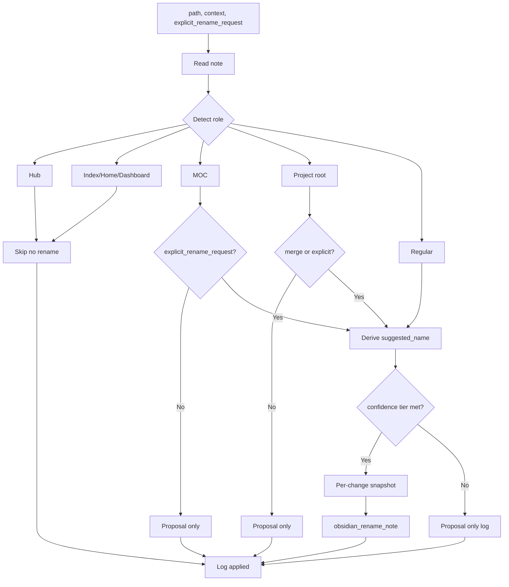

# Naming Conventions, Name-Enhance Skill, and Rename Re-Evaluation

## Current state

- **Naming**: [subfolder-organize](.cursor/skills/subfolder-organize/SKILL.md) builds paths as `{para-root}/…/{YYYY-MM-DD-title}.md`; [second-brain-standards](.cursor/rules/always/second-brain-standards.mdc) says "Daily/ingest date in filename if created today" and "searchable title". No single reference doc for all naming rules.
- **Rename**: Optional in [autonomous-organize](.cursor/rules/context/auto-organize.mdc) only ("rename for atomicity"); no step in **ingest** that derives a better name when the file is "Untitled" or vague.
- **MCP**: [obsidian_rename_note](.cursor/.../mcps/.../obsidian_rename_note.json) renames a **note (file)** in place; no folder-rename tool. MCP prompt expects "strict YYYY-MM-DD-kebab-title.md".
- **Protections**: Pipelines exclude `* Hub.md` and watcher paths; no explicit "do not rename MOCs/projects unless explicit request" rule.

---

## 1. Document naming conventions

**Where**: Add a dedicated **Naming-Conventions.md** under `3-Resources/Second-Brain/`. **Reference this file everywhere** naming is mentioned: [Parameters.md](3-Resources/Second-Brain/Parameters.md), [second-brain-standards](.cursor/rules/always/second-brain-standards.mdc), [Templates](3-Resources/Second-Brain/Templates.md), [Vault-Layout](3-Resources/Second-Brain/Vault-Layout.md), subfolder-organize skill, and name-enhance skill.

**Core format (regular notes)**: `kebab-slug-YYYY-MM-DD.md` — date + semantic slug = human-readable + searchable + sort-by-time.

**Date source priority** (add explicitly):

1. `created` frontmatter (if present and reliable)
2. File creation date (fs stat)
3. Ingest / today’s date (fallback)

**Slug rules** (add as bullets):

- Max ~60–70 chars (truncate smartly if needed)
- Lowercase, kebab-case (hyphens), no special chars except numbers/letters/hyphens
- Prefer first real heading > TL;DR sentence > first sentence summary
- Remove stop-words at start/end if they make slug worse (a, the, of, using, etc.)
- If slug would be too generic after cleaning (e.g. "note-on-x"), append short disambiguator from content (e.g. "note-on-x-2025-q1-review")

**Daily / same-day notes**: If multiple notes created/ingested today on same topic → `slug-2`, `slug-3`, etc., or better: derive from content to avoid numbers when possible.

**Display names**: One line in the doc: "Filename is primarily a stable identifier + retrieval cue. Frontmatter `title:` or `aliases:` can hold prettier / longer display names if desired."

**Other content**:

- **MOCs**: `Topic MOC.md` or `ProjectName MOC.md`; avoid renaming unless explicitly requested (see name-enhance skill).
- **Hubs**: `X Hub.md`; excluded from pipelines; do not rename via automation.
- **Project folder**: Name = project name; renaming a project folder is manual/merge-only; the skill only renames **notes**, not folders.
- **Attachments**: Preserve or suggest descriptive name on move to `5-Attachments/` (already hinted in ingest-processing "Bonus" callout).
- **Vague/untitled**: Candidates for name-enhance during ingest and name re-evaluation.

**Sync**: Ensure backbone-docs-sync applies when rules change; Naming-Conventions is the single source of truth for naming.

---

## 2. New skill: name-enhance (rename-with-guards)

**Path**: `.cursor/skills/name-enhance/SKILL.md`

**Purpose**: Propose or apply a better note **filename** (and optionally update frontmatter `title`) from content and context, with layered protections so MOCs and project-root notes are not auto-renamed unless there is explicit intent.

**Inputs** (from pipeline or caller):

- `path` (note path)
- `context`: `ingest` | `organize` | `name-review` (or queue mode)
- Optional: `explicit_rename_request` — **preferred**: caller passes a dict (e.g. `{ target: "Old MOC", new: "New MOC Name" }`) so the skill does not parse ingest content every time. Skill may also parse ingest notes for convenience (see below).

**Detection (role of the note)**:

- **MOC**: filename matches `* MOC.md` or similar; or frontmatter/link pattern (e.g. `moc-for`, linked as "X MOC").
- **Hub**: filename matches `* Hub.md` → do not rename (excluded).
- **Index / Home / Dashboard**: filename matches exactly or alias-linked as vault entry point (e.g. `Home.md`, `Index.md`, `Vault-Map.md`) → protect like a Hub (see protections table).
- **Project root**: note path is `1-Projects/<ProjectName>/<ProjectName>.md` or similar → treat as project root.
- **Regular**: everything else.

**Confidence tiers** (make explicit in SKILL.md):


| Confidence (Regular notes) | Action (Regular)                                 | Action (protected roles w/o explicit request) |
| -------------------------- | ------------------------------------------------ | --------------------------------------------- |
| ≥ 90%                      | Auto-apply (with snapshot)                       | Proposal only                                 |
| 85–89%                     | Apply in ingest/organize; propose in name-review | Proposal only                                 |
| 70–84%                     | Proposal + log (mid-priority fix candidate)      | Proposal only                                 |
| < 70%                      | No suggestion (too vague/uncertain)              | No suggestion                                 |


**Vague detection** (expand list for common Obsidian drops):

- Stems: `Untitled(-.*)?`, `Note`, `Document`, `New Note`, `New`, `Scratch`, `temp`, `test`, `clip`, `paste`, `idea`, `thought`, or empty stem or numeric-only.

**Explicit request parsing** (forgiving):

- **Caller**: Pass `explicit_rename_request` as optional dict → cleanest; skill uses it when present.
- **Ingest note content**: Look for patterns such as: "rename MOC … to …", "change project … name to …", "retitle … as …".
- **Ingest note frontmatter**: `rename_request: { target: "Old MOC", new: "New MOC Name" }` (structured).

**Output shape** (for UX and logging):

```json
{
  "suggested_name": "my-new-idea-about-x-2025-03-01.md",
  "applied": true,
  "confidence": 92,
  "protection_triggered": "moc-without-request",
  "reason": "MOC detected, no explicit rename request found",
  "old_stem": "Untitled 7"
}
```

Use `kebab-slug-YYYY-MM-DD.md` format per Naming-Conventions; `protection_triggered` is a string (e.g. `null`, `"moc-without-request"`, `"hub"`, `"index"`).

**Frontmatter sync (optional phase 2)**: After rename, if `title:` exists in frontmatter and differs significantly from new slug, either update `title:` to match slug (humanized) or add `old_title:` alias for search continuity. Document in skill as optional; implement after core flow is stable.

**Logic**:

1. Read note; get current filename (stem = `old_stem`), frontmatter `title`, first heading, TL;DR or first paragraph.
2. Detect role (Hub, Index/Home/Dashboard, MOC, Project root, Regular). If Hub or Index/Home/Dashboard → return output with `protection_triggered`, no apply. If MOC or project root and no `explicit_rename_request` (and not parsed from ingest) → proposal only.
3. Vague detection per expanded list above. In `name-review` context, optionally suggest for any note.
4. Derive **suggested name**: `kebab-slug-YYYY-MM-DD.md` per Naming-Conventions (date source priority, slug rules, same-day handling).
5. Apply per confidence tiers; for apply: **obsidian-snapshot** then `obsidian_rename_note`. In **ingest** context the skill never applies rename (propose only); subfolder-organize commits the name via move (see §3).
6. Log to Ingest-Log, Organize-Log, or Name-Review-Log (and Backup-Log if snapshot created).

**MCP**: `obsidian_read_note`, `obsidian_rename_note`; **skill**: `obsidian-snapshot` before rename when applying. No new MCP tool required.

**Backbone**: Add to Cursor-Skill-Pipelines-Reference skill table; add to Skills.md; sync to `.cursor/sync/skills/name-enhance.md`.

---

## 3. Ingest: enhance untitled/vague names

**Where**: [full-autonomous-ingest](3-Resources/Cursor-Skill-Pipelines-Reference.md) and [para-zettel-autopilot](.cursor/rules/context/para-zettel-autopilot.mdc).

**Chosen approach: Option A (propose only; move commits the name).**

- Fewer filesystem operations → fewer snapshots needed.
- Atomic move + rename in one step (dry_run safe).
- Simpler conflict handling.

**Document explicitly**: "In ingest, name-enhance proposes; subfolder-organize commits the name via move."

**When to run name-enhance**: After **frontmatter-enrich**, before **subfolder-organize**, when current filename (stem) is vague (per name-enhance vague list) or "Untitled N" / "Untitled Document N".

**Flow**:

1. **classify_para** → **frontmatter-enrich** (unchanged).
2. **name-enhance**(path, context: `ingest`) → returns `{ suggested_name, confidence, protection_triggered, old_stem, … }`. **Never applies rename in ingest** (proposal only).
3. **subfolder-organize**: When building `new_path`:
  - If `suggested_name` present and `confidence ≥ 85%` and `!protection_triggered` → use `suggested_name` for the path segment (format: `kebab-slug-YYYY-MM-DD.md`).
  - Else use current filename for the segment.
4. **move_note** to that path (snapshot + dry_run then commit as today). The file lands with the final name in one atomic move.

**Reference**: Add "name-enhance (ingest)" to the ingest flowchart in Cursor-Skill-Pipelines-Reference and to para-zettel-autopilot step list. Update subfolder-organize skill to accept optional `suggested_filename` from name-enhance and to use Naming-Conventions format for the path segment.

---

## 4. Re-evaluation loop for file names

**Goal**: As ideas evolve, re-evaluate whether a note’s filename is still optimal, without touching MOCs/projects unless explicitly requested. **Implement both Option A and Option B** — they serve different needs.

**Option A — NAME-REVIEW queue mode** (explicit, user-triggered sweeps):

- Use for: "Polish the last 3 months of atomic notes" or "Review names in 1-Projects/ActiveProject/". Scoped narrowly or broadly.
- Add queue mode **NAME-REVIEW**. Payload: optional `folder` or `paths` (list); optional `explicit_rename_request` dict. If scope absent, processor can use a default (e.g. from config or recent notes).
- **Processor** (in [auto-eat-queue](.cursor/rules/context/auto-eat-queue.mdc)): For each note in scope, run **name-enhance**(path, context: `name-review`, explicit_rename_request). Apply renames for **Regular** notes when confidence ≥85% (with snapshot). Log to **Name-Review-Log.md** or a dedicated section in **Organize-Log.md** with `pipeline: name-review`, `suggested_name`, `applied`, `protection_triggered`, `old_stem`.
- **Trigger examples**: "Queue name review for folder X", "RENAME MODE – safe batch on 1-Projects/MyProject".

**Option B — Opportunistic name-enhance during autonomous-organize** (low-effort wins):

- When a note is touched/moved anyway, opportunistically improve name if vague or confidence very high. Keeps the vault gradually cleaner without dedicated sessions.
- In **autonomous-organize**, after **subfolder-organize** and before optional **obsidian_rename_note**: run **name-enhance**(path, context: `organize`). If current name is already good, name-enhance returns "no change" or low confidence; otherwise suggest/apply per confidence tiers and protection rules. Reuse existing rename snapshot/organize flow.

**Parameters**: Add to [Parameters](3-Resources/Second-Brain/Parameters.md) queue modes list: **NAME-REVIEW** — optional scope: `folder` / `paths`; optional `explicit_rename_request` dict.

---

## 5. Layered protections summary


| Entity                       | Detection (heuristic)                                                                                | Auto-rename | Allowed when                         |
| ---------------------------- | ---------------------------------------------------------------------------------------------------- | ----------- | ------------------------------------ |
| **MOC**                      | `* MOC.md`, moc-for, link pattern                                                                    | No          | Explicit ingest note / queue payload |
| **Project root**             | Path like `1-Projects/X/X.md`                                                                        | No          | Merge or explicit request            |
| **Hub**                      | `* Hub.md`                                                                                           | No          | Never                                |
| **Index / Home / Dashboard** | Filename matches exactly or alias-linked as vault entry point (e.g. Home.md, Index.md, Vault-Map.md) | No          | Never (or explicit + confirmation)   |
| **Regular note**             | Else                                                                                                 | Yes (≥85%)  | —                                    |


**Explicit request** for MOC/project/index: Caller passes `explicit_rename_request` dict; or ingest note content (e.g. "rename MOC … to …", "change project … name to …", "retitle … as …") or frontmatter `rename_request: { target, new }`. Name-enhance uses it and only then allows apply for that target.

---

## 6. Implementation priority order

1. **Create Naming-Conventions.md** (do this first — reference it everywhere: Parameters, standards, templates, Vault-Layout, subfolder-organize, name-enhance).
2. **Build and test name-enhance skill in isolation** (read, detect role, propose name, confidence; no ingest/organize wiring yet).
3. **Integrate into ingest** (propose only → subfolder-organize uses suggested_name in move path).
4. **Add NAME-REVIEW queue mode** and basic batch processor (scope + explicit_rename_request; log to Name-Review-Log or Organize-Log).
5. **Add opportunistic name-enhance in organize pipeline** (context `organize`; apply per confidence tiers when note is already being moved/touched).
6. **Tune confidence heuristics** over a few weeks (log proposals vs actual usage).

**Biggest value**: Creating and linking Naming-Conventions.md as single source of truth; then ingest-time fixes (untitled drops); then NAME-REVIEW queue for periodic polish without risking structure.

---

## 7. Files to add or touch

- **New**: `3-Resources/Second-Brain/Naming-Conventions.md` (create first; reference from Parameters, second-brain-standards, Templates, Vault-Layout, subfolder-organize, name-enhance).
- **New**: `.cursor/skills/name-enhance/SKILL.md`
- **Update**: [second-brain-standards](.cursor/rules/always/second-brain-standards.mdc) — reference Naming-Conventions; note format `kebab-slug-YYYY-MM-DD`
- **Update**: [Parameters.md](3-Resources/Second-Brain/Parameters.md) — queue mode NAME-REVIEW (scope, explicit_rename_request); naming pointer to Naming-Conventions
- **Update**: [Templates.md](3-Resources/Second-Brain/Templates.md) and [Vault-Layout.md](3-Resources/Second-Brain/Vault-Layout.md) — one-line pointer to Naming-Conventions
- **Update**: [Cursor-Skill-Pipelines-Reference](3-Resources/Cursor-Skill-Pipelines-Reference.md) — ingest step name-enhance (propose only); NAME-REVIEW queue mode; skill table; snapshot trigger for rename when name-enhance applies
- **Update**: [Pipelines.md](3-Resources/Second-Brain/Pipelines.md) — name-enhance in ingest; NAME-REVIEW and organize rename step
- **Update**: [subfolder-organize](.cursor/skills/subfolder-organize/SKILL.md) — accept optional `suggested_filename` from name-enhance; path segment format `kebab-slug-YYYY-MM-DD.md` per Naming-Conventions
- **Update**: [para-zettel-autopilot](.cursor/rules/context/para-zettel-autopilot.mdc) — add name-enhance step after frontmatter-enrich (when vague/untitled); document "proposes only; subfolder-organize commits via move"
- **Update**: [auto-organize](.cursor/rules/context/auto-organize.mdc) — optional name-enhance (context `organize`) before rename_note
- **Update**: [auto-eat-queue](.cursor/rules/context/auto-eat-queue.mdc) — dispatch NAME-REVIEW to name-enhance batch
- **Update**: [mcp-obsidian-integration](.cursor/rules/always/mcp-obsidian-integration.mdc) — list name-enhance as using obsidian_rename_note + snapshot
- **Update**: [Skills.md](3-Resources/Second-Brain/Skills.md) and [.cursor/sync/skills/](.cursor/sync/) per backbone-docs-sync
- **Optional**: `3-Resources/Name-Review-Log.md` (or use Organize-Log section for NAME-REVIEW entries)

---

## 8. Out of scope (for clarity)

- **Folder rename**: Renaming a project **folder** (e.g. `1-Projects/OldName/` → `1-Projects/NewName/`) is not a single MCP call. Document as manual or merge-only; no change to MCP.
- **Bulk rename of many notes**: NAME-REVIEW processes a list of paths/folder; one name-enhance call per note with same protections.
- **Attachment file rename**: Optional future enhancement; current plan focuses on .md note filenames. Naming-Conventions can still describe attachment naming preferences.

---

## 9. Diagram (name-enhance flow)




This plan keeps naming improvements consistent with existing confidence loops, snapshot rules, and MCP safety (backup, dry_run for move). MOCs and project roots stay protected unless the user explicitly requests a rename via an ingest note or queue payload.