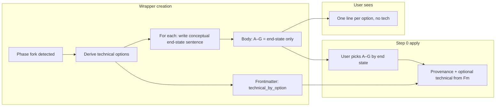

# Phase-direction: conceptual end-state options (technical in background)

## Goal

Phase-direction wrapper options A–G become **conceptual end-state** descriptions: one plain-language sentence per option describing *what the situation is* after that choice (e.g. “One shared grid everywhere — same behavior on every device and screen”). No technical terms (no “CSS Grid,” “breakpoints,” “design tokens”). Technical resolution (e.g. A = single token set, B = per-context tokens) is stored **only** in frontmatter (or an optional collapsible section) for provenance and Step 0 apply; it is not the primary text the user chooses from.

## Contract

- **User sees**: One line per option = conceptual end state (what the world is after that choice). Example style: [Templates/Decision-Wrapper-Phase-Direction.md](Templates/Decision-Wrapper-Phase-Direction.md) — replace current “label + tech” with a single end-state line per option.
- **Background**: Technical mapping (option letter → technical resolution) lives in frontmatter (e.g. `technical_by_option: { "A": "...", "B": "..." }`) or in one optional collapsible “Technical resolution (for reference)” section so apply/provenance can still record the chosen technical path.
- **Step 0 apply**: Unchanged. Still uses `approved_option` (A–G); no change to path-apply or provenance logic. Optional later: provenance callout could append a one-liner from `technical_by_option[approved_option]` if present.

---

## 1. Template: outcome-only options + technical in frontmatter/optional block

**File**: [Templates/Decision-Wrapper-Phase-Direction.md](Templates/Decision-Wrapper-Phase-Direction.md)

- **Options A–G (body)**  
  - Show **one line per option** only: the conceptual end-state text (e.g. `**A.** {{option_a}}` with `option_a` = “One shared grid everywhere — same behavior on every device and screen”).  
  - **Remove** the second line that currently shows `{{option_a_tech}}` from the main list so the user never sees tech as the primary choice.
- **Placeholders**: Rename or repurpose so body uses a single placeholder per option (e.g. `option_a` … `option_g`) for the **conceptual end-state** sentence. Template comment or tip can state: “Each option is one conceptual end-state sentence; no technical jargon.”
- **Technical storage**:  
  - **Option A**: Add frontmatter field `technical_by_option` (object: keys A–G, values = short technical summary string) and document that creators must populate it for provenance.  
  - **Option B**: Or keep `option_a_tech` … `option_g_tech` in **frontmatter only** (not in body), and document that the agent must write them there when creating the wrapper.  
  - Prefer one of these so Step 0 (or future tooling) can read technical resolution from the wrapper without parsing the body.
- **Optional**: One collapsible section at the bottom, e.g. `> [!example]- Technical resolution (for reference)\n> A: … ; B: … ; …` so power users can expand it; default view remains outcome-only.
- **Copy**: Update the “Options” heading/subtitle from “(tech implications + your conceptual slot in Thoughts)” to “(conceptual end states — what the situation is after each choice; technical resolution is stored for provenance only).”

---

## 2. Wrapper creation: conceptual end-state text + technical in frontmatter

**Where creation is triggered**

- **Prompt queue (EAT-QUEUE)**: [.cursor/rules/context/auto-eat-queue.mdc](.cursor/rules/context/auto-eat-queue.mdc) dispatches `EXPAND-ROAD`; the agent runs expand-road-assist and may create the wrapper (e.g. when phase_forks or direction choices exist).
- **Task queue**: [.cursor/rules/context/auto-queue-processor.mdc](.cursor/rules/context/auto-queue-processor.mdc) § EXPAND-ROAD: “create a Phase Direction Wrapper … fill phase_path, direction_question, options A–G from phase content”.

**Required behavior when creating a phase-direction wrapper**

- **Derive** technical alternatives for the phase fork (as today).
- **For each option (A–G)**:
  - Write **one conceptual end-state sentence**: what the situation is after that choice; no tech terms (see user’s grid example: “One shared grid everywhere — same behavior on every device and screen,” “Each surface tuned to itself — mobile, desktop, and large displays each get a layout that fits,” etc.).
  - Store the **technical resolution** for that letter in frontmatter (e.g. `technical_by_option.A` or `option_a_tech` in frontmatter).
- **Body**: Fill only the single line per option (the conceptual end-state). Do not put technical text in the main option list.
- **Pad to 7**: If fewer than 7 meaningful options, pad with further conceptual end-state lines (or “Reserved” / “—”) and leave technical mapping empty or “—”; keep exactly A–G for consistent UX.

**Where to document**

- [.cursor/skills/expand-road-assist/SKILL.md](.cursor/skills/expand-road-assist/SKILL.md): In the post-step (phase fork detection / Phase Direction Wrapper creation), add explicit instructions: when creating the wrapper, fill A–G with **conceptual end-state** descriptions only (one sentence each, no tech terms); store technical resolution in frontmatter (`technical_by_option` or per-option tech fields) for provenance; link to Templates/Decision-Wrapper-Phase-Direction.md and, if present, a short “Phase-direction wrapper creation” reference (see below).
- [.cursor/rules/context/auto-queue-processor.mdc](.cursor/rules/context/auto-queue-processor.mdc): In the EXPAND-ROAD bullet, replace “fill … options A–G from phase content” with “fill … options A–G with **conceptual end-state** descriptions (one sentence per option, no tech terms); store technical resolution in wrapper frontmatter for provenance.”
- **Single reference (recommended)**: Add a short “Phase-direction wrapper creation” subsection under [3-Resources/Second-Brain/Cursor-Skill-Pipelines-Reference.md](3-Resources/Second-Brain/Cursor-Skill-Pipelines-Reference.md) (or [3-Resources/Second-Brain/Templates.md](3-Resources/Second-Brain/Templates.md)) that defines: (1) options A–G = conceptual end-state only, (2) technical in frontmatter, (3) user’s grid example as the canonical style. Then link to it from expand-road-assist and auto-queue-processor.

---

## 3. Apply-from-wrapper and Step 0

- **No change** to Step 0 logic: still branch on `wrapper_type: phase-direction`, resolve `approved_option` (A–G), run per-change snapshot → append provenance (and comment guidance) → set processed/used_at → move wrapper to `4-Archives/Ingest-Decisions/Roadmap-Decisions/`.
- **Optional enhancement**: If wrapper frontmatter has `technical_by_option` (or per-option tech), the provenance callout could append a one-line “Technical: …” from the chosen letter; document in [3-Resources/Second-Brain/Cursor-Skill-Pipelines-Reference.md](3-Resources/Second-Brain/Cursor-Skill-Pipelines-Reference.md) § Apply-from-wrapper if implemented.

---

## 4. Documentation and user-flow wording

Replace every mention that phase-direction presents “tech options” or “technical implications” with **conceptual end-state options** (technical resolved in background). Add the grid example as the canonical reference where helpful.

**Files to update**

- [3-Resources/Second-Brain/Second-Brain-User-Flows/User-Flow-Diagram-Detailed.md](3-Resources/Second-Brain/Second-Brain-User-Flows/User-Flow-Diagram-Detailed.md): Change “User is presented with: A–G **tech options** + option R” to “User is presented with: A–G **conceptual end-state options** (what the situation is after each choice) + option R; technical resolution in background.”
- [3-Resources/Second-Brain/Second-Brain-User-Flows/User-Flow-Rules-Detailed.md](3-Resources/Second-Brain/Second-Brain-User-Flows/User-Flow-Rules-Detailed.md): “Phase-direction wrapper with A–G (tech implications)” → “Phase-direction wrapper with A–G (conceptual end-state options; technical in frontmatter for provenance).”
- [3-Resources/Second-Brain/Parameters.md](3-Resources/Second-Brain/Parameters.md): In `wrapper_type` / phase-direction, state that options are conceptual end-state descriptions and technical is stored in frontmatter.
- [3-Resources/Second-Brain/Skills.md](3-Resources/Second-Brain/Skills.md): expand-road-assist line: “Phase Direction Wrapper” creation → specify “options A–G = conceptual end-state only; technical in frontmatter.”
- [3-Resources/Second-Brain/Cursor-Skill-Pipelines-Reference.md](3-Resources/Second-Brain/Cursor-Skill-Pipelines-Reference.md): In the apply-from-wrapper table, add a one-line note for phase-direction: “Options A–G are conceptual end-state descriptions; technical resolution stored in frontmatter (e.g. technical_by_option) for provenance.”
- [3-Resources/Second-Brain/Backbone.md](3-Resources/Second-Brain/Backbone.md): If it currently says phase-direction presents technical choices, switch to “conceptual end-state options (technical in background).”
- Any other references in [3-Resources/Second-Brain/Second-Brain-User-Flows/](3-Resources/Second-Brain/Second-Brain-User-Flows/) (Mid-Level, High-Level, Rules-Structure) that describe phase-direction options as “tech” or “technical”: same wording update.

---

## 5. Sync and backbone-docs

- **.cursor/sync/**: If [.cursor/rules/context/auto-queue-processor.mdc](.cursor/rules/context/auto-queue-processor.mdc) or [.cursor/skills/expand-road-assist/SKILL.md](.cursor/skills/expand-road-assist/SKILL.md) are mirrored under `.cursor/sync/`, update those copies per backbone-docs-sync.
- **Changelog**: Append an entry to [.cursor/sync/changelog.md](.cursor/sync/changelog.md) for phase-direction conceptual end-state change (template, creation contract, docs).

---

## Summary diagram

---

## Order of work

1. **Template**: Update [Templates/Decision-Wrapper-Phase-Direction.md](Templates/Decision-Wrapper-Phase-Direction.md) (single line per option; technical in frontmatter or optional block; copy change).
2. **Creation contract**: Add “Phase-direction wrapper creation” reference (Cursor-Skill-Pipelines-Reference or Templates.md) with grid example; update expand-road-assist SKILL and auto-queue-processor EXPAND-ROAD bullet.
3. **Apply-from-wrapper note**: Add one-line phase-direction note in Cursor-Skill-Pipelines-Reference.
4. **Docs and user flows**: Replace “tech options” / “tech implications” with “conceptual end-state options” and “technical in background” in the listed docs.
5. **Sync + changelog**: Update .cursor/sync and changelog per backbone-docs-sync.
