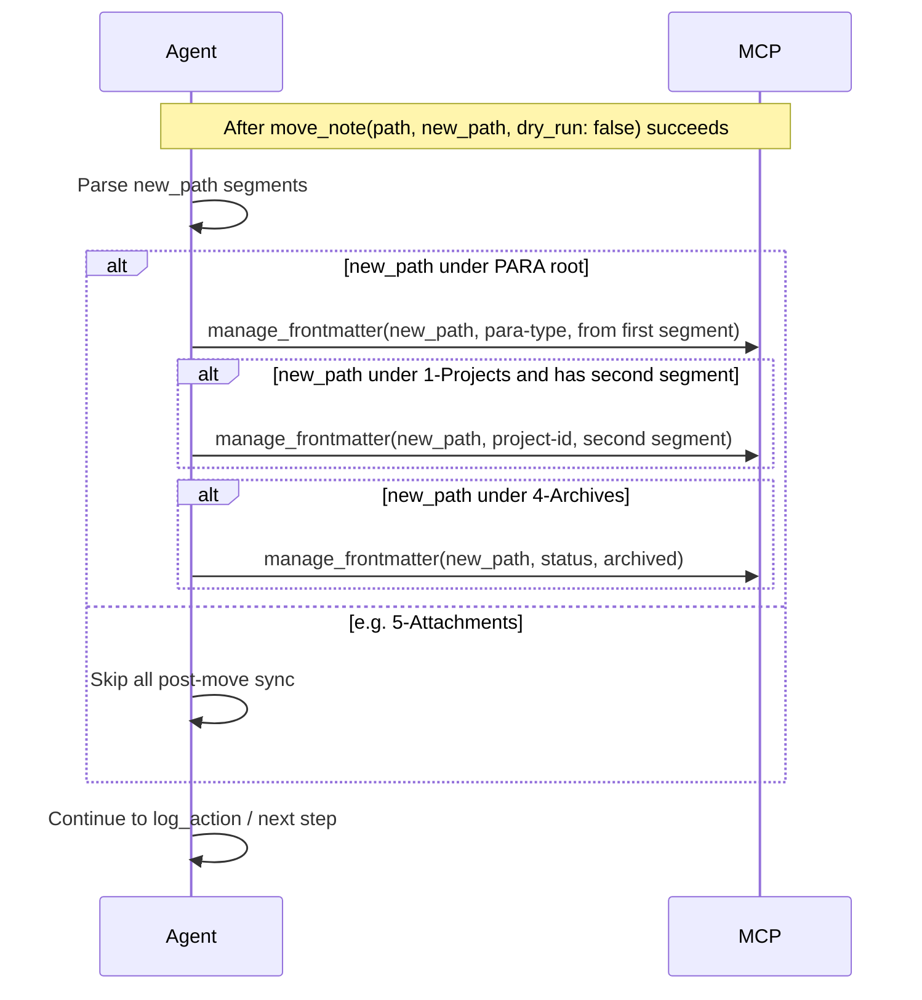
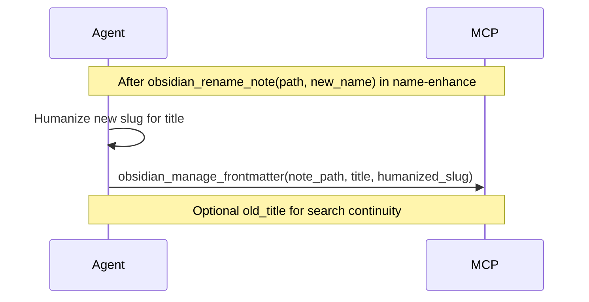

# Post-move / post-rename consistency sync

## Goal

Close path/frontmatter consistency gaps so that when we **move** or **rename** a note, all dependent frontmatter is updated from the new path or filename. Today several fields are set only before the action or left "optional" and never implemented.

**Gaps in scope:**

1. **Para-type after move** — Move happens but para-type is not set from the new path (ingest apply-mode, organize, archive).
2. **project-id after move** — When destination is under 1-Projects/, project-id is not set from the second path segment.
3. **status when archiving** — Move to 4-Archives/ does not set status to archived.
4. **Title after rename** — name-enhance documents "update title to match slug after rename" as optional and it was never implemented.

## Part 1 — Para-type (and project-id, status) after move

### Approach

- **Single contract in the always rule**: After every successful `obsidian_move_note` (commit with `dry_run: false`), the agent must:
  1. Set **para-type** on the note at **new_path** from the first path segment (mapping below).
  2. When **new_path** is under **1-Projects/** and has a second segment (project folder name): set **project-id** to that segment (slugified, same convention as elsewhere). Skip if path has no second segment or destination is not 1-Projects.
  3. When **new_path** is under **4-Archives/**: set **status** to **archived** (or the vault’s chosen value for archived notes). Ensures archived notes are explicitly marked; archive-check already requires complete-like status to recommend move.
- **No new skill**: Keep the logic in the rule and pipeline reference; one or two extra `obsidian_manage_frontmatter` calls in the same post-move block.
- **Scope**: Para-type and project-id apply only when the destination is under a PARA root (1-Projects, 2-Areas, 3-Resources, 4-Archives). Status: only when under 4-Archives. Moves to e.g. 5-Attachments: skip all three.

### Mapping (first segment of new_path → para-type value)

| First path segment | para-type value |
| ------------------ | --------------- |
| 1-Projects         | Project         |
| 2-Areas            | Area            |
| 3-Resources        | Resource        |
| 4-Archives         | Archive         |

Use the exact casing above (Project, Area, Resource, Archive) for Dataview/query consistency. If the path is not under one of these four roots, skip the para-type update.

## Files to change

### 1. [.cursor/rules/always/mcp-obsidian-integration.mdc](.cursor/rules/always/mcp-obsidian-integration.mdc)

- **Snapshot chaining / move section** (around the "Dry-run before every move" bullet): Add a bullet **"Post-move frontmatter sync"**: After every successful `obsidian_move_note`(..., `dry_run: false`): (1) If new_path is under a PARA root (1-Projects, 2-Areas, 3-Resources, 4-Archives), set **para-type** on the note at new_path from the first segment (1-Projects→Project, 2-Areas→Area, 3-Resources→Resource, 4-Archives→Archive) via `obsidian_manage_frontmatter`. (2) If new_path is under **1-Projects/** and has a second path segment (project folder), set **project-id** to that segment (slugified). (3) If new_path is under **4-Archives/**, set **status** to **archived**. If destination is not under a PARA root (e.g. 5-Attachments), skip all.
- **Required flow for every move** (line 113): Extend to include the post-move sync. New:  
`Backup → ... → obsidian_move_note(..., dry_run: false) → **then** set para-type (and when under 1-Projects/ project-id, when under 4-Archives/ status: archived) on the note at new_path (see "Post-move frontmatter sync" above).`

### 2. [3-Resources/Second-Brain/Cursor-Skill-Pipelines-Reference.md](3-Resources/Second-Brain/Cursor-Skill-Pipelines-Reference.md)

- **Conventions** (path before every move paragraph): Add one sentence: "After every successful move (dry_run: false), set **para-type** on the note at the new path from the first path segment (1-Projects→Project, 2-Areas→Area, 3-Resources→Resource, 4-Archives→Archive); when under 1-Projects/ set **project-id** from the second segment; when under 4-Archives/ set **status: archived**. Use obsidian_manage_frontmatter; see mcp-obsidian-integration."
- **Pipeline order / move step** for each pipeline that performs moves:
  - **full-autonomous-ingest** (Phase 2 apply-mode): In the apply-mode bullet list where move_note is mentioned, add "After move: set para-type (and when under 1-Projects/ project-id) from new path per mcp-obsidian-integration."
  - **autonomous-archive**: In the pipeline order line that ends with move_note → log_action, add "After move: set para-type from new path, **status: archived** when under 4-Archives/, then log_action."
  - **autonomous-organize**: After move_note add "then set para-type (and when under 1-Projects/ project-id) from new path, then log_action."

No need to repeat the full mapping in the reference; a short pointer to the always rule is enough. Mention project-id (second segment when under 1-Projects/) and status: archived (when under 4-Archives/) in the same Conventions sentence or in the pipeline bullets.

### 3. Context rules (brief reminder only)

- [.cursor/rules/context/para-zettel-autopilot.mdc](.cursor/rules/context/para-zettel-autopilot.mdc): In the apply-mode ingest block (after the bullet about obsidian_move_note and obsidian_rename_note), add one line: "After successful move: set para-type (and when under 1-Projects/ project-id) on the note at hard_target_path from the destination path per mcp-obsidian-integration."
- [.cursor/rules/context/auto-organize.mdc](.cursor/rules/context/auto-organize.mdc): In the "Move" step (step 6), add: "After successful move: set para-type from new path per mcp-obsidian-integration."
- [.cursor/rules/context/auto-archive.mdc](.cursor/rules/context/auto-archive.mdc): In the "Move note" step (step 7), add: "After successful move: set para-type to Archive and **status: archived** on the note at new path per mcp-obsidian-integration."

### 4. Backbone docs and sync

- [3-Resources/Second-Brain/Pipelines.md](3-Resources/Second-Brain/Pipelines.md): In the one-line pipeline descriptions for full-autonomous-ingest (Phase 2), autonomous-archive, and autonomous-organize, add a brief note that post-move para-type sync applies (or reference the reference doc).
- [3-Resources/Second-Brain/MCP-Tools.md](3-Resources/Second-Brain/MCP-Tools.md) (optional): In the PARA/organize or move section, add that after move_note the agent must set para-type from the new path.
- [.cursor/sync/](.cursor/sync/): Update the sync copy of mcp-obsidian-integration (and optionally the three context rules) so `.cursor/sync/rules/` stays in sync; add a one-line entry to [.cursor/sync/changelog.md](.cursor/sync/changelog.md).

### 5. backbone-docs-sync rule

Per [.cursor/rules/always/backbone-docs-sync.mdc](.cursor/rules/always/backbone-docs-sync.mdc), ensure [3-Resources/Second-Brain/Rules.md](3-Resources/Second-Brain/Rules.md) or the relevant doc mentions the post-move para-type (and project-id, status) requirement if the MCP rule is summarized there.

---

## Part 2 — Title after rename

### Goal

When we **rename** a note with `obsidian_rename_note`, the filename changes but frontmatter **title** is not updated. [name-enhance](.cursor/skills/name-enhance/SKILL.md) documents this as "Frontmatter sync (optional phase 2)" and defers it. Make the sync mandatory so title and filename stay consistent.

### Approach

- **In name-enhance skill**: After every successful `obsidian_rename_note` (when the skill applies the rename in organize or name-review context), immediately call `obsidian_manage_frontmatter` on the **same path** (the note was renamed in place, so path may be same; if the MCP renames and returns new path, use that). If current frontmatter `title` differs significantly from the new slug (humanized), set `title` to the humanized slug. Optionally preserve the old value in `old_title` for search continuity if desired; minimum is to set `title` to match the new name.
- **Same run**: No separate pipeline step; the skill that performs the rename also performs the title sync in the same flow (read note after rename to get current path if needed, then manage_frontmatter).

### Files to change (title after rename)

- [.cursor/skills/name-enhance/SKILL.md](.cursor/skills/name-enhance/SKILL.md): Replace the "Frontmatter sync (optional phase 2)" section with a **required** step: "After rename: sync frontmatter title. If `title` exists and differs significantly from the new slug, set `title` to the humanized version of the new slug via `obsidian_manage_frontmatter`; optionally set `old_title` to the previous title for search continuity." Remove "optional; implement after core flow is stable." Add to the Apply step (step 5): after `obsidian_rename_note`, read the note (or use returned new path if any), then call `obsidian_manage_frontmatter` to set `title` (and optionally `old_title`).
- [.cursor/sync/skills/name-enhance.md](.cursor/sync/skills/name-enhance.md): Mirror the same change.
- [3-Resources/Second-Brain/Cursor-Skill-Pipelines-Reference.md](3-Resources/Second-Brain/Cursor-Skill-Pipelines-Reference.md): In the name-enhance row or autonomous-organize section, add that after rename the skill syncs frontmatter `title` from the new slug.
- [3-Resources/Second-Brain/Skills.md](3-Resources/Second-Brain/Skills.md): In the name-enhance row, note that apply includes title sync after rename.

### Edge cases (title)

- **No title in frontmatter**: If the note has no `title` key, optionally set it to the humanized slug so future renames have a clear sync target; not strictly required for "consistency" but improves predictability.
- **Protected notes (MOC, hub, project root)**: When name-enhance applies a rename with explicit_rename_request, same title sync applies after the rename.

---

## Flow (mermaid)

**Post-move (para-type, project-id, status):**

**Post-rename (title):**

## Edge cases

- **Move to 5-Attachments** (non-md ingest): Destination is not a PARA root; skip para-type, project-id, and status updates. Companion .md may already have been created with its own classification.
- **Re-wrap / wrapper move**: When the wrapper is moved to 4-Archives/Ingest-Decisions/, the wrapper note gets para-type: Archive and status: archived; consistent with the rule.
- **Case and spelling**: Use the exact values "Project", "Area", "Resource", "Archive" (capital P/A/R/A) and the same project-id slug convention as elsewhere (e.g. kebab-case). For status use **archived** unless the vault standard is different (document in Second-Brain-Config or Parameters if needed).
- **project-id when path has no second segment**: If new_path is exactly `1-Projects/note.md` (no project subfolder), skip project-id update or leave unchanged.
- **Title after rename**: If the note has no `title` in frontmatter, setting it to the humanized slug is optional but recommended for consistency on the next rename.

## Verification

- **Move**: A run that moves a note (ingest apply-mode, organize, or archive) should show in the pipeline log that para-type (and when applicable project-id, status: archived) was set from the new path. Spot-check one move per pipeline.
- **Rename**: A run that renames a note via name-enhance (organize or NAME-REVIEW) should result in frontmatter `title` matching the new slug (or old_title preserved where chosen). Spot-check one rename in each context.

