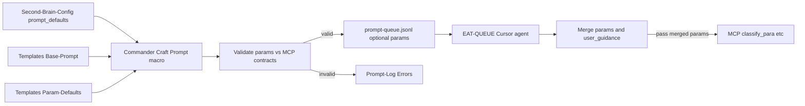

# Prompt-crafter (laptop-only)

## Scope

- **In scope**: Second-Brain-Config `prompt_defaults` (per-pipeline + overrides), Templates/Prompt-Components (Templater, validation snippet, modular files), queue `params` and fallback chain, Commander Craft Prompt / Craft and Queue macros, EAT-QUEUE params pass-through and guidance-aware merge, validation vs MCP contracts, Prompt-Log, test fixtures, backbone docs sync.
- **Out of scope**: Mobile toolbar, Mobile-Pending-Actions, device-specific visibility, Async Approve / mobile-only macros, any "mobile add then laptop" flows, mobile exports or phone-friendly views.

**Pre-check**: If the MCP server param contracts have changed recently, sync [3-Resources/Second-Brain/MCP-Tools.md](3-Resources/Second-Brain/MCP-Tools.md) first (e.g. `obsidian_propose_para_paths`: `context_mode`, `rationale_style`, `max_candidates`). **If MCP contracts change** (e.g. new param like `min_score_threshold` in x_semantic_search per MCP-Tools.md), add to prompt_defaults validation set. **Run health_check** (per [3-Resources/Second-Brain/Logs.md](3-Resources/Second-Brain/Logs.md) § Health check flow) post-sync to verify. Extensibility: future-proofs for tool evolution without manual hunts.

---

## 1. Config: prompt_defaults block (YAML, per-pipeline, profiles)

**File**: [3-Resources/Second-Brain-Config.md](3-Resources/Second-Brain-Config.md)

- Add a **prompt_defaults** block (YAML with inline comments). Per [3-Resources/Second-Brain/Configs.md](3-Resources/Second-Brain/Configs.md), consumer extension—skills/rules read config for defaults; queue payload overrides take precedence.
- **YAML polish** — top-level **profiles** for named overrides, e.g.:
  - `ingest`: `context_mode: strict-para`, `max_candidates: 7`, `rationale_style: concise` (per MCP-Tools.md optional).
  - `organize`: `context_mode: organize`, `max_candidates: 5`.
  - **profiles**: `project-priority`: `context_mode: project-strict`, `max_candidates: 5`.
- **Docs**: "Profiles selectable via Commander macro; fallback to pipeline default." Completeness: click options without tags.
- **Safety note** (Config or Configs.md): "Non-destructive defaults only—params influence proposals but require **approved: true** for any move/rename per [3-Resources/Second-Brain/Pipelines.md](3-Resources/Second-Brain/Pipelines.md) § Phase 2]. No auto-approval injection."
- **Parameters.md**: prompt_defaults read by prompt-crafter and rules for MCP pass-through; queue payload overrides take precedence.
- **Generalization**: If overfits to ingest, generalize to **mcp_defaults** keyed by tool/pipeline; start with ingest/organize.

---

## 2. Templates: prompt-components (laptop-only, Templater, validation)

**Location**: `Templates/Prompt-Components/` (new folder and files).

- **Base-Prompt.md**: Canonical trigger only (fixed list from Pipelines.md). Add **Assembly-Order** comment: "# Order: Config defaults → Param-Overrides → Guidance-Default → Validation-Snippet." Per Templates.md backbone; easier multi-template chains.
- **Param-Defaults.md** (Templater-enabled): Placeholders from Config (e.g. `{{prompt_defaults.ingest.context_mode}}`). Optional dynamic: `{{tp.file.content | yaml_load | get('prompt_defaults.ingest.context_mode')}}` if Templater hooked (docs imply optional integration). **Validation-Template** snippet: "Validate against: max_candidates ≤10 (MCP limit per MCP-Tools.md)."
- **Modular components**: **Param-Overrides.md** (user-selectable; references Config profiles); **Guidance-Default.md** (fixed guidance-aware string). Crafter assembles via concat or read_note chain.
- **Error-Handling-Template.md** snippet: "If invalid: Log to Errors.md with trace per mcp-obsidian-integration.mdc." Ties validation failures to system protocol.
- **Custom-Param slot**: Optional for rare MCP args. Unhandled params → Log to Errors.md per Error Handling Protocol.
- **Optional — Skill-Chain.md**: Skills valid for pipeline per Cursor-Skill-Pipelines-Reference; keep optional.
- **Templates.md**: Document "Prompt-Components (laptop)" with flow and assembly order. No mobile-specific components.

---

## 3. Queue format: params, payload contract, fallback chain

**File**: [3-Resources/Second-Brain/Queue-Sources.md](3-Resources/Second-Brain/Queue-Sources.md)

- **Payload contract**: Optional `params` in queue entry. Crafter injects from Config if absent. EAT-QUEUE validates against MCP-Tools.md before dispatch—log mismatches to Errors.md.
- **Fallback chain** (explicit precedence in Queue-Sources.md): **1.** Queue entry params **2.** user_guidance frontmatter (merge) **3.** Config prompt_defaults/profiles **4.** MCP tool defaults (e.g. max_candidates: 3 per MCP-Tools.md).
- **Contract validation**: "EAT-QUEUE **rejects** invalid params pre-dispatch (e.g. rationale_style not in ['concise','detailed','bullet','technical'] per MCP-Tools.md); append to Errors.md."
- Add one example line with `params` alongside `mode`, `source_file`, `id`, `prompt`.
- **Extensibility (future)**: Document optional array params for multi-MCP; no implementation required in this plan.

**File**: [.cursor/rules/context/auto-eat-queue.mdc](.cursor/rules/context/auto-eat-queue.mdc)

- **Dispatch (step 5)**: When an entry has `params`, merge per fallback chain (queue → user_guidance merge → Config → MCP defaults), validate against MCP-Tools.md, then pass to MCP-invoking steps. Reject invalid; log to Errors.md.

---

## 4. Commander: Craft Prompt macro (laptop-only, UI, Craft and Queue)

**File**: [3-Resources/Plugins-Usage/Commander-Plugin-Usage.md](3-Resources/Plugins-Usage/Commander-Plugin-Usage.md)

- **"Craft Prompt" / "Prompt Craft"** macro subsection (laptop-only), per [3-Resources/Second-Brain/Rules](3-Resources/Second-Brain/Rules) § Commander:
  - **Param selection UI**: "Pipeline: ingest | organize? Profile: default | project-priority?" Assemble and paste or append. Set **commander_macro** for logging (e.g. `craft_prompt_ingest`).
  - **Preview Assembly** (sub-option): Paste crafted prompt to a temp note before queue append; log via **commander_macro: "craft_prompt_preview"**. Extensibility: debug-friendly for param tweaks.
  - **Craft and Queue**: Appends to `.technical/prompt-queue.jsonl` with **validated** params; **if invalid, aborts and logs to Prompt-Log.md.** EAT-QUEUE then passes params to MCP; guidance-aware when note has user_guidance or queue has prompt.
  - **Validation (optional)**: Before paste/append, lightweight check and preview callout "> [!preview] Crafted params: ... Expected paths: A–G sample." Document as optional for minimal first implementation.
  - **Sub-macros**: "Craft Ingest Default" vs "Craft Organize Custom" for batch or one-shot; document chainability.
- Document how to configure in Commander (commands to chain, template or clipboard); no JS in this plan. If script/Templater builds the string, document path and usage.

---

## 5. EAT-QUEUE / agent: params to MCP, guidance-aware merge, confidence, safety

- **Guidance-aware default**: Assembled prompt always includes short guidance-aware reminder; reference guidance-aware.mdc.
- **Merge logic** (per guidance-aware.mdc): "Merge: Append user_guidance text to rationale_style if compatible (e.g. 'concise + explain rankings'). Log **full merged params** to Prompt-Log.md for audit." Do not override user_guidance; inject defaults only where missing.
- **Confidence bump**: Optional: "If crafted params used, add **+5%** to pre_loop_conf floor" in [.cursor/rules/always/confidence-loops.mdc](.cursor/rules/always/confidence-loops.mdc) (tunable via Parameters.md). Rationale: Stricter params imply higher baseline stability.
- **Safety**: Always **ensure_backup** (or create_backup) before param'd MCP calls. Note in Pipelines.md if not already explicit.

---

## 6. Validation: test fixtures, Prompt-Log, param-validate skill

**Testing.md** (§ Fixtures): Add **prompt-crafter** subdir with samples—e.g. `config.yaml` snippet + `base-prompt.md` = `expected-queue.jsonl`. Assert no param leaks (invalid keys rejected). **Integration test**: Mock MCP propose_para_paths return; assert stabilized A–G paths match expected (pad to 7 per Pipelines.md). Reference tests/fixtures and sb_contracts.

**Prompt-Log** (e.g. `3-Resources/Prompt-Log.md`): **Structure**: timestamp, pipeline/mode, params (as used), source (macro/default), outcome (valid | invalid), merge trace (when guidance-aware merge applied). Append per craft/EAT-QUEUE. **Logs.md** row: "Prompt-Log.md | Crafted/merged params, validation outcome, merge trace | Append per craft/EAT-QUEUE; Dataview aggregate in Vault-Change-Monitor MOC for 'crafted runs this week'."

**Extensibility**: Optional **param-validate** skill (Skills.md)—slots **before** classify_para for runtime checks; validates queue/Config params against MCP-Tools.md. Implementation as follow-up.

---

## 7. Backbone docs sync

Per [.cursor/rules/always/backbone-docs-sync.mdc](.cursor/rules/always/backbone-docs-sync.mdc):

- **[3-Resources/Second-Brain/Backbone.md](3-Resources/Second-Brain/Backbone.md) § Stack**: "**Prompt-Crafter**: Laptop layer for MCP param assembly from config/templates; stabilizes ingest/organize via defaults and validation."
- **[3-Resources/Second-Brain/Rules.md](3-Resources/Second-Brain/Rules.md) § Always-applied**: If guidance-aware rule updated for merge, note: "Now merges crafted params with user_guidance."
- **[3-Resources/Second-Brain/Skills.md](3-Resources/Second-Brain/Skills.md)**: New row: "prompt-crafter | Assemble/validate params | Used in ingest/organize pipelines; **slots before classify_para**."
- **Responsibilities-Breakdown.md**: prompt-crafter | Assemble/inject params | Config read, template concat, queue append; owns validation but delegates MCP calls.
- **MCP-Tools.md**: In obsidian_propose_para_paths contract, confirm "Optional param rationale_style; defaults to concise."
- **Configs.md**: Add prompt_defaults to consumer table; safety note (non-destructive, no auto-approval).
- **Parameters.md, Templates.md, Queue-Sources, Logs.md, Commander-Plugin-Usage**: As in sections 1–4 and 6.

---

## Summary flow (laptop, with validation)

No mobile nodes; no Mobile-Pending-Actions, no device-specific visibility, no mobile-only macros in scope.

---

## Test-first note

Test with a dummy ingest: craft params (e.g. ingest + default profile), run EAT-QUEUE, check Ingest-Log for stabilized paths and that params were applied. If MCP server param contracts have changed, sync MCP-Tools.md first.