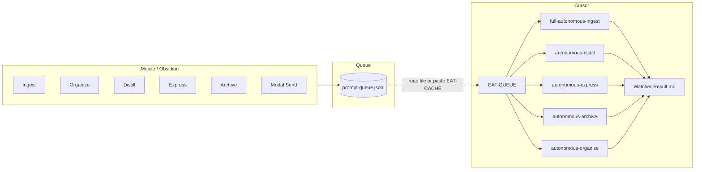

# Funnel mobile triggers through Queue and single EAT-QUEUE prompt

## Current state

- **Queue** (`[3-Resources/prompt-queue.jsonl](3-Resources/prompt-queue.jsonl)`): Only modal Send (Distill/Express/Archive) and one-tap **Distill** append to it. One-tap **Ingest**, **Organize**, **Archive**, and **Express** write only to `[Watcher-Signal.md](3-Resources/Watcher-Signal.md)` and then attempt the Cursor bridge (URI + clipboard + Watcher-Request.md).
- **Cursor bridge**: Each trigger tries to open Cursor with the prompt and starts 15‑minute completion polling. Since you are “gated behind” running Cursor manually anyway, this adds complexity without a single, predictable entry point.
- **EAT-CACHE**: Reads queue, formats YAML, copies to clipboard; user pastes in Cursor. Payload uses `mode: EAT-CACHE` and lists `queued_prompts` with per-entry `mode`/`prompt`/`source_file`.

## Target state

1. **All mobile triggers → Queue only**
  Every mobile action (Ingest, Distill, Express, Archive, Organize, and future TASK-ROADMAP / Task Complete / Add Roadmap Item) **only** appends to `prompt-queue.jsonl` with a stable schema. No writes to Watcher-Signal for these triggers; no Cursor bridge or completion polling for one-taps.
2. **Queue as single source of truth**
  One file, one append path, clear semantics. Focus on: atomic read‑modify‑write, retries, dedup, and optional archive-on-clear so the queue is reliable and easy to reason about.
3. **Single Cursor prompt: EAT-QUEUE**
  User runs Cursor and says **“EAT-QUEUE”**. The agent:
  - Reads `[3-Resources/prompt-queue.jsonl](3-Resources/prompt-queue.jsonl)` (workspace file),
  - For each entry, dispatches to the correct pipeline by `mode` (INGEST MODE, DISTILL MODE, EXPRESS MODE, ARCHIVE MODE, ORGANIZE MODE, etc.),
  - Appends one line per processed request to `[3-Resources/Watcher-Result.md](3-Resources/Watcher-Result.md)`,
  - Clears (or archives then clears) the queue when done.
   No need to remember or paste mode-specific prompts; EAT-QUEUE is the only entry point from mobile/queue.

---

## 1. Watcher plugin: funnel all triggers into the queue

**File:** `[.obsidian/plugins/watcher/main.js](.obsidian/plugins/watcher/main.js)`

- **Ingest** (`trigger-ingest`):  
  - Append to queue with `mode: "INGEST MODE"`, `prompt: "INGEST MODE – process captures"`, `source_file: ""`.  
  - Remove `writeSignal` and all `attemptCursorBridge` / `startCompletionWait` logic for this command.  
  - Show: `Added to queue (requestId: …). Pending: N`.
- **Organize** (`trigger-organize`):  
  - Same pattern: append to queue with `mode: "ORGANIZE MODE"`, prompt, optional active file as `source_file`.  
  - Remove signal + bridge + polling.  
  - Notice: `Added to queue (…). Pending: N`.
- **Archive** (`trigger-archive`):  
  - Append to queue with `mode: "ARCHIVE MODE"`, prompt, optional `source_file`.  
  - Remove signal + bridge + polling.  
  - Notice: `Added to queue (…). Pending: N`.
- **Express** (`trigger-express`):  
  - Append to queue (same schema as today for modal; include active file if present).  
  - Remove signal + bridge + polling.  
  - Notice: `Added to queue (…). Pending: N`.
- **Distill** (`trigger-distill`):  
  - Already appends to queue; remove `writeSignal` and bridge/polling so it only appends and shows the same “Added to queue. Pending: N” notice.
- **Modal Send** (Distill/Express/Archive):  
  - Keep appending to queue (already does).  
  - Remove `writeSignal` and bridge/polling for modal Send.  
  - Optional: keep a single “last request” write to Watcher-Signal for backward compatibility (e.g. last line only); otherwise stop writing Watcher-Signal for these actions.
- **Polling** (`checkForSignals`):  
  - Either remove the 10s polling entirely (queue-only flow) or leave it only if you still use Watcher-Signal from another source; if nothing writes Watcher-Signal for mobile, polling can be removed or disabled.

Result: every mobile trigger is “append to queue + show Pending: N”. No per-trigger Cursor bridge or completion wait.

---

## 2. Queue stability (same file)

- **Ensure file exists**: Before first append, if `prompt-queue.jsonl` is missing, create it with empty content (or ensure `ensureFileGuard` or a small helper creates `3-Resources` and the file).
- **Dedup in `appendToQueue`**: Today dedup uses `(o.prompt === entry.prompt && o.source_file === entry.source_file)` but also `o.id === requestId` (which can never match an existing row). Keep only content-based dedup: same `prompt` + `source_file` → skip append and return `{ requestId, skipped: true }`.
- **Schema**: Keep one JSON object per line: `id`, `timestamp`, `mode`, `prompt`, `source_file`. Optional: `queue_failed: true` to mark past failures (see §2e). Normalize `mode` (e.g. strip “ – safe batch autopilot” suffix) so EAT-QUEUE can branch on `DISTILL`, `EXPRESS`, `ARCHIVE`, `INGEST`, `ORGANIZE`, etc.
- **Retries**: Keep existing single retry with short delay on write failure; on second failure show Notice and return without appending.
- **Clear/archive**: Keep existing “Clear queue” (optional archive to `prompt-queue.done.<ts>.jsonl` then overwrite with ""). Used after EAT-QUEUE or manually.

No new files; all logic in the same plugin file.

---

## 2b. Queue clean-up (dedup and collapse)

**Problem**: Lag or double-taps can enqueue the same intent multiple times (e.g. several "INGEST MODE" in a row). A file in Ingest may also be referenced by a later entry (e.g. TASK-ROADMAP for that file); we must avoid duplicate or conflicting work and ensure a clear order.

**Watcher (append-time)**:

- **Same-mode + same intent**: When appending, if the new entry has the same `mode` and logically the same intent as an existing entry, treat as duplicate and skip append (return `skipped: true`, show "Already in queue (duplicate)").
  - **INGEST MODE**: No `source_file` (batch ingest). Dedup: if any existing line has `mode: "INGEST MODE"` and `source_file: ""`, skip adding another "INGEST MODE – process captures" (one batch ingest per queue run is enough).
  - **Same (mode, prompt, source_file)**: Already deduped; keep this.
- **Time window (optional)**: Optionally, if the last N entries are identical, only keep the first; or collapse "INGEST MODE" entries within a short window (e.g. 30s) into one. Simpler: strict dedup by (mode, prompt, source_file) at append time so we never add a second "INGEST MODE" with empty source_file.

**EAT-QUEUE (read-time)**:

- **Dedup before processing**: After reading the queue, deduplicate entries: same `(mode, prompt, source_file)` → keep first occurrence (by timestamp), drop later ones. Log collapsed count (e.g. "2 duplicate INGEST entries collapsed into 1").
- **Same-file consolidation**: If multiple entries reference the same `source_file` with different modes (e.g. INGEST for "Ingest/roadmap.md" and TASK-ROADMAP for the same file), do **not** drop either; apply the **processing order** rules below so INGEST runs before TASK-ROADMAP for that file.

---

## 2c. Processing order and safety (hierarchy)

**Goal**: Later requests must not be mutilated by pipelines that run "out of order". Example: a roadmap in `Ingest/` must be fully ingested (classified, moved, structured) before TASK-ROADMAP or DISTILL runs on it; otherwise a secondary pipeline might move/rewrite the note before ingest has run.

**Canonical pipeline order (global)**:

1. **INGEST MODE** (all Ingest/* and batch ingest) — must run first so new captures are in PARA and stable.
2. **ORGANIZE MODE** — re-organize existing notes; safe after ingest.
3. **TASK-ROADMAP** (when added) — ingest roadmap from path; depends on file already being in a known location; if file is still in Ingest, INGEST must have run first for that file.
4. **DISTILL MODE** — refine content; run after ingest/organize so the note is in final location.
5. **EXPRESS MODE** — outlines/related/CTA; run after distill.
6. **ARCHIVE MODE** — move to 4-Archives; run last for a given note.
7. **TASK-COMPLETE / ADD-ROADMAP-ITEM** (when added) — after relevant ingest/roadmap steps.

**EAT-QUEUE behavior**:

- **Sort queue before dispatch**: Sort entries by the canonical order above (e.g. all INGEST first, then ORGANIZE, then TASK-ROADMAP, then DISTILL, then EXPRESS, then ARCHIVE). Use a fixed priority table: `INGEST=1, ORGANIZE=2, TASK-ROADMAP=3, DISTILL=4, EXPRESS=5, ARCHIVE=6, TASK-COMPLETE=7, ADD-ROADMAP-ITEM=8`.
- **Per-file ordering**: For entries that share the same `source_file`, process them in pipeline order so we never run a downstream pipeline (e.g. DISTILL) before an upstream one (e.g. INGEST) for that file. So: when ordering, for any `source_file` that appears in multiple entries, sort those entries by the same canonical order.
- **Safety check**: Before running DISTILL / EXPRESS / ARCHIVE on a note path, do not run it if the path is under `Ingest/` and there is still an unprocessed INGEST (batch or for that file) in the queue — the **sort step** ensures INGEST is processed first. Document in the rule: (1) sort queue by canonical pipeline order; (2) for same source_file, process in pipeline order; (3) do not run DISTILL/EXPRESS/ARCHIVE on a path under `Ingest/` until batch INGEST has been run (or treat "path in Ingest" as requiring INGEST first). That way, a roadmap in Ingest that's also flagged by TASK-ROADMAP lower in the queue will get INGEST first, then TASK-ROADMAP.

**Summary**: One **clean-up** pass (dedup by intent / same mode+prompt+source_file) and one **sort** pass (canonical pipeline order + per-file order) before any dispatch. Then process in that order so earlier pipelines are not mutilated by later ones.

---

## 2d. Protections: missing files and incorrect formats

**Goal**: Avoid crashes and undefined behavior when the queue file is missing, content is malformed, referenced files don't exist, or mode is unknown.

**Missing queue file**:

- **Append-time (Watcher)**: If the queue file does not exist, create it (empty) before appending, or create as part of ensureFileGuard / ensure 3-Resources. Never assume the file exists on first write.
- **Read-time (EAT-QUEUE)**: If `3-Resources/prompt-queue.jsonl` is missing or unreadable, treat as empty queue: do not run any pipeline; optionally append one line to Watcher-Result: `requestId: (none) | status: success | message: "Queue file missing or empty; nothing to process." | completed: <ISO8601>`. Do not crash or throw; exit gracefully.

**Malformed queue content (incorrect format)**:

- **Parse**: Read the file line-by-line. For each non-empty line, try `JSON.parse(line)`. If parse fails, skip that line and increment a "skipped_invalid" counter (do not use the line).
- **Schema**: After parse, validate each object has at least `mode` (string) and preferably `id`, `prompt`, `source_file`. If an object is missing `mode` or it's not a string, treat as invalid: skip and count. Optional: normalize `mode` (trim, strip " – safe batch autopilot"); if result is empty or not in the known-mode list, treat as invalid.
- **Zero valid entries**: If after parsing there are zero valid entries, treat as "empty or malformed": do not run pipelines; append to Watcher-Result a single line indicating no work done; clear the queue file (or leave as-is and log). EAT-CACHE already shows "Queue is empty or malformed" in this case; EAT-QUEUE should behave the same (no dispatch, graceful exit).

**Missing source_file**:

- **Before running a pipeline that targets a file**: For entries with non-empty `source_file` (DISTILL, EXPRESS, ARCHIVE, ORGANIZE, TASK-ROADMAP, etc.), before invoking the pipeline, check that the file exists in the vault (e.g. `obsidian_read_note` or list notes and see if path exists). If the file is missing (moved, deleted, or wrong path):
  - Skip that entry; do not run the pipeline.
  - Append to Watcher-Result: `requestId: <id> | status: failure | message: "source_file not found: <path>" | trace: "" | completed: <ISO8601>`.
  - Continue with the next entry. Do not abort the whole run.
- **INGEST MODE with empty source_file**: No check needed (batch ingest of Ingest/*).
- **INGEST MODE with source_file set** (if ever used): Same rule — if path doesn't exist, skip and log.

**Unknown or incorrect mode**:

- **Known modes**: INGEST MODE, ORGANIZE MODE, DISTILL MODE, EXPRESS MODE, ARCHIVE MODE, (future) TASK-ROADMAP, TASK-COMPLETE, ADD-ROADMAP-ITEM. Normalize for comparison (e.g. strip suffix, case-insensitive or canonical case).
- **Unknown mode**: If after normalization the mode is not in the known list, skip that entry; append to Watcher-Result: `requestId: <id> | status: failure | message: "unknown or invalid mode: <mode>" | trace: "" | completed: <ISO8601>`. Continue with the next entry.

**Pasted EAT-CACHE payload (incorrect format)**:

- If the user pastes YAML and it has `mode: EAT-CACHE` and `queued_prompts`, parse `queued_prompts`; if missing or not an array, treat as empty queue and do not run pipelines.
- If the pasted content is not valid YAML or frontmatter, do not crash; treat as empty and optionally reply that the payload could not be parsed.

**Summary**: Missing queue file → graceful exit, no dispatch. Malformed lines → skip invalid lines, process only valid entries; zero valid → no dispatch. Missing source_file → skip entry, log failure to Watcher-Result. Unknown mode → skip entry, log failure. Pasted payload unparseable → treat as empty. All protections ensure later requests and the rest of the queue still get processed where possible.

---

## 2e. Queue failure tag (skip past failures)

**Goal**: Avoid reprocessing entries that have already failed in a previous EAT-QUEUE run. Tag failed/skipped entries when we write them back; on read, skip any entry that has the tag.

- **Tag field**: Add an optional field to the queue entry schema: `queue_failed: true` (boolean). When present, the entry is treated as a past failure and must not be processed. Alternative: `tags: ["queue-failed"]` if you prefer an array; the rule then skips entries where `tags` includes `"queue-failed"`.
- **On read (EAT-QUEUE)**: After parsing the queue, **filter out** any entry where `queue_failed === true` (or where `tags` contains `"queue-failed"`). Do not process these entries; do not include them in the sorted list for dispatch. Optionally log how many entries were skipped as past failures (e.g. "Skipped N entries marked queue_failed").
- **On write-back (clear passed only)**: When rewriting the queue with only failed/skipped entries, set `**queue_failed: true`** (or add `"queue-failed"` to `tags`) on each entry that is being kept. Thus the next EAT-QUEUE run will skip them. They remain in the file for visibility or manual "Clear queue"; they are never retried automatically unless the user removes the tag or clears and re-enqueues.
- **Summary**: Failed/skipped entries are written back with the tag; on subsequent runs they are skipped. No infinite retry loop; user can clear the queue or manually edit to retry if desired.

---

## 3. Cursor: single EAT-QUEUE entry point

- **Context rule** (new or extend existing): e.g. `[.cursor/rules/context/auto-eat-queue.mdc](.cursor/rules/context/auto-eat-queue.mdc)` (or a dedicated “process queue” rule).  
  - **Trigger phrase**: `EAT-QUEUE` (and optionally “Process queue”, “EAT-CACHE” when used as “process this payload” so pasted EAT-CACHE payload still works).  
  - **Behavior**:
    1. **Read queue**: Read `3-Resources/prompt-queue.jsonl` from the workspace (or, if user pasted EAT-CACHE YAML, parse `queued_prompts` from the pasted payload). **§2d**: If file missing or unreadable, treat as empty and exit gracefully; if pasted payload unparseable, treat as empty.
    2. **Parse and validate**: **§2d** — Parse line-by-line; skip malformed JSON lines (log count). Require valid `mode` (and optionally id, prompt, source_file). **§2e** — Filter out any entry with `queue_failed: true` (past failures); do not process them; optionally log count skipped. If zero valid entries after filter, exit without dispatch and optionally clear queue.
    3. **Clean-up (dedup)**: Per §2b — same `(mode, prompt, source_file)` → keep first by timestamp, drop later; log collapsed count. Do not drop same-file different-mode entries; keep both and rely on ordering.
    4. **Ordering (safety)**: Per §2c — sort by canonical pipeline order; for same `source_file`, process in that order so earlier pipelines are not mutilated by later ones.
    5. **Dispatch** (with **§2d** checks): Before running a pipeline for an entry, validate: if entry has non-empty `source_file`, verify file exists (e.g. obsidian_read_note or list); if missing, skip and append failure to Watcher-Result. If mode is unknown, skip and append failure. Then: For each entry, match `mode` to the existing pipelines:
      - `INGEST MODE` → full-autonomous-ingest (always-ingest-bootstrap + para-zettel-autopilot).
      - `DISTILL MODE` → autonomous-distill (auto-distill).
      - `EXPRESS MODE` → autonomous-express (auto-express).
      - `ARCHIVE MODE` → autonomous-archive (auto-archive).
      - `ORGANIZE MODE` → autonomous-organize (auto-organize).
    6. **Run**: Execute the corresponding pipeline for each entry (backup/snapshot/confidence rules unchanged).
    7. **Log**: Append one line per request to `3-Resources/Watcher-Result.md`:
      `requestId: <id> | status: success|failure | message: "..." | trace: "..." | completed: <ISO8601>`.
    8. **Clear passed entries only**: After processing, rewrite `3-Resources/prompt-queue.jsonl` so that **only entries that failed or were skipped** remain. Remove (clear) every entry that completed with **status: success** (logged to Watcher-Result). Leave entries that had **status: failure** or were skipped (missing source_file, unknown mode, etc.) in the queue. **§2e** — When writing back those failed/skipped entries, set `**queue_failed: true`** on each so they are tagged as past failures; the next EAT-QUEUE run will skip them (no automatic retry). If all entries passed, the file becomes empty.
- **Clear-on-success semantics**: The agent must track which requestIds were logged with `status: success` vs `status: failure` (or skipped without running a pipeline). When rewriting the queue file, write back only the JSONL lines for entries that did **not** succeed, and add `queue_failed: true` to each so they are skipped on future runs. Do not clear the entire queue on failure; only remove passed entries. Tagged (past-failure) entries remain in the file until the user runs "Clear queue" or manually edits.
- **Pipelines reference**: In [Cursor-Skill-Pipelines-Reference.md](3-Resources/Cursor-Skill-Pipelines-Reference.md) and [Workflows-Pipelines-Skills-Report.md](3-Resources/Workflows-Pipelines-Skills-Report.md), add a row:
  - Trigger: **EAT-QUEUE** (and “Process queue” / pasted EAT-CACHE payload).
  - Rule: **auto-eat-queue** (or the chosen name).
  - Pipeline: **Queue processor**: read queue → dispatch by mode → Watcher-Result → clear **passed** entries only (leave failed/skipped in queue for retry).
- **Watcher-Result contract**: In [watcher-result-append.mdc](.cursor/rules/always/watcher-result-append.mdc), state that runs triggered by **EAT-QUEUE** (queue-based) must still append the same one-line format to Watcher-Result.md per processed `requestId`; the “trigger” is the queue (or pasted EAT-CACHE payload) instead of Watcher-Signal.

---

## 4. EAT-CACHE role (optional)

- **EAT-CACHE** can remain as “Copy queue to clipboard” for users who prefer to paste into Cursor. The pasted payload already carries `queued_prompts`; the EAT-QUEUE rule can accept either:
  - “EAT-QUEUE” with no payload → read `3-Resources/prompt-queue.jsonl` from workspace; or  
  - Pasted YAML with `mode: EAT-CACHE` and `queued_prompts` → process those entries and then clear the queue (or instruct user to clear after).
- So: one mental model — “run EAT-QUEUE” — with two ways to feed it (read file vs paste).

---

## 5. Docs and UX

- **Watcher-Plugin-Usage** (or [EAT-CACHE-Testing.md](3-Resources/EAT-CACHE-Testing.md)): Short note that all mobile triggers add to the queue; Cursor is run manually and the only command needed is **EAT-QUEUE**; after run, the agent clears only **passed** entries (failed/skipped stay for retry); optional “Clear queue” in Obsidian wipes the whole queue manually.
- **Mobile toolbar**: No change to buttons (Ingest, Organize, Distill, Express, Archive, Prompt Modal); they now only add to queue and show “Pending: N”. Future TASK-ROADMAP / Task Complete / Add Roadmap Item (from task-roadmap plan) would also append to the same queue with their modes so EAT-QUEUE can dispatch them when those pipelines exist.

---

## 6. Summary diagram

---

## Files to touch

| Area         | File                                                                                                  | Change                                                                                                                                                                                                                                                                                                                                                         |
| ------------ | ----------------------------------------------------------------------------------------------------- | -------------------------------------------------------------------------------------------------------------------------------------------------------------------------------------------------------------------------------------------------------------------------------------------------------------------------------------------------------------- |
| Watcher      | `.obsidian/plugins/watcher/main.js`                                                                   | All one-tap commands and modal Send: append to queue only; remove writeSignal + bridge + polling. Fix dedup in appendToQueue (content-based; §2b: if mode is INGEST and source_file is "", skip append if any existing entry already has INGEST + empty source_file). Ensure queue file exists on first append. Optionally remove or simplify checkForSignals. |
| Cursor rules | `.cursor/rules/context/auto-eat-queue.mdc` (new)                                                      | Trigger: EAT-QUEUE. Read queue (or parse pasted EAT-CACHE); apply §2d (missing file, malformed lines, missing source_file, unknown mode); dedup (§2b) and sort (§2c); dispatch by mode; append Watcher-Result; clear passed only; tag failed/skipped with queue_failed and skip tagged on read (§2e).                                                          |
| Always rule  | `.cursor/rules/always/watcher-result-append.mdc`                                                      | Mention EAT-QUEUE / queue-based runs; same one-line contract per requestId.                                                                                                                                                                                                                                                                                    |
| Docs         | `3-Resources/Cursor-Skill-Pipelines-Reference.md`, `3-Resources/Workflows-Pipelines-Skills-Report.md` | Add EAT-QUEUE trigger and queue-processor row.                                                                                                                                                                                                                                                                                                                 |
| Docs         | `3-Resources/Watcher-Plugin-Usage.md` or `3-Resources/EAT-CACHE-Testing.md`                           | Describe queue-only flow and single EAT-QUEUE prompt.                                                                                                                                                                                                                                                                                                          |

No MCP changes required: queue is a workspace file; agent reads it with the Read tool and can overwrite it to clear (or user clears via Obsidian).

---

## Out of scope (for later)

- TASK-ROADMAP, TASK-COMPLETE, ADD-ROADMAP-ITEM: when added, they will append to the same queue with their modes; EAT-QUEUE can be extended to dispatch them once those pipelines exist.
- Removing Watcher-Signal.md entirely: can be done in a follow-up if nothing else depends on it; for this plan, mobile stops writing it.
- Cursor bridge (URI/clipboard) for non-queue flows: not needed for the queue-funnel; can be removed or kept for non-mobile use.

