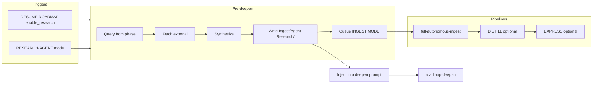

# Research agent roadmap integration plan

## Goal

Let Cursor **research outside the vault** (web/papers), **write results into the vault**, and **route them through existing PARA and CODE pipelines** so ROADMAP-MODE and RESUME-ROADMAP deepen iterations are grounded in external context. Research runs as a **pre-deepen step** (before secondary/tertiary deepening), with full capture and ingest; comparison of “context Cursor used” vs “what pipelines focus on” is **deferred** until after roadmapping systems are stable.

---

## 1. Vault and folder layout

- **Add `Ingest/Agent-Research/`** as a documented drop zone in [Vault-Layout.md](3-Resources/Second-Brain/Vault-Layout.md) (table “Folder structure”):
  - **Purpose**: Synthesized research output from the research-agent (query → fetch → synthesize); same processing as other Ingest (full-autonomous-ingest, then optional DISTILL/EXPRESS).
  - **Frontmatter** on created notes: `research_query`, `linked_phase` (e.g. `"Phase-4-1"`), `project_id`, `agent-generated: true` (reuse Agent-Output semantics where useful), `**research_tools_used`** (array, e.g. `["web","browse"]` — actual tools used for this note; helps audit/debug “why was this irrelevant?”), plus standard `created`, `tags`, `para-type` after classification.
- **Naming**: Use [Naming-Conventions.md](3-Resources/Second-Brain/Naming-Conventions.md): `kebab-slug-YYYY-MM-DD-HHMM.md`; slug can derive from `research_query` or phase (e.g. `faction-state-persistence-Phase-4-1-2026-03-09-1430.md`).
- **Exclusions**: Do **not** add `Ingest/Agent-Research/` to pipeline input exclusions; notes here are normal Ingest and are processed by INGEST MODE. Document in Vault-Layout and in [Logs.md](3-Resources/Second-Brain/Logs.md) that Ingest-Log may include `#cursor-agent-direct`-style lines for research notes when moved with high confidence.

---

## 2. Adopt AI-Research-SKILLs (Orchestra-Research)

- **Source**: [Orchestra-Research/AI-Research-SKILLs](https://github.com/Orchestra-Research/AI-Research-SKILLs) (clone or `npx @orchestra-research/ai-research-skills`; prefer copying into vault so skills are versioned with the project).
- **Placement**: Copy **3–5** chosen SKILL.md files into `.cursor/skills/research-agent/` (or per-skill subfolders, e.g. `research-agent/query-gen/`, `research-agent/fetch-external/`, `research-agent/synthesize-results/`). Suggested minimal set:
  - **Query generation** from phase/outline text (e.g. “player perspective in AI myths”, “faction state persistence”).
  - **Fetch** (web/papers): In SKILL.md, **explicitly call out first-line tools** — **web_search** (broad queries; limit e.g. `num_results: 5` per call) + **browse_page** (deep dives on top results); for **papers**, use **x_keyword_search** (e.g. `query: "arxiv OR site:arxiv.org [topic] filter:links min_faves:10"`) or **web_search** with `"site:arxiv.org"`. No custom fetch code; leverage built-ins. Document in [MCP-Tools.md](3-Resources/Second-Brain/MCP-Tools.md) if tool contracts differ.
  - **Synthesize** (turn fetched content into Markdown summaries **with source URLs and inline citations**).
- **Vault-specific wrapper**: **research-agent-run** under `.cursor/skills/research-agent-run/SKILL.md`: (1) accepts `project_id`, `linked_phase`, `queries` (max 3–5), (2) runs query-gen → fetch → synthesize, (3) **limits to 3–5 fetch calls total** (e.g. num_results: 5 per web_search), (4) synthesize step includes source URLs + inline citations in output, (5) writes to `Ingest/Agent-Research/` via MCP, (6) returns paths and short summaries for deepen injection. **Params.research_tools** (array, tunable in Parameters): `["web", "x", "browse"]` to toggle which tools are used (extensibility).
- **Skills.md**: In [Skills.md](3-Resources/Second-Brain/Skills.md) § Skills table, add rows for the new research-agent skills and for **research-agent-run** (pipeline: RESEARCH-AGENT / RESUME-ROADMAP pre-deepen; slot: N/A; purpose: run research sequence and write to Ingest/Agent-Research/).

---

## 3. Rule extension: auto-roadmap pre-deepen research hook

- **File**: [.cursor/rules/context/auto-roadmap.mdc](.cursor/rules/context/auto-roadmap.mdc), section **RESUME-ROADMAP = single continue entry**, branch **action: deepen**.
- **Logic**:
  - **When** `params.action === "deepen"` **and** research is enabled:
    - **Enable conditions**: `params.enable_research === true` **or** phase/target has tag `#research-needed` **or** **auto-detect** (below). If `params.enable_research === false` explicitly, treat as opt-out and skip research (override auto-detect).
    - **Auto-detect (less manual params)**: For phases > 3 (high-level), scan the **target phase note** via `obsidian_read_note` and simple regex for: tag `#research-needed`, or phrases from **research_auto_keywords** (Config/Parameters, default: `["web", "papers", "examples", "benchmarks"]` plus optional `"external priors"`, `"web examples"`, `"paper references"`). If any hit, set `enable_research: true` internally so research is **opt-out** for content that signals need for externals. Reduces queue payload bloat. Document in [Parameters.md](3-Resources/Second-Brain/Parameters.md) § Queue modes as **research_auto_keywords** (array; default above).
  - **Pre-deepen step** (run **before** calling roadmap-deepen):
    1. Resolve **queries**: From current phase outline / target (e.g. current secondary or phase roadmap note) derive 3–5 search queries (or take `params.research_queries` if provided).
    2. Call **research-agent-run** (or the sequence of research-agent skills) with `project_id`, `linked_phase` (e.g. `Phase-N-M-Name`), `queries`, limit 3–5 results.
    3. **Write**: Synthesized Markdown → create note(s) in `Ingest/Agent-Research/` via MCP; frontmatter: `research_query`, `linked_phase`, `project_id`, `created`, `tags: [research, agent-research]`, `**research_tools_used`** (array of tools used, e.g. `["web","browse"]`); filename per Naming-Conventions. **Failure mode**: If research-agent-run returns 0 results or synthesis confidence < 68%, log to Errors.md with #research-failed, skip injection (step 6), and proceed to roadmap-deepen without research; do not block the loop.
    4. **Safety**: Per [mcp-obsidian-integration](.cursor/rules/always/mcp-obsidian-integration.mdc), **snapshot before write** (obsidian-snapshot per-change for the target path if updating; for new files, backup at pipeline start is sufficient; document any create path in Ingest-Log).
    5. **Queue INGEST MODE**: For each new note path, append one entry to `.technical/prompt-queue.jsonl`: `mode: "INGEST MODE"`, `source_file: "<path>"`, plus `id` and optional `params`. **Optional CODE flow**: If `params.research_distill === true` (default **false**, tunable in [Parameters.md](3-Resources/Second-Brain/Parameters.md)), after INGEST MODE entries also append **DISTILL MODE** entries for each new research note so they route through CODE automatically (ingest → distill per [Pipelines.md](3-Resources/Second-Brain/Pipelines.md) § Trigger → pipeline). Keeps queue spam low when false; defer EXPRESS to user-triggered or post-phase.
    6. **Inject into deepen**: Pass into the **roadmap-deepen** call (e.g. in params or in the prompt context): links to the new notes and/or a short “Research summary” block (1–2 sentences per note or combined) so the deepen step can use them immediately. Optionally add a field `params.injected_research_paths` or `params.injected_research_summary` that roadmap-deepen reads in step 0 (inject_extra_state) or in its main prompt.
  - **When** research is **not** enabled, skip this block and call roadmap-deepen as today.
- **Params**: Document in [Queue-Sources.md](3-Resources/Second-Brain/Queue-Sources.md) and [Parameters.md](3-Resources/Second-Brain/Parameters.md) § Queue modes: `enable_research` (bool), `research_queries` (array, optional), `research_timing` (e.g. `"pre-secondary"`), `research_result_limit` (default 3–5), **research_auto_keywords** (array; default `["web", "papers", "examples", "benchmarks"]` for auto-detect), **research_tools** (array; default `["web", "x", "browse"]`), **research_distill** (bool; default false; when true, append DISTILL MODE for new research notes).

---

## 4. Queue and trigger integration

- **Queue-Alias-Table** ([Queue-Alias-Table.md](3-Resources/Second-Brain/Queue-Alias-Table.md)):
  - Add **RESEARCH-AGENT** to the “Pipeline trigger phrases → Queue mode” table: trigger phrases e.g. “Queue research for phase”, “RESEARCH-AGENT”; canonical mode **RESEARCH-AGENT**; pipeline: research-agent-run (write to Ingest/Agent-Research/, then queue INGEST MODE for new notes).
  - In **Canonical order**, insert RESEARCH-AGENT **after TASK-ROADMAP** (as in your spec).
- **Queue-Sources.md**: Add **RESEARCH-AGENT** to the modes list; payload: `source_file` (phase note or roadmap note) or `project_id` + `params.phase` / `params.linked_phase`, optional `params.research_queries`.
- **auto-eat-queue**: In [.cursor/rules/context/auto-eat-queue.mdc](.cursor/rules/context/auto-eat-queue.mdc), add **dispatch** for `mode === "RESEARCH-AGENT"`: resolve project and phase from `source_file` or `project_id` + params; run research-agent-run; write to `Ingest/Agent-Research/`; append INGEST MODE entries for new notes; append Watcher-Result line(s).
- **Commander**: Document (or add) a macro **“Queue Research for Phase”**: prompts for queries or reads from current phase note, then appends one **RESEARCH-AGENT** entry to the queue with `source_file` and optional `params.research_queries`. See [Commander-Plugin-Usage](3-Resources/Second-Brain/Commander-Plugin-Usage.md) if present.
- **RESUME-ROADMAP auto-queue (optional)**: When `workflow_state` shows util < 30% and phase “needs externals” (e.g. phase > 2 or tag on phase), optionally append a RESUME-ROADMAP entry with `params.enable_research: true` so the next run does pre-deepen research. This can be a later refinement; document the intent in Parameters or Roadmap-Upgrade-Plan.

---

## 5. Pipeline routing (PARA + CODE)

- **Ingest**: Notes in `Ingest/Agent-Research/` are processed by **INGEST MODE** like any other Ingest note (classify_para, frontmatter-enrich, subfolder-organize, split_atomic if needed, distill_note, append_to_hub, move to PARA). No new pipeline; ensure para-zettel-autopilot and ingest-processing include `Ingest/Agent-Research/` in scope (they already process `Ingest/**/*.md` except exclusions).
- **Downstream**: After ingest, research notes can be queued for **DISTILL MODE** (optional, gated by `params.research_distill: true`) and **EXPRESS MODE** (e.g. for “CODE refinement” or deeper summarization).  See §3 pre-deepen step 5 for research_distill; EXPRESS is deferred.
- **Logs**: Ingest-Log already supports `#cursor-agent-direct` and tech_level; add a short note in [Logs.md](3-Resources/Second-Brain/Logs.md) that research-agent-created notes may be logged with a flag (e.g. `research_query` or `linked_phase`) for traceability.

---

## 6. workflow_state and deepen prompt injection

- **roadmap-deepen** ([.cursor/skills/roadmap-deepen/SKILL.md](.cursor/skills/roadmap-deepen/SKILL.md)): Extend **step 0 (inject_extra_state)** or add an optional input:
  - When caller passes **injected_research_summary** or **injected_research_paths** (from auto-roadmap after the pre-deepen research step), include that content in the “Injected context” block so the model sees research summaries/links when generating the next deepen content. No change to workflow_state schema; this is prompt context only.
- **workflow_state.md**: No new columns required for research. Optional: in **Status / Next** or a frontmatter field, record that “pre-deepen research ran” (e.g. `research_run: true`, `research_note_count: 2`) for audit; defer to a later iteration if needed.

---

## 7. Safety and MCP

- **Snapshot**: Before creating or overwriting any note in `Ingest/Agent-Research/`, follow [mcp-obsidian-integration](.cursor/rules/always/mcp-obsidian-integration.mdc): backup at run start; for overwrites, per-change snapshot. New-file creates: backup gate at pipeline start is sufficient; document in skill/rule.
- **ensure_structure**: Before writing the first note under `Ingest/Agent-Research/`, call `obsidian_ensure_structure`(folder_path: `"Ingest/Agent-Research"`).
- **Dry-run**: No move of existing notes in the research step; only create new notes. Moves happen later via INGEST MODE (with dry_run then commit per rule).

---

## 8. Deferred (queue-ready): context vs pipeline audit

- **Intent**: Compare "context Cursor used" (workflow_state Ctx Util %, token estimates) with "what the pipelines focused on" (distill lens, express view, highlights in logs); output a delta (e.g. % overlap in topics) for post-roadmap stability review.
- **Skill stub (actionable)**: New skill **context-vs-pipeline-audit** at `.cursor/skills/context-vs-pipeline-audit/SKILL.md`:
  - **Inputs**: Read `workflow_state.md` (target project Roadmap folder) for Ctx Util %, Est. Tokens / Window; read [Distill-Log](3-Resources/Distill-Log.md) and [Express-Log](3-Resources/Express-Log.md) for focus fields (lens, view, highlights, note paths).
  - **Compute**: Delta / overlap metric (e.g. % of topics or note paths that appear in both context and pipeline focus).
  - **Output**: Write to **Audit-Context-Focus.md** (e.g. under `3-Resources/` or project `Roadmap/`) with summary table and one-line verdict.
- **Trigger**: New queue mode **AUDIT-CONTEXT**; add to [Queue-Alias-Table.md](3-Resources/Second-Brain/Queue-Alias-Table.md) **after ARCHIVE** in canonical order. Dispatch in auto-eat-queue: run context-vs-pipeline-audit for `source_file` or `project_id`. Makes the deferral actionable—queue it once roadmap systems are stable.
- **Roadmap-Upgrade-Plan**: In [Roadmap-Upgrade-Plan.md](3-Resources/Second-Brain/Roadmap-Upgrade-Plan.md) § Deferred, replace the short placeholder with a pointer to this skill and AUDIT-CONTEXT mode.

---

## 9. Docs and sync

- **Backbone**: Update [Pipelines.md](3-Resources/Second-Brain/Pipelines.md) (trigger table: RESEARCH-AGENT, RESUME-ROADMAP with enable_research, AUDIT-CONTEXT); [Cursor-Skill-Pipelines-Reference.md](3-Resources/Second-Brain/Cursor-Skill-Pipelines-Reference.md) (research-agent-run, pre-deepen hook, context-vs-pipeline-audit); [Queue-Sources.md](3-Resources/Second-Brain/Queue-Sources.md) and [Parameters.md](3-Resources/Second-Brain/Parameters.md) § Queue modes (params: enable_research, research_auto_keywords, research_tools, research_distill, etc.); [Rules-Structure-Detailed.md](3-Resources/Second-Brain/Rules-Structure-Detailed.md) if rule triggers are documented there.
- **Sync**: Per [backbone-docs-sync](.cursor/rules/always/backbone-docs-sync.mdc), update [.cursor/sync/](.cursor/sync/) for any new or changed rules/skills and append [.cursor/sync/changelog.md](.cursor/sync/changelog.md).

---

## 10. Test and rollout

- **Smoke test**: Queue **RESUME-ROADMAP** with `params.enable_research: true` and `source_file` or `project_id` pointing at a phase (e.g. Phase-4-1 for genesis-mythos). Expect: (1) research-agent runs and creates note(s) in `Ingest/Agent-Research/`, (2) INGEST MODE entries appended for those notes, (3) deepen prompt receives injected research summary/links, (4) EAT-QUEUE processes INGEST MODE and moves research notes to PARA.
- **Regression check**: After smoke test, record in [Regression-Stability-Log.md](3-Resources/Second-Brain/Regression-Stability-Log.md): verify that **research-injected deepens do not flip PARA paths > 5%** more than non-research runs. Use baseline from current logs (recent non-research deepen/ingest path outcomes); compare path changes for notes touched in research vs non-research runs. Ties into existing regression tracking for long-term stability.
- **Extensibility**: Keep research_timing, enable_research, research_auto_keywords, and research_distill params-tunable so you can test “before secondary only” vs “every deepen” and optional CODE flow without code changes.

---

## Summary diagram

---

## Files to touch (checklist)

| Area          | File(s)                                                                                                                                                                                                                                                                                                                                                                                                                          |
| ------------- | -------------------------------------------------------------------------------------------------------------------------------------------------------------------------------------------------------------------------------------------------------------------------------------------------------------------------------------------------------------------------------------------------------------------------------- |
| Vault layout  | [Vault-Layout.md](3-Resources/Second-Brain/Vault-Layout.md) (add Ingest/Agent-Research/)                                                                                                                                                                                                                                                                                                                                         |
| Naming        | [Naming-Conventions.md](3-Resources/Second-Brain/Naming-Conventions.md) (optional: research note slug rule)                                                                                                                                                                                                                                                                                                                      |
| Skills        | `.cursor/skills/research-agent*/` (new), [Skills.md](3-Resources/Second-Brain/Skills.md)                                                                                                                                                                                                                                                                                                                                         |
| Rules         | [auto-roadmap.mdc](.cursor/rules/context/auto-roadmap.mdc), [auto-eat-queue.mdc](.cursor/rules/context/auto-eat-queue.mdc)                                                                                                                                                                                                                                                                                                       |
| Queue/params  | [Queue-Alias-Table.md](3-Resources/Second-Brain/Queue-Alias-Table.md) (RESEARCH-AGENT, AUDIT-CONTEXT after ARCHIVE), [Queue-Sources.md](3-Resources/Second-Brain/Queue-Sources.md), [Parameters.md](3-Resources/Second-Brain/Parameters.md) § Queue modes                                                                                                                                                                        |
| Roadmap skill | [roadmap-deepen/SKILL.md](.cursor/skills/roadmap-deepen/SKILL.md) (optional: inject_research inputs)                                                                                                                                                                                                                                                                                                                             |
| Audit skill   | `.cursor/skills/context-vs-pipeline-audit/SKILL.md` (stub), [Skills.md](3-Resources/Second-Brain/Skills.md)                                                                                                                                                                                                                                                                                                                      |
| Docs          | [Pipelines.md](3-Resources/Second-Brain/Pipelines.md), [Cursor-Skill-Pipelines-Reference.md](3-Resources/Second-Brain/Cursor-Skill-Pipelines-Reference.md), [Logs.md](3-Resources/Second-Brain/Logs.md), [Roadmap-Upgrade-Plan.md](3-Resources/Second-Brain/Roadmap-Upgrade-Plan.md), [Regression-Stability-Log.md](3-Resources/Second-Brain/Regression-Stability-Log.md), [MCP-Tools.md](3-Resources/Second-Brain/MCP-Tools.md) |
| Sync          | [.cursor/sync/changelog.md](.cursor/sync/changelog.md), .cursor/sync/rules/ and skills/ as needed                                                                                                                                                                                                                                                                                                                                |

