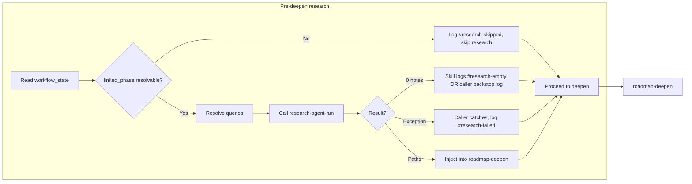

# Researcher silent-failure hardening

## Problem summary

From your audit, the researcher can appear to "do nothing" because:

1. **linked_phase is undefined** in auto-roadmap for RESUME-ROADMAP: the rule says to call research-agent-run with `project_id`, `linked_phase`, and queries but never states where `linked_phase` comes from when the trigger is RESUME-ROADMAP (no phase note in `source_file`; the target lives in workflow_state).
2. **Empty/failure paths are not reliably logged**: when research returns 0 notes or throws, either the skill or the caller may skip writing to Errors.md, so there is no trace.
3. **No dedicated research observability**: Errors.md is the only specified trace; Watcher-Result for RESUME-ROADMAP does not distinguish "research ran, 0 notes" from "research not run."

Existing contracts already expect no silent skip: [Mode-Success-Contracts.md](3-Resources/Second-Brain/Mode-Success-Contracts.md) requires that when research is enabled for a deepen run, success means either research produced notes **or** a research-empty/failure event was logged. The implementation and rule wording need to enforce this.

---

## 1. Define `linked_phase` in auto-roadmap for RESUME-ROADMAP

**File:** [.cursor/rules/context/auto-roadmap.mdc](.cursor/rules/context/auto-roadmap.mdc)

**Current gap:** Pre-deepen steps say "Call research-agent-run with `project_id`, `linked_phase`, queries" but do not define how to obtain `linked_phase` when the entry is RESUME-ROADMAP (no `source_file` phase note).

**Change:** In the **Pre-deepen steps** (deepen branch), add an explicit step **before** (a)–(b):

- **Resolve `linked_phase` for pre-deepen:** After reading workflow_state (already done for util/conf and depth), derive `linked_phase` from workflow_state. **Semantic:** For RESUME-ROADMAP pre-deepen, `linked_phase` is the **current deepen context** — the phase/segment we are deepening (from `current_phase` + `current_subphase_index`), not the "next" target that roadmap-deepen will create in step 3.
  - Read **current_phase** and **current_subphase_index** from workflow_state frontmatter (same file already read for util/conf).
  - Set `**linked_phase`** to a stable identifier valid for research-agent-run: `**"Phase-{current_phase}-{current_subphase_index with '.' replaced by '-'}"`** (e.g. `Phase-1-1`, `Phase-1-1-2`). Prefer this stable-id form to avoid requiring folder listing in auto-roadmap; research-agent-run already accepts "e.g. Phase-4-1 or phase roadmap note path" and can resolve the note for query gen.
  - **If** workflow_state is missing, unreadable, or `current_phase` / `current_subphase_index` are missing or invalid: **do not** call research-agent-run. Instead: append to **Errors.md** one entry per **Research error entry format** (see §2c) with **#research-skipped**, pipeline `auto-roadmap`, reason e.g. `linked_phase not resolved (missing or invalid workflow_state or current_subphase_index)`, project_id; then **proceed to roadmap-deepen without research** (no injection).
  - **Invariant:** Call research-agent-run only when **both** `project_id` and `linked_phase` are resolved; otherwise log and skip research.

Insert this as a new bullet **(a0)** or fold into the existing (a): e.g. "(a0) Resolve linked_phase from workflow_state (current_phase, current_subphase_index) as above; if unresolved, log #research-failed/#research-skipped and skip to (2) roadmap-deepen. (a) Resolve queries…"

**Sync:** Update [.cursor/sync/rules/context/auto-roadmap.md](.cursor/sync/rules/context/auto-roadmap.md) to match.

---

## 2. Mandatory logging when research returns empty or throws

### 2a. Skill: research-agent-run

**File:** [.cursor/skills/research-agent-run/SKILL.md](.cursor/skills/research-agent-run/SKILL.md)

**Change:** Harden **Step 4 (Failure / empty mode)**:

- State explicitly that when the skill enters failure/empty mode (0 results, synthesis conf < 68%, or synthesized content < ~1500 tokens), it **MUST** append one entry to **Errors.md** before returning. Specify the **exact format**: heading `### YYYY-MM-DD HH:MM — research-empty or research-failed`, metadata table with `pipeline: research-agent-run`, `linked_phase`, `project_id`, `error_type: research-empty | research-failed`, and **#### Trace** / **#### Summary** including reason and (if any) queries used.
- Add a short invariant: "If the skill returns 0 paths/summaries for any of the above reasons and does **not** write this Errors.md entry, the run is incomplete; the caller should treat as failure and log as backstop (see caller contract)."

No change to success path or write step; only make the logging obligation and format explicit and mandatory.

### 2b. Caller: auto-roadmap

**File:** [.cursor/rules/context/auto-roadmap.mdc](.cursor/rules/context/auto-roadmap.mdc)

**Change:** Harden bullet **(c) Failure / empty mode**:

- Add: **Caller MUST** append to **Errors.md** when:
  - **(1)** research-agent-run returns **empty paths/summaries** (0 notes) and the skill did **not** already add an entry for this run (e.g. skill returned empty without logging — caller as backstop). Entry per **Research error entry format** (§2c): **#research-empty**, pipeline `research-agent-run`, linked_phase, project_id, reason e.g. "caller backstop: 0 notes returned, no skill log".
  - **(2)** research-agent-run **throws or times out**. Entry per §2c: **#research-failed**, pipeline `research-agent-run`, reason e.g. "exception" or "tool unavailable", linked_phase if available, project_id.
- Keep existing: "return empty paths/summaries, proceed to roadmap-deepen without research; do not let the exception block deepen."

This makes the caller the **backstop** so that even if the skill omits logging, there is always an Errors.md trace when research was attempted and produced nothing.

**Sync:** Same auto-roadmap sync file as in §1.

### 2c. Centralized Research error entry format

**File:** [3-Resources/Second-Brain/Logs.md](3-Resources/Second-Brain/Logs.md) (and optionally [.cursor/rules/always/mcp-obsidian-integration.mdc](.cursor/rules/always/mcp-obsidian-integration.mdc) Error Handling Protocol if research is called out there).

**Change:** Add a short subsection **"Research error entry format"** so skill and all callers (auto-roadmap, roadmap-deepen) use the same structure. This keeps Errors.md entries consistent and grep-friendly.

- **Heading:** `### YYYY-MM-DD HH:MM — research-empty | research-failed | research-skipped`
- **Metadata table:** `pipeline` (e.g. `research-agent-run`, `auto-roadmap`, `roadmap-deepen`), `linked_phase`, `project_id`, `error_type` (`research-empty` | `research-failed` | `research-skipped`), `timestamp`, optional `severity`.
- **#### Trace:** Sanitized trace (no API keys); or reason string if no stack.
- **#### Summary:** Root cause, impact, suggested fixes, recovery (brief).
- **Tags in body:** At least one of `#research-failed`, `#research-empty`, `#research-skipped` so Dataview/grep can filter.

Reference this format from research-agent-run Step 4 and from caller bullets (auto-roadmap §2b, roadmap-deepen gap-fill §2d).

### 2d. Gap-fill path (roadmap-deepen step 4.5)

**File:** [.cursor/skills/roadmap-deepen/SKILL.md](.cursor/skills/roadmap-deepen/SKILL.md)

**Change:** When roadmap-deepen invokes research-agent-run in **gap-fill mode** (step 4.5), apply the same reliability contract as pre-deepen:

- **Require project_id and linked_phase:** Before calling research-agent-run with `params.gaps`, the skill **MUST** pass `**project_id`** and `**linked_phase`** (the current deepen target — e.g. phase note path or stable id like `Phase-1-1-2` from the target being deepened). If either is missing in context, **do not** call research-agent-run for gap-fill; instead append to **Errors.md** one entry per Research error entry format (§2c) with **#research-skipped**, pipeline `roadmap-deepen`, reason e.g. `gap-fill: linked_phase or project_id missing`; then proceed to step 5 (write) without gap_fills.
- **Caller backstop for empty/exception:** If research-agent-run (gap-fill) returns empty or partial gap_fills and the skill did not log, or if it throws: **roadmap-deepen** (caller) **MUST** append to Errors.md per §2c (#research-empty or #research-failed, pipeline `roadmap-deepen` or `research-agent-run`, linked_phase, project_id). Proceed to step 5 regardless — inject only available fills (fill_conf ≥68%), do not block the deepen step.

**Sync:** Update [.cursor/sync/skills/roadmap-deepen.md](.cursor/sync/skills/roadmap-deepen.md) to match.

---

## 3. Optional observability: Research-Log and/or Watcher-Result

### 3a. Research-Log (optional but recommended)

**New:** Introduce a single **Research-Log** so every research run (pre-deepen, RESEARCH-AGENT, or gap-fill) is visible even when no new notes are created.

- **Location:** `3-Resources/Research-Log.md` (or `3-Resources/Second-Brain/Research-Log.md` if you keep logs under Second-Brain).
- **Content:** One line per run: e.g. `timestamp | project_id | linked_phase | outcome: notes_created | empty | failed | exception | reason_if_not_notes_created | note_count`.
- **Who writes:** 
  - **research-agent-run** (skill): append one line when the run finishes (success: outcome=notes_created, note_count=N; empty/fail: outcome=empty|failed, reason, note_count=0).
  - **auto-roadmap** (caller): when it invokes research pre-deepen, after research-agent-run returns, append one line (e.g. "pre-deepen | project_id | linked_phase | outcome | note_count"); or rely on skill-only writes if the skill is always called from a single place and logs every time.
- **Docs:** Add a row to the pipeline logs table in [Logs.md](3-Resources/Second-Brain/Logs.md) for Research-Log (location, what gets written, responsibilities). Mention in [Vault-Layout](3-Resources/Second-Brain/Vault-Layout.md) or Logs.md if this log is included in rotation (e.g. log-rotate).

This gives a single place to see "research ran, 0 notes, reason X" without relying only on Errors.md.

### 3b. Watcher-Result for RESUME-ROADMAP when research ran but 0 notes (optional)

**File:** [.cursor/rules/always/watcher-result-append.mdc](.cursor/rules/always/watcher-result-append.mdc) and/or auto-roadmap.

**Change:** When the run is RESUME-ROADMAP with research enabled, research was **invoked**, and research returned **0 notes** (and deepen completed successfully): append the usual Watcher-Result success line for the queue entry but allow the **message** to include a short suffix, e.g. `"deepen success; research ran, 0 notes (see Errors.md or Research-Log)"`, so the run is not indistinguishable from "research not run." Implementation can live in auto-roadmap: when building the Watcher-Result line for RESUME-ROADMAP deepen, if research was enabled and (injected_research_paths empty and no new research notes), set message to include the suffix. Optional: only add this if a dedicated Research-Log exists and is written; otherwise "see Errors.md" is enough.

---

## 4. Documentation and audit note

- **Second-Brain docs:** Add a short subsection under the roadmap or research docs (e.g. in [Queue-Sources](3-Resources/Second-Brain/Queue-Sources.md) or a new "Research agent" section in [Cursor-Skill-Pipelines-Reference](3-Resources/Second-Brain/Cursor-Skill-Pipelines-Reference.md)): when RESUME-ROADMAP has `enable_research: true`, `linked_phase` is derived from workflow_state in auto-roadmap (current deepen context); if it cannot be resolved, research is skipped and an error is logged; after a run, check Errors.md for #research-failed / #research-empty / #research-skipped (and Research-Log if added) to confirm research ran or skipped.
- **Audit note:** Optionally add a short "Research silent-failure audit" note (e.g. under `1-Projects/.../Roadmap/` or `3-Resources/Second-Brain/`) that summarizes: who invokes research (auto-roadmap pre-deepen, auto-eat-queue RESEARCH-AGENT, roadmap-deepen gap-fill), where linked_phase comes from for each path (workflow_state for pre-deepen; source_file/params for RESEARCH-AGENT; deepen target context for gap-fill), the **Research error entry format** (Logs.md), and that every empty/failure/skip must be logged to Errors.md (skill or caller backstop) and optionally to Research-Log. This gives a single reference for future debugging.

---

## 5. Flow diagram (after changes)

---

## 6. Implementation order

| #   | Task                                                                              | Files                                                     |
| --- | --------------------------------------------------------------------------------- | --------------------------------------------------------- |
| 1   | Define linked_phase resolution and "skip research + log" in auto-roadmap          | auto-roadmap.mdc, sync                                    |
| 2   | Add Research error entry format in Logs.md (§2c)                                  | Logs.md                                                   |
| 3   | Harden research-agent-run Step 4: MUST log, reference §2c, invariant              | research-agent-run/SKILL.md                               |
| 4   | Harden auto-roadmap (c): caller MUST log on empty or exception (§2b)              | auto-roadmap.mdc, sync                                    |
| 5   | Harden roadmap-deepen step 4.5: require project_id + linked_phase, backstop (§2d) | roadmap-deepen/SKILL.md, sync                             |
| 6   | (Optional) Add Research-Log + who writes + Logs.md row                            | Research-Log.md, Logs.md, skill + auto-roadmap            |
| 7   | (Optional) Watcher-Result message suffix for "research ran, 0 notes"              | watcher-result-append.mdc and/or auto-roadmap             |
| 8   | Doc: linked_phase source + post-run check; optional audit note                    | Queue-Sources or Pipelines reference; optional audit note |

---

## 7. Verification

- Run RESUME-ROADMAP with `enable_research: true` and a project that has workflow_state with valid `current_phase` and `current_subphase_index`: research should be called with a non-empty `linked_phase`.
- Run with missing or invalid workflow_state (or missing current_subphase_index): no call to research-agent-run; one Errors.md entry with #research-skipped or #research-failed; deepen still runs.
- Simulate 0 results or exception from research: in all cases at least one of (skill log, caller log) must appear in Errors.md; optional Research-Log line and Watcher-Result suffix make "research ran, 0 notes" visible.

