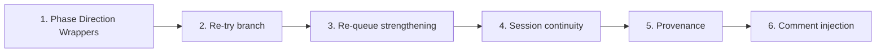

# Roadmap Phase Direction Wrappers, Re-Try, Re-Queue, Continuity, and Provenance

## Scope

Five enhancements that mirror existing ingest/Decision Wrapper patterns and extend EAT-QUEUE Step 0 and roadmap flows:

1. **Phase Direction Decision Wrappers** — Create wrappers for phase forks (e.g. "Grid: fixed 20x20 or dynamic?") after EXPAND-ROAD or roadmap-generate-from-outline, with A–G options (tech implications + user conceptual slot).
2. **Re-try branch** — Add `re-try: true` (or option R) so the user can re-queue with guidance instead of re-wrap; Step 0 handles it like re-wrap but appends a queue entry and archives the wrapper.
3. **Re-queue strengthening** — On re-try, append EXPAND-ROAD or TASK-TO-PLAN-PROMPT with payload from wrapper; optionally inject `previous_decisions` for session continuity.
4. **Session continuity** — Auto-inject recent successes (Watcher-Result, frontmatter, optional Versions/snapshots) when re-queuing. **Mobile out of scope:** Stubs only for where mobile should integrate later (see §4 and Documentation step).
5. **Provenance** — Extend lineage on wrapper apply (provenance callout on roadmap); idea origins in prompt context; Dataview for plan evolution; optional 4-Archives/Provenance/.
6. **Comment and provenance injection** — TASK-TO-PLAN-PROMPT template demands liberal explanatory comments in plan output; Step 0 appends in-roadmap provenance callout with comment guidance near approved task; optional `code_comments` config; optional future comment-fatigue heuristic. Defensive programming: code remembers *why* and *why-not*; low cost (~5 lines template + one config block).

**Out of scope for this plan:** Mobile-specific flows (toolbar, Mobile-Pending-Actions append, mobile → laptop handoff). Implement laptop/desktop-only; add stubs where mobile would plug in so a future pass can integrate without re-architecting.

---

## 1. Phase Direction Decision Wrappers

**Intent:** After a phase is expanded or generated, if it "implies direction choices" (e.g. design/tech forks), create a Decision Wrapper so the user can approve one direction before the system infers tech. Mirrors ingest A–G + apply-only-after-approved.

**Trigger:** When **expand-road-assist** (EXPAND-ROAD) or **roadmap-generate-from-outline** completes successfully and the expanded/generated phase content implies direction choices (e.g. "Grid: fixed vs dynamic", "Camera: orbit vs free-flight"). Detection can be heuristic (keywords, optional LLM pass on phase title/body) or explicit (expand-road-assist returns `phase_direction_choices: true` + short description).

**Mechanics:**

- **Where:** Create wrapper under [Ingest/Decisions/Roadmap-Decisions/](3-Resources/Second-Brain/Vault-Layout.md) (already in Vault-Layout; ensure `obsidian_ensure_structure` for this folder when creating).
- **Wrapper type:** Introduce `wrapper_type: phase-direction` (or reuse `task-decision` with `pipeline: roadmap` and document apply semantics). Prefer **phase-direction** so apply behavior is explicit: update roadmap/phase note with chosen direction + lineage, then archive.
- **Content (A–G):** Pad to 7 options per [MCP-Tools / propose_para_paths](3-Resources/Second-Brain/MCP-Tools.md) convention. Each option:
  - **Cursor-handled tech:** Auto-populate implications (pros/cons, optional code sketch). Use `obsidian_global_search` for prior notes on similar decisions if no dedicated "imply_tech" MCP tool (as in your spec).
  - **User-focused conceptual:** Use **user_guidance** multiline only (merged per [guidance-aware](.cursor/rules/always/guidance-aware.mdc)) for "How will it be used?" — no new field; Thoughts block in [Templates/Decision-Wrapper.md](Templates/Decision-Wrapper.md) feeds user_guidance.
- **Template:** Extend [Templates/Decision-Wrapper.md](Templates/Decision-Wrapper.md) (or add a variant `Templates/Decision-Wrapper-Phase-Direction.md`) with placeholders for phase_path, direction_question, and option tech/conceptual fields. Reuse same safety blurb (Watcher never sets approved; user sets approved: true).
- **Apply (Step 0):** When `approved: true` and `wrapper_type: phase-direction`, resolve `approved_option` / `approved_path`; append chosen direction and lineage to the target roadmap/phase note (per task-decision pattern in [Cursor-Skill-Pipelines-Reference § Apply-from-wrapper](3-Resources/Cursor-Skill-Pipelines-Reference.md)); set `processed: true` / `used_at`; move wrapper to `4-Archives/Ingest-Decisions/Roadmap-Decisions/`.

**Integration points:**

- **EXPAND-ROAD:** Currently dispatched from [auto-queue-processor](.cursor/rules/context/auto-queue-processor.mdc) (Task-Queue). After expand-road-assist returns success, the processor (or a small post-step) checks for direction choices and creates the Phase Direction Wrapper if needed. If EXPAND-ROAD is later added to the prompt queue and dispatched from [auto-eat-queue](.cursor/rules/context/auto-eat-queue.mdc) Step 5, the same post-success check runs after dispatch.
- **roadmap-generate-from-outline:** In [roadmap-generate-from-outline](.cursor/skills/roadmap-generate-from-outline/SKILL.md), after phase notes are created, optionally run the same "phase implies direction choices" check for each phase and create wrappers for those that do. Keep this optional (e.g. config flag or only when confidence >= 85%) to avoid wrapper spam.
- **Auto-detection heuristic (post-step in [expand-road-assist](.cursor/skills/expand-road-assist/SKILL.md)):** After expand writes content, optionally scan output for choice indicators (e.g. "or", "vs", "options:"). If found, tag section/note with `#phase-fork` and auto-queue wrapper creation (chain like INGEST → ORGANIZE per [Queue-Sources § Canonical order](3-Resources/Second-Brain/Queue-Sources.md)). Toggle via [Second-Brain-Config](3-Resources/Second-Brain/Second-Brain-Config.md) (e.g. `phase_fork_heuristic: true`). Per [Skills](3-Resources/Second-Brain/Skills.md), post-step logic is allowed. **Low-conf fallback:** Per [Parameters § Confidence bands](3-Resources/Second-Brain/Parameters.md), when confidence <68% treat as propose-only (no wrapper write without user approval).

**Safety:** No apply without `approved: true` (per existing rules). Watcher only syncs checkbox; user sets approval manually or via Commander.

---

## 2. Re-try Branch (Manually Approved Property + Re-Queue)

**Intent:** Like re-wrap, but instead of generating a new wrapper from Thoughts, re-queue an EXPAND-ROAD or TASK-TO-PLAN-PROMPT entry with the wrapper’s guidance so the system loops back with user intent.

**Mechanics:**

- **Frontmatter:** Add `re-try: true` to wrapper frontmatter. **Option R:** Pad A–G to include **R** (per [MCP-Tools § propose_para_paths](3-Resources/Second-Brain/MCP-Tools.md) fallback): "R. Re-try with guidance — re-queue EXPAND-ROAD / TASK-TO-PLAN-PROMPT with my Thoughts." Handle R in Step 0 same as `re-try: true`. Cross-ref: [User-Flow-Rules-Detailed § Decision Wrapper: full option set](3-Resources/Second-Brain/Second-Brain-User-Flows/User-Flow-Rules-Detailed.md) for R handling.
- **Step 0 (always-check wrappers)** in [auto-eat-queue.mdc](.cursor/rules/context/auto-eat-queue.mdc) (per [Rules-Structure-Detailed § auto-eat-queue](3-Resources/Second-Brain/Second-Brain-User-Flows/Rules-Structure-Detailed.md)): Extend **Branch A** (approved or re-wrap, not processed). For each wrapper with `re-try: true` (or approved_option R) and not processed:
  - **Cap check:** If re-try count for this thread (e.g. same section/phase_path) already >= `re_try_max_loops` (default 3), **abort** re-try and log `#review-needed` to [Feedback-Log.md](3-Resources/Second-Brain/Logs.md) per [Error Handling Protocol](.cursor/rules/always/mcp-obsidian-integration.mdc); do not append queue entry. Prevents infinite re-try hamster wheel.
  - Resolve guidance from wrapper (Thoughts block → `guidance_text`; optional `user_guidance` frontmatter).
  - **Re-try branch:** Append one entry to `.technical/prompt-queue.jsonl` with mode, source_file, prompt, id; optionally inject `previous_decisions` in params (see §3).
  - Set wrapper `processed: true` / `used_at`; **move wrapper to archive** at `**4-Archives/Ingest-Decisions/Roadmap-Decisions/`** (extend [Vault-Layout § 4-Archives/Ingest-Decisions](3-Resources/Second-Brain/Vault-Layout.md) so Roadmap-Decisions is explicit).
  - Log in Ingest-Log: `CHECK_WRAPPERS: <timestamp> | Re-try: <original_path> → queued <mode> with guidance; wrapper archived.`
- **Config:** In [Second-Brain-Config](3-Resources/Second-Brain/Second-Brain-Config.md) § queue, add `re_try_max_loops: 3`; document in [Parameters](3-Resources/Second-Brain/Parameters.md).

**Safety:** Re-try is manual-only (user sets `re-try: true` or option R). No auto-approval. Cap enforced as above.

---

## 3. Re-Queue Strengthening

**Intent:** When re-try runs, the new queue entry carries wrapper payload and, where useful, prior approved decisions for context.

**Mechanics:**

- **Payload on re-try:** Extend queue entry shape per [Queue-Sources § Entry shape](3-Resources/Second-Brain/Queue-Sources.md): include `params.previous_decisions` — array of short strings (populate from recent approved wrappers or frontmatter e.g. `approved_option` history). Cap at 5–10. **Re-queue order:** Per [Parameters § Queue modes](3-Resources/Second-Brain/Parameters.md), re-queued entry runs after TASK-ROADMAP but before TASK-TO-PLAN-PROMPT in canonical order.
- **Prune dead branches:** If re-try count for a section already >2 (third re-try), add tag **#prune-candidate** to the wrapper or section note; on next [ARCHIVE MODE](3-Resources/Second-Brain/Pipelines.md) (autonomous-archive), auto-archive such items. Note in [Queue-Sources](3-Resources/Second-Brain/Queue-Sources.md): "Re-queue caps/prunes via Parameters."
- **Guidance-aware merge:** Existing [feedback-incorporate](.cursor/skills/feedback-incorporate/SKILL.md) and [guidance-aware](.cursor/rules/always/guidance-aware.mdc) already merge queue `prompt` and note `user_guidance`. Ensure the re-try entry’s `prompt` is passed through so EXPAND-ROAD or TASK-TO-PLAN-PROMPT runs guidance-aware.
- **TASK-TO-PLAN-PROMPT:** New queue mode (currently not in [Queue-Sources](3-Resources/Second-Brain/Queue-Sources.md)). Add to prompt queue modes list and to Step 5 dispatch in auto-eat-queue; implement as a skill or inline step that turns a roadmap task into a Cursor-ready prompt (e.g. write to a "Prompts" section in the roadmap note or to a dedicated note). Stub behavior: read task from `source_file` + locator, output one concrete prompt string and append to note or queue for manual paste. Full "granular task → prompt" can be a follow-up.

**Files to touch:** [Queue-Sources.md](3-Resources/Second-Brain/Queue-Sources.md), [auto-eat-queue.mdc](.cursor/rules/context/auto-eat-queue.mdc) (known modes + dispatch), [Parameters](3-Resources/Second-Brain/Parameters.md), [Queue-Alias-Table](3-Resources/Second-Brain/Queue-Alias-Table.md).

---

## 4. Session Continuity Strengthening

**Intent:** When re-queuing or running a pipeline, inject recent context so the agent has a minimal "session memory" (recent successes, prior decisions).

**Mechanics:**

- **Auto-inject on re-queue:** When creating a re-try (or any) queue entry, add to `params` per queue contract in [Queue-Sources](3-Resources/Second-Brain/Queue-Sources.md):
  - **session_success_hint:** Last 1–3 lines from [Watcher-Result.md](3-Resources/Watcher-Result.md) where `status: success`. Read via `obsidian_read_note` ([MCP-Tools § Core](3-Resources/Second-Brain/MCP-Tools.md)); keep short (requestId, message, completed). Inject source: [Logs § Watcher-Result](3-Resources/Second-Brain/Logs.md).
  - **Optional Versions/ snapshots:** Per [Vault-Layout § Backups/Per-Change](3-Resources/Second-Brain/Vault-Layout.md), optionally include paths or summaries from Versions/ or Per-Change for the same project when building payloads.
- **git_diff_hint:** When vault has `.git`, use **code_execution** tool (available in this environment) to run safe `git diff --summary` (read-only); inject result into `params.git_diff_hint` for re-try / TASK-TO-PLAN-PROMPT payloads. If no `.git`, fallback to [Logs](3-Resources/Second-Brain/Logs.md) search (per Logs § Consistent fields) for recent pipeline activity. Closes weak git continuity pothole without new MCP tools.
- **Stub — Mobile handoff (out of scope):** When mobile is in scope, integrate here: after appending a re-try entry to the queue, also append pending re-tries (and their target section) to [Mobile-Pending-Actions.md](3-Resources/Mobile-Pending-Actions.md) per [User-Flow-Diagram-High-Level § User Flow – Async preview](3-Resources/Second-Brain/Second-Brain-User-Flows/User-Flow-Diagram-High-Level.md), so mobile users see what will run on next EAT-QUEUE. Do not implement in this plan; add a short note in [Queue-Sources](3-Resources/Second-Brain/Queue-Sources.md) or [Logs](3-Resources/Second-Brain/Logs.md): "Mobile: when in scope, append re-try summary to Mobile-Pending-Actions.md (stub)."

**Files:** [Queue-Sources](3-Resources/Second-Brain/Queue-Sources.md) (add session_success_hint + git_diff_hint to queue contract), [Logs](3-Resources/Second-Brain/Logs.md) or [Second-Brain/README](3-Resources/Second-Brain/README.md). Document mobile stub location in one of these.

---

## 5. Provenance: Plan Evolution and Idea Origins

**Intent:** Track "why this decision?" and "where did this plan step come from?" for roadmaps and wrappers.

**Mechanics:**

- **Lineage on wrapper apply:** Apply slot per [Cursor-Skill-Pipelines-Reference § Pipeline reference / Apply-from-wrapper](3-Resources/Cursor-Skill-Pipelines-Reference.md). When Step 0 applies a **phase-direction** (or task-decision) wrapper, append to the **target roadmap/phase note** a short provenance callout (read-only):
  - `> [!provenance] Evolved from [[Master-Goal]] via [[Wrapper-1]] (re-try on <date>) → [[Wrapper-2]] (approved).`
  - Reuse the same pattern as in Cursor-Skill-Pipelines-Reference § task-decision: per-change snapshot of target note → append provenance → set processed on wrapper → move wrapper to archive.
- **Idea origins in prompt context:** Inject **links** frontmatter array (per [Templates § links frontmatter](3-Resources/Second-Brain/Templates.md)) from note into prompt or params when building queue payloads; agent includes these in context when invoking pipelines.
- **Quick track (Dataview):** In [Vault-Change-Monitor](3-Resources/Second-Brain/Logs.md) (per Logs § MOC aggregation), add block: **"Plan Evolution"** — `LIST FROM 'Ingest/Decisions/Roadmap-Decisions/' WHERE processed = true SORT used_at DESC LIMIT 10` with **GROUP BY project-id** for per-project views (Dataview per [Plugins § Dataview](3-Resources/Second-Brain/Plugins.md)). Add [Wrapper-MOC.md](3-Resources/Second-Brain/Vault-Layout.md) if needed; **link from [Resources Hub](3-Resources/Resources-Hub.md)** for discoverability.
- **Storage:** Document in [Vault-Layout](3-Resources/Second-Brain/Vault-Layout.md) that Roadmap-Decisions (and Task-Decisions) under 4-Archives serve as plan evolution history. **Extensible:** Prune old provenance via archive `age_days` (per [Second-Brain-Config § archive](3-Resources/Second-Brain/Second-Brain-Config.md)) if that config exists or is added later.

**Safety:** Provenance is append-only to notes; no destructive overwrites.

---

## 6. Comment and provenance injection (TASK-TO-PLAN-PROMPT + roadmap)

**Intent:** Make planning prompts and roadmap provenance explicitly demand generous explanatory comments in code. Future Cursor sessions (and future-you) grok decisions without re-reading every wrapper. No new infrastructure — template text + light callouts + optional config. Overlord score: approve the *why*; code remembers the *how* and *why-not*.

### 6.1 TASK-TO-PLAN-PROMPT template (highest leverage)

In the template used when building the planning prompt for Cursor (e.g. in task-to-prompt skill or TASK-TO-PLAN-PROMPT payload), include explicit instructions that every plan output must require liberal comments in the resulting code. Example skeleton (placeholders `{{session_memory_hint}}`, `{{task_text}}` filled at runtime):

```markdown
You are in **planning mode** only — do not write code yet.

Project: {{project_name}}
Previous tasks completed in this session: {{session_memory_hint}}

Next task:
{{task_text}}

Think step-by-step:
1. How does this task fit with existing architecture / naming / error handling style?
2. Which files will need to change? (list)
3. Any new components / systems / resources required?
4. Trade-offs, risks, alternatives?
5. Clarifying questions for me before implementation?

When you later implement, **include liberal explanatory comments** in the code:
- Why this design choice was made here (especially if non-obvious)
- What assumptions this code relies on
- Known limitations or future-extension points ("TODO: later support dynamic resize")
- Links or references to relevant wrappers/decisions ("See [[Roadmap-Wrapper-Grid-Size-2026-03-07]] for approved fixed 20x20 rationale")
- Any gotchas or "don't touch this without checking X" warnings

Propose detailed plan + file change outline + **comment style guide** for this task.
```

**Where:** Template lives in [Templates](3-Resources/Second-Brain/Templates.md) or a dedicated file (e.g. `Templates/Planning-Prompt-Task.md`); task-to-prompt skill or TASK-TO-PLAN-PROMPT handler reads it and fills placeholders. Cost: zero new infra; prompt-crafter merges [Second-Brain-Config](3-Resources/Second-Brain/Second-Brain-Config.md) `code_comments` into template when present (see §6.3).

### 6.2 Roadmap provenance booster (comment guidance near task)

When Step 0 applies a **phase-direction** (or task-decision) wrapper, in addition to the existing provenance callout (§5), append a **small inline callout inside the roadmap note** near the approved task bullet so the "code comments are part of the decision record" is visible next to the task. Example:

```markdown
- [ ] Implement fixed 20×20 grid coordinate system
  > [!done] Approved via [[Roadmap-Decision-Grid-Size-2026-03-07]] — fixed size chosen for ECS query perf
  > Comment guidance: Add file-level doc explaining coord system math + link back to this wrapper
```

**Mechanics:** During Step 0 apply for phase-direction wrapper, after appending the main provenance block, locate the task bullet that corresponds to the approved choice (e.g. by matching task text or section) and insert the two-line callout (done + comment guidance) immediately under that bullet. Use `obsidian_search_replace` or equivalent; snapshot before write. If no matching task bullet is found, append the comment guidance to the existing provenance block instead.

### 6.3 Optional: code_comments config (tunable density)

Add to [Second-Brain-Config](3-Resources/Second-Brain/Second-Brain-Config.md) (extensible, zero breakage):

```yaml
code_comments:
  density: medium        # high | medium | minimal (default medium — avoid over-commenting; early tests may show verbosity)
  required_sections:     # mandatory: ["why", "provenance_link"]; others optional
    - "why"
    - "provenance_link"
  optional_sections:    # optional comment types in plan output
    - "assumptions"
    - "limitations"
  provenance_format: "> See [[{wrapper_link}]] for decision context"
```

Prompt-crafter (or task-to-prompt handler) merges this into the planning template when building TASK-TO-PLAN-PROMPT payloads (guidance-aware style). Document in [Parameters](3-Resources/Second-Brain/Parameters.md). Mirrors lineage append per [Responsibilities-Breakdown § Lineage append step](3-Resources/Second-Brain/Responsibilities-Breakdown.md).

### 6.4 Comment fatigue (stub: post-apply check)

**Stub** in [auto-eat-queue.mdc](.cursor/rules/context/auto-eat-queue.mdc): Add a post-apply check (after Step 0 / dispatch): if comments-per-file > threshold (tunable via [Parameters](3-Resources/Second-Brain/Parameters.md), e.g. `comment_fatigue_threshold: 50`), log `#review-needed` to [Feedback-Log.md](3-Resources/Second-Brain/Logs.md) per [Logs § Error Handling Protocol](3-Resources/Second-Brain/Logs.md). Full heuristic (e.g. scan codebase for comment density) can be implemented when needed. Early/mid project: more comments usually win; stub avoids therapy-session verbosity later.

**Verdict:** Add §6.1 and §6.2 (and §6.3 if desired). Cost: ~5 lines of template text + one config block. Benefit: defensive programming that pays rent forever.

---

## Remaining Gaps / Potholes

Truthful: the system stays more proposal machine than full autopilot; the above closes most of the gap, but these edges can still pull you back to manual monkeying. Document and mitigate as below.

### 1. No auto-detection of phase forks

**Gap:** Phase-direction wrappers trigger post-EXPAND-ROAD only when content "implies direction choices." [expand-road-assist](.cursor/skills/expand-road-assist/SKILL.md) currently does one-level expand only; docs/skills are silent on auto-fork detection. Without it, the system assumes you spot forks post-gen — politically incorrect.

**Mitigation:**

- **Explicit fallback:** Use **frontmatter array** `phase_forks: ["grid-size", "camera-type"]` (not just a tag) for Dataview querying in [Vault-Change-Monitor](3-Resources/Second-Brain/Logs.md) (per Logs § MOC). When expand-road-assist or the post-EXPAND-ROAD check sees this, always create a Phase Direction Wrapper for that phase. Document in [Skills](3-Resources/Second-Brain/Skills.md) and [expand-road-assist](.cursor/skills/expand-road-assist/SKILL.md).
- **Heuristic (optional):** In expand-road-assist post-step (per [Skills § expand-road-assist](3-Resources/Second-Brain/Skills.md)), scan output for choice indicators ("or", "vs", "options:"). Toggle via [Second-Brain-Config](3-Resources/Second-Brain/Second-Brain-Config.md) `**phase_fork_heuristic: "strict"`** (scan) or `**"off"`**. When "strict", if found → set `phase_forks` and auto-queue wrapper creation.

### 2. Prompt preview not gated

**Gap:** v1.0 appends generated prompts to something like Cursor-Planning-Queue.md; you review manually before pasting. There is no "halt and await decree" for prompts (unlike phase-direction wrappers).

**Mitigation:**

- **Prompt-wrappers (minimal):** Extend the phase-direction pattern to **TASK-TO-PLAN-PROMPT** output: when the task-to-prompt skill produces a Cursor-ready prompt, optionally create a **prompt-decision** wrapper (e.g. under `Ingest/Decisions/Roadmap-Decisions/` or a new `Prompt-Decisions/` subfolder) with the proposed prompt as option A and alternatives or "Edit and re-queue" as B–G. User approves → prompt is written to the planning queue or note; no paste until approved. Document in plan and [Cursor-Skill-Pipelines-Reference](3-Resources/Cursor-Skill-Pipelines-Reference.md); implement as optional (config or "create prompt wrapper" flag on TASK-TO-PLAN-PROMPT).

### 3. Git / code diff continuity weak

**Gap:** Session continuity injects logs and frontmatter; [MCP-Tools](3-Resources/Second-Brain/MCP-Tools.md) have no native `git_diff_summary` or "recent commits." Late-roadmap prompts can ignore your Cursor edits unless you manually update hints.

**Mitigation:**

- **Extensibility:** Document in MCP-Tools or Logs that when the vault has `.git`, the agent may use **code_execution** (or equivalent safe subprocess) to run `git diff --summary` (or `git log -3 --oneline`) and inject a short summary into `params.session_success_hint` or a new `params.git_diff_hint` when building queue payloads for re-try / TASK-TO-PLAN-PROMPT. Optional and gated (e.g. only when `source_file` is under a project that has code). No new MCP tool required if code_execution is available; document the contract and safety (read-only, no credentials).

### 4. Scalability for big roadmaps

**Gap:** `re_try_max_loops` caps re-try spins but there is no auto-prune of dead branches. Frequent re-tries can bloat queue and archive; provenance helps trace, but manual archive is still needed.

**Mitigation:**

- **Document:** In [Parameters](3-Resources/Second-Brain/Parameters.md) and [Queue-Sources](3-Resources/Second-Brain/Queue-Sources.md), state that re-try chains are capped by `re_try_max_loops`; provenance and 4-Archives/Ingest-Decisions give traceability. **Prune-candidate:** When re-try >2 on a section, tag `#prune-candidate`; autonomous-archive (ARCHIVE MODE) auto-archives these so big roadmaps don't metastasize (see §3). Manual archive still available for other cases.
- **Optional future:** Further "prune dead re-try branches" (e.g. by age_days) — note in Backbone as extensibility.

### 5. Extensibility bonus: Backbone and overlord dashboard

**Mitigation:**

- **Backbone.md:** Per [backbone-docs-sync](.cursor/rules/always/backbone-docs-sync.mdc), add a short narrative to [Backbone](3-Resources/Second-Brain/Backbone.md) covering: phase-direction and prompt wrappers, re-try/re-queue, session continuity, provenance, and the above gaps (fork detection, prompt gating, git, scalability). Add **"mobile veto incomplete"** (re-queue on laptop only; no mobile handoff in scope) — close with **queue_nudge_after_seconds** cron (per [Second-Brain-Config § queue](3-Resources/Second-Brain/Second-Brain-Config.md)). Sync to [.cursor/sync/](.cursor/sync/) and [changelog](.cursor/sync/changelog.md).
- **Overlord dashboard:** If desired, extend [Vault-Change-Monitor](3-Resources/Second-Brain/Logs.md) (per Logs § MOC): add a Dataview MOC that lists all **pending** wrappers across `Ingest/Decisions/`** (Ingest-Decisions, Roadmap-Decisions, Refinements, Low-Confidence, Errors) by `clunk_severity` and `wrapper_type` — single "overlord" view so you see what needs a decree without opening each folder.

---

## Blindspots / Enhancements in Scope (cheap wins)

Extensibility-focused, completeness-driven. Add if they bite in testing; not must-haves for green light. All in scope for this plan.

- **Error handling for loops/re-tries:** If MCP fails mid-re-queue (e.g. classify_para low conf), wrappers can be orphaned. **Enhance:** Mirror [Error Handling Protocol](.cursor/rules/always/mcp-obsidian-integration.mdc) (trace, summarize, log to [Errors.md](3-Resources/Errors.md) per [Logs § Error Handling Protocol](3-Resources/Second-Brain/Logs.md)) and **auto-re-queue** with `user_guidance: "Retry after error fix"`. Add to [auto-eat-queue.mdc](.cursor/rules/context/auto-eat-queue.mdc) dispatch.
- **Highlight integration for decisions:** Conceptual choices (e.g. "puzzle use case") could tie to [highlight_perspective](3-Resources/Second-Brain/Color-Coded-Highlighting.md) (per Color-Coded-Highlighting § Project angles). **Enhance:** On wrapper apply, set frontmatter `highlight_perspective: "<angle>"` for downstream distill/highlight. Extend [feedback-incorporate](.cursor/skills/feedback-incorporate/SKILL.md) (per [Skills § feedback-incorporate](3-Resources/Second-Brain/Skills.md)).
- **Testing fixtures:** No dedicated tests for phase wrappers/re-try (per [Testing § Unit](3-Resources/Second-Brain/Testing.md)). **Enhance:** Add `fixtures/roadmap-wrapper.yaml` (mock fork → expected A–G) + integration test: queue TASK-ROADMAP → wrapper gen → re-try → provenance append. Extend [Testing § Fixtures](3-Resources/Second-Brain/Testing.md) to pad to 7–10 for wrappers.
- **Overlord dashboard polish:** Add Dataview in Vault-Change-Monitor: **"Pending Re-Tries"** — `LIST WHERE re-try = true AND processed != true` with `#review-needed` flag. Per [Logs § Aggregation](3-Resources/Second-Brain/Logs.md).
- **Prompt gating via wrappers:** Optional **prompt-decision** wrappers post-TASK-TO-PLAN-PROMPT: A: "Approve prompt", B: "Tweak guidance", R: "Re-try task" (pad to 7). Chain like INGEST proposals (per [Queue-Sources § Auto-append](3-Resources/Second-Brain/Queue-Sources.md)).

---

## Implementation Order and Dependencies




- **1** can be done first: new wrapper type, new subfolder usage, post-EXPAND-ROAD / post-roadmap-generate check, apply semantics in Step 0.
- **2** depends on Step 0 already handling wrappers; **3** extends the re-try payload (previous_decisions, TASK-TO-PLAN-PROMPT).
- **4** is doc + optional params; **5** is lineage append (during apply) + docs + Dataview.
- **6** Comment injection: TASK-TO-PLAN-PROMPT template (§6.1), Step 0 in-roadmap callout with comment guidance (§6.2), optional code_comments config (§6.3). Can be done alongside or after §5 (same Step 0 apply path).
- **7 (final):** Run the **Documentation step** (§ Documentation step (final)) — verify every change is covered in the docs per the checklist, then sync to .cursor/sync/ and changelog.

---

## Files to Create or Modify (summary)


| Area                  | Files                                                                                                                                                                                                                                                                                                                                                                                                                                                                                                                                                |
| --------------------- | ---------------------------------------------------------------------------------------------------------------------------------------------------------------------------------------------------------------------------------------------------------------------------------------------------------------------------------------------------------------------------------------------------------------------------------------------------------------------------------------------------------------------------------------------------- |
| Phase Direction       | [expand-road-assist/SKILL.md](.cursor/skills/expand-road-assist/SKILL.md) (return direction_choices hint); [roadmap-generate-from-outline/SKILL.md](.cursor/skills/roadmap-generate-from-outline/SKILL.md) (optional post-phase check); new skill or inline: create Phase Direction Wrapper from template; [Templates/Decision-Wrapper.md](Templates/Decision-Wrapper.md) or new Phase-Direction variant; [Cursor-Skill-Pipelines-Reference](3-Resources/Cursor-Skill-Pipelines-Reference.md) (apply-from-wrapper row for phase-direction).          |
| Re-try                | [auto-eat-queue.mdc](.cursor/rules/context/auto-eat-queue.mdc) (Branch A: re-try: true → append queue entry, archive wrapper); [Templates/Decision-Wrapper.md](Templates/Decision-Wrapper.md) (re-try option R + frontmatter re-try); [Second-Brain-Config](3-Resources/Second-Brain/Second-Brain-Config.md) (re_try_max_loops); [Parameters](3-Resources/Second-Brain/Parameters.md).                                                                                                                                                               |
| Re-queue              | [Queue-Sources.md](3-Resources/Second-Brain/Queue-Sources.md) (TASK-TO-PLAN-PROMPT); [auto-eat-queue.mdc](.cursor/rules/context/auto-eat-queue.mdc) (known modes, dispatch for TASK-TO-PLAN-PROMPT); [Queue-Alias-Table](3-Resources/Second-Brain/Queue-Alias-Table.md); optional skill task-to-prompt.                                                                                                                                                                                                                                              |
| Continuity            | [Queue-Sources](3-Resources/Second-Brain/Queue-Sources.md), [Logs](3-Resources/Second-Brain/Logs.md) or README (session_success_hint, git_diff_hint); **stub:** Mobile handoff — document in Queue-Sources/Logs where to append to Mobile-Pending-Actions.md when mobile in scope.                                                                                                                                                                                                                                                                   |
| Provenance            | Step 0 apply logic for phase-direction/task-decision (append provenance callout); [Cursor-Skill-Pipelines-Reference](3-Resources/Cursor-Skill-Pipelines-Reference.md); [Vault-Layout](3-Resources/Second-Brain/Vault-Layout.md); Wrapper-MOC or Vault-Change-Monitor (Dataview block).                                                                                                                                                                                                                                                               |
| Comment injection     | [Templates](3-Resources/Second-Brain/Templates.md) or `Templates/Planning-Prompt-Task.md`; Step 0 in-roadmap callout; [Second-Brain-Config](3-Resources/Second-Brain/Second-Brain-Config.md) `code_comments` (default density medium, required_sections ["why", "provenance_link"]); [Parameters](3-Resources/Second-Brain/Parameters.md) comment_fatigue_threshold; [auto-eat-queue.mdc](.cursor/rules/context/auto-eat-queue.mdc) post-apply comment-fatigue stub.                                                                                 |
| Blindspots (optional) | [auto-eat-queue.mdc](.cursor/rules/context/auto-eat-queue.mdc) (error handling + auto-re-queue); [feedback-incorporate](.cursor/skills/feedback-incorporate/SKILL.md) (highlight_perspective); [Testing](3-Resources/Second-Brain/Testing.md) + fixtures/roadmap-wrapper.yaml; Vault-Change-Monitor "Pending Re-Tries" Dataview; prompt-decision wrappers post-TASK-TO-PLAN-PROMPT.                                                                                                                                                                  |
| Gaps / Potholes       | [expand-road-assist](.cursor/skills/expand-road-assist/SKILL.md) + post-step: phase_forks frontmatter array, phase_fork_heuristic strict/off; [Skills](3-Resources/Second-Brain/Skills.md); [MCP-Tools](3-Resources/Second-Brain/MCP-Tools.md) or Logs (git try/except, fallback Versions/, Errors.md); [Parameters](3-Resources/Second-Brain/Parameters.md), Queue-Sources (prune_candidates, age_days); [Backbone](3-Resources/Second-Brain/Backbone.md) (mobile veto, queue_nudge), [Logs](3-Resources/Second-Brain/Logs.md) (overlord Dataview). |


---

## Backbone Docs and Sync

Per [backbone-docs-sync](.cursor/rules/always/backbone-docs-sync.mdc): update [3-Resources/Second-Brain/](3-Resources/Second-Brain/) (Pipelines.md, Skills.md, Rules.md, Logs.md, Vault-Layout.md, Queue-Sources.md, Parameters.md, Cursor-Skill-Pipelines-Reference.md) and [.cursor/sync/](.cursor/sync/) for any new/updated rules and skills; append [.cursor/sync/changelog.md](.cursor/sync/changelog.md) for rule/skill changes.

---

## Documentation step (final)

**Run last** after all code/rules/skills are in place. Ensures every change in this plan is reflected in the docs and that future readers and agents can discover behavior.

**Checklist — verify each item is documented:**

- **Phase Direction:** [Skills.md](3-Resources/Second-Brain/Skills.md) — expand-road-assist post-step; [Parameters](3-Resources/Second-Brain/Parameters.md) — confidence bands for phase-direction; [Cursor-Skill-Pipelines-Reference](3-Resources/Cursor-Skill-Pipelines-Reference.md) — apply-from-wrapper row for phase-direction; [Second-Brain-Config](3-Resources/Second-Brain/Second-Brain-Config.md) — phase_fork_heuristic **"strict"** or **"off"**, re_try_max_loops. **phase_forks** frontmatter array (e.g. ["grid-size", "camera-type"]) for Dataview in Vault-Change-Monitor.
- **Re-try / Re-queue:** [Queue-Sources](3-Resources/Second-Brain/Queue-Sources.md) — option R, re-try branch, re-queue order, session_success_hint and git_diff_hint, "Re-queue caps/prunes via Parameters"; [Vault-Layout](3-Resources/Second-Brain/Vault-Layout.md) — 4-Archives/Ingest-Decisions/Roadmap-Decisions; [Logs](3-Resources/Second-Brain/Logs.md) — Feedback-Log #review-needed on cap exceed, Watcher-Result as inject source; [User-Flow-Rules-Detailed](3-Resources/Second-Brain/Second-Brain-User-Flows/User-Flow-Rules-Detailed.md) — Decision Wrapper full option set including R. On cap hit: create wrapper (A: Force approve, B: Prune branch, 0: Re-wrap full phase). prune_candidates frontmatter array; [autonomous-archive](.cursor/rules/context/auto-archive.mdc) — auto-archive when >age_days.
- **Session continuity:** [Queue-Sources](3-Resources/Second-Brain/Queue-Sources.md) — session_success_hint, git_diff_hint (code_execution when .git exists, Logs fallback), Mobile-Pending-Actions for pending re-tries; [Logs](3-Resources/Second-Brain/Logs.md) or README — Mobile handoff / async preview.
- **Provenance:** [Cursor-Skill-Pipelines-Reference](3-Resources/Cursor-Skill-Pipelines-Reference.md) — apply slot and provenance callout format; [Vault-Layout](3-Resources/Second-Brain/Vault-Layout.md) — Roadmap-Decisions as plan evolution history; [Logs](3-Resources/Second-Brain/Logs.md) — Vault-Change-Monitor "Plan Evolution" Dataview with **GROUP BY project-id** (per [Plugins § Dataview](3-Resources/Second-Brain/Plugins.md)); **link Wrapper-MOC.md from [Resources Hub](3-Resources/Resources-Hub.md)**; [Templates](3-Resources/Second-Brain/Templates.md) — links frontmatter for idea origins.
- **Comment injection:** [Templates](3-Resources/Second-Brain/Templates.md) or Planning-Prompt-Task — TASK-TO-PLAN-PROMPT template with liberal-comments + comment style guide; Step 0 apply — in-roadmap callout with "Comment guidance: …" near approved task; [Second-Brain-Config](3-Resources/Second-Brain/Second-Brain-Config.md) — `code_comments` default density **medium**, required_sections **["why", "provenance_link"]** mandatory, others optional; [Parameters](3-Resources/Second-Brain/Parameters.md) — comment_fatigue_threshold; stub in [auto-eat-queue.mdc](.cursor/rules/context/auto-eat-queue.mdc) for post-apply comment-fatigue check.
- **Blindspots (optional):** [auto-eat-queue.mdc](.cursor/rules/context/auto-eat-queue.mdc) — error handling + auto-re-queue on MCP fail; [feedback-incorporate](.cursor/skills/feedback-incorporate/SKILL.md) — highlight_perspective on wrapper apply; [Testing](3-Resources/Second-Brain/Testing.md) — fixtures/roadmap-wrapper.yaml + integration test; Vault-Change-Monitor — "Pending Re-Tries" Dataview; prompt-decision wrappers post-TASK-TO-PLAN-PROMPT.
- **Gaps / Potholes:** [Backbone](3-Resources/Second-Brain/Backbone.md) — narrative for phase-direction, prompt wrappers, re-try, continuity, provenance, comment injection, fork detection (phase_forks array, phase_fork_heuristic strict/off), prompt gating, git (try/except, fallback Versions/, log to Errors.md), scalability, overlord dashboard, mobile veto incomplete (queue_nudge_after_seconds cron); [MCP-Tools](3-Resources/Second-Brain/MCP-Tools.md) or Logs — git_diff_hint contract; [Parameters](3-Resources/Second-Brain/Parameters.md) / Queue-Sources — re_try_max_loops, prune_candidates, age_days, caps; [Skills](3-Resources/Second-Brain/Skills.md) — phase_forks frontmatter and heuristic.

**Sync:** Copy or reflect any changed rules/skills to [.cursor/sync/](.cursor/sync/) and append a **single changelog entry** to [.cursor/sync/changelog.md](.cursor/sync/changelog.md) with **date/version**. Phrasing: "Added roadmap phase wrappers + re-try branch + re-queue strengthening + session continuity + provenance; new: phase_fork_heuristic, option R, prune-candidate (frontmatter), session_success_hint, git_diff_hint, code_comments config, Plan Evolution Dataview (GROUP BY project-id), comment injection (template + in-roadmap callout)." Append date (YYYY-MM-DD) and optional version.