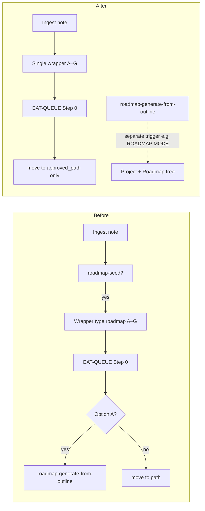

# Plan: Pull roadmap creation logic from ingest and document in report

## Goal

- **Ingest** = capture only: classify, enrich, propose path via a single Decision Wrapper type (A–G = PARA paths), apply-mode = move/rename to approved path. No roadmap “shaping” (no Option A = build project + Roadmap/ + master/phase notes + MOC).
- **Roadmap creation** = separate concern: `roadmap-generate-from-outline` remains a skill but is no longer invoked from ingest apply-mode; it can be triggered later by a dedicated mode (e.g. ROADMAP MODE – generate from outline) or queue entry.
- Produce a single **pullout report** in markdown, written incrementally as each change is made, then saved under `4-Archives/`.

---

## Report file

- **Path:** `4-Archives/Ingest-Roadmap-Pullout-Report-2026-03-05.md` (or dated at time of run; kebab-slug per [Naming-Conventions](3-Resources/Second-Brain/Naming-Conventions.md)).
- **Create at start** with frontmatter (title, created, tags, status, links) and sections:
  - **Purpose** — Why the pullout (ingest = capture only; roadmap shaping diluted responsibilities).
  - **Summary** — High-level list of what was removed and from where.
  - **Removals (by file)** — For each file: what was removed, what it did, why it was there, and any follow-up (e.g. “roadmap tree creation now triggered by X”).
- **Append** to the report immediately after each edit (so the report is always up-to-date). At the end, ensure it is saved under `4-Archives/` (it will already be there if created there from the start).

---

## 1. Create the report and open first section

- Create [4-Archives/Ingest-Roadmap-Pullout-Report-2026-03-05.md](4-Archives/Ingest-Roadmap-Pullout-Report-2026-03-05.md) with:
  - YAML: `title`, `created`, `tags: [ingest, roadmap, pullout, audit]`, `status: complete`, `links` to Rules, Pipelines, Cursor-Skill-Pipelines-Reference.
  - **Purpose** (short): Ingest should capture and place notes; roadmap creation (project tree, master/phase notes, MOC) is a separate responsibility and was removed from ingest apply-mode.
  - **Summary**: bullet list (to be filled as removals are done): e.g. “para-zettel-autopilot: roadmap-seed detection and roadmap-specific wrapper branch removed”, “auto-eat-queue: Option A → roadmap-generate-from-outline and roadmap re-wrap stub removed”, etc.
  - **Removals (by file)** with placeholder subsections for each file below.

---

## 2. para-zettel-autopilot.mdc

**File:** [.cursor/rules/context/para-zettel-autopilot.mdc](.cursor/rules/context/para-zettel-autopilot.mdc)

| What to remove                                                                              | What it did                                                                                                                                                                                                                                                                                            | Why it was there                                                                                         |
| ------------------------------------------------------------------------------------------- | ------------------------------------------------------------------------------------------------------------------------------------------------------------------------------------------------------------------------------------------------------------------------------------------------------ | -------------------------------------------------------------------------------------------------------- |
| **Entire “Roadmap-seed detection” subsection** (lines 31–40)                                | After classify, before wrapper: heuristic (title/headings + ≥3 phase-like sections) set `is_roadmap: true` and `suggested_project_name` on the note.                                                                                                                                                   | Treated roadmap-like notes as a special case so the wrapper could offer “Option A = build roadmap tree.” |
| **“Roadmap-specific branch (is_roadmap: true)”** in Decision Wrapper creation (lines 49–61) | When `is_roadmap: true`: Option A = synthetic “New project + full roadmap tree”; B–G from `propose_para_paths` with 6 candidates; set `wrapper_type: roadmap`, `suggested_project_name`; body filled with roadmap-aware A–G.                                                                           | So apply-mode could call `roadmap-generate-from-outline` when user chose A.                              |
| **Single wrapper path for all notes**                                                       | Replace the two paths (Ingest-Decisions/ vs Roadmap-Decisions) with one: write all wrappers to `Ingest/Decisions/Ingest-Decisions/` only. Remove the sentence that writes “roadmap Decision Wrappers to … Roadmap-Decisions/” and the corresponding `obsidian_ensure_structure` for Roadmap-Decisions. | Roadmap-specific wrappers are no longer a separate type.                                                 |
| **Skills line** (line 19)                                                                   | The phrase “For notes detected as roadmap seeds … later apply-mode runs call roadmap-generate-from-outline when the user chooses Option A.”                                                                                                                                                            | Remove so ingest no longer references roadmap generation.                                                |

**After edits:** Ingest uses one wrapper type: A–G from `obsidian_propose_para_paths` with `max_candidates = "7"` for every note; no `is_roadmap`, no `wrapper_type: roadmap`, no Roadmap-Decisions path.

**Append to report:** Under “Removals (by file)” add a subsection for para-zettel-autopilot with the table above and the “After edits” line.

---

## 3. auto-eat-queue.mdc

**File:** [.cursor/rules/context/auto-eat-queue.mdc](.cursor/rules/context/auto-eat-queue.mdc)

| What to remove                                                                        | What it did                                                                                                                                                                                                                 | Why it was there                                                                |
| ------------------------------------------------------------------------------------- | --------------------------------------------------------------------------------------------------------------------------------------------------------------------------------------------------------------------------- | ------------------------------------------------------------------------------- |
| **Step 0 – “Roadmap wrappers (wrapper_type: roadmap, Option A)” block** (lines 66–78) | When `wrapper_type: roadmap` or `is_roadmap: true` and Option A chosen: call `roadmap-generate-from-outline` (create project, Roadmap/, master, phases, MOC, move seed to Source); then mark wrapper processed and archive. | To build a full roadmap tree from an ingest seed when the user picked Option A. |
| **Step 0 – Re-wrap “Roadmap wrappers (stub)” bullet** (line 64)                       | Re-wrap for roadmap: archive to Re-Wrap/Roadmap-Decisions, create new wrapper under Roadmap-Decisions.                                                                                                                      | Mirrored ingest-decision re-wrap for the (now-removed) roadmap wrapper type.    |
| **References to Roadmap-Decisions**                                                   | All mentions of `Roadmap-Decisions` in Step 0 enumeration, processed-wrapper archive, and re-wrap. Use a single subfolder (Ingest-Decisions) only.                                                                          | Only one wrapper type remains.                                                  |

**After edits:** Step 0 path-apply is only: “run apply-mode INGEST (move/rename to approved_path)” for every approved wrapper. No branch on `wrapper_type` or `is_roadmap`; no call to `roadmap-generate-from-outline`. Re-wrap is a single flow (ingest-decision style only); archive to Re-Wrap/Ingest-Decisions and create new wrapper under Ingest/Decisions/Ingest-Decisions/.

**Append to report:** Subsection for auto-eat-queue with the table and “After edits” line.

---

## 4. roadmap-generate-from-outline skill (document only)

**File:** [.cursor/skills/roadmap-generate-from-outline/SKILL.md](.cursor/skills/roadmap-generate-from-outline/SKILL.md)

- **Do not delete the skill.** Update the “When to use” section: remove the trigger “EAT-QUEUE Step 0 (CHECK_WRAPPERS) when wrapper_type: roadmap and approved_option: A”. Replace with a trigger such as: “When the user runs **ROADMAP MODE – generate from outline** (or a dedicated queue mode) with a note path (e.g. a roadmap outline already in PARA or Ingest): create project + Roadmap/ + master + phase notes + MOC from that note.” Optionally add a note: “Previously invoked from ingest apply-mode when user chose Option A on a roadmap Decision Wrapper; that path was removed so ingest only captures and places notes.”

**Append to report:** Subsection for roadmap-generate-from-outline: “Invocation from ingest apply-mode removed; trigger documented as ROADMAP MODE (or queue). Skill body unchanged.”

---

## 5. Sync and docs

- **Sync:** Update [.cursor/sync/rules/context/para-zettel-autopilot.md](.cursor/sync/rules/context/para-zettel-autopilot.md) and [.cursor/sync/rules/context/auto-eat-queue.md](.cursor/sync/rules/context/auto-eat-queue.md) to match the .mdc edits. Append to report: “Sync copies updated.”
- **Docs to update** (and document in report):
  - [3-Resources/Second-Brain/Skills.md](3-Resources/Second-Brain/Skills.md): `roadmap-generate-from-outline` row — change “queue / ingest apply-mode” and “roadmap-ingest (Decision Wrapper option A)” to a non-ingest trigger (e.g. “queue / ROADMAP MODE”).
  - [3-Resources/Second-Brain/Cursor-Skill-Pipelines-Reference.md](3-Resources/Second-Brain/Cursor-Skill-Pipelines-Reference.md): Remove or reword any sentence that says Option A in ingest apply calls roadmap-generate-from-outline; add a note that roadmap tree generation is triggered by ROADMAP MODE (or dedicated queue mode), not ingest.
  - [3-Resources/Second-Brain/Rules.md](3-Resources/Second-Brain/Rules.md): In para-zettel-autopilot and auto-eat-queue context rows, remove references to roadmap Option A, roadmap wrappers, and Roadmap-Decisions.
  - [3-Resources/Second-Brain/Queue-Sources.md](3-Resources/Second-Brain/Queue-Sources.md): Step 0 description — remove roadmap Option A and Roadmap-Decisions; say all wrappers get apply-mode move/rename only.
  - [3-Resources/Second-Brain/Vault-Layout.md](3-Resources/Second-Brain/Vault-Layout.md): Ingest/Decisions and 4-Archives/Ingest-Decisions — mention only Ingest-Decisions subfolder (or “subfolders mirror live structure” without emphasizing Roadmap-Decisions). Re-Wrap: same (only Ingest-Decisions if Roadmap-Decisions is dropped).
  - [3-Resources/Second-Brain/Pipelines.md](3-Resources/Second-Brain/Pipelines.md): Phase 2 / Decision Wrapper — remove “roadmap Option A” and “Roadmap-Decisions”; ingest apply = move/rename to approved path only.
  - **User-flow / structure docs** under Second-Brain (e.g. [Rules-Structure-Detailed.md](3-Resources/Second-Brain/Second-Brain-User-Flows/Rules-Structure-Detailed.md)): Any line that says “roadmap Option A → roadmap-generate-from-outline” or “Path-apply: roadmap Option A” — change to “Path-apply: apply-mode ingest (move/rename to approved_path only)”.

For each doc, append one line to the report: “Doc X: [brief change].”

---

## 6. Optional: ROADMAP MODE trigger for roadmap-generate-from-outline

- If you want a clear trigger for “generate roadmap tree from this note” (without ingest): add to [Cursor-Skill-Pipelines-Reference.md](3-Resources/Second-Brain/Cursor-Skill-Pipelines-Reference.md) (and optionally a short context rule or Queue-Sources mode) a trigger such as **ROADMAP MODE – generate from outline** with `source_file` or path to the outline note; dispatch runs `roadmap-generate-from-outline` for that note. Document in the report: “New trigger: ROADMAP MODE – generate from outline (optional).”

---

## 7. Finalize report and close

- In the report, ensure **Summary** has a bullet for every removal (para-zettel, auto-eat-queue, skill trigger, sync, each doc).
- Add a short **Follow-up** section: “Roadmap creation: use ROADMAP MODE (or queue) with path to outline; ingest only captures and moves notes to a chosen PARA path.”
- Ensure the report lives at `4-Archives/Ingest-Roadmap-Pullout-Report-2026-03-05.md` (or the chosen dated path). No move needed if it was created there.
- Optionally add to [.cursor/sync/changelog.md](.cursor/sync/changelog.md) an entry: “Ingest roadmap pullout: roadmap-seed, roadmap wrapper branch, Option A → roadmap-generate-from-outline removed; report in 4-Archives.”

---

## Order of operations

1. Create report in 4-Archives with structure and Purpose/Summary/Removals placeholder.
2. Edit para-zettel-autopilot.mdc → append report subsection for para-zettel.
3. Edit auto-eat-queue.mdc → append report subsection for auto-eat-queue.
4. Edit roadmap-generate-from-outline SKILL (trigger only) → append report subsection.
5. Update sync copies → append report line.
6. Update Skills.md, Cursor-Skill-Pipelines-Reference, Rules, Queue-Sources, Vault-Layout, Pipelines, User-Flow/structure docs → append one line per doc to report.
7. (Optional) Add ROADMAP MODE trigger and document in report.
8. Finalize report Summary and Follow-up; optionally changelog.

---

## Diagram (before vs after)

