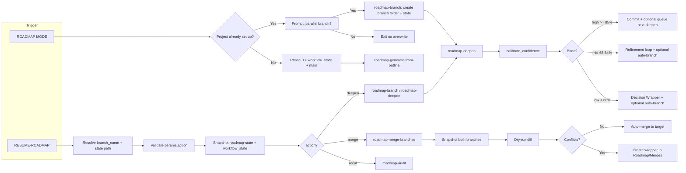

# Roadmap two-command funnel — integration spec

## Scope and principles

- **Two-command funnel:** ROADMAP MODE = setup only; RESUME-ROADMAP = single entry. All behavior (deepen, recal, revert, merge, sync, handoff-audit, expand) is **params.action**; no new queue modes.
- **Confidence bands in deepen:** Reuse existing [confidence-loops](.cursor/rules/always/confidence-loops.mdc) thresholds (high ≥85%, mid 68–84%, low <68%). Apply per deepen iteration: high → commit and optionally queue next deepen; mid → one refinement loop, optional auto-branch; low → proposal + Decision Wrapper, optional auto-branch. Makes RESUME-ROADMAP self-regulating (deepen when confident, refine/loop when mid-band, propose or branch when uncertain).
- **Branches first-class:** Parallel paths are cheap to spin up; **merging is deliberate and auditable** via full **roadmap-merge-branches** skill (dry-run, conflict wrapper, archive source; never delete).
- **Safety invariants:** Snapshot before any state change (workflow_state, decisions-log, phase notes); dry_run pattern on structural moves; never delete branch notes — only move to archive. Step 0 and existing backup/snapshot rules unchanged.

---

## Canonical-docs alignment (no accidental drops)

This plan is explicitly aligned with the following so nothing is dropped when implementing against the canonical docs:


| Requirement                                                                                                | Where in plan                                                                | Canonical ref                                                                                                                                                                                  |
| ---------------------------------------------------------------------------------------------------------- | ---------------------------------------------------------------------------- | ---------------------------------------------------------------------------------------------------------------------------------------------------------------------------------------------- |
| **Parallel branch support** (branch_name, Roadmap/Branches//, roadmap-branch)                              | §1b, §3, §4, §6, §7; deepen always receives branch context                   | [Vault-Layout](3-Resources/Second-Brain/Vault-Layout.md) § Roadmap state artifacts; plan §1b branch_name param                                                                                 |
| **Confidence bands on deepen** (calibrate_confidence, mid-band loop, low-band wrapper, auto-branch on low) | §4a full section; §4 roadmap-deepen; Log table                               | [confidence-loops](.cursor/rules/always/confidence-loops.mdc); [Parameters](3-Resources/Second-Brain/Parameters.md)                                                                            |
| **Merge action** (action "merge", roadmap-merge-branches, dry-run + wrapper)                               | §3 action enum; §4b full section; §7 table                                   | [Skills](3-Resources/Second-Brain/Skills.md) (expand-road-assist is section-only; merge is separate skill)                                                                                     |
| **Snapshot gate before deepen / state updates**                                                            | §3 step 3; §4a/§4b "Snapshot both"; **enforced** below in §4 and §4b         | [mcp-obsidian-integration](.cursor/rules/always/mcp-obsidian-integration.mdc); [Vault-Layout](3-Resources/Second-Brain/Vault-Layout.md) § Roadmap state artifacts                              |
| **workflow_state + branch_name** (frontmatter, branch folder creation)                                     | §2, §6; §7 Config + Vault-Layout row                                         | [Vault-Layout](3-Resources/Second-Brain/Vault-Layout.md) — **must add** workflow_state.branch_name and branch folder creation logic to that section                                            |
| **Commander / prompt-crafter for branches**                                                                | §5 "Resume on branch"; **explicit** below: example + "Resume + Branch" macro | [Prompt-Crafter-Structure-Detailed](3-Resources/Second-Brain/Second-Brain-User-Flows/Prompt-Crafter-Structure-Detailed.md); [Queue-Alias-Table](3-Resources/Second-Brain/Queue-Alias-Table.md) |
| **Testing / audit coverage**                                                                               | **Added** below in §8: Testing.md, Regression-Stability-Log, PARA fixtures   | [Testing](3-Resources/Second-Brain/Testing.md); [Regression-Stability-Log](3-Resources/Second-Brain/Regression-Stability-Log.md)                                                               |


**Four targeted tweaks (must appear in implementation):**

1. **branch_name param + roadmap-branch skill** — In Config: `prompt_defaults.roadmap.branch_name: "main"`. New skill `.cursor/skills/roadmap-branch/SKILL.md`: ensure branch folder, copy/link state, call roadmap-deepen in branch context. Deepen step **always** receives `branch_name` (from params or workflow_state).
2. **Confidence bands in deepen** — In roadmap-deepen: after generation, call **calibrate_confidence** (or equivalent). High ≥85% → commit + queue next deepen. Mid 68–84% → refinement loop + optional auto-branch. Low <68% → Decision Wrapper (A–G: accept / refine / branch new path / revert). Log **band**, **pre_loop_conf**, **post_loop_conf** in workflow_state Log table when mid-band loop runs.
3. **Merge action** — `action: "merge"` with `source_branch` / `target_branch`. Skill: dry_run diff, snapshot both branches, create merge wrapper in Roadmap/Merges/ if conflicts; on approval apply and archive source (never delete).
4. **Snapshot + docs sync** — **Explicit snapshot line** in deepen and merge steps: before writing workflow_state or creating/updating phase notes, call obsidian-snapshot (per mcp-obsidian-integration) for roadmap-state and workflow_state. Add **flow diagram** (below) showing branch_name and confidence branch. Add **one line** to Queue-Alias-Table and Prompt-Crafter-Structure-Detailed: example queue entry with `params.branch_name` and Commander "Resume on branch X" / "Resume + Branch".

---

## 1. ROADMAP MODE = setup-only (+ parallel-branch check)

**Reference:** [Pipelines.md](3-Resources/Second-Brain/Pipelines.md) § ROADMAP MODE; [Skills.md](3-Resources/Second-Brain/Skills.md) → roadmap-generate-from-outline.

**Current problem:** [.cursor/rules/context/auto-roadmap.mdc](.cursor/rules/context/auto-roadmap.mdc) still has "if state exists and in-progress → run roadmap-resume". That conflates setup with continue.

**Fix (must):**

- In **auto-roadmap.mdc**, split logic by **trigger**:
  - **Trigger is ROADMAP MODE** (or "ROADMAP MODE – generate from outline"):
    1. Resolve project_id (from note path, queue source_file, or user input).
    2. **Check if project already set up:** If `1-Projects/<project_id>/Roadmap/roadmap-state.md` exists (and optionally workflow_state.md exists), do **not** run Phase 0 or roadmap-generate-from-outline. Instead: **prompt the user in chat** that a roadmap already exists for this project and ask: "Should the agent set up a **parallel branch**? (Yes / No)." If user confirms parallel branch, proceed to parallel-branch setup (see §1b). If user says No, exit without creating state or overwriting anything.
    3. If project is **not** set up: Run **Phase 0 only** — ensure backup, create roadmap-state.md, decisions-log.md, distilled-core.md, **workflow_state.md** (via roadmap-generate-from-outline, see §2), then run **roadmap-generate-from-outline** (master + phase notes + MOC). Set roadmap-state `status: in-progress`. Do **not** run roadmap-resume or any continue logic.
  - **Remove** the "state exists and in-progress → run roadmap-resume" branch from the ROADMAP MODE path entirely. Resume is only for RESUME-ROADMAP trigger.

**Parallel-branch development (1b):**

- **branch_name param:** On RESUME-ROADMAP (and optionally on ROADMAP MODE for the initial seed), support `**params.branch_name`**. Default: `"main"`. When different (e.g. `"experimental-grid"`, `"v2-mobile"`), the deepen step creates/uses `Roadmap/Branches/<branch_name>/` — a parallel copy of the main structure with its own workflow_state.md, phase notes, etc. Uses the existing `Roadmap/Branches/` folder from Vault-Layout (no new top-level folders).
- **When user confirms parallel branch (ROADMAP MODE):** Prompt: "A roadmap already exists for this project. Set up a parallel branch? (Yes / No)." If Yes, create `Roadmap/Branches/<branch_name>/` (branch_name from user input or generated e.g. `parallel-YYYYMMDD`) with its own state files and run deepen in that branch context (see §4).
- **workflow_state schema (one new key):** Add `**branch_name: "main"`** (or `"experimental-grid"`, `"v2-mobile"`, etc.) to workflow_state frontmatter. All state resolution: if `branch_name !== "main"`, read/write under `Roadmap/Branches/<branch_name>/`.

**Files to change:**

- [.cursor/rules/context/auto-roadmap.mdc](.cursor/rules/context/auto-roadmap.mdc): Split ROADMAP MODE block (already-set-up check → user prompt → parallel-branch path or exit); Phase 0 only when not set up; remove resume from ROADMAP MODE. In RESUME-ROADMAP branch, read `params.branch_name` (default "main") and pass branch context into roadmap-branch or roadmap-deepen.

---

## 2. workflow_state creation in Phase 0

**Reference:** [Vault-Layout.md](3-Resources/Second-Brain/Vault-Layout.md) § Roadmap state artifacts; [mcp-obsidian-integration](.cursor/rules/always/mcp-obsidian-integration.mdc) (snapshot before state update).

**Current:** workflow_state.md is not guaranteed to be created on first run.

**Fix (must):**

- In [.cursor/skills/roadmap-generate-from-outline/SKILL.md](.cursor/skills/roadmap-generate-from-outline/SKILL.md), **after** Phase 0 artifacts (roadmap-state, decisions-log, distilled-core) are created (by caller or inside skill), add an explicit step:
  - If **workflow_state.md** is missing at `1-Projects/<project_id>/Roadmap/workflow_state.md` (or at `Roadmap/Branches/<branch_name>/` when branch_name ≠ "main"), **create** it with the exact schema from Vault-Layout plus `**branch_name`**: frontmatter `current_phase`, `current_subphase_index`, `status` (in-progress), `automation_level` (semi), `last_auto_iteration` (ISO or empty), `iterations_per_phase` (e.g. `{}`), `max_iterations_per_phase` (e.g. 10), optional `max_iterations_total`, `**branch_name**` ("main" or branch slug); body `**## Log**` with append-only table (columns: **timestamp | action | target | confidence | band | outcome | branch | notes**; when mid-band refinement runs, include **pre_loop_conf | post_loop_conf**). Cross-post to decisions-log.md and Backup-Log when snapshot taken. When branch_name ≠ "main", create workflow_state under `Roadmap/Branches/<branch_name>/`.
  - **Snapshot:** Snapshot **roadmap-state.md** before and after any state write (per mcp-obsidian-integration). When creating workflow_state for the first time, snapshot roadmap-state after creation so the "Phase 0 complete" state is captured.

**Files to change:**

- [.cursor/skills/roadmap-generate-from-outline/SKILL.md](.cursor/skills/roadmap-generate-from-outline/SKILL.md): Add step "Create workflow_state.md if missing" with schema and path; document snapshot requirement.

---

## 3. RESUME-ROADMAP = single dispatcher (normalization + params.action)

**Reference:** [Queue-Sources.md](3-Resources/Second-Brain/Queue-Sources.md) § Queue mode aliases.

**Current:** [.cursor/rules/context/auto-eat-queue.mdc](.cursor/rules/context/auto-eat-queue.mdc) still treats RECAL-ROAD, REVERT-PHASE, SYNC-PHASE-OUTPUTS, HANDOFF-AUDIT, RESUME-FROM-LAST-SAFE, EXPAND-ROAD as separate modes with separate dispatch branches.

**Fix (must):**

- In **auto-eat-queue.mdc**, in the **Dispatch** step (step 5), add a **normalization block** before "Match mode to pipeline":
  - For each entry, if `mode` is one of: **RECAL-ROAD**, **REVERT-PHASE**, **SYNC-PHASE-OUTPUTS**, **HANDOFF-AUDIT**, **RESUME-FROM-LAST-SAFE**, **EXPAND-ROAD**, rewrite the entry **in-memory** to `mode: "RESUME-ROADMAP"` and set or merge **params** so that:
    - RECAL-ROAD → `params: { action: "recal" }` (merge with existing params)
    - REVERT-PHASE → `params: { action: "revert-phase", phase: <from payload or params> }`
    - SYNC-PHASE-OUTPUTS → `params: { action: "sync-outputs" }`
    - HANDOFF-AUDIT → `params: { action: "handoff-audit", phase_number?: <optional> }`
    - RESUME-FROM-LAST-SAFE → `params: { action: "resume-from-last-safe" }`
    - EXPAND-ROAD → `params: { action: "expand", sectionOrTaskLocator: <from payload>, userText: <from prompt> }`
  - Preserve `source_file`, `id`, and other fields; only change mode and params.
  - Then the **single** branch for all roadmap continuation is: **RESUME-ROADMAP** → call auto-roadmap with merged params (queue + prompt_defaults.roadmap + user_guidance). Canonical order and Watcher-Result stay unchanged (entry still logged under original id).

**In auto-roadmap.mdc (RESUME-ROADMAP path):**

- When trigger is **RESUME-ROADMAP** (or "Resume roadmap" from queue):
  1. Resolve project_id and **params.branch_name** (default `"main"`). Resolve state paths: main = `Roadmap/`; else `Roadmap/Branches/<branch_name>/`.
  2. **Validate** `params.action` against allowed enum: `deepen | recal | revert-phase | sync-outputs | handoff-audit | resume-from-last-safe | expand | merge | sync | deepen-branch`. If missing, default to `deepen`. **merge:** dry-run diff branches, snapshot both, create merge wrapper on conflict, apply on approval. If invalid, log to Errors.md and append failure to Watcher-Result; do not run.
  3. **Safety:** Always **snapshot** roadmap-state and workflow_state **before** any deepen, recal, or revert step (per mcp-obsidian-integration).
  4. Branch by **params.action** and call the corresponding skill(s). **Actions (must include):** deepen (default), recal, revert-phase, sync-outputs, handoff-audit, resume-from-last-safe, expand, **merge** (dry-run diff branches, snapshot both, create merge wrapper on conflict, apply on approval), sync, deepen-branch. For **deepen**: call **roadmap-branch** (or roadmap-deepen with branch context). roadmap-branch ensures branch folder exists, copies/links state into branch if needed, then calls roadmap-deepen inside that branch context. If **iterations cap hit** in workflow_state, set status to blocked and **queue** one RESUME-ROADMAP entry with `params.action: "recal"` (no infinite deepen).

**RESUME-ROADMAP params (canonical — do not drop):**

```
params:
  action: deepen (default) | recal | revert | sync | handoff-audit | expand | resume-from-last-safe | merge | deepen-branch
  branch_name: "main" (default) | custom string → targets Roadmap/Branches/<name>/
  confidence_mode: "auto" (default) | "manual" → enables calibrate_confidence + band logic in deepen
```

Plus **granularity**, **phase** (for revert-phase / handoff-audit), **sectionOrTaskLocator**, **queue_next**; reuse **handoff_gate**, **min_handoff_conf**, **focus**. Reference: [Parameters.md](3-Resources/Second-Brain/Parameters.md), [Prompt-Crafter-Structure-Detailed.md](3-Resources/Second-Brain/Second-Brain-User-Flows/Prompt-Crafter-Structure-Detailed.md) (merge order: queue → user_guidance → Config roadmap_defaults).

**Files to change:**

- [.cursor/rules/context/auto-eat-queue.mdc](.cursor/rules/context/auto-eat-queue.mdc): Add normalization block; single RESUME-ROADMAP branch.
- [.cursor/rules/context/auto-roadmap.mdc](.cursor/rules/context/auto-roadmap.mdc): RESUME-ROADMAP branch with action enum, validation, snapshot-before, branch resolution, cap → queue recal.

---

## 4. roadmap-branch (tiny skill) + roadmap-deepen

**Reference:** [Skills.md](3-Resources/Second-Brain/Skills.md); [Cursor-Skill-Pipelines-Reference](3-Resources/Second-Brain/Cursor-Skill-Pipelines-Reference.md) (skill chaining).

**Add one small skill: roadmap-branch** (or extend roadmap-deepen with branch handling). It does **three things only**:

1. If **branch_name ≠ "main"**, ensure `Roadmap/Branches/<branch_name>/` exists (`obsidian_ensure_structure`).
2. Copy or link the necessary state files (workflow_state, decisions-log, distilled-core) into the branch if the branch folder was just created or is empty (so the branch has its own workflow_state.md, etc.).
3. Call **roadmap-deepen** inside that branch context (resolved state path = `Roadmap/Branches/<branch_name>/` when branch_name ≠ "main").

**roadmap-deepen** remains the internal skill that does the actual deepen step.

- **Safety (required):** Snapshot roadmap-state + workflow_state before any write (mcp-obsidian-integration gate). Before writing workflow_state or creating/updating any phase note, call **obsidian-snapshot** (per-change) for **roadmap-state** and **workflow_state** at the resolved branch path.
- If **confidence_mode=auto**, run **calibrate_confidence** after generation; high → commit, mid → refinement loop (max 2), low → Decision Wrapper + optional auto-branch.
- Then: read workflow_state + roadmap-state from the **resolved** path (caller **always** passes branch_name / branch context); compute next target; create folder/note(s) per [Roadmap Structure](Roadmap Structure.md); update workflow_state (increment iterations, append Log row); if under cap, append one RESUME-ROADMAP line with `params: { action: "deepen", branch_name: <same> }`. If at cap, do not append; caller sets status blocked and queues action recal.

**Files to change:**

- New: [.cursor/skills/roadmap-branch/SKILL.md](.cursor/skills/roadmap-branch/SKILL.md) (or add the three steps to [.cursor/skills/roadmap-deepen/SKILL.md](.cursor/skills/roadmap-deepen/SKILL.md) and have auto-roadmap call roadmap-deepen with branch_name so it does steps 1–2 then 3). Reference in auto-roadmap and Skills.md as "branch context + deepen".

---

## 4a. Confidence bands in deepen (self-regulating loop)

**Reference:** [confidence-loops](.cursor/rules/always/confidence-loops.mdc) (reuse high ≥85%, mid 68–84%, low <68%); [calibrate_confidence](.cursor/rules/always/mcp-obsidian-integration.mdc) or lightweight rule.

**Apply bands per deepen iteration** inside **roadmap-deepen** (or its extension):

- After generating the next chunk (sub-phase, tertiary note, pseudo-code block, task list), run a **lightweight confidence calibration** (reuse `calibrate_confidence` MCP tool or simple rule).
- **Band outcomes:**
  - **High (≥85%)** → commit immediately: create note/folder, append to workflow_state Log (timestamp, action, target, confidence, band, outcome, branch, notes), update phase progress; optional auto-queue next RESUME-ROADMAP with `action: "deepen"`, same branch_name.
  - **Mid (68–84%)** → one refinement loop: append feedback callout to the new note ("Mid confidence — review needed"); queue self-follow-up RESUME-ROADMAP with `action: "deepen"`, `params.loop_count` incremented (cap at 2–3 per config). Optionally if **params.auto_branch_on_mid: true**: create branch e.g. `deepen-iter-{loop_count}-review-{timestamp}`, copy current phase state into branch, queue RESUME-ROADMAP on that branch with action deepen + user_guidance from mid rationale.
  - **Low (<68%)** → proposal mode: create note with **#review-needed** tag; add **Decision Wrapper** (A–G: accept as-is / refine with guidance / branch new path / revert); set **status: blocked** on workflow_state until resolved. If **params.auto_branch_on_low: true** (default): auto-create branch, copy state into branch, queue RESUME-ROADMAP on branch with action deepen + user_guidance.

**Branch trigger on low/mid:** When mid or low, optionally auto-suggest or auto-create branch (config-driven): `branch_name: "deepen-iter-{loop_count}-review-{timestamp}"`; copy current phase state into branch; queue RESUME-ROADMAP on branch with `action: "deepen"` + user_guidance from rationale.

**Config knobs** (see §5): `roadmap.confidence` (high_threshold, mid_threshold, refinement_loops_max, auto_branch_on_mid, auto_branch_on_low); `roadmap.deepen` (default_granularity, max_iterations_per_phase).

**Logging:** Every deepen step appends to workflow_state.md Log table. Columns: **timestamp | action | target | confidence | band | outcome | branch | notes**; when mid-band refinement loop runs, also log **pre_loop_conf | post_loop_conf** (per [confidence-loops](.cursor/rules/always/confidence-loops.mdc)). Example: `| 2026-03-08 14:00 | deepen | Phase-5.2.3 | 0.72 | mid | refinement queued | main | added pseudo-code sketch |` (and optionally pre_loop_conf: 72, post_loop_conf: 78). Cross-post to decisions-log.md and Backup-Log when snapshot taken.

---

## 4b. Branch merging (roadmap-merge-branches skill)

**Trigger:** RESUME-ROADMAP with `**action: "merge"`** + `**params.source_branch**`, `**params.target_branch**` (default "main"), optional `**params.merge_strategy**`: `"keep-both" | "rebase" | "cherry-pick" | "resolve-conflicts"`.

**Behavior:**

1. **Snapshot gate (enforced):** Before any merge write, call **obsidian-snapshot** (per-change) for **both** branches' workflow_state and roadmap-state (and relevant phase notes). Per [mcp-obsidian-integration](.cursor/rules/always/mcp-obsidian-integration.mdc) — no merge commit without prior snapshot of both branches.
2. **Dry-run compare:** Diff decisions-log, distilled-core, phase progress, new notes/folders between source and target.
3. **If clean overlap** → auto-merge: append unique decisions from source to target decisions-log; re-link or copy new notes into target branch; update target workflow_state and roadmap-state.
4. **If conflicts** → create **merge wrapper note** in `**Roadmap/Merges/`** with A–G options (e.g. "A: take source branch decisions", "B: take target", "C: manual reconcile", "R: re-try with guidance"). Do not apply until user sets **approved: true** on wrapper.
5. **On approval** → apply chosen option to target branch; **archive** source branch (move to `**Roadmap/Branches/Archive/<source_branch>-merged-YYYYMMDD/`**). Never delete — only move.

**Safety:** Never auto-delete branch notes; only move to archive subfolder. Snapshot both branches before merge commit. Log merge rationale + before/after diff summary in workflow_state Log and decisions-log.

**Commander macro:** "Merge branch X into main" → queue RESUME-ROADMAP with `params: { action: "merge", source_branch: "X", target_branch: "main" }`.

**Files:** New skill [.cursor/skills/roadmap-merge-branches/SKILL.md](.cursor/skills/roadmap-merge-branches/SKILL.md). Vault-Layout: document **Roadmap/Merges/** (merge wrappers) and **Roadmap/Branches/Archive/** (archived branches post-merge).

---

## 4c. Other actions (handoff-audit, sync)

- **handoff-audit:** Already in enum. When **params.handoff_gate: true**, run after deepen (or on demand): check phase completion criteria (e.g. pseudo-code coverage, task density), propose advance or refine. See existing [hand-off-audit](.cursor/skills/hand-off-audit/SKILL.md).
- **sync:** `**action: "sync"`** — propagate distilled-core (and optionally decisions-log) changes across branches (e.g. after merge or recal). Useful to keep branch views consistent. No new queue mode; RESUME-ROADMAP with params.action: "sync", optional params.branch_name or params.branches (list).

---

## 5. Config + prompt crafter + validation

**Add:**

- In [3-Resources/Second-Brain-Config.md](3-Resources/Second-Brain-Config.md) (or [Parameters.md](3-Resources/Second-Brain/Parameters.md)), add:

```yaml
  prompt_defaults.roadmap:
    action: deepen
    branch_name: "main"
    confidence_mode: "auto"     # enables calibrate_confidence + band logic in deepen
    max_iterations_per_phase: 10
    granularity: "phase-only"   # overridden per-phase in deepen
  # Optional guard:
  max_parallel_branches: 5

  # Confidence bands and deepen (integrated)
  roadmap:
    confidence:
      high_threshold: 0.85
      mid_threshold: 0.68
      refinement_loops_max: 2
      auto_branch_on_mid: false   # default manual review
      auto_branch_on_low: true
    deepen:
      default_granularity: "tertiary-with-pseudo-code-tasks"
      max_iterations_per_phase: 12
  

```

- Update [Prompt-Crafter-Structure-Detailed.md](3-Resources/Second-Brain/Second-Brain-User-Flows/Prompt-Crafter-Structure-Detailed.md) and [Queue-Alias-Table.md](3-Resources/Second-Brain/Queue-Alias-Table.md): how Commander "Resume roadmap" / "Recal" / "Revert phase N" and **"Resume on branch: experimental-grid"** build a queue entry with `mode: "RESUME-ROADMAP"` and `params.action` / **params.branch_name**. Merge order: queue params → user_guidance → Config prompt_defaults.roadmap.
- In auto-eat-queue (RESUME-ROADMAP branch): validate **params.action** against the enum; reject and log to Errors.md if invalid.

**Optional (high value):** Commander macros: "Resume + Deepen", "Resume + Recal", "Revert Phase N", "Resume on branch: " that append with correct mode and params.

---

## 6. State and branch schema (Vault-Layout + skills)

**Add for parallel branches:**

- **workflow_state.md** frontmatter: add `**branch_name: "main"`** (or `"experimental-grid"`, `"v2-mobile"`, etc.). roadmap-state can mirror this when stored under a branch folder.
- **Vault-Layout.md:** In **§ Roadmap state artifacts**, add **workflow_state** frontmatter key `**branch_name`** and document **branch folder creation logic**: when `branch_name !== "main"`, state lives under `Roadmap/Branches/<branch_name>/` and that folder is created by roadmap-branch (obsidian_ensure_structure). Formalize `**Roadmap/Branches/<name>/`** section: when `branch_name !== "main"`, state artifacts (workflow_state, decisions-log, distilled-core, and branch-scoped phase notes) live there. All roadmap skills resolve state path from **params.branch_name** (default "main") so the AI never writes to the wrong branch.
- **Skills:** roadmap-branch, roadmap-deepen, roadmap-resume, roadmap-audit, roadmap-revert, etc. receive **resolved state path** or (project_id + branch_name) from auto-roadmap.

---

## 7. Exact files (summary)


| File                                                                                                                                      | Change                                                                                                                                                                                                                                                                                                                                                  |
| ----------------------------------------------------------------------------------------------------------------------------------------- | ------------------------------------------------------------------------------------------------------------------------------------------------------------------------------------------------------------------------------------------------------------------------------------------------------------------------------------------------------- |
| **[.cursor/rules/context/auto-roadmap.mdc](.cursor/rules/context/auto-roadmap.mdc)**                                                      | ROADMAP MODE setup-only; when project exists, prompt for parallel branch. RESUME-ROADMAP: branch_name handling; validate action enum (incl. merge, sync); snapshot before any state change; call roadmap-branch → roadmap-deepen (with confidence bands), or roadmap-merge-branches, or other skills by action.                                         |
| **[.cursor/skills/roadmap-branch/SKILL.md](.cursor/skills/roadmap-branch/SKILL.md)**                                                      | Ensure `Roadmap/Branches/<branch_name>/` exists; copy/link state into branch; call roadmap-deepen in branch context.                                                                                                                                                                                                                                    |
| **[.cursor/skills/roadmap-deepen/SKILL.md](.cursor/skills/roadmap-deepen/SKILL.md)**                                                      | After generating chunk, run confidence calibration. High → commit, append Log, optional queue next deepen. Mid → refinement loop, optional auto-branch; append Log (band, outcome). Low → proposal + Decision Wrapper, set status blocked; optional auto_branch_on_low. Log table: timestamp, action, target, confidence, band, outcome, branch, notes. |
| **[.cursor/skills/roadmap-merge-branches/SKILL.md](.cursor/skills/roadmap-merge-branches/SKILL.md)**                                      | Snapshot both branches; dry-run diff; if clean → auto-merge; if conflicts → create wrapper in Roadmap/Merges/; on approval → apply and archive source to Roadmap/Branches/Archive/. Never delete.                                                                                                                                                       |
| **[3-Resources/Second-Brain/Vault-Layout.md](3-Resources/Second-Brain/Vault-Layout.md)**                                                  | Formalize **Roadmap/Branches/****/**; add **Roadmap/Merges/** (merge wrappers); **Roadmap/Branches/Archive/** (archived branches post-merge).                                                                                                                                                                                                           |
| **[3-Resources/Second-Brain-Config.md](3-Resources/Second-Brain-Config.md)**                                                              | prompt_defaults.roadmap (action, branch_name, max_iterations_per_phase, granularity); max_parallel_branches; **roadmap.confidence** (high_threshold, mid_threshold, refinement_loops_max, auto_branch_on_mid, auto_branch_on_low); **roadmap.deepen** (default_granularity, max_iterations_per_phase).                                                  |
| **[Queue-Sources.md](3-Resources/Second-Brain/Queue-Sources.md) + [Queue-Alias-Table.md**](3-Resources/Second-Brain/Queue-Alias-Table.md) | Document params.branch_name, params.action (incl. merge, sync); Commander "Resume on branch", "Merge branch X into main".                                                                                                                                                                                                                               |


---

## 8. Queue-Alias-Table, docs sync, and testing/audit

- **Queue-Alias-Table.md:** Explicitly list old modes as aliases, e.g. RECAL-ROAD → RESUME-ROADMAP with `params.action: "recal"`; REVERT-PHASE → RESUME-ROADMAP with `params.action: "revert-phase"`, `params.phase: N`. **Add one example** for branch: e.g. `RESUME-ROADMAP` with `params: { action: "deepen", branch_name: "experimental-grid" }` and Commander macro **"Resume on branch: ****"** (or "Resume + Branch").
- **Prompt-Crafter-Structure-Detailed.md:** Add **one line or row** for branch: how to build queue entry with `params.branch_name` and Commander "Resume on branch X" so prompt crafter can emit correct RESUME-ROADMAP + branch_name.
- Update: [Pipelines.md](3-Resources/Second-Brain/Pipelines.md) (ROADMAP MODE = setup only; RESUME-ROADMAP = single continue; optional controls via params), [Backbone.md](3-Resources/Second-Brain/Backbone.md), [Queue-Sources.md](3-Resources/Second-Brain/Queue-Sources.md), [Skills.md](3-Resources/Second-Brain/Skills.md), [Cursor-Skill-Pipelines-Reference.md](3-Resources/Second-Brain/Cursor-Skill-Pipelines-Reference.md). If apply-from-wrapper or Step 0 touches roadmap, note that RESUME-ROADMAP and branch resolution apply.
- **Testing / audit coverage:** Update [Testing.md](3-Resources/Second-Brain/Testing.md) and [Regression-Stability-Log](3-Resources/Second-Brain/Regression-Stability-Log.md) (or equivalent): add coverage for **roadmap-deepen** (one step, confidence bands), **branch creation** (roadmap-branch, state under Roadmap/Branches//), and **confidence-gated deepen** (high commit, mid refinement, low wrapper). Note that **PARA regression fixtures** may need updates for new hierarchy levels (Roadmap/Branches/, Roadmap/Merges/, Roadmap/Branches/Archive/) so list/classify tests do not break.
- Sync copies in `.cursor/sync/` for auto-roadmap, auto-eat-queue, and any changed skills; add changelog entry.

---

## 9. Prioritized implementation order

1. **workflow_state creation** in roadmap-generate-from-outline (Phase 0); schema includes **branch_name** and **Log** table (timestamp | action | target | confidence | band | outcome | branch | notes); snapshot roadmap-state before/after.
2. **ROADMAP MODE = setup-only** in auto-roadmap.mdc; already-set-up check and user prompt for parallel branch; when user confirms, create branch via roadmap-branch.
3. **branch_name param + state resolution**: resolve state path from params.branch_name; document Branches/ in Vault-Layout.
4. **auto-eat-queue normalization** + single RESUME-ROADMAP dispatcher; extend action enum to include **merge**, **sync**; auto-roadmap validates and snapshots before any state change.
5. **roadmap-branch** skill; **roadmap-deepen** with **confidence bands** (calibrate after each chunk; high commit, mid refinement loop + optional branch, low proposal + wrapper + optional auto-branch); append to Log table; config-driven auto_branch_on_mid / auto_branch_on_low.
6. **roadmap-merge-branches** skill: snapshot both branches, dry-run diff, conflict wrapper in Roadmap/Merges/, archive source to Roadmap/Branches/Archive/; Commander "Merge branch X into main".
7. **Config** roadmap.confidence and roadmap.deepen blocks; prompt_defaults.roadmap; **Queue-Sources** + **Queue-Alias-Table** (params.branch_name, action merge/sync, Commander macros).
8. **Docs & sync**: Pipelines, Backbone, Queue-Sources, Skills, Cursor-Skill-Pipelines-Reference, Vault-Layout (Branches/, Merges/, Archive/); .cursor/sync/.

---

## Updated funnel summary (with integrations)

- **ROADMAP MODE** → setup only (Phase 0 + workflow_state + main branch). When project already exists, prompt: set up parallel branch? (Yes/No).
- **RESUME-ROADMAP** → single entry point.
  - **Default** `action: deepen` → confidence-gated iteration (high commit, mid refine/loop, low propose or branch); optional auto-branch on mid/low per config; append to Log table; optional auto-queue next deepen.
  - **Other actions:** recal, revert-phase, **merge**, **sync**, handoff-audit, sync-outputs, expand, resume-from-last-safe.
- **Confidence bands** → control deepen behavior (commit / refinement loop / propose / branch); reuse existing thresholds; self-regulating loop.
- **Branch merging** → explicit **roadmap-merge-branches** skill with dry-run, conflict wrapper in Roadmap/Merges/, archive source (never delete).
- **Safety:** Snapshot before any state change; dry_run on structural moves; never delete branch notes.

---

## Flow diagram (branch_name + confidence branch)




