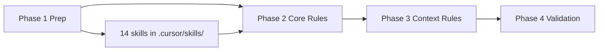

# Rule Recreation Road Map — Evaluation and Enhancement Plan

## 1. Evaluation Summary

Your self-assessment (**A-**; ~85–90% recreation goals) is accurate. The plan is strong on safety (backup-first, Option C, confidence thresholds), phased delivery, and BASB alignment. Below is a tightened evaluation and concrete enhancements.

### Strengths (confirmed)

- **Phasing**: Preparation → Core Rules → Context Rules → Validation is the right order; testing in a cloned vault before main vault is sensible.
- **Source alignment**: [Cursor-Project-Rules-Summary.md](3-Resources/Cursor-Project-Rules-Summary.md) is the single source of truth for rule names and behavior; the roadmap correctly maps Phase 2/3 to its sections.
- **Safety**: `obsidian_create_backup` first, no shell vault ops, propose-only for destructive moves, and logging with backup path are consistent with the existing summary and [skill pipelines plan](.cursor/plans/skill_pipelines_implementation_4a85cdd2.plan.md).
- **Skills awareness**: The finalized roadmap already weaves in the 14 skills (e.g. frontmatter-enrich, distill-highlight-color, subfolder-organize) and the four pipelines; that addresses the main “skills integration” gap.

### Weaknesses / risks (refined)

| Gap                            | Refinement                                                                                                                                                                                                                                                                                                                                                                                                                                                                                                                                                                                                               |
| ------------------------------ | ------------------------------------------------------------------------------------------------------------------------------------------------------------------------------------------------------------------------------------------------------------------------------------------------------------------------------------------------------------------------------------------------------------------------------------------------------------------------------------------------------------------------------------------------------------------------------------------------------------------------ |
| **Skills vs. rules order**     | The [skill pipelines plan](.cursor/plans/skill_pipelines_implementation_4a85cdd2.plan.md) states: “Skills will be built **before** Cursor rules.” The Rule Recreation roadmap does not explicitly **depend** Phase 2 on “skills exist first.” If rules are recreated before skills, rule text can still “reference skill X” and remain valid; but **testing** “skills invocation in a sample pipeline” (Phase 2 output) requires skills to exist. **Recommendation**: In Phase 1, add a step “Confirm or create `.cursor/skills/` with the 14 skills (per skill pipelines plan)” so Phase 2 validation is possible.      |
| **pasted-text.txt dependency** | Phase 1 asks to “Cross-reference **pasted-text.txt** with summary… and skills.” There is **no pasted-text.txt** in the repo. The gap table is still useful (Summary vs. Skills Integration vs. Gaps); “Pasted-Text Addition” column can be optional or “N/A if not provided.” Make Phase 1 validation robust when pasted-text is absent.                                                                                                                                                                                                                                                                                 |
| **MCP fallbacks**              | The plan mentions “fallbacks for limitations (e.g. parent dir creation)” but does not specify a **fallback table**. The skill pipelines plan already notes: “confirm whether the server creates parent dirs for new paths” and “document or call `obsidian_ensure_structure` first.” **Recommendation**: Add a small “MCP fallback” subsection in Phase 2 (e.g. in mcp-obsidian-integration.md): if `obsidian_move_note` fails due to missing parent, call `obsidian_ensure_structure` then retry; if `obsidian_update_note` to a new path fails, document “create parent manually or use ensure_structure” in the rule. |
| **Resurfacing automation**     | “Periodic automation (e.g. Dataview queries)” is deferred. The roadmap adds **auto-resurface.md** (e.g. `resurface-candidate: true` + hub). To keep scope bounded, define auto-resurface as **trigger-based** (e.g. “When user says ‘resurface’ or opens Resurface hub”) with a **documented** Dataview query (e.g. in Pipelines-and-Rules-Reference or Resurface.md) that users can run manually or via a future plugin; do not commit to a full periodic cron/plugin in this roadmap.                                                                                                                                  |
| **Effort**                     | Phase 3 (8–10 h) is plausible if skills are already done and only rule text + pipeline references are added. If Phase 3 also includes **writing** the 14 skills, effort should be split: “Rule Recreation” = rules only; “Skills Implementation” = separate plan (already exists). Keep the boundary clear.                                                                                                                                                                                                                                                                                                              |

### Overall

The roadmap is **implementable as-is** with the dependency and fallback clarifications above. The suggested enhancements below make it more robust and easier to validate.

---

## 2. Suggested Enhancements (beyond the finalized roadmap)

### A. Phase 1 — Preparation

1. **Explicit skills dependency**
  - Step 1 (test vault clone): Ensure the clone includes a **copy of `.cursor/skills/`** if it exists in the main vault; otherwise add a sub-step: “Copy or create the 14 skill directories from the skill pipelines plan into the test vault so Phase 2 can test skill invocation.”
  - Step 3 (validate context): Allow **Summary vs. Skills vs. Gaps** only; treat pasted-text as optional. Output: `Rules-Recreation-Gap-Table.md` with columns: Rule Section | Summary Coverage | Skills Integration | Gaps.
2. **Backup scope**
  - In “Backup Existing Artifacts,” explicitly include: “current `.cursor/` (if any), `3-Resources/Cursor-Project-Rules-Summary.md`, `3-Resources/Second Brain Summary.md`, and `3-Resources/Highlightr-Color-Key.md`,” so the baseline is unambiguous.

### B. Phase 2 — Core rules

1. **MCP fallback table (in mcp-obsidian-integration.md)**
  - Document in the recreated rule:
    - If **move_note** fails (e.g. “parent does not exist”): call `obsidian_ensure_structure` for the target parent path, then retry move.
    - If **update_note** to a **new path** fails: agent should propose creating the parent path (or call `obsidian_ensure_structure` if the server supports it); document behavior in the rule.
  - This keeps the roadmap consistent with the skill pipelines plan’s “document if parent-dir creation is required.”
2. **Confidence threshold**
  - The summary says “≥85%” for auto-actions; the finalized roadmap sometimes uses “≥90%.” Decide once: either keep **85%** everywhere for parity with the summary and ingest prompt, or update the **summary and prompt** to 90% and then use 90% in all rules. Avoid mixing 85% and 90% in the same pipeline.

### C. Phase 3 — Context rules

1. **auto-resurface.md scope**
  - Define it as: (1) When processing a note for archive, set `resurface-candidate: true` when appropriate (already in resurface-candidate-mark skill). (2) New rule **auto-resurface.md**: “When user asks to ‘resurface’ or ‘show resurface candidates,’ run `obsidian_global_search` (or Dataview) for `resurface-candidate: true` and list/link them; optionally append to Resurface hub.” (3) Document a **Dataview query** in `Pipelines-and-Rules-Reference.md` or [Resurface.md](Resurface.md) for manual “periodic” use. No obligation to implement Obsidian cron or plugin in this roadmap.
2. **Batch and isolation**
  - “Up to 5 notes per run” and “isolate failures” are good. Add to para-zettel-autopilot rule text: “Process one note fully (including log_action) before starting the next; on failure, log the failure and note path in Ingest-Log.md with #review-needed, then continue with the next note (do not halt entire batch).”

### D. Phase 4 — Validation and docs

1. **Single Rules Reference**
  - Create **one** consolidated note: `Pipelines-and-Rules-Reference.md` (or `3-Resources/Cursor-Pipelines-and-Rules-Reference.md`) that includes:
    - The four pipeline flowcharts (ingest, distill, archive, express) and skill order.
    - Trigger → rule mapping (e.g. “Ingest” → para-zettel-autopilot, always-ingest-bootstrap).
    - Short “Skills Reference” table: skill name → path (e.g. `.cursor/skills/distill-highlight-color/SKILL.md`) and which pipeline(s) use it.
    - Link to [Highlightr-Color-Key.md](3-Resources/Highlightr-Color-Key.md) and “Project-Specific Guidelines” (to be added there).
  - Avoid maintaining two overlapping docs (e.g. “Rules Reference” and “Pipelines Reference”); one note is enough.
2. **Skills testing milestone**
  - At “end of Phase 2,” add a checkpoint: “Run one sample pipeline (e.g. ingest one note in test vault) and confirm at least two skills are invoked (e.g. frontmatter-enrich, next-action-extract) and logged.” This verifies rules and skills are wired before Phase 3.

---

## 3. Dependency and ordering

- **Phase 1** produces: test vault, backup log, gap table, and (if missing) a copy or creation of the 14 skills in the test vault.
- **Phase 2** assumes skills exist for “test skills invocation”; recreates always-applied rules and adds MCP fallback table.
- **Phase 3** recreates context-specific rules and auto-resurface; batch/isolation and pipeline references go here.
- **Phase 4** runs validation scripts and produces the single Pipelines-and-Rules-Reference note.

---

## 4. Summary of enhancement checklist

| #   | Enhancement                                                                               | Phase |
| --- | ----------------------------------------------------------------------------------------- | ----- |
| 1   | Ensure test vault has .cursor/skills/ (14 skills); make pasted-text optional in gap table | 1     |
| 2   | Backup scope: list .cursor/, Summary, Second Brain Summary, Highlightr-Color-Key          | 1     |
| 3   | MCP fallback table in mcp-obsidian-integration.md (ensure_structure, new-path behavior)   | 2     |
| 4   | Unify confidence threshold (85% vs 90%) across summary, prompt, and rules                 | 2     |
| 5   | auto-resurface.md: trigger-based + documented Dataview query; no cron in scope            | 3     |
| 6   | Batch: “one note at a time; on failure log and continue” in para-zettel-autopilot         | 3     |
| 7   | Single Pipelines-and-Rules-Reference.md (flows, triggers, skills table, Highlightr link)  | 4     |
| 8   | Phase 2 exit: “Run sample pipeline; confirm ≥2 skills invoked”                            | 4     |

These changes keep the roadmap’s scope and timeline while making it robust to missing pasted-text, explicit about MCP limits, and aligned with the skills-first plan and a single reference doc.