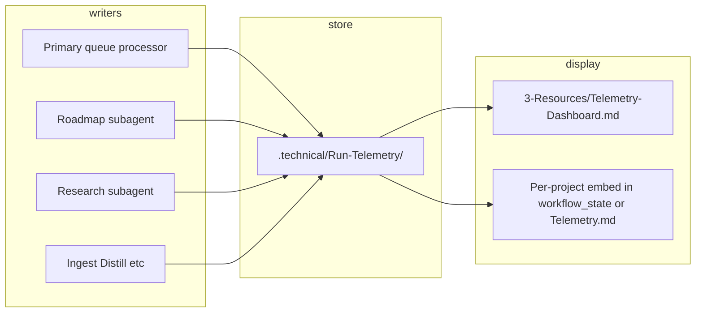

# Run-Telemetry and context tracking (subagent-aware)

## Goal

Track **primary** and **subagent** context (estimated_tokens, util_pct) and run internals (tool_calls, confidence, duration) in a single, Dataview-queryable store. Data lives in frontmatter-only notes; display is via one dashboard (and optional per-project embeds). No code changes in this plan — documentation and contract only; implementation follows in a later step.

---

## 1. Storage: folder, naming, schema

**Folder:** `[.technical/Run-Telemetry/](3-Resources/Second-Brain/Vault-Layout.md)`  

- Keeps telemetry hidden (`.technical` is already excluded from Obsidian per [Vault-Layout](3-Resources/Second-Brain/Vault-Layout.md); ensure Run-Telemetry is either included for Dataview or document that the dashboard path may need a vault setting exception so Dataview can query it).

**Naming convention (agent-generated):**  
`Run-YYYYMMDD-HHMMSS-[project-id]-[actor].md`  

- Example: `Run-20260315-050812-genesis-mythos-master-roadmap.md` (or `Run-20260315-050812-p123-roadmap.md` if project_id is a short slug).

**Content:** YAML frontmatter only (optional short body for human note). Canonical schema (base + high/medium-priority extensions):

```yaml
actor: primary | roadmap | research | ingest | distill | express | archive | organize
project_id: "<id>"        # or "-" when not project-scoped
queue_entry_id: "<id>"
chain_segment: "<id>"     # e.g. "deepen-3" or segment name
timestamp: "<ISO8601>"

# Chain/trace (high-priority)
parent_run_id: "<uuid>"   # or trace_id: primary generates short UUID per queue entry, passes down so chain can be reconstructed
span_id: "<id>"           # optional: this run's span within the trace

# Context (existing)
estimated_tokens: <int>   # legacy / input-side total if not split
context_window_tokens: <int>
util_pct: <float>

# Token split + cost (high-priority)
input_tokens: <int>       # exact or estimated prompt tokens
output_tokens: <int>      # exact or estimated completion tokens
total_tokens: <int>       # input + output (many APIs return natively)
cost_estimate_usd: <float>  # model pricing × total_tokens; start with hardcoded rate table per model

# Model (high-priority)
model: "<id>"             # e.g. "gpt-4o", "claude-3.5-sonnet-20241022", "o1-preview", "local-llama-70b" — critical for correlating behavior/cost/latency

# Outcome (high-priority)
success: "success" | "failure" | "partial" | "loop_limit" | "tool_error"  # or boolean; pairs with confidence, filters failed runs in Dataview
error_category: "<str>"   # optional: "timeout", "rate_limit", "invalid_tool_response", "hallucination_detected", "parse_error"
error_message: "<str>"    # optional: truncated message for root-cause (GROUP BY error_category)

tool_calls:                # YAML map — Dataview can query
  obsidian_read_note: 4
  web_search: 2
  obsidian_update_note: 1

internals:
  loop_attempted: true
  confidence: 92
  duration_sec: 47        # clarify: wall-clock for this run (end-to-end)
  end_to_end_duration_sec: <float>  # optional alias or explicit wall-clock when duration_sec is LLM-active only
  freeform: "recal triggered because util > 85%"
  reasoning_steps: <int>   # medium: count of Thought/ReAct/plan sub-goals — spots overthinking
  retry_count: <int>       # medium: tool retries, self-correction loops — high = flaky tools
  hallucination_score: <float>   # medium, 0–1, optional: self-eval or cheap judge
  faithfulness_score: <float>    # medium, 0–1, optional
  task_completion_rate: <float> # medium, 0–1, or goal_achieved: true/false — did run accomplish immediate goal?

workflow_state_link: "[[path#Log|iteration-17]]"   # optional
```

- **tool_calls** and **internals** stay inline in frontmatter (YAML map). No separate ToolCall note type for now; add later if per-call granularity is needed (e.g. `ToolCall-...` linked by run_id).

### High-priority schema additions (close biggest gaps)


| Field                                             | Type             | Purpose                                                                                                                                                                                                                                          |
| ------------------------------------------------- | ---------------- | ------------------------------------------------------------------------------------------------------------------------------------------------------------------------------------------------------------------------------------------------ |
| **model**                                         | string           | Which LLM was used (e.g. "gpt-4o", "claude-3.5-sonnet-20241022", "o1-preview", "local-llama-70b"). Critical for correlating behavior/cost/latency across models. Agents already know this; just capture it.                                      |
| **input_tokens / output_tokens / total_tokens**   | int              | Exact or estimated prompt + completion counts. Current estimated_tokens is input-side only; splitting is industry standard and enables real cost computation. Many APIs return these natively.                                                   |
| **cost_estimate_usd**                             | float            | Rough cost in USD for this run (model pricing × total_tokens). Start with a hardcoded rate table per model; helps spot expensive subagents quickly.                                                                                              |
| **success / status**                              | string or bool   | "success"                                                                                                                                                                                                                                        |
| **error_category / error_message**                | string, optional | If failed/partial: short category ("timeout", "rate_limit", "invalid_tool_response", "hallucination_detected", "parse_error") + truncated message. Root-cause analysis via GROUP BY error_category.                                              |
| **parent_run_id** (or **trace_id**) / **span_id** | string           | Unique ID of parent/initiating run (e.g. primary's queue_entry_id or generated chain UUID). Enables reconstructing full chain (primary → roadmap → research → …). Start simple: primary generates short UUID per queue entry and passes it down. |


### Medium-priority schema additions (quality + efficiency visibility)


| Field                                         | Type                | Purpose                                                                                                                                           |
| --------------------------------------------- | ------------------- | ------------------------------------------------------------------------------------------------------------------------------------------------- |
| **reasoning_steps**                           | int                 | Number of explicit reasoning/planning steps (e.g. count of "Thought:", ReAct loops, plan sub-goals). Spots verbose/overthinking agents.           |
| **retry_count**                               | int                 | How many times the run retried (tool retry, self-correction loop). High retries = inefficiency or flaky tools.                                    |
| **hallucination_score / faithfulness_score**  | float 0–1, optional | Self-eval or cheap judge at end: "does this contain unsupported claims?"                                                                          |
| **task_completion_rate** or **goal_achieved** | float 0–1 or bool   | Did this run accomplish its immediate goal? (e.g. research: "found ≥3 high-quality sources", distill: "reduced length by >40% without key loss"). |
| **end_to_end_duration_sec**                   | float               | Clarify vs duration_sec: wall-clock for full run vs active LLM time; document which duration_sec represents and add this when both are tracked.   |


---

## 2. Who writes, when, and with what data


| Actor                                           | When                                                                            | Source of context / tool_calls / internals                                                                                                                                                                                                                                                                                                                                |
| ----------------------------------------------- | ------------------------------------------------------------------------------- | ------------------------------------------------------------------------------------------------------------------------------------------------------------------------------------------------------------------------------------------------------------------------------------------------------------------------------------------------------------------------- |
| **Primary** (queue processor)                   | After processing each queue entry (or after each dispatch when it “is” the run) | Primary’s own context estimate (if available); queue_entry_id, chain_id/segment from entry; tool_calls/internals from primary run or leave empty until instrumentation exists.                                                                                                                                                                                            |
| **Roadmap**                                     | After each roadmap-deepen (and after recal, advance-phase, etc.)                | Already has: estimated_tokens, context_util_pct, context_window_tokens from [roadmap-deepen](.cursor/skills/roadmap-deepen/SKILL.md) step 5 / workflow_state. Add: tool_calls (counts from run — e.g. obsidian_read_note, obsidian_update_note); internals (confidence, duration_sec, loop_attempted, freeform). project_id, queue_entry_id, chain_segment from hand-off. |
| **Research**                                    | After research-agent-run completes                                              | Estimate context for the research subagent run (e.g. chars × token_per_char); tool_calls (web_search, mcp_web_fetch, obsidian_* from skill); internals (confidence, duration_sec). project_id, linked_phase, queue_entry_id from hand-off.                                                                                                                                |
| **Ingest, Distill, Express, Archive, Organize** | After each pipeline run                                                         | Same pattern: estimate context for that subagent’s run; optional tool_calls/internals (can be empty or heuristic until agents track them).                                                                                                                                                                                                                                |


- **Gap:** Today only roadmap-deepen computes context metrics. Primary and other subagents do not. So:
  - **Roadmap:** Can populate all fields from current workflow_state + deepen skill (and optionally track tool counts in the skill).
  - **Primary:** Can write a Run-Telemetry note with actor=primary, queue_entry_id, chain_segment, timestamp; estimated_tokens/util_pct/tool_calls/internals can be omitted or best-effort (e.g. from prompt size estimate) until we add instrumentation.
  - **Others:** Same: require at least actor, project_id (or "-"), queue_entry_id, timestamp; context and tool_calls/internals optional until each subagent or the runner reports them.

---

## 2b. Required vs optional fields (and sources)

**Required (every Run-Telemetry note):**  
`actor`, `project_id`, `queue_entry_id`, `timestamp`.  
Once primary sends it in the hand-off: `**parent_run_id`** (required; subagents copy from hand-off).

**Optional (when available; omit the rest):** All other fields. Document in the plan and in Parameters/Logs a short **source** for each so implementers know where to get values and that missing optional fields are intentional, not a failure.


| Field                                             | Source (when optional)                                                                                                     |
| ------------------------------------------------- | -------------------------------------------------------------------------------------------------------------------------- |
| chain_segment                                     | From hand-off / queue entry                                                                                                |
| model                                             | From hand-off or Config (if no source yet, leave empty)                                                                    |
| success                                           | Standardize existing "Success / failure / #review-needed" into enum; primary or subagent writes it                         |
| error_category / error_message                    | When success != success; short category + truncated message                                                                |
| estimated_tokens, context_window_tokens, util_pct | Roadmap: already computed in deepen; others: when available                                                                |
| input_tokens, output_tokens, total_tokens         | From API when runner passes; else roadmap: input_tokens = estimated_tokens, output_tokens = 0 or rough completion estimate |
| cost_estimate_usd                                 | From rate table × total_tokens (after total_tokens exists)                                                                 |
| tool_calls, internals.*                           | When runner/wrapper can count or time; otherwise omit                                                                      |
| reasoning_steps, retry_count, duration_sec        | When runner or wrapper can count/time and pass them                                                                        |
| hallucination_score, task_completion_rate         | Only if you add a self-eval step                                                                                           |
| workflow_state_link, span_id                      | When relevant                                                                                                              |


**Contract wording (Subagent-Safety-Contract and queue rule):**  
"Write a Run-Telemetry note with **required** fields and **any optional fields you have**; omit the rest." No run is considered failing because optional fields are missing; we phase in optional fields as sources and instrumentation become available.

---

## 2c. Concrete rollout order (no new instrumentation)

Roll out in phases so the codebase stays aligned: required + hand-off–driven first, then derived (cost), then optional instrumentation when you have it.

**Phase 1 — Required + hand-off–driven (first):**

1. **parent_run_id:** Primary generates it per queue entry and adds it to the hand-off; all subagents write it to their note. (Required once primary sends it.)
2. **success** (and optionally **error_category** / **error_message**): Standardize the existing "Success / failure / #review-needed" into a `success` enum; on failure, primary or subagent writes a short category + message into the note.
3. **model:** If you already have a place that knows the model (e.g. queue entry or Config), add it to the hand-off and have writers put it in the note; otherwise leave empty until you have a source.

**Phase 2 — Reuse existing numbers:**

1. **Roadmap:** Already has estimated_tokens, util_pct, context_window_tokens. Map those into the new Run-Telemetry note. Set **input_tokens** = estimated_tokens; **output_tokens** = 0 or a rough completion estimate if desired. Compute **total_tokens** and **cost_estimate_usd** from the rate table and write to the note.

**Later (when you have sources or instrumentation):**

1. **input_tokens / output_tokens** from real API usage when the runner can pass them.
2. **reasoning_steps**, **retry_count**, **duration_sec** when a runner or wrapper can count/time and pass them.
3. **hallucination_score**, **task_completion_rate** only if you add a self-eval step.

So: required + hand-off–driven fields first, then derived (cost from existing roadmap numbers), then optional instrumentation when available. No new instrumentation is required for Phase 1 or Phase 2.

---

## 3. Display layer (no extra storage)

**Single dashboard:** [3-Resources/Telemetry-Dashboard.md](3-Resources/Second-Brain/Vault-Layout.md) (new note).  

- Dataview table over Run-Telemetry notes. **Important:** Notes live in `.technical/Run-Telemetry/`, so the query must use that path (e.g. `FROM ".technical/Run-Telemetry"`). If the vault excludes `.technical` from Obsidian’s index, verify that Dataview can still query that folder; if not, document an exception for `Run-Telemetry` or the need to allow it for Dataview.

Example block (path corrected to actual storage):

```dataview
TABLE
  actor,
  model,
  project_id,
  success,
  util_pct,
  total_tokens,
  cost_estimate_usd,
  internals.duration_sec AS duration_sec,
  error_category
FROM ".technical/Run-Telemetry"
WHERE timestamp >= date(today) - dur(30 days)
SORT file.mtime DESC
```

- **Optional-first display:** Use columns that **exist** in the data. Do not assume every note has every optional field. Add **optional second blocks**: e.g. "When cost_estimate_usd exists, show it"; "When success != success, show error_category (and optionally error_message)". That way the dashboard does not "fail" or look broken when optional fields are missing; we intentionally phase in columns as fields are populated.
- Prefer top-level fields (actor, model, project_id, success, util_pct, total_tokens, cost_estimate_usd, error_category) for simpler Dataview when present. For **duration_sec** and **confidence**, use `internals.duration_sec` / `internals.confidence` if not flattened. Optional blocks: "Failed runs" `WHERE success != "success"` (show error_category when present); "By model" `GROUP BY model` (when model exists).
- **Per-project view:** In each project’s [workflow_state.md](3-Resources/Second-Brain/Vault-Layout.md) (or a dedicated project telemetry note), embed the same TABLE with `WHERE project_id = this.project_id` (or filter by current project path). Document in Vault-Layout that project-level telemetry view is optional and can live in `1-Projects/<id>/Roadmap/` (e.g. a section in workflow_state or a small `Telemetry.md` that transcludes the filtered query).

---

## 4. Docs and contract updates (implementation checklist)

- **[Vault-Layout](3-Resources/Second-Brain/Vault-Layout.md):** Add `.technical/Run-Telemetry/` to the .technical row (or new row): purpose (run telemetry, one note per run, frontmatter-only), naming `Run-YYYYMMDD-HHMMSS-<project_id>-<actor>.md`, and that it is agent-written and Dataview-queried from `3-Resources/Telemetry-Dashboard.md`. Note that Obsidian may exclude .technical; if so, ensure Run-Telemetry is still visible to Dataview or document the exception.
- **[Logs](3-Resources/Second-Brain/Logs.md):** Add a row for Run-Telemetry: location `.technical/Run-Telemetry/`, one note per run. **Required fields:** actor, project_id, queue_entry_id, timestamp; parent_run_id once primary sends it. **Optional (when available):** all other schema fields, with a short "source" note per field (e.g. "model: from hand-off or Config", "input_tokens: from API or estimated"). Link to Telemetry-Dashboard, Parameters, and Vault-Layout for full schema and rollout order (§ 2b, § 2c).
- **[Parameters](3-Resources/Second-Brain/Parameters.md):** In the context-util / roadmap section, add a short subsection: “Run-Telemetry (primary + subagents)”. **Required:** actor, project_id, queue_entry_id, timestamp; parent_run_id once primary sends it. **Optional (when available):** everything else, with short source notes (e.g. "model: from hand-off or Config", "input_tokens: from API or estimated"). State that primary and each subagent write one note per run with required fields and any optional fields they have; omit the rest. Link to plan § 2b (Required vs optional) and § 2c (rollout order).
- **[Subagent-Safety-Contract](3-Resources/Second-Brain/Subagent-Safety-Contract.md):** Under “Critical invariants” or “Return format”, add: “Before returning, subagents SHOULD write one Run-Telemetry note to `.technical/Run-Telemetry/` with **required** fields (actor, project_id, queue_entry_id, timestamp; parent_run_id from hand-off) and **any optional fields you have**; omit the rest. See Vault-Layout § Run-Telemetry and Logs § Required vs optional.”
- **Queue processor (primary):** Document in [queue.mdc](.cursor/rules/agents/queue.mdc) or [auto-eat-queue](.cursor/rules/context/auto-eat-queue.mdc): (1) For each queue entry, primary generates **parent_run_id** (short UUID or stable id) and adds it to the hand-off so subagents write it to their note. (2) Primary writes one Run-Telemetry note per entry with **required** fields and **any optional fields it has**; omit the rest (same contract as subagents).
- **Roadmap-deepen:** In [roadmap-deepen SKILL](.cursor/skills/roadmap-deepen/SKILL.md), add a step (or extend “Return”): after updating workflow_state, write one note to `.technical/Run-Telemetry/` with actor=roadmap, project_id, queue_entry_id, chain_segment, and the same estimated_tokens, context_util_pct, context_window_tokens already computed; optional tool_calls (e.g. counts of obsidian_read_note, obsidian_update_note) and internals (confidence, duration_sec, freeform). Link to workflow_state via workflow_state_link.
- **Research / Ingest / Distill / Express / Archive / Organize:** In each subagent rule or skill, add one line: “Before return, write one Run-Telemetry note to `.technical/Run-Telemetry/` per Subagent-Safety-Contract and Logs § Run-Telemetry.” Schema: at least actor, project_id (or "-"), queue_entry_id, timestamp; optional context and tool_calls/internals when available.
- **New note:** Create [3-Resources/Telemetry-Dashboard.md](3-Resources/Second-Brain/Vault-Layout.md) with the Dataview TABLE above (path = `.technical/Run-Telemetry`), optional-first TABLE (columns that exist); optional second blocks when fields exist (e.g. cost_estimate_usd, error_category when success != success). Optional section “Last 7 days by actor” (GROUP BY actor), and link from [Vault-Change-Monitor](3-Resources/Second-Brain/Logs.md) / [Vault-Layout](3-Resources/Second-Brain/Vault-Layout.md) so it’s discoverable.

---

## 5. Relationship to existing workflow_state

- **workflow_state.md** remains the **iteration log** for roadmap (one row per deepen/recal/advance; 12-column Log). It does not duplicate Run-Telemetry.
- Run-Telemetry is **per run (primary or subagent)**, not per roadmap iteration. One RESUME_ROADMAP run may produce: one primary Run-Telemetry note (if primary logs) + one roadmap Run-Telemetry note. Chain runs (e.g. RESEARCH then RESUME_ROADMAP) produce multiple Run-Telemetry notes (one per segment). Optional **workflow_state_link** in Run-Telemetry ties a roadmap run back to a specific workflow_state Log row (e.g. “iteration-17”) for cross-reference.

---

## 6. Data flow (high level)




---

## 7. Implementation notes for new fields

- **cost_estimate_usd:** Maintain a small model → rate table (e.g. in [Second-Brain-Config](3-Resources/Second-Brain/Second-Brain-Config.md) or a reference doc like `3-Resources/Second-Brain/Telemetry-Model-Rates.md`): model id → input $/1K tokens, output $/1K tokens (or single rate). Agents multiply by total_tokens (or input_tokens + output_tokens with split rates) and write cost_estimate_usd.
- **duration_sec vs end_to_end_duration_sec:** Document clearly: e.g. duration_sec = wall-clock for the run; end_to_end_duration_sec = explicit alias when some runners report only “active LLM time”. Avoid duplicate semantics; pick one as canonical and use the other only when both are available.

---

## 8. Out of scope (for this plan)

- Instrumentation that automatically captures tool_call counts or duration in Cursor (if not available, agents use best-effort or leave fields empty).
- A separate ToolCall note type or per-call table; add later if needed.
- Changing how workflow_state context columns are computed; they stay as today; Run-Telemetry adds a parallel, subagent-aware view.

