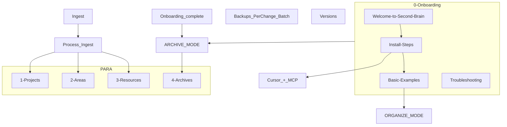

# Second-Brain Starter Kit Vault

## Goals

- Stand up a fresh Obsidian vault at `./Second-Brain-Starter-Kit/` with PARA, Ingest, safety folders, `.obsidian`, and `.cursor` pre-wired.
- Copy and minimize from the existing `Second-Brain` vault so core pipelines (ingest, organize, distill, express, archive) work out of the box on dummy content.
- Provide clear onboarding and configuration docs so a new user can reach "first successful ingest" in under 15 minutes.

## High-Level Phases

- **Phase 1**: Core folder structure and Obsidian config.
- **Phase 2**: Cursor rules, skills, and MCP documentation.
- **Phase 3**: Seed PARA content and onboarding notes.
- **Phase 4**: Pipeline testing, edge-case checks, and packaging as `Second-Brain-Starter-Kit.zip`.

## Phase 1 – Core Structure and Config

- **Create vault root**: Plan new vault at `./Second-Brain-Starter-Kit/` alongside the current vault contents.
- **Folder skeleton** (all relative to new root):
  - Create `0-Onboarding/`, `1-Projects/`, `2-Areas/`, `3-Resources/`, `4-Archives/`, `Ingest/`.
  - Create safety and versioning folders: `Backups/Per-Change/`, `Backups/Batch/`, `Versions/`.
  - Create optional but referenced folders: `5-Attachments/` and `Templates/` (can be mostly empty initially).
  - Explicitly **do not** include `Daily Notes/`, `Logging/`, scripts, or user-specific hubs at root.
- **Minimal seed files for structure validation**:
  - Touch placeholder notes like `[3-Resources/README.md](3-Resources/README.md)` or short index stubs if helpful, but leave real content to later phases.
- **.obsidian config – base files**:
  - Copy from existing vault, then trim for the starter kit:
    - `[.obsidian/app.json](.obsidian/app.json)` – ensure `attachmentFolderPath` points to `5-Attachments/` (or default) and no user-specific paths.
    - `[.obsidian/appearance.json](.obsidian/appearance.json)`, `[.obsidian/graph.json](.obsidian/graph.json)` – keep defaults or simplified versions.
    - `[.obsidian/workspace.json](.obsidian/workspace.json)` – configure so the vault opens `[0-Onboarding/Welcome-to-Second-Brain.md](0-Onboarding/Welcome-to-Second-Brain.md)` on launch (either as the active leaf or within a saved workspace layout).
- **.obsidian community plugins**:
  - Use the **full current** plugin set by copying and trimming:
    - `[.obsidian/community-plugins.json](.obsidian/community-plugins.json)` – include Dataview, Highlightr, obsidian-local-rest-api, watcher, plus the other plugins currently enabled (tasks, quickadd, excalidraw, OCR tools, etc.).
    - Copy associated plugin config JSON files under `.obsidian/plugins/*`, but remove user-specific data, API keys, and absolute paths.
  - Double-check that Highlightr’s color schemes match the scheme documented later in `[3-Resources/Highlightr-Color-Key.md](3-Resources/Highlightr-Color-Key.md)`.
- **MCP and parameters documentation locations**:
  - Do **not** add a `mcp.json` inside the vault; rely on global `~/.cursor/mcp.json` per rules.
  - Plan to document configuration in:
    - `[0-Onboarding/Install-Steps.md](0-Onboarding/Install-Steps.md)` – step-by-step global MCP setup with example `~/.cursor/mcp.json` snippet.
    - `[3-Resources/Config-Defaults.md](3-Resources/Config-Defaults.md)` – editable defaults (confidence bands, backup age, archive thresholds, highlight defaults, dry-run behavior) as the single source-of-truth for tunable parameters.

## Phase 2 – Cursor Rules, Skills, and MCP Reference

### 2.1 .cursor Integration

- **Copy always-on rules** to `[.cursor/rules/always/](.cursor/rules/always/)` from the existing vault, keeping only the minimal required set:
  - `00-always-core.mdc`
  - `always-ingest-bootstrap.mdc`
  - `confidence-loops.mdc`
  - `mcp-obsidian-integration.mdc`
  - `second-brain-standards.mdc`
  - `watcher-result-append.mdc`
- **Adapt `mcp-obsidian-integration.mdc`**:
  - Ensure it references **generic placeholders** or descriptive names rather than hardcoded paths.
  - Use a neutral term like `VAULT_ROOT` in narrative examples and make sure the actual paths are documented in `[3-Resources/Config-Defaults.md](3-Resources/Config-Defaults.md)` (e.g. `BACKUP_DIR`, `SNAPSHOT_DIR`, `BATCH_SNAPSHOT_DIR`).
- **Copy context rules** into `[.cursor/rules/context/](.cursor/rules/context/)`:
  - `ingest-processing.mdc`
  - `para-zettel-autopilot.mdc`
  - `auto-archive.mdc`
  - `auto-distill.mdc`
  - `auto-express.mdc`
  - `auto-organize.mdc`
  - `non-markdown-handling.mdc`
  - Optionally include `auto-restore.mdc`, `auto-resurface.mdc`, `snapshot-sweep.mdc` if they are stable enough for the starter kit.
- **Model the "Onboarding complete" archive flow**:
  - Decide on one implementation (encode into rules and docs):
    - Prefer **Option B** for clarity: add a small, dedicated context rule (e.g. `onboarding-archive.mdc`) that is triggered only when the user explicitly says "Onboarding complete".
    - In that rule, scope the archive pipeline to `0-Onboarding/`** and move notes to `4-Archives/Onboarding-Complete/`.
    - Ensure `auto-archive.mdc` explicitly **excludes** `0-Onboarding/`** in normal archive runs to avoid accidental cleanup.
  - Cross-reference this behavior in `[0-Onboarding/Welcome-to-Second-Brain.md](0-Onboarding/Welcome-to-Second-Brain.md)` and `[0-Onboarding/Install-Steps.md](0-Onboarding/Install-Steps.md)`.
- **Skills**:
  - Copy all project skills into `[.cursor/skills/](.cursor/skills/)`, preserving each `SKILL.md`:
    - `archive-check`, `auto-layer-select`, `callout-tldr-wrap`, `call-to-action-append`, `distill-highlight-color`, `express-mini-outline`, `frontmatter-enrich`, `layer-promote`, `next-action-extract`, `obsidian-snapshot`, `readability-flag`, `related-content-pull`, `resurface-candidate-mark`, `split-link-preserve`, `subfolder-organize`, `summary-preserve`, `version-snapshot`.
  - Ensure each skill file references the correct in-vault paths (e.g. `Backups/Per-Change/`) or uses placeholders that will be clarified in `[3-Resources/Config-Defaults.md](3-Resources/Config-Defaults.md)`.

### 2.2 System Reports and References in 3-Resources

- **Core reference docs** to place under `[3-Resources/](3-Resources/)`:
  - `[3-Resources/Second-Brain-Automations-Setup-Report.md](3-Resources/Second-Brain-Automations-Setup-Report.md)` – copy or create a shortened "Starter kit" version of the existing setup report, summarizing:
    - Pipelines (ingest, organize, distill, express, archive).
    - Triggers (INGEST MODE / "Process Ingest", ORGANIZE MODE, DISTILL MODE, EXPRESS MODE, ARCHIVE MODE, "Onboarding complete").
    - Safety layers (global backups, per-change snapshots, confidence bands, dry_run policies).
  - `[3-Resources/Cursor-Skill-Pipelines-Reference.md](3-Resources/Cursor-Skill-Pipelines-Reference.md)` – copy from the current vault and adjust:
    - Update internal links to point only to notes that exist in the starter kit (e.g. `Config-Defaults`, `Highlightr-Color-Key`, log notes).
  - `[3-Resources/Automation-Flows-MCP-Improvements.md](3-Resources/Automation-Flows-MCP-Improvements.md)` – copy/summarize from the current improvements note; highlight only stable, user-facing behaviors.
  - `[3-Resources/Second-Brain-Config.md](3-Resources/Second-Brain-Config.md)` – include hub names, archive defaults, graph configuration, and highlight defaults.
  - `[3-Resources/Highlightr-Color-Key.md](3-Resources/Highlightr-Color-Key.md)` – copy a minimal version containing:
    - Global color theory (analogous vs complementary).
    - One or two project examples with `highlight_key` values.
  - `[3-Resources/enhanced-snapshots.md](3-Resources/enhanced-snapshots.md)` – copy backup/snapshot guidance note as-is or slightly trimmed.
- **Config-Defaults**:
  - Create `[3-Resources/Config-Defaults.md](3-Resources/Config-Defaults.md)` with sections for:
    - Confidence bands: low (<72%), mid (72–84%), high (≥85%).
    - `ensure_backup` `max_age_minutes` default (1440).
    - Dry-run requirements for `obsidian_move_note` and other destructive calls.
    - Highlight defaults and mapping to Highlightr keys.
    - Optional archive thresholds (e.g. `archive_age_days`) and how they relate to `auto-archive` behavior.
    - A short "How to customize" callout.
- **Log placeholders and watcher files**:
  - Create empty or header-only notes:
    - `[3-Resources/Ingest-Log.md](3-Resources/Ingest-Log.md)`
    - `[3-Resources/Archive-Log.md](3-Resources/Archive-Log.md)`
    - `[3-Resources/Distill-Log.md](3-Resources/Distill-Log.md)`
    - `[3-Resources/Express-Log.md](3-Resources/Express-Log.md)`
    - `[3-Resources/Organize-Log.md](3-Resources/Organize-Log.md)`
    - `[3-Resources/Backup-Log.md](3-Resources/Backup-Log.md)`
    - `[3-Resources/Errors.md](3-Resources/Errors.md)`
  - Add watcher-related files if the Watcher plugin is part of the flow:
    - `[3-Resources/Watcher-Signal.md](3-Resources/Watcher-Signal.md)`
    - `[3-Resources/Watcher-Result.md](3-Resources/Watcher-Result.md)`
    - `[3-Resources/Watcher-Watched-File.md](3-Resources/Watcher-Watched-File.md)`
  - Ensure these are referenced in the relevant rules (e.g. `watcher-result-append.mdc`).

### 2.3 MCP-Tools-Reference

- **Source descriptors**:
  - Use MCP tool JSON descriptors from `~/.cursor/projects/home-darth-Documents-Second-Brain/mcps/user-obsidian-para-zettel-autopilot/tools/*.json` as the source of truth.
- **Create `[3-Resources/MCP-Tools-Reference.md](3-Resources/MCP-Tools-Reference.md)`**:
  - Group tools by function or pipeline: ingest, organize, archive, backup/snapshot, confidence/fallback, health/observability.
  - For each tool (e.g. `obsidian_create_backup`, `obsidian_classify_para`, `obsidian_move_note`, `obsidian_ensure_structure`, `calibrate_confidence`, `verify_classification`, `propose_alternative_paths`, `health_check`, `obsidian_log_action`):
    - Document: tool name, required and optional parameters, and a short example invocation.
    - Note critical safety behavior (e.g. backup gates, dry_run requirements, parent-directory behavior) using concise callouts.

## Phase 3 – Seed Content and Onboarding

### 3.1 PARA Templates and Hubs

- **Project template**:
  - Create `[1-Projects/Project-Template.md](1-Projects/Project-Template.md)` with:
    - Frontmatter: `title`, `created`, `status: active`, `para-type: project`, `project-id`, `highlight_key`, `tags`, and `links` (e.g. `[[Projects Hub]]`).
    - A minimal body describing goals, scope, and next actions.
- **Area template**:
  - Create `[2-Areas/Area-Template.md](2-Areas/Area-Template.md)` with:
    - Frontmatter: `title`, `created`, `para-type: area`, `status`, `tags`, and `links` (e.g. `[[Areas Hub]]`).
- **Hubs** (as referenced in `Second-Brain-Config`):
  - `[1-Projects/Projects-Hub.md](1-Projects/Projects-Hub.md)` – simple hub note with:
    - A brief explanation of projects.
    - Dataview placeholders listing active projects and relevant tags.
  - `[2-Areas/Areas-Hub.md](2-Areas/Areas-Hub.md)` – similar for areas.
  - `[3-Resources/Resources-Hub.md](3-Resources/Resources-Hub.md)` – resource hub with:
    - Links to `Config-Defaults`, `MCP-Tools-Reference`, `Cursor-Skill-Pipelines-Reference`, and key system docs.
    - Optional Dataview queries for `#review-needed` and high-value resources.

### 3.2 Onboarding Notes in 0-Onboarding

- **Welcome note**:
  - Create `[0-Onboarding/Welcome-to-Second-Brain.md](0-Onboarding/Welcome-to-Second-Brain.md)` including:
    - The master goal: autonomous post-capture processing.
    - Benefits and a short narrative overview of the vault.
    - A **Quick Start** section (3–5 steps) focused on: install Obsidian plugins, start MCP, open Cursor, and run `Process Ingest`.
    - A **Trigger phrases** callout: `Process Ingest`, `ORGANIZE MODE`, `DISTILL MODE`, `EXPRESS MODE`, `ARCHIVE MODE`, and `Onboarding complete`.
    - Links to `Install-Steps`, `Basic-Examples`, and `Troubleshooting`.
- **Install steps**:
  - Create `[0-Onboarding/Install-Steps.md](0-Onboarding/Install-Steps.md)` with numbered sections:
    1. **Install Obsidian plugins** – Dataview, Highlightr, Local REST API, Watcher, plus any others required by the full plugin set.
    2. **Confirm `.obsidian` configuration** – instructions for verifying the starter kit’s plugin settings and theme.
    3. **Configure MCP** – copy-paste snippet for `~/.cursor/mcp.json` including:
      - `vaultPath` (pointing to `Second-Brain-Starter-Kit/`).
      - `BACKUP_DIR` (outside the vault, e.g. `Second-Brain-Starter-Kit-Backups/`).
      - `SNAPSHOT_DIR` and `BATCH_SNAPSHOT_DIR` (inside vault, under `Backups/Per-Change/` and `Backups/Batch/`).
      - `max_age_minutes: 1440` and a `serverIdentifier`.
    4. **Open vault in Cursor** – instructions for opening the vault and confirming rules load.
    5. **Run `health_check`** – show expected output and instruct the user to log the result in `[3-Resources/MCP-Health-YYYY-MM.md](3-Resources/MCP-Health-YYYY-MM.md)` (optionally created in Phase 2.2).
- **Basic examples**:
  - Create `[0-Onboarding/Basic-Examples.md](0-Onboarding/Basic-Examples.md)` with:
    - Copy-pasteable templates for Project, Area, and Resource notes (frontmatter + 2–3 lines of body).
    - Instructions like: "Copy one of these into `1-Projects/` or `2-Areas/` and then trigger ORGANIZE MODE to see auto-enrichment."
- **Troubleshooting**:
  - Create `[0-Onboarding/Troubleshooting.md](0-Onboarding/Troubleshooting.md)` with sections for:
    - MCP connection issues (e.g. wrong vault path, server not running).
    - Cursor rules not loading (e.g. wrong workspace path, missing `.cursor` folder).
    - Backup/snapshot path problems.
    - How to interpret logs in `*-Log.md` and `Errors.md`.
    - Links to `Config-Defaults` and `MCP-Tools-Reference`.

### 3.3 Ingest Seed Notes

- **Seed captures** in `[Ingest/](Ingest/)`:
  - `[Ingest/Test-Capture-1.md](Ingest/Test-Capture-1.md)` – neutral, generic capture with a title and a few sentences.
  - `[Ingest/Test-Capture-2.md](Ingest/Test-Capture-2.md)` – different theme to exercise classification variety.
  - Ensure both are safe, generic content suitable for distribution.
- **Explain usage**:
  - In `Welcome` or `Basic-Examples`, provide a short section explaining that users can trigger `Process Ingest` on these test captures to watch the full pipeline run.

### 3.4 Onboarding Self-Cleanup

- **Document the "Onboarding complete" flow**:
  - In `Welcome` and/or `Install-Steps`, describe that when the user types **"Onboarding complete"** in Cursor, the archive pipeline will move `0-Onboarding/`** into `4-Archives/Onboarding-Complete/`.
  - After this, users should primarily navigate via `Resources-Hub` and the PARA folders.
- **Ensure context rule alignment**:
  - Confirm that the dedicated onboarding archive context rule uses this trigger phrase, scopes only `0-Onboarding/`**, and writes to logs appropriately.

## Phase 4 – Testing, Edge Cases, and Packaging

### 4.1 Full Pipeline Test

- **Simulated new user flow**:
  - Follow `Install-Steps` as if you are a new user (fresh Obsidian, plugins, MCP config, and Cursor rules).
  - Drop one of the `Test-Capture` notes into `Ingest/` if not already there.
  - Run the following triggers sequentially where appropriate:
    - `Process Ingest` (INGEST MODE) on `Ingest/` seeds.
    - ORGANIZE MODE on a template note.
    - DISTILL MODE on a suitable note.
    - EXPRESS MODE on a distilled note.
    - ARCHIVE MODE on a completed seed or test note.
    - "Onboarding complete" to test the special archive flow for `0-Onboarding/`.
  - Confirm logs are written in each corresponding `*-Log.md` and that no broken links or missing folders appear.

### 4.2 Edge-Case Behavior

- **Mid-band confidence loop**:
  - Use or craft a note that is likely to land in the 72–84% confidence band.
  - Run the relevant pipeline and verify (via logs and behavior) that:
    - Exactly one non-destructive refinement loop is attempted.
    - `loop_attempted`, `pre_loop_conf`, `post_loop_conf`, `loop_outcome`, and related fields are written to logs as per `confidence-loops.mdc`.
- **Dry-run move workflow**:
  - Trigger a move that exercises `obsidian_move_note` and `obsidian_ensure_structure`.
  - Confirm that a `dry_run` is executed and reviewed before the actual move, and that logs document the behavior.
- **Task extraction** (if applicable):
  - Test `next-action-extract` by including simple tasks in a seed note and verifying extracted next actions appear in frontmatter or checklists.

### 4.3 Documentation Pass

- **Callouts and cross-links**:
  - Ensure onboarding and reference notes use clear callouts for key steps and warnings.
  - Verify cross-links:
    - `Welcome` → `Install-Steps` → `Basic-Examples` → `Troubleshooting`.
    - `Resources-Hub` → `Config-Defaults`, `MCP-Tools-Reference`, `Cursor-Skill-Pipelines-Reference`, `Second-Brain-Config`, and the setup report.
- **Consistency check**:
  - Confirm terminology (e.g. PARA labels, trigger phrases, path names) is consistent across rules, skills, and docs.

### 4.4 Packaging

- **Prepare distributable archive**:
  - Ensure `.git` (if any), personal notes, and machine-specific caches are excluded.
  - Include `.cursor/`, `.obsidian/`, all PARA folders, `Ingest/`, `0-Onboarding/`, `Backups/`, `Versions/`, and all 3-Resources docs.
  - Zip the entire `Second-Brain-Starter-Kit/` directory as `Second-Brain-Starter-Kit.zip`.

## Architecture Snapshot (Mermaid)

