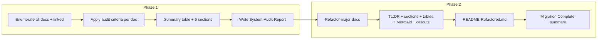

# Second Brain Documentation Audit and Migration Plan

## Scope

- **Audit scope**: All markdown under [3-Resources/Second-Brain/](3-Resources/Second-Brain/) (77 files including `Second-Brain-User-Flows/`, `tests/`) plus every file linked from [Rules.md](3-Resources/Second-Brain/Rules.md), [Pipelines.md](3-Resources/Second-Brain/Pipelines.md), [Cursor-Skill-Pipelines-Reference.md](3-Resources/Second-Brain/Cursor-Skill-Pipelines-Reference.md), [Vault-Layout.md](3-Resources/Second-Brain/Vault-Layout.md), [Backbone.md](3-Resources/Second-Brain/Backbone.md), and [README.md](3-Resources/Second-Brain/README.md). That includes: Queue-Sources, Parameters, Logs, Skills, MCP-Tools, Configs, User-Questions-and-Options-Reference, Queue-Alias-Table, Chat-Prompts, Naming-Conventions, Templates, Plugins, Mobile-Migration-Spec, Testing, Roadmap-Quality-Guide, Cursor-Agent-Ingest-Workflow, Queue-Sources, Errors.md, Watcher-Signal/Result, Wrapper-MOC, Templates/Master-Goal, 4-Archives/Resources/Roadmap-Standard-Format, Commander-Plugin-Usage, etc.
- **Migration scope**: Same folder `3-Resources/Second-Brain/`. Refactor the **major** docs only (not tests/fixtures or one-off summaries). Major = Rules, Pipelines, Skills, Vault-Layout, Parameters, Logs, Queue-Sources, Cursor-Skill-Pipelines-Reference, Backbone, README, Configs, MCP-Tools, Naming-Conventions, Templates, Plugins; optionally one representative User-Flows doc (e.g. Prompt-Crafter-Structure-Detailed) as template. Second-Brain-User-Flows can be migrated in a follow-up or only the index/Backbone references updated.

---

## Phase 1 — Audit

### 1.1 Audit output file

- **Path**: [3-Resources/Second-Brain/System-Audit-Report-2026-03-12.md](3-Resources/Second-Brain/System-Audit-Report-2026-03-12.md) (use today’s date 2026-03-12).
- **Structure**:
  - **Summary table at top**: One table with columns: `Doc | Glance | Human vs LLM | Duplication | Format | TL;DR | Tables | Mermaid | Callouts | Cross-links | UX issues | Priority`. Rows = each audited doc (grouped by category: Core, Queue/Params, Logs, User-Flows, Other). Priority = High/Medium/Low for migration.
  - **Sections** (each with subsections by category or by finding type):
    - **Glance-ability**: How fast a human can find a section and key data (headings, table density, paragraph length).
    - **Human vs LLM readability**: Dense prose vs structured markdown; consistent headings; whether LLM parsing is documented or implied.
    - **Duplication**: Trigger→pipeline and confidence-band content repeated across Rules, Pipelines, Cursor-Skill-Pipelines-Reference, README; snapshot triggers in Pipelines vs Cursor-Skill-Pipelines-Reference; User-Flows High/Mid/Detailed overlap.
    - **Inconsistent formatting**: Section order (no standard Overview | Quick Reference | Detailed Flow | Safety | Usage | Troubleshooting); frontmatter presence (most have it; ensure `para-type`, `tags`, `status`); heading levels (e.g. H1 vs H2 for title).
    - **Missing TL;DRs, tables, or Mermaid**: Only 3 files have an explicit TL;DR; which core docs lack a quick-reference table or a flow diagram.
    - **Broken cross-links**: Verify `[[...]]` and `§` anchors to existing files/headings (e.g. Queue-Sources § RESUME-ROADMAP params; Pipelines § Snapshot triggers; 4-Archives/Resources/Roadmap-Standard-Format; Templates/Master-Goal; Commander-Plugin-Usage; Ingest/Decisions/Wrapper-MOC).
    - **Obsidian-specific UX**: No callouts for invariants/warnings (except README/Backbone); no Dataview-friendly structure where relevant (e.g. log fields, frontmatter); long walls of text (Queue-Sources, Parameters) that require scrolling; no collapsible callouts or foldable sections to reduce scroll.

### 1.2 Core patterns that kill walls of text (audit + migration)

These patterns are **audit criteria** (Phase 1: flag violations) and **mandatory migration patterns** (Phase 2: apply everywhere).

| Pattern                         | Audit check                                                       | Migration rule                                                                                                                                                                                                                                            |
| ------------------------------- | ----------------------------------------------------------------- | --------------------------------------------------------------------------------------------------------------------------------------------------------------------------------------------------------------------------------------------------------- |
| **Folding + collapsible**       | Any long block (>1 screen) without a foldable heading or callout? | Use `## Heading` (native fold in reading view). Wrap big blocks in **collapsible callouts** with `-` so they fold by default: `> [!abstract]- Quick Summary`                                                                                              |
| **Callouts as signposts**       | Only [!danger]/[!warning] or none?                                | Use **callout types**: `[!tip]` quick wins / best practices; `[!note]` or `[!abstract]` for summaries; `[!warning]` for safety invariants (keep loud); `[!question]` for open questions / "has this changed?" flags. **Fold most by default**: `[!note]-` |
| **Tables for mappings**         | Mappings or comparisons in prose?                                 | Triggers→pipeline, confidence bands, rule responsibilities, skill chains, queue modes → **all in tables**. Force this skeleton where applicable: **Trigger Phrase                                                                                         |
| **Mermaid first, prose second** | Diagram buried at bottom or missing?                              | **Diagram first** under each major section, **prose second**. Mermaid is the primary explanation; existing snippets stay but are moved to the top of their section.                                                                                       |
| **Section order template**      | Random section order?                                             | One fixed order per file: **TL;DR → Quick Reference Table → Mermaid flow → Safety Invariants → Detailed Breakdown → Examples/Triggers → Troubleshooting → Cross-references**.                                                                             |
| **README as dashboard**         | README just a list of links?                                      | README = **control center**: embedded **Dataview** tables (e.g. recent log entries); **collapsible callouts** linking to each major doc; **Quick-command** section (EAT-QUEUE aliases, trigger phrases).                                                  |

### 1.3 Audit criteria (what to check per doc)

| Criterion          | How to assess                                                                                                                                                            |
| ------------------ | ------------------------------------------------------------------------------------------------------------------------------------------------------------------------ |
| Glance-ability     | H2/H3 density, presence of a quick-reference table near top, avg paragraph length (short bullets vs long prose).                                                         |
| Human vs LLM       | Clear headings and list structure; explicit “canonical” / “authoritative” refs; machine-parseable blocks.                                                                |
| Duplication        | Same trigger→pipeline, confidence bands, or snapshot rules stated in 2+ places; note canonical source.                                                                   |
| Format consistency | Section order vs target (Overview, Quick Reference Table, Detailed Flow, Safety Invariants, Usage Examples, Troubleshooting); frontmatter `para-type`, `tags`, `status`. |
| TL;DR              | Yes/No; if no, suggest 1–3 sentence summary.                                                                                                                             |
| Tables             | Count; note where a table would replace a long paragraph (e.g. mode list, param list).                                                                                   |
| Mermaid            | Present for flows/decision trees; note missing where a flow exists (e.g. queue dispatch, apply-wrapper).                                                                 |
| Callouts           | Key invariants and warnings in `> [!...]`; note missing.                                                                                                                 |
| Cross-links        | Resolve each `[[path]]` and `#anchor` to existing file/heading; list broken.                                                                                             |
| UX issues          | Walls of text; no quick-reference; Obsidian exclusions; Dataview needs; no collapsible callouts/sections.                                                                |
| Folding/callouts   | Long blocks in collapsible `> [!...]-` callouts? Callout variety (tip, note, abstract, warning, question)?                                                               |
| Diagram position   | Mermaid at top of section vs buried; diagram-first per major flow.                                                                                                       |

### 1.4 Key findings to capture (from exploration)

- **No TL;DR**: Most of the 77 files lack a bold 1–3 sentence TL;DR at the very top (only Configs, sample_config_snippet, 2026-02-24 summary have one).
- **Dense prose**: [Queue-Sources.md](3-Resources/Second-Brain/Queue-Sources.md) and [Parameters.md](3-Resources/Second-Brain/Parameters.md) are paragraph-heavy with nested bullets and inline config keys; low glance-ability.
- **Duplication**: Trigger→pipeline in Rules, Pipelines, Cursor-Skill-Pipelines-Reference, README; confidence bands in Parameters, core-guardrails, confidence-loops, Cursor-Skill-Pipelines-Reference; snapshot triggers in Pipelines and Cursor-Skill-Pipelines-Reference.
- **Mermaid**: Already present in Skills, Pipelines, Cursor-Skill-Pipelines-Reference, Queue-Sources, Logs, Parameters, Backbone, and many Second-Brain-User-Flows; some flows (e.g. queue Step 0, RESUME-ROADMAP append) could use a diagram.
- **Callouts**: Sparse; only README and Backbone use `> [!danger]` for roadmap one-shot deprecation; Safety Invariants and “do not skip” rules rarely in callouts.
- **Section order**: No shared template; each doc has different top-level sections.
- **User-Flows**: Many High/Mid/Detailed variants (Prompt-Crafter, Rules, Chat-Prompts, Skills, System-Diagram); clarify which are canonical and whether to consolidate.
- **Cross-links**: Rules/Pipelines/Backbone link to .cursor rules (e.g. `[[.cursor/rules/always/mcp-obsidian-integration|mcp-obsidian-integration]]`); ensure paths are valid. Pipelines references `[[4-Archives/Resources/Roadmap-Standard-Format|Roadmap-Standard-Format]]` (file exists). Templates/Master-Goal exists.

---

## Phase 2 — Migration

### 2.1 Target format (every refactored file)

**Canonical section order (template)** — use this order in every refactored doc; omit a section only if the doc has no content for it:

1. **One-sentence TL;DR** (bold) at the very top; optional "—" separator.
2. **Quick Reference Table** (if the doc has mappings) — triggers, modes, bands, logs. Use the standard skeleton where applicable: **Trigger Phrase | Pipeline | Rule(s) | Confidence Gate | Safety Step First**.
3. **Mermaid flow / diagram** — primary explanation for the doc's main flow; put **diagram first**, prose after.
4. **Safety Invariants** — in `> [!warning]` or `> [!danger]` callouts (not folded); short bullets only.
5. **Detailed Breakdown** — tables + short bullets; no long paragraphs. Wrap long blocks in **collapsible callouts** (e.g. `> [!abstract]- Summary` or `> [!note]- Details`) so they fold by default.
6. **Examples / Triggers** — concrete phrase to outcome; optional `[!tip]` for best practices.
7. **Troubleshooting / Known Limitations** — common failures and fixes; optional `[!question]-` for open questions.
8. **Cross-references** — links to related docs and canonical sources.

**Folding and callouts**

- **Collapsible callouts** for anything longer than a few bullets: `> [!abstract]- Quick Summary / Trigger Cheat Sheet` with one paragraph + key table inside; `> [!note]-` for expandable detail.
- **Callout types**: `[!tip]` quick wins; `[!note]` / `[!abstract]` summaries (fold with `-` when long); `[!warning]` safety invariants (keep open); `[!question]-` for open questions. Fold most by default with `-`.
- Native **## Heading** makes content under it foldable in reading view; use clear H2/H3 so users can collapse whole sections.

**Tables**

- Any mapping or comparison goes in a **table**. Force the skeleton everywhere it fits: **Trigger Phrase | Pipeline | Rule(s) | Confidence Gate | Safety Step First** (e.g. INGEST MODE | full-autonomous-ingest | always-ingest-bootstrap | Phase 1 low | create_backup; EAT-QUEUE | auto-eat-queue | Step 0 wrappers first | — | dry_run pattern). Triggers to pipeline, confidence bands, rule responsibilities, skill chains, queue modes — all in tables.

**Mermaid**

- **Diagram first** under each major section, **prose second**. One Mermaid per major flow/decision (even small ones); move existing snippets to the top of their section so they are the primary explanation.

**Frontmatter and fidelity**

- **Opening**: Bold **TL;DR** (1–3 sentences) at the very top, then optional “—” separator.
- **Frontmatter**: `para-type: Resource`, `tags`, `status` (and existing `title`, `created`, `links` where present).
- **Content fidelity**: Do not invent steps or params; derive from existing Rules/Pipelines/Cursor-Skill-Pipelines-Reference, Queue-Sources, Parameters, and .cursor rules/skills. Preserve canonical source file references.

### 2.2 File-by-file migration intent

| Document                                                                                      | Main changes                                                                                                                                                                                                                                                         |
| --------------------------------------------------------------------------------------------- | -------------------------------------------------------------------------------------------------------------------------------------------------------------------------------------------------------------------------------------------------------------------- |
| **Rules.md**                                                                                  | TL;DR; Quick Reference Table (always + context rules, trigger→rule); Mermaid (trigger→rule flow); Safety in callouts; link to .cursor rules unchanged.                                                                                                               |
| **Pipelines.md**                                                                              | TL;DR; keep Trigger→pipeline table; add Quick Reference (snapshot triggers, wrapper locations); Mermaid for queue Step 0 and pipeline summary; Safety callouts; Troubleshooting.                                                                                     |
| **Cursor-Skill-Pipelines-Reference.md**                                                       | TL;DR; consolidate trigger→rule table; Quick Reference (confidence bands, snapshot triggers); Mermaid for each pipeline chain; Safety invariants in callouts.                                                                                                        |
| **Vault-Layout.md**                                                                           | TL;DR; Folder table as Quick Reference; Mermaid (folder tree or flow); Safety (protected paths) in callouts; Troubleshooting (missing parent, etc.).                                                                                                                 |
| **Parameters.md**                                                                             | TL;DR; Quick Reference Table (confidence bands, roadmap params, context-tracking keys); break long paragraphs into bullets/tables; Mermaid for band flow; Safety callouts.                                                                                           |
| **Logs.md**                                                                                   | TL;DR; Log→location table as Quick Reference; Mermaid (log→MOC flow); Error entry structure in table/callout; Troubleshooting.                                                                                                                                       |
| **Queue-Sources.md**                                                                          | TL;DR; Quick Reference (mode→file, RESUME-ROADMAP params, validation rules); Mermaid (routing, remove-stale); shorten prose; Safety (read-then-append, no write on decline) in callouts.                                                                             |
| **Skills.md**                                                                                 | TL;DR; keep Skills table; add Overview and Mermaid (skills by pipeline); Safety (snapshot before destructive) in callouts; Usage examples.                                                                                                                           |
| **Backbone.md**                                                                               | TL;DR; Quick Reference (stack, components); Mermaid (system flow); Safety invariants in callouts; keep links to Pipelines/Logs/Queue-Sources.                                                                                                                        |
| **README.md**                                                                                 | **Dashboard**: TL;DR; collapsible `[!abstract]-` callouts linking to each major doc; **Quick-command** section (EAT-QUEUE aliases, trigger phrases); embedded **Dataview** tables for recent logs; Mermaid (mental model); Troubleshooting; link to refactored docs. |
| **Configs.md**, **MCP-Tools.md**, **Templates.md**, **Naming-Conventions.md**, **Plugins.md** | Same pattern: TL;DR, Overview, Quick Reference Table where applicable, Detailed content, Safety if relevant, Troubleshooting or “See X”.                                                                                                                             |

### 2.3 README as dashboard (README-Refactored.md and README.md)

- **README-Refactored.md** and the refactored **README.md** must act as the **control center / MOC**:
  - **Embedded Dataview tables**: e.g. recent Ingest-Log, Distill-Log, or Errors entries (e.g. `TABLE file.day, excerpt FROM "3-Resources" WHERE ... LIMIT 10`) so the README is a live dashboard.
  - **Collapsible callouts** linking to each major doc: one `> [!abstract]- Rules` (link to Rules.md), `> [!abstract]- Pipelines`, etc., so the front page is scannable and expandable.
  - **Quick-command section**: EAT-QUEUE aliases, trigger phrases (INGEST MODE, DISTILL MODE, EAT-QUEUE, RESUME-ROADMAP, etc.) in a table or compact list for copy-paste.
  - Content: Migration note (date, goal: human-first glanceable); list of refactored docs; link to [System-Audit-Report-2026-03-12.md](3-Resources/Second-Brain/System-Audit-Report-2026-03-12.md); canonical behavior remains in .cursor/rules and .cursor/skills.
- **Migration Complete summary** (to output after Phase 2):
  - List exactly which files were updated (path and short description).
  - State where new versions live: same paths under `3-Resources/Second-Brain/` (in-place refactor).
  - Note README-Refactored.md as the entry point for the refactored set.

### 2.4 What not to do

- Do not change behavior or invent new steps/params; only restructure and add TL;DR, sections, tables, Mermaid, and callouts.
- Do not remove content that is the single canonical statement of a rule (e.g. Queue-Sources RESUME-ROADMAP params); move into tables or bullets and keep references to source.
- Do not migrate tests/fixtures or one-off notes (e.g. 2026-02-24 summary) unless you add them explicitly to the migration list.
- Do not break `[[...]]` links when renaming sections; adjust anchors if section titles change.

---

## Execution order

1. **Phase 1**: For each file in scope, run the audit criteria (including folding/callouts and diagram position from §1.2); aggregate into the summary table and the six audit sections; write [System-Audit-Report-2026-03-12.md](3-Resources/Second-Brain/System-Audit-Report-2026-03-12.md).
2. **Phase 2**: Refactor major docs one by one (Rules → Pipelines → Cursor-Skill-Pipelines-Reference → Vault-Layout → Parameters → Logs → Queue-Sources → Skills → Backbone → README → Configs, MCP-Tools, Templates, Naming-Conventions, Plugins). Apply **core patterns** every time: collapsible callouts for long blocks (`[!abstract]-`, `[!note]-`); table skeleton (Trigger Phrase | Pipeline | Rule(s) | Confidence Gate | Safety Step First); Mermaid first under each section; Safety in `[!warning]`; section order per §2.1. Then add README-Refactored.md (and refactor README) as **dashboard** (Dataview tables, collapsible doc callouts, quick-command section). Output the Migration Complete summary.

---

## Diagram (audit → migration)

