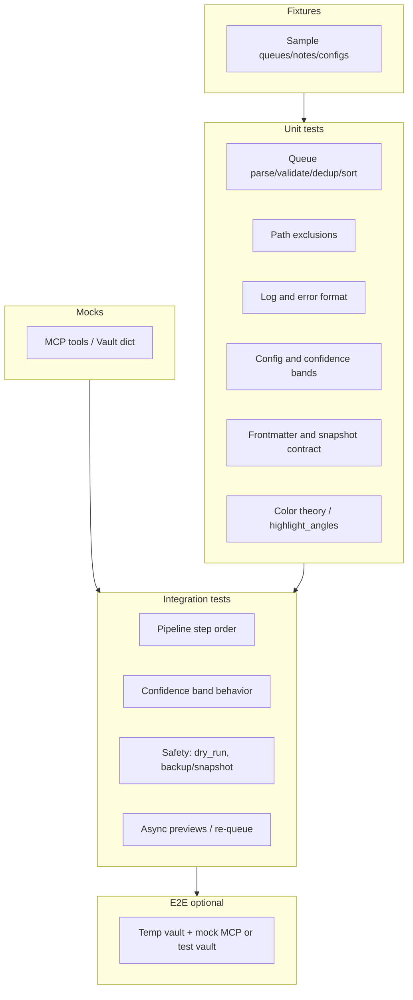

# Second Brain Automated Testing Setup

## Context from the codebase

- **Skills** are described in `.cursor/skills/<name>/SKILL.md` and executed by the agent via MCP and rules — there is no standalone “skill code” to import. Testing will validate **contracts** (expected inputs/outputs and formats) and, where useful, **extract or reimplement** deterministic logic into small testable helpers (e.g. queue parsing, path exclusions, frontmatter rules).
- **Pipelines** are defined in [Cursor-Skill-Pipelines-Reference](3-Resources/Cursor-Skill-Pipelines-Reference.md) and context rules (e.g. [auto-eat-queue](.cursor/rules/context/auto-eat-queue.mdc)); safety invariants are in [mcp-obsidian-integration](.cursor/rules/always/mcp-obsidian-integration.mdc) and [Backbone](3-Resources/Second-Brain/Backbone.md).
- **No existing test suite** — the only “test” references are content notes (e.g. Test-Capture) and [Second-Brain-Starter-Kit/3-Resources/Testing-Checklist.md](Second-Brain-Starter-Kit/3-Resources/Testing-Checklist.md), which is a manual checklist, not automation.

## Testing strategy (layers)


| Layer           | Scope                                                                                                    | Approach                                                                                                     |
| --------------- | -------------------------------------------------------------------------------------------------------- | ------------------------------------------------------------------------------------------------------------ |
| **Unit**        | Queue parse/validate/dedup/sort, path exclusions, log/error format, config keys, frontmatter/link format | Pure Python helpers + assertions; no MCP.                                                                    |
| **Integration** | Pipeline step order, confidence bands (high/mid/low), snapshot triggers, dry_run-before-commit           | Mocked MCP responses; state transitions and call order assertions.                                           |
| **E2E**         | Full trigger → pipeline → vault change                                                                   | Optional: temp dir “vault” + mock MCP, or dedicated test vault with real MCP (run outside `code_execution`). |


Priority: **safety-critical paths first** (exclusions, backup/snapshot gates, dry_run, queue validation), then pipeline/log contracts, then skill output contracts. After safety-critical, prioritize queue modes **ASYNC-LOOP** and **SEEDED-ENHANCE** (user feedback loops). Explicitly test the **Error Handling Protocol** (Logs.md, mcp-obsidian-integration): failures must produce Errors.md entries with Heading, Metadata table, Trace, Summary (Root cause, Impact, Suggested fixes, Recovery).

**New / expanded test categories**


| Layer       | New/Expanded Scope                                                                                                          | Rationale                                                                                                                               |
| ----------- | --------------------------------------------------------------------------------------------------------------------------- | --------------------------------------------------------------------------------------------------------------------------------------- |
| Unit        | Color theory (analogous/complementary), highlight_angles frontmatter, data-drift-level (0–3)                                | Semantic consistency ([Color-Coded-Highlighting](3-Resources/Second-Brain/Color-Coded-Highlighting.md)).                                |
| Unit        | Error Handling Protocol: mock Errors.md entry structure                                                                     | Failures produce doc-compliant entries.                                                                                                 |
| Integration | Async preview (Mobile-Pending-Actions when conf < async_preview_threshold), re-queue after `approved: true`, banner cleanup | Mid-band and mobile ([Parameters](3-Resources/Second-Brain/Parameters.md), [Templates](3-Resources/Second-Brain/Templates.md)).         |
| Integration | mobile-seed-detect: `<mark>` without `data-highlight-source` (SEEDED-ENHANCE)                                               | [mobile-seed-detect](.cursor/rules/context/mobile-seed-detect.mdc), [auto-async-cascade](.cursor/rules/context/auto-async-cascade.mdc). |
| E2E         | Commander-triggered runs (commander_source / commander_macro)                                                               | [Plugins](3-Resources/Second-Brain/Plugins.md), Commander-Plugin-Usage.                                                                 |


---

## 1. Test layout and harness

- **Location**: Place tests under `**3-Resources/Second-Brain/tests/`** so they live in the Resources PARA and are discoverable via Dataview in Vault-Change-Monitor. Do not process `tests/` as pipeline input (exclude in rules/docs).
- **Structure**:
  - `tests/unit/` — queue, path exclusions, log/error format, config, frontmatter, color/highlight contracts.
  - `tests/integration/` — pipeline flows, confidence loops, async/mobile edges, safety invariants.
  - `tests/fixtures/` — sample queue lines (valid/invalid), sample notes (including `<mark>` for SEEDED-ENHANCE), Second-Brain-Config snippets; dynamic fixtures (exclusion list from Vault-Layout/Configs); embed Watcher-protected paths as strings.
  - `tests/run_tests.py` — entrypoint; support **run_in_repl** mode returning results as string for chat-based runs in `code_execution`.
- **Framework**: Use **unittest** (built-in; works in `code_execution`). In `helpers.py`, add `try: import pytest` to enable pytest when available (parametrize, fixtures). Do **not** rely on pyyaml; implement a **simple frontmatter parser** (split on `---`, dict-ify lines) so tests run without extra deps.
- **Harness** (`tests/helpers.py`): Load fixture content from `tests/fixtures/` or embedded strings; parse Second-Brain-Config snippets and exclusion lists. **Mock vault**: dict `{path: content}` with optional mtime for `created`. **MockMCP** class with e.g. `classify_para` returning fixture dicts for integration/E2E (no real MCP in temp-dir). **parse_frontmatter(content)** (no pyyaml): if not starting with `---\n` return `{}, content`; else split on `---\n`, parse first block into key/value dict (split on first `:` per line), return `(fm, body)`.

---

## 2. Unit tests (detailed)

### 2.1 Queue processor contract ([auto-eat-queue](.cursor/rules/context/auto-eat-queue.mdc), [Queue-Sources](3-Resources/Second-Brain/Queue-Sources.md))

- **Parse**: Each line is JSON; require `mode` (string). Invalid lines skipped and counted; reject invalid JSON gracefully (skip + log count).
- **Filter**: Drop entries with `queue_failed === true` (or `tags` containing `"queue-failed"`).
- **Dedup**: Same `(mode, prompt, source_file)` → keep first by timestamp.
- **Sort**: Canonical order INGEST MODE (1) → … → ASYNC-LOOP (12) as in auto-eat-queue §4.
- **Known modes**: Reject unknown mode; test that only documented modes are accepted (INGEST MODE, ORGANIZE MODE, DISTILL MODE, EXPRESS MODE, ARCHIVE MODE, TASK-ROADMAP, TASK-COMPLETE, ADD-ROADMAP-ITEM, SEEDED-ENHANCE, BATCH-DISTILL, BATCH-EXPRESS, ASYNC-LOOP).
- **Fast-path**: When valid entry count === 1, dedup/sort can be skipped (behavioral assertion or unit test that one entry yields one dispatch).
- **Commander fields**: Support optional `commander_source`, `commander_macro` (from [Queue-Sources](3-Resources/Second-Brain/Queue-Sources.md)); assert parse preserves them and they appear in log when present.

**Deliverable**: Implement `parse_queue_line`, `validate_entry`, `dedup_entries`, `canonical_sort_key` (and optionally a small `queue_processor` module) in `tests/` (or `tests/sb_contracts/`). Unit tests in `tests/unit/test_queue.py`.

### 2.2 Path exclusions ([mcp-obsidian-integration](.cursor/rules/always/mcp-obsidian-integration.mdc), pipeline context rules)

- **Excluded paths**: Backups/ (and subdirs), `**/Log*.md`, `**/* Hub.md`, Watcher paths (`Ingest/watched-file.md`, `3-Resources/Watcher-Signal.md`, `3-Resources/Watcher-Result.md`), `4-Archives/`**, `Templates/`**, notes with `watcher-protected: true` (frontmatter).
- **Helper**: `is_excluded_path(path, frontmatter=None)` returning bool. Make it comprehensive: test wildcards `**/Log*.md`, `Backups/`**, and frontmatter `watcher-protected: true` (parse note content or pass frontmatter dict). Assert fixed Watcher paths and any path under Backups/ return True.
- **Not excluded**: Normal PARA paths under `1-Projects/`, `2-Areas/`, `3-Resources/` (and Ingest/ for ingest pipeline).

**Deliverable**: `tests/unit/test_path_exclusions.py` and a small helper in `tests/helpers.py` or `tests/sb_contracts/paths.py`.

### 2.3 Log and error format ([Logs](3-Resources/Second-Brain/Logs.md), [Parameters](3-Resources/Second-Brain/Parameters.md), [Cursor-Skill-Pipelines-Reference](3-Resources/Cursor-Skill-Pipelines-Reference.md) § Log format)

- **Pipeline log line**: Pattern with timestamp, Excerpt, PARA, Changes (including Backup: /path when applicable), Confidence, Proposed MV, Flag, Loop fields (loop_attempted, loop_band, pre_loop_conf, post_loop_conf, loop_outcome, loop_type, loop_reason). When loop_attempted is true, assert loop_* fields and snapshot path are present where applicable.
- **Watcher-Result line**: Full format `requestId: <id> | status: success|failure | message: "..." | trace: "..." | completed: <ISO8601>`; validate all five segments.
- **Errors.md entry**: Align with Error Handling Protocol (Logs.md, mcp-obsidian-integration). Heading `### YYYY-MM-DD HH:MM — Title`; metadata table (pipeline, severity, approval, timestamp, error_type); `#### Trace`; `#### Summary` with Root cause, Impact, Suggested fixes, Recovery. Test the diagrammed structure.

**Deliverable**: `tests/unit/test_log_format.py` — assert that example lines match regex/template or that a validator function accepts valid lines and rejects malformed ones.

### 2.4 Config and parameters ([Second-Brain-Config](3-Resources/Second-Brain-Config.md), [Parameters](3-Resources/Second-Brain/Parameters.md))

- **Config keys**: `batch_size_for_snapshot`, `confidence_bands` (mid, high_threshold), `depths.highlight_coverage_min`, `async_preview_threshold`, `auto_cleanup_after_process`, `archive.age_days`, etc. Parse config snippet (simple frontmatter/keys) and assert expected keys exist and types (e.g. batch_size_for_snapshot integer, confidence_bands optional dict).
- **Confidence bands**: Default high ≥85%, mid 72–84%; test **tunable overrides** (e.g. confidence_bands.mid from Second-Brain-Config) and **fallbacks** (72–84% when config missing). Assert helper returns correct band for a given confidence.

**Deliverable**: `tests/unit/test_config_contract.py` (and optionally a minimal config parser in helpers that only reads the keys used by tests).

### 2.5 Frontmatter and skill output contracts

- **frontmatter-enrich**: Given mock classify_para output (para-type, project-id, confidence), assert that the **documented** required frontmatter (status, confidence, para-type, created, links as YAML array) is present and format is correct. Assert **array formats** (e.g. `tags: [pkm, testing]`, `links: ["[[Resources Hub]]"]`) and atomic note standards from [second-brain-standards](.cursor/rules/always/second-brain-standards.mdc). Reference implementation of the skill described behavior in the test to lock the spec.
- **Snapshot frontmatter** ([obsidian-snapshot SKILL](.cursor/skills/obsidian-snapshot/SKILL.md)): Per-change snapshot note must contain `original_path`, `snapshot_type`, `snapshot_created`, `snapshot_hash`, etc. Test that a function that builds snapshot frontmatter from inputs produces keys required by the skill.
- **Color / highlight contracts** ([Color-Coded-Highlighting](3-Resources/Second-Brain/Color-Coded-Highlighting.md), [Skills](3-Resources/Second-Brain/Skills.md)): Unit tests for color theory (analogous/complementary), `highlight_angles` frontmatter, and `data-drift-level` (0–3) consistency.

**Deliverable**: `tests/unit/test_frontmatter_contract.py`, `tests/unit/test_snapshot_contract.py`, `tests/unit/test_highlight_contract.py`. Keep skill logic as small in-test or helper implementation derived from SKILL.md, not from live MCP.

**Additional unit tests (summary)**


| Sub-section | New tests                           | Expected behavior                  |
| ----------- | ----------------------------------- | ---------------------------------- |
| Queue       | Commander fields, invalid JSON skip | Parse only valid lines; log skips. |
| Exclusions  | Watcher paths, watcher-protected    | Return True for matches.           |
| Log format  | Loop_* fields, snapshot paths       | Include when loop_attempted true.  |
| Config      | Band overrides, archive.age_days    | Fallback to defaults if missing.   |


---

## 3. Integration tests (mocked MCP)

- **Mocking depth**: Use `unittest.mock` for MCP tools (see [MCP-Tools](3-Resources/Second-Brain/MCP-Tools.md)). Patch e.g. `move_note` to return dry_run previews; assert it is called with `dry_run=True` first, then `dry_run=False` for commit.
- **Pipeline order**: Use a **sequence verifier** (e.g. list of called skills) against Cursor-Skill-Pipelines-Reference flowcharts. Given a list of steps (backup, classify_para, frontmatter_enrich, subfolder_organize, …), assert they follow the canonical full-autonomous-ingest (and other pipeline) order.
- **Confidence bands**: Test **all bands** — high: snapshot + destructive; mid: one refinement loop + post_loop_conf check (proceed only if post_loop_conf ≥85%); low: propose-only (callout with "approved: true" instruction per [Templates](3-Resources/Second-Brain/Templates.md)). Use mock confidence values and a state machine or step logger.
- **Snapshot triggers**: Assert per-change vs batch based on `batch_size_for_snapshot` ([Parameters](3-Resources/Second-Brain/Parameters.md), [Configs](3-Resources/Second-Brain/Configs.md)): when batch size > threshold, use BATCH_SNAPSHOT_DIR; when ≤ threshold, per-change only.
- **Safety invariants**:
  - **dry_run before move**: Mock or wrapper for `move_note` records calls; assert for every `dry_run: false` there was a prior `dry_run: true` for the same path.
  - **backup/snapshot before destructive**: Assert before `split_atomic` or `move_note` (commit), a backup or per-change snapshot step was recorded (mock call order).
- **Async and mobile**: Async preview emission (e.g. to Mobile-Pending-Actions when confidence < async_preview_threshold), re-queue after `approved: true`, banner cleanup (success > failure).

**Deliverable**: `tests/integration/test_pipeline_flow.py`, `tests/integration/test_confidence_bands.py`, `tests/integration/test_safety_invariants.py`, `tests/integration/test_async_mobile.py` using `unittest.mock` and optionally a thin pipeline runner that executes a list of steps with mocks.

---

## 4. E2E and fixtures

- **Fixtures**: Add under `tests/fixtures/`: sample `prompt-queue.jsonl` lines (valid and invalid); sample note content with frontmatter (minimal Resource note, note with `<mark>` for SEEDED-ENHANCE); snippet of Second-Brain-Config (frontmatter/YAML) for config tests.
- **E2E – simulation safety**: For temp-dir vaults, ensure **no real MCP calls** — use a **full MockMCP**. If using a dedicated test vault with real MCP, add a **pre-test backup** (align with create_backup tool).
- **E2E – trigger simulation**: Test **glob matches** (e.g. Ingest/*.md → para-zettel-autopilot) and **phrases** (e.g. "EAT-QUEUE" → auto-eat-queue). Commander-triggered runs: assert `commander_source` / `commander_macro` logging.
- **E2E – observability**: After runs, assert entries in mock logs (e.g. Ingest-Log.md format) and Vault-Change-Monitor aggregation.
- **E2E options**: Option A — temp directory as vault with full MockMCP (recommended first). Option B — dedicated test vault and real MCP (run outside `code_execution`); document as later step.

---

## 5. Running tests and coverage

- **Run**: `python -m pytest tests/ -v` or `python -m unittest discover -s tests -p "test_*.py" -v`. Ensure this works in Cursor's `code_execution` (Python REPL) so that "run tests" can be done from chat.
- **run_in_repl mode**: In `run_tests.py`, add a **run_in_repl** mode that outputs results as a string (for chat-based runs in code_execution).
- **Coverage**: Aim for **80%+ coverage on safety-critical modules**. Since `coverage.py` may not be in code_execution libs, suggest a **simple manual tracker** (e.g. count tested functions vs total in a doc). Note: "Optional; run locally with pip install coverage."
- **CI**: Add a **GitHub Actions workflow** (e.g. `.github/workflows/test.yml`) to run tests on push/PR. Future-proofs the plan. Example (optional):

```yaml
name: Run Tests
on: [push, pull_request]
jobs:
  test:
    runs-on: ubuntu-latest
    steps:
      - uses: actions/checkout@v4
      - name: Set up Python
        uses: actions/setup-python@v5
        with: { python-version: '3.12' }
      - run: python -m unittest discover -s 3-Resources/Second-Brain/tests -p "test_*.py" -v
```

---

## 6. Documentation and backbone sync

- **Dedicated doc**: Create `**3-Resources/Second-Brain/Testing.md`** (link from [README](3-Resources/Second-Brain/README.md) and [Backbone](3-Resources/Second-Brain/Backbone.md)). Include where tests live, how to run them, what is covered (unit vs integration vs E2E), that skills are tested via contracts and reference logic, and a **"How to Add Tests"** guide. Sync with exclusions: do not process `tests/` as pipeline input.
- **Backbone integration**: Add Testing to Backbone's "Links to all backbone docs". In [Logs](3-Resources/Second-Brain/Logs.md), mention that test failures can append to Errors.md for unified observability.
- **Diagram**: See §8 for enhanced diagram (Fixtures, Mocks, Async/re-queue).

---

## 7. Example test (from your snippet)

Your frontmatter-enrich example fits as a **unit test** that encodes the skill contract:

- **Location**: `3-Resources/Second-Brain/tests/unit/test_frontmatter_contract.py`.
- **Logic**: A function `enrich_frontmatter_from_classification(content, classification)` (implemented from [frontmatter-enrich SKILL](.cursor/skills/frontmatter-enrich/SKILL.md)) that returns updated note content with frontmatter.
- **Assertions**: `assert 'para-type: Resource' in updated`, `assert 'status: active' in updated`, `assert 'confidence: 90' in updated` (or equivalent), and that `links` is in YAML array form. Use a mock classification dict (para-type, project-id, confidence) and mock note content with `---` frontmatter.
- **Dependency**: Do not rely on pyyaml (not in code_execution libs); use the simple **parse_frontmatter** in helpers (split on `---`, dict-ify lines) to keep tests runnable without extra deps.

---

## 8. Summary diagram




---

## Implementation order

1. **Setup**: Create `3-Resources/Second-Brain/tests/` (unit/, integration/, fixtures/); add `helpers.py` (parse_frontmatter, MockMCP, mock vault) and `run_tests.py` (with run_in_repl mode).
2. **Unit – queue and exclusions (safety-first)**: Implement queue parse/validate/dedup/sort and `test_queue.py`; implement `is_excluded_path` and `test_path_exclusions.py`.
3. **Unit – frontmatter**: Frontmatter-enrich contract test (reference implementation); snapshot and highlight/color contracts; test_frontmatter_contract.py, test_snapshot_contract.py, test_highlight_contract.py.
4. **Unit – log/error format and config**: Validators for log and Errors.md structure; config key/band checks and fallbacks; test_log_format.py, test_config_contract.py.
5. **Integration**: Pipeline order (sequence verifier), confidence-band tests (all bands), snapshot triggers (batch_size_for_snapshot), safety invariants (dry_run, backup/snapshot), async/mobile (test_async_mobile.py).
6. **Fixtures and E2E**: Add fixture files; document E2E (full MockMCP for temp-dir first; optional test vault + pre-test backup).
7. **Docs**: Create Testing.md; link from README and Backbone; add Testing to Backbone links; Logs.md note on test failures → Errors.md.
8. **CI (optional)**: Add `.github/workflows/test.yml` (checkout, setup-python 3.12, unittest discover -s tests).

No changes to existing pipeline or MCP behavior are required; the test suite is additive and lives under `3-Resources/Second-Brain/tests/`.