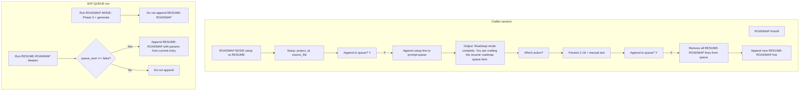

# Single-entry roadmap funnel plan

## Goal

- **Single entry point:** First RESUME-ROADMAP after setup is always crafted via the crafter; no auto-append from ROADMAP MODE (setup). Subsequent continues are either auto-appended (using crafted params) or the user re-triggers the crafter and the new crafted entry replaces stale RESUME-ROADMAP entries.
- **Seamless transition:** After the user confirms appending the ROADMAP MODE (setup) entry, the flow continues in the same session with: *"Roadmap mode complete. You are crafting the resume roadmap queue item."* then the full RESUME-ROADMAP Q&A (Which action? then params 2–18, manual text, Final Append?).
- **Remove stale on resume append:** When the crafter appends a crafted RESUME-ROADMAP (whether after setup or standalone), remove all existing RESUME-ROADMAP lines from `.technical/prompt-queue.jsonl` before appending the new line.
- **Auto-appends use crafted params:** When roadmap-deepen (or the pipeline) appends a follow-up RESUME-ROADMAP, forward the **params from the queue entry that just ran** (project_id, phase, inject_extra_state, token_cap, enable_research, queue_next, etc.); only append when **params.queue_next !== false**.

---

## 1. Crafter: setup → resume continuation and transition message

**Behavior:** When the user chose **ROADMAP MODE (setup)** and confirms "Append to queue?" with Y:

1. Validate, route (prompt-queue.jsonl), read file, append the setup line (mode e.g. `"ROADMAP MODE"` with project_id, source_file), write back.
2. **Do not end the flow.** Output exactly: **"Roadmap mode complete. You are crafting the resume roadmap queue item."**
3. Continue in the same session with the RESUME-ROADMAP branch: ask **"Which action?"** (A. deepen | B. recal | C. Other), then ask **every** param in §1 "Param order by branch" for RESUME-ROADMAP (params 2–18), then manual text phase for included params, then summary and **"Append to queue?"** (Y/n).
4. When the user confirms append for this RESUME-ROADMAP payload, run **remove-stale then append** (see §2).

**Files to update:**

- [User-Questions-and-Options-Reference.md](3-Resources/Second-Brain/User-Questions-and-Options-Reference.md) §1: Add an **Order of questions** note that when the branch is ROADMAP MODE (setup), after the first "Append to queue?" and user confirms, the agent appends the setup payload then says *"Roadmap mode complete. You are crafting the resume roadmap queue item."* and continues with "Which action?" and RESUME-ROADMAP params 2–18, then second "Append to queue?" (and on confirm, remove-stale RESUME-ROADMAP then append).
- [.cursor/rules/context/plan-mode-prompt-crafter.mdc](.cursor/rules/context/plan-mode-prompt-crafter.mdc): In **Behavior** step 8, add a branch: when **mode is ROADMAP MODE (setup)** and user confirms append, (1) perform the append for the setup payload, (2) output the transition sentence exactly as above, (3) continue with RESUME-ROADMAP: ask "Which action?" then params 2–18 in §1 order, resolve C, manual text phase, then present summary and ask "Append to queue?" again; when user confirms this second append, run the RESUME-ROADMAP append logic (including remove-stale, see §2). No fanfare; one short transition line only.
- [Prompt-Crafter-Structure-Detailed.md](3-Resources/Second-Brain/Second-Brain-User-Flows/Prompt-Crafter-Structure-Detailed.md): Document the setup→resume continuation and the transition message in the ROADMAP funnel section.

**Invariant:** The only question that may be "skipped" in the usual sense remains Q0 when the user already said ROADMAP. For setup, we add a **continuation**: after the first append, the agent does not ask "Which action?" as a separate branch choice but as the next step in the same ROADMAP flow (setup done → now resume). So the flow is: ROADMAP → ROADMAP MODE (setup) → project_id, source_file → Append? Y → [append setup] → transition message → Which action? → params 2–18 → manual text → Append? Y → [remove-stale, append resume].

---

## 2. Crafter: remove stale RESUME-ROADMAP when appending a crafted RESUME-ROADMAP

**Behavior:** Whenever the crafter is about to append a payload with **mode === "RESUME-ROADMAP"** (after user confirms "Append to queue?"):

1. **Read** `.technical/prompt-queue.jsonl` (full file).
2. **Filter:** Remove **only** lines for which: (a) `JSON.parse(line)` succeeds, (b) the result has `mode` (string), and (c) `parsed.mode === "RESUME-ROADMAP"`. Preserve all other lines (unparseable, or different mode) in order — do not delete them.
3. **Append** the new RESUME-ROADMAP line to the remaining lines (preserve order of kept lines).
4. **Write** the result back.

If the file is missing or unreadable, create minimal structure then write the single new line (no stale to remove). Document the scope (global remove of RESUME-ROADMAP lines) so that per-project scoping can be added later if needed.

**Files to update:**

- [.cursor/rules/context/plan-mode-prompt-crafter.mdc](.cursor/rules/context/plan-mode-prompt-crafter.mdc): In step 8, under "If user confirms (Y / yes / append)", add: when **mode is RESUME-ROADMAP**, before append: read file, drop each line whose parsed `mode` is `"RESUME-ROADMAP"`, then append the new line to the filtered content and write. (So the write is: filtered_lines + newline + new_JSONL_line.)
- [Queue-Sources.md](3-Resources/Second-Brain/Queue-Sources.md) § "Question-led crafter: queue routing and append": Add bullet: **Remove stale on RESUME-ROADMAP append:** When appending a crafted RESUME-ROADMAP entry, first remove all existing lines in prompt-queue.jsonl whose mode is RESUME-ROADMAP, then append the new line. Ensures one clear resume chain; re-triggering the crafter for a new resume replaces any auto-appended or older crafted resume entries.
- [User-Questions-and-Options-Reference.md](3-Resources/Second-Brain/User-Questions-and-Options-Reference.md) §1: Mention in the Final / Append step that for RESUME-ROADMAP the agent removes existing RESUME-ROADMAP entries from the queue before appending.

---

## 3. Pipeline: auto-append forwards crafted params and honors queue_next

**Behavior:**

- **roadmap-deepen** (and any other code path that appends a follow-up RESUME-ROADMAP to prompt-queue.jsonl): Build the new entry from the **params of the queue entry that triggered this run** (the current RESUME-ROADMAP entry). Forward all params that are valid for RESUME-ROADMAP (action, project_id, phase, sectionOrTaskLocator, enable_context_tracking, enable_research, research_queries, async_research, research_distill, handoff_gate, min_handoff_conf, inject_extra_state, token_cap, max_depth, branch_factor, profile, userText, queue_next, etc.). Allow overrides only where the pipeline must set them (e.g. do not override action with "deepen" when appending a deepen follow-up). Do **not** append when **params.queue_next === false** (user opted out of chaining).
- **queue_next:** When the run was triggered by an entry with `params.queue_next === false`, do not append a follow-up RESUME-ROADMAP line.

**Files to update:**

- [.cursor/skills/roadmap-deepen/SKILL.md](.cursor/skills/roadmap-deepen/SKILL.md): In step 7 ("Queue next deepen" and related bullets): (1) Add condition: append a follow-up RESUME-ROADMAP **only if** `params.queue_next !== false` (when false, skip appending). (2) Specify that the appended line must carry **params from the current queue entry** (the one that triggered this run): project_id, source_file, action (deepen), and all other RESUME-ROADMAP params from the current entry (phase, inject_extra_state, token_cap, enable_research, handoff_gate, etc.) so that the next run uses the same crafted preferences. Document that this preserves the "single entry funnel": the first resume is crafted; subsequent follow-ups reuse those params.
- [.cursor/rules/context/auto-roadmap.mdc](.cursor/rules/context/auto-roadmap.mdc): In the deepen branch, add a short note that when calling roadmap-deepen, the caller passes through the **current queue entry params** so that roadmap-deepen can forward them when appending the next RESUME-ROADMAP; and that when params.queue_next is false, no follow-up is appended.

---

## 4. Documentation: first-resume funnel and no auto-append from setup

**Behavior:**

- State explicitly that **ROADMAP MODE (setup)** does **not** append a RESUME-ROADMAP entry after it runs. The first RESUME-ROADMAP after setup is always created via the crafter (either in the same session right after setup, or in a separate session). Pipeline (roadmap-generate-from-outline / auto-roadmap) does not add a follow-up RESUME-ROADMAP when handling a ROADMAP MODE entry.

**Files to update:**

- [Queue-Sources.md](3-Resources/Second-Brain/Queue-Sources.md): In the prompt-queue.jsonl section or a new "Single-entry roadmap funnel" subsection: (1) ROADMAP MODE (setup) never appends a RESUME-ROADMAP entry. (2) First resume after setup = crafter only (seamless continuation after setup append, or user starts a new crafter session and chooses RESUME-ROADMAP). (3) Subsequent resume entries are either auto-appended by the pipeline (using the params from the entry that just ran; only if queue_next !== false) or a new crafted entry (crafter removes existing RESUME-ROADMAP lines then appends).
- [.cursor/rules/context/auto-roadmap.mdc](.cursor/rules/context/auto-roadmap.mdc): In "ROADMAP MODE = setup only", add one line: **Do not append RESUME-ROADMAP** after setup runs; the first resume is crafted by the user (crafter continues into resume after setup, or user crafts resume in a new session).
- [User-Questions-and-Options-Reference.md](3-Resources/Second-Brain/User-Questions-and-Options-Reference.md) or [Prompt-Crafter-Structure-Detailed.md](3-Resources/Second-Brain/Second-Brain-User-Flows/Prompt-Crafter-Structure-Detailed.md): Add a one-sentence funnel summary: first resume after roadmap setup is always crafted (no auto-append from setup); re-triggering the crafter for a new resume clears existing RESUME-ROADMAP queue entries and appends the new one.

---

## 5. Sync and backbone

- Update [.cursor/sync/rules/context/plan-mode-prompt-crafter.md](.cursor/sync/rules/context/plan-mode-prompt-crafter.md) to match the rule changes.
- Update [Rules.md](3-Resources/Second-Brain/Rules.md) or [README](3-Resources/Second-Brain/README.md) if the high-level description of the crafter or roadmap flow should mention the setup→resume continuation and single-entry funnel.
- Optional: [.cursor/sync/changelog.md](.cursor/sync/changelog.md) entry for the rule/skill/doc updates.

---

## Flow summary (mermaid)

---

## Implementation order

1. **Doc and rule: setup → resume continuation and transition message** (User-Questions-and-Options-Reference, plan-mode-prompt-crafter.mdc, Prompt-Crafter-Structure-Detailed).
2. **Crafter: remove-stale on RESUME-ROADMAP append** (plan-mode-prompt-crafter.mdc, Queue-Sources, User-Questions-and-Options-Reference).
3. **Pipeline: forward params and queue_next** (roadmap-deepen SKILL, auto-roadmap.mdc).
4. **Documentation: funnel and no auto-append from setup** (Queue-Sources, auto-roadmap, reference/structure doc).
5. **Sync and backbone** (sync copy, Rules/README if needed, changelog).

No changes to roadmap-generate-from-outline for setup (it already does not append); confirm auto-roadmap setup path does not append a RESUME-ROADMAP entry anywhere.

---

## 6. Potholes and protections (compensating changes)

Areas that must be updated or hardened so the funnel does not cause silent failures or overwrites.

### 6.1 EAT-QUEUE Step 8 overwrites pipeline appends (critical)

**Pothole:** Step 8 currently rewrites `.technical/prompt-queue.jsonl` from **in-memory state only** (entries that failed or were skipped). When roadmap-deepen (or async RESEARCH-AGENT, or any pipeline) **appends** a new line to the file **during** the run, that line is not in the in-memory queue. Step 8 then overwrites the file and **drops** the newly appended line — silent failure, follow-up RESUME-ROADMAP never runs.

**Protection:** In [auto-eat-queue.mdc](.cursor/rules/context/auto-eat-queue.mdc) Step 8 (Clear passed entries):

- **Before** writing the new queue content: **Re-read** `.technical/prompt-queue.jsonl` from disk (or from the same path used at step 1).
- **Merge logic:** Build the set of requestIds (or equivalent stable keys) that were **processed successfully** this run. For each line in the re-read file: parse the line; if parse succeeds and the entry’s `id` (or `mode`+`source_file`+`id` as fallback) is in the success set, **omit** it; otherwise **keep** the line (including lines that were not in the original read — i.e. appended during the run).
- **Write:** Write the kept lines (failed/skipped from original run + any lines that were appended during the run). Then, if applicable, append CHECK_WRAPPERS and tag failed entries with `queue_failed: true` on the lines that are kept from the original set.

Document in the rule: "Step 8 preserves lines that were appended to the queue file during this run (e.g. by roadmap-deepen or RESEARCH-AGENT) so that pipeline-appended follow-ups are not lost."

### 6.2 Remove-stale parse safety (crafter)

**Pothole:** When filtering lines to remove "stale" RESUME-ROADMAP, a bug could drop lines where `JSON.parse` fails or `mode` is missing, deleting non-roadmap or malformed lines and causing data loss or silent misbehavior.

**Protection:** In the crafter rule and Queue-Sources, specify:

- **Only remove** a line if: (1) the line parses as valid JSON, (2) the parsed object has `mode` (string), and (3) `parsed.mode === "RESUME-ROADMAP"`.
- **Preserve** all other lines: unparseable lines, non-JSON lines, and lines with a different `mode` must be kept in the same order. If parse fails, keep the line unchanged.

### 6.3 ROADMAP MODE in dispatch and known-mode list

**Pothole:** The crafter will emit `mode: "ROADMAP MODE"` for setup. If EAT-QUEUE’s known-mode list or dispatch table does not include **"ROADMAP MODE"**, the entry will be skipped with "unknown or invalid mode" and the setup payload will never run.

**Protection:**

- In [auto-eat-queue.mdc](.cursor/rules/context/auto-eat-queue.mdc): Add **"ROADMAP MODE"** to the known-mode list in step 5 (Dispatch) and add an explicit dispatch: **ROADMAP MODE** → run auto-roadmap setup path (Phase 0 + roadmap-generate-from-outline; same as current "ROADMAP MODE – generate from outline" behavior). Ensure the mode string matches exactly what the crafter emits (e.g. `"ROADMAP MODE"`).
- In [Queue-Sources.md](3-Resources/Second-Brain/Queue-Sources.md) § Validation: Ensure "ROADMAP MODE" is listed as a known mode for crafter validation so the agent does not reject the setup payload at append time.

### 6.4 queue_next default

**Pothole:** Existing queue entries (and future crafted ones) may omit `queue_next`. If the pipeline treats "absent" as "do not append", all current behavior would stop chaining; if treated as "append", backward compatibility is preserved.

**Protection:** In [Parameters.md](3-Resources/Second-Brain/Parameters.md) and/or [Queue-Sources.md](3-Resources/Second-Brain/Queue-Sources.md): State that for RESUME-ROADMAP, when `params.queue_next` is **absent** or **undefined**, treat as **true** (append follow-up when caps allow). Only when **explicitly `false`** does the pipeline skip appending. This preserves existing behavior and avoids silent stop of the chain.

### 6.5 Contract tests and KNOWN_MODES

**Pothole:** [tests/sb_contracts/queue.py](3-Resources/Second-Brain/tests/sb_contracts/queue.py) defines `KNOWN_MODES` without RESUME-ROADMAP or ROADMAP MODE. Any code or test that uses this list to validate or sort could reject valid crafter output or mis-sort.

**Protection:** Add **"RESUME-ROADMAP"** and **"ROADMAP MODE"** to `KNOWN_MODES` in `queue.py` (and assign a canonical order index if the list is used for sorting). Ensure `validate_entry` continues to allow any string mode (it does not currently restrict by KNOWN_MODES). If fixtures or tests assert on "known mode" or sort order, update them so ROADMAP MODE and RESUME-ROADMAP are accepted.

### 6.6 Commander and Watcher appends

**Pothole:** Commander macros or Watcher may append RESUME-ROADMAP entries. After the change, when the user runs the crafter and appends a new RESUME-ROADMAP, remove-stale will delete those entries. If docs or macros assume "my appended entry stays until EAT-QUEUE runs it," users may be surprised.

**Protection:** In [Queue-Sources.md](3-Resources/Second-Brain/Queue-Sources.md) § Single-entry funnel (or Remove stale): Add one sentence: "Commander- or Watcher-appended RESUME-ROADMAP entries are also removed when the user crafts a new RESUME-ROADMAP via the question-led crafter and confirms append; the crafter is the single entry point for resume intent."

### 6.7 Forwarded params: project_id / source_file

**Pothole:** When roadmap-deepen builds the follow-up RESUME-ROADMAP entry, the current queue entry might have only `source_file` or only `project_id`. The next run needs at least one to resolve project. If both are missing after forwarding, the next dispatch could fail (e.g. source_file not found).

**Protection:** In [roadmap-deepen/SKILL.md](.cursor/skills/roadmap-deepen/SKILL.md) (and auto-roadmap when it instructs the skill): When building the appended line, **require** that the new entry include either `project_id` or `source_file` (or both). If the current entry has neither, derive from workflow_state or roadmap-state path (e.g. from `1-Projects/<project_id>/Roadmap/workflow_state.md`) and set at least one in the appended payload. Document that the follow-up entry must be dispatchable without additional context.

---

## Implementation order (revised)

1. **EAT-QUEUE Step 8 re-read/merge** (auto-eat-queue.mdc) — prevent overwriting pipeline-appended lines.
2. **ROADMAP MODE in dispatch and known-mode** (auto-eat-queue.mdc, Queue-Sources) — ensure setup payload is accepted and dispatched.
3. **Doc and rule: setup → resume continuation and transition message** (User-Questions-and-Options-Reference, plan-mode-prompt-crafter.mdc, Prompt-Crafter-Structure-Detailed).
4. **Crafter: remove-stale on RESUME-ROADMAP append** with parse safety (plan-mode-prompt-crafter.mdc, Queue-Sources, User-Questions-and-Options-Reference).
5. **Pipeline: forward params and queue_next** (roadmap-deepen SKILL, auto-roadmap.mdc); **queue_next default** (Parameters, Queue-Sources); **forwarded params project_id/source_file** (roadmap-deepen).
6. **Documentation: funnel and no auto-append from setup** (Queue-Sources, auto-roadmap, reference/structure doc); **Commander/Watcher note** (Queue-Sources).
7. **Contract tests** (sb_contracts/queue.py KNOWN_MODES, any fixture or test that validates mode).
8. **Sync and backbone** (sync copy, Rules/README if needed, changelog).