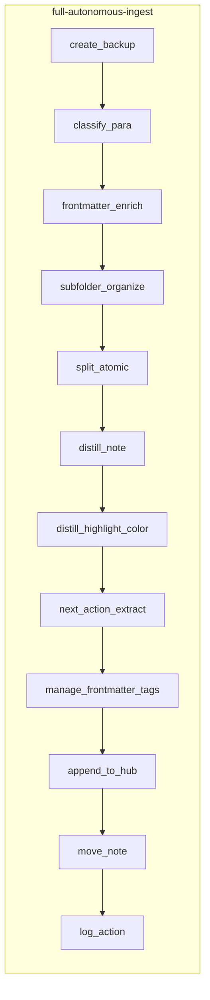

# Skill Pipelines Implementation (Skills First)

## Current state

- **Skills**: No `.cursor/skills/` in the vault yet. Skills will be built **before** Cursor rules (Phase 2 always-applied rules can follow or run in parallel).
- **MCP**: [user-obsidian-para-zettel-autopilot](mcps/user-obsidian-para-zettel-autopilot) provides: `obsidian_create_backup`, `obsidian_classify_para`, `obsidian_split_atomic`, `obsidian_distill_note`, `obsidian_manage_frontmatter`, `obsidian_manage_tags`, `obsidian_append_to_hub`, `obsidian_move_note`, `obsidian_log_action`, `obsidian_read_note`, `obsidian_list_notes`, `obsidian_global_search`, `obsidian_search_replace`, `obsidian_update_note`, `obsidian_ensure_backup`, `obsidian_rename_note`, `obsidian_delete_note`, `obsidian_ensure_structure`. **No** `obsidian_create_note` — use `obsidian_read_note` + `obsidian_update_note(path, content, mode: overwrite)` for new files (e.g. version snapshots); confirm whether the server creates parent dirs for new paths.
- **Frontmatter**: [obsidian_manage_frontmatter](mcps/user-obsidian-para-zettel-autopilot/tools/obsidian_manage_frontmatter.json) takes `path`, `key`, `value` (string), `action` (set/delete). For array fields like `next-actions`, use a string format (e.g. JSON array or comma-separated) and document in the skill.
- **Logging**: [obsidian_log_action](mcps/user-obsidian-para-zettel-autopilot/tools/obsidian_log_action.json) has no `backup_path` parameter; include backup path in the `changes` string or in the log line format documented in the skill/rule.
- **Highlightr**: [Highlightr-Color-Key.md](3-Resources/Highlightr-Color-Key.md) has master key and `highlight_key`; no "Project-Specific Guidelines" section yet. Highlight application is via `obsidian_search_replace` / `obsidian_update_note` using `==text==^{color}` (or plugin syntax) and the key.

---

## Where skills and pipelines live

| Item                      | Location                                                                                                                                                 |
| ------------------------- | -------------------------------------------------------------------------------------------------------------------------------------------------------- |
| Reusable skill logic      | `.cursor/skills/<skill-name>/` with `SKILL.md` (and optional `reference.md`)                                                                             |
| Pipeline order + triggers | Document in a single **pipelines reference** note (e.g. `3-Resources/Cursor-Skill-Pipelines-Reference.md`) and later in context-specific rules (Phase 3) |
| Always-applied safety     | Phase 2 → `.cursor/rules/always/*.mdc` (backup-first, no shell vault ops, ingest safety, auto-logging, MCP integration)                                  |

Skills are **invoked by the agent** when running a pipeline; pipeline rules (Phase 3) will define trigger phrases and globs and **sequence** these skills. This plan implements the skills and the pipelines reference; rule text can reference "see skill X" for the detailed steps.

---

## Implementation order (priority)

1. **distill-highlight-color** — Shared by ingest and distill; color theory + project overrides.
2. **subfolder-organize** — Shared by ingest and archive; path schema (≤4 levels).
3. **frontmatter-enrich** and **next-action-extract** — Ingest; structured metadata for Dataview.
4. **related-content-pull** — Express; cross-note linking.
5. **express-mini-outline** — Express; output with project colors.
6. **callout-tldr-wrap** — Distill; quick visual win.
7. **layer-promote**, **readability-flag**, **archive-check**, **resurface-candidate-mark**, **summary-preserve**, **call-to-action-append**, **version-snapshot**.

---

## Skill specifications (summary)

Each skill is implemented as a project skill under `.cursor/skills/<name>/SKILL.md` with: `name`, `description` (third-person, trigger terms), **Instructions** (steps, MCP tools, confidence gate), optional **Reference** link to [Highlightr-Color-Key.md](3-Resources/Highlightr-Color-Key.md) or vault docs.

### 1. distill-highlight-color

- **After**: `distill_note` (ingest) or after standard distill layers (distill pipeline).
- **What**: Apply Highlightr colors from master key + project `highlight_key`; use color theory (analogous for related ideas, complementary for contrasts).
- **How**: CoT to pick spans → `obsidian_search_replace` (or `obsidian_update_note`) to wrap in `==text==^{color}`; read [Highlightr-Color-Key.md](3-Resources/Highlightr-Color-Key.md) and project-specific guidelines.
- **Gate**: ≥80%.
- **Reference**: Add "Project-Specific Guidelines" to Highlightr-Color-Key (see Documentation section).

### 2. subfolder-organize

- **After**: frontmatter-enrich (ingest) or before move (archive).
- **What**: Build target path from `para-type` + semantic themes / `project-id`, max 4 levels (e.g. `1-Projects/Project-X/Idea-Cluster/YYYY-MM-DD-title.md` or `4-Archives/Project-X-Archive/Subtheme/`).
- **How**: Derive subpath from frontmatter + content themes → `obsidian_move_note(path, new_path)`. If MCP does not create parent dirs, document or call `obsidian_ensure_structure` first where applicable.
- **Gate**: ≥85%; propose only if <85%.

### 3. frontmatter-enrich

- **After**: classify_para.
- **What**: Set `status`, `confidence`, `para-type`, `created`, `links` (hub + related); optional `project-id`, `priority`, `deadline` if detected.
- **How**: Multiple `obsidian_manage_frontmatter` calls (path, key, value, action: set). CoT for optional fields.
- **Gate**: ≥85% auto.

### 4. next-action-extract

- **After**: distill-highlight-color.
- **What**: Extract tasks → checklists in body + `next-actions` in frontmatter (array); color-code by project if desired.
- **How**: Parse content for tasks → `obsidian_search_replace` for checklist format; `obsidian_manage_frontmatter` for `next-actions` (value as string: JSON array or comma-sep — document in skill).
- **Gate**: ≥85%.

### 5. related-content-pull

- **Slot**: Before express-mini-outline (express pipeline).
- **What**: Pull similar notes (semantic + project-id) → append "Related" section; use color theory for relation emphasis.
- **How**: `obsidian_global_search` with query derived from note + project-id → append block via `obsidian_update_note` (mode: append).
- **Gate**: ≥80%.

### 6. express-mini-outline

- **After**: read_note (and optionally related-content-pull).
- **What**: Generate outline/summary → append as fenced block; project colors for sections.
- **How**: CoT outline → `obsidian_update_note` (append) with section styling.
- **Gate**: ≥85% for append.

### 7. callout-tldr-wrap

- **After**: layer-promote (distill pipeline).
- **What**: Wrap TL;DR in `> [!summary] TL;DR` callout; optional color-callout border via CSS + color key.
- **How**: `obsidian_search_replace` or `obsidian_update_note` to wrap existing TL;DR block.
- **Gate**: always.

### 8. layer-promote

- **After**: distill-highlight-color (distill pipeline).
- **What**: Promote bold → highlight → TL;DR with project color overrides; contrast colors for conflicting ideas.
- **How**: CoT + `obsidian_search_replace` for edits.
- **Gate**: ≥85%.

### 9. readability-flag

- **Slot**: End of distill pipeline.
- **What**: If low readability → `needs-simplify: true` + warning callout; flag related project ideas.
- **How**: Heuristic (sentence length/structure) + `obsidian_manage_frontmatter` + `obsidian_search_replace` for callout.
- **Gate**: ≥70%.

### 10. archive-check

- **After**: classify_para (archive pipeline).
- **What**: Heuristic for archive: no open tasks, `status: complete`, age > threshold; cross-check project subfolders.
- **How**: `obsidian_read_note` + frontmatter; optional `obsidian_list_notes` / `obsidian_global_search` for linked notes.
- **Gate**: ≥85% for move.

### 11. resurface-candidate-mark

- **Before**: move (archive pipeline).
- **What**: If high potential (links/highlights) → `resurface-candidate: true`; optionally append to Resurface hub.
- **How**: `obsidian_manage_frontmatter` + optional `obsidian_append_to_hub` (Resurface hub).
- **Gate**: ≥75%.

### 12. summary-preserve

- **Before**: move (archive pipeline).
- **What**: If no TL;DR → light distill + callout; preserve project color links.
- **How**: `obsidian_distill_note` (light) + `obsidian_search_replace` for callout.
- **Gate**: ≥80%.

### 13. call-to-action-append

- **Slot**: End of express pipeline.
- **What**: Append CTA callout (e.g. `> [!tip] Share/Publish?`); color by action type/project key.
- **How**: `obsidian_update_note` (append).
- **Gate**: always.

### 14. version-snapshot

- **Before**: Any major append (express pipeline).
- **What**: Dated snapshot in subfolder (e.g. Project-X/Versions/); preserve original colors.
- **How**: `obsidian_read_note` → `obsidian_update_note(path: "…/Versions/YYYY-MM-DD-snapshot.md", content, mode: overwrite). No` obsidian_create_note`; document if parent-dir creation is required and MCP behavior.
- **Gate**: always.

---

## Pipeline flow (for reference doc and later rules)

- **autonomous-distill**: (backup) → distill layers → **distill-highlight-color** → **layer-promote** → **callout-tldr-wrap** → **readability-flag**.
- **autonomous-archive**: (backup) → classify_para → **archive-check** → **subfolder-organize** (archive path) → **resurface-candidate-mark** → **summary-preserve** → move_note → log_action.
- **autonomous-express**: (backup) → **version-snapshot** (before major append) → **related-content-pull** → **express-mini-outline** → **call-to-action-append**.

---

## Documentation updates

1. **[Highlightr-Color-Key.md](3-Resources/Highlightr-Color-Key.md)**
  Add **## Project-Specific Guidelines** with:
  - Examples (e.g. "For Project-X: Use blue-green analogous for user-flow ideas; orange contrast for pain points").
  - Note that skills use frontmatter `highlight_key` for project overrides; fallback to master key.
  - Optional: color-callout border via CSS snippet tied to color key (for callout-tldr-wrap).
2. **Pipelines reference** (new note, e.g. `3-Resources/Cursor-Skill-Pipelines-Reference.md`)
  - List four pipelines and skill order (tables from your draft).
  - State: skills use frontmatter `highlight_key` for project overrides; subfolder depth ≤4; paths from `project-id` + themes; confidence gates per pipeline table.
  - Point to skills in `.cursor/skills/` and to Phase 2/3 rules for triggers and safety.

---

## Consistency with project goal and safety

- **Backup-first**: Every pipeline that moves/overwrites/deletes must start with `obsidian_create_backup` (or ensure_backup); document including backup path in each log entry (e.g. in `changes`).
- **Propose vs auto**: At always-applied layer, propose only; at context-specific (e.g. ingest autopilot), ≥85% auto-execute; other pipelines use the per-skill gates above.
- **No shell for vault**: All vault ops via MCP; no cp/mv/rm for vault.
- **Frontmatter/Dataview/callouts**: Skills drive structured metadata and callouts for "scannable, relationally clear, action-oriented" output; tags are secondary.

---

## Checklist before considering complete

- `.cursor/skills/` exists with 14 skill directories and `SKILL.md` each (name, description, instructions, MCP tools, gate).
- distill-highlight-color references Highlightr-Color-Key and project guidelines; color theory (analogous/complementary) in skill or in doc.
- Highlightr-Color-Key.md has "Project-Specific Guidelines" and `highlight_key` fallback.
- Pipelines reference note lists all four pipelines, skill order, gates, and subfolder/path conventions.
- version-snapshot documents use of read_note + update_note to new path; any MCP limitation on creating parent dirs noted.
- next-action-extract documents frontmatter format for `next-actions` (string representation).
- Log format (including backup path in changes or in rule doc) documented in auto-logging skill or in pipelines reference.

