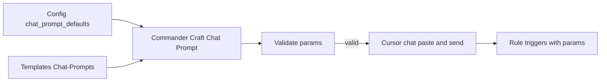

# Plan: Document Standardized Chat Prompts and User Flows

## Goal

- **Second-Brain folder**: Document the **prompts themselves** — canonical chat strings, template files, config (`chat_prompt_defaults`), validation, and how they map to Pipelines § Trigger and rules.
- **Second-Brain-User-Flows folder**: Document the **user flows** for “how to initialize Cursor” / “how to use standardized prompts” at **three detail levels** (High / Mid / Detailed), consistent with existing flow docs (e.g. User-Flow-Prompt-Crafter-*).

No code or macro implementation in this plan — documentation only.

---

## 1. Documents in Second-Brain (reference / spec)

These live under [3-Resources/Second-Brain/](3-Resources/Second-Brain/) and describe **what** the prompts are and **where** they are defined.

| Document                     | Purpose                                                                                                                                                                                                                                                                                                                                                                                                                                                                                                                                                                                                                                                                                         |
| ---------------------------- | ----------------------------------------------------------------------------------------------------------------------------------------------------------------------------------------------------------------------------------------------------------------------------------------------------------------------------------------------------------------------------------------------------------------------------------------------------------------------------------------------------------------------------------------------------------------------------------------------------------------------------------------------------------------------------------------------- |
| **Chat-Prompts.md** (new)    | Single reference for **standardized chat prompts**: canonical trigger phrases (INGEST MODE, DISTILL MODE, etc.), optional param/guidance syntax, link to Pipelines § Trigger. Include: (1) canonical vs alternate phrasing (and **queue integration** — see below), (2) example ready-to-paste strings (basic, with params, with guidance), (3) pointer to `Templates/Chat-Prompts/` and to Config `chat_prompt_defaults` if used, (4) **validation and fallback** table (see below), (5) **safety callout** (see below), (6) **prompt-to-rule Mermaid** (see below). Keep it short; link to Pipelines, Queue-Sources, Queue-Alias-Table, Templates, Configs, Cursor-Skill-Pipelines-Reference. |
| **Templates.md** (extend)    | Add a subsection **Chat-Prompts (copy-paste)** under “Where” or after “Prompt-Components”: location `Templates/Chat-Prompts/` (or equivalent per Vault-Layout), purpose (copy-paste ready strings for Cursor chat), relation to Prompt-Components (Chat-Prompts = user-facing strings; Prompt-Components = assembly for queue/crafter). Optional: one-sentence note that Templater may resolve placeholders if hooked.                                                                                                                                                                                                                                                                          |
| **Configs.md** (extend)      | If you introduce **chat_prompt_defaults** in Second-Brain-Config: document the block (per-pipeline base string, optional profiles, guidance snippet), and that Commander / prompt-builder read it. If no config block yet, omit or add a “Reserved: chat_prompt_defaults” line so the slot exists.                                                                                                                                                                                                                                                                                                                                                                                              |
| **Pipelines.md** (minor)     | No structural change. Ensure the Trigger table remains the single source for “this phrase → this pipeline”; Chat-Prompts.md will reference it and show example strings that use those triggers.                                                                                                                                                                                                                                                                                                                                                                                                                                                                                                 |
| **Queue-Sources.md** (minor) | Optional one-sentence: chat prompts (paste in Cursor) and queue entries (EAT-QUEUE) both feed the same pipelines; queue carries structured params, chat uses defaults/fallback.                                                                                                                                                                                                                                                                                                                                                                                                                                                                                                                 |
| **Rules.md** (minor)         | If you add a Commander “Craft Chat Prompt” macro later: in § Commander, add a short bullet that macros can assemble **chat** prompts (paste into Cursor) from config/templates; link to Commander-Plugin-Usage and Chat-Prompts.                                                                                                                                                                                                                                                                                                                                                                                                                                                                |
| **README.md** (index)        | Add to Documentation index: "[[Chat-Prompts                                                                                                                                                                                                                                                                                                                                                                                                                                                                                                                                                                                                                                                     |

**Template files on disk**: If you create actual template files (e.g. `Templates/Chat-Prompts/Ingest-Default.md`), they are **content** that Chat-Prompts.md and Templates.md describe; their location must match Vault-Layout and the “Templates” backbone (e.g. under `Templates/`). Document path and naming in Chat-Prompts.md and Templates.md.

---

### Chat-Prompts.md: required sections (extensions)

- **Queue integration**: Add a section mapping chat prompts to queue modes/payloads (e.g. "INGEST MODE" → `prompt-queue.jsonl` entry with `mode: "INGEST MODE"`). Reference Queue-Sources for format and Queue-Alias-Table for aliases (e.g. "Process Ingest" = "INGEST MODE"). Reduces inconsistencies from missing params in queue entries.
- **Safety invariants (callout)**: In Chat-Prompts.md and in **all three** user-flow docs, add a boxed callout: triggers propose only; no move/rename without approved: true (per Pipelines § Phase 2); backup/snapshot/dry_run always before commit (enforced by mcp-obsidian-integration). In the **Detailed** user flow, emphasize in a dedicated subsection (mimic User-Flow-Rules-Detailed § Decision Wrapper).
- **Validation and fallback table**: In Chat-Prompts.md, add a table from Prompt-Crafter-Structure-Detailed § Validation: param (rationale_style, max_candidates), allowed values, fallback if invalid (e.g. concise; 7; log to Errors.md). Cross-ref Configs for prompt_defaults.
- **Prompt-to-rule Mermaid**: In Chat-Prompts.md, add a flowchart: canonical/alternate phrases → rule(s) → pipeline → Decision Wrapper. Pull rule/pipeline names from Cursor-Skill-Pipelines-Reference (e.g. INGEST MODE / Process Ingest → para-zettel-autopilot + always-ingest-bootstrap → full-autonomous-ingest Phase 1 → Decision Wrapper A–G padded to 7).

---

## 2. Documents in Second-Brain-User-Flows (three detail levels)

These live under [3-Resources/Second-Brain/Second-Brain-User-Flows/](3-Resources/Second-Brain/Second-Brain-User-Flows/) and describe **how the user** chooses and uses standardized prompts.

| Level        | Document                                 | Purpose                                                                                                                                                                                                                                                                                                                                                                                                                                               |
| ------------ | ---------------------------------------- | ----------------------------------------------------------------------------------------------------------------------------------------------------------------------------------------------------------------------------------------------------------------------------------------------------------------------------------------------------------------------------------------------------------------------------------------------------- |
| **High**     | **User-Flow-Chat-Prompts-High-Level.md** | One-page flow: user gets a ready prompt (from template file or Commander “Craft Chat Prompt” macro) → copies/pastes into Cursor → sends. Main gates: validation preview (if macro), fallback when malformed (default params, no move without approved: true). **Safety callout** in doc: triggers propose only; no move without approval (Pipelines § Phase 2). Link to Chat-Prompts.md, Pipelines, Prompt-Crafter (queue path).                      |
| **Mid**      | **User-Flow-Chat-Prompts-Mid-Level.md**  | Per-option paths: (1) **Template** — open file in `Templates/Chat-Prompts/`, copy, paste in Cursor. (2) **Macro** — run “Craft Chat Prompt”, choose pipeline/profile, get preview → copy/paste or “paste to temp note”. (3) **Queue-first** — craft queue entry instead of chat (EAT-QUEUE). What user sees when valid vs invalid (preview, log, Errors.md). Relation to Prompt-Crafter flows (params, profiles).                                     |
| **Detailed** | **User-Flow-Chat-Prompts-Detailed.md**   | Full option set: exact macro names, template list and fields, validation rules, error paths. **Safety**: dedicated subsection (mimic User-Flow-Rules-Detailed § Decision Wrapper) — triggers propose only; backup/snapshot/dry_run before commit; no move without approved: true. Queue vs chat parity. Cross-refs: Chat-Prompts.md, Pipelines, Queue-Sources, Configs, Commander-Plugin-Usage, Prompt-Crafter-Structure-*, mcp-obsidian-integration. |

**Parity with Prompt-Crafter docs**: Ensure High/Mid/Detailed match the structure of User-Flow-Prompt-Crafter-* (same sectioning pattern). Commander macro paths from Commander-Plugin-Usage. In Templates.md, add `Templates/Chat-Prompts/` as optional; reference existing `Templates/Prompt-Components/` to avoid duplication.

**Structure docs (optional)**  
If you want a “structure” trio parallel to Prompt-Crafter (e.g. Chat-Prompts-Structure-High/Mid/Detailed), you can add them under Second-Brain-User-Flows to describe **structure** of chat defaults (config shape, template fields, validation). Otherwise, keep structure in Second-Brain (Chat-Prompts.md + Configs + Templates) and use the **User-Flow-Chat-Prompts-*** trio only for flows.

---

## 3. Boundaries and cross-links

- **Second-Brain** = reference: canonical phrases, template location, config schema, validation behavior, link to Pipelines § Trigger. No step-by-step “user does A then B.”
- **Second-Brain-User-Flows** = flows at three depths: what the user does (template vs macro vs queue), what they see (preview, valid/invalid), and how it ties to safety (no move without approved: true).
- **Prompt-Crafter docs** (existing): stay focused on **queue** and **param assembly** (Craft Prompt, Craft and Queue, prompt_defaults). Chat-Prompts docs and User-Flow-Chat-Prompts-* cover the **chat** surface (paste into Cursor); they link to Prompt-Crafter for shared config/params and queue-first alternative.

---

## 4. Diagram (for Chat-Prompts or User-Flow High-Level)

Optional Mermaid in Chat-Prompts.md or User-Flow-Chat-Prompts-High-Level.md:

(Matches your brainstorm; adjust node names to match final macro/template names.)

---

## 5. Summary

| Location                    | Documents                                                                                                                 | Content                                                                                                        |
| --------------------------- | ------------------------------------------------------------------------------------------------------------------------- | -------------------------------------------------------------------------------------------------------------- |
| **Second-Brain**            | Chat-Prompts.md (new), Templates.md + Configs.md + README (extend), optional Pipelines/Queue-Sources/Rules (tiny updates) | Prompt reference: canonical strings, template folder, config slot, validation, fallback.                       |
| **Second-Brain-User-Flows** | User-Flow-Chat-Prompts-High-Level.md, -Mid-Level.md, -Detailed.md (new)                                                   | User flows: template vs macro vs queue, three detail levels; safety (triggers only, no move without approval). |

Implement in this order: (1) Chat-Prompts.md (including queue integration, safety callout, validation table, prompt-to-rule Mermaid) and Templates.md/Configs.md updates so the reference exists; (2) the three User-Flow-Chat-Prompts-* docs (with safety callouts; Detailed mimics User-Flow-Rules-Detailed § Decision Wrapper); (3) README index and any Commander/Rules/Queue-Sources tweaks; (4) optional template files in `Templates/Chat-Prompts/` and optional Chat-Prompts-Structure-* in User-Flows if you want parity with Prompt-Crafter structure docs.

**5. Regression (post-implementation)**: After docs (and any macro/template implementation) are in place, run ingest on the [[3-Resources/Second-Brain/tests/para-regression|para-regression]] suite; log flip rate to [[3-Resources/Second-Brain/Regression-Stability-Log|Regression-Stability-Log]] (target <10% per [[3-Resources/Second-Brain/Testing|Testing]]). If no vault changes since snapshot, fallback to general: implement as-is and monitor flips.