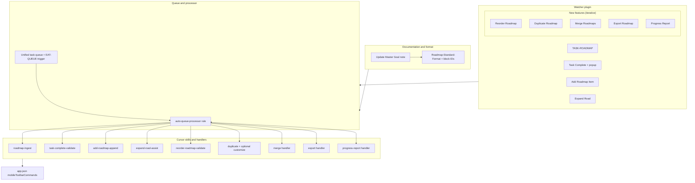

# Task-Roadmap Master Goal Migration

**Core philosophy**: **Roadmaps are manual-first and user-centric** — they are the "sun" around which automations orbit. The user controls roadmap structure, content, and progression. AI/Cursor provides optional assists (validation, formatting, linking, snapshots, logging, subtask checks) but **never initiates or rewrites roadmap content autonomously** unless explicitly triggered. This differs from the vault's fully autonomous ingest/distill/archive pipelines.

**Principles**: (1) Roadmaps in `1-Projects/…/Roadmap/`, linked via project MOCs and Dataview. (2) All roadmap changes are **user-triggered** (mobile toolbar or manual commands). (3) **Canonical queue**: `**3-Resources/Task-Queue.md`** (Markdown for easy appending/reading, human-readable). Single manual trigger **"EAT-QUEUE"** (or **"PROCESS TASK QUEUE"**) runs the unified queue processor. **Queue format**: One JSON-like line per entry (e.g. `{"mode": "TASK-COMPLETE", "filePath": "...", ...}`) for easy parsing. (4) AI steps are opt-in/assistive only. (5) Preserve safety: backups, per-change snapshots before writes, dry-run where possible, logging to Watcher-Result.md and Mobile-Pending-Actions.md.

---

## 1. Master Goal note update

- **Location**: Single canonical Master Goal note. Current content in [Ingest/Master Goal.md](Ingest/Master Goal.md); optionally move to `1-Projects/Master-Goal/Master-Goal.md` after update.
- **Content**:
  - Replace or consolidate existing "MASTER GOAL" and "Master Goal v2" with the **Master Goal v2** block (capture and ingest trigger as only always-manual steps).
  - Add a **Task and roadmap tracking** subsection that states:
    - **Roadmap tracking is manual-first with AI assists.** Roadmaps are **central user interaction points** — the user decides when to ingest, complete, add, expand, reorder, duplicate, merge, export, or report. Mobile toolbar entries (TASK-ROADMAP, Task Complete, Add Roadmap Item, Expand Road, Reorder Roadmap, Duplicate Roadmap, Merge Roadmaps, Export Roadmap, Roadmap Progress) support capture and manipulation; processing runs only when the user triggers **EAT-QUEUE** (or **PROCESS TASK QUEUE**). AI assists with validation (e.g. subtask completion), formatting, duplicate checks, snapshots, and logging — never auto-restructures or rewrites roadmap content without explicit user intent.
- **References**: [[Master Goal MOC]], pipeline reference, [Roadmap-Standard-Format](3-Resources/Roadmap-Standard-Format.md), [Mobile-Toolbar-Task-Commands](3-Resources/Mobile-Toolbar-Task-Commands.md).

---

## 2. Roadmap standard format (Tasks + Dataview compatible)

Define a **canonical roadmap structure** for normalization and querying:

- **Structure**: One note per roadmap (or one MOC linking phase notes). Phases = `## Phase N` or `## Phase Name`; subphases = `### Subphase`; tasks = Obsidian Tasks–compatible list items:
  - `- [ ] Task description` with optional `📅 YYYY-MM-DD` or `⏳ date` for Tasks plugin.
  - **Subtask relationships (recommended for reliability)**: Use **Tasks block-links** `^id` and optional `depends on: ^id` so subtask detection and completion validation are unambiguous. Example: `- [ ] Parent task ^parent-id` with children `- [ ] Child A ^child-a` and in frontmatter or inline `depends on: ^parent-id` (or document convention: nested list under same heading = subtasks). Mandate block-IDs for tasks that participate in "Task Complete" so EAT-QUEUE can resolve dependencies.
- **Frontmatter**: `roadmap: true`, `project-id`, `phase`, `subphase` for Dataview; optional `depends on` or task-ids for dependency queries.
- **Conversion**: Premade roadmaps not in this format are converted only when user triggers TASK-ROADMAP and EAT-QUEUE; no auto-splitting or heavy distillation unless user adds `#needs-process` (optional flag).
- **Document**: [3-Resources/Roadmap-Standard-Format.md](3-Resources/Roadmap-Standard-Format.md) — heading hierarchy, task syntax, block-ID convention, example Dataview/Tasks queries. Include quick-start and example roadmap notes.

---

## 3. TASK-ROADMAP (manual trigger + queue + EAT-QUEUE)

**Goal**: Ingest premade roadmaps into phases, subphases, and tasks (standard format). **User-triggered only**; no autonomous conversion.

- **Watcher plugin** ([.obsidian/plugins/watcher/main.js](.obsidian/plugins/watcher/main.js)):
  - Command `trigger-task-roadmap` (name: "TASK-ROADMAP", icon: "list-checks").
  - **Behavior**: Append to **task queue** (e.g. `3-Resources/task-queue.jsonl` or unified queue) entry: `{ "mode": "TASK-ROADMAP", "filePath": "<current or chosen>", "requestId": "...", "timestamp": "..." }`. Do not run Cursor immediately; show Notice: "TASK-ROADMAP queued. Run EAT-QUEUE to process."
- **EAT-QUEUE processing** (when user says "EAT-QUEUE" or "PROCESS TASK QUEUE"):
  - **roadmap-ingest** skill: Read roadmap at `filePath`; parse structure; **standardize** (no heavy auto-splitting or distillation unless `#needs-process`); place in `1-Projects/<Project>/Roadmap/`; link to project MOC if applicable. Backup and per-change snapshot before writes. Log to Watcher-Result.md.
- **Toolbar**: Add `watcher:trigger-task-roadmap` to [.obsidian/app.json](.obsidian/app.json) `mobileToolbarCommands`.

---

## 4. Task Complete (popup toggle + queue + EAT-QUEUE)

**Goal**: Mark a task complete from mobile; only actually complete when subtasks are done; mobile shows "pending until processed."

- **Watcher plugin**:
  - Command `trigger-task-complete` (name: "Task Complete", icon: "check-circle").
  - **Behavior**: Open **popup with toggle** (off = incomplete, on = complete). On confirm: append to queue [3-Resources/Task-Queue.md](3-Resources/Task-Queue.md) `{ "mode": "TASK-COMPLETE", "filePath": "...", "taskLocator": "^block-id" or lineIndex, "desiredState": "complete"|"incomplete", "requestId": "...", "timestamp": "..." }`. Do not toggle the checkbox in the note immediately. Show Notice: "Task Complete queued (pending until EAT-QUEUE)." Append one-line to [3-Resources/Mobile-Pending-Actions.md](3-Resources/Mobile-Pending-Actions.md) for discoverability.
- **EAT-QUEUE processing**:
  - **task-complete-validate** skill: For each TASK-COMPLETE entry, read note, locate task by block-id or line. **If `desiredState === "incomplete"`**: always unmark without validation (e.g. `obsidian_search_replace` `[x]` → `[ ]`); log success to Watcher-Result. **If `desiredState === "complete"`**: validate subtasks (prefer Tasks block-links `^id` and `depends on`; fallback: nested `- [ ]` under task until next heading/same-level task). If any subtask incomplete → do not mark; log reason to Watcher-Result and Mobile-Pending-Actions. If all subtasks complete → `obsidian_search_replace` to set `- [x]`; append success to Watcher-Result.
- **Toolbar**: Add `watcher:trigger-task-complete` to `mobileToolbarCommands`.

---

## 5. Add Roadmap Item (queue + EAT-QUEUE)

**Goal**: Add roadmap item(s) to an existing roadmap; queues and waits for EAT-QUEUE.

- **Watcher plugin**:
  - Command `open-add-roadmap-item-modal` (name: "Add Roadmap Item", icon: "link").
  - **Modal**: Field 1 — secondary map path (default: current file). Field 2 — primary roadmap path. When primary populated, parse headings and populate dropdown for section. **Radio for insert type**: "Append to section end" (default), "After this task", "As sub-task under this task". On confirm: append to queue [3-Resources/Task-Queue.md](3-Resources/Task-Queue.md) `{ "mode": "ADD-ROADMAP-ITEM", "primaryPath": "...", "secondaryPath": "...", "section": "...", "insertType": "section-end"|"after-task"|"sub-task", "taskLocator": "..." (if applicable), "requestId": "...", "timestamp": "..." }`. Show Notice: "Add Roadmap Item queued. Run EAT-QUEUE to process."
- **EAT-QUEUE processing**:
  - Read secondary for title/summary; **optional duplicate check** (existing line with same `[[...]]` in that section); if duplicate, log and skip or prompt. Call `obsidian_append_to_moc` (or equivalent) with **insertType**: section-end → append at section end; after-task → insert after specified task line; sub-task → append as nested item under specified task. **Append granularity**: single line `- [[Title]]` or one-line summary; **append_conf** (e.g. ≥85%) for write; snapshot primary before append. Document conflict/validation in skill (e.g. section missing → propose fallback section). **Batch limits**: process one ADD-ROADMAP-ITEM per run or cap per EAT-QUEUE run to avoid large appends.
- **Toolbar**: Add `watcher:open-add-roadmap-item-modal` to `mobileToolbarCommands`.

---

## 5a. Expand Road (new feature)

**Goal**: User describes sub-phases/tasks to add under a target; AI assists with structure only when user triggers.

- **Watcher plugin**:
  - Command `open-expand-road-modal` (name: "Expand Road", icon: "git-branch" or "list-plus").
  - **Modal**: Text input — "Describe sub-phases/tasks to add, or leave blank for suggestions." Target locator: auto-detect cursor task/phase (block-id or section) or prompt for section. On confirm: append to queue [3-Resources/Task-Queue.md](3-Resources/Task-Queue.md) `{ "mode": "EXPAND-ROAD", "primaryPath": "...", "sectionOrTaskLocator": "...", "userText": "..." | null, "requestId": "...", "timestamp": "..." }`. Show Notice: "Expand Road queued. Run EAT-QUEUE to process."
- **EAT-QUEUE processing**:
  - **expand-road-assist** skill: Read primary roadmap and target section/task. If `userText` present, parse into structured sub-phases/tasks; if blank, **suggest** reasonable breakdown (propose-only if confidence low). Create new linked note(s) or append structured items under target; link back to roadmap/MOC. **Snapshot before write.** Propose-only if confidence <85%; no autonomous restructure without user intent.
- **Toolbar**: Add `watcher:open-expand-road-modal` to `mobileToolbarCommands`.

---

## 5b. Reorder Roadmap Items (new feature)

- **Watcher plugin**: Command "Reorder Roadmap" (icon: "arrows-up-down"). **Modal**: Draggable list of phases/subphases/tasks parsed from current roadmap (headings + lists). **Fallback**: Up/down buttons if drag unsupported (e.g. small screens). On confirm: append to queue [3-Resources/Task-Queue.md](3-Resources/Task-Queue.md) `{ "mode": "REORDER-ROADMAP", "filePath": "...", "newOrder": [ ... ], "requestId": "...", "timestamp": "..." }`.
- **EAT-QUEUE**: **reorder-roadmap-validate** skill (optional): Validate no broken dependencies; apply reorder by rewriting sections in order; snapshot and dry-run option; optional assist: suggest optimal order from dependencies if user requests. Log to Watcher-Result.

---

## 5c. Duplicate Roadmap (new feature)

- **Watcher plugin**: Command "Duplicate Roadmap" (icon: "copy"). **Modal**: Source roadmap (default: current), new name, target project. On confirm: queue `{ "mode": "DUPLICATE-ROADMAP", "sourcePath": "...", "newName": "...", "targetProject": "...", "requestId": "...", "timestamp": "..." }`.
- **EAT-QUEUE**: Copy note via read + update to new path; update frontmatter/links; place in `1-Projects/<targetProject>/Roadmap/`; link to MOC. **Optional assist**: duplicate-roadmap-customize — e.g. reset tasks to incomplete. Snapshot before write.

---

## 5d. Merge Roadmaps (new feature)

- **Watcher plugin**: Command "Merge Roadmaps" (icon: "git-merge"). **Modal**: Primary path, secondary path, merge strategy dropdown. **Strategy examples** (document in Mobile-Toolbar-Task-Commands): **Append phases** (secondary phases after primary); **Interleave by priority** (user-defined frontmatter `priority: N` on phases). On confirm: append to queue [3-Resources/Task-Queue.md](3-Resources/Task-Queue.md) `{ "mode": "MERGE-ROADMAPS", "primaryPath": "...", "secondaryPath": "...", "strategy": "...", "requestId": "...", "timestamp": "..." }`.
- **EAT-QUEUE**: Read both; merge per strategy; handle duplicates/conflicts — **propose resolutions if low confidence**; update primary with snapshot. **Risk**: Merge conflicts; document in Dependencies/risks.

---

## 5e. Export Roadmap (new feature)

- **Watcher plugin**: Command "Export Roadmap" (icon: "download"). **Modal**: Format (PDF, CSV, Markdown summary), optional filters (e.g. only incomplete tasks). On confirm: queue `{ "mode": "EXPORT-ROADMAP", "filePath": "...", "format": "...", "filters": {...}, "requestId": "...", "timestamp": "..." }`.
- **EAT-QUEUE**: Generate export (MCP reads; optional Pandoc if available); save to `5-Attachments/Exports/` or share via mobile. Log path to Watcher-Result.

---

## 5f. Progress Report (new feature)

- **Watcher plugin**: Command "Roadmap Progress" (icon: "pie-chart"). **Behavior**: Append to queue [3-Resources/Task-Queue.md](3-Resources/Task-Queue.md) `{ "mode": "PROGRESS-REPORT", "filePath": "...", "requestId": "...", "timestamp": "..." }`. Option: instant (plugin-only) or queued.
- **EAT-QUEUE**: Compute completed/total tasks per phase; append **temporary report note** or update frontmatter. **Primary**: Use **callouts for progress bars** (e.g. `> [!progress] Phase 1: 3/5 ■■■□□`); **fallback to plain text** if Mermaid not available. Document in Mobile-Toolbar-Task-Commands: link to enabling Obsidian Mermaid plugin for charts. **Quick win**: Emojis and progress callouts for at-a-glance clarity; consider **global trigger** (e.g. from ribbon) for discoverability.

---

## 6. Pipeline and docs updates

- **Unified trigger**: **"EAT-QUEUE"** / **"PROCESS TASK QUEUE"** → single **auto-queue-processor** context rule that reads the **task queue** [3-Resources/Task-Queue.md](3-Resources/Task-Queue.md), dispatches by `mode`: TASK-ROADMAP, TASK-COMPLETE, ADD-ROADMAP-ITEM, EXPAND-ROAD, REORDER-ROADMAP, DUPLICATE-ROADMAP, MERGE-ROADMAPS, EXPORT-ROADMAP, PROGRESS-REPORT. Process in order; append each result to Watcher-Result.md; **always** update [3-Resources/Mobile-Pending-Actions.md](3-Resources/Mobile-Pending-Actions.md) with post-process status (e.g. "TASK-COMPLETE: Success" or "Failed: Subtasks pending") when items are processed or deferred.
- **Trigger → rule mapping** (add to [Cursor-Skill-Pipelines-Reference](3-Resources/Cursor-Skill-Pipelines-Reference.md) and [Workflows-Pipelines-Skills-Report](3-Resources/Workflows-Pipelines-Skills-Report.md)):

| Trigger / phrase              | Rule                                 | Behavior                                                                             |
| ----------------------------- | ------------------------------------ | ------------------------------------------------------------------------------------ |
| EAT-QUEUE, PROCESS TASK QUEUE | auto-queue-processor                 | Read queue; dispatch by mode; run corresponding skill/handler; log to Watcher-Result |
| TASK-ROADMAP MODE (queued)    | (dispatched by auto-queue-processor) | roadmap-ingest                                                                       |
| TASK-COMPLETE (queued)        | (dispatched)                         | task-complete-validate                                                               |
| ADD-ROADMAP-ITEM (queued)     | (dispatched)                         | add-roadmap-append / obsidian_append_to_moc                                          |
| EXPAND-ROAD (queued)          | (dispatched)                         | expand-road-assist                                                                   |
| REORDER-ROADMAP (queued)      | (dispatched)                         | reorder-roadmap-validate                                                             |
| DUPLICATE-ROADMAP (queued)    | (dispatched)                         | duplicate + optional duplicate-roadmap-customize                                     |
| MERGE-ROADMAPS (queued)       | (dispatched)                         | merge per strategy; conflict proposal if low conf                                    |
| EXPORT-ROADMAP (queued)       | (dispatched)                         | export to Attachments/Exports                                                        |
| PROGRESS-REPORT (queued)      | (dispatched)                         | progress report note / callouts                                                      |

- **Watcher exclusions**: Queue and all roadmap modes must not touch Watcher-protected paths (e.g. Watcher-Signal.md, Watcher-Result.md, watched-file.md).
- **Documentation**: [3-Resources/Mobile-Toolbar-Task-Commands.md](3-Resources/Mobile-Toolbar-Task-Commands.md) — all toolbar entries, EAT-QUEUE usage, quick-start, example roadmap note; link from Master Goal. Add **quick-start** and **example notes** (e.g. `1-Projects/Example/Roadmap/Example-Roadmap.md`) for Roadmap-Standard-Format.
- **Safety**: **append_conf** (e.g. ≥85%) for any append; **batch limits** (e.g. max N items per EAT-QUEUE run); **diffs** or dry-run for reorder/merge where possible.

---

## 7. Implementation order

1. **Master Goal + Roadmap-Standard-Format**: Update Master Goal (manual-first wording); add Roadmap-Standard-Format.md with block-ID convention and examples.
2. **Unified queue + auto-queue-processor**: Define task-queue.jsonl (or reuse existing queue); add EAT-QUEUE trigger and auto-queue-processor rule that dispatches by mode.
3. **Watcher**: Implement all toolbar commands (TASK-ROADMAP, Task Complete with popup, Add Roadmap Item, Expand Road, Reorder, Duplicate, Merge, Export, Progress); each appends to queue with appropriate payload.
4. **Cursor skills/handlers**: roadmap-ingest, task-complete-validate, add-roadmap-append; then expand-road-assist; then reorder-roadmap-validate, duplicate (optional customize), merge, export, progress-report.
5. **Toolbar and docs**: Update mobileToolbarCommands; Mobile-Toolbar-Task-Commands.md; Mobile-Pending-Actions.md; quick-start and example roadmap note.

**Phased rollout**: Implement **core** (Sections 3–5: TASK-ROADMAP, Task Complete, Add Roadmap Item) first and validate; then add **new features** iteratively (Expand Road → Reorder → Duplicate → Merge → Export → Progress).

---

## 8. Files to create or modify (summary)

| Action            | File                                                                                                                                                                                                     |
| ----------------- | -------------------------------------------------------------------------------------------------------------------------------------------------------------------------------------------------------- |
| Update            | [Ingest/Master Goal.md](Ingest/Master Goal.md) (or 1-Projects/Master-Goal/Master-Goal.md)                                                                                                                |
| Create            | [3-Resources/Roadmap-Standard-Format.md](3-Resources/Roadmap-Standard-Format.md) (block-IDs, quick-start, examples)                                                                                      |
| Create            | `3-Resources/Mobile-Pending-Actions.md` (queue discoverability; always updated by EAT-QUEUE with post-process status)                                                                                    |
| Create            | `3-Resources/Task-Queue.md` (canonical queue file; one JSON-like line per entry)                                                                                                                         |
| Modify            | [.obsidian/plugins/watcher/main.js](.obsidian/plugins/watcher/main.js) — all toolbar commands + modals (Add Roadmap Item, Expand Road, Reorder, Duplicate, Merge, Export, Progress, Task Complete popup) |
| Modify            | [.obsidian/app.json](.obsidian/app.json) — mobileToolbarCommands (all new commands)                                                                                                                      |
| Create            | `.cursor/skills/roadmap-ingest/SKILL.md`                                                                                                                                                                 |
| Create            | `.cursor/skills/task-complete-validate/SKILL.md`                                                                                                                                                         |
| Create (optional) | `.cursor/skills/add-roadmap-append/SKILL.md`                                                                                                                                                             |
| Create            | `.cursor/skills/expand-road-assist/SKILL.md`                                                                                                                                                             |
| Create (optional) | `.cursor/skills/reorder-roadmap-validate/SKILL.md`                                                                                                                                                       |
| Create (optional) | `.cursor/skills/duplicate-roadmap-customize/SKILL.md`                                                                                                                                                    |
| Create            | `.cursor/rules/context/auto-queue-processor.mdc` (per-mode logic folded in as switch on mode; separate rule files only if a mode is complex)                                                             |
| Update            | `.cursor/rules/always/watcher-result-append.mdc` — all new modes in Watcher-Result contract                                                                                                              |
| Update            | [3-Resources/Cursor-Skill-Pipelines-Reference.md](3-Resources/Cursor-Skill-Pipelines-Reference.md)                                                                                                       |
| Update            | [3-Resources/Workflows-Pipelines-Skills-Report.md](3-Resources/Workflows-Pipelines-Skills-Report.md)                                                                                                     |
| Create or update  | [3-Resources/Mobile-Toolbar-Task-Commands.md](3-Resources/Mobile-Toolbar-Task-Commands.md), [3-Resources/Watcher-Plugin-Usage.md](3-Resources/Watcher-Plugin-Usage.md)                                   |
| Create            | Example roadmap note (e.g. `1-Projects/Example/Roadmap/Example-Roadmap.md`)                                                                                                                              |

---

## 9. Necessary .cursor/rules changes

| Rule                                       | Type    | Path                                                | Trigger / glob                            | Purpose                                                                                                                                                                                                                                                                                                                                                                                                                   |
| ------------------------------------------ | ------- | --------------------------------------------------- | ----------------------------------------- | ------------------------------------------------------------------------------------------------------------------------------------------------------------------------------------------------------------------------------------------------------------------------------------------------------------------------------------------------------------------------------------------------------------------------- |
| **auto-queue-processor**                   | context | `.cursor/rules/context/auto-queue-processor.mdc`    | **"EAT-QUEUE"**, **"PROCESS TASK QUEUE"** | Read [3-Resources/Task-Queue.md](3-Resources/Task-Queue.md); dispatch by `mode` to corresponding handler/skill (switch on mode; per-mode logic folded into this rule where possible); log each result to Watcher-Result.md; **always** update Mobile-Pending-Actions.md with post-process status (e.g. "TASK-COMPLETE: Success" or "Failed: Subtasks pending"). Single entry point for all roadmap/task queue processing. |
| **auto-task-roadmap** (logic in processor) | —       | (folded into auto-queue-processor)                  | mode TASK-ROADMAP                         | Run roadmap-ingest: read path from queue, parse, standardize, place in project Roadmap folder, link MOC; backup/snapshot.                                                                                                                                                                                                                                                                                                 |
| **auto-task-complete**                     | context | `.cursor/rules/context/auto-task-complete.mdc`      | (invoked when mode TASK-COMPLETE)         | Run task-complete-validate: subtask check (block-IDs preferred), then mark [x] or log.                                                                                                                                                                                                                                                                                                                                    |
| **auto-add-roadmap-item**                  | context | `.cursor/rules/context/auto-add-roadmap-item.mdc`   | (invoked when mode ADD-ROADMAP-ITEM)      | Parse queue payload; duplicate check; obsidian_append_to_moc; append_conf; snapshot.                                                                                                                                                                                                                                                                                                                                      |
| **auto-expand-road**                       | context | `.cursor/rules/context/auto-expand-road.mdc`        | (invoked when mode EXPAND-ROAD)           | expand-road-assist: user text or suggestions; append under target; snapshot; propose-only if low conf.                                                                                                                                                                                                                                                                                                                    |
| **auto-reorder-roadmap**                   | context | `.cursor/rules/context/auto-reorder-roadmap.mdc`    | (invoked when mode REORDER-ROADMAP)       | reorder-roadmap-validate; dry-run; apply reorder; snapshot.                                                                                                                                                                                                                                                                                                                                                               |
| **auto-duplicate-roadmap**                 | context | `.cursor/rules/context/auto-duplicate-roadmap.mdc`  | (invoked when mode DUPLICATE-ROADMAP)     | Copy note to new path; update frontmatter/links; optional duplicate-roadmap-customize.                                                                                                                                                                                                                                                                                                                                    |
| **auto-merge-roadmaps**                    | context | `.cursor/rules/context/auto-merge-roadmaps.mdc`     | (invoked when mode MERGE-ROADMAPS)        | Merge per strategy; conflict proposal if low conf; snapshot primary.                                                                                                                                                                                                                                                                                                                                                      |
| **auto-export-roadmap**                    | context | `.cursor/rules/context/auto-export-roadmap.mdc`     | (invoked when mode EXPORT-ROADMAP)        | Generate export; save to Attachments/Exports.                                                                                                                                                                                                                                                                                                                                                                             |
| **auto-progress-report**                   | context | `.cursor/rules/context/auto-progress-report.mdc`    | (invoked when mode PROGRESS-REPORT)       | Compute progress; append report note or callouts.                                                                                                                                                                                                                                                                                                                                                                         |
| **watcher-result-append**                  | always  | `.cursor/rules/always/watcher-result-append.mdc`    | (existing)                                | **Update**: Include all roadmap/task modes (TASK-ROADMAP, TASK-COMPLETE, ADD-ROADMAP-ITEM, EXPAND-ROAD, REORDER-ROADMAP, DUPLICATE-ROADMAP, MERGE-ROADMAPS, EXPORT-ROADMAP, PROGRESS-REPORT) in Watcher-Result contract when run is Watcher-triggered.                                                                                                                                                                    |
| **mcp-obsidian-integration**               | always  | `.cursor/rules/always/mcp-obsidian-integration.mdc` | (existing)                                | **Update (if needed)**: New MCP tools for roadmap/export only if introduced.                                                                                                                                                                                                                                                                                                                                              |

**Summary**: One **unified context rule** (auto-queue-processor) triggered by EAT-QUEUE; **fold per-mode logic into auto-queue-processor.mdc** where possible (switch on mode); create separate rule files only if a mode is complex. The rows above document what each dispatch does (implemented in the same rule file). Update **watcher-result-append** for all modes.

---

## 10. Potential skills we will need

| Skill                           | Path                                                  | When used                                    | Purpose                                                                                                                                               | Confidence / gates                                          |
| ------------------------------- | ----------------------------------------------------- | -------------------------------------------- | ----------------------------------------------------------------------------------------------------------------------------------------------------- | ----------------------------------------------------------- |
| **roadmap-ingest**              | `.cursor/skills/roadmap-ingest/SKILL.md`              | EAT-QUEUE, mode TASK-ROADMAP                 | Read path from queue; parse; standardize (no heavy distillation unless #needs-process); ensure_structure; write to 1-Projects/…/Roadmap/; link MOC.   | ≥85% create/move; backup + snapshot before writes.          |
| **task-complete-validate**      | `.cursor/skills/task-complete-validate/SKILL.md`      | EAT-QUEUE, mode TASK-COMPLETE                | Locate task (block-id or line); detect subtasks (block-links ^id / depends on; fallback nested list); if all complete → search_replace [x]; else log. | Deterministic; log to Watcher-Result.                       |
| **add-roadmap-append**          | `.cursor/skills/add-roadmap-append/SKILL.md`          | EAT-QUEUE, mode ADD-ROADMAP-ITEM             | Read secondary; duplicate check; obsidian_append_to_moc; single-line append.                                                                          | append_conf ≥85%; snapshot primary; batch limit.            |
| **expand-road-assist**          | `.cursor/skills/expand-road-assist/SKILL.md`          | EAT-QUEUE, mode EXPAND-ROAD                  | Parse user text → structure; or suggest breakdown if blank; append under target; link back.                                                           | ≥85% to write; propose-only if <85%. Snapshot before write. |
| **reorder-roadmap-validate**    | `.cursor/skills/reorder-roadmap-validate/SKILL.md`    | EAT-QUEUE, mode REORDER-ROADMAP              | Validate order (optional dependency check); rewrite sections in new order; dry-run option.                                                            | Snapshot before write.                                      |
| **duplicate-roadmap-customize** | `.cursor/skills/duplicate-roadmap-customize/SKILL.md` | EAT-QUEUE, mode DUPLICATE-ROADMAP (optional) | Customize duplicate (e.g. reset tasks to incomplete).                                                                                                 | Optional assist.                                            |
| Merge / Export / Progress       | Inline in rules or small skills                       | EAT-QUEUE, modes MERGE, EXPORT, PROGRESS     | Merge: read both, strategy, conflict proposal. Export: generate file to Attachments/Exports. Progress: completed/total, callouts, optional Mermaid.   | Merge: propose resolutions if low conf.                     |

**Existing**: **obsidian-snapshot** for all destructive steps; **obsidian_append_to_moc** for Add Roadmap Item. **next-action-extract** / **task-reroute** unchanged (ingest pipeline).

**Summary**: **2 required skills** (roadmap-ingest, task-complete-validate); **add-roadmap-append** (or inline); **expand-road-assist**; **reorder-roadmap-validate**; optional **duplicate-roadmap-customize**; merge/export/progress as inline or minimal skills.

---

## 11. Dependencies and risks

- **Queue discoverability**: Users must know to run **EAT-QUEUE** (or **PROCESS TASK QUEUE**) after queuing actions. Document prominently in Mobile-Toolbar-Task-Commands and consider a **global trigger** (e.g. ribbon button or daily note prompt). Optionally append pending items to **Mobile-Pending-Actions.md** so mobile users see what is queued.
- **Subtask convention**: **Mandate Tasks block-links** (`^id`) and optionally `depends on: ^id` for reliable Task Complete validation. Document in Roadmap-Standard-Format; fallback heuristics (nested list) are best-effort.
- **AI assistive-only**: Never auto-restructure or rewrite roadmap content without explicit user trigger. All roadmap modes are user-initiated; EAT-QUEUE only processes what was queued.
- **Merge Roadmaps**: **Conflict risk** — duplicate phases/tasks, ordering. Low confidence → propose resolutions; document in plan and in skill.
- **Batch limits and safety**: **append_conf** (≥85%) for appends; **batch limits** per EAT-QUEUE run (e.g. max N ADD-ROADMAP-ITEM or EXPAND-ROAD items); **diffs** or dry-run for reorder/merge where possible.
- **Quick wins**: Emojis and **progress callouts** (e.g. `> [!progress] Phase 1: 3/5`) for at-a-glance clarity; **global trigger** for EAT-QUEUE or Progress for discoverability.
- **Documentation**: **Quick-start** and **example roadmap note** in vault so users can copy structure; link from Master Goal and Mobile-Toolbar-Task-Commands.
- **Toolbar overcrowding**: With 9+ roadmap/task commands, the mobile toolbar can become cluttered. **Mitigation**: Group under a "Roadmap Tools" sub-menu if Watcher (or Commander) supports it; **prioritize core icons** (e.g. Task Complete, EAT-QUEUE) on the main toolbar and move others (Reorder, Duplicate, Merge, Export, Progress) to command palette or secondary menu. Document in Mobile-Toolbar-Task-Commands.

