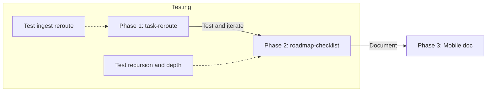

# Task Rerouting and Recursive Checklist Implementation

**Naming**: Use **task-reroute** and **roadmap-checklist** consistently (skill names and doc references). No alternate labels (e.g. "task rerouting" in prose is fine; skill/file name is always hyphenated).

**Changelog (plan-level)**: When implementing, add a short changelog at the top of updated docs (e.g. Automation-Flows-MCP-Improvements.md): date (e.g. 2026-02-28), change summary, rationale (e.g. "Implemented task-reroute skill per gap analysis").

---

## Codebase updates (reflected in this plan)

The following changes exist in the codebase and are reflected below. This plan is updated to align with them and to state what **remains** from the original scope.

**Queue-based roadmap/task flow (implemented):**

- **EAT-QUEUE** / **PROCESS TASK QUEUE** trigger **auto-queue-processor**, which reads [3-Resources/Task-Queue.md](3-Resources/Task-Queue.md) and dispatches by **mode**: TASK-ROADMAP, TASK-COMPLETE, ADD-ROADMAP-ITEM, EXPAND-ROAD, REORDER-ROADMAP, DUPLICATE-ROADMAP, MERGE-ROADMAPS, EXPORT-ROADMAP, PROGRESS-REPORT. Results go to Watcher-Result.md and [Mobile-Pending-Actions](3-Resources/Mobile-Pending-Actions.md).
- **Rules**: [.cursor/rules/context/auto-eat-queue.mdc](.cursor/rules/context/auto-eat-queue.mdc) (prompt queue), [.cursor/rules/context/auto-queue-processor.mdc](.cursor/rules/context/auto-queue-processor.mdc) (task/roadmap queue).
- **Pipeline reference** trigger table documents both EAT-QUEUE (auto-eat-queue) and PROCESS TASK QUEUE (auto-queue-processor).

**New skills (implemented):**

- **roadmap-ingest** — For mode TASK-ROADMAP: read roadmap at queue `filePath`, parse phases/subphases/tasks, standardize (no heavy distill unless `#needs-process`), write to `1-Projects/<Project>/Roadmap/`, link to project MOC. Snapshot before write.
- **add-roadmap-append** — For mode ADD-ROADMAP-ITEM: append one line (from secondary note) to primary roadmap under section or after task / as sub-task; duplicate check; snapshot primary before append.
- **expand-road-assist** — For mode EXPAND-ROAD: parse user text into sub-phases/tasks or suggest breakdown; append under target section/task; link back to roadmap/MOC.
- **task-complete-validate** — For mode TASK-COMPLETE: locate task by block-id or lineIndex; if complete, validate all subtasks (block-IDs / depends on or nested list) before marking parent `[x]`; if incomplete, unmark without validation.

**New docs (implemented):**

- [3-Resources/Roadmap-Standard-Format.md](3-Resources/Roadmap-Standard-Format.md) — Phases/subphases/tasks, block-IDs, `depends on`, Tasks/Dataview compatibility.
- [3-Resources/Mobile-Toolbar-Task-Commands.md](3-Resources/Mobile-Toolbar-Task-Commands.md) — TASK-ROADMAP, Task Complete, Add Roadmap Item, EAT-QUEUE, queue flow.
- [3-Resources/Task-Queue.md](3-Resources/Task-Queue.md) — Canonical task/roadmap queue (one JSON-like line per entry).

**Still not implemented (original plan):**

- **task-reroute** skill — Ingest pipeline still has "Task rerouting (recommended when task-like)" as a passive row; no skill calls find_parent / create_task_note / append_tasks after next-action-extract.
- **roadmap-checklist** skill — No single skill that does "recursive link traversal → hierarchical checklist from linked notes." Roadmap **construction and breakdown** are instead served by **roadmap-ingest** (standardize + place) and **expand-road-assist** (breakdown under section/task). A separate **link-traversal checklist** skill remains optional.
- **Pipeline reference Skill locations table** — Does not yet list roadmap-ingest, add-roadmap-append, expand-road-assist, task-complete-validate.

**Task completion propagation:** Implemented via **task-complete-validate** (validate subtasks before marking parent complete; log to Watcher-Result and Mobile-Pending-Actions).

---

## Current state (ingest and MCP tools, unchanged)

- **next-action-extract** (skill) runs in full-autonomous-ingest after distill-highlight-color. It creates in-note checklists (`- [ ]`) and frontmatter `next-actions`; confidence ≥85% for writes.
- **Task rerouting** is documented in [3-Resources/Cursor-Skill-Pipelines-Reference.md](3-Resources/Cursor-Skill-Pipelines-Reference.md) (table row: after next-action-extract, when ≥78% and task-like, use find_parent → create_task_note or append_tasks) but **not invoked** by any rule or skill.
- **MCP tools exist** and are defined under `user-obsidian-para-zettel-autopilot`: `find_parent`, `obsidian_create_task_note`, `append_tasks`.
- **Recursion over linked notes** for a single "roadmap-checklist" output is not implemented; roadmap breakdown is done via queue + **expand-road-assist** and **roadmap-ingest**.

---

## Scope and boundaries

| Deliverable                                                         | In scope / status                                                                              | Out of scope                                                    |
| ------------------------------------------------------------------- | ---------------------------------------------------------------------------------------------- | --------------------------------------------------------------- |
| Wire task rerouting into ingest                                     | Yes (still to do — task-reroute skill not created)                                             | —                                                               |
| Define "task-like" and when to reroute                              | Yes (when implementing task-reroute)                                                           | —                                                               |
| Roadmap construction + breakdown                                    | **Done via queue**: roadmap-ingest, expand-road-assist, add-roadmap-append                     | —                                                               |
| Task completion propagation (parent complete when subtasks done)    | **Done**: task-complete-validate                                                               | —                                                               |
| New skill: recursive roadmap checklist (link traversal → checklist) | Optional (Phase 2); not implemented; breakdown is via expand-road-assist instead               | Implementing Obsidian plugins (Commander, Note Toolbar) in code |
| Mobile toolbar / Commander commands                                 | **Documented**: [Mobile-Toolbar-Task-Commands.md](3-Resources/Mobile-Toolbar-Task-Commands.md) | Writing plugin code or Templater scripts in this repo           |

---

## Phase 1: Task rerouting in ingest

### 1.1 Define when to reroute

- **Trigger**: After **next-action-extract** has run on the note; **next-action-extract confidence ≥78%**; and note is **task-like**.
- **Task-like** can be derived from:
  - **classify_para** output when run with `mode: "balancer"`: fields `tasks_extracted` and `suggested_parent` (see [obsidian_classify_para](mcps/user-obsidian-para-zettel-autopilot/tools/obsidian_classify_para.json)).
  - Or heuristic: `para-type` suggests tasks under an Area/Project (e.g. "Tasks", "Action items") or note has multiple extracted next-actions and a clear project-id/area from frontmatter.

**Recommendation**: Prefer using **classify_para** with `mode: "balancer"` earlier in the pipeline when the note is task-heavy, so `suggested_parent` is available; then after next-action-extract, if confidence ≥78% and suggested_parent or (project-id / area) exists, run rerouting. If balancer is not used, derive parent from frontmatter: `project-id` → `1-Projects/<ProjectName>`, or an area name from content/classification → `find_parent`(area_name, keywords).

### 1.2 Where to implement

- **Option A — Extend next-action-extract skill**: Add a fourth step to [.cursor/skills/next-action-extract/SKILL.md](.cursor/skills/next-action-extract/SKILL.md): "If task rerouting is enabled and confidence ≥78% and note is task-like: call find_parent (or use suggested_parent), then either obsidian_create_task_note or append_tasks."
- **Option B — New skill task-reroute**: Create `.cursor/skills/task-reroute/SKILL.md` that runs **after** next-action-extract; it reads the note and frontmatter (next-actions, project-id, para-type), decides parent (find_parent or project path), then create_task_note or append_tasks.

**Recommendation**: Option B (new skill) keeps next-action-extract focused on in-note + frontmatter; task-reroute owns "where do these tasks live" and respects backup/snapshot rules for append_tasks.

### 1.3 Pipeline and safety

- **Order**: … → next-action-extract → **task-reroute** (when conditions above) → manage_frontmatter / manage_tags → append_to_hub → move_note → log_action.
- **Backup**: `append_tasks` "Requires backup before append" (MCP descriptor). Ingest already runs create_backup at start; ensure no extra backup is required per MCP server behavior, or call ensure_backup before append_tasks if the server gates on it.
- **Snapshots**: Task rerouting writes to **another** note (parent task note or hub). Per [.cursor/rules/always/mcp-obsidian-integration.mdc](.cursor/rules/always/mcp-obsidian-integration.mdc), destructive MCP calls include appends to other notes (e.g. append_to_hub). So before **append_tasks** (and optionally before create_task_note if it overwrites), create a per-change snapshot of the **target** note (the parent being appended to), not the source. Document this in the new skill and in the pipeline reference snapshot table if applicable.
- **Confidence**: Reroute only when **≥78%**; do not reroute in low-confidence band to avoid creating task notes in wrong Areas/Projects.
- **Logging**: Log task-reroute outcome in Ingest-Log (parent path, created vs appended, task count). Track **metrics**: reroute frequency, average confidence, task count per reroute (for tuning thresholds; e.g. if ≥78% yields too many false positives, consider ≥82%).

**Error handling and fallbacks** (document in task-reroute skill):

- **find_parent** returns no candidates or only low-score candidates: default to a generic `Inbox/Tasks.md` (or vault-convention inbox path) or **log and skip reroute** (do not create under ambiguous parent).
- **append_tasks**: If backup for target note fails, **abort** and notify via `obsidian_log_action` (e.g. "Backup failed for parent_path; skipping append"); do not append without backup.

**Create vs. append** (document in task-reroute skill):

- If **parent note does not exist or is empty**: use **obsidian_create_task_note**.
- Else: use **append_tasks** (after backup/snapshot of target).
- Use **find_parent** score when available: high score (>90%) → prefer append to that parent; lower score → prefer creating a **new** task note under the parent folder.

**Source note frontmatter**: After rerouting, optionally **clear or archive** the source note's `next-actions` frontmatter (e.g. move to `archived-actions` or a dedicated key) to avoid duplication, **unless** the note is intended to remain a standalone task hub (document as optional in skill).

**Pipeline optimization**: In para-zettel-autopilot, make task-reroute **conditional**: e.g. "If next-action-extract confidence ≥78% and (classify_para.tasks_extracted > 0 or suggested_parent exists or task-like heuristics), run task-reroute." Avoids extra reads for non-task notes.

### 1.4 Refined trigger (task-like score)

Use a **weighted score** so trigger is tunable and consistent:

- **Base**: classify_para with `mode: "balancer"` and (tasks_extracted > 0 or suggested_parent exists): **+50**.
- **Heuristics**: Multiple next-actions (>2): **+20**; para-type keywords (e.g. "Tasks", "Actions"): **+20**; deadlines/dates in content: **+10**.
- **Trigger**: Run task-reroute if **total ≥ 70** and **confidence ≥ 78%**.

### 1.5 Docs and rules to update

- [3-Resources/Cursor-Skill-Pipelines-Reference.md](3-Resources/Cursor-Skill-Pipelines-Reference.md): In the ingest table, change "Task rerouting (recommended when task-like)" from a passive row to a **skill** row: **task-reroute** after next-action-extract, confidence ≥78% + task-like, and add to pipeline order line.
- [.cursor/rules/context/para-zettel-autopilot.mdc](.cursor/rules/context/para-zettel-autopilot.mdc): Add task-reroute to the skill chain after next-action-extract (when task-like).
- [Ingest/2026-02-26-Automation-Flows-MCP-Improvements.md](Ingest/2026-02-26-Automation-Flows-MCP-Improvements.md): Update §2.1 to state that task rerouting is implemented via the task-reroute skill and MCP find_parent / create_task_note / append_tasks.

---

## Phase 2 (optional): roadmap-checklist (link-traversal) vs. current roadmap flow

**Current state:** Roadmap **construction and breakdown** are handled by **roadmap-ingest** (standardize + place in `1-Projects/…/Roadmap/`) and **expand-road-assist** (parse user text or suggest breakdown; append under section/task). There is no single skill that follows `[[wiki-links]]` recursively to build one hierarchical checklist from linked notes.

### 2.1 Goal (if adding roadmap-checklist)

For a **roadmap note** (or any note with sections and `[[wiki-links]]` to other notes), produce a **hierarchical checklist** that includes:

- Top-level tasks from the note (and existing next-actions),
- For each link that points to another note: optionally recurse into that note, extract its tasks/sections as **subtasks**, up to a **max depth** (e.g. 3–5) with **cycle detection** (visited set) to avoid infinite loops.

### 2.2 Design

- **Skill name**: **roadmap-checklist** (consistent).
- **Trigger**: Manually or dedicated pipeline (e.g. "ROADMAP MODE"). Optional: if frontmatter `roadmap: true`, run post–task-reroute in ingest (opt-in). Document hotkey/URI for manual trigger in skill.
- **Inputs**: Note path; optional `max_depth` (default **3**); optional `output`: "in_note" | "new_note"; optional **filter**: "tasks-only" vs "full-hierarchy"; optional **flatten**; optional **status-sync** (propagate `- [x]`).
- **Parsing** (link resolver and task extraction): see **Steps (refined)** and **Safeguards** below. Redundant legacy steps removed.
  1. Build tree: current note’s tasks + for each link, if depth < max_depth and path not in visited, recurse; visited set to avoid cycles.
  2. Output: Generate markdown checklist (nested `- [ ]` with indentation or sublists). Append to note or create new note; update frontmatter `next-actions` if desired (e.g. top-level only).
- **Parsing**: **Link resolver** — handle `[[Link|Alias]]`; exclude #tags and non-.md. **Task extraction in recursion** — reuse next-action-extract logic (or call it on linked notes) for consistency.
- **Steps** (refined): (1) Parse note: sections, `- [ ]` / `- [x]` tasks, wiki-links (alias handling); resolve to vault paths. (2) Build tree: current tasks + for each link, if depth < max_depth and path not in visited, recurse; **visited set** for cycles. (3) Output: Markdown checklist (nested or flat per params); append or new note; optional frontmatter `next-actions` (top-level).
- **Safeguards**: max_depth (default 3); visited set; **max links per note** (e.g. 10); **vault-size check** (>100 links → warn, cap depth at 2); **memoization** (cache parsed notes in temp JSON) for repeated runs.

*Implementation note: When editing this section, remove any duplicate legacy step bullets (lines that duplicate **Steps (refined)**); keep **Parsing**, **Steps (refined)**, and **Safeguards** only.*

### 2.3 Where it lives

- Skill: [.cursor/skills/roadmap-checklist/SKILL.md](.cursor/skills/roadmap-checklist/SKILL.md) (or similar name).
- Pipeline: Either a **separate context rule** (e.g. "ROADMAP MODE – generate hierarchical checklist for current note") or an optional step in express/distill when the note type is "roadmap". Prefer separate rule so ingest stays fast and recursion is opt-in.

### 2.4 Risks (as you noted)

- **Circular links** → mitigated by visited set.
- **Performance** → mitigated by max_depth, max links per note, vault-size cap, and memoization; document that this is for focused roadmap notes, not whole-vault scans.
- **Sync/conflicts** → same as other append/update flows; backup/snapshot before writing.

#### Phase 2 test cases

Document in same or separate testing note:

- **Nested roadmap**: Note with 3 levels of links; verify output respects max_depth and no duplicate entries.
- **Cycle**: A → B → A; verify visited set prevents infinite loop and output is bounded.
- **Depth limit**: Verify at max_depth no further links are followed.

---

## Phase 3: Mobile toolbar and completion propagation

- **Resource note**: [3-Resources/Mobile-Toolbar-Task-Commands.md](3-Resources/Mobile-Toolbar-Task-Commands.md) **exists**. It documents:
  - **Recommended plugins**: Commander, Note Toolbar (or Advanced Toolbar); **alternative**: QuickAdd for mobile-friendly macros.
  - **Step-by-step setup**: Placeholder for screenshots (e.g. "Insert screenshot of Commander settings here").
  - **Example commands**: "Generate checklist" (Templater/script or manual paste from Cursor output); "Complete task" — modal listing tasks with subtask validation. Include a **sample JS snippet** (e.g. via CustomJS plugin) for subtask validation: e.g. get tasks with `match(/-\s*\[\s*\]\s*(.*)/g)`, build hierarchy, check completion before marking parent. **Note limitations**: JS execution on mobile may require desktop sync.
  - **Cursor integration**: Recursion and AI-generated checklists via **task-reroute** and **roadmap-checklist**; mobile can trigger Cursor via URI or use pre-generated checklists.
- **Task completion propagation**: **Implemented** via **task-complete-validate** (EAT-QUEUE mode TASK-COMPLETE): validates subtasks before marking parent `[x]`; logs to Watcher-Result and Mobile-Pending-Actions. Optional future: Tasks plugin query blocks / Dataview for auto-propagation; mobile `pending-complete` + desktop propagate-completion skill.
- **Cross-platform**: Use Git or iCloud for vault sync; mobile queues actions → EAT-QUEUE in Cursor processes them.

---

## Implementation order

1. **Done (codebase)**: Queue-based roadmap flow (EAT-QUEUE, Task-Queue.md), **roadmap-ingest**, **add-roadmap-append**, **expand-road-assist**, **task-complete-validate**, Mobile-Toolbar-Task-Commands.md, Roadmap-Standard-Format.md.
2. **Phase 1** (optional): Add **task-reroute** skill; wire in para-zettel-autopilot and pipeline reference; update Automation-Flows; run Phase 1 test cases; log metrics in Ingest-Log.
3. **Phase 2** (optional): Add **roadmap-checklist** skill (link-traversal → hierarchical checklist) if desired alongside expand-road-assist; document recursion limits and snapshot behavior.
4. **Doc sync**: Add the four roadmap/task skills to the pipeline reference **Skill locations** table.

---

## Dependency and blocker summary

| Phase                 | Dependencies                                                                                                        | Potential blockers               | Mitigation                                                                    |
| --------------------- | ------------------------------------------------------------------------------------------------------------------- | -------------------------------- | ----------------------------------------------------------------------------- |
| Queue/roadmap (done)  | Task-Queue.md, auto-queue-processor, roadmap-ingest, add-roadmap-append, expand-road-assist, task-complete-validate | —                                | Watcher-Result + Mobile-Pending-Actions; snapshot before writes               |
| 1 (task-reroute)      | classify_para (balancer), find_parent, obsidian_create_task_note, append_tasks                                      | Backup failures; no parent found | ensure_backup before append_tasks; log skips; fallback to Inbox/Tasks or skip |
| 2 (roadmap-checklist) | obsidian_read_note, link resolution, next-action-extract logic                                                      | Large vaults; cycles             | max_depth=3; visited set; vault-size cap; memoization                         |
| 3 (mobile doc)        | None (doc-only)                                                                                                     | Plugin availability              | Mobile-Toolbar-Task-Commands.md exists                                        |

---

## Files to create or touch

| Action           | File                                                                                            | Status                                                                                                          |
| ---------------- | ----------------------------------------------------------------------------------------------- | --------------------------------------------------------------------------------------------------------------- |
| Create           | `.cursor/skills/task-reroute/SKILL.md`                                                          | **Not done** — optional (ingest task rerouting)                                                                 |
| Update           | `3-Resources/Cursor-Skill-Pipelines-Reference.md`                                               | Add **Skill locations** rows for roadmap-ingest, add-roadmap-append, expand-road-assist, task-complete-validate |
| Update           | `.cursor/rules/context/para-zettel-autopilot.mdc`                                               | Optional: add task-reroute when skill exists                                                                    |
| Update           | `Ingest/2026-02-26-Automation-Flows-MCP-Improvements.md`                                        | Optional: §2.1 when task-reroute implemented                                                                    |
| Create (Phase 2) | `.cursor/skills/roadmap-checklist/SKILL.md`                                                     | **Not done** — optional; breakdown via expand-road-assist                                                       |
| —                | `3-Resources/Mobile-Toolbar-Task-Commands.md`                                                   | **Exists**                                                                                                      |
| —                | `3-Resources/Task-Queue.md`, Roadmap-Standard-Format.md, Mobile-Pending-Actions.md              | **Exist**                                                                                                       |
| —                | `.cursor/skills/roadmap-ingest`, add-roadmap-append, expand-road-assist, task-complete-validate | **Exist**                                                                                                       |

---

## Summary

- **Codebase alignment**: Queue-based roadmap/task flow (EAT-QUEUE, Task-Queue.md, auto-queue-processor) and skills **roadmap-ingest**, **add-roadmap-append**, **expand-road-assist**, **task-complete-validate** are in place. Roadmap construction and breakdown are served by these; **task completion propagation** is implemented via task-complete-validate. Mobile-Toolbar-Task-Commands.md, Roadmap-Standard-Format.md, and Task-Queue.md exist.
- **Remaining from this plan**: (1) **task-reroute** skill for ingest (optional); (2) Add the four roadmap/task skills to the pipeline reference Skill locations table; (3) **roadmap-checklist** (optional) for recursive link traversal → hierarchical checklist.
- **Mobile**: Documented in Mobile-Toolbar-Task-Commands.md; task-complete-validate implements completion propagation.

