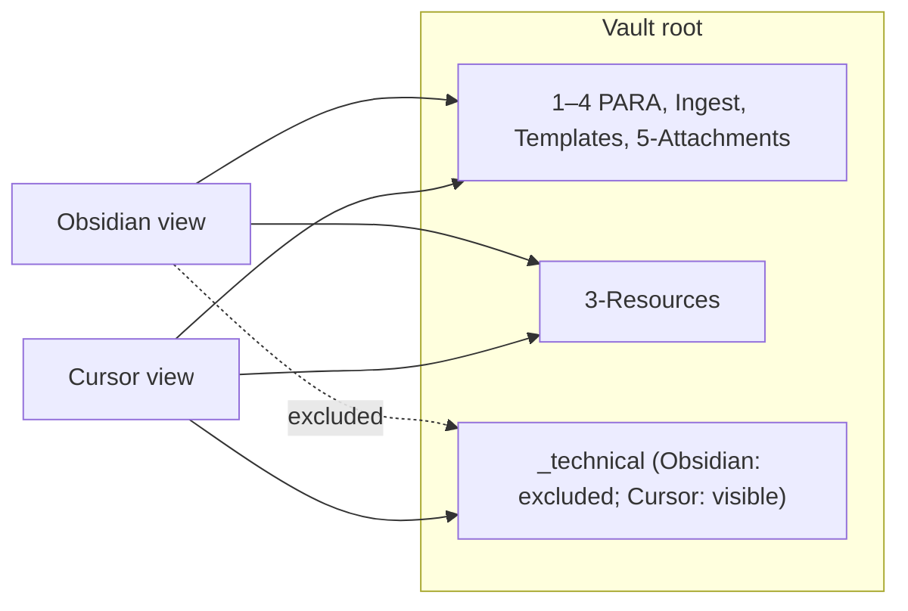

# Technical Folder for Cursor-Side Logs and Artifacts

## The refined proposal looks very solid now — clean, realistic, leverages actual Obsidian and Cursor features (no invented .obsidianignore), includes safeguards for migration, and thoughtfully addresses performance/context waste with .cursorignore. It's ready for green light with only a handful of small final tweaks/polish items to make it even more robust and future-proof.

Final tweaks / recommendations (all low-effort, high-clarity wins)

Folder name: go with .technical (dotfolder) as primary recommendation

Dot-prefixed folders (.technical, .tech, .system) are auto-hidden in Obsidian's File Explorer and often receive lighter indexing treatment by default (many users report near-complete exclusion from graph/search without extra settings).

Still fully visible and usable in Cursor (which treats dotfiles normally, like .vscode or .git).

In Finder/Explorer, hidden files must be shown manually → keeps it out of casual view.

This reduces reliance on the Excluded files setting (or plugins) — potentially zero config needed for basic hiding.

If you prefer it visible in Cursor sidebar but sorted neatly: stick with _technical (top) or zz-technical (bottom).

Document the choice clearly in [Vault-Layout.md](http://Vault-Layout.md): e.g. “Chosen: .technical for auto-hidden behavior in Obsidian; visible in Cursor.”

Exclusion: native Excluded files first, but note the common limitation

Add .technical (or _technical) to Settings → Files & Links → Excluded files — this hides from explorer, search, graph, quick switcher, etc.

Caveat (from community reports): native exclusion is mostly a display/filter — Obsidian may still partially index/process some files (e.g. for plugins like Dataview if they bypass the filter, or minor perf overhead). For your use case (machine-only JSON/MD files), it's almost always "good enough."

Only if you notice leakage (e.g. Dataview sees files inside despite exclusion, or graph nodes appear): install Obsidian File Ignore (it renames to dotfiles on-the-fly + uses .gitignore patterns for stronger exclusion and perf gains). Avoid installing upfront — native should suffice here.

In Vault-Layout note: “Excluded via Settings → Excluded files. If stronger hiding needed (rare), use Obsidian File Ignore plugin.”

.cursorignore → use the stronger .cursorignore (not just .cursorindexignore)

Cursor docs confirm: .cursorignore uses .gitignore syntax and makes a best-effort to exclude from both indexing and AI access (stronger privacy/perf).

.cursorindexignore is indexing-only (old behavior) — still allows explicit @-references.

For your technical bin: prefer .cursorignore at vault root with patterns like:text.technical/               # or _technical/

*.jsonl                   # queues/logs

Watcher-*.md

*.log

If you ever need to @-reference [Watcher-Result.md](http://Watcher-Result.md) for debugging: move that one pattern to .cursorindexignore instead.

Hierarchical ignore is optional (enable in Cursor Settings → Features → Editor if you add nested ignores later).

Watcher migration: emphasize checking plugin config

No clear "Watcher" plugin shows obvious configurable paths in searches (many file-watch plugins exist, but yours might be custom/rules-based or a specific one like Folder Bridge / event listeners).

Before Option A: open the plugin's settings pane (if it has one) and search for "path", "folder", "signal", "file" — note any hard-coded paths.

If paths are only in .cursor/rules/ files: migration is safe/simple (just update mdcs).

If plugin hard-codes: document the limitation in Vault-Layout and stick with Option B longer-term.

Add to implementation steps: “Verify Watcher plugin settings for path config → if configurable, update there too during migration.”

Diagram polish (tiny Mermaid tweak)

Current label is good; for better readability in some renderers, shorten to:textTech[".technical\n(Obsidian excluded)"]Or add style:textclass Tech excluded;

classDef excluded fill:#333,stroke:#666,color:#aaa,font-style:italic;

Keeps it clean.

One extra optional safeguard: add a [README.md](http://README.md) inside the folder

Create .technical/[README.md](http://README.md) (or _technical/[README.md](http://README.md)) with:text# Technical / Machine-Only Bin

Excluded from Obsidian index (via Settings → Excluded files).

Contains: Cursor prompt queue, Watcher signals/results (if moved), setup logs.

Do NOT place human notes here — use PARA / 3-Resources instead.

Even if folder is hidden, it's self-documenting when you peek via Cursor or file system.Current state

- **Visible in Cursor, not (or less) visible in Obsidian**: `.cursor/`, `.github/`, `.obsidian/`, `.trash/`, dotfiles. Obsidian often hides dot-prefixed paths; your vault root is the same as the workspace, so everything under the root is "in" the vault.
- **In vault and visible in both**: Pipeline logs (`3-Resources/Ingest-Log.md`, etc.), hubs, PARA content. These are used by Dataview and Vault-Change-Monitor and must stay in `3-Resources/`.
- **Cursor/Watcher artifacts currently in vault**: `prompt-queue.jsonl` is documented at `3-Resources/prompt-queue.jsonl` (file doesn’t exist yet; only `3-Resources/prompt-queue.sample.jsonl` exists). Watcher-Signal and Watcher-Result are fixed at `3-Resources/Watcher-Signal.md` and `3-Resources/Watcher-Result.md` in rules and Watcher plugin.

## Recommendation: one technical folder (`.technical`), Obsidian-excluded

Create a **single folder** at vault root — `**.technical`** (dotfolder) as primary — for Cursor-side queue and Watcher files. **Hide it from Obsidian** via the folder’s dot-prefix (often auto-hidden in explorer/index) and, as backup, **native Excluded files** (Settings → Files & Links; Obsidian has no built-in `.obsidianignore`). That gives you:

- One clear “bin” for Cursor-side stuff in the repo; visible in Cursor, out of casual view in Obsidian/Finder.
- Potentially zero config for basic hiding (dotfolder behavior); add Excluded files only if needed.
- No change to `.cursor/` location (stays at repo root; already out of sight in Obsidian when dotfiles are hidden).

## Design choices

### 1. Folder name and location

- **Primary name**: `**.technical`** (dotfolder) at vault root. **Rationale**: Dot-prefixed folders are auto-hidden in Obsidian’s File Explorer and often get lighter indexing (many users report near-complete exclusion from graph/search without extra settings). Fully visible and usable in Cursor (like `.vscode` or `.git`). In Finder/Explorer, hidden files require “show hidden” → keeps bin out of casual view. **Reduces reliance on Excluded files** — potentially zero config for basic hiding.
- **Document in Vault-Layout**: e.g. “Chosen: .technical for auto-hidden behavior in Obsidian; visible in Cursor.”
- **Alternatives** (if you prefer it visible in Cursor sidebar but sorted neatly):
  - `**_technical`** — sorts to top.
  - `**zz-technical` or `99-technical`** — sorts to bottom; less in-your-face.
  - `**system/` or `meta/`** — more semantic if you later add non-Cursor items (e.g. git hooks, shell scripts).

### 2. Obsidian exclusion: native first, plugin fallback

- **Obsidian does not have built-in `.obsidianignore*`* (no official support; many FRs exist). Do not rely on a non-existent feature.
- **Use native mechanism**: **Settings → Files & Links → Excluded files**. Add `_technical` or `_technical/`**. Effects: excluded from File Explorer, search, graph, backlinks, quick switcher (most users report this is “good enough”).
- **If native feels incomplete** (e.g. some plugin still indexes, Dataview leakage): install a community plugin only then:
  - **Obsidian File Ignore** — .gitignore-style config, harder exclusion.
  - **Advanced Exclude** — “hard-excludes” from index (invisible to some plugins).
  - **Obsidian Ignore** (kronodeus/obsidian-ignore) — .gitignore-style.
- **Document in Vault-Layout**: “Technical artifacts live in `_technical/`; exclude via Settings → Files & Links → Excluded files (or plugin). Never place human-authored notes here.”

### 3. What goes inside


| Content                              | Current location                            | Action                                                                                                                                                                        |
| ------------------------------------ | ------------------------------------------- | ----------------------------------------------------------------------------------------------------------------------------------------------------------------------------- |
| **prompt-queue.jsonl**               | `3-Resources/prompt-queue.jsonl` (doc only) | Create/use `.technical/prompt-queue.jsonl`; move sample to `.technical/prompt-queue.sample.jsonl` only (no duplicate in 3-Resources unless tests require a copy in fixtures). |
| **Watcher-Signal.md**                | `3-Resources/Watcher-Signal.md`             | **Prefer Option A** (move to `.technical/`) after verifying plugin config (see Watcher migration below). Option B: leave in 3-Resources if plugin hard-codes paths.           |
| **Watcher-Result.md**                | `3-Resources/Watcher-Result.md`             | Same as Signal: prefer Option A after plugin check.                                                                                                                           |
| **mcp-setup-log.md**                 | Referenced in rules (path TBD)              | If created, place under `.technical/mcp-setup-log.md`; route MCP/other tool logs here by default in config/rules.                                                             |
| **Pipeline logs** (Ingest-Log, etc.) | `3-Resources/*-Log.md`                      | **Do not move**; stay in `3-Resources/` for Dataview and MOC.                                                                                                                 |
| **.cursor/**                         | Repo root                                   | **Do not move**; Cursor standard layout, already hidden in Obsidian.                                                                                                          |


**Watcher migration (Option A) — emphasize plugin config first**: No single “Watcher” plugin has obvious configurable paths in searches (yours may be custom/rules-based or a specific one like Folder Bridge). **Before Option A**: (1) Open the plugin’s settings pane (if it has one) and search for “path”, “folder”, “signal”, “file” — note any hard-coded paths. (2) If paths exist **only in .cursor/rules/** (mdcs) → migration is safe/simple (just update mdcs). (3) If the plugin **hard-codes** paths → document the limitation in Vault-Layout and stick with **Option B** long-term. **Safe path when config exists**: Create copies in `.technical/` first → update one rule to new path → test → if OK move originals and update all refs; **verify Watcher plugin settings for path config → if configurable, update there too during migration.** Document the path(s) in Vault-Layout so future-you knows where to look.

### 4. .cursorignore at vault root

- **Cursor** supports `.cursorignore` (full ignore for indexing) and `.cursorindexignore` (skip auto-index but allow @-reference). Place one at vault root (or inside `_technical/` if you want scoped).
- **Example lines** (prevents Cursor from wasting context on technical artifacts):

```
  _technical/prompt-queue.jsonl
  _technical/Watcher-*.md
  _technical/*.log
  

```

- Adjust patterns if you use a dotfolder (e.g. `.technical/`) or need to allow @-reference to Watcher-Result for debugging (then use `.cursorindexignore` for those).

### 5. Reference updates (for queue and optionally Watcher under `.technical/`)

- **[3-Resources/Second-Brain/Queue-Sources.md](3-Resources/Second-Brain/Queue-Sources.md)**: Set prompt-queue location to `.technical/prompt-queue.jsonl`; mention folder is excluded via Settings → Excluded files (or plugin).
- **[.cursor/rules/context/auto-eat-queue.mdc](.cursor/rules/context/auto-eat-queue.mdc)**: Read queue from `.technical/prompt-queue.jsonl`; after Watcher migration, write Watcher-Result to `.technical/Watcher-Result.md`.
- **[.cursor/rules/always/watcher-result-append.mdc](.cursor/rules/always/watcher-result-append.mdc)**: After Option A migration, update path to `.technical/Watcher-Result.md`.
- **Pipeline reference, Parameters, Backbone, Plugins, Rules**: Update prompt-queue to `.technical/prompt-queue.jsonl`; update Watcher paths to `.technical/` when Option A is done.
- **[3-Resources/Second-Brain/Vault-Layout.md](3-Resources/Second-Brain/Vault-Layout.md)**: Add “Exclusions / technical” section: “Chosen: .technical for auto-hidden behavior in Obsidian; visible in Cursor. Excluded via Settings → Excluded files. If stronger hiding needed (rare), use Obsidian File Ignore plugin. Technical artifacts (Cursor queue, Watcher signals, setup logs) live here; never place human-authored notes.” Document Watcher plugin path config if known. Update folder tree diagram (see below).
- **Tests/fixtures**: Prefer `.technical/prompt-queue.sample.jsonl` as canonical sample; keep a copy in `3-Resources/Second-Brain/tests/fixtures/` only if tests need it there for portability.

### 6. Backbone docs and “Why here?”

- **[3-Resources/Second-Brain/Logs.md](3-Resources/Second-Brain/Logs.md)**: Add one-line blurb: “Cursor-generated or machine-only files → `_technical/` (excluded from Obsidian index to keep vault clean).”
- **[3-Resources/Second-Brain/Deprecated-Vestigial-Audit.md](3-Resources/Second-Brain/Deprecated-Vestigial-Audit.md)** (or Cleanup note): Same “Why here?” plus that Cursor-side queue and technical artifacts live under `_technical/` and are excluded via native Excluded files (or plugin).
- Per [backbone-docs-sync](.cursor/rules/always/backbone-docs-sync.mdc): update Vault-Layout, Queue-Sources, Parameters, Pipelines; refresh Mermaid diagrams.

## Implementation summary

1. Create folder `**.technical/`** at vault root (or chosen alternative: `_technical`, `zz-technical`, etc.).
2. **README inside folder**: Create `**.technical/README.md`** with:

```markdown
   # Technical / Machine-Only Bin
   Excluded from Obsidian index (via Settings → Excluded files).
   Contains: Cursor prompt queue, Watcher signals/results (if moved), setup logs.
   Do NOT place human notes here — use PARA / 3-Resources instead.
   

```

   Even when the folder is hidden, it’s self-documenting when you open it in Cursor or the file system.

1. **Obsidian**: Add `**.technical`** (or `_technical`) to **Settings → Files & Links → Excluded files** (no .obsidianignore).
2. Create or move queue to `.technical/prompt-queue.jsonl`; move sample to `.technical/prompt-queue.sample.jsonl` only (no duplicate in 3-Resources unless tests need a fixtures copy).
3. Add **.cursorignore** at vault root with patterns: `.technical/` (or `_technical/`), `*.jsonl`, `Watcher-*.md`, `*.log`. Use **.cursorignore** (stronger: indexing + AI access); only move Watcher-Result to .cursorindexignore if you need @-reference for debugging.
4. Update Queue-Sources, auto-eat-queue, and all references to queue path → `.technical/prompt-queue.jsonl`.
5. Update Vault-Layout: folder tree, “Exclusions / technical” note (“Chosen: .technical …”; native Excluded files; Watcher path doc); enhance Mermaid (see below).
6. **Watcher (Option A)**: **Verify Watcher plugin settings for path config** (settings pane → search “path”, “folder”, “signal”, “file”). If configurable → copy Signal/Result to `.technical/`, point one rule at new path, test; if OK move originals and update all refs **and plugin config**. If plugin hard-codes paths → document in Vault-Layout and stick with Option B.
7. Optional: mcp-setup-log at `.technical/mcp-setup-log.md`; route MCP/other logs to `.technical/` by default in config/rules.
8. Optional: add **3-Resources/Clean-technical-folder.md** (or similar) template with manual steps: e.g. delete stalled queue entries, clear old logs, when to nuke vs rotate.

## Out of scope (by design)

- **.cursor/** stays at repo root (no “technical” move).
- **Pipeline logs** stay in `3-Resources/` for Dataview and Vault-Change-Monitor.
- **Backups/** stays as-is (in-vault snapshots; already excluded from pipeline input).

## Diagram (simplified)

Use a Tech node label that clarifies visibility (Mermaid node labels: avoid newlines in brackets for compatibility; use a short note):




---

This gives you a single, Obsidian-excluded “technical” bin for Cursor-side queue and Watcher artifacts, native exclusion (no fake .obsidianignore), .cursorignore to save context, and a safe migration path for Watcher files. Pipeline observability stays in `3-Resources/`.