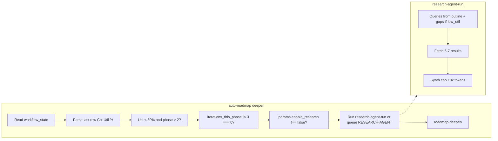

# Util %-Based Research Trigger Pivot (No Full MCP Overhaul)

## Scope

- **In scope:** auto-roadmap deepen-branch logic, research enable conditions, research-agent-run query derivation, Parameters/Queue-Sources/Roadmap-Upgrade-Plan docs, time mitigations (cooldown, async queue, result/token caps).
- **Out of scope:** Changing MCP tools, workflow_state schema, or existing context-tracking columns; no new MCP endpoints.

## 1. New enable condition (util-based auto-detect) in auto-roadmap.mdc

**File:** [.cursor/rules/context/auto-roadmap.mdc](.cursor/rules/context/auto-roadmap.mdc)

**Location:** In the **deepen** branch, inside **(1) Pre-deepen research (optional)**, extend the existing "Enable conditions" block.

**Current text (line 54):** Enable conditions are `params.enable_research === true` **or** phase/target `#research-needed` **or** auto-detect for current_phase > 3 (scan phase note for keywords). Override: if `params.enable_research === false`, skip.

**Add:**

- **Before** evaluating any other research enable condition:
  - Read the project's **workflow_state.md** via `obsidian_read_note` (path: `1-Projects/<project_id>/Roadmap/workflow_state.md`).
  - Parse the **last data row** of the `## Log` table for the **Ctx Util %** column (6th column; value may be a number like `8` or `"-"`). If the table is empty or parse fails, treat as "no util value" and do not auto-enable from util.
  - **Util-based condition:** If Ctx Util % is a valid number **and** `< research_util_threshold` (from Parameters/Config, default **30**) **and** `current_phase > 2` **and** `params.enable_research !== false`, then set `enable_research = true` internally (merge with existing conditions: so research runs if already true, or if util condition holds).
  - **Override:** If `params.enable_research === false` explicitly, skip research regardless of util (existing behavior).
- **Phase threshold:** Use **phase > 2** (not > 3) so phases 3+ get util-driven research; phases 1–2 do not (avoids spamming early phases).
- **Gate frequency (cooldown):** When util-based auto-enable would set research on, also check **research_cooldown** (Parameters, default 3): only actually enable research when `iterations_per_phase[current_phase] % research_cooldown === 0`. Read `iterations_per_phase` from workflow_state frontmatter; if missing for current_phase, treat as 0 (so first iteration can run research). Alternative: "once per subphase" can be documented as an option (e.g. only when `current_subphase_index` changes to a new secondary); initial implementation uses iteration cooldown for simplicity.

**Doc:** Reference Parameters for `research_util_threshold` and `research_cooldown`; no new tools—scan workflow_state via existing `obsidian_read_note`.

---

## 2. Parameters.md — new research params and Queue modes note

**File:** [3-Resources/Second-Brain/Parameters.md](3-Resources/Second-Brain/Parameters.md)

**Section:** § Research (pre-deepen) and § Queue modes (where RESUME-ROADMAP / RESEARCH-AGENT are listed).

**Add under Research (pre-deepen):**

- **research_util_threshold** (default **30**): When last workflow_state log row **Ctx Util %** is a number and < this value, and **current_phase > 2**, auto-set `enable_research: true` (unless `params.enable_research === false`). Tunable in Config or queue params. Rationale: low util = room for externals without overflow.
- **research_cooldown** (default **3**): Only trigger research every N iterations within the current phase. Check: `iterations_per_phase[current_phase] % research_cooldown === 0` (and util condition). Reduces per-iteration cost.
- **research_result_limit**: Bump default to **5–7** (from 3–5); document in same bullet.
- **research_synth_cap_tokens** (default **10000**): Per-run cap on synthesized output; truncate synth if exceeded. Separate from existing `research_max_tokens` (per-note cap); this is a hard per-run cap to keep a single research run from adding too much to context. Document in research-agent-run skill and here.
- **async_research** (optional, bool): When true, do not run research-agent-run inline; instead append a **RESEARCH-AGENT** entry to `.technical/prompt-queue.jsonl` with project_id, linked_phase, and a note that on completion the processor should queue RESUME-ROADMAP with `injected_research_paths`. Main deepen continues without waiting. Document in Queue-Sources.md as optional param.

**Queue modes (§ Queue modes):** Add a short bullet that util-driven research uses `research_util_threshold` and `research_cooldown`; reference Roadmap-Upgrade-Plan § 2 for "util-driven research injection".

---

## 3. research-agent-run/SKILL.md — query gen and caps

**File:** [.cursor/skills/research-agent-run/SKILL.md](.cursor/skills/research-agent-run/SKILL.md)

**Query generation (step 1):**

- **Existing:** Derive 3–5 queries from phase/outline content.
- **Add — gaps when low util:** When the run is triggered by low util (caller can pass a flag or `util_pct` / `low_util: true` in params), also derive queries from **"gaps"** in the current phase note: e.g. under-detailed sections (shallow bullets, very short sections, or headings with little body). Produce 1–3 extra queries like "expand on [topic from shallow section]" or "find examples for [under-specified bullet]". Input: phase note path (or linked_phase) is already available; optionally accept `low_util` or `util_pct` from params so the skill can add gap-based queries. Document in Inputs.
- **Target:** Aim for **10–20k tokens** added per run when util is low (guidance for synthesis length; enforced by caps below).

**Caps:**

- **research_result_limit:** Default **5–7** (already in Parameters; skill reads from params/Config).
- **Per-run token cap:** Apply **research_synth_cap_tokens** (default 10000): after synthesis, if total synthesized content exceeds this, truncate (e.g. trim from end or summarize) so the returned content is under the cap. Log truncation in the skill so Errors.md or pipeline log can record it. This keeps a single research run from ballooning context.

**Reference:** Parameters § Research (pre-deepen) for `research_synth_cap_tokens` and `research_util_threshold`; auto-roadmap for when low-util flag is passed.

---

## 4. Time mitigations — cooldown, async, caps (summary)

- **Gate frequency:** Implemented in § 1 (research_cooldown in auto-roadmap) and § 2 (Parameters).
- **Async/parallel queue:** Document in Queue-Sources (§ 5 below). Implementation: when `params.async_research === true`, auto-roadmap (deepen branch) appends to `.technical/prompt-queue.jsonl` one entry: `mode: "RESEARCH-AGENT"`, payload with project_id, linked_phase, optional research_queries; then continues with roadmap-deepen **without** calling research-agent-run. A later EAT-QUEUE run processes RESEARCH-AGENT; when research-agent-run finishes, it (or the queue processor) appends a RESUME-ROADMAP entry with `injected_research_paths` (paths to new Ingest/Agent-Research notes) so the next iteration gets research injected. No change to RESEARCH-AGENT mode contract in auto-eat-queue beyond ensuring RESUME-ROADMAP can receive `injected_research_paths` from a prior RESEARCH-AGENT run (e.g. via a small note or queue payload that the next RESUME-ROADMAP reads). Optional: document "injected_research_paths from async research" in roadmap-resume or deepen so the next run knows to load those paths.
- **Cap results:** § 2 and § 3 (research_result_limit 5–7, research_synth_cap_tokens 10k).

---

## 5. Queue-Sources.md — async_research and RESUME-ROADMAP

**File:** [3-Resources/Second-Brain/Queue-Sources.md](3-Resources/Second-Brain/Queue-Sources.md)

**In RESUME-ROADMAP params (canonical):**

- Add **async_research** (optional): When true, pre-deepen research is not run inline; a RESEARCH-AGENT entry is appended to the queue and deepen continues. When RESEARCH-AGENT completes, a follow-up RESUME-ROADMAP entry (or injected_research_paths) is used so the next run has research in context. Keeps main loop snappy; research runs in "background" via EAT-QUEUE batches.

**Optional:** One sentence under RESEARCH-AGENT mode: "When RESUME-ROADMAP runs with async_research: true, the processor may append RESEARCH-AGENT and continue with deepen; research results are consumed on a subsequent RESUME-ROADMAP run via injected_research_paths."

---

## 6. Roadmap-Upgrade-Plan.md § 2

**File:** [3-Resources/Second-Brain/Roadmap-Upgrade-Plan.md](3-Resources/Second-Brain/Roadmap-Upgrade-Plan.md)

**Section:** § 2 (Phase A: Preparation and setup).

**Add** a bullet or short subsection after the workflow_state schema / context tracking bullets:

- **Util-driven research injection:** When the last workflow_state log row shows **Ctx Util %** < **research_util_threshold** (default 30%) and **current_phase > 2**, the auto-roadmap deepen branch auto-sets `enable_research: true` so pre-deepen research runs and fills context purposefully. Frequency is gated by **research_cooldown** (e.g. every 3 iterations). See Parameters § Research (pre-deepen) and Queue-Sources § RESUME-ROADMAP params.

---

## 7. Sync and changelog

- **.cursor/sync/rules/context/auto-roadmap.md:** Mirror the deepen-branch changes (util read, research_util_threshold, research_cooldown, override).
- **.cursor/sync/skills/research-agent-run.md:** Mirror query-gap and cap changes.
- **.cursor/sync/changelog.md:** One entry: util-based research trigger (research_util_threshold, research_cooldown, gap queries, research_synth_cap_tokens, async_research doc).

---

## 8. Flow summary (mermaid)

---

## 9. Expected impact

- **Behavior:** Low util → auto-research → filled context (10–20k tokens target per qualifying run) without removing existing triggers.
- **Time:** Cooldown + optional async + 10k synth cap keep iteration time increase to ~+15–20% on qualifying iterations (user target).

## Files to touch

| File                                                                                                 | Change                                                                                                                            |
| ---------------------------------------------------------------------------------------------------- | --------------------------------------------------------------------------------------------------------------------------------- |
| [.cursor/rules/context/auto-roadmap.mdc](.cursor/rules/context/auto-roadmap.mdc)                     | Util read, research_util_threshold, phase > 2, research_cooldown, override; optional async_research branch                        |
| [3-Resources/Second-Brain/Parameters.md](3-Resources/Second-Brain/Parameters.md)                     | research_util_threshold, research_cooldown, research_result_limit 5–7, research_synth_cap_tokens, async_research; Queue modes ref |
| [.cursor/skills/research-agent-run/SKILL.md](.cursor/skills/research-agent-run/SKILL.md)             | Gap-based queries when low_util; research_synth_cap_tokens; research_result_limit default 5–7                                     |
| [3-Resources/Second-Brain/Queue-Sources.md](3-Resources/Second-Brain/Queue-Sources.md)               | async_research param; optional RESEARCH-AGENT follow-up sentence                                                                  |
| [3-Resources/Second-Brain/Roadmap-Upgrade-Plan.md](3-Resources/Second-Brain/Roadmap-Upgrade-Plan.md) | § 2: util-driven research injection bullet                                                                                        |
| .cursor/sync/rules/context/auto-roadmap.md                                                           | Sync rule changes                                                                                                                 |
| .cursor/sync/skills/research-agent-run.md                                                            | Sync skill changes                                                                                                                |
| .cursor/sync/changelog.md                                                                            | One-line changelog entry                                                                                                          |

