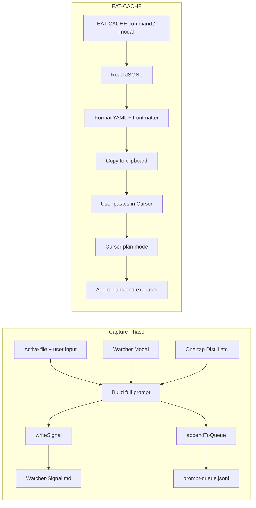

# Watcher Queue + EAT-CACHE (Cursor Plan Mode) — Full Plan

## Pivot summary

- **No Bash processor or sim tools.** Queue consumption is handled by Cursor’s **plan mode**: user pastes a single, structured payload into a new Cursor chat (plan mode) and the agent plans then executes.
- **Capture phase unchanged:** Watcher plugin appends to `3-Resources/prompt-queue.jsonl` on distill (and optionally express/archive) triggers, with file context and user input in the prompt.
- **EAT-CACHE:** New flow triggered from the existing Watcher modal or a dedicated command: read the queue JSONL, format as YAML/Markdown with frontmatter instructions, copy to clipboard. User pastes into Cursor plan mode and runs.
- **Clear queue:** Add "Clear Queue" modal/button to wipe prompt-queue.jsonl after successful run; keep optional vault log (e.g. 3-Resources/processed-results.log) for manual notes if the agent misses something.

---

## 1. Architecture



---

## 2. Capture phase (unchanged intent, add queue)

### 2.1 Queue file

- **Path:** `3-Resources/prompt-queue.jsonl` (vault path; plugin uses **`vault.adapter.read` / `vault.adapter.write`** for atomic read-modify-write; no `vault.read` if adapter is preferred for consistency).
- **Format:** One JSON object per line. Fields: `id`, `timestamp`, `mode`, `prompt`, `source_file` (string; empty if no active file).

### 2.2 Plugin: `appendToQueue(mode, fullPrompt, sourceFile)`

- Generate `requestId` (same as `writeSignal`: e.g. `(Date.now() + Math.random() * 1e9).toString(36)`).
- Build one line: `JSON.stringify({ id: requestId, timestamp: new Date().toISOString(), mode, prompt: fullPrompt, source_file: sourceFile || "" }) + "\n"`.
- Read existing queue file (if missing, treat as empty). Append the new line. Write back (same read/append/write pattern as `writeSignal`).
- Ensure `3-Resources` exists; create queue file if missing.
- Return `{ requestId }` for use in notices and optional signal logging.

**Code snippet (add to Watcher plugin):**

```javascript
const QUEUE_FILE = "3-Resources/prompt-queue.jsonl";

async appendToQueue(mode, fullPrompt, sourceFile) {
  const requestId = (Date.now() + Math.random() * 1e9).toString(36);
  const entry = {
    id: requestId,
    timestamp: new Date().toISOString(),
    mode: mode.replace(/\s+–\s+safe batch autopilot$/i, "").trim() || mode,
    prompt: fullPrompt,
    source_file: sourceFile || "",
  };
  const line = JSON.stringify(entry) + "\n";

  const vault = this.app.vault;
  let folder = vault.getAbstractFileByPath(RESOURCES_FOLDER);
  if (!folder) await vault.createFolder(RESOURCES_FOLDER);

  let existing = "";
  try {
    const f = vault.getAbstractFileByPath(QUEUE_FILE);
    if (f) existing = await vault.read(f);
  } catch (_) {}
  const newContent = (existing.trimEnd() ? existing.trimEnd() + "\n" : "") + line.trim();
  await vault.adapter.write(QUEUE_FILE, newContent);
  console.log("[Watcher] Appended to queue – requestId:", requestId);
  return { requestId };
}
```

### 2.3 Modal: open file + user input

- In **WatcherModal** Send handler:
  - Get active file: `const file = this.app.workspace.getActiveFile();`
  - If `file` and `file.extension === "md"`: `const fileContent = await this.app.vault.cachedRead(file);`
  - Build `fullPrompt`: e.g.  
    `DISTILL MODE – safe batch autopilot\n\n--- File: path/to/note.md ---\n${fileContent}\n\n--- User input ---\n${context}`  
    (or omit “User input” block if context is empty). If no active file, keep current: `mode.preset` + optional context.
  - `sourceFile = file ? file.path : ""`.
- After building prompt, call both:
  - `await this.plugin.writeSignal(mode.preset, fullPrompt);` (existing),
  - `await this.plugin.appendToQueue(mode.preset, fullPrompt, sourceFile);`.
- If “queue mode” is on for distill (or all modal modes): skip bridge and completion wait; show “Added to Cursor queue (requestId: …)”. **Always show “Pending: N”** after append (read queue, count valid JSONL lines, include in Notice).

### 2.4 One-tap Distill (and optional Express/Archive)

- Optionally add active-file context to one-tap: in `trigger-distill` (and similarly for express/archive), get active file, read content, prepend to fixed prompt, pass `source_file` into `appendToQueue`.
- Always call `appendToQueue` for distill (and optionally express/archive) so queue is populated; one-tap can still use existing bridge or be queue-only when “queue mode” is enabled.

---

## 3. EAT-CACHE: read queue → clipboard

### 3.1 Trigger (minimal UI)

- **Command:** “EAT-CACHE (copy queue to clipboard)” — trigger via command palette or hotkey. No new toolbar button.
- **Modal:** Add an **EAT-CACHE section** to the existing Watcher modal (bottom): show **“Pending: X”** on open (read queue, count entries), then options (see 3.1b) and “Copy queue” / “Clear Queue” buttons.
- **On EAT-CACHE open (modal or before copy):** Always show **“Pending: X”** in Notice or in the modal title/body so user knows queue size.

### 3.1b EAT-CACHE filter options (in modal)

- **Toggle in modal:** Let user choose what to include in the copied payload:
  - **“Include only pending distill”** — filter `entries` to `mode` matching distill only.
  - **“All modes”** — no filter (default).
  - **“Filter by source_file”** — optional text input or dropdown of distinct `source_file` values; include only entries whose `source_file` matches.
- When opening EAT-CACHE from the **command** (no modal), use default “All modes”; or open a small modal first with filter + “Copy” / “Clear Queue”.

### 3.2 Read queue and build payload

- Read `3-Resources/prompt-queue.jsonl` via **`vault.adapter.read`** (or `vault.read` if adapter path differs). If file missing or empty, show Notice “Queue is empty” and return.
- Parse line by line: for each non-empty line, `JSON.parse(line)`; collect into array `entries`. On parse error, skip that line (and optionally log).
- **Auto-dedup (plugin):** Before building payload, deduplicate: skip entries with identical `id` (keep first) or identical `prompt` (keep first). Reduces noise when same request was queued twice.
- Apply **filter** from 3.1b (distill-only / all / by source_file) to get `filteredEntries`.
- Build **queue stats** for frontmatter (see 3.2b).
- Build YAML/frontmatter document with:
  - `mode: EAT-CACHE`
  - **`vault_root`** or **`paths`**: vault root path or list of relative paths so the agent knows file locations (e.g. from `vault.adapter.basePath` or passed from plugin; if unavailable, use a placeholder like `VAULT_ROOT` and document that user must open vault in Cursor).
  - **`constraints`** section (see below).
  - **Queue stats:** `queue_summary`, `pending_count`, `modes_breakdown`, `top_source_files` (see 3.2b).
  - `instructions: |` with the multiline instruction block (see below).
  - `queued_prompts:` — YAML array from `filteredEntries`. For `prompt`, use quoted scalar or literal block so newlines/special chars are safe.

### 3.2b Frontmatter: vault path, constraints, queue stats

- **vault_root / paths:** Emit `vault_root: "<absolute path to vault>"` if available (e.g. `this.app.vault.adapter.basePath` or equivalent in Obsidian). Else emit `vault_root: "(open this vault in Cursor as workspace)"` and document in instructions. Optionally add `paths: [ "3-Resources/...", "..." ]` listing relative paths of `source_file` values in the queue so the agent knows which files are in scope.
- **constraints (new section):** Add to frontmatter so the agent has explicit guardrails:
  - Never delete core notes (Watcher-Signal, Watcher-Result, queue file, Backup dirs, etc.).
  - Prefer appends over overwrites where possible (e.g. Watcher-Result, logs).
  - Preserve YAML frontmatter in existing notes when editing.
  - Log changes verbosely (append to vault log or provide copy-paste block for `3-Resources/processed-results.log` or `Queue-Result-Log.md`).
- **Queue stats:**
  - `pending_count: N`
  - `modes_breakdown: { distill: 3, express: 1, archive: 1 }` (or YAML equivalent)
  - `top_source_files: [ "path/to/a.md", "path/to/b.md" ]` — most common `source_file` values (e.g. top 5 by count) to help agent prioritize.

### 3.3 Cursor workspace setup (document in plan / instructions)

- **Recommended:** Open the Obsidian vault folder in Cursor as the workspace so the agent can read/write files directly (huge win for execution). Emit `vault_root` in the payload when available so the agent knows the path.
- **Fallback / privacy:** If the vault is not open in Cursor, the agent can still plan; user applies outputs manually. Document this in the EAT-CACHE instructions or constraints.

### 3.4 Instructions block (exact text for agent)

```yaml
instructions: |
  - Cross-reference all queued prompts for duplicates (e.g., same requestId or similar content).
  - If multiple prompts reference the same source_file, group and execute them in optimal order (e.g., distill first, then express/archive if applicable) to minimize mutilation/overwrites of core data in the vault.
  - Build a step-by-step plan to process the queue: For each unique/grouped entry, apply the mode (distill/express/archive), incorporate file content/user input from the prompt, and output results in a format appendable to Watcher-Result.md (e.g., requestId: <id> | status: success | message: "<processed output>" | completed: <ISO8601>).
  - Optimize for efficiency: Deduplicate, batch similar operations, avoid redundant file reads/writes.
  - After planning, execute the plan and provide final outputs/log for manual append to vault.
```

### 3.5 Copy to clipboard

- Use **Obsidian/browser clipboard API:** `await navigator.clipboard.writeText(formattedPayload)`.
- Then show Notice: “Queue copied to clipboard. Paste into Cursor plan mode.”
- No Wayland-specific code; clipboard is standard web API (works in Obsidian desktop Electron and mobile where supported).

### 3.6 Example copied content (full, with new frontmatter)

```yaml
---
mode: EAT-CACHE
vault_root: /home/user/Documents/Second-Brain
pending_count: 2
queue_summary: 2 pending prompts
modes_breakdown: { distill: 1, express: 1 }
top_source_files: [ "3-Resources/MyNote.md" ]
constraints: |
  - Never delete core notes (Watcher-Signal, Watcher-Result, queue file, Backups).
  - Prefer appends over overwrites (e.g. Watcher-Result, logs).
  - Preserve YAML frontmatter in existing notes when editing.
  - Log changes verbosely; append to 3-Resources/processed-results.log or provide block for manual append.
instructions: |
  - Cross-reference all queued prompts for duplicates (e.g., same requestId or similar content).
  - If multiple prompts reference the same source_file, group and execute them in optimal order (e.g., distill first, then express/archive if applicable) to minimize mutilation/overwrites of core data in the vault.
  - Build a step-by-step plan to process the queue: For each unique/grouped entry, apply the mode (distill/express/archive), incorporate file content/user input from the prompt, and output results in a format appendable to Watcher-Result.md (e.g., requestId: <id> | status: success | message: "<processed output>" | completed: <ISO8601>).
  - Optimize for efficiency: Deduplicate, batch similar operations, avoid redundant file reads/writes.
  - After planning, execute the plan and provide final outputs/log for manual append to vault (or to 3-Resources/processed-results.log).
queued_prompts:
  - id: req-abc123
    timestamp: "2026-02-27T18:30:00Z"
    mode: distill
    prompt: "DISTILL MODE – safe batch autopilot\n\n--- File: 3-Resources/MyNote.md ---\n# MyNote\n\nContent...\n\n--- User input ---\nFocus on summary."
    source_file: 3-Resources/MyNote.md
  - id: req-def456
    timestamp: "2026-02-27T19:00:00Z"
    mode: express
    prompt: "EXPRESS MODE – safe batch autopilot\n\n--- User input ---\nSame note."
    source_file: ""
---
```

(Use YAML quoted string or literal block for `prompt` so newlines and colons don’t break parsing; see code below.)

### 3.7 Code: EAT-CACHE modal / command and formatting

**EatCacheModal** — minimal modal that performs the action and closes (or just run in command without a modal; the “modal” can be a simple confirmation). Here we use a **command** that runs the logic and shows a Notice; optionally a small modal can show “Queue has N entries. Copy to clipboard?” with Copy/Cancel.

**Format payload (safe YAML):**

- For each `prompt`, escape for YAML: use a literal block `|` or quoted scalar. In JS, a simple approach is to use double-quoted scalar and escape `\` and `"` and newlines as `\n`. Or use `>-` folded block and indent prompt content.
- To avoid injection, ensure each value is emitted as a safe string (no leading `>`, `|`, or `-` at start of line that could be interpreted as YAML).

**Code snippet — format queue as YAML string (with vault_root, constraints, queue stats):**

```javascript
formatQueueForEatCache(entries, opts = {}) {
  const vaultRoot = opts.vaultRoot != null ? opts.vaultRoot : "(open this vault in Cursor as workspace)";
  const summary = entries.length === 1 ? "1 pending prompt" : `${entries.length} pending prompts`;
  const modesBreakdown = entries.reduce((acc, e) => { acc[e.mode] = (acc[e.mode] || 0) + 1; return acc; }, {});
  const sourceCounts = entries.reduce((acc, e) => {
    const p = e.source_file || "(none)";
    acc[p] = (acc[p] || 0) + 1; return acc;
  }, {});
  const topSourceFiles = Object.entries(sourceCounts)
    .sort((a, b) => b[1] - a[1])
    .slice(0, 5)
    .map(([path]) => path);

  const constraints = `  - Never delete core notes (Watcher-Signal, Watcher-Result, queue file, Backups).
  - Prefer appends over overwrites (e.g. Watcher-Result, logs).
  - Preserve YAML frontmatter in existing notes when editing.
  - Log changes verbosely; append to 3-Resources/processed-results.log or provide block for manual append.`;

  const instructions = `  - Cross-reference all queued prompts for duplicates (e.g., same requestId or similar content).
  - If multiple prompts reference the same source_file, group and execute them in optimal order (e.g., distill first, then express/archive if applicable) to minimize mutilation/overwrites of core data in the vault.
  - Build a step-by-step plan to process the queue: For each unique/grouped entry, apply the mode (distill/express/archive), incorporate file content/user input from the prompt, and output results in a format appendable to Watcher-Result.md (e.g., requestId: <id> | status: success | message: "<processed output>" | completed: <ISO8601>).
  - Optimize for efficiency: Deduplicate, batch similar operations, avoid redundant file reads/writes.
  - After planning, execute the plan and provide final outputs/log for manual append to vault (or to 3-Resources/processed-results.log).`;

  const promptLines = entries.map((e) => {
    const promptEscaped = (e.prompt || "").replace(/\\/g, "\\\\").replace(/"/g, '\\"').replace(/\n/g, "\\n");
    return `  - id: ${e.id}\n    timestamp: "${e.timestamp}"\n    mode: ${e.mode}\n    prompt: "${promptEscaped}"\n    source_file: "${(e.source_file || "").replace(/"/g, '\\"')}"`;
  }).join("\n");

  const modesYaml = Object.entries(modesBreakdown).map(([k, v]) => `  ${k}: ${v}`).join("\n");
  const topFilesYaml = topSourceFiles.map((p) => `  - "${p.replace(/"/g, '\\"')}"`).join("\n");

  return `---
mode: EAT-CACHE
vault_root: ${vaultRoot}
pending_count: ${entries.length}
queue_summary: ${summary}
modes_breakdown:
${modesYaml}
top_source_files:
${topFilesYaml}
constraints: |
${constraints.split("\n").map((l) => "  " + l).join("\n")}
instructions: |
${instructions.split("\n").map((l) => "  " + l).join("\n")}
queued_prompts:
${promptLines}
---
`;
}
```

(Note: the above uses a single-line escaped `prompt`; if prompts are very long, Cursor may still parse them. Alternatively, use a YAML literal block per prompt so the agent sees the real newlines — e.g. `prompt: |\n` then indent each line of `e.prompt`. For simplicity the snippet uses quoted scalar; you can switch to literal block if you prefer.)

**Code snippet — EAT-CACHE command and read queue:**

```javascript
async runEatCache(opts = {}) {
  const vault = this.app.vault;
  let raw = "";
  try {
    const f = vault.getAbstractFileByPath(QUEUE_FILE);
    if (!f) {
      new Notice("Watcher: Queue is empty (no file).");
      return;
    }
    raw = await vault.read(f);
  } catch (e) {
    new Notice("Watcher: Could not read queue.");
    console.warn("[Watcher] EAT-CACHE read error", e);
    return;
  }

  const lines = raw.split("\n").filter((l) => l.trim());
  const entries = [];
  for (const line of lines) {
    try {
      entries.push(JSON.parse(line));
    } catch (_) {
      // skip invalid lines
    }
  }

  if (entries.length === 0) {
    new Notice("Watcher: Queue is empty.");
    return;
  }

  new Notice(`Pending: ${entries.length}`);

  // Dedup: keep first of each id and first of each identical prompt
  const seen = new Set();
  const deduped = entries.filter((e) => {
    const key = e.id + "|" + (e.prompt || "");
    if (seen.has(key)) return false;
    seen.add(key);
    return true;
  });
  // Apply filter (opts.filter: "all" | "distill" | source_file path)
  const filtered = (opts.filter === "distill")
    ? deduped.filter((e) => /distill/i.test(e.mode))
    : (opts.filter && opts.filter !== "all")
      ? deduped.filter((e) => (e.source_file || "") === opts.filter)
      : deduped;

  const vaultRoot = this.app.vault.adapter?.basePath ?? "(open this vault in Cursor as workspace)";
  const payload = this.formatQueueForEatCache(filtered, { vaultRoot });
  try {
    await navigator.clipboard.writeText(payload);
    new Notice(`Queue copied to clipboard (${filtered.length} entries). Paste into Cursor plan mode.`);
    console.log("[Watcher] EAT-CACHE: copied", filtered.length, "entries to clipboard");
  } catch (e) {
    new Notice("Watcher: Could not copy to clipboard.");
    console.warn("[Watcher] EAT-CACHE clipboard error", e);
  }
}
```

**Register command in onload:**

```javascript
this.addCommand({
  id: "eat-cache",
  name: "EAT-CACHE (copy queue to clipboard)",
  callback: () => this.runEatCache(),
});
```

**Optional: add button to WatcherModal** (in the same `onOpen`, after the MODES loop):

```javascript
const eatCacheRow = scrollContainer.createDiv();
eatCacheRow.createEl("button", { text: "EAT-CACHE: Copy queue to clipboard" }).addEventListener("click", () => {
  this.plugin.runEatCache();
  this.close();
});
```

---

## 4. Fallback and monitoring

- **processed-results.log (vault log):** Keep a vault-side log (e.g. `3-Resources/processed-results.log` or `3-Resources/Queue-Result-Log.md`) for manual notes when the agent misses something or for copy-paste of agent output. Document in EAT-CACHE instructions/constraints that the agent should append results there or provide a block for user to append.
- **Clear Queue:** Add a "Clear Queue" button in the EAT-CACHE modal (or a separate command) that wipes `prompt-queue.jsonl` after a successful run. Optional: move current content to `prompt-queue.done.<timestamp>.jsonl` before clearing.

## 5. Clear queue (implementation)

- **Where:** EAT-CACHE modal (bottom) and/or command palette: "Watcher: Clear queue".
- **Action:** Read queue (optional: write to `prompt-queue.done.<timestamp>.jsonl`), then overwrite `prompt-queue.jsonl` with empty or single newline via `vault.adapter.write`. Show Notice: "Queue cleared."
- **When:** User invokes after pasting into Cursor and running the plan (manual trigger; no auto-clear).

## 6. Compatibility and implementation tweaks

- **Obsidian:** Use **`vault.adapter.read`** / **`vault.adapter.write`** for queue file (atomic read-modify-write). Clipboard: `navigator.clipboard.writeText`. Works on desktop and mobile where available.
- **Wayland:** Test clipboard on Wayland — Obsidian (Electron) typically handles it; document workaround if issues arise.
- **YAML payload:** Use **js-yaml** if bundled, or **simple string template** to avoid extra dependency. Agent parses YAML frontmatter cleanly either way.
- **Dedup:** Before append, skip if same `requestId` already in file; before EAT-CACHE copy, dedup by `id` and by identical `prompt` (keep first).

## 7. Implementation order

1. Add `QUEUE_FILE` and `appendToQueue`; vault.adapter read-modify-write; optional dedup on append. Return requestId and pending count for Notice.
2. WatcherModal Send: active-file read, full prompt, appendToQueue + writeSignal; show "Pending: N" after append.
3. Add `formatQueueForEatCache(entries, options)` with vault_root, constraints, queue_summary, pending_count, modes_breakdown, top_source_files; dedup before formatting. String template or js-yaml.
4. Add `runEatCache(filter)` (all | distill | source_file); read queue, filter and dedup, format, copy; show "Pending: X" and "Queue copied to clipboard. Paste into Cursor plan mode."
5. Register command "EAT-CACHE"; add EAT-CACHE section to Watcher modal with Pending count, filter toggle (distill only / All / by source_file), "Copy queue" and "Clear Queue" buttons.
6. Add "Clear Queue" command and modal button: optional archive to done file, then wipe queue; Notice "Queue cleared."
7. One-tap distill: optionally add active file and appendToQueue; show Pending count.
8. Document processed-results.log in constraints/instructions for agent fallback and manual append.

---
