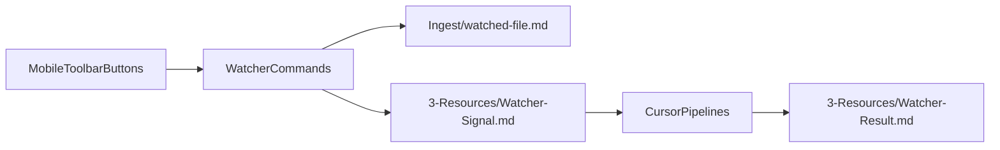

# Watcher watched-file + mobile toolbar plan

## 1. Move and rename the watched file into Ingest

- **Locate current watched file**: Confirm the existing path and frontmatter of `[3-Resources/Watcher-Watched-File.md](3-Resources/Watcher-Watched-File.md)`.
- **Create new Ingest path**: Plan the new canonical path `[Ingest/watched-file.md](Ingest/watched-file.md)` (keeping `watcher-protected: true` in frontmatter so pipelines can skip it by rule, not just by folder).
- **Physically move + rename**: Update the note location and filename inside the vault so Obsidian references stay valid (no broken links).
- **Update references**: Search for any references to `Watcher-Watched-File` or `3-Resources/Watcher-Watched-File.md` in:
  - Cursor rules (e.g. `[.cursor/rules/context/*.md](.cursor/rules/context/)`, especially ingest rules)
  - System docs in `[3-Resources](3-Resources/)`
  and change them to the new `[Ingest/watched-file.md](Ingest/watched-file.md)` path.

## 2. Wire Watcher plugin to the new watched-file path

- **Find Watcher plugin config**: Inspect `.obsidian/plugins/watcher/` (typically `data.json` or similar) to see how the watched file path is currently stored.
- **Update watched file setting**: Change the watcher configuration so the plugin now uses `Ingest/watched-file.md` as its watched file, instead of `3-Resources/Watcher-Watched-File.md`.
- **Keep behavior identical**: Ensure the file still behaves as the same command pad (same frontmatter, same content semantics) — only its path and filename change.
- **Confirm watcher exclusions**: Verify that Watcher-related notes (`Watcher-Signal`, `Watcher-Result`, `watched-file.md`) remain marked `watcher-protected: true` or otherwise excluded from autonomous pipelines per existing rules.

## 3. Ensure ingest pipeline skips the new watched-file

- **Review ingest rules**: Read `[.cursor/rules/context/ingest-processing.mdc](.cursor/rules/context/ingest-processing.mdc)` and `[.cursor/rules/context/para-zettel-autopilot.mdc](.cursor/rules/context/para-zettel-autopilot.mdc)` to see current glob and exclusion patterns.
- **Add explicit exclusion**: If needed, adjust the ingest globs/exclusions so `Ingest/watched-file.md` is skipped, e.g. by:
  - Checking `watcher-protected: true` frontmatter, and/or
  - Hard-excluding `Ingest/watched-file.md` by path in the ingest context rule.
- **Document behavior**: Update any pipeline documentation (e.g. `Cursor-Skill-Pipelines-Reference` or a short note in `Second-Brain-Automations-Setup-Report`) to mention that `watched-file.md` is a special control note ignored by ingest.

## 4. Add toolbar / command entries for each pipeline

- **Identify where commands are defined**: Inspect the Watcher plugin code/config (e.g. `.obsidian/plugins/watcher/main.js` or `data.json`) to see how the existing `Watcher: Open Prompt Modal` command(s) are registered.
- **Define per-pipeline commands**: Add new Obsidian commands for each pipeline you want manual kickoff for, with behavior like:
  - `Watcher: Ingest` → open prompt modal prefilled with `INGEST MODE – process captures` (or equivalent Cue) and write to `Watcher-Signal.md`.
  - `Watcher: Distill` → prefill `DISTILL MODE – safe batch autopilot`.
  - `Watcher: Express` → prefill `EXPRESS MODE – safe batch autopilot`.
  - `Watcher: Organize` → prefill `ORGANIZE MODE – safe batch autopilot`.
  - `Watcher: Archive` → prefill `ARCHIVE MODE – safe batch autopilot`.
- **Expose commands to mobile toolbar**: Make sure these commands are normal Obsidian commands so they show up in the mobile editor toolbar customization and can be pinned above the keyboard.

## 5. Clean up command naming format

- **Audit existing command labels**: Find the current labels like `Watcher: Watcher: Open Prompt Modal` and confirm their exact strings in the plugin code/manifest.
- **Normalize naming convention**: Rename commands to the simplified scheme `Watcher: {Modal}`, e.g.:
  - `Watcher: Prompt` (or `Watcher: Prompt Modal`)
  - `Watcher: Ingest`
  - `Watcher: Distill`
  - `Watcher: Express`
  - `Watcher: Organize`
  - `Watcher: Archive`
  ensuring no duplicated `Watcher:` prefixes.
- **Update manifest if needed**: If the plugin manifest (`manifest.json`) exposes command names or categories, keep them consistent with the simplified naming.

## 6. Verify end-to-end flow

- **Mermaid flow sanity-check**:

- **Desktop & mobile test**:
  - On mobile, pin the new `Watcher: Ingest/Distill/Express/Organize/Archive` commands to the editor toolbar and confirm they:
    - Open the correct modal text
    - Write appropriate `Watcher-Signal` entries
    - Trigger the correct Cursor pipelines.
  - Confirm that `Ingest/watched-file.md` stays in place, is not processed by ingest, and that logs still land in the various `*-Log.md` files.

## 7. Optional small docs tweak

- **Onboarding docs**: Add a short subsection in `[0-Onboarding/Basic-Examples.md](0-Onboarding/Basic-Examples.md)` or `Install-Steps` explaining the new mobile toolbar buttons and how they map to pipelines, so future you remembers how the wiring works.

