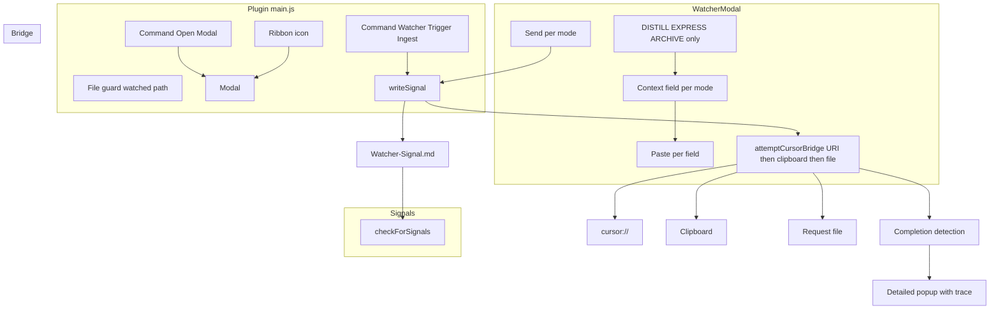

# Watcher Plugin v3 — URI Bridge Pivot + Recommendations

## Current state

- **No Watcher plugin exists** in the vault: `[.obsidian/plugins/watcher/](.obsidian/plugins/watcher/)` is absent. Other plugins use either a single `main.js` (sometimes bundled with esbuild) or multi-file builds.
- **INGEST MODE** is triggered by [always-ingest-bootstrap.mdc](.cursor/rules/always/always-ingest-bootstrap.mdc) when the user says "INGEST MODE", "Process Ingest", or "run ingests"; [Cursor-Skill-Pipelines-Reference.md](3-Resources/Cursor-Skill-Pipelines-Reference.md) and [para-zettel-autopilot.mdc](.cursor/rules/context/para-zettel-autopilot.mdc) define pipeline flow. Watcher will write the same trigger text to a signal file and optionally open Cursor via URI.
- **Pipeline exclusions** are defined per-context in [auto-archive.mdc](.cursor/rules/context/auto-archive.mdc), [auto-distill.mdc](.cursor/rules/context/auto-distill.mdc), [auto-express.mdc](.cursor/rules/context/auto-express.mdc), [auto-organize.mdc](.cursor/rules/context/auto-organize.mdc) (e.g. `**/Log*.md`, `* Hub.md`, `Backups/`**). Ingest scope is Ingest/*.md; no Watcher-specific exclusions yet.
- **V4 Draft** ([V4 Draft.md](V4 Draft.md)) evaluated v3 as deferring file guard and completion; this plan brings both **in scope**.

---

## 1. Plugin layout and file strategy

**Target path:** `.obsidian/plugins/watcher/`

**Deliverables:**

- `manifest.json` — id `watcher`, name "Watcher", version `0.3.0`, minAppVersion `0.15.0`, description per spec, `isDesktopOnly: false`.
- `main.js` — single entry (Obsidian loads one `main.js`). Prefer **one file with clearly separated sections** (bootstrap, file guard, signals, bridge, modal, completion) for a drop-in vault with no build step. Optional later: split into `signals.js`, `bridge.js`, `modal.js`, `completion.js` and add an esbuild/rollup step that emits a single `main.js` (or use TypeScript + obsidian-plugin dev setup).
- `styles.css` — touch targets and scroll (`.watcher-modal .watcher-textarea`, `.watcher-modal button`, `.watcher-mode-section` per spec).

**Feasibility:** Obsidian does not natively load multiple JS files from a plugin folder. Multi-file source can be used only with a build step that produces one `main.js`. The plan assumes **single main.js with logical sections** unless you introduce a build; the spec’s “split from one monolithic main.js into individual files” can be satisfied by in-code modules or a later build.

---

## 2. File guard (in scope)

- **Watched file path:** Configurable default `3-Resources/Watcher-Watched-File.md` (e.g. `this.watchedFilePath` in plugin state; optional later setting).
- **On load:** Ensure `3-Resources` exists (`vault.createFolder('3-Resources')` or equivalent); if the watched file is missing, create it with minimal content (e.g. frontmatter `watcher-protected: true` + heading `# Watched file`). Never delete or overwrite it from Watcher logic.
- **Read-only in UI:** When the Watcher UI displays or references the watched file (e.g. future “point at” picker), treat it read-only (no edit/save from the modal). For v3, if the modal does not open the file for edit, this reduces to “do not offer save/edit for that path.”
- **Pipeline soft-lock:** Add and maintain frontmatter `watcher-protected: true` (or a documented sidecar, e.g. `.watcher-lock` in the same folder) so autonomous pipelines skip move/delete for this file. **Cursor-side:** Document in pipeline rules that notes with `watcher-protected: true` or under a fixed Watcher path list are excluded (see §6).

---

## 3. Bootstrap and commands (main.js)

- **State:** `signalFilePath = '3-Resources/Watcher-Signal.md'`, `resultFilePath = '3-Resources/Watcher-Result.md'`, `lastRequestId = ''`, `cursorBridgeEnabled = false`, `hasShownBridgeNotice = false`, `watchedFilePath` (e.g. `'3-Resources/Watcher-Watched-File.md'`).
- **onload:**
  - File guard init: ensure `3-Resources` and watched file exist; create placeholder if missing; set `watcher-protected: true` on it.
  - Register commands:
    1. **"Watcher: Open Prompt Modal"** → `new WatcherModal(this.app, this).open()` (DISTILL / EXPRESS / ARCHIVE only).
    2. **"Watcher: Trigger Ingest"** (or "Watcher: Ingest") → call `writeSignal('INGEST MODE', 'INGEST MODE – process captures')`, then if bridge enabled call `attemptCursorBridge(requestId, fullPrompt)` and start completion wait; no modal. User adds this to Settings → Mobile → Toolbar for one-tap ingest.
  - Ribbon icon → same as command 1 (open modal).
- **Delegation:** Implement or inline in main.js: `writeSignal`, `checkForSignals` (signals); `attemptCursorBridge` (bridge); `WatcherModal` (modal); `startCompletionWait` + `showCompletionPopup` (completion). No separate files unless a build step is added.

---

## 4. Signal format and request-id

- **Path:** `3-Resources/Watcher-Signal.md`.
- **Line format:** One line per request, e.g.  
`[2026-02-26T23:12:34.567Z] requestId: m8k2x9ab | mode: EXPRESS MODE | prompt: "EXPRESS MODE – add to MOC – pasted quotes here"`  
Escape double quotes in prompt (e.g. `\"`) for reliable parsing.
- **Request-id:** `(Date.now() + Math.random() * 1e9).toString(36)` (single expression).
- **File init:** If `3-Resources` missing, create it; if signal file missing, create with `# Watcher Signals\n` then append the new line.

---

## 5. Modal (WatcherModal) — DISTILL, EXPRESS, ARCHIVE only

- **Modes array:** Only `DISTILL`, `EXPRESS`, `ARCHIVE` (no INGEST). Each has preset text, `hasField: true`, placeholder.
- **Per mode:** Section div (e.g. `.watcher-mode-section`), heading, textarea, Paste button, Send button. On Send: read context, build `fullPrompt` (preset + context), call `writeSignal(mode, fullPrompt)`, clear field, then if bridge enabled `attemptCursorBridge(requestId, fullPrompt)` and start completion wait; on done/timeout show detailed popup (§5c).
- **Paste:** Per-field Paste appends clipboard content to that field (unchanged from spec).

---

## 6. Bridge (unchanged) and completion detection

- **Bridge:** URI first, then clipboard, then request file; off by default; one-time notice when first used (“prioritizing URI deeplink”). No code change to strategy order.
- **Completion:** Cursor has no public API or system notifications for run completion. Use **file-based polling** as the only method: Cursor-side rule (see §7) appends to `3-Resources/Watcher-Result.md` on run finish. Plugin polls that file (e.g. last line or line matching current `requestId`) until a matching line appears or timeout (configurable, e.g. 10–15 min).
- **Result line format:**  
`requestId: xxx | status: success|failure | message: "..." | trace: "full error stack if failed"`  
Plugin parses by `requestId` and `status`.
- **Detailed popup:** On done → short success message. On failure → show full error message and trace (e.g. in a Modal or expandable area so the user can copy). On timeout → message + elapsed time + last-known state (e.g. “No result file after 15 min; requestId: xyz”). Use Obsidian Notice for brief feedback; use a Modal for multi-line trace.

---

## 7. Cursor-side rule and pipeline exclusions

**Watcher-Result contract (new rule or pipeline doc):**

- Add a short **always-applied or pipeline-adjacent rule** (e.g. new `.cursor/rules/always/watcher-result-append.mdc` or a “Watcher bridge” subsection in [mcp-obsidian-integration.mdc](.cursor/rules/always/mcp-obsidian-integration.mdc) and [Cursor-Skill-Pipelines-Reference.md](3-Resources/Cursor-Skill-Pipelines-Reference.md)) that states:
  - When the current run was **triggered by a Watcher request** (inferred from prompt containing the Watcher trigger text, e.g. INGEST MODE, DISTILL MODE, EXPRESS MODE, ARCHIVE MODE, and/or from the last line in `Watcher-Signal.md` with a `requestId`),
  - **On run finish** (success or failure), append to `3-Resources/Watcher-Result.md` one line:  
  `requestId: <id> | status: success|failure | message: "..." | trace: "..."`  
  - For failures, `trace` must contain the full error stack or log excerpt (not a one-liner).
- Document the path `3-Resources/Watcher-Result.md` and the format so the plugin parser stays in sync.

**Pipeline exclusions (file guard):**

- In [Cursor-Skill-Pipelines-Reference.md](3-Resources/Cursor-Skill-Pipelines-Reference.md): Add an “Exclusions (Watcher)” note: pipelines must not move or delete notes that (a) have frontmatter `watcher-protected: true`, or (b) are one of the fixed Watcher paths: `3-Resources/Watcher-Watched-File.md`, `3-Resources/Watcher-Signal.md`, `3-Resources/Watcher-Result.md`.
- In each pipeline context rule that performs move/delete (ingest, organize, archive): add to the **Excludes** list the watched file path and, if using a pattern, “notes with `watcher-protected: true`” or the explicit paths above. Example for [auto-archive.mdc](.cursor/rules/context/auto-archive.mdc): exclude `3-Resources/Watcher-Watched-File.md`, `3-Resources/Watcher-Signal.md`, `3-Resources/Watcher-Result.md` (and optionally “any note with `watcher-protected: true`”). Same idea for [para-zettel-autopilot.mdc](.cursor/rules/context/para-zettel-autopilot.mdc) / ingest and [auto-organize.mdc](.cursor/rules/context/auto-organize.mdc) where applicable.

---

## 8. Mobile and manifest

- **manifest:** `isDesktopOnly: false`; description as in spec (mode-specific prompts → signal file + optional Cursor bridge, disabled by default, URI-first when enabled).
- **Mobile toolbar:** Document in plugin README or in-vault doc: (1) “Watcher: Open Prompt Modal” for DISTILL/EXPRESS/ARCHIVE; (2) “Watcher: Trigger Ingest” for one-tap INGEST — user adds (2) to Settings → Mobile → Toolbar. Test `cursor://` and clipboard/request-file fallbacks on device.

---

## 9. CSS and testing checklist

- Inject or add stylesheet: `.watcher-modal .watcher-textarea { min-height: 80px; padding: 10px; font-size: 16px; width: 100%; }`, `.watcher-modal button { min-height: 48px; min-width: 64px; padding: 0 16px; margin: 4px; }`, `.watcher-mode-section { margin: 16px 0; padding-bottom: 16px; border-bottom: 1px solid var(--background-modifier-border); }`, and ensure modal content scrolls when many modes are present.
- **Testing:** File guard (watched file created if missing; read-only in UI; pipelines skip it); Ingest only via “Watcher: Trigger Ingest” (toolbar), not in modal; modal only DISTILL/EXPRESS/ARCHIVE with Paste + Send; signal file format and polling; bridge off by default, then enable and test URI → clipboard → file; completion wait and detailed popup (Done / Failed with trace / Timeout); mobile toolbar and URI fallbacks.

---

## 10. Out of scope (deferred)

- Settings tab to toggle `cursorBridgeEnabled` and bridge strategy order. For v3, enable bridge by editing `main.js` (`cursorBridgeEnabled = true`) and reloading.

---

## Summary diagram (from spec)

---

## Files to create or change

| Item                                                                                   | Action                                                                                   |
| -------------------------------------------------------------------------------------- | ---------------------------------------------------------------------------------------- |
| `.obsidian/plugins/watcher/manifest.json`                                              | Create (id, name, 0.3.0, description, isDesktopOnly: false)                              |
| `.obsidian/plugins/watcher/main.js`                                                    | Create (bootstrap, file guard, commands, signals, bridge, modal, completion in one file) |
| `.obsidian/plugins/watcher/styles.css`                                                 | Create (touch targets, sections, scroll)                                                 |
| `.cursor/rules/always/mcp-obsidian-integration.mdc` or new `watcher-result-append.mdc` | Add or create: Watcher-Result append contract and format                                 |
| `3-Resources/Cursor-Skill-Pipelines-Reference.md`                                      | Add Watcher exclusions and Watcher-Result contract reference                             |
| `.cursor/rules/context/auto-archive.mdc`                                               | Add Watcher paths (and optionally watcher-protected) to Excludes                         |
| `.cursor/rules/context/auto-organize.mdc`                                              | Same exclusions                                                                          |
| `.cursor/rules/context/para-zettel-autopilot.mdc` (or ingest rule)                     | Same exclusions for ingest scope                                                         |

No changes to MCP server or skill files are required; the bridge is URI/clipboard/file only, and completion is file-based.