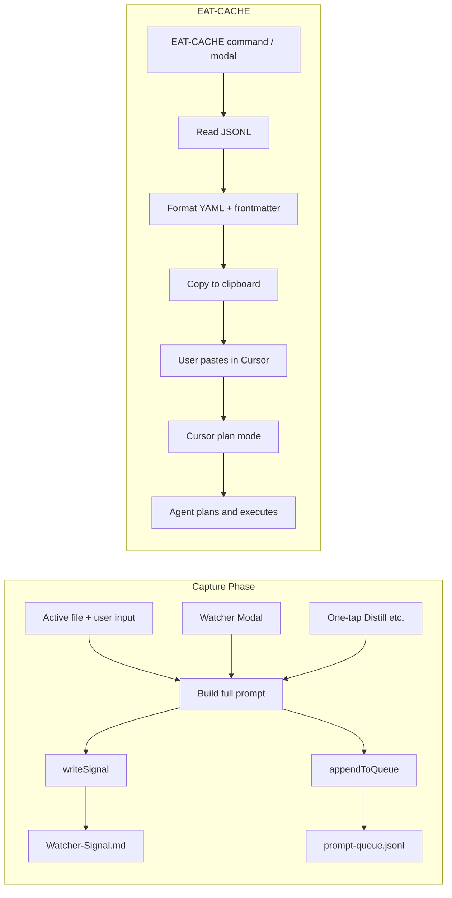

# Watcher Queue-Based Distill Automation (EAT-CACHE Pivot)

## Pivot summary

- **No Bash processor or sim tools.** Queue consumption is handled by Cursor’s **plan mode**: user pastes a single, structured payload into a new Cursor chat (plan mode) and the agent plans then executes.
- **Capture phase:** Watcher plugin appends to `3-Resources/prompt-queue.jsonl` on distill (and optionally express/archive) triggers, with file context and user input in the prompt.
- **EAT-CACHE:** Read queue JSONL, format as YAML/Markdown with frontmatter (vault_root, constraints, queue stats, instructions), copy to clipboard. User pastes into Cursor plan mode and runs.
- **Clear queue:** Add "Clear Queue" modal/button to wipe `prompt-queue.jsonl` after successful run; keep optional vault log (`3-Resources/processed-results.log`) for manual notes if the agent misses something.

---

## Current state

- **Watcher plugin** ([.obsidian/plugins/watcher/main.js](.obsidian/plugins/watcher/main.js)): Writes to `3-Resources/Watcher-Signal.md` and optionally attempts Cursor bridge. Modal has DISTILL/EXPRESS/ARCHIVE with textarea only; one-tap "Distill" uses a fixed prompt with no open-file context.
- **No queue today:** All triggers write only to the signal file; no JSONL queue or EAT-CACHE flow.

---

## 1. Architecture




---

## 2. Capture phase (Watcher plugin)

### 2.1 Queue file

- **Path:** `3-Resources/prompt-queue.jsonl` (vault path; plugin uses `vault.adapter.read` / `vault.adapter.write` for atomic read-modify-write).
- **Format:** One JSON object per line. Fields: `id`, `timestamp`, `mode`, `prompt`, `source_file` (string; empty if no active file).

### 2.2 Plugin: `appendToQueue(mode, fullPrompt, sourceFile)`

- Generate `requestId` (same as `writeSignal`: e.g. `(Date.now() + Math.random() * 1e9).toString(36)`).
- Build one line: `JSON.stringify({ id: requestId, timestamp: new Date().toISOString(), mode, prompt: fullPrompt, source_file: sourceFile || "" }) + "\n"`.
- Read existing queue file (if missing, treat as empty). Append the new line. Write back. Ensure `3-Resources` exists.
- **Dedup before append:** Read existing queue; skip appending if an entry already has the same `id` OR the same `prompt` + `source_file` (keep first occurrence; do not add duplicate).
- **Error handling:** On write failure (e.g. vault locked, adapter error), retry once after short delay; if still failing, show Notice "Watcher: Could not write to queue. Try again." and return without appending. Log error to console.
- Return `{ requestId }` on success.
- **Notify:** After append, show "Added to Cursor queue (requestId: …)" and **"Pending: N"** (count valid JSONL lines).

**Code snippet:**

```javascript
const QUEUE_FILE = "3-Resources/prompt-queue.jsonl";

async appendToQueue(mode, fullPrompt, sourceFile) {
  const requestId = (Date.now() + Math.random() * 1e9).toString(36);
  const entry = {
    id: requestId,
    timestamp: new Date().toISOString(),
    mode: mode.replace(/\s+–\s+safe batch autopilot$/i, "").trim() || mode,
    prompt: fullPrompt,
    source_file: sourceFile || "",
  };
  const line = JSON.stringify(entry) + "\n";

  const vault = this.app.vault;
  let folder = vault.getAbstractFileByPath(RESOURCES_FOLDER);
  if (!folder) await vault.createFolder(RESOURCES_FOLDER);

  let existing = "";
  try {
    const f = vault.getAbstractFileByPath(QUEUE_FILE);
    if (f) existing = await vault.read(f);
  } catch (_) {}
  // Dedup: skip if same id or same prompt+source_file already in queue
  const existingEntries = existing.split("\n").filter((l) => l.trim());
  for (const raw of existingEntries) {
    try {
      const o = JSON.parse(raw);
      if (o.id === requestId || ((o.prompt === entry.prompt) && (o.source_file || "") === (entry.source_file || "")))
        return { requestId, skipped: true };
    } catch (_) {}
  }
  const newContent = (existing.trimEnd() ? existing.trimEnd() + "\n" : "") + line.trim();
  try {
    await vault.adapter.write(QUEUE_FILE, newContent);
  } catch (e) {
    console.warn("[Watcher] Queue write failed, retrying...", e);
    await new Promise((r) => setTimeout(r, 500));
    try {
      await vault.adapter.write(QUEUE_FILE, newContent);
    } catch (e2) {
      new Notice("Watcher: Could not write to queue. Try again.");
      console.error("[Watcher] Queue write failed after retry", e2);
      return { requestId: null };
    }
  }
  console.log("[Watcher] Appended to queue – requestId:", requestId);
  return { requestId };
}
```

### 2.3 Modal: open file + user input

- In **WatcherModal** Send handler:
  - Get active file: `const file = this.app.workspace.getActiveFile();`
  - If `file` and `file.extension === "md"`: `await this.app.vault.cachedRead(file)`.
  - Build `fullPrompt`: e.g. `DISTILL MODE – safe batch autopilot\n\n--- File: path/to/note.md ---\n${fileContent}\n\n--- User input ---\n${context}`. If no active file, keep preset + context only.
  - `sourceFile = file ? file.path : ""`.
- Call `writeSignal(mode.preset, fullPrompt)` and `appendToQueue(mode.preset, fullPrompt, sourceFile)`.
- If "queue mode" on: skip bridge and completion wait; show "Added to Cursor queue" and **"Pending: N"**.

### 2.4 One-tap Distill

- Optionally add active-file context to one-tap: get active file, read content, prepend to fixed prompt, pass `source_file` into `appendToQueue`. Always call `appendToQueue` for distill; show Pending count in Notice.

---

## 3. EAT-CACHE: read queue → clipboard

### 3.1 Trigger (minimal UI)

- **Command:** "EAT-CACHE (copy queue to clipboard)" — command palette or hotkey. No new toolbar button.
- **Modal:** Add EAT-CACHE section to existing Watcher modal (bottom): show **"Pending: X"** on open, then filter options and "Copy queue" / "Clear Queue" buttons.

### 3.1b EAT-CACHE filter options

- **Toggle in modal:** "Include only pending distill" / "All modes" / "Filter by source_file" (dropdown or input of distinct `source_file` values). Command can use default "All" or open small modal to choose.

### 3.2 Read queue and build payload

- **Error/edge handling:** If queue file is missing or empty → Notice "Watcher: Queue is empty." and return early. If file exists but content is malformed (e.g. no valid JSONL lines after parsing) → Notice "Watcher: Queue is empty or malformed." and return early. Do not copy to clipboard or show Pending in that case.
- Read `3-Resources/prompt-queue.jsonl` (vault read). Parse line by line: `JSON.parse(line)` per non-empty line; collect `entries`. Skip parse errors (invalid lines).
- **Auto-dedup:** Skip identical `id` or identical `prompt` + `source_file` (keep first). Apply filter (distill-only / all / by source_file).
- Build YAML frontmatter with:
  - **vault_root:** From `vault.adapter.basePath` or placeholder "(open this vault in Cursor as workspace)".
  - **constraints:** Never delete core notes; prefer appends; preserve YAML frontmatter; log verbosely (e.g. to `3-Resources/processed-results.log`).
  - **Queue stats:** `pending_count`, `queue_summary`, `modes_breakdown`, `top_source_files` (top 5 by count).
  - **instructions:** Multiline block (see below).
  - **queued_prompts:** YAML array from filtered entries; escape `prompt` for YAML (quoted scalar or literal block).

### 3.3 Cursor workspace setup

- **Recommended:** Open the Obsidian vault folder in Cursor as workspace so the agent can read/write files. Emit `vault_root` when available.
- **Fallback:** If vault not open in Cursor, agent can still plan; user applies outputs manually.

### 3.4 Instructions block (for agent)

- Cross-reference queued prompts for duplicates (same requestId or similar content).
- If multiple prompts reference the same `source_file`, group and execute in optimal order (distill first, then express/archive) to minimize overwrites.
- Build a step-by-step plan: for each unique/grouped entry, apply mode (distill/express/archive), use file content/user input from prompt, output in format appendable to Watcher-Result.md: `requestId: <id> | status: success | message: "..." | completed: <ISO8601>`.
- Optimize: deduplicate, batch similar ops, avoid redundant file reads/writes.
- After planning, execute and provide final outputs/log for manual append to vault (or `3-Resources/processed-results.log`).

### 3.5 Example copied content (frontmatter)

```yaml
---
mode: EAT-CACHE
vault_root: /home/user/Documents/Second-Brain
pending_count: 2
queue_summary: 2 pending prompts
modes_breakdown: { distill: 1, express: 1 }
top_source_files: [ "3-Resources/MyNote.md" ]
constraints: |
  - Never delete core notes (Watcher-Signal, Watcher-Result, queue file, Backups).
  - Prefer appends over overwrites (e.g. Watcher-Result, logs).
  - Preserve YAML frontmatter in existing notes when editing.
  - Log changes verbosely; append to 3-Resources/processed-results.log or provide block for manual append.
instructions: |
  - Cross-reference all queued prompts for duplicates...
  - If multiple prompts reference the same source_file, group and execute in optimal order...
  - Build a step-by-step plan... output appendable to Watcher-Result.md...
  - Optimize for efficiency...
  - After planning, execute and provide final outputs/log for manual append to vault.
queued_prompts:
  - id: req-abc123
    timestamp: "2026-02-27T18:30:00Z"
    mode: distill
    prompt: "DISTILL MODE – safe batch autopilot\n\n--- File: 3-Resources/MyNote.md ---\n..."
    source_file: 3-Resources/MyNote.md
  - id: req-def456
    ...
---
```

### 3.6 Code: formatQueueForEatCache and runEatCache

**formatQueueForEatCache(entries, opts = {}):** Build YAML string with `vault_root`, `pending_count`, `queue_summary`, `modes_breakdown`, `top_source_files`, `constraints`, `instructions`, `queued_prompts`. Use `opts.vaultRoot` when provided. Escape prompts for YAML (quoted scalar with `\n` etc.).

**runEatCache(opts = {}):** Read queue file; if missing or empty or no valid JSONL lines → Notice "Queue is empty." or "Queue is empty or malformed." and return early. Parse JSONL, dedup by `id` and by identical `prompt` + `source_file` (keep first). Show Notice "Pending: N". Apply `opts.filter` ("all" | "distill" | source_file path). Get `vaultRoot` from `this.app.vault.adapter?.basePath`. Call `formatQueueForEatCache(filtered, { vaultRoot })`, then `navigator.clipboard.writeText(payload)`. Notice: "Queue copied to clipboard (N entries). Paste into Cursor plan mode."

**Register command:**

```javascript
this.addCommand({
  id: "eat-cache",
  name: "EAT-CACHE (copy queue to clipboard)",
  callback: () => this.runEatCache(),
});
```

**Optional: EAT-CACHE row in Watcher modal** (after MODES loop): "Pending: X", filter toggle, "Copy queue" and "Clear Queue" buttons; Copy calls `this.plugin.runEatCache({ filter: selectedFilter })`.

---

## 4. Fallback and monitoring

- **processed-results.log:** Vault log at `3-Resources/processed-results.log` (or `Queue-Result-Log.md`) for manual notes and agent output when something is missed. Document in EAT-CACHE constraints/instructions that agent should append there or provide block for user to append.
- **Clear Queue:** Add "Clear Queue" button in EAT-CACHE modal and command "Watcher: Clear queue". Optional: archive current queue to `prompt-queue.done.<timestamp>.jsonl`, then overwrite `prompt-queue.jsonl` with empty content via `vault.adapter.write`. Notice: "Queue cleared." User invokes after successful run (manual trigger).

---

## 5. Compatibility and implementation tweaks

- **Obsidian:** Use `vault.adapter.read` / `vault.adapter.write` for queue (atomic read-modify-write). Clipboard: `navigator.clipboard.writeText`. Works on desktop and mobile where available.
- **Wayland:** Test clipboard on Wayland; Obsidian (Electron) typically handles it; document workaround if needed.
- **YAML:** Use **js-yaml** if bundled, or **simple string template** to avoid extra dependency.
- **Dedup:** Before append, check existing entries for same `id` OR identical `prompt` + `source_file` (keep first occurrence; do not append duplicate). Before EAT-CACHE copy, dedup by `id` and by identical `prompt` + `source_file` (keep first).

---

## 6. File and config summary


| Item          | Location / purpose                                                                |
| ------------- | --------------------------------------------------------------------------------- |
| Queue file    | `3-Resources/prompt-queue.jsonl` (one JSON object per line).                      |
| Queue log     | `3-Resources/Queue-Log.md` (optional) or timing log.                              |
| Processed log | `3-Resources/processed-results.log` (vault log for agent output / manual append). |
| Done archive  | Optional: `3-Resources/prompt-queue.done.<timestamp>.jsonl` before Clear Queue.   |


---

## 7. Implementation order

1. Add `QUEUE_FILE` and `appendToQueue(mode, fullPrompt, sourceFile)`; vault.adapter read-modify-write; optional dedup on append. Return requestId; show "Pending: N" in Notice after append.
2. WatcherModal Send: active-file read, full prompt, appendToQueue + writeSignal; show "Pending: N" after append.
3. Add `formatQueueForEatCache(entries, opts)` with vault_root, constraints, queue_summary, pending_count, modes_breakdown, top_source_files; dedup before formatting. String template or js-yaml.
4. Add `runEatCache(opts)` (opts.filter: "all" | "distill" | source_file); read queue, filter and dedup, format, copy; show "Pending: X" and "Queue copied to clipboard (N entries). Paste into Cursor plan mode."
5. Register command "EAT-CACHE"; add EAT-CACHE section to Watcher modal with Pending count, filter toggle (distill only / All / by source_file), "Copy queue" and "Clear Queue" buttons.
6. Add "Clear Queue" command and modal button: optional archive to done file, then wipe queue; Notice "Queue cleared."
7. One-tap distill: optionally add active file and appendToQueue; show Pending count.
8. Document processed-results.log in constraints/instructions for agent fallback and manual append.
9. Add error/edge handling: EAT-CACHE empty/malformed → Notice + return early; appendToQueue write retry + error Notice; dedup by `id` or `prompt`+`source_file` before append.
10. Add testing: mock queue with 2–3 entries (same file, different modes; include duplicates); run EAT-CACHE and verify dedup and format.

---

## 8. Error and edge handling

- **EAT-CACHE:** If queue file is missing, empty, or malformed (no valid JSONL lines after parsing) → show Notice ("Queue is empty." or "Queue is empty or malformed.") and return early; do not copy to clipboard.
- **appendToQueue:** On write failure (e.g. vault locked, adapter error): retry once after a short delay (e.g. 500 ms); if still failing, show Notice "Watcher: Could not write to queue. Try again." and return without appending; log error to console.
- **Dedup on append:** Before appending, read existing queue and parse each line; if any entry has the same `id` as the new entry, or the same `prompt` and `source_file`, skip appending (keep first occurrence; optionally return `{ requestId, skipped: true }` so caller can show a different Notice if desired).

---

## 9. Testing sequence

- **Mock queue:** Create or paste 2–3 lines into `3-Resources/prompt-queue.jsonl`:
  - Same `source_file` with different modes (e.g. one distill, one express for the same note).
  - One duplicate: same `prompt` + `source_file` as an existing entry (or same `id`).
- **Verify:** Run EAT-CACHE (command or modal). Confirm: (1) "Pending: N" reflects only non-duplicate entries if dedup is applied at read time, or N total before dedup; (2) copied YAML contains expected entries; (3) dedup on copy leaves only one of the duplicate pair. Optionally run appendToQueue with a duplicate prompt+source_file and confirm it is skipped (no new line added).

---

## 10. Optional: one-tap with active file

In `trigger-distill` (and optionally express/archive): get `this.app.workspace.getActiveFile()`, and if markdown, read content and prepend to fixed prompt; set `source_file` when calling `appendToQueue`. Keeps one-tap consistent with modal behavior.