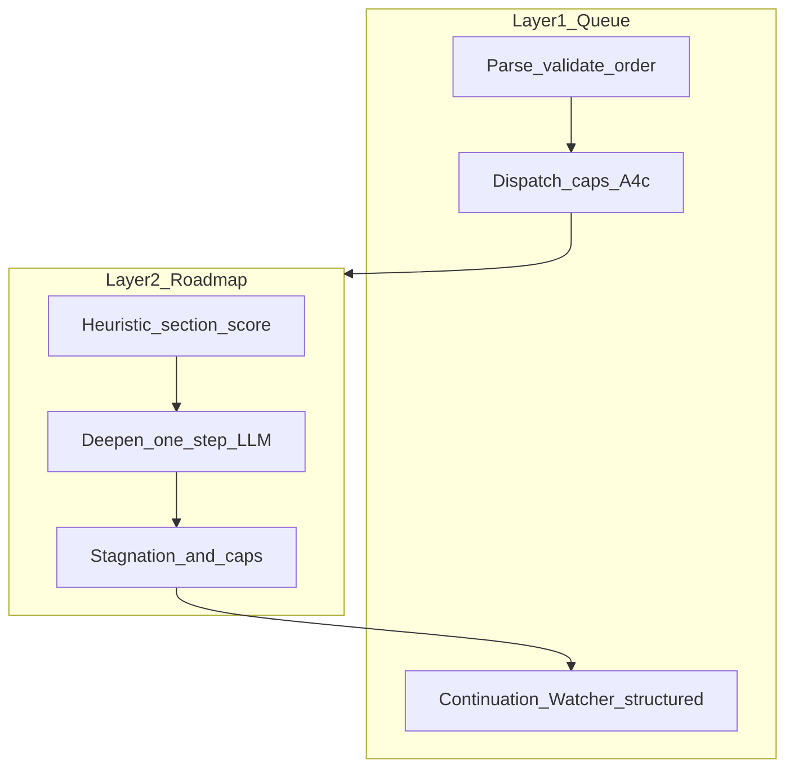

# Heuristic / control plane — v1 plan

## Goal

Make **termination, progression, and “move on”** decisions **mostly deterministic** (rules + integers + scoring), while keeping **semantic work** (deepen prose, research synthesis, hostile validation reports) **LLM-heavy**. This addresses overnight multi–EAT-QUEUE reliability and **section circling** (e.g. repeated work on the same subphase) without treating heuristics as a one-off validator tweak.

## Current baseline (already in repo)

- **Layer 1 caps and ordering:** `[.cursor/rules/agents/queue.mdc](.cursor/rules/agents/queue.mdc)` **A.4c** — `max_forward_roadmap_dispatches_per_project_per_run`, `max_repair_roadmap_dispatches_per_project_per_run`, `max_blocking_repair_preflight_per_project_per_run`, `repair_first` vs `forward_first`; mid-run append caps and stall-skip hooks exist.
- **Roadmap deepen stagnation (structured):** `[.cursor/skills/roadmap-deepen/SKILL.md](.cursor/skills/roadmap-deepen/SKILL.md)` **§77b** — `stagnation_suspected` from last N log rows with same Target and flat Confidence band; Config keys `stagnation_window_runs`, `stagnation_confidence_delta_max_percent`.
- **Diminishing returns (advisory):** same skill **“Diminishing returns (advisory)”** — appends advisory text; **does not** block deepen by default.
- **Per-subphase conceptual cap:** skill **§2.5** / `roadmap.conceptual_max_deepen_per_subphase` (see [Second-Brain-Config](3-Resources/Second-Brain-Config.md) `roadmap` block).
- **Continuation + cursor dedup:** `[Queue-Continuation-Spec](3-Resources/Second-Brain/Docs/Queue-Continuation-Spec.md)` — `workflow_cursor_at_completion`, bootstrap dedup in **A.1b** step **8a**.

**Gap vs Grok’s audit:** There is **no single global “iterations per EAT-QUEUE run”** across chained re-queues, and **no mandatory hard stop** that turns `stagnation_suspected` into a **forced partial progress / slice exit** unless RoadmapSubagent + Parameters already enforce it—worth making explicit in v1.

## Design principles (v1)

| Layer                 | Keep LLM                                  | Add classical / heuristic                                                            |
| --------------------- | ----------------------------------------- | ------------------------------------------------------------------------------------ |
| **L1 Queue**          | PromptCraft recovery text, operator hints | **State transitions**, caps, parse-safe **Watcher-Result** fields, continuation rows |
| **L2 Roadmap deepen** | Writing phase notes, gap narrative        | **Counters**, **stagnation → action**, **scoring** for “next target”                 |
| **Validator / IRA**   | Verdict prose, gap analysis               | **If-then routing** on `primary_code` / severity (already partly in tiered blocks)   |

## Architecture (conceptual)

## Phase 1 — Smallest high-impact (align with Grok’s “three”)

**1.1 Per-section / per-subphase hard cap (single RESUME_ROADMAP Task)**

- **Define:** `max_deepen_iterations_per_subphase_per_queue_entry` (name TBD) — count **in-run** attempts targeting the same normalized subphase key (e.g. `4.1.5`) inside **one** `Task(roadmap)` invocation **or** one queue entry id (pick one canonical definition in v1).
- **Source of truth:** Prefer `**workflow_state.md` Log rows** + `current_subphase_index` rather than LLM self-report.
- **On exceed:** Emit structured return: `recommended_action: partial_progress_advance` or `slice_exit` per [Parameters](3-Resources/Second-Brain/Parameters.md) conceptual subphase exit; **do not** queue another deepen for the same slice in the same entry unless operator override flag is set.

**1.2 Stagnation → action (wire existing flag)**

- When `**stagnation_suspected: true`** (already computed in deepen) **and** optional **confidence_delta** test matches Config **§77b**:
  - **Mandatory:** set `queue_continuation.suppress_reason` / follow-up to **not** re-append identical deepen target; **or** append `RESUME_ROADMAP` with `params` that force **advance** / **recal** / **explicit user_guidance** per existing BREAK-SPIN / slice-exit docs.
- Document the exact enum in **one** place: extend `[Queue-Continuation-Spec](3-Resources/Second-Brain/Docs/Queue-Continuation-Spec.md)` or `[Parameters](3-Resources/Second-Brain/Parameters.md)` — avoid duplicate semantics.

**1.3 Queue completion clarity**

- Ensure **Layer 1** always records **one primary disposition** per `requestId` with machine-parseable tags in `message`/`trace` (already partially required by [watcher-result-append](.cursor/rules/always/watcher-result-append.mdc)): e.g. `iterations_this_entry`, `blocked_subphase`, `stagnation_forced_advance`.

## Phase 2 — Global iteration budget (overnight safety)

- **Define:** `global_max_roadmap_iterations_per_eat_queue_run` — counts **successful** `Task(roadmap)` dispatches **or** deepen steps (choose one; recommend **Task dispatches** for L1 simplicity) per **single EAT-QUEUE** invocation.
- **Interaction:** When hit, remaining roadmap lines for that run: **skip** with `status: success`, `message` prefix `skipped: global_iteration_cap` (per stall-skip pattern in queue.mdc **A.5.0**), and log continuation row `suppress_reason: explicit_skip_stall` or new `iteration_budget_exhausted`.

## Phase 3 — Section selection scoring (replace “LLM picks alone”)

- **Inputs:** priority weight (from roadmap-state or MOC), last Confidence, **iterations_spent** on subphase, optional **stagnation** flag, **blocked** flags from gates.
- **Formula (v1 sketch):** `score = w1*priority + w2*(1 - conf/100) + w3*iterations_spent + w4*stagnation_penalty` — weights from **Second-Brain-Config** `roadmap.heuristic_scoring_weights`.
- **LLM role:** propose **candidates** and gap text; **heuristic** picks **top eligible** section unless operator `**params.focus_section`** locks.

## Phase 4 — Validator routing tables (Layer 1 post–nested)

- **Consolidate:** Map (`primary_code`, `severity`, `recommended_action`) → **next action** (consume, repair follow-up, block, PromptCraft) in `[Validator-Tiered-Blocks-Spec](3-Resources/Second-Brain/Docs/Validator-Tiered-Blocks-Spec.md)` or `[queue.mdc](.cursor/rules/agents/queue.mdc)` **A.5b** — **no new LLM call** to decide routing.
- **Align** with existing [Subagent-Safety-Contract](3-Resources/Second-Brain/Subagent-Safety-Contract.md) tiered Success gate.

## Phase 5 — Optional implementation path (later)

- **Rules-only v1:** All of the above can live in **markdown rules + Config YAML** (agents already execute in Cursor).
- **Optional Python helper:** A single small script (e.g. `.technical/scripts/heuristic_score.py`) only if scoring/counters become **too error-prone** for agents to compute by hand—**not** required for v1 spec approval.

## Documentation deliverables (v1)

1. **New spec:** `3-Resources/Second-Brain/Docs/Control-Plane-Heuristics-v1.md` — purpose, definitions of “iteration”, caps, scoring formula, **Wiring to existing** §77b / A.4c / queue_continuation.
2. **Config:** [Second-Brain-Config](3-Resources/Second-Brain-Config.md) — new keys under `queue.`* and `roadmap.`* with defaults (8 / 25 style numbers **TBD by operator**).
3. **Backbone sync:** Update [Parameters](3-Resources/Second-Brain/Parameters.md) cross-links; `[.cursor/sync/changelog.md](.cursor/sync/changelog.md)` per backbone-docs-sync.

## Explicit non-goals (v1)

- Replacing **research synthesis** or **ROADMAP_HANDOFF_VALIDATE** deep analysis with heuristics.
- **Auto-unfreezing** conceptual frozen notes (still operator / `RESUME_ROADMAP` exception per dual-track rule).

## Success criteria

- **No infinite loop** on a single subphase: caps + stagnation wiring **guarantee** a terminal disposition within bounded steps.
- **Overnight queue:** multiple projects get **progress** without one project dominating (global cap + existing A.4c caps).
- **Observability:** continuation rows + Watcher-Result allow **grep/Dataview**-friendly forensics.

