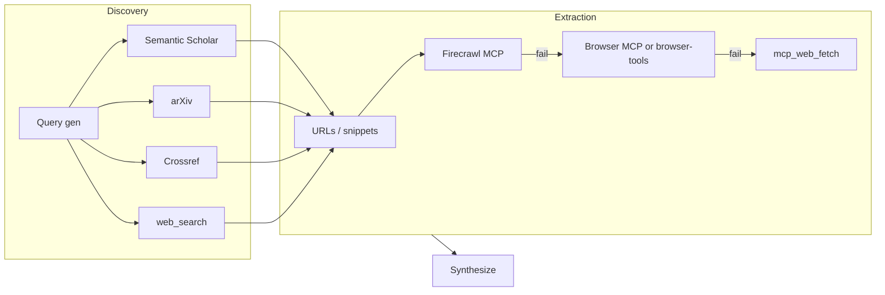

# Researcher Enhancement Plan (Free Stack, No BrowserAct)

## Goal

Replace the current researcher fetch stack (web_search + FreeCrawl MCP, fallback mcp_web_fetch) with a **free-only** stack:

- **Discovery:** Semantic Scholar API, arXiv API, Crossref REST API (+ keep web_search for general).
- **Extraction:** Firecrawl (self-hosted) primary; Browser MCP or browser-tools as fallback when Firecrawl fails or JS/PDF needed; mcp_web_fetch as last resort.

No BrowserAct. All new MCPs are either free APIs (with documented rate limits) or self-hosted (no API caps).

---

## Architecture (fetch flow)

- **Discovery** is chosen from `params.research_tools` and academic detection (research_auto_keywords or explicit academic param). Academic runs prefer Semantic Scholar, arXiv, Crossref when those tools are in the list.
- **Extraction** order: Firecrawl (self-hosted) first; on missing tool or error, Browser MCP (or browser-tools); then mcp_web_fetch. Never throw; keep snippet + "full page unavailable" if all fail.

---

## 1. Prerequisites (user / env)

User must install and configure in Cursor (`~/.cursor/mcp.json` or project MCP config):

| MCP server                       | Role                | Notes                                                                                                                                           |
| -------------------------------- | ------------------- | ----------------------------------------------------------------------------------------------------------------------------------------------- |
| **Semantic Scholar MCP**         | Discovery           | e.g. akapet00/semantic-scholar-mcp or similar; run locally (uvx/Python/Docker). Optional API key for higher rate limit (100 req/s vs 100/5min). |
| **arXiv MCP**                    | Discovery           | e.g. andybrandt/mcp-simple-arxiv or similar; run locally. Rate ~3 req/s.                                                                        |
| **Crossref**                     | Discovery           | Via polite pool (mailto in request); or use an "Academic Search MCP" that aggregates Semantic Scholar + Crossref.                               |
| **Firecrawl MCP** (self-hosted)  | Extraction          | firecrawl/firecrawl-mcp-server or equivalent; run Firecrawl locally so no hosted credit limit.                                                  |
| **Browser MCP or browser-tools** | Extraction fallback | One of: browsermcp.io repo or AgentDeskAI/browser-tools-mcp; run locally. Pick one to avoid maintaining two browser stacks.                     |

Document in [3-Resources/Second-Brain/MCP-Tools.md](3-Resources/Second-Brain/MCP-Tools.md) under "Research agent": required/supported MCPs, tool names per server, and link to a **rate limits** reference.

Add a **rate limits** section (in Parameters.md or a new note e.g. `3-Resources/Second-Brain/Research-Stack-Rate-Limits.md`) with the table: Semantic Scholar (100/5min no key, 100/s with key), arXiv (~3 req/s, 1000 results/query), Crossref (polite: 10 req/s single DOI, 3 req/s list), Firecrawl self-hosted (none), Browser MCP (none), mcp_web_fetch (not documented). Skill and agent do not enforce numbers; they only "respect research_result_limit and avoid burst"; the doc is for operator awareness.

---

## 2. Params and routing

### 2.1 `research_tools` extension

- **Current:** `["web", "freecrawl"]` default; normalize `browse` → `freecrawl`, `x` → academic.
- **New allowed values:** `web`, `semantic-scholar`, `arxiv`, `crossref`, `firecrawl`, `browser`.
- **Normalization (backward compatible):**
  - `freecrawl` or `browse` → treat as `firecrawl` (migrate to Firecrawl MCP; if Firecrawl unavailable, fall back to mcp_web_fetch and record in research_tools_used).
  - `x` → academic (use scholarly discovery when tools include semantic-scholar/arxiv/crossref); no separate tool key.
  - Unknown keys ignored.
- **Default:** Keep default `["web", "firecrawl"]` so general runs stay unchanged. When **academic** is detected (phase/topic has research_auto_keywords, or param e.g. `academic: true`), the skill **prefers** discovery tools that are both in `research_tools` and scholarly: e.g. if `semantic-scholar` or `arxiv` or `crossref` is in the list, use those for discovery for that run (in addition to or instead of web_search per logic below).

### 2.2 Discovery routing (skill Step 2)

- If `semantic-scholar` in research_tools **and** (academic run or queries suit papers): call Semantic Scholar MCP (e.g. search_paper). Cap calls to stay within rate limits (e.g. total discovery calls 3–5; if mixing sources, limit per source).
- If `arxiv` in research_tools and academic/preprint topic: call arXiv MCP. Same cap.
- If `crossref` in research_tools and DOI/citation need: call Crossref (or aggregator). Same cap.
- If `web` in research_tools or no scholarly tools / non-academic: use **web_search** as today. Total discovery calls across all sources: respect existing **research_result_limit** (default 3–5, up to 5–7 when util-driven) and keep total fetch calls in the 3–5 range where possible.
- **Academic run:** When academic and any of semantic-scholar, arxiv, crossref are in research_tools, use those first; optionally still add web_search for 1–2 broad queries if desired. When academic and only `web` is in research_tools, keep current behavior: web_search with site:arxiv.org / site:pubmed etc.

### 2.3 Extraction routing (skill Step 2)

- For each URL (or result that has a URL) from discovery:
  1. If `firecrawl` in research_tools: call Firecrawl MCP (self-hosted) scrape for that URL.
  2. On Firecrawl missing or error: if `browser` in research_tools, call Browser MCP or browser-tools for that URL.
  3. On browser missing or error: use **mcp_web_fetch** for that URL.
  4. If all fail: keep URL + snippet, note "full page unavailable" in synthesis.

Do not use BrowserAct. Do not reference FreeCrawl in the new flow; treat freecrawl/browse as firecrawl as above.

---

## 3. Skill changes: research-agent-run

**File:** [.cursor/skills/research-agent-run/SKILL.md](.cursor/skills/research-agent-run/SKILL.md)

- **Inputs:** Update **params.research_tools** description: default `["web", "firecrawl"]`; allowed values `web`, `semantic-scholar`, `arxiv`, `crossref`, `firecrawl`, `browser`. Normalize `freecrawl`/`browse` → `firecrawl`, `x` → academic; ignore unknown. Remove references to FreeCrawl as the default scrape tool.
- **Fetch stack (external):** Replace the "Fetch stack" section with:
  - **Discovery:** web_search (Cursor); Semantic Scholar MCP (when `semantic-scholar` in research_tools; academic or paper-suited queries); arXiv MCP (when `arxiv` in research_tools); Crossref or aggregator (when `crossref` in research_tools). Limit total discovery calls (e.g. 3–5); respect rate limits per Research-Stack-Rate-Limits (or Parameters).
  - **Extraction:** Firecrawl MCP (self-hosted) when `firecrawl` in research_tools; on missing/error → Browser MCP or browser-tools when `browser` in research_tools; on missing/error → mcp_web_fetch. If all fail for a URL, keep snippet and note "full page unavailable".
  - **Academic:** When run is academic, prefer Semantic Scholar / arXiv / Crossref when in research_tools; else keep web_search with site:arxiv.org etc. No BrowserAct.
- **Step 2 (Fetch):** Rewrite to: (1) run discovery using research_tools + academic routing above; (2) for each chosen URL, run extraction chain Firecrawl → Browser MCP → mcp_web_fetch; (3) respect research_result_limit and total fetch call cap; (4) never throw; produce at least search-only synthesis when discovery returned results.
- **Step 5 (Write) – research_tools_used:** Extend to include: `semantic_scholar`, `arxiv`, `crossref`, `web_search`, `firecrawl`, `browser_mcp` (or `browser_tools`), `mcp_web_fetch`. Record which discovery and extraction tools were actually used (e.g. `["semantic_scholar", "firecrawl"]` or `["web_search", "firecrawl", "firecrawl_fallback_mcp_web_fetch"]`).
- **MCP tools (skill summary):** List Semantic Scholar MCP, arXiv MCP, Crossref (or academic-search), Firecrawl MCP, Browser MCP or browser-tools, web_search, mcp_web_fetch. Remove FreeCrawl.
- **Reference:** Add link to Research-Stack-Rate-Limits (or Parameters § rate limits) and MCP-Tools.md § Research agent.

---

## 4. Documentation updates

- **[3-Resources/Second-Brain/MCP-Tools.md](3-Resources/Second-Brain/MCP-Tools.md)**  
In "Research agent (external fetch)": Replace FreeCrawl with Firecrawl (self-hosted) and Browser MCP/browser-tools; add Semantic Scholar, arXiv, Crossref as discovery; state fallback order Firecrawl → Browser MCP → mcp_web_fetch; remove BrowserAct. Add one-line note that setup requires these MCPs in Cursor config and point to rate limits doc.
- **[3-Resources/Second-Brain/Parameters.md](3-Resources/Second-Brain/Parameters.md)**  
Update **research_tools**: default `["web", "firecrawl"]`; allowed values and normalization (freecrawl/browse → firecrawl, x → academic). Add optional subsection or link: **Research stack rate limits** (Semantic Scholar, arXiv, Crossref, Firecrawl self-hosted, Browser MCP) — or add a short reference to a dedicated rate-limits note.
- **[3-Resources/Second-Brain/Queue-Sources.md](3-Resources/Second-Brain/Queue-Sources.md)**  
Under Research (pre-deepen): change research_tools description to "default [web, firecrawl]; discovery: web_search, Semantic Scholar, arXiv, Crossref per research_tools; extraction: Firecrawl MCP then Browser MCP or mcp_web_fetch fallback; no BrowserAct."
- **[3-Resources/Second-Brain/Vault-Layout.md](3-Resources/Second-Brain/Vault-Layout.md)**  
In Ingest/Agent-Research row: update **research_tools_used** to include semantic_scholar, arxiv, crossref, firecrawl, browser_mcp, mcp_web_fetch; legacy values web, browse, freecrawl remain valid for reads.
- **[3-Resources/Second-Brain/Logs.md](3-Resources/Second-Brain/Logs.md)**  
If Research error entry or Ingest-Log research notes mention tool names, allow new tool names (semantic_scholar, arxiv, crossref, firecrawl, browser_mcp) alongside existing.
- **New (optional):** Create **3-Resources/Second-Brain/Research-Stack-Rate-Limits.md** with the rate limits table (Semantic Scholar, arXiv, Crossref, Firecrawl self-hosted, Browser MCP, mcp_web_fetch) and one-line guidance: skill respects research_result_limit and avoids burst; operators use this table for capacity planning.

---

## 5. Backward compatibility

- Existing queue entries with `research_tools: ["web", "freecrawl"]` or `["web", "browse"]`: normalize to `firecrawl`; run with Firecrawl MCP when available; when Firecrawl MCP is not configured, fall back to mcp_web_fetch only and record e.g. `research_tools_used: ["web_search", "mcp_web_fetch"]` so behavior matches "no scrape tool" case.
- Entries with only `["web"]`: no extraction tool; use only discovery results (snippets) and optional mcp_web_fetch for top N URLs if you want to keep current behavior, or document that firecrawl/browser are recommended for full-page content.
- No changes to ResearchSubagent rule flow (agents/research.mdc); it still calls research-agent-run with params; only the skill’s fetch implementation and params semantics change.

---

## 6. Sync and backbone

- **[.cursor/sync/skills/research-agent-run.md](.cursor/sync/skills/research-agent-run.md):** Update to match skill (fetch stack, research_tools, research_tools_used).
- **Backbone-docs-sync:** After editing skill and Second-Brain docs, update sync copies per always/backbone-docs-sync (e.g. .cursor/sync/skills/, .cursor/sync/rules/ if any research rule text lists tools).

---

## 7. Implementation order

1. Add rate limits doc (or Parameters subsection) and MCP-Tools.md Research agent section update (prerequisite and tool list).
2. Update research-agent-run skill: inputs, fetch stack, Step 2, Step 5 research_tools_used, MCP tools list, references.
3. Update Parameters, Queue-Sources, Vault-Layout, Logs as above.
4. Update .cursor/sync/skills/research-agent-run.md and any backbone sync.
5. Manual test: run RESEARCH_AGENT with research_tools `["web", "firecrawl"]` and optionally `["semantic-scholar", "arxiv", "firecrawl"]` for an academic phase; confirm discovery and extraction use the new stack and research_tools_used is recorded correctly.

---

## Out of scope (no BrowserAct)

- No BrowserAct integration, no BrowserAct credits or config.
- GPT Researcher MCP not part of this plan (synthesis remains in research-agent-run).
- No code changes to Queue subagent or prompt crafter UI (only param semantics and docs; crafter can keep offering research_tools as today, with new options if desired in a follow-up).

