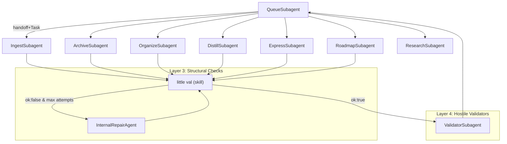

## Subagent prompt refresh plan

### 1. Establish current invariants and target architecture

- **Read core specs**: Re-skim `3-Resources/Second-Brain/Subagent-Safety-Contract.md`, `3-Resources/Second-Brain/Queue-Sources.md`, `3-Resources/Second-Brain/Cursor-Skill-Pipelines-Reference.md`, and `3-Resources/Second-Brain/Parameters.md` to extract the up-to-date contracts for:
  - Hand-off shape (what every subagent receives and must return).
  - Layered safety (backup/snapshot, confidence bands, little val cycles, Internal Repair Agent, hostile Validator, queue-level hostile pass).
- **Lock in little-val & validator roles**: From `[...]/skills/little-val-structural/SKILL.md` and `agents/internal-repair-agent.md`, define a concise reference paragraph describing:
  - When and how each pipeline subagent must call little val.
  - When IRA is allowed and what it returns.
  - How nested `ValidatorSubagent` calls fit into the layering (per-run validator vs. queue-level ROADMAP_HANDOFF_VALIDATE), including the “no Success unless last little val is ok:true” rule.
- **Draft a shared hand-off template**: In prose (for use inside each agent prompt) specify the canonical fields every pipeline subagent expects in its hand-off block (mode, params, project_id, queue_entry_id, parent_run_id, artifact paths), so we can refer to that instead of re-describing it slightly differently per agent.

### 2. Audit existing subagent prompts for drift

- **Queue orchestrator**: Check `agents/queue.md` against `rules/agents/queue.mdc` to ensure it:
  - Clearly states that it only orchestrates via `Task` (no same-run fallback), never reads/writes pipeline internals, and never calls pipeline subagents as nested agents.
  - Mentions that pipeline subagents already handle little val, IRA, and nested validator; queue only does the post–little-val hostile pass (ROADMAP_HANDOFF_VALIDATE) when requested.
- **Ingest/Archive/Organize/Distill/Express**: For each of `agents/ingest.md`, `agents/archive.md`, `agents/organize.md`, `agents/distill.md`, `agents/express.md`:
  - Compare the embedded pipeline steps to the canonical flow in the corresponding `rules/agents/*.mdc` file.
  - Verify that the prompt explicitly describes:
    - Where little val is called and the Success gating rule.
    - When IRA may be called and that it is advisory-only.
    - When and how `ValidatorSubagent` is invoked (validation_type + params) and what to do with high-severity verdicts.
  - Note any mismatches (e.g. missing little-val section, outdated validator types, no mention of IRA, or wrong confidence bands) into a short audit list.
- **Roadmap & Research**: For `agents/roadmap.md` and `agents/research.md`:
  - Check that roadmap describes both ROADMAP MODE and RESUME-ROADMAP, with per-run little val + nested roadmap_handoff_auto validator as in the rule file.
  - Ensure research describes its own nested validator (`research_synthesis`), and explicitly mentions that it does not run little val but still returns a validator_context object for queuing a hostile pass.
- **Validator & Internal Repair Agent**: For `agents/validator.md` and `agents/internal-repair-agent.md`:
  - Confirm that validator is positioned as the layer-4 hostile reviewer, read-only, with no ability to queue or orchestrate.
  - Confirm that IRA is described as a structural repair planner invoked only after repeated little-val failures, with strict limits on who may call it and how many times per run.

### 3. Design a shared prompt skeleton for all pipeline subagents

- **Top-level framing**: For ingest/archive/organize/distill/express/roadmap, standardize the opening section as:
  - “You are the X subagent; you execute the Y pipeline only when invoked via the Queue subagent using a Task hand-off. You never read or write queue files or Watcher-Result.”
- **Safety paragraph**: Replace ad-hoc safety wording with a shared paragraph that:
  - Points to the Subagent-Safety-Contract and always rules.
  - States the backup + per-change snapshot + confidence band invariants.
  - States that Success is only allowed when the final little val verdict is ok:true.
- **little val + IRA block**: Include a consistent section:
  - Describing one per-run little-val cycle; up to three internal attempts; and the condition for invoking IRA (little val still ok:false after its attempts).
  - Explicitly saying that IRA may be called up to three times per run, returns repair plans only, and never changes the Success decision.
- **Nested validator block**: For each pipeline, define:
  - The validation_type (ingest_classification, archive_candidate, organize_path, distill_readability, express_summary, roadmap_handoff_auto, research_synthesis).
  - Exact params to send and how to interpret severity/recommended_action.
  - The requirement to return a `validator_context` mirror of those params in the pipeline’s structured return.
- **Return contract**: Ensure each prompt ends with the same structured return expectations:
  - Short human summary.
  - `little-val` line + `little_val_ok` flag (or documented exception like research).
  - `validator_context` when applicable.
  - Status constrained by little val and validator outcomes.

### 4. Update each subagent prompt to match the skeleton

- **Ingest subagent** (`agents/ingest.md`):
  - Tighten the Flow section to match `rules/agents/ingest.mdc`, ensuring Phase 1/Phase 2, Decision Wrapper behavior, and the little val + ingest_classification validator sequence are crystal clear.
  - Insert the shared little val/IRA block with the ingest-specific artifact paths described more concisely.
- **Archive subagent** (`agents/archive.md`):
  - Align the step list with the non-legacy archive rule, including resurface, summary-preserve, ghost-folder sweep, and archive_candidate validation.
  - Emphasize that high-severity validator verdicts must mark the run as #review-needed or failure, even if the physical move succeeded.
- **Organize subagent** (`agents/organize.md`):
  - Sync the description of mid-band loops, Decision Wrappers, name-enhance, and move semantics with the rule file.
  - Clarify how organize_path validation works and what to put in validator_context.
- **Distill subagent** (`agents/distill.md`):
  - Ensure the pipeline description includes all the current distill skills and that distill_readability validator usage lines up with the rule file (including word-count gating).
  - Make explicit that low/mid bands create wrappers instead of rewriting content, and that destructive distills only happen after snapshot + high confidence + little val ok:true.
- **Express subagent** (`agents/express.md`):
  - Bring the outline/related/CTA sequence and express_summary validator usage in line with `rules/agents/express.mdc`.
  - Clarify how express_view and SCOPING MODE are handled and where version snapshots are mandatory.
- **Roadmap subagent** (`agents/roadmap.md`):
  - Refine the sections for ROADMAP MODE and RESUME-ROADMAP so they reference the shared hand-off template, and make the context-tracking expectations and roadmap_handoff_auto validator integration unambiguous.
- **Research subagent** (`agents/research.md`):
  - Update the description to clearly state its role relative to roadmap (queue-mode only, no calling from Roadmap) and to spell out the research_synthesis validator call and validator_context shape.
- **Validator & Internal Repair Agent** (`agents/validator.md`, `agents/internal-repair-agent.md`):
  - Adjust wording to acknowledge that pipeline agents already perform per-run validation; ROADMAP_HANDOFF_VALIDATE is layered on top as a manual hostile read.
  - Make sure IRA’s interface section matches the expectations baked into the pipeline prompts.

### 5. Ensure consistency with rules and sync copies

- **Cross-check rules vs agents**: For each agent file updated in step 4, quickly diff it conceptually against the corresponding `rules/agents/*.mdc` file to confirm:
  - Same pipeline phases and confidence bands.
  - Same little-val/IRA/validator sequencing and limits.
  - No agent-level instruction that contradicts always rules (e.g. queue writes from inside a pipeline subagent).
- **Update sync docs**: For any `rules/agents/*.mdc` changes driven by prompt clarifications (if needed later), mirror them into `.cursor/sync/rules/agents/*.md` to satisfy the backbone-docs-sync contract.

### 6. Add a single overview reference

- **Create or update a short overview note** (if not already present) under `3-Resources/Second-Brain/Docs/` that:
  - Summarizes the layered architecture (queue → pipeline subagents → little val → IRA → validator → queue-hostile pass) in 1–2 pages.
  - Links to each agent spec and the little-val / IRA / validator skills.
  - Gives a quick checklist for adding any new subagent so it automatically plugs into this structure.

### 7. Low-risk validation pass

- **Dry-run reasoning review**: Without executing pipelines, mentally walk through 1–2 representative queue entries (e.g. INGEST_MODE then RESUME-ROADMAP) using the new prompts to ensure:
  - Hand-offs are clear and contain everything a subagent needs.
  - The transitions into little val, IRA, and ValidatorSubagent are obvious and unambiguous.
- **Note follow-ups**: Capture any remaining ambiguities as TODOs in your own meta-notes for a later pass, but keep this refresh focused on structural correctness and safety clarity rather than adding new behaviors.

