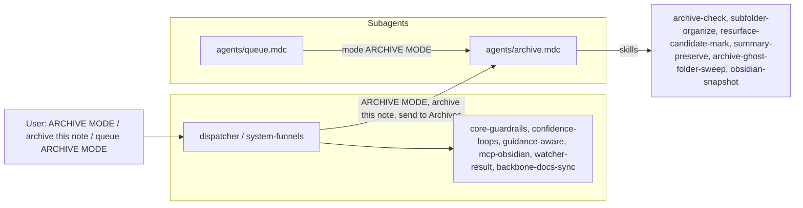

# ArchiveSubagent Refactor Plan

This plan follows the pattern in [queue-dispatcher-subagent-refactor](.cursor/plans/Rule-Refactor/queue-dispatcher-subagent-refactor_54b07695.plan.md), [queueprocessorsubagent_refactor](.cursor/plans/Rule-Refactor/queueprocessorsubagent_refactor_793d8e05.plan.md), and [distillsubagent_refactor](.cursor/plans/Rule-Refactor/distillsubagent_refactor_e38df484.plan.md), and aligns with the subagent architecture from the Grok output (dispatcher + dedicated subagents under `.cursor/rules/agents/`).

---

## 1. Goals

- **Isolate archive logic** into a single **ArchiveSubagent** so only that context + shared core guardrails are loaded when processing ARCHIVE MODE, "archive this note", "send to Archives", or queue entries with `mode: "ARCHIVE MODE"`.
- **Preserve behavior**: No change to autonomous-archive pipeline order, confidence bands (high/mid/low, archive_conf, archive-refine loop), Decision Wrapper creation (Refinements, Low-Confidence), snapshot/backup gates, ghost-folder sweep after moves, exclusions, or logging (Archive-Log.md, Backup-Log.md).
- **Introduce a single subagent context rule** `agents/archive.mdc` that encapsulates [auto-archive.mdc](.cursor/rules/context/auto-archive.mdc); the dispatcher routes ARCHIVE MODE and related triggers to this subagent.
- **Forward-compatible**: When the dispatcher and QueueProcessorSubagent exist, ARCHIVE MODE from the queue will be dispatched to ArchiveSubagent. There is no archive-specific "apply-from-wrapper" skill (unlike distill/express); archive mid-band/low wrappers are decision touchpoints; re-running archive after user approval is done by re-queueing ARCHIVE MODE with the note in scope.

---

## 2. Current state (source of truth)

- **Main pipeline rule**: [.cursor/rules/context/auto-archive.mdc](.cursor/rules/context/auto-archive.mdc) — Triggers: ARCHIVE MODE – safe batch autopilot, archive this note, send to Archives, move completed to 4-Archives; pipeline: backup → classify_para → archive-check → subfolder-organize → resurface-candidate-mark → summary-preserve → move_note (dry_run then commit) → post-move frontmatter (para-type, status: archived) → log_action → archive-ghost-folder-sweep (when moved_notes_list non-empty); confidence bands (archive_conf, mid-band archive-refine loop); Decision Wrappers (Refinements, Low-Confidence); snapshot triggers (after archive-check ≥85%, before subfolder-organize/summary-preserve/move); exclusions (4-Archives, Backups, Logs, Hub, watcher-protected).
- **Queue dispatch**: [.cursor/rules/context/auto-eat-queue.mdc](.cursor/rules/context/auto-eat-queue.mdc) — ARCHIVE MODE at position 15 in canonical order → autonomous-archive (auto-archive).
- **Pipeline reference**: [3-Resources/Second-Brain/Cursor-Skill-Pipelines-Reference.md](3-Resources/Second-Brain/Cursor-Skill-Pipelines-Reference.md) — autonomous-archive order, snapshot triggers (after archive-check ≥85%, before move; once per sweep batch), skill table (archive-check, subfolder-organize, resurface-candidate-mark, summary-preserve, archive-ghost-folder-sweep).
- **Funnel**: [.cursor/rules/always/system-funnels.mdc](.cursor/rules/always/system-funnels.mdc) — ARCHIVE MODE – safe batch autopilot, archive this note, send to Archives → auto-archive.

All behavior to preserve lives in auto-archive.mdc and the pipeline reference; the refactor moves that behavior into the ArchiveSubagent and leaves the dispatcher routing ARCHIVE MODE (and related phrases/queue mode) to it.

---

## 3. Target architecture

- **Dispatcher (always-on)**  
When trigger is ARCHIVE MODE, "archive this note", "send to Archives", "move completed to 4-Archives", or queue entry `mode: "ARCHIVE MODE"` → route to **ArchiveSubagent** (`agents/archive.mdc`). No archive logic in the dispatcher; only routing and shared core.
- **ArchiveSubagent (context)**  
New file: `.cursor/rules/agents/archive.mdc`.  
Encapsulates:
  1. **Trigger / entry**: Run when (a) user says ARCHIVE MODE, archive this note, send to Archives, move completed to 4-Archives, or (b) queue processor dispatches ARCHIVE MODE (with optional scope/source_file).
  2. **Flow**: Backup → classify_para → archive-check → (optional mid-band archive-refine loop) → per-change snapshot (when archive_conf ≥85%) → subfolder-organize → resurface-candidate-mark → summary-preserve → obsidian_ensure_structure → obsidian_move_note (dry_run then commit) → post-move frontmatter (para-type, status: archived) → log_action → archive-ghost-folder-sweep when moved_notes_list non-empty; confidence bands and Decision Wrapper creation (Refinements, Low-Confidence) per confidence-loops; batch snapshot once per sweep.
  3. **Preserve verbatim**: Pipeline order from Cursor-Skill-Pipelines-Reference § autonomous-archive; snapshot triggers (after archive-check ≥85%, before subfolder-organize/summary-preserve/move; batch once per sweep); loop_type "archive-refine"; Error Handling Protocol; Archive-Log.md and Backup-Log.md; ghost-folder sweep contract.
- **Shared core (unchanged)**  
core-guardrails, confidence-loops, guidance-aware, mcp-obsidian-integration, watcher-result-append, backbone-docs-sync. ArchiveSubagent depends on these; no duplication of safety logic.

---

## 4. Concrete refactor steps

### 4.1 Create ArchiveSubagent file

- Ensure `.cursor/rules/agents/` exists (from QueueProcessorSubagent or earlier refactor).
- Create `**.cursor/rules/agents/archive.mdc`** with:
  - **Header**: Title "ArchiveSubagent"; short description: responsible for autonomous-archive (move completed/inactive notes to 4-Archives/ with summary preservation and resurface markers); handles ARCHIVE MODE and related phrases; depends on shared always rules for safety.
  - **Globs**: Loaded when dispatcher routes ARCHIVE MODE (and variants) or when queue entry is ARCHIVE MODE; scope: `1-Projects/`**, `2-Areas/`**, `3-Resources/**` (exclude 4-Archives, Backups, Logs, Hub, watcher-protected) per current auto-archive exclusions.
  - **Content source**: Merge the full behavior of auto-archive.mdc (pipeline order, triggers, confidence bands, snapshot triggers, Decision Wrappers, ghost-folder sweep, logging, exclusions, Error Handling Protocol).
  - **Preserve verbatim**: Pipeline order from Cursor-Skill-Pipelines-Reference § autonomous-archive; snapshot triggers; loop_type "archive-refine"; post-move para-type and status: archived; archive-ghost-folder-sweep with moved_notes_list; CHECK_WRAPPERS and Watcher-Result contract when run via queue.
  - **Safety section**: State that ArchiveSubagent obeys Error Handling Protocol, confidence bands, and Watcher exclusions via shared always rules; no new safety logic.

### 4.2 Skills and MCP usage

- **Skills used by ArchiveSubagent** (unchanged; reference only): archive-check, subfolder-organize, resurface-candidate-mark, summary-preserve, archive-ghost-folder-sweep, obsidian-snapshot. These remain under `.cursor/skills/` (optional later: group under `skills/archive/` for clarity; not required for this refactor).
- **No archive-apply-from-wrapper**: Archive uses Decision Wrappers for mid-band and low-confidence; when the user approves a path/option, they re-queue ARCHIVE MODE or run archive again with the note in scope. No dedicated "archive-apply-from-wrapper" skill; Step 0 apply-from-wrapper is for ingest/distill/express only.
- **MCP**: create_backup, ensure_structure, move_note, manage_frontmatter, remove_empty_folder (via archive-ghost-folder-sweep), log_action — all as today; ArchiveSubagent invokes them per the same order and gates as auto-archive.

### 4.3 Wire dispatcher routing

- **ARCHIVE MODE** / **archive this note** / **send to Archives** / **move completed to 4-Archives** (phrase or queue `mode: "ARCHIVE MODE"`) → ArchiveSubagent (`agents/archive.mdc`).
- Queue processor: when mode is ARCHIVE MODE, dispatch to ArchiveSubagent (same as other pipeline modes).
- Update system-funnels (or dispatcher) so all archive-related triggers map to "ArchiveSubagent (agents/archive.mdc)".

### 4.4 Retire or slim context rule (after validation)

- **auto-archive.mdc**: Remove or slim to a one-line redirect: "On ARCHIVE MODE / archive this note / send to Archives, see ArchiveSubagent (agents/archive.mdc)." Do not delete before manual testing.

### 4.5 Documentation and sync

- **Queue-Sources.md** (and Queue-Alias-Table if present): Note that ARCHIVE MODE is handled by ArchiveSubagent; params/scope unchanged.
- **Cursor-Skill-Pipelines-Reference.md**: Add a short "ArchiveSubagent" subsection: ARCHIVE MODE and related phrases are handled by `agents/archive.mdc`; pipeline order and snapshot/confidence rules unchanged.
- **Pipelines.md** / **README.md** (if present): Align trigger table with "ArchiveSubagent (agents/archive.mdc)".
- **.cursor/sync**: Add `.cursor/sync/rules/agents/archive.md` mirroring `agents/archive.mdc`. Changelog entry in `.cursor/sync/changelog.md` for ArchiveSubagent.

### 4.6 Backbone and Rules docs

- **Rules.md** (or equivalent in 3-Resources/Second-Brain): Update trigger table so ARCHIVE MODE, archive this note, send to Archives point to "ArchiveSubagent (agents/archive.mdc)".

---

## 5. Validation and rollback

- **Manual tests**:
  - Run **ARCHIVE MODE** (or "archive this note") on a single note: confirm pipeline order (backup → classify → archive-check → snapshot → subfolder-organize → resurface-candidate-mark → summary-preserve → ensure_structure → move dry_run then commit → post-move frontmatter → log_action), Archive-Log.md and Backup-Log.md entries, and ghost-folder sweep when at least one note was moved.
  - Run **EAT-QUEUE** with a queue containing ARCHIVE MODE: confirm same behavior, Watcher-Result line, and log format.
  - Mid-band and low-confidence: confirm Decision Wrappers created under Refinements and Low-Confidence, and that no move occurs until confidence ≥85% or user re-runs after approval.
- **Rollback**: Point dispatcher/funnels back to auto-archive.mdc until `agents/archive.mdc` is validated.

---

## 6. Out of scope (later work)

- Moving skills into `.cursor/skills/archive/` (optional structural cleanup).
- Changing Decision Wrapper template or A–G semantics for archive.
- Adding an "archive-apply-from-wrapper" skill (not in current design; archive re-run after wrapper approval is sufficient).
- ARCHIVE-GHOST-SWEEP as a standalone queue mode: can be added later to Queue-Sources; this plan only moves the pipeline into ArchiveSubagent.

---

## 7. Files to add or touch

| Action      | Path                                                                                                 |
| ----------- | ---------------------------------------------------------------------------------------------------- |
| Create      | `.cursor/rules/agents/archive.mdc` (ArchiveSubagent)                                                 |
| Update      | `.cursor/rules/always/dispatcher.mdc` or `system-funnels.mdc` (route ARCHIVE MODE → ArchiveSubagent) |
| Slim/remove | `.cursor/rules/context/auto-archive.mdc` (after validation: redirect or remove)                      |
| Update      | `3-Resources/Second-Brain/Queue-Sources.md` (ARCHIVE MODE → ArchiveSubagent)                         |
| Update      | `3-Resources/Second-Brain/Cursor-Skill-Pipelines-Reference.md` (ArchiveSubagent subsection)          |
| Update      | `3-Resources/Second-Brain/Pipelines.md` or Rules.md (trigger table)                                  |
| Add         | `.cursor/sync/rules/agents/archive.md`                                                               |
| Append      | `.cursor/sync/changelog.md`                                                                          |

Do not delete `auto-archive.mdc` until validation is complete.