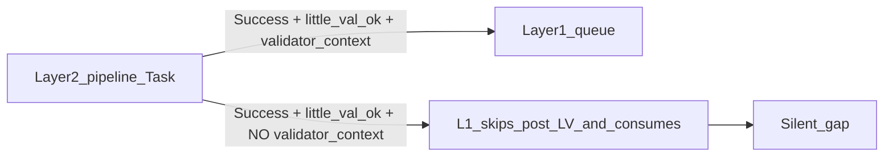

# Close policy + telemetry + failure-mode gaps (Layer 2 helpers)

## Rollout model

| Phase                              | Scope                                                                                                                                                                       | Deliverables                                                                                                                                                                                                            |
| ---------------------------------- | --------------------------------------------------------------------------------------------------------------------------------------------------------------------------- | ----------------------------------------------------------------------------------------------------------------------------------------------------------------------------------------------------------------------- |
| **Phase 1 — Doc updates**          | Specifications and backbone docs only; **no** behavioral change in `queue.mdc` or agents yet (or flags documented but **off** with explicit "Phase 2 enables enforcement"). | Queue continuation enum extension; ledger normative scope text; contract + Queue-Sources + Layers-Reference alignment; Config/Parameters **documentation** of new keys; optional Rules/Pipelines pointer.               |
| **Phase 2 — Behavior integration** | Executable rules and prompts in the repo.                                                                                                                                   | `queue.mdc` implements soft vs strict branches, continuation log merge, Watcher/Errors paths; agents emit mandatory ledger + checklist; Config values that turn strict gates on when ready; `.cursor/sync` + changelog. |

Phase 1 should be mergeable without changing runtime behavior so operators can **read** the target state first. Phase 2 is the behavior flip.

---

## Root cause (already in repo)

`[queue.mdc](.cursor/rules/agents/queue.mdc)` **explicitly allows** a successful pipeline return to **skip** the post–little-val Validator when `validator_context` is absent:

> *"If little_val_ok is not true or validator_context is missing or validation_type is not supported, **skip the validator call and add this entry's id to processed_success_ids**"*

That means Layer 1 **consumes** the queue line even when Layer 2 never supplied the hand-off shape the contract assumes—so missing nested helper work is **rewarded**, not penalized. Roadmap-only **[Soft gate v1](.cursor/rules/agents/queue.mdc)** (`nested_ledger_missing_or_unparseable`) logs to Errors.md but **still consumes** the entry; other pipelines have **no** equivalent ledger requirement.

---

## Target behavior (unchanged intent)

1. **Policy:** For modes where the contract requires nested Validator (and IRA cycle when applicable), **do not** treat the entry as successfully processed when attestation is missing—unless a **documented exempt** subcase applies (e.g. research with zero synthesis notes → explicit `not_applicable` in ledger, not omitted fields).
2. **Telemetry:** **Normative** `[nested_subagent_ledger](3-Resources/Second-Brain/Docs/Nested-Subagent-Ledger-Spec.md)` for **all** queue-dispatched pipelines that use nested helpers (`ingest`, `archive`, `organize`, `distill`, `express`, `research`, `roadmap`).
3. **Failure modes:** Structured outcomes: `missing_validator_context`, `nested_ledger_missing_or_unparseable` (hard or soft per config), `nested_task_error` with consumption = failure when strict.

---

## Queue continuation enhancement (small, agreed)

**Problem:** When strict nested attestation fails, operators should not confuse that with a normal Roadmap "no follow-up" completion for empty-queue bootstrap.

**Change ([Queue-Continuation-Spec.md](3-Resources/Second-Brain/Docs/Queue-Continuation-Spec.md)):**

- Add `**nested_attestation_failure`** to **Suppress reason enum** with meaning: Layer 1 refused or downgraded consumption because `validator_context` and/or mandatory `nested_subagent_ledger` failed strict checks (or equivalent `queue_failed` path for this entry).
- **Invariant:** When `suppress_reason === nested_attestation_failure`, `**continuation_eligible` MUST be `false`** (same class as `pipeline_failure` for bootstrap—do not auto-continue).
- Document that Layer 1 **A.5e** (when `continuation_log_enabled`) **merges** this into the JSONL line: prefer `source: layer1_computed` or extend `source` enum with `layer1_nested_gate_failure` if you need to distinguish pipeline-emitted vs Layer-1-only records (choose one in Phase 1 spec text for simplicity).

**Phase 2:** [queue.mdc](.cursor/rules/agents/queue.mdc) **A.5e** — when dispositioning an entry that failed strict nested return gates, set `**suppress_reason: nested_attestation_failure`**, `**suppress_followup: true`**, `**continuation_eligible: false**`, and optional `**rationale_short**` citing `error_type` (e.g. `missing_validator_context`).

---

## Phase 1 — Doc updates (detailed checklist)

1. `**[Queue-Continuation-Spec.md](3-Resources/Second-Brain/Docs/Queue-Continuation-Spec.md)**` — enum + invariants + A.5e merge behavior (spec only).
2. `**[Nested-Subagent-Ledger-Spec.md](3-Resources/Second-Brain/Docs/Nested-Subagent-Ledger-Spec.md)**` — normative scope expansion; exempt rows; `pipeline` enum.
3. `**[Subagent-Safety-Contract.md](3-Resources/Second-Brain/Subagent-Safety-Contract.md)**` + `**[Queue-Sources.md](3-Resources/Second-Brain/Queue-Sources.md)**` + `**[Subagent-Layers-Reference.md](3-Resources/Second-Brain/Docs/Subagent-Layers-Reference.md)**` — post–little-val consumption rules reference `queue.strict_*`; host `Task` failure must not yield silent Success.
4. `**[Second-Brain-Config.md](3-Resources/Second-Brain-Config.md)**` + `**[Parameters.md](3-Resources/Second-Brain/Parameters.md)**` — document `queue.strict_nested_return_gates`, `queue.strict_nested_ledger_all_pipelines` (defaults **false** until Phase 2 flip; state "Phase 2 enforcement").
5. **Optional:** `**[Rules.md](3-Resources/Second-Brain/Rules.md)`** or `**[Pipelines.md](3-Resources/Second-Brain/Pipelines.md)`** — one cross-link to nested attestation + continuation enum.

---

## Phase 2 — Behavior integration (detailed checklist)

1. `[queue.mdc](.cursor/rules/agents/queue.mdc)` — implement A.5 branches (legacy soft log vs strict refuse `processed_success_ids`); A.5e continuation merge for `nested_attestation_failure`; A.6 non-roadmap ledger in trace; strict ledger gate when flag on.
2. **Layer 2** — `[.cursor/agents/*.md](.cursor/agents)` + `[.cursor/rules/agents/*.mdc](.cursor/rules/agents)` — mandatory `nested_subagent_ledger` + pre-return checklist (ingest, archive, organize, distill, express, research, roadmap).
3. **Config** — set operational defaults for strict flags when the vault is ready (document migration in Parameters).
4. `[.cursor/sync/rules/agents/queue.md](.cursor/sync/rules/agents/queue.md)` + `[.cursor/sync/changelog.md](.cursor/sync/changelog.md)`.

---

## Out of scope (explicit)

- Layer 2 calling **other pipelines** via `Task` (still forbidden).
- Changing Cursor host support for nested `Task`; the plan **surfaces** failure instead of pretending success.

---

## Verification (manual)

- **Phase 1:** Review-only—docs describe enum, gates, and flags; no EAT-QUEUE behavior change.
- **Phase 2:** With `strict_nested_return_gates: true`, omit `validator_context` → entry not consumed; Watcher failure; continuation line (if logging on) has `suppress_reason: nested_attestation_failure` and `continuation_eligible: false`.

