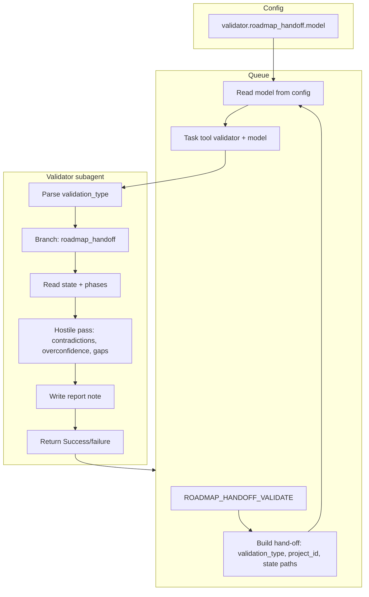

# Complete Validator Subagent Plan

## Goal

Build the **complete Validator subagent**: a dedicated hostile-review subagent that performs one or more **validation types**. Each type has a defined scope, inputs, output, and optional **fixed model** (e.g. Grok for high-stakes). The **first validation type** is **roadmap handoff**: a final pass when the roadmap is complete that compiles one handoff-readiness validation report. The subagent is designed so additional validation types (e.g. research synthesis, ingest classification) can be added later without re-architecting.

---

## Part A — Validator subagent (generic)

### A.1 Role and contract

- **Name**: Validator subagent (ValidatorSubagent).
- **Role**: Run a **hostile senior engineer** pass on pipeline or artifact output: flag contradictions, overconfidence, missing edges, weak sourcing; produce a structured validation report or verdict.
- **Invocation**: Only via queue (or direct trigger that enqueues). Never called by other subagents; the queue is the single caller.
- **Contract**: Same as other subagents per [Subagent-Safety-Contract](3-Resources/Second-Brain/Subagent-Safety-Contract.md): hand-off must include task, telemetry block, state files, return format. Return: one-paragraph summary, Success / failure / #review-needed, optional Run-Telemetry note.

### A.2 Validation types (concept)

A **validation type** defines:

- **Scope**: What is being validated (e.g. roadmap handoff, research synthesis draft, ingest classification batch).
- **Inputs**: What the validator reads (paths, state, artifact content).
- **Output**: What it produces (one report note, verdict only, or append to log).
- **Model**: Fixed model (e.g. Grok) for stability, or Auto for cost savings (from config).

The Validator subagent **receives** in the hand-off: `validation_type` (required) and type-specific params (e.g. `project_id` for roadmap_handoff). It **branches** on `validation_type` and runs the corresponding check; it does not implement pipeline logic (no deepen, no ingest), only read + critique + write report/verdict.

### A.3 Config: validation types and model selection

**File**: [3-Resources/Second-Brain/Second-Brain-Config.md](3-Resources/Second-Brain/Second-Brain-Config.md)

Add a **validator** block:

```yaml
validator:
  # validation_type → model (Cursor model id) or "auto"
  # Fixed model = stable hostile pass, no Auto discount for that call.
  roadmap_handoff:
    model: "grok-code"   # or exact Cursor id for Grok code
  # Future:
  # research_synthesis: { model: "grok-code" }
  # ingest_classification: { model: "auto" }
```

- **roadmap_handoff**: High-stakes; use fixed model (Grok code). Single check: final validation pass on roadmap → one handoff-readiness report.
- **Future types**: Add rows as needed; each can specify `model` (fixed) or `"auto"`. Document in Parameters which types are “high-stakes” (fixed model) vs liberal (Auto).

### A.4 Hand-off shape (validator-specific)

The queue builds a hand-off that includes:

- **Task**: One sentence, e.g. “Run roadmap handoff validation for project X and write the validation report.”
- **Telemetry block**: parent_run_id, queue_entry_id, project_id (or “-”), timestamp.
- **validation_type**: String, e.g. `roadmap_handoff`. Required so the validator knows which check to run.
- **Type-specific params**: For `roadmap_handoff`: `project_id` (required), optional `roadmap_dir`, `phase_range`.
- **Relevant state files**: List of 2–5 paths the validator must read (e.g. roadmap-state, workflow_state, phase notes, decisions-log).
- **Output path**: Where to write the report (or “append to X”). For roadmap_handoff: one new note under project Roadmap.
- **Critical invariants**: Read-only except writing the report; no edits to phase notes or roadmap-state; same safety rules (no shell moves, etc.).

The validator **does not** receive a pipeline to run; it receives a validation type and inputs, and it runs that one check.

### A.5 Validator agent rule (generic structure)

**New file**: [.cursor/rules/agents/validator.mdc](.cursor/rules/agents/validator.mdc)

- **Subagent**: ValidatorSubagent. Invoked when queue dispatches a validator mode (see Part B).
- **Depends on**: Same always rules (core-guardrails, confidence-loops, guidance-aware, mcp-obsidian-integration, watcher-result-append).
- **Entry**: Hand-off must be present when queue-dispatched; parse hand-off for `validation_type` and type-specific params.
- **Branch by validation_type**:
  - **roadmap_handoff**: Run the roadmap handoff validation check (Part C). Read state files from hand-off; produce one report; write to output path; return Success/failure/#review-needed.
  - **Unknown type**: Return failure, do not write; log to Errors.md.
- **Return**: Summary, explicit Success / failure / #review-needed, optional Run-Telemetry path. No chain_request; validator is terminal.
- **Legacy**: [.cursor/rules/legacy-agents/validator.mdc](.cursor/rules/legacy-agents/validator.mdc) mirrors this for same-run fallback.

---

## Part B — Queue integration (generic)

### B.1 Queue mode(s)

**Option (recommended)**: One mode per validation type for clarity and ordering:

- **ROADMAP_HANDOFF_VALIDATE**: Params: `project_id` (required). Dispatches to Validator subagent with `validation_type: "roadmap_handoff"` and model from config `validator.roadmap_handoff.model`.

**Alternative**: Single mode `VALIDATE` with `params.validation_type` (e.g. `roadmap_handoff`). Queue then looks up model from `validator[params.validation_type].model`. Same contract; one more param to validate.

**Files**: [.cursor/rules/agents/queue.mdc](.cursor/rules/agents/queue.mdc), [3-Resources/Second-Brain/Queue-Sources.md](3-Resources/Second-Brain/Queue-Sources.md)

- Add **ROADMAP_HANDOFF_VALIDATE** to canonical order (e.g. after HANDOFF-AUDIT at 11c).
- **Mode → subagent_type**: ROADMAP_HANDOFF_VALIDATE → **validator**.
- **Dispatch**: Build hand-off with validation_type, project_id, state file paths, output path. Read **model** from `validator.roadmap_handoff.model` in Config; call the **Task** subagent tool with subagent_type **validator**, prompt = hand-off, **model** = that value (so this run does not use Auto).
- On return: Watcher-Result, add id to processed_success_ids, Run-Telemetry for primary.

### B.2 Pipeline list and dispatcher

- **system-funnels / dispatcher**: Add **validator** to the list of pipeline/subagent types that can be invoked via the Task tool. Document that for ROADMAP_HANDOFF_VALIDATE the queue passes the model from config.
- **Subagent-Safety-Contract**: Note that the Validator subagent is invoked with an explicit **model** when the validation type is configured with a fixed model (e.g. roadmap_handoff).

---

## Part C — Roadmap handoff validation check (first type)

This is the **specific validation check** the Validator subagent runs when `validation_type === "roadmap_handoff"`.

### C.1 When it runs

- When the user (or automation) queues **ROADMAP_HANDOFF_VALIDATE** with a `project_id`. Typically run when the roadmap is complete or when the user wants a final handoff-readiness report (e.g. after HANDOFF-AUDIT or before handoff).

### C.2 Inputs (from hand-off)

- **project_id** (required).
- **State files**: roadmap-state.md, workflow_state.md, phase roadmap notes (1..current_phase), decisions-log.md. Paths resolved by queue from project_id (e.g. `1-Projects/<project_id>/Roadmap/`).

### C.3 Instructions (hostile pass)

- Persona: Hostile senior engineer. Read all provided state and phase notes.
- Flag: **Contradictions** (e.g. phase vs phase, or vs master goal), **overconfidence** (claims without evidence or pseudo-code), **missing edges** (unresolved forks, no acceptance criteria), **weak sourcing** (no trace to design or research).
- Assess **handoff readiness** per phase and overall (align with handoff_readiness / handoff_gaps from hand-off-audit if present; if missing, the validator still gives its own assessment).
- Produce **one** structured markdown report.

### C.4 Output

- **Single note**: e.g. `1-Projects/<project_id>/Roadmap/handoff-validation-report-YYYYMMDD-HHMM.md`.
- **Sections**: (1) Summary (overall handoff readiness, go/no-go), (2) Per-phase findings (readiness, gaps, contradictions, overconfidence, missing edges), (3) Cross-phase or structural issues.
- **No edits** to phase notes, roadmap-state, or workflow_state (read-only except creating the report). Create parent folder if needed (obsidian_ensure_structure); then write report content.

### C.5 Report path and logging

- **Report path**: Define in [Vault-Layout](3-Resources/Second-Brain/Vault-Layout.md) or Logs: `1-Projects/<project_id>/Roadmap/handoff-validation-report-<date>.md`. Date in filename allows multiple runs.
- **Optional**: One-line reference in a pipeline log (e.g. Roadmap-Log or Backup-Log) with report path and validation_type; not required for MVP.

---

## Part D — Docs, sync, and extensibility

### D.1 Documentation

- **Parameters.md**: Validator subsection: validation types, config keys, model selection (fixed vs Auto), report path template for roadmap_handoff.
- **Cursor-Skill-Pipelines-Reference / Skills.md**: Validator subagent: trigger (queue mode ROADMAP_HANDOFF_VALIDATE), validation type roadmap_handoff, output (report note), model from config.
- **Logs.md**: If validator writes to a log, add row; else report note is the record.

### D.2 Sync

- [.cursor/sync/rules/agents/validator.md](.cursor/sync/rules/agents/validator.md).
- [.cursor/sync/changelog.md](.cursor/sync/changelog.md): add entry for Validator subagent and ROADMAP_HANDOFF_VALIDATE.

### D.3 Adding a new validation type later

1. Add a row under `validator` in Config (e.g. `research_synthesis: { model: "grok-code" }` or `model: "auto"`).
2. Add a queue mode (e.g. RESEARCH_SYNTHESIS_VALIDATE) or extend VALIDATE with that validation_type.
3. In validator.mdc, add a branch for the new type: inputs, hostile pass instructions, output path/format.
4. Queue: build hand-off with that validation_type and type-specific params; pass model from config when present.

No change to the generic Validator contract or hand-off shape beyond adding a new branch and optional mode.

---

## Summary diagram




---

## Files to add or change


| Item                                        | Action                                                                                           |
| ------------------------------------------- | ------------------------------------------------------------------------------------------------ |
| Second-Brain-Config.md                      | Add `validator` block with `roadmap_handoff.model` (e.g. grok-code)                              |
| Parameters.md                               | Validator subsection: types, config, model selection, report path                                |
| queue.mdc                                   | New mode ROADMAP_HANDOFF_VALIDATE; dispatch to validator with model; mode→validator; A.4 order   |
| Queue-Sources.md                            | Document ROADMAP_HANDOFF_VALIDATE and params                                                     |
| .cursor/rules/agents/validator.mdc          | **Full** Validator subagent: contract, branch by validation_type, roadmap_handoff check (Part C) |
| .cursor/rules/legacy-agents/validator.mdc   | Same for fallback                                                                                |
| system-funnels.mdc / dispatcher.mdc         | Add validator to pipeline list; note model pass for validator                                    |
| Subagent-Safety-Contract                    | Note validator + explicit model when configured                                                  |
| Vault-Layout.md or Logs.md                  | Report path for roadmap_handoff                                                                  |
| Cursor-Skill-Pipelines-Reference, Skills.md | Validator subagent and roadmap_handoff check                                                     |
| .cursor/sync/*                              | Sync validator rule and changelog                                                                |


