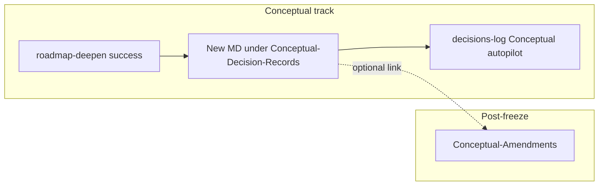

# Conceptual roadmap: reasoning, benefit analysis, and validation (atomized)

## Intent (aligned with your definitions)

- **Conceptual roadmap decision** = a pipeline-committed change such as a **deepen** (primary scope), and optionally **advance-phase**, **expand**, **recal** forks, or **track flip** / freeze-adjacent events—each gets **one companion file**, not edits to frozen phase bodies.
- **Validated** = the record must cite **why the direction is real** (practitioner patterns, docs, prior project notes, or **Ingest/Agent-Research/** synthesis from pre-deepen research)—not unsupported claims.
- **Benefit analysis** = explicit **alternatives considered** with **upsides/downsides** and **why the chosen path wins for this PMG**.
- **PMG alignment** = each record links `**master_goal`** / PMG note and a short **alignment** subsection.

This mirrors **[Vault-Layout § Conceptual-Amendments](3-Resources/Second-Brain/Vault-Layout.md)** (one note per unit of change, `parent_roadmap_note`, `obsidian_ensure_structure`) but uses a **separate folder** so **amendments** stay “post-freeze section deltas” and **decision records** stay “rationale + validation for a chosen deepen/action.”

## Artifact location and naming

- **Path:** `1-Projects/<project_id>/Roadmap/Conceptual-Decision-Records/`
- **Naming:** kebab slug + date-time per [Naming-Conventions](3-Resources/Second-Brain/Naming-Conventions.md), e.g. `deepen-phase-2-1-context-contract-2026-03-26-1430.md`
- **Tags:** e.g. `conceptual-decision-record`, `project-id`, optional `roadmap-decision`

## Frontmatter contract (minimal, stable)

| Key                   | Purpose                                                           |
| --------------------- | ----------------------------------------------------------------- |
| `parent_roadmap_note` | Primary phase/target note this decision shaped (wikilink or path) |
| `decision_kind`       | `deepen`                                                          |
| `queue_entry_id`      | When queue-driven                                                 |
| `master_goal`         | Wikilink to PMG / master goal note                                |
| `validation_status`   | `cited`                                                           |
| `related_research`    | Optional array of paths/wikilinks to research synth notes         |

**Body sections (template-enforced):** Summary (what was chosen), **PMG alignment**, **Alternatives and tradeoffs**, **Validation evidence** (bullets with links), **Links** back to workflow log row / phase note.

Add **[Templates/Roadmap/Conceptual-Decision-Record.md](Templates/Roadmap/Conceptual-Decision-Record.md)** (or under `Templates/Roadmap/Artifacts/`) with the above.

## Pipeline wiring

1. **New skill** (recommended): `[.cursor/skills/conceptual-decision-record/SKILL.md](.cursor/skills/conceptual-decision-record/SKILL.md)` — **create-only**; inputs: `project_id`, `parent_roadmap_note`, `decision_kind`, `queue_entry_id`, `chosen_summary`, `alternatives[]`, `pmg_alignment`, `evidence_links[]`, optional `injected_research_paths`. Output: path to created note. No edits to frozen parents.
2. **[roadmap-deepen](.cursor/skills/roadmap-deepen/SKILL.md)** — When `**active_track === conceptual`** and deepen **successfully** completes (after notes + workflow_state log row): call **conceptual-decision-record** with content derived from the same context already loaded (distilled-core, PMG link from roadmap-state / distilled-core, research paths from `params.injected_research_paths`). If creation fails, log to [Errors](3-Resources/Errors.md) and **do not** fail the deepen (record is advisory unless Config says otherwise).
3. **[RoadmapSubagent](.cursor/rules/agents/roadmap.mdc) / [agents/roadmap.md**](.cursor/agents/roadmap.md) — When appending **## Conceptual autopilot** bullets ([Parameters § Conceptual autopilot](3-Resources/Second-Brain/Parameters.md)), add a **wikilink** to the new decision-record note when available (`Decision record: [[...]]`). Extend [Decisions-Log-Operator-Pick-Convention](3-Resources/Second-Brain/Docs/Decisions-Log-Operator-Pick-Convention.md) with an optional grep-stable line pattern for parsers.
4. **Optional Config knob** in [Second-Brain-Config](3-Resources/Second-Brain-Config.md) / [Parameters](3-Resources/Second-Brain/Parameters.md): `roadmap.conceptual_decision_record_mode`: `off`  `best_effort` (default)  `required` (deepen fails if record not created—stricter ops).

## Rules and safety

- **[dual-roadmap-track.mdc](.cursor/rules/context/dual-roadmap-track.mdc)** — Add **Conceptual-Decision-Records** alongside Conceptual-Amendments: **creating new files here is allowed** even when conceptual notes are frozen (same non-destructive invariant).
- **DISTILL/EXPRESS/ORGANIZE** — No change to frozen-body rules; decision records are new files under `Roadmap/`, not overwrites.

## Documentation sweep (backbone)

- [Vault-Layout.md](3-Resources/Second-Brain/Vault-Layout.md) — New subsection **Conceptual-Decision-Records** (parallel to Conceptual-Amendments table).
- [Docs/Dual-Roadmap-Track.md](3-Resources/Second-Brain/Docs/Dual-Roadmap-Track.md) — One paragraph + link.
- [Cursor-Skill-Pipelines-Reference.md](3-Resources/Second-Brain/Cursor-Skill-Pipelines-Reference.md) — Roadmap row: mention record emission on conceptual deepen.
- [Rules.md](3-Resources/Second-Brain/Rules.md) / [Skills.md](3-Resources/Second-Brain/Skills.md) — Index new skill.
- **Pilot** — Optional example under a project’s `Conceptual-Decision-Records/` (same style as [genesis-mythos-master example amendment](1-Projects/genesis-mythos-master/Roadmap/Conceptual-Amendments/example-companion-amendment-pattern-2026-03-26-1200.md)).
- **Sync** per [backbone-docs-sync.mdc](.cursor/rules/always/backbone-docs-sync.mdc): update `.cursor/sync/` for touched rules/skills.

## Out of scope (v1)

- **Execution track** parity (`Roadmap/Execution/...-Decision-Records/`) — defer unless you want symmetric logging immediately.
- **Automatic web “fact-check”** — validation remains **evidence-linked narrative** + research notes; humans mark `validation_status: needs_human` when unsure.

## Implementation order

1. Template + Vault-Layout + Dual-Roadmap-Track + dual-roadmap-track rule.
2. Skill `conceptual-decision-record`.
3. roadmap-deepen hook (conceptual only) + optional Config.
4. RoadmapSubagent / agents/roadmap.md autopilot wikilink + Decisions-Log convention line.
5. Pipelines reference, pilot note, sync changelog.

