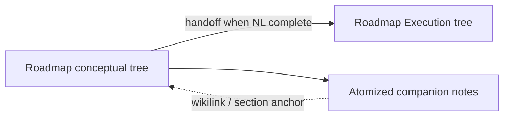

# Full conceptual / execution split (authority + handoff definitions)

## Current baseline (what exists)

- Dual track is already documented: [Dual-Roadmap-Track.md](3-Resources/Second-Brain/Docs/Dual-Roadmap-Track.md), [Vault-Layout.md](3-Resources/Second-Brain/Vault-Layout.md) (Dual roadmap track), [Parameters.md](3-Resources/Second-Brain/Parameters.md) (`effective_track`, **Conceptual autopilot**, canonical target for conceptual vs execution).
- [Roadmap-Gate-Catalog-By-Track.md](3-Resources/Second-Brain/Docs/Roadmap-Gate-Catalog-By-Track.md) already separates **conceptual** (coherence-focused; execution-deferred codes informational) from **execution** (rollup / registry / HR).
- [decisions-log](3-Resources/Second-Brain/Docs/Decisions-Log-Operator-Pick-Convention.md) is still **operator-pick** oriented; [Parameters.md](3-Resources/Second-Brain/Parameters.md) already requires **Conceptual autopilot** rows under `## Conceptual autopilot` for machine-chosen next actions on conceptual track.

Your new definitions **extend** this: conceptual becomes the **explicit** design authority; execution remains parallel with **hard** gates; **handoff** is defined by **NL completeness** of every phase/subphase.

## Target behavior (agreed)

| Layer                                | Role                                                                                                                                                                                                                                  |
| ------------------------------------ | ------------------------------------------------------------------------------------------------------------------------------------------------------------------------------------------------------------------------------------- |
| **Conceptual**                       | **Authority** for *what* the system is: natural language describing behavior, decomposition, and pseudo-code readiness. Soft / verbose logging; no execution-shaped hard stops as completion criteria.                                |
| **Execution**                        | **Evidence and build** under `Roadmap/Execution/`: registry/CI/handoff/rollup-style gates apply here.                                                                                                                                 |
| **Handoff (conceptual → execution)** | All **primary, secondary, tertiary, quaternary…** phase/subphase notes have **behavior fully described in natural language** (per-note checklist).                                                                                    |
| **Post-freeze changes**              | **Mostly freeze-on-flip** preserved. **Do not** rewrite frozen phase bodies for new direction: create **atomized companion notes** (one per change targeting a **specific section** of a frozen note), linked from the roadmap graph. |

## Documentation deliverables (backbone)

1. **[Dual-Roadmap-Track.md](3-Resources/Second-Brain/Docs/Dual-Roadmap-Track.md)** — Add a **Definitions** section (canonical):
  - **Conceptual complete:** system explained in plain NL; ready to start pseudo-code; coherent decomposition.
  - **Ready for handoff to execution:** every phase/subphase note contains **complete behavioral description in NL** (link to checklist template).
  - **Authority:** conceptual map + [Parameters](3-Resources/Second-Brain/Parameters.md) **Conceptual autopilot** / decisions-log rules are the **design** source of truth; execution implements and proves.
  - **Post-freeze amendments:** atomized companion notes per section-level change; frozen bodies unchanged except narrow audit if ever allowed by policy.
2. **[Vault-Layout.md](3-Resources/Second-Brain/Vault-Layout.md)** — Extend Dual roadmap track subsection:
  - Document **companion note** folder/naming (e.g. `Roadmap/Conceptual-Amendments/` or `Roadmap/Amendments/` under project — pick one pattern), frontmatter keys (`amends_section`, `amends_note`, `parent_roadmap_note`, `frozen_parent_at_handoff`), and **one note per section change** invariant.
  - Clarify relationship to **freeze checklist** (flip still sets `conceptual_frozen_at` + stamps).
3. **[Parameters.md](3-Resources/Second-Brain/Parameters.md)** — Tighten:
  - **Canonical target** for conceptual: tie to **NL completeness checklist** (not only handoff_readiness floor).
  - **Conceptual autopilot:** state that autopilot rows are **authority for next action** on conceptual track; **operator pick** rows remain for **execution** commitments where grep-stable picks are needed (or split into two grep-stable families: `Conceptual authority` vs `Operator pick`).
  - Cross-link new **handoff checklist** template.
4. **New short doc** (under [3-Resources/Second-Brain/Docs/](3-Resources/Second-Brain/Docs/)): e.g. `Conceptual-Execution-Handoff-Checklist.md` — Per-phase note: required sections (Overview, Behavior, Interfaces, edge cases, open questions), **subphase** recursion, and **Done = NL complete for behavior**.
5. **[Decisions-Log-Operator-Pick-Convention.md](3-Resources/Second-Brain/Docs/Decisions-Log-Operator-Pick-Convention.md)** (or rename scope) — Add patterns for:
  - **Conceptual authority decision** (machine or human) — grep-stable, distinct from `Operator pick logged` (execution-facing).
  - How **Conceptual autopilot** bullets relate to **D-*** rows (append-only under `## Conceptual autopilot` vs new D-id for major forks).
6. **[Roadmap-Gate-Catalog-By-Track.md](3-Resources/Second-Brain/Docs/Roadmap-Gate-Catalog-By-Track.md)** — Reaffirm: conceptual **never** hard-fails solely on rollup/REGISTRY-CI; execution **owns** those. Point to **verbose logging** locations (continuation log, workflow log, validator reports advisory).

## Rules and agents (sync)

- [.cursor/rules/context/dual-roadmap-track.mdc](.cursor/rules/context/dual-roadmap-track.mdc) — Add **companion note** path: non-destructive **create** of atomized notes under chosen amendments folder; **no** overwrite of frozen conceptual bodies for “new direction.”
- [.cursor/rules/agents/queue.mdc](.cursor/rules/agents/queue.mdc) / [agents/queue.md](.cursor/agents/queue.md) — Resolver: when `effective_track: conceptual`, **do not** bind `effective_target` to execution-only gate signatures; align with [Second-Brain-Config](3-Resources/Second-Brain-Config.md) (`roadmap_next_need_enabled`, `conceptual_skip_auto_repair_primary_codes`, optional `synthesize_followup_when_queue_next_true` policy).
- [.cursor/rules/agents/roadmap.mdc](.cursor/rules/agents/roadmap.mdc) / [agents/roadmap.md](.cursor/agents/roadmap.md) — **Conceptual autopilot** must append authority rows; **handoff** evaluation uses **NL checklist** doc before suggesting `bootstrap-execution-track` or flip.
- [.cursor/rules/agents/validator.mdc](.cursor/rules/agents/validator.mdc) — `roadmap_handoff_auto`** + `effective_track`: treat execution-deferred codes as **log_only** / advisory on conceptual (already in doc; ensure rule text matches).

## Config knobs (optional, in plan execution)

- [Second-Brain-Config.md](3-Resources/Second-Brain-Config.md): e.g. `queue.roadmap_next_need_enabled` default for conceptual-heavy workflows; `synthesize_followup_when_queue_next_true`; explicit list of **verbose** log destinations (reference only).

## Backbone sync

- Per [backbone-docs-sync.mdc](.cursor/rules/always/backbone-docs-sync.mdc): update [.cursor/sync/](.cursor/sync/) mirrors for touched rules; append [.cursor/sync/changelog.md](.cursor/sync/changelog.md).

## Pilot project

- Apply **NL handoff checklist** + one **companion note** example to [1-Projects/genesis-mythos-master/Roadmap/](1-Projects/genesis-mythos-master/Roadmap/) (read-only pilot: one subsection documented as pattern — **no** mass migration of existing notes).

## Out of scope (unless you explicitly expand)

- Rewriting all historical `roadmap-state.md` narrative (migrate incrementally).
- Auto-minting **D-0xx** without human-readable review (keep append-only log + optional promotion workflow).

