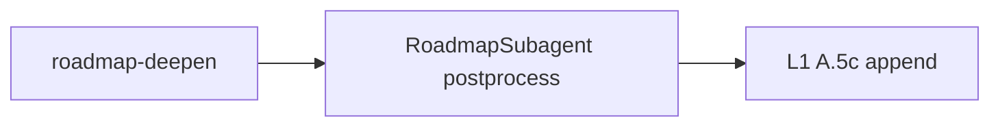

# Conceptual subphase exit (A + D, optional B)

## Diagnosis (repo-grounded)

- **Macro stop already exists:** `[.cursor/rules/agents/roadmap.mdc](.cursor/rules/agents/roadmap.mdc)` **Smart dispatch §4 “Target reached?”** defines `**conceptual_target_reached`** when **all** phases `1..current_phase` satisfy NL checklist + readiness floor + coherence — i.e. **project-scale** completion, not “this tertiary slice is done.”
- **Default forward bias:** [3-Resources/Second-Brain-Config.md](3-Resources/Second-Brain-Config.md) sets `**queue.conceptual_forward_prefer_deepen: true`** and `**Forward-first conceptual override`** in roadmap.mdc pushes structural deepen — correct for growth, wrong when the **slice** should advance.
- **Follow-up source:** `[.cursor/skills/roadmap-deepen/SKILL.md](.cursor/skills/roadmap-deepen/SKILL.md)` step 7 returns `queue_followups`; `[.cursor/agents/roadmap.md](.cursor/agents/roadmap.md)` must **forward** it ([A.5c](.cursor/rules/agents/queue.mdc)). Nothing today **rewrites** that payload for “subphase policy complete → next node.”
- **High-util path:** deepen skill queues **RECAL** instead of another deepen when util high — reads as polish/recal, not “mint next id” ([step 7, lines 221–232](.cursor/skills/roadmap-deepen/SKILL.md)).

## Design

**Introduce a narrow policy: `conceptual_subphase_slice_complete` (working name)** — distinct from `**conceptual_target_reached`**.

| Concept                     | Meaning                                                                                                                                                                                                                                                                                               |
| --------------------------- | ----------------------------------------------------------------------------------------------------------------------------------------------------------------------------------------------------------------------------------------------------------------------------------------------------- |
| `conceptual_target_reached` | Whole conceptual design scope for phases `1..current_phase` met; **terminal** suppress, no follow-up                                                                                                                                                                                                  |
| **Subphase slice complete** | **Current `current_subphase_index` note** meets slice-level criteria; **non-terminal** — emit `**queue_followups.next_entry`** with `**action: deepen`** (or `advance-phase` when appropriate) targeting the **next structural node** (e.g. 4.1.3 → 4.1.4), not another polish pass on the same slice |

**Predicate inputs (all configurable / documented):**

- `effective_track === conceptual`
- **Current slice note** (from `workflow_state.current_subphase_index` → phase tree path) has `**handoff_readiness` ≥** `roadmap.conceptual_subphase_min_readiness` (default: **same as** `conceptual_design_handoff_min_readiness` or slightly lower — decide in implementation)
- **Conceptual-Execution-Handoff-Checklist** NL completeness for **this note only** (not whole project)
- **No hard coherence blockers** (same hard set as roadmap.mdc: `incoherence`, `contradictions_detected`, `state_hygiene_failure`, `safety_critical_ambiguity`)
- Optional: **checklist table** / section markers present and non-empty where required by [Conceptual-Execution-Handoff-Checklist](3-Resources/Second-Brain/Docs/Conceptual-Execution-Handoff-Checklist.md)
- Optional: `**handoff_gaps`** entries matching `**roadmap.conceptual_nonblocking_gap_prefixes`** (or regex list) **do not** block slice exit

**When predicate is true:**

1. **Resolve next node** from Roadmap Structure / phase MOC / sibling ordering (reuse patterns already implied by roadmap-deepen “next target” logic — may require a small **shared helper** description in Parameters or a bullet list in roadmap.mdc: “next sibling tertiary,” “roll up to next secondary,” etc.).
2. **Replace or override** the deepen `queue_followups.next_entry` so the appended line requests deepen (or expand/advance if tree says so) at **next** `effective_target` / `user_guidance` pointing at that path — **do not** request another deepen scoped to the same slice.
3. Append `**decisions-log.md` § Conceptual autopilot** row: `chosen_action: deepen`, `subphase_slice_exit: true`, evidence, `queue_entry_id`.

**When predicate is false:** forward roadmap-deepen payload unchanged (existing behavior).

`**queue_continuation`:** Use `**suppress_followup: false`** when emitting adjusted `**next_entry`**. Optionally add `**rationale_short`** / telemetry field `**conceptual_subphase_exit_applied: true**` in YAML for Layer 1 (no new terminal `suppress_reason` unless the run truly stops).

## A — Roadmap subagent + rules (primary implementation)

Files:

- `[.cursor/agents/roadmap.md](.cursor/agents/roadmap.md)` — After **(3) roadmap-deepen** returns, add a **mandatory branch** (conceptual track only): “**Subphase exit policy**” — evaluate predicate; rewrite `queue_followups`; align `**queue_continuation`** with actual follow-up.
- `[.cursor/rules/agents/roadmap.mdc](.cursor/rules/agents/roadmap.mdc)` — New subsection under **Smart dispatch** (after **Forward-first** / **No-churn guard**): normative rules for slice-level vs macro `conceptual_target_reached`; pointer to Parameters.
- `[.cursor/sync/rules/agents/roadmap.md](.cursor/sync/rules/agents/roadmap.md)` — Sync per [backbone-docs-sync.mdc](.cursor/rules/always/backbone-docs-sync.mdc).

Optional small change to `[.cursor/skills/roadmap-deepen/SKILL.md](.cursor/skills/roadmap-deepen/SKILL.md)`: return structured `**next_structural_target_hint`** (path + subphase-index) when possible so the subagent does not duplicate tree-walk logic — **only if** the skill already computes “next target”; avoid large refactors.

## D — Config + Parameters

- [3-Resources/Second-Brain-Config.md](3-Resources/Second-Brain-Config.md) under `**roadmap:`** add keys, e.g.:
  - `conceptual_subphase_exit_enabled` (default `true` or `false` — recommend `**false`** initially for safe rollout, then operator flips to `true`)
  - `conceptual_subphase_min_readiness` (int, default align with `conceptual_design_handoff_min_readiness`)
  - `conceptual_max_deepen_per_subphase` (optional; if set, compare to **Log** rows with same **Target** / `current_subphase_index`)
  - `conceptual_nonblocking_gap_prefixes` (optional string array)
- [3-Resources/Second-Brain/Parameters.md](3-Resources/Second-Brain/Parameters.md) — New subsection **Conceptual subphase exit**; cross-link [Queue-Sources](3-Resources/Second-Brain/Queue-Sources.md) `effective_followup_required`.

## B — Layer 1 safety net (optional but recommended)

- `[.cursor/rules/agents/queue.mdc](.cursor/rules/agents/queue.mdc)` **A.5c / A.5c.0** — When `**conceptual_subphase_exit_enabled`** and candidate JSONL line is `**RESUME_ROADMAP`** with `action: deepen` and resolver/effective target matches **same** `current_subphase_index` as **last successful** roadmap dispatch for this `project_id` (read `**workflow_state.md`** or `**.technical/queue-gate-state.json`** if you add a field), **and** vault read shows slice predicate would pass — **replace** candidate with synthesized “next node” line (same shape as A.5c.1 synthesis). Document that this is **defense in depth**; primary policy remains Layer 2.
- Keep **single source of truth** for predicate text in **Parameters.md** to avoid L1/L2 drift.

## Docs and backbone sync

- [3-Resources/Second-Brain/Queue-Sources.md](3-Resources/Second-Brain/Queue-Sources.md) — Document how slice-exit affects `**effective_followup_required`** (still true when `next_entry` exists).
- [3-Resources/Second-Brain/Pipelines.md](3-Resources/Second-Brain/Pipelines.md) / [Docs/Conceptual-Autopilot-Verification-Checklist.md](3-Resources/Second-Brain/Docs/Conceptual-Autopilot-Verification-Checklist.md) — Add one verification step: “slice exit → next subphase index advances in follow-up.”
- `.cursor/sync/changelog.md` — One-line entry.

## Prompt Crafter (“every queue line”)

Out of scope for this **behavioral** plan unless you want it in the same PR: extend [User-Questions-and-Options-Reference](3-Resources/Second-Brain/User-Questions-and-Options-Reference.md) / queue schema so crafted lines can set `**params.user_guidance`** or `**effective_target`** overrides for manual steering. **Reference only:** treat Prompt Crafter as the **authoring** path; this plan fixes **runtime** policy in Roadmap + optional L1.

## Risks and mitigations

- **False advance:** Mitigate with defaults `**conceptual_subphase_exit_enabled: false`** or conservative readiness floor; hard coherence blockers always veto.
- **Duplicate logic L1/L2:** Mitigate with Parameters as normative predicate + thin L1 “re-read vault if flag” only in B.
- **Execution track:** Explicitly **no change** to execution deepen behavior unless you add a separate toggle later.

## Implementation order

1. Config keys + Parameters text (D).
2. Roadmap agent + roadmap.mdc policy + sync (A).
3. Queue.mdc guard (B) if time; else Phase 2.
4. Doc updates + checklist.

